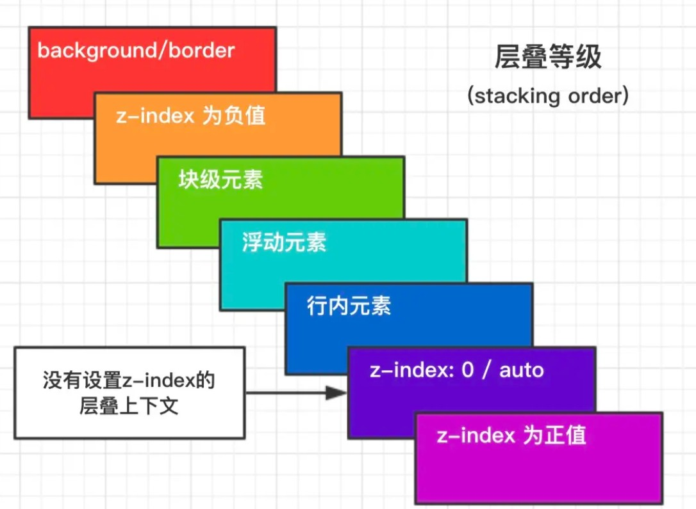
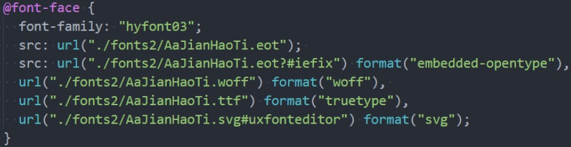
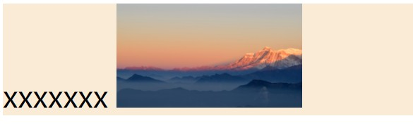
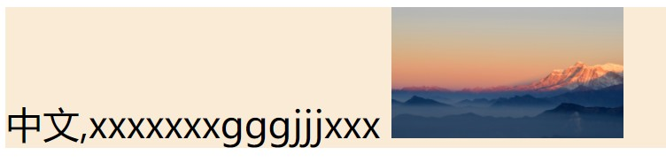
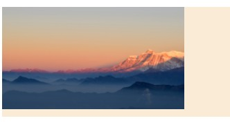
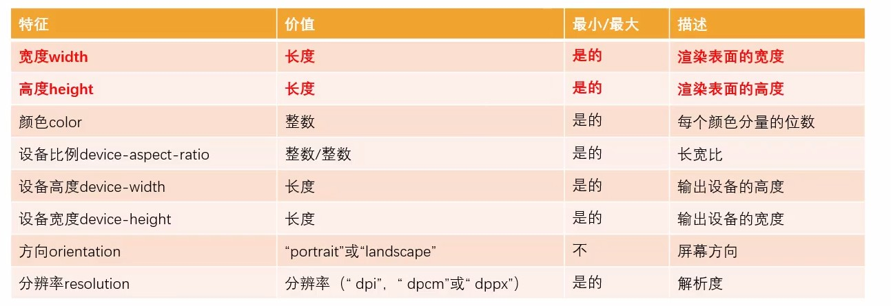
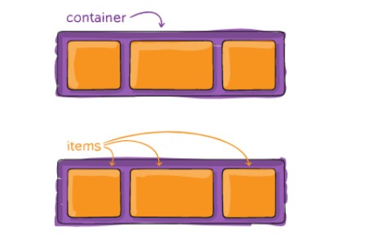
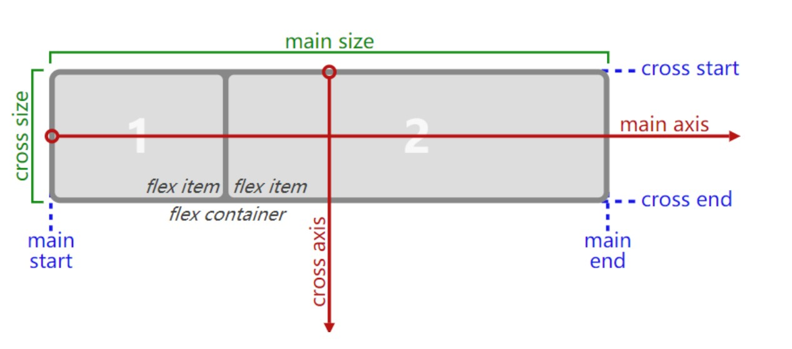

# CSS

```js
@title 'CSS' 
@description 'CSS基础知识点汇总'
@image 'https://mzlin2020-notes.oss-cn-shenzhen.aliyuncs.com/img/css/flex%E5%B8%83%E5%B1%801.jpg'
```

## 一、基础提升

### 1、选择器优先级

1、css优先级？

| 选择器                             | 优先级权重 |
| ---------------------------------- | ---------- |
| !important                         | 10000      |
| 内联样式                           | 01000      |
| ID 选择器                          | 00100      |
| 类选择器、伪类选择器、属性选择器   | 00010      |
| 标签选择器、伪元素选择器           | 00001      |
| 通配选择器、后代选择器、兄弟选择器 | 00000      |

> 知识点1：增加样式权重的方法：`!important`
>
> 用法：`#box{color:red !important;}`

> 知识点2：CSS选择器是从右往左解析
>
> 例如：#div p .class{}，解析时先从class开始解析

2、选择器都有哪些？

**基础选择器**

- 标签选择器：`h1{}`
- 类选择器：`.checked{}`
- ID 选择器：`#picker{}`
- 通配选择器：`*{}`

**组合选择器**

- 相邻兄弟选择器：`A + B`，选中的是兄弟B
- 普通兄弟选择器：`A ~ B`，选中的是除A外所有的兄弟B
- 子选择器：`A > B`
- 后代选择器：`A B`

**属性选择器**

- `[attr]`：指定属性的元素；
- `[attr=val]`：属性等于指定值的元素；
- `[attr*=val]`：属性包含指定值的元素；
- `[attr^=val]`    ：属性以指定值开头的元素；
- `[attr$=val]`：属性以指定值结尾的元素；
- `[attr~=val]`：属性包含指定值(完整单词)的元素(不推荐使用)；
- `[attr|=val]`：属性以指定值(完整单词)开头的元素(不推荐使用)；

如果希望选择有某个属性的元素，而不论属性值是什么，可以使用简单属性选择器

```js
//把包含标题（title）的所有元素变为红色
*[title] {
    color: red;
}
```

或者

```html
<style>[aaa]{ color: aqua;}</style>
<body>
    <div aaa>hello</div>
</body>
```


### 2、BFC

**定义**：

块级格式化上下文（Block Formatting Context，BFC） 是Web页面的可视化CSS渲染的一部分，是块盒子的布局过程发生的区域，也是浮动元素与其他元素交互的区域——MDN

块级格式化上下文，它是页面中的一块渲染区域，并且有一套属于自己的渲染规则，它决定了元素如何对齐内容进行布局，以及与其他元素的关系和相互作用。

> 简单地讲：**块级格式化上下文**，是一块独立的渲染区域，让处于 BFC 内部的元素与外部的元素相互隔离，使内外元素的布局不会相互影响

**BFC布局规则**

1、内部元素垂直方向上，自上而下排列（与文档流排列方式一致）

2、BFC中，两个相邻的容器的margin会发生重叠

3、每个容器的外边框紧挨着BFC容器的左边框

4、BFC 的区域不会与 float 的元素区域重叠

5、计算BFC高度时，浮动子元素也参与计算

6、BFC是独立的容器，容器内部元素不会影响外部元素

**触发BFC**

文档的根元素：`<html>`

| 属性     | 属性值                         |
| -------- | ------------------------------ |
| float    | left、right                    |
| position | absolute、fixed                |
| overflow | auto、scroll、hidden           |
| display  | inline-block、table-cell、flex |

**BFC解决的问题**

1、解决浮动元素令父元素高度塌陷的问题——给父元素开启BFC

原理：计算BFC的高度时，浮动子元素也参与计算

2、非浮动元素被浮动元素覆盖——给非浮动元素开启BFC

原理：BFC的区域不会与float box重叠

3、两栏自适应布局——给固定栏设置固定宽度，给不固定栏开启BFC

原理：BFC的区域不会与float box重叠

4、外边距垂直方向重合的问题——给上box或者下box任意一个包裹新的box（container）并开启BFC

原理：属于同一个BFC的两个相邻的Box会发生重叠


### 3、伪类与伪元素

**伪类**：当已有元素处于某个状态时，为其添加对应的样式，这个状态是根据用户行为而动态变化的

例如：当用户鼠标悬停指定的元素时，`:hover`可以用来描述这个元素的状态

```html
<div>hello</div>
<style>
    div:hover{
        color: red;
    }
</style>
```

**伪元素**：用于创建一些不在DOM树中的元素，并为其添加样式

例如：`::before`可以在一个元素前增加一些文本，并为这些文本添加样式。（虽然用户可以看到这些文本，但是这些文本实际上不在DOM树上）

```html
<div>Hello</div>
<style>
    div::after {
        content: "world";
    }
</style>
```

从上述的例子中可以看出，伪类的操作对象是DOM树中已有的元素，而伪元素则创建了一个DOM树外的元素。因此，伪类与伪元素的区别在于：有没有创建一个文档树之外的元素

**常见的伪类和伪元素**

| 伪元素            | 说明                           |
| -------------- | ---------------------------- |
| ：：first-letter | 设置对象内的第一个字符的样式               |
| ：：first-line   | 设置对象内的第一行的样式                 |
| ：：before       | 设置在对象前发生的内容，用来和content属性一起使用 |
| ：：after        | 设置在对象后发生的内容，用来和content属性一起使用 |
| ：：placeholder  | 设置对象文字占位符的样式                 |
| ：：selection    | 设置对象被选择时的颜色                  |

| 伪类           | 说明                                                 |
| -------------- | ---------------------------------------------------- |
| ：link         | 设置超链接a在未被访问前的样式                        |
| ：visited      | 设置超链接a在其链接地址已被访问过时的样式            |
| ：hover        | 设置元素在其鼠标悬停是的样式                         |
| ：active       | 设置元素在被用户激活时的样式（鼠标点击后释放的事件） |
| ：focus        | 设置元素在称为输入焦点时的样式                       |
| ：first-child  | 设置元素是其父元素的第一个子元素时的样式             |
| ：last-child   | 设置元素是其父元素最后一个子元素时的样式             |
| ：nth-child(n) | 设置元素是其父元素的第n个子元素时的样式              |


### 4、层叠上下文



**层叠上下文**（堆叠上下文，Stacking  Context）,是HTML中一个三维的概念。在CSS2.1规范中，每一个元素的位置是三维的，当元素发生层叠，这时它可能覆盖了其他元素或者被其他元素覆盖；排在z轴越靠上的位置，距离屏幕观察者越近

每个网页都有一个默认的层叠上下文`<html>`，当你给一个定位元素赋予除了`auto`外的z-index值时，就创建了一个新的层叠上下文

在层叠上下文中，其子元素按照上面解释的规则进行层叠。形成层叠上下文的[方法](https://link.juejin.cn?target=https%3A%2F%2Fdeveloper.mozilla.org%2Fen-US%2Fdocs%2FWeb%2FCSS%2FCSS_Positioning%2FUnderstanding_z_index%2FThe_stacking_context)有：

- 根元素`<html></html>`
- `position`值为`absolute | relative`，且`z-index`值不为 `auto`
- `position` 值为 `fixed | sticky`
- `z-index` 值不为 `auto` 的flex元素，即：父元素`display: flex | inline-flex`
- `opacity` 属性值小于 `1` 的元素
- `transform` 属性值不为 `none`的元素
- `mix-blend-mode` 属性值不为 `normal` 的元素
- `filter`、`perspective`、`clip-path`、`mask`、`mask-image`、`mask-border`、`motion-path` 值不为 `none` 的元素
- `perspective` 值不为 `none` 的元素
- `isolation` 属性被设置为 `isolate` 的元素
- `will-change` 中指定了任意 CSS 属性，即便你没有直接指定这些属性的值
- `-webkit-overflow-scrolling` 属性被设置 `touch`的元素


### 5、回流与重绘

**回流（reflow）**

当render tree中的一部分（或全部）因为元素的尺寸、布局、显示隐藏等改变而需要重新构建，就称为回流（又称重排）。

注：每个页面至少需要一次回流，就是在页面第一次加载的时候

**重绘（repaint）**

当render tree中的一些元素需要更新属性，而这些属性只是影响元素的外观、风格、而不会影响布局的，比如color、background-color等，就称为重绘

**区别**

1、引起DOM树结构变化，页面布局变化的行为就是回流

2、只是样式的变化，不会引起DOM树变化、页面布局变化的行为叫重绘

3、回流必将引起重绘，而重绘不一定会引起回流

4、回流的代价要远远大于重绘

**如何减少回流**

1、减少对DOM的增删行为

比如删除某个节点、给某个父元素添加子元素

2、减少几何属性的变化

比如元素的宽高变化、border变化、字体大小变化

（可以将这些变化放在一个class中，直接添加class，这样就只引起一次回流）

3、减少元素位置的变化

比如修改一个元素的margin、padidng

（可以脱离文档流的改变位置会更好）

4、减少获取元素的偏移量属性

例如获取一个元素的scrollTop、scrollLeft等属性，浏览器为了保证值的正确也会回流取得最新的值

5、浏览器窗口尺寸变化

resize事件也会引起回流


### 6、@import和link

```css
/*这两种相同 */
@import url(./style.css);
@import "./style.css";
```

1、link 是 HTML 标签，除了能导入 CSS 外，还能导入别的资源，比如图片、脚本和字体等；而 @import 是 CSS 的语法，只能用来导入 CSS；

2、link 导入的样式会在页面加载时同时加载，@import 导入的样式需等页面加载完成后再加载（可能导致页面闪烁）；

3、link 没有兼容性问题，@import 低版本的浏览器可能不支持；

4、link 可以通过 JS 操作 DOM 动态引入样式表改变样式，而@import不可以。


### 7、CSS隐藏元素

方式一：`overflow：hidden`

说明：overflow的hidden用来隐藏元素溢出部分，占据空间，无法响应事件

方式二：`opacity: 0`

opacity是用来设置元素透明度的，设置透明度为0相当于隐藏了元素，可以响应事件

方式三：`display: none`

彻底隐藏了元素，不占据空间，也不会影响布局

方式四：`visibility：hidden`

元素隐藏但仍然占据空间，无法响应事件

方式四：position

通过position移出可视区域

```css
#box {
    position: absolute;
    left: -99999999px;
    top: -9999999px;
}
```

方式五：z-index

将元素置于其他元素下方

```css
#box {
    position: absolute;
    z-index: -9999;
}
```

其他方式：css裁剪元素、transform: scale(0,0)缩小元素


### 8、雪碧图

雪碧图（CSS Sprites，又称精灵图），其目的是将多张比较小的图片，合并到一张大的图片上，大的图片背景透明。使用的时候，通过把该张图片当做背景图片，通过不同的`background-postion`定位展示那部分的图片

**优点**：

1、降低服务器压力、减少网络请求，从而提高页面性能

2、减少页面图片所占据的字节

**缺点**：

1、后期维护困难，添加一张图片需要重新制作

2、应用麻烦，每一张图片都需要计算位置，通过调整位置来展示图片，对误差要求很严格

3、使用图片有局限，只能用在背景图片`background-image`上，不能用``标签来使用

```css
<style>
#box1 {
    width: 100px;
    height: 100px;
    border:1px black solid;
    background: url('./img/cookie.jpg')-200px -200px;
}
</style>
```


### 9、less基本使用

| 语法         | 示例(说明)                                                                         |
| ---------- | ------------------------------------------------------------------------------ |
| less兼容css  | 可以在less中编写css                                                                  |
| 定义变量       | 定义：`@myColor:chocolate;` 使用：`color:@myColor;`                                  |
| 选择器嵌套      | `#container {  #box { } }`   `#container{ &:hover:{} },其中&代表当前选择器`             |
| 属性值运算      | `.box{ width: 100px * 2; }`                                                    |
| 混入（mixins） | 抽取相同css代码，使用时将其插入。定义：`.same{...}`  使用：`.box{ .same() }`                        |
| 混入（带参数）    | 定义：`.same(@myFont: 30px){ font-szie: @myFont }`  使用：`.box{ .same(chocolate) }` |
| 混入与映射      | 定义混入：`colors{c1: red; c2: blue;}`  映射并使用：`.box{ color: colors()[c1]}`          |
| 继承         | 定义：`.myColor: { ... }`  继承使用： `.box { &: extend(.myColor)  }`                  |
| 注释         | `//`注释与`/**/`都可以使用                                                             |


### 10、position属性

| 属性值   | 描述                                                         |
| -------- | ------------------------------------------------------------ |
| absolute | 绝对定位，脱离文档流，触发BFC。相对于离它最近的有定位的父元素进行定位（如果没有定位的元素则相对于浏览器窗口） |
| fixed    | 固定定位，脱离文档流，触发BFC，开启fixed的元素不会滑动，始终固定在同一个位 |
| relative | 相对定位，相对于其原来的位置进行定位                         |
| static   | 默认值，没有定位，元素出现在正常的文档流中                   |
| inherit  | 规定从父元素继承position属性的值                             |


### 11、继承性

**1、css的某些属性具备继承性**

如果一个css属性具备继承性，那么在该元素上设置后，它的后代元素都可以继承这个属性。

但是如果后代元素自己有设置该属性，那么优先使用后代元素自己的属性（不管继承过来的属性权重有多高）

通过查询文档可以查看每一个css属性是否具备继承性

**2、强制继承**

有些属性没有继承性，也可以使它强制被继承

```css
/*例如：border不具备继承性，我们使它可以被继承*/
    <style>
      div#box {
        color: red;
        border: 1px solid black;
      }
      span {
        border: inherit;
      }
    </style>

    <div id="box">
      <span>span</span>
    </div>
```


### 12、css函数

**var**

在css中可以自定义属性，属性名以两个`--`开始。然后通过`var函数`来进行使用

```html
<style>
    html {
        --myColor: green;
    }
    .box {
        color: var(--myColor);
    }
</style>
<body>
  <div class="box">字体颜色</div>
</body>
```

自定义的属性只有在自身及后代元素中生效，所以推荐将自定义属性定义在html中，或者使用`:root`选择器

**calc**

calc()函数允许在声明CSS属性值时执行一些计算，支持加减乘除运算，通过用来设置一些元素的尺寸或者位置

```css
.container {
    width:500px;
    height:100px;
}
.content {
    width:calc(100% - 50px);
    height:100px;
}
```

> 注意：+ 和 - 运算符的两边必须要有空白字符，否则不生效

**blur**

blur()函数将高斯模糊应用于输出图片或者元素上，通常回合`filter`与`backdrop-filter`这两个属性一起使用。

```css
img {
    filter: blur(2px);
}
```


### 13、长文本省略号显示

单行——固定的三行文本

```css
white-space: nowrap;
overflow: hidden;
text-overflow: ellipsis;
```

多行(不同浏览器可能存在兼容的问题)

```css
overflow: hidden;
text-overflow: ellipsis;
display: -webkit-box;
-webkit-line-clamp: 2; // 显示的行数
-webkit-box-orient: vertical;
```


### 14、结构伪类

**1、nth-child()** 

选中相同兄弟元素中的第几个，如nth-child(1)表示选中第一个

案例：选中列表的前两个li

```css
/*方式一*/
ul li:nth-child(1),ul li:nth-child(2) {
    color: red;
}
/*方式二*/
ul li:nth-child(-n + 2) {
    color: red;
}
```

案例：选中列表的偶数的li（奇数则是`2n+1`）

```css
ul li:nth-child(2n) {
    color: red;
}
```

**2、nth-last-child()**

选中相同兄弟元素中倒数第几个

**3、nth-of-type()**

选中相同兄弟元素的第几个（可以排除其他干扰项）

```html
  <style>
    ul>li:nth-of-type(2){
      color: red;
    }
  </style>

  <ul>
    <li>内容1</li>
    <span>干扰项</span>
    <li>内容2</li>
    <li>内容3</li>
    <li>内容4</li>
  </ul>
```

**4、其他结构伪类**

+ first-child，等同于nth-child(1)

+ last-child，等同于nth-last-child(1)

+ first-of-type，等同于nth-of-type(1)

+ last-of-type，等同于nth-last-of-type(1)

+ only-child，父元素中唯一的子元素（仅对父元素存在一个子元素时生效）

+ only-of-type，是父元素中唯一的这种类型的子元素

+ :root，根元素，就是HTML元素

```css
: root {
    font-size: 30px  
}
```

+ :empty代表一个元素中内容完全空白的元素

**否定伪类**

:not(x)，其中x是一个简单选择器，除去x，其他的元素都被选中


### 15、web fonts

在设置`font-family`字体时，感觉系统的提供的字体不满足个性化需求，也可以引入网络字体

将字体放在对应的目录中，通过`@font-face`来引入字体，并设置格式，并通过`font-family`来使用引进的字体

```html
  <style>
    @font-face {
      font-family: my-font;
      src: url('./fonts/YunFengMaLiangTi-2.ttf');
    }
    div {
      font-family: my-font ;
    }
  </style>
</head>
<body>
  <div>hello world</div>
</body>
</html>
```

问题：但是并不是所有的浏览器都能识别`.ttf`文件，有些浏览器不兼容

解决：为了使所有浏览器都能够识别，我们需要该字体的其他所有格式的文件

> `https://font.qqe2.com`，通过一些网站将文件转换为其他格式，并引入项目

当在引入所有的文件后，css有一个固定的编写方式




### 16、字体图标

字体图标有来源于字体，具备字体的各种优势

1、放大不会失真

2、可以应用字体的样式

3、占用空间较小

**示例：阿里巴巴矢量图标库**

1、直接下载为`SVG/Png/AI`等格式，并直接引入页面（不推荐）

2、下载图标资源到本地并引用

+ 首先在`https://www.iconfont.cn/`资源管理 => 我的项目 => 新建项目（默认配置即可）
+ 在网站海量的图标中任选图标加入购物车 => 添加至新建的项目
+ 下载图标项目文件并解压至代码中

```html
<!-- 引用资源 -->
<link rel="stylesheet" href="./font/iconfont.css" />

<!-- 使用图标: 该&#xe6b8;可在“我的项目”中查找 -->
<span class="iconfont">&#xe6b8;</span>
```

> 更多的使用方式下载的代码中`demo_index.html`都有说明


### 17、Emmet语法

 Emmet语法的前身是Zen coding,它使用缩写,来提高html/css的编写速度, Vscode内部已经集成该语法 

**> 和 +**

`>`表示子代，`+`表示兄弟

```html
<!--  div> p + span  -->
<div>
    <p></p>
    <span></span>
</div>
```

***和^ **

`*`表示多个，`^`表示上一级

```html
<!--  ul>li*3 -->
<ul>
    <li></li>
    <li></li>
    <li></li>
</ul>
```

```html
<!-- div>p^span -->
<div>
    <p></p>
</div>
<span></span>
```

**元素[属性键值对]{内容}**

```html
<!--  div[id="box"]{hello world}   -->
<div id="box">hello world</div>

<!-- 其他写法 -->
<!-- div#box  或者  #box-->
<div id="box"></div>

<!-- div.box  或者   .box -->
<div class="box"></div>
```

**$数字**

```html
<!-- ul>li{内容$}*4 -->
  <ul>
    <li>内容1</li>
    <li>内容2</li>
    <li>内容3</li>
    <li>内容4</li>
  </ul>
```

**css Emmet**

+ font-szie——fz

+ background-color——bgc

+ w100——width：100px;

+ h100——height：100px;
  
  大致都可以通过css样式进行推断
  
  

### 18、行内元素间的空格

当多个行内元素在同一个中显示，且编写的代码如下所示时，那么他们之间就会存在空格

```html
<span>hello</span>
<span>hello</span>
<span>hello</span>
```

```js
//结果
hello hello hello
```

他们之间存在了空格

去除空格的方式

1、删除换行符（不推荐）

`<span>hello</span><span>hello</span><span>hello</span>`

2、父元素font-size设置为0

```css
//以上边的例子演示
body{
    font-size: 0;
}
span {
    font-size:16px;
}
```

3、使用浮动

```css
span {
    float: left;
}
```

4、使用flex布局（推荐）

```css
body {
    display: flex;
}
```


### 19、vertival-align

该属性会影响在一个行盒(line box)中，行内块级元素的垂直方向位置。该属性是设置在line box中的行内级元素上

> 行盒：就是一个块级元素独占一行，但是这一行中可能存在span等行内元素、也可能存在img等行内块级元素。但是这些行内级、行内块级的高度往往一致。行盒将他们都包裹在内，并把这一行的块级元素撑高。

**案例分析**



```html
<head> 
  <style>
    #container {
      border: 1px solid solid;
      background-color: antiquewhite;
    }
    img{
      width: 100px;
    }
  </style>
</head>
<body>
  <div id="container">
    <span>xxxxxxx</span>
    
  </div>
</body>
```

可以看到最终图片下方有一段没被覆盖到的空间，为什么图片没有完全对齐底部呢？遵循什么样的垂直对齐方式？

默认的对齐方式是基线对齐方式（vertical-align：baseline），可简单理解为x字母的下方就是基线的位置



即使没有文本，依然是基线的对齐方式，图片下方还是留有一定的空间



解决方案：将`vertival-align`设置为`top/bottom/middle`都可以解决，或者直接将图片改为块级元素


### 20、浏览器前缀

官方文档专业术语：vendor-specific-extensions(供应商特定扩展)

为什么需要浏览器前缀：某些CSS属性刚开始并没有成为标准，浏览器为了防止W3C后续修改名字，就给这些属性添加前缀，后续即使标准改了，这些有前缀的属性也能根据现行标准进行解析

**常见的前缀**

```js
-webkit-   #Safari Chrome
-moz-      #FireFox
-ms-  mso- #IE
-o-  -xv-  #Opera
```

添加了对应的前缀，就只有对应的浏览器才能解析使用

> https://caniuse.com/兼容性查询
>
> 一般而言，使用某一CSS属性时，如果对应的浏览器及版本兼容性呈现黄色，说明需要通过浏览器前缀来使其适配该属性。不过，后来出现的模块化打包工具（如postCss）会自动识别CSS与浏览器的兼容情况，并自动添加前缀


### 21、媒体查询

媒体查询是一种提供给开发者针对不同设备需求进行定制化开发的一个接口，开发者可以根据设备的类型或者特性来修改页面

**媒体查询使用的三种方式**

**方式一**：通过`@media和@import`来使用不同的CSS规则

语法：`@import url('./css/base.css') 媒体特性;`

需求：当满足最大宽度800px时，导入并应用样式，反之不导入

```html
  <style>
    @import url('./css/base.css') (max-width: 800px);
  </style>
```

**方式二**：使用`media属性为<style> <link> <source>`和其他HTML元素指定的媒体类型

语法：`<link rel="stylesheet" media="媒体特性" href="./css/base.css"> 或者@media 媒体特性{}`

```html
<link rel="stylesheet" media="(max-width: 800px)" href="./css/base.css">
```

或者

```css
  <style>
    @media (max-width: 800px) {
      body {
        background-color: chocolate;
      }
    }
  </style>
```

**方式三**：使用`Window.matchMedia()`和`MediaQueryList.addListener()`方法来测试和监控媒体状态

**媒体类型**

在使用媒体查询时，必须指定要使用的媒体类型（可选），默认为all类型。

+ all：适用于所有设置
+ print：适用于在打印预览模式下在屏幕上查看的分页材料和文档
+ screen：主要用于屏幕
+ speech：主要用于语音合成器

**媒体特性**

媒体特性描述了浏览器、输出设备或是预览环境的具体特性：

通常将媒体特性描述为一个表达式，每条表达式必须用括号括起来



> 注：也可以多条件匹配，需用到and or not逻辑运算符


### 22、css布局单位

一般而言，可以将单位分为`绝对单位`和`相对单位`

**绝对单位**

绝对单位与其他任何东西都没有关系，通常被认为总是相同的大小。例如px(像素）

**相对单位**

相对单位相对于其他东西来调整大小，比如视图端口的大小。它的优势在于能够适应很多不同的页面，更灵活。

| 相对单位 | 相对于                                                           |
| ---- | ------------------------------------------------------------- |
| em   | 相对于自身字体的大小(2em，则为font-size的两倍)，自身没有font-size则相对于父元素的font-size |
| rem  | 相对于根元素的font-size                                              |
| vw   | 视窗宽度的1%                                                       |
| vh   | 视窗高度的1%                                                       |

**1、em**

```css
#container {
    font-size: 20px;
}
#box {
    /*自身无font-size，则相对于父元素*/
    width: 5em; /*相当于100px*/
    height: 5em;
    border: 1px solid black;
}
```

**2、rem**

```css
html {
    /*默认是16px*/
    font-size: 10px;
}
#box {
    width: 5rem; /*相当于50px*/
    height: 5rem;
    border: 1px solid black;
}
```

**3、vw/vh**

```css
#box {
    width: 100vw; /* 相当于视窗的100%宽度 */
    height: 100vh;
    background-color: chocolate;
}
```


### 23、移动端适配方案

+ 方案一：百分比设置（不推荐）
+ 方案二：rem单位 + 动态html的font-szie
+ 方案三：vw单位
+ 方案四：flex弹性布局

**rem适配方案**

原理：rem单位是相对于html元素的font-size来设置的，可以通过将css的单位设置为rem，然后根据不同屏幕大小动态修改html的font-size，从而达到自适应布局的效果

要点：1、统一使用rem单位       2、动态修改html元素的font-size

**方式一：媒体查询**

通过媒体查询来设置不同尺寸范围内的屏幕html的font-size尺寸

```html
  <style>
    @media screen and (min-width:320px) {
      html{
        font-size: 20px;
      }
    }
    @media screen and (min-width:375px) {
      html{
        font-size: 24px;
      }
    }
    @media screen and (min-width:414px) {
      html{
        font-size: 28px;
      }
    }
    @media screen and (min-width:480px) {
      html{
        font-size: 32px;
      }
    }
    #box {
      width: 5rem;
      height: 5rem;
      background-color: chocolate;
    }
  </style>
```

缺点：需要编写大量的媒体查询语句，且不能实时进行更新

**方式二：js监听视口，动态修改**

通过js事件监听视口的改变，然后动态修改html的font-size

```html
  <script>
    const htmlEl = document.documentElement
    function setFontSize() {
      const htmlWidth = htmlEl.clientWidth //获取视口宽度
      htmlEl.style.fontSize = htmlWidth / 10 + 'px' //自定义大小
    }
    setFontSize() 
    window.addEventListener('resize', setFontSize)

  </script>
  <style>
    #box {
      width: 5rem;
      height: 5rem;
      background-color: chocolate;
    }
  </style>
```

> 问题：html的font-size的初始值应该设置为多少好呢？
>
> 答：根据设计稿，一般的设计稿视口为375px或者750px，那么html的font-size可以设置为37.5或者75
>
> 问题：假设html的font-szie设置为37.5px，设计稿中存在一个100px的盒子，换算成rem为多少呢？
>
> 答：100 / 37.5 rem

如果项目中突然有需要适配移动端的方案，也可以批量将px替换成rem。使用以下方式：

1、使用less的函数、混入、映射解决

```less
.pxToRem(@px) {
    result: 1rem * ( @px/ 37.5 ) // 这里的37.5得根据设计稿确定
}
.box {
    width: .pxToRem(100)[result];
    height: pxToRem(100)[result];
}
```

2、使用webpack的工具（postcss-poxtorem）自动进行转换

3、使用`px to rem`这个vscode插件

**方式三：lib-flexible库**

直接引用该库即可，该库的核心代码就是方式二的思想


**23、vw的单位换算**

vw、wh是相对于视口的单位，一般开发中我们仅用vw即可。

在现代浏览器中，我们通常使用的是vw，该布局相比于rem布局更加简洁，但是仍然需要进行换算

**方案一：手动换算**

设计稿：375px，将100px转换为对应的vw值

100/3.75 = 26.778vw

**方案二：less函数**

```less
@vwUnit: 3.75; //根据设计稿
.pxToVw(@px) {
    result: (@px/@vwUnit) * 1vw
}
.box {
    width: .pxToVw(100)[result];
    height: .pxToVw(100)[result];
}
```

**方案三：使用webpack**

可以借助webpack的工具（postcss-px-to-viewport-8-plugin）来完成自动的转化

**方案四：vscode插件**

使用`px to rem`这个vscode插件，并根据设计稿的调整该插件是基于375px还是750px


### 24、css画图

**三角形**

通过改变参数可以做出各种形状的三角形

原理：设置div的宽高均为0，调整div四个方向的border，并适当隐藏不需要的border，就可以做出三角形

```html
<style>
    div {
        width: 0px;
        height: 0px;
        border-bottom: 100px solid red;
        border-right: 100px solid transparent; /*transparent：透明颜色*/
        border-top: 100xpx solid transparent;
        border-left: 100px solid transparent;
    }
</style>
<div></div>
```

**线条**

```html
<style>
    div{
        width: 200px;
        border-bottom: 1px black solid;
    }
</style>
<div></div>
```

当然也可以用`<hr>`来画一条线（全屏）

**圆形**

```html
<style>
    div{
        width: 100px;
        height: 100px;
        border-radius: 50%;
        border: 1px black solid;
    }
</style>
<div></div>
```


### 25、清除浮动

1、什么是浮动？

**浮动元素会脱离文档流并向左/向右浮动，直到碰到父级元素或者另一个浮动元素**

2、为什么要清除浮动？

因为浮动元素会脱离正常的文档流，并不会占据文档流的位置。

一个元素的高度默认由其子元素的高度决定，当子元素浮动时，父元素就是去了高度。造成所谓的高度塌陷。对页面的布局造成影响。所以，需要清除浮动造成的影响

**1、clear清除浮动**

clear属性不允许被清除浮动的元素的左边/右边挨着浮动元素，原理是在被清除浮动的元素上边或者下边添加足够的清除空间（clear不是直接应用在浮动元素上的）

方式一：增加一个没有高度的div，并给其设置`clear:both`

原理：这个div的左边右边不允许存在浮动元素，那么浏览器为了满足其需求，会让其渲染在浮动元素下方。间接就把父元素的高度撑起来了

```html
<style>
    .son1,.son2{
        width: 100px;
        height: 100px;
        border: 1px black solid;
        float: left;
    }
    .son3{
        clear: both;
    }
</style>
<div class="parent">
    <div class="son1"></div>
    <div class="son2"></div>
    <div class="son3"></div>     <!-- 清除浮动应用在非浮动元素上-->
</div>
```

缺点：增加了一个div标签，增加了页面的渲染负担

方式三：利用伪元素+ 方式一

```html
<style>
.parent::after {
  content: '';
  height: 0;
  display: block;
  clear: both;
}
</style>
```

利用伪元素替代方式一的div标签。伪元素是不会被渲染出来的，很好地提高了性能

**2、BFC清除浮动**

原理：开启BFC的元素内部，浮动元素也参与高度计算

一般使用：给父元素设置`overflow:auto`或者`overflow:hidden`来开启BFC

**3、暴力清除浮动**

给父元素设置固定高度


### 26、requestAnimationframe

requestAnimationframe（请求动画帧），主要用于实现动画

> MDN：
>
> `window.requestAnimationFrame()`告诉浏览器——你希望执行一个动画，并且要求浏览器在下次重绘之前调用指定的回调函数更新动画。该方法需要传入一个回调函数作为参数，该回调函数会在浏览器下一次重绘之前执行

语法：`window.requestAnimationFrame(callback)`，callback是**下一次重绘之前更新动画帧所调用的函数**。该回调函数会被传入DOMHighResTimeStamp参数，它表示requestAnimationFrame() 开始去执行回调函数的时刻。

当需要取消动画时，使用`cancelAnimationFrame(id)`，与定时器类似

```js
// 执行动画
const id = window.requestAnimationFrame(() => {
    // 动画相关操作
    // 通常需要回调window.requestAnimationFrame
}) 

// 取消动画
cancelAnimationFrame(id)
```

**示例**

```js
// box往右平移动画
const btn = document.getElementsByTagName("button")[0];
const box = document.getElementsByTagName("div")[0]; //需开启绝对定位

btn.addEventListener("click", () => {
    let timer = null; //标识
    let left = 0;

    const callback = () => {
        box.style.left = `${left++}px`;
        // 回调执行
        if (parseInt(box.style.left) < 200) {
            window.requestAnimationFrame(callback);
        } else {
            // 取消动画
            window.cancelAnimationFrame(timer);
        }
    };
    timer = window.requestAnimationFrame(callback);
});
```


**前端动画方案**

css动画：transition、animation

js动画：基于定时器改变DOM的动画、canvas动画、requestAnimationframe

其中，requestAnimationframe动画要比定时器动画流畅许多

**requestAnimationframe动画的优势**

定时器`setTimeout(callback, time)`动画和`requestAnimationFrame(callback)`动画十分相似。都是每个一段时间执行callback去操作DOM实现动画（两者均需递归调用）

但是定时器动画可以**自由**设置时间间隔，而requestAnimationFrame的间隔由浏览器（或者说显示器的刷新率）决定（60hz约17毫秒）

定时器动画容易出现**抖动**，原因在于定时器任务被放入异步队列，只有当主线程任务执行完后才会执行队列中的任务，因此实际执行时间总是比设定时间要晚，并且，定时器的固定时间间隔不一定与屏幕刷新间隔时间相同，会引起丢帧

而`requestAnimationFrame`能够做到，精准严格的卡住浏览器重绘的时间，在重绘之前执行


### 27、css优化

**优化加载性能**

1、对css进行压缩，减少文件体积

2、复合样式属性的效率比使用多个单一样式属性低（但几乎可以忽略不计）

3、减少使用`@import`，而采用`<link>`（link 导入的样式会在页面加载时同时加载，@import 导入的样式需等页面加载完成后再加载（可能导致页面闪烁））

**选择器优化**

由于css选择器是从右往左进行匹配。**嵌套选择器**：过度嵌套选择器可能会增加样式规则的匹配难度，导致渲染性能下降

```css
// 不推荐写法
aaa bbb > #id {}
// 修改后的写法
#id {}
```

**渲染性能**

1、减少页面的重绘、重排

2、不滥用性能损耗高的属性：动画过渡、阴影渐变、布局属性position等

3、图片图标资源过多时考虑使用雪碧图

4、合理使用web字体


### 28、postCss

postCss是css的转换编译器。类似于babel对js的转换，它能够实现对css代码的分析和转换。同时，它也提供了强大的插件机制来做自定义转换

应用场景：

1、转换代码适配低版本浏览器。（利用postCss的autoprefixer插件可以自动给css添加浏览器前缀）

2、转换开发者编写的最新版本的css特性

更多应用场景可以查看postCss插件市场：`https://www.postcss.parts/`


### 29、盒模型

页面渲染时，dom 元素所采用的 **布局模型**。可通过`box-sizing`进行设置。根据计算宽高的区域可分为：

- `content-box` (W3C 标准盒模型)
- `border-box` (IE 盒模型)
- `padding-box` (FireFox 曾经支持)
- `margin-box` (浏览器未实现)

**盒子的组成**

四部分：margin（外边距）、border（边框）、padding（内边距）、content（内容）

margin、border、padding是css属性，因此可以通过这三个属性来控制盒子的这三个部分。而content则是HTML元素的内容。

**两种盒模型**

盒子的宽度和高度的计算方式由box-sizing属性控制,

css的盒模型包括**IE盒子模型**和**标准的W3C盒子**

1、**标准盒模型**：

```css
box-sizing:content-box
```

content-box：默认值，width和height属性分别应用到元素的内容框，在宽度和导读之外绘制元素的内边距、边框、外边距

```css
width = content-width
height = content-height
```

2、**IE盒模型**

```css
box-sizing:border-box
```

border-box:为元素设定的width和height属性决定了元素的边框盒。就是说，为元素指定的任何内边距和边框都将在已设定的高度和宽度内进行绘制。

```css
width = content-width + padding-width + border-width
heigth = content-heigth + padding-heigth + border-heigth
```

**盒子成分分析**

margin、padding、border都包含：top、bottom、left、right四个方向

```css
/*margin实例*/
margin-top /*上外边距*/
margin-bottom /*下外边距*/
margin-left /*左外边距*/
margin-right /*右外边距*/
```

简写

```css
/*以margin为例*/
margin:10px ; /*设置四条边的外边距相等*/

margin:10px 5px;  /*设置上下10px,左右5px*/

margin:10px 8px 5px; /*设置上外边距10px，左右外边距8px 下外边距5px*/

margin:10px 8px 5px 3px; /*设置顺序为上、右、下、左的外边距*/
```

## 

## 二、居中

### 1、水平居中

**A.行内元素**

```css
.parent {
    text-align: center;
}
```

**B.块级元素: margin**

```css
.son {
    width: 100px;
    margin: 0 auto;
}
```

**C.块级元素：flex布局**

```css
.parent {
    display: flex;
    justify-content: center;
}
```

**D.块级元素：绝对定位 **

1.transform

```css
.son {
    position: absolute;
    left: 50%;
    transform: translate(-50%, 0);
}
```

`transform: translate(-50%, 0);`基于自身的宽度，向左偏移

2.left

```css
.son {
    position: absolute；
    width: 宽度；
    left：50%；
    margin-left: -0.5*宽度
}
```

### 2、垂直居中

**A.行内元素**

```css
.parent {
    height: 高度;
}
.son {
    line-height: 高度;
}
```

注：子元素line-height的值=父元素height的值，才有效

**B.块级元素：flex布局**

```css
.parent {
    display:flex;
    align-item: center;
}
```

**C.块级元素：绝对定位**

1.transform

```css
.son {
    position: absolute;
    top: 50%;
    transform: translate(0, -50%)
}
```

2.top:50%

```css
.son {
    position: absolute;
    top: 50%;
    height: 高度;
    margin-top: -0.5*高度
}
```

3.top/bottom: 0

```css
.son {
    position: absolute;
    top: 0;
    bottom: 0;
    margin: auto 0;
}
```

**D.块级元素：table**

```css
.parent {
    display: table-cell;
    vertical-align: middle;
}
.son {
    display: inline-block;
}
```

### 3、水平垂直居中

**A.绝对定位**

1.margin负值

```js
.son {
    position: absolute;
    left: 50%;
    top: 50%;
    margin-left: -0.5*宽度;
    margin-top: -0.5*高度;
}
```

2.transform

```css
.son {
    position: absolute;
    left: 50%;
    top: 50%;
    transform: translate(-50%, -50%)
}
```

3.left/right/top/bottom: 0

```css
.son {
    position: absolute;
    left: 0;
    right: 0;
    top: 0;
    bottom: 0;
}
```

**B.Flex布局**

```css
.parent {
    display: flex;
    justify-content: center;
    align-items: center;
}
```

**C.table**

```css
.parent {
    display :table-cell;
    vertical-align: center;
}
.son {
    display: inline-block;
}
```

**D.grid布局**

```css
.parent {
    display: grid;
}
.son {
    margin: auto;
}
```


## 三、CSS动画

### 5.1 CSS动画-animation

避免混淆

| 属性             | 含义                        |
| -------------- | ------------------------- |
| animation（动画）  | 用于设置动画属性，它是一个简写的属性，包含8个属性 |
| transition（过渡） | 用于设置元素的样式过渡               |
| transform（变形）  | 用于元素进行旋转、缩放、移动和倾斜         |
| translate（移动）  | translate是transform的一个属性值 |

css动画，也称为关键帧动画，通过@keyframes来定义关键帧

**1、 animation的属性**

| 属性                        | 描述                                    |
| ------------------------- | ------------------------------------- |
| animation-duration        | 指定动画完成一个周期所需要时间，单位秒或毫秒，默认是0           |
| animation-timing-function | 指定动画计时函数，即动画的速度曲线，默认是ease             |
| animation-delay           | 指定动画延迟时间，即动画何时开始，默认是0                 |
| animation-direction       | 指定动画播放的方向，默认是nomal                    |
| animation-fill-mode       | 指定动画填充模式，默认是none                      |
| animation-iteration-count | 指定动画播放次数，默认是1                         |
| animation-play-state      | 指定动画播放状态，正在运行或暂停，默认是running，也可以paused |
| animation-name            | 指定@keyframes动画的名称（必须）                 |

**2、定义关键帧**

案例分析：实现div旋转一圈

```css
    @keyframes theName {
      from {
        transform: rotate(0deg);
      }
      to {
        transform: rotate(360deg);
      }
    }
```

`theName`是动画的名字，`from`就是最开始的那一帧，`to`表示结束时的那一帧。所以也可以用（0%，100%来表示）

```css
@keyframes theName{
  0%{
    transform: rotate(0deg);
  }
  100%{
    transform: rotate(360deg);
  }
}
```

使用关键帧添加动画

```css
animation: theNmae 2s;
//或者
animation-name: theName;  //不可省略
animation-duration: 2s;
```

**3、 属性说明**

1、指定动画的运动曲线

```css
animation-timing-function:ease /** linear、ease-in、ease-out、ease-in-out **/
```

| 值           | 说明                  |
| ----------- | ------------------- |
| linear      | 动画从头到尾的速度是相同的       |
| ease        | 默认，低速开始，然后加快，在结束前变慢 |
| ease-in     | 动画以低速开始             |
| ease-in-out | 低速开始和结束             |

2、指定动画填充模式

可以规定动画开始前和动画结束后，处于什么状态。这对于改善动画体验有极大的作用

| 属性        | 说明                         |
| --------- | -------------------------- |
| none      | 默认                         |
| forwards  | 动画完成后，元素保持为最后一帧的状态         |
| backwards | 有动画延迟时，动画开始前，元素状态保持为第一帧的状态 |
| both      | 上述两者效果都有                   |

```css
/**进度条**/
    #box {
      height: 20px;
      border: 1px solid black;
      background: linear-gradient(#0ff,#0ff);
      background-repeat: no-repeat;
      background-size: 0;
      animation: move linear 2s forwards;
    }
    @keyframes move{
      100% {
        background-size: 100%;
      }
    }
```

3、播放方向

animation-direction

| 属性                | 说明                                      |
| ----------------- | --------------------------------------- |
| nomal             | 默认值                                     |
| reverse           | 动画方向播放                                  |
| alternate         | 动画在奇数次（1、3、5...）正向播放，在偶数次（2、4、6...）反向播放 |
| alternate-reverse | 动画在奇数次（1、3、5...）反向播放，在偶数次（2、4、6...）正向播放 |

### 5.2 CSS动画-transition

`css transition`提供了一种在更改css属性时控制动画速度的方法

transition翻译成中文是过渡的意思，顾名思义，它就是专门做过渡动画的，比如一些放大缩小，隐藏显示等

| 值                          | 说明                        |
| -------------------------- | ------------------------- |
| transition-duration        | 效果的持续时间                   |
| transition-property        | 指定CSS属性的name，transition效果 |
| transition-timing-function | 运动曲线                      |
| transition-delay           | 延迟执行                      |

1、transition-duration

鼠标移入，div于2秒内逐渐变大

```css
  div{
      width:100px;
      height:100px;
      border-radius: 50%;
      background:#f40;
      transition-duration: 2s;
  }
  div:hover{
      height:150px;    
      width:150px;
  }
```

2、transition-property

指定CSS属性的name，transition效果只对该属性生效

```js
div{
    width:100px;
    height:100px;
    border-radius: 50%;
    background:#f40;
    transition-duration:1s;
    transition-property:width;
}
div:hover{    
    width:150px;
}
```

案例中的效果只生效了width

3、transition-timing-function

指定transition效果的转速曲线，有多个曲线可选：`ease linear、ease-in、ease-out、ease-in-out`

### 5.3 CSS动画-transform

`transform`字面上就是变形，改变的意思

> 注：并非所有的盒子都能形变，非替换的行内元素不能进行形变

它有很多的属性，以下四个属性比较常见

+ rotate旋转
+ skew扭曲
+ scale缩放
+ translate移动

**简单使用**

默认是以box的中心作为原点进行变形，可以通过`tansform-origin`改变原点的位置

```css
.box {
    transform: scale(60%, 60%)
}
```

**应用**

```css
div {
    width:100px;
    height:100px;
    border-radius: 50%;
    background:#f40;
    animation: scale infinite 2s linear alternate-reverse;
}
@keyframes scale{
  0% {
    transform: scaleX(0.1);
  }
  100% {
    transform: scaleX(1);
  }
}
```

### 5.3 css动画与js动画

**1、css动画**

css动画是关键帧动画，只需要添加关键帧的位置，其他的未定义的帧会被**自动生成**。

缺点：因为往往只是设置几个关键帧的位置，所以在进行动画控制的时候比较困难，不能再半路暂停动画；或者在动画过程中添加一些其他操作，都不大容易

优点：

+ 浏览器可以对动画进行优化
+ 帧速不好的浏览器，CSS3可以自然降级兼容
+ 代码简单，调优方向固定

**2、JS动画**

JS动画是逐帧动画，**在时间帧上绘制内容**，一帧一帧的，可造性很高，几乎可以完成任何想要的动画形式。

缺点：由于逐帧动画的内容不一样，会增加制作的负担，占用比较大的资源空间

优点：

+ 动画播放细腻、丝滑
+ 可控性高，可以制作炫酷的高级动画

**3、CSS动画与JS动画的区别**

1、CSS动画是关键帧动画，JS是时间帧动画。JS的动画可控性要更高一些

2、性能方面，JS实现需要频繁地修改DOM，不断地进行回流和重绘，开销十分大。并且js运行在浏览器的主线程中，可能会导致线程阻塞，从而掉帧。

而CSS动画是运行在合成线程中的，不会阻塞主线程，并且 在合成线程中完成的动作不会触发回流和重绘

总结：**CSS动画的渲染成本小，执行效率高。所以只要能用CSS实现的动画，就不要采用JS去实现**


## 四、css布局

### 7.1 两列布局

**1、左列定宽，右列自适应**

实现方式一：`float:left; margin-left: 浮动元素宽度;`

```html
<style>
    .left {
        height: 100px;
        background-color: antiquewhite;
        width: 200px;
        float: left; 
    }
    .right {
        height: 100px;
        background-color: aqua;
        margin-left: 200px; /* 主要代码*/
    }
</style>
```

利用了左侧元素浮动脱离文档流，右侧的左边距等于浮动元素的宽度

实现方式二：`float:left; 右侧开启BFC`

```html
<style>
    #left {
        float: left;
        height: 500px;
        background-color: blanchedalmond;

    }
    #right {
        overflow: hidden; /*开启BFC*/
        height: 500px;
        background-color: burlywood;
    }
</style>
```

原理：开启BFC区域不会与浮动区域重叠

实现方式三：使用绝对定位

```html
<style>
    #parent {
        position: relative; /*父相*/
    }
    #left {
        position: absolute; /*子绝*/
        top: 0;
        left: 0;
        height: 300px;
        width: 100px;
        background-color: burlywood;
    }
    #right {
        position: absolute; /*子绝*/
        left: 100px;
        right: 0;
        height: 300px;
        background-color: cadetblue;
    }
</style>
```

实现方式四：使用flex布局

```html
<style>
    #parent {
        display: flex;
    }
    #left {
        height: 300px;
        width: 100px;
        background-color: cadetblue;
    }
    #right {
        flex: 1;
        height: 300px;
        background-color: chocolate;
    }
</style>
```

**2、右列定宽，左列自适应**

与上方反着来

**3、一列不定宽，一列自适应**

效果：一个盒子宽度随着内容的变化而变化，另一个自适应

实现方式一：使用float+overflow实现

```html
  <style>
    #left {
      float: left;
      height: 300px;
      background-color: cadetblue;
    }
    #right {
      overflow: hidden;
      height: 300px;
      background-color: chocolate;
    }
  </style>
```

实现方式二：flex布局

```html
  <style>
    #parent {
      display: flex;
    }
    #left {
      height: 300px;
      background-color: cadetblue;
    }
    #right {
      flex: 1;
      height: 300px;
      background-color: chocolate;
    }
  </style>
```


### 7.2 三列布局

**1、两列定宽，一列自适应**

实现方式一：float + margin

```html
<style>
    #parent {
        min-width: 300px;
    }
    #left {
        float: left;
        width: 100px;
        height: 300px;
        background-color: antiquewhite;
    }  
    #center {
        float: left;
        width: 200px;
        height: 300px;
        background-color: chartreuse  ;
    }
    #right {
        margin-left: 300px;
        height: 300px;
        background-color: brown;
    }
</style>
```

实现方式二：float + BFC

利用bfc区域

```html
<style>
    #left {
        float: left;
        width: 100px;
        height: 300px;
        background-color: antiquewhite;
    }  
    #center {
        float: left;
        width: 200px;
        height: 300px;
        background-color: chartreuse  ;
    }
    #right {
        overflow: hidden;
        height: 300px;
        background-color: brown;
    }
</style>
```

实现方式三：flex布局

```html
<style>
    #parent {
        display: flex;
    }
    #left {
        width: 100px;
        height: 300px;
        background-color: antiquewhite;
    }  
    #center {
        width: 200px;
        height: 300px;
        background-color: chartreuse  ;
    }
    #right {
        flex: 1;
        height: 300px;
        background-color: brown;
    }
</style>
```


**2、两侧定宽，中间自适应**

#### 双飞翼布局

特点：使用margin属性

双飞翼布局是中间栏不变，将内容部分为两边挪出位置

```html
<style>
    #header {
        height: 60px;
        background-color: #ccc;
    }
    /* 左边 */
    #left {
        float: left;
        margin-left: -100%; /*挪到中间部分的左边*/
        width: 100px;
        height: 300px;
        background-color: antiquewhite;
        opacity: 0.5;  /* 方便观察*/
    }

    /* 中间 */
    #center {
        float: left;
        height: 300px;
        background-color: #7fffd4;
        width: 100%;
    }
    #center_inbox {
        height: 300px;
        margin:0 120px 0 100px;  /*避免中间的两端内容被两侧的遮挡住*/
    }

    /* 右边 */
    #right {
        float: left;
        width: 120px;
        height: 300px;
        margin-left: -120px; /* 挪到中间部分的右边，值等于自身宽度*/
        background-color: chocolate;
        opacity: 0.5; /* 方便观察*/
    }
    #footer {
        clear: both; /* 清除浮动 因为左中右元素全部脱离文档流了*/
        height: 60px;
        background-color: #ccc;
    }
</style>

<body>  
    <!-- 头部 -->
    <div id="header"></div>

    <!-- 主要部分 -->
    <div id="parent">
        <div id="center">
            <div id="center_inbox">中间自适应</div>
        </div>
        <div id="left">左列定宽</div>
        <div id="right">右列定宽</div>
    </div>

    <!-- 底部 -->
    <div id="footer"></div>
</body>
```


#### 圣杯布局

特点：使用padding属性

圣杯布局是中间栏为两边挪出位置

```html
<style>
    #header, #footer {
        height: 50px;
        background-color: #ccc;
    }
    #parent {
        height: 300px;
        padding: 0 100px 0 100px; /*左右paading分别等于左右盒子的宽*/
    }
    #left {
        float: left;
        margin-left: -100%; /*使其位于左侧*/
        position: relative;
        left: -100px; /*摆正位置*/
        height: 300px;
        width: 100px;
        background-color: cornsilk;
    }
    #center {
        float: left;
        width: 100%;
        height: 300px;
        background-color: darkkhaki;
    }
    #right {
        float: left;
        margin-left: -100px; /*使其上去一行*/
        position: relative;
        left: 100px; /*摆正位置*/
        width: 100px;
        height: 300px;
        background-color: darkseagreen;
    }
</style>

<body>
    <div id="header"></div>
    <div id="parent">

        <div id="center">中间自适应</div>
        <div id="left">左列定宽</div>
        <div id="right">右列定宽</div>

    </div>
    <div id="footer"></div>
</body>
```

除了圣杯布局，双飞翼布局还有很多其他的布局方式

1、flex布局

```html
<div id="parent">
    <div id="left">左边固定宽度</div>
    <div id="center">中间自适应</div>
    <div id="right">右边固定宽度</div>
</div>

<style>
    #parent {
        display: flex;
        height: 300px;
    }
    #left {
        width: 100px;
        background-color: indianred;
    }
    #center {
        flex: 1;
        background-color: lightblue;
    }
    #right {  
        width: 100px;
        background-color: khaki;
    }
</style>
```

2、position布局

```html
<style>
    #parent {
        position: relative;
    }
    #left {
        position: absolute;
        top: 0;
        left: 0;
        height: 300px;
        width: 100px;
        background-color: lightblue;
    }
    #center {
        margin-left: 100px;
        margin-right: 120px;
        height: 300px;
        background-color: lightcoral;
    }
    #right {
        position: absolute;
        top: 0;
        right: 0;
        width: 120px  ;
        height: 300px;
        background-color: lightgoldenrodyellow;
    }
</style>
```


### 7.3 多列布局

#### 多列等宽布局

1、flex布局

```html
<style>
    #parent {
        display: flex;
        height: 300px;
    }
    #column {
        flex: 1;
        margin: 0 10px;
        border: 1px black solid;
    }
</style>

<body>
    <div id="parent">
        <div id="column">第一列</div>
        <div id="column">第二列</div>
        <div id="column">第三列</div>
        <div id="column">第四列</div>
    </div>
</body>
```

2、使用float浮动

```html
<style>
    #parent {
        height: 300px;
    }
    #column {
        float: left;
        width: 20%;
        margin: 0 10px;
        border: 1px black solid;
    }
</style>
```

缺点：需要清除浮动


#### 九宫格布局

1、使用flex布局

```html
<style>
    #parent {
        display: flex;
        height: 500px;
        flex-direction: column;
    }
    .row {
        display: flex;
        flex: 1;
    }
    .item {
        border: 1px black solid;
        flex: 1;
    }
</style>

<body>
    <div id="parent">
        <div class="row">
            <div class="item">1</div>
            <div class="item">2</div>
            <div class="item">3</div>
        </div>

        <div class="row">
            <div class="item">4</div>
            <div class="item">5</div>
            <div class="item">6</div>
        </div>

        <div class="row">
            <div class="item">7</div>
            <div class="item">8</div>
            <div class="item">9</div>
        </div>
    </div>
</body>
```


### 7.4 全屏布局

#### 绝对定位

```html
<style>
    html,body {
        margin: 0;
        padding: 0;
    }
    #parent {
        height: 100%;
    }
    #top {
        position: absolute;
        top: 0;
        left: 0;
        right: 0;
        height: 40px;
        border: 1px black solid;
    }
    #left {
        position: absolute;
        left: 0;
        top: 40px;
        bottom: 40px;
        width: 120px;
        border: 1px black solid;
    }
    #right {
        position: absolute;
        /* overflow: auto; */
        right: 0;
        left: 120px;
        top: 40px;
        bottom: 40px;
        border: 1px black solid;
    }
    #bottom {
        position: absolute;
        bottom: 0;
        left: 0;
        right: 0;
        height: 40px;
        border: 1px solid black;
    }
</style>
<body>
    <div id="parent">
        <div id="top">top</div>
        <div id="left">left</div>
        <div id="right">right</div>
        <div id="bottom">bottom</div>
    </div>
</body>
```

#### flex布局

```html
<style>
    * {
        padding: 0;
        margin: 0;
    }
    html,body,#parent {
        height: 100%;
    }
    #parent {
        display: flex;
        flex-direction: column;
    }
    #top {
        height: 40px;
        background-color: rosybrown;
    }
    #middle {
        flex: 1;
        display: flex;
    }
    #left {
        flex: 1;
        background-color: sandybrown;
    }
    #right {
        flex: 1;
        background-color: springgreen;
    }
    #bottom {
        background-color: royalblue;
        height: 30px;
    }
</style>
<body>
    <div id="parent">
        <div id="top">top</div>
        <div id="middle">
            <div id="left">left</div>
            <div id="right">right</div>
        </div>
        <div id="bottom">bottom</div>
    </div>
</body>
```


## 五、Flex布局

### 8.1 重要概念



1、开启了flex布局的元素叫做`flex container`，其直接子元素叫做`flex item`

2、`flex item`的布局受`flex container`的控制，且`flex item`不再严格区分块级元素和行内级元素

3、怎么开启flex布局，display设置为`flex`或者`inline-flex`

> 注：display：inline-flex设置后，flex-container变为行内级元素。不过该属性较少使用

**模型**



`main axis`：主轴，默认开启flex布局的元素沿着主轴分布

`cross axis`：交叉轴

`main start/main end`：表示主轴的开始位置/结束位置

`cross start/cross end`：表示交叉轴的开始位置/结束位置

### 8.2 flex container属性

**flex-direction**

该属性决定了主轴的方向，有4个取值

+ row（默认，主轴从左往右）
+ row-reverse（主轴从右往左）
+ column（主轴从上往下）
+ column-reverse（主轴从下往上）

**flex-wrap**

该属性决定了`flex container`是单行还是多行，取值有三个

+ nowrap（默认，单行）
+ wrap（多行）
+ wrap-reverse（多行，在多行的分布下，cross start与cross end相关）

**flex-flow**

该属性属性是flex-direction和flex-wrap的简写，并且对于两个顺序没有要求

**justify-content**

该属性决定了`flex items`在主轴上的对齐方式

+ flex-start（默认值，与main start对齐）
+ flex-end（与main end对齐）
+ center（居中）
+ space-between（flex items之间距离相等，左右两个items分别紧贴flex container边缘）
+ space-around（fiex item的距离相等，左右两个items离边缘的距离是其他items之间距离的一般）
+ space-evenly（flex items之间距离都相等）

**align-item**

该属性决定了`flex items`在交叉轴上的对齐方式

+ nomal（默认）
+ stretch（当flex items在交叉轴方向的size为auto时，会自动拉伸至flex container）
+ flex-start（与cross start对齐）
+ flex-end（与cross end对齐）
+ center（居中）
+ baseline（与基准线对齐）

**align-content**

该属性决定了多行flex items在交叉轴上的对齐方式，用法与justify-tontent类似，取值也与其相同

### 8.3 flex item属性

**order**

该属性决定了`flex items`的排布顺序

可以设置任意整数，值越小就越排在前面，默认为0

**align-self**

该属性可以覆盖flex container设置的align-items，其取值与align-items一致

**flex-grow**

该属性决定了`flex items`如何扩展（拉伸）

在flex container在主轴方向上有剩余空间时有效，可以将剩余的空间分配给flex items，可以甚至任意整数（默认是0）

**flex-shrink**

该属性决定了`flex items`如何收缩（缩小）

仅当`flex items`在主轴方向上超过了`flex container`的空间时有效，可以设置任意非负数字，默认是1

**flex**

该属性是`flex-grow flex-shrink flex-basis`的简写，可以指定1个，2个或者3个值

当指定一个值时，无单位值会被当做`flex-grow`的值，有单位为`flex-basis`

当指定两个值时，一个无单位的值被当做`flex-shrink`，另一个有单位的值为`flex-basis`

当指定三个值，第一个为无单位值的`flex-gow`，第二个为无单位值的`flex-shrink`，第三个为有单位的值的`flex-basis`
