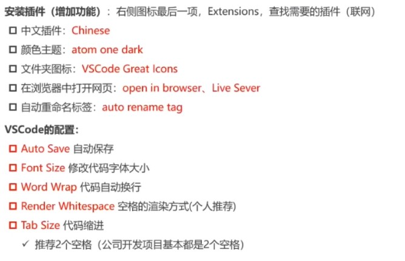

# HTML

```js
@title 'HTML' 
@description 'HTML新特性与常用的DMO、BOM操作汇总'
@image 'https://mzlin2020-notes.oss-cn-shenzhen.aliyuncs.com/img/html/vscode%E5%9F%BA%E7%A1%80%E6%8F%92%E4%BB%B6%E4%B8%8E%E9%85%8D%E7%BD%AE.jpg'
```

## 1、HTML语义化标签

HTML5语义化标签是指正确的标签包含了正确的内容，结构良好，便于阅读。

**什么是语义化？**

html5新增的语义化标签：

```html
<!--均为块级元素-->
<header>头部</header> <!--页眉-->
<nav>导航栏</nav>
<section>文档中的节</section><!--网页文档部分，长表单或者文章-->
<main>主要区域</main><!--页面的主要部分-->
<artical>文章内容</artical><!--定义页面独立的内容-->
<aside>侧边栏</aside>
<footer>底部</footer>  <!--页脚部分-->
<figure>图像</figure><!--文档中的图像-->
```

**为什么要语义化？**

1、页面呈现出清晰的内容结构、代码结构

2、有利于SEO，和搜索引擎建立良好沟通，有助于爬虫爬取有效信息

（爬虫依赖标签来确定关键字的权重，更多的语义化标签，帮助爬虫抓取更多的有效信息，也增加了页面权重）

3、便于团队开发和维护，语义化更具可读性

## 2、iframe是什么？缺点？

定义：iframe元素会创建包含另一个文档的**内联框架**

( iframe一般用来包含别的页面，例如我们可以在我们自己的网站页面加载别人网站的内容)

提示：可以将提示文字放在`<iframe></iframe>`,在不支持iframe的浏览器会显示出来

**优点：**

+ iframe可以实现无刷新文件上传
+ iframe可以跨域通信
+ 解决了加载缓慢的第三方内容如图标和广告等的加载问题

**缺点：**

1、会阻塞主页面的onload事件（ 文档内容完全加载完成会触发该事件 ）

2、搜索引擎无法解读这种页面，不利于SEO

3、iframe和主页面共享连接池，而浏览器对相同区域有限制所以会影响性能（页面会增加服务器的http请求）

## 3、Doctype作用？严格模式与混杂模式如何区分？

Doctype（document type）

Doctype声明位于文档最前面，告诉浏览器以何种方式来渲染页面

主要有两种模式：**标准模式（严格模式）、混杂模式**

**严格模式：**是指浏览器按照W3C标准来解析代码，呈现页面

**混杂模式：**是指浏览器按照自己的方式来解析代码，使用一种比较宽松的向后兼容的方式来显示页面。删除了`<!Doctype>`，意味着把如何渲染html页面的权利交给了浏览器，有多少种浏览器就有多少种展示方式。

## 4、html新增元素

1、为了更好的实践web语义化，增加了：header，footer，nav，aside，section等语义化标签；

2、为增强表单，为input增加了color，email，date，range

3、存储方面：提供了sessionStorage，localStorage和离线存储。（这些存储方式方便数据在客户端的存储和获取）

4、多媒体方面：规定了多媒体音频（audio）、视频元素（vedio）

5、其他：地理定位、canvas画布、拖放、多线程编程的web worker 和 websocket协议

## 5、html5媒体

## 6、meta标签

meta标签对网页能否被搜索引擎检索，在搜索中的排名中起着关键性的作用

| 属性         | 说明               |
| ---------- | ---------------- |
| content    | 表示要设置的项的值（必填的属性） |
| http-equiv | 设置的项（非必填）        |
| name       | 设置的项（非必填）        |

**一、http-equiv属性**

该属性一般设置的都是与**http请求头**相关的信息，设置的值会关联到http头部。

浏览器在请求服务器获取html的时候，服务器会将html中设置的meta放在响应头中返回给浏览器。

常见的值：`content-type、expires、refresh、set-cookie、window-target、charset、pragma`

**1、content-type**

例如：`<meta http-equiv="content-type" content="text/html charset=utf8"> `

可以用来声明文档类型、字符集。这样子声明，服务器返回的响应头：`content-type:text/html charset=utf8`

**2、expires**

用于设置资源的过期时间

例如：`<meta http-equiv="expires" content="31 Dec 2021" >`

最终返回给客户端的响应头： `expires: 31 Dec 2008`

**3、refresh**

该种设定表示多少秒后自动刷新页面，并自动跳转到指定的页面。不设置url那么浏览器刷新本页面

`<meta http-equiv="refresh" content="5 url=http://www.baidu.com">`

5秒后跳转至百度

**4、window-target**

强制页面在当前窗口以独立页面显示，可以防止别人在框架中调用自己的页面

`<meta http-equiv="window-target" content="_top">`

**5、pragma**

禁止浏览器从本地计算机的缓存中访问页面的内容

`<meta http-equiv="pragma" content="no-cache">`

**二、name属性**

name属性主要用于**描述网页**，与对应的content中的内容主要是便于搜索引擎查找信息和分类信息用的，用法与http-equiv相同，name设置属性名，content设置属性值

**1、author**

用来标注网页的作者

`<meta name="author" content="mzlin2020@163.com"`

**2、description**

用来告诉搜索引擎当前网页的主要内容，是关于网站的一段描述信息

`<meta name="description" content="这是一个什么样的、干什么的网站">`

**3、keywords**

设置网页的关键字，来告诉浏览器关键字是什么。是一个经常被用到的名称。它为文档定义了一组关键字，某些搜索引擎在遇到这些关键字时，会用这些关键字对文档进行分类

`<meta name="keywords" content="clothes shoes">`

**4、robots**

告诉搜索引擎机器人抓取哪些页面，`all/none/index/noindex/follow/nofollow`

`<meta name="robots" content="all">`

`all`：文件将被检索，且页面上的链接可以被查询

`none`:文件将不被检索，且页面上的链接不可以被查询

`index`:文件将被检索

`follow`：页面上的链接可以被查询

`noindex`：文件将不被检索，但是页面上的链接可以被查询

`nofollow`：文件将不被检索，页面上的连接可以被查询

## 7、HTML / XHTML / XML

+ HTML：超本文标记语言，是语法较为松散的，不严格的web语言
+ XML：可扩展的标记语言，主要用于存储数据和结构，可扩展
+ XHTML：可扩展的超文本标记语言，基于XML，作用与HTML类似，但语法更加严格

其中，XHTML是HTML的规范版本

## 8、行内元素和块元素

1、块元素：独占一行，并且自动填满父元素，可以设置margin和padding及高度和宽度

2、行内元素：不会独占一行，width和height会失效，并且在垂直方向的padding和margin会失效

| 元素类型 | 列举                                 |
| ---- | ---------------------------------- |
| 行内元素 | `a、b、span、img、input、select、string` |
| 块级元素 | `div、ul、li、dl、dt、dd、h1至h5、p`等      |
| 空元素  | `<br>、<hr>、、<link>、<meta>`    |

## 9、src与href的区别

1、src用于替换当前元素；

src是source的缩写，指向外部资源的位置，指向的内容将会嵌入到文档中当前标签所在位置；

2、href用于在当前文档和引用资源之间确立联系

href是`Hypertext Reference`的缩写，指向网络资源所在位置，建立和当前元素或当前文档之间的链接

## 10、vscode插件与配置



## 11、H5新增全局属性data-

该属性用于自定义属性数据，然后在js中DOM操作通过dataset获取到，通常用于HTML与js数据之间的传递

```html
//实例
<body>
  <div class="box" name="linzm" data-age="18" data-sex="男"></div>
  <script>
    const box = document.querySelector('.box')
    console.log(box.dataset)
  </script>
</body>
```

```js
//输出
DOMStringMap
age: "18"
sex: "男"
```

## 12、图片预览功能

本地获取上传的图片对象，并进行预览

```html
<body>
    <input type="file">
    </div>
    <script>
        const input = document.getElementsByTagName('input')[0]
        const preview = document.querySelector('.preview')

        input.onchange = e => {
            // 获取file对象
            const file = e.target.files[0]
            // 转为base64
            const reader = new FileReader()
            reader.onload = e => {
                console.log(e.target.result);
                    preview.src = e.target.result
            }
            reader.readAsDataURL(file)
        }
    </script>
</body>
```


## 13、浏览器录屏功能

仅限于支持`navigator.mediaDevices`功能的浏览器，录制范围不包括桌面。

```vue
<template>
    <div style="width: 100%">
        <div class="container">
            <div class="title">屏幕录制</div>
            <div class="content">
                <div class="videoBox" :style="{ width: `${videoWidth}px`, height: `${videoHeight}px` }">
                    <video
                        class="recordVideo"
                        :style="{ width: `${videoWidth}px`, height: `${videoHeight}px` }"
                        muted
                        autoPlay
                        x5-video-player-fullscreen="true"
                        x5-playsinline="true"
                        playsInline
                        webkit-playsinline="true"
                        crossOrigin="anonymous"
                        ref="recordVideoRef"
                    ></video>

                    <video
                        v-if="videoStatus === 'playing'"
                        class="playVideo"
                        :style="{ width: `${videoWidth}px`, height: `${videoHeight}px` }"
                        muted
                        autoPlay
                        x5-video-player-fullscreen="true"
                        x5-playsinline="true"
                        playsInline
                        webkit-playsinline="true"
                        crossOrigin="anonymous"
                        :src="videoUrl"
                        ref="playVideoRef"
                    ></video>
                </div>
                <div class="btns">
                    <a-button type="primary" @click="onStartOrEnd">
                        {{ videoStatus === "inRecording" ? "录制中，点击结束" : videoUrl ? "重新录制" : "开始录制" }}
                    </a-button>
                    <a-button
                        v-if="!!videoUrl"
                        type="primary"
                        @click="
                            () => {
                                if (playVideoRef) {
                                    playVideoRef.play();
                                } else {
                                    if (recordVideoRef) {
                                        recordVideoRef.srcObject = null;
                                    }
                                    videoStatus = 'playing';
                                }
                            }
                        "
                    >
                        {{ "播放" }}
                    </a-button>
                    <a :download="fileName" :href="videoUrl" v-if="!!videoUrl">
                        {{ "下载" }}
                    </a>
                </div>
            </div>
        </div>
    </div>
</template>

<script setup>
import { ref, onUnmounted } from "vue";
import { message } from "ant-design-vue";

const videoWidth = Math.floor(window.screen.width * 0.36);
const videoHeight = Math.floor(window.screen.height * 0.36);
let mediaRecorder = null;
let chunks = [];
let stream = null;

const recordVideoRef = ref();
const playVideoRef = ref();
const videoUrl = ref("");
const fileName = ref("");
const videoStatus = ref("ready");

const onStartOrEnd = () => {
    if (mediaRecorder) {
        if (videoStatus.value === "inRecording") {
            mediaRecorder.stop();
            videoStatus.value = "ready";
        } else {
            if (videoUrl.value) {
                window.URL.revokeObjectURL(videoUrl.value);
                fileName.value = "";
                videoUrl.value = "";
                mediaRecorder = null;
                videoStatus.value = "ready";
            }
        }
    } else if (recordVideoRef.value) {
        if (navigator?.mediaDevices?.getDisplayMedia) {
            navigator.mediaDevices
                .getDisplayMedia({
                    video: true,
                })
                .then((newStream) => {
                    if (recordVideoRef.value && newStream) {
                        stream = newStream;
                    }
                    const mimeType = MediaRecorder.isTypeSupported("video/webm; codecs=vp9")
                        ? "video/webm; codecs=vp9"
                        : "video/webm";
                    try {
                        const options = {
                            audioBitsPerSecond: 128000,
                            videoBitsPerSecond: 5000000,
                            mimeType,
                        };
                        const recorder = new MediaRecorder(stream, options);
                        recorder.ondataavailable = (e) => {
                            if (e.data && e.data.size > 0) {
                                chunks.push(e.data);
                            }
                        };
                        recorder.onstop = () => {
                            if (videoStatus.value === "inRecording") {
                                videoStatus.value = "ready";
                            }
                            const blob = new Blob(chunks, {
                                type: "video/webm",
                            });
                            fileName.value = `${new Date().getTime()}.webm`;
                            const newAudioUrl = window.URL.createObjectURL(blob);
                            videoUrl.value = newAudioUrl;
                            chunks = [];
                        };
                        mediaRecorder = recorder;
                        if (recordVideoRef.value && stream) {
                            recordVideoRef.value.srcObject = stream;
                        }
                        mediaRecorder.start();
                        videoStatus.value = "inRecording";
                    } catch (e) {
                        message.error(`MediaRecorder creation failed: ${e}. mimeType:${mimeType}`);
                    }
                })
                .catch(() => {
                    message.error("授权失败，请点击设置->隐私设置和安全->网站设置->摄像头，打开允许使用");
                });
        } else {
            message.error("浏览器不支持getDisplayMedia");
        }
    }
};

onUnmounted(() => {
    videoUrl.value && window.URL.revokeObjectURL(videoUrl.value);
});
</script>

<style scoped lang="less">
.container {
    width: 100%;
    padding: 20px;
    .title {
        font-size: 20px;
        font-family: "SourceHanSansCN-Bold" !important;
        font-weight: 600;
        color: #fff;
        text-align: center;
        margin-bottom: 20px;
    }
    .content {
        display: flex;
        flex-direction: column;
        align-items: center;
        .videoBox {
            box-sizing: border-box;
            border: 1px solid #aaa;
            position: relative;

            video {
                position: absolute;
                top: 0;
                left: 0;
            }
            .recordVideo {
                z-index: 1;
            }
            .playVideo {
                z-index: 2;
            }
        }
        .btns {
            display: flex;
            align-items: center;
            margin-top: 20px;

            button {
                margin: 0 20px;
            }
        }
    }
}
</style>
```

