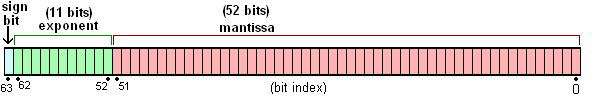

# JavaScript

```js
@title 'JavaScript基础（一）' 
@description 'JavaScript应知应会基本知识点一'
@image 'https://gw.alipayobjects.com/zos/rmsportal/JiqGstEfoWAOHiTxclqi.png'
```

## 一、ES5

### 1、call、apply

JavaScript中的每一个Function对象都有一个call（）方法和一个apply（）方法

**两个作用**

call和apply的作用是一模一样的，只是传参的形式有区别而已

1、改变this的指向

2、借用别的对象的方法

3、调用函数，因为apply、call方法会使函数立即执行

**不同之处**

1、call

```js
//call
function.call(thisObj [, arg1[, arg2[, ...argN]]])
```

可以接收多个参数（新的this对象，参数1，参数2，...）如果没有提供thisObj对象，那么Global对象将被用作thisObj，并且无法传递任何参数。

2、apply

```js
//apply
function.apply(thisObj [, argArray])
```

最多只能有两个参数（新的this对象，一个数组）。如果给该方法传递多个参数，则把参数写进数组里面；如果没有提供任何参数，那么Global对象将被用作thisObj，并且无法传递任何参数

**改变函数运行时的this指向**

```js
    function greet() {
        const reply = [this.animal, 'typically sleep between', this.sleepDuration].join(' ');
        console.log(reply);
    }

    const obj = {
        animal:'cats',sleepDuration:'12 and 16 hours'
    };

    greet.call(obj);
```

**调用构造函数实现继承**

```js
    function Product(name, price) {
        this.name = name;
        this.price = price;
    }

    function Food(name,price) {
        Product.call(this,name,price);
        this.category = 'food';
    }

    function Toy(name,price) {
        Product.call(this,name,price);
        this.category = 'toy';
    } 

    let cheese = new Food('feta',5);
    let fun = new Toy('robot',40);
```

在一个子构造函数中，可以通过调用父构造函数的call方法来实现继承。上方例子中，使用Food和Toy构造函数创建的对象实例都拥有Product构造函数中添加的name属性和price属性，但category属性是在各自的构造函数中定义的。

**其他用法**

1、求数组的最大/最小值

```js
let arr1 = [1, 2, 19, 6];
//例子：求数组中的最值
console.log(Math.max.call(null, 1,2,19,6)); // 19
console.log(Math.max.call(null, arr1)); // NaN
console.log(Math.max.apply(null, arr1)); //  19 直接可以用arr1传递进去
```

注：在es6中，使用扩展运算符更加简便

```js
let arr1 = [1, 2, 19, 6];
console.log(Math.max(...arr1));
```

2、数组拼接

```js
let arr1 = [1,2,3];
let arr2 = [4,5,6];

//数组的concat方法：返回一个新的数组
let arr3 = arr1.concat(arr2); 
console.log(arr3); // [1, 2, 3, 4, 5, 6]

console.log(arr1); // [1, 2, 3] 不变
console.log(arr2); // [4, 5, 6] 不变
// 用 apply方法
[].push.apply(arr1,arr2);  // 给arr1添加arr2
console.log(arr1); // [1, 2, 3, 4, 5, 6]
console.log(arr2); // 不变
```

> 延伸：concat与apply的区别：concat作用单一，是用来合并数组的，并且不会对原数组产生影响。apply作用较多，也可以用来合并两个数组，但是会影响其中一个数组

注：es6扩展运算符也可以使其更加简洁

```js
console.log(arr1.push(...arr2));
console.log(arr1);
```

### 2、 bind

官方： **bind（）**方法创建一个新函数，当调用时，将其关键字设置为提供的值。

bind（）方法也是用来改变this的指向的,不同的是bind方法返回一个修改后的函数

```js
const obj = {
    name:"inSideName",
    fn:function() {
        console.log(this.name);
    }
}

let foo = obj.fn 
const fn = foo.bind(obj) //返回一个函数
fn()
```

总结：call和apply都是改变上下文中的this并立即执行这个函数，bind方法可以让对应的函数想什么时候调就什么时候调用，并且可以将参数在执行的时候添加

### 3、 this

JavaScript是一个文本作用域的语言。就是说，一个变量的作用域，在写这个变量的时候确定。this关键字是为了在js中加入动态作用域而做出的努力。所谓动态作用域，就是说变量的作用范围，是根据函数的调用的位置而定的，从这个角度来理解this，就简单的多。

this是js中的动态作用域机制，具体来说有**四种**，优先级由低到高分别如下：

1、**默认的this绑定**：就是说，一个函数中使用了this，但是没有为this绑定对象。这种情况下，非严格默认this就是全局变量Node环境中的global，浏览器环境中的window

2、**隐式绑定**：使用obj.foo()这样的语法来调用函数的时候，函数foo中的this绑定到obj对象

3、**显示绑定**：foo.call(obj, ...)，foo.apply(obj, [ ... ]), foo.bind(obj ...)

4、**构造绑定**：new foo(), 这种情况，无论foo是否做了绑定，都要创建一个新的对象，然后foo中的this引用这个对象

5、**补充**：

A、严格模式下，默认的this就是undefined

B、构造函数通常不使用return关键字，他们通常初始化新对象，当构造的函数体执行完毕时，它会显示返回。在这种情况下，构造函数调用表达式的计算结果就是这个新对象的值。

C、如果构造函数使用return语句，返回一个原始值，或没有返回值，这时候将会忽略返回值，同时使用这个新对象作用调用结果。

D、如果构造函数显示地使用return语句返回一个对象，那么调用表达式的值就是这个对象

**实例验证**

**this的指向在函数定义的时候是确定不了的，只有函数执行的时候才能确定this到底指向谁**，**实际上this的最终指向的是那个调用它的对象**

1、this指向window

```js
    function foo(){
    const name = "linming";
    console.log(this.name); //undefined
    console.log(this); //Window
}
    foo()  //等于 window.foo()
```

这里的foo函数，是通过window调用的，所以this指向window

2、this指向对象

```js
        const obj = {
            name:"linming",
            sayName:function () {
                console.log(this.name);
            }
        }

        obj.sayName();
```

this指向obj对象，因为通过obj调用了sayName

3、特殊情况1

如果一个函数中有this，这个函数中包含多个对象，尽管这个函数是被最外层的对象所调用，this指向的也只是它上一级的对象

```js
        const obj1 = { 
            name:'小明',
            obj2:{
                name:"小华",
                sayName:function () {
                    console.log(this.name);
                }
            }
        }
        obj1.obj2.sayName() 
```

这里的this最终指向的是obj2，而不是obj1

4、特殊情况2

this永远指向最后调用它的对象

```js
        const obj = { 
            name:'小明',
            obj2:{
                name:"小华",
                sayName:function () {
                    console.log(this.name);
                    console.log(this);
                }
            }
        }
        const fn = obj.obj2.sayName
        fn() 
//调用fn()的是window，所以this指向window
```

5、构造函数的this

```js
        function Fn () {
            this.name = "linming";
        }
        let aa = new Fn()
        console.log(aa.name);
```

这里之所以对象aa拥有Fn函数里边的name，是因为new关键字可以改变this的指向，将这个this指向对象aa

特殊情况：

如果构造函数使用了return返回一个原始值，则this依旧指向aa

```js
        function Fn () {
            this.name = "linming";
            return //或者return 1 return 基本数据类型
        }

        let aa = new Fn()
        console.log(aa.name);  //输出linming
```

如果构造函数使用了return返回了一个对象（函数、对象、数组等），则this指向这个对象

```js
        function Fn () {
            this.name = "linming";
            return {}; //f
        }

        let aa = new Fn()
        console.log(aa.name); //
```

### 4、js数据类型

**基本数据类型**：Number、String、Boolean、Null、Undefined、Symbol

**引用数据类型**：Object、Array、Date、Function、RegExp

### 5、判断数据类型

**1、typeof**

typeof可以用来识别一些基本类型

```js
console.log(typeof bool); //Boolean
console.log(typeof num); //number
console.log(typeof str); //string
console.log(typeof sym); //symbol
console.log(typeof Aundefined); //undefined

console.log(typeof fn); //function
console.log(typeof People) //function——类
console.log(typeof obj); //object
console.log(typeof arr); //object
console.log(typeof Anull); //object——null
console.log(typeof set) // object
console.log(typeof map) //object
```

typeof可以识别出基本数据类型boolean、number、string、undefined、symbol、但是不能识别null

不能识别引用数据类型，会把null、array、object统一归为object类型，但是可以识别function

**2、instanceof**

**instanceof 只能用来判断两个对象是否属于实例关系**， 而不能判断一个对象实例具体属于哪种类型。

(简单地讲，就是用于判断一个对象是不是另一个对象的实例，是不是存在于其原型链上)

instanceof用来判断A是否为B的实例，表达式：A instanceof B，如果A是B的实例，返回true，否则false

注意：`instanceof `后面一定要是**对象类型**，`instanceof`检查的是**原型**

```js
//Boolean包装类
console.log(bool instanceof Boolean);  //false 
//Number包装类
console.log(num instanceof Number); //false
//String包装类
console.log(str instanceof String); //false
console.log(unde instanceof Object); //false
console.log(nul instanceof  Object); //false
console.log(sym instanceof Symbol); //false

console.log(fn instanceof Function); //true
console.log(obj instanceof Object); //true
console.log(arr instanceof Array); //true
console.log(set instanceof Set);  //true
console.log(map instanceof Map);  //true
```

instanceof不能识别基本数据类型number、string、boolean、undefined、null、symbol

但是可以检测出引用类型，如array、object、function，同时对于使用new声明的类型，它还可以检测出多层继承关系

**3、constructor**

```js
        console.log(bool.constructor ===Boolean); //true
        console.log(num.constructor ===Number); //true
        console.log(str.constructor ===String); //true
        console.log(arr.constructor === Array); //true
        console.log(obj.constructor === Object); //true
        console.log(fn.constructor === Function); //true
```

注：

1.null 和 undefined 是无效的对象，因此是不会有 constructor 存在的，这两种类型的数据需要通过其他方式来判断。

2。函数的 constructor 是不稳定的，这个主要体现在自定义对象上，当开发者重写 prototype 后，原有的 constructor 引用会丢失，constructor 会默认为 Object

**4、Object.prototype.toString.call()**

适用于所有类型的判断检测,注意区分大小写. toString方法,在Object原型上返回数据格式

```js
        console.log(Object.prototype.toString.call(bool)); //[object Boolean]
        console.log(Object.prototype.toString.call(num)); //[object Number]
        console.log(Object.prototype.toString.call(str)); //[object String]
        console.log(Object.prototype.toString.call(unde)); //[object Undefined]
        console.log(Object.prototype.toString.call(nul)); //[object Null]
        console.log(Object.prototype.toString.call(sym)); //[object Symbol]

        console.log(Object.prototype.toString.call(fn)); //[object Function]    
        console.log(Object.prototype.toString.call(obj)); //[object Object]     
        console.log(Object.prototype.toString.call(arr)); //[object Array]
```

**5、相等和全等**

1、相等运算符== ：先进行类型比较，再比较

2、全等运算符=== ：不进行类型转换，直接比较

```js
//==  
console.log(123 == '123'); //true
//如果操作数是布尔值，则true会被转换成1，而false则会被转换成0。
console.log('2' == true); //f

//===
console.log(123 === '123'); //false
```

### 6、闭包

**一、变量的作用域**

要理解闭包，首先必须理解Javascript特殊的变量作用域。

变量的作用域无非就是两种：全局变量和局部变量。

JavaScript语言的特殊之处，**就在于函数内部可以直接读取全局变量**。

```js
　　var n=999;

　　function f1(){
　　　　alert(n);
　　}

　　f1(); // 999
```

另一方面，**在函数外部自然无法读取函数内的局部变量**。

```js
　　function f1(){
　　　　var n = 999;
　　}

　　alert(n); // error
```

闭包可以帮助我们从外部读取局部的变量

**二、如何从外部读取局部变量？**

出于种种原因，我们有时候需要得到函数内的局部变量。但是，前面已经说过了，正常情况下，这是办不到的，只有通过变通方法才能实现。

那就是在函数的内部，再定义一个函数。

```js
　　function f1(){

　　　　var n=999;

　　　　function f2(){
　　　　　　alert(n); // 999
　　　　}

　　}
```

在上面的代码中，函数f2就被包括在函数f1内部，这时f1内部的所有局部变量，对f2都是可见的。但是反过来就不行，f2内部的局部变量，对f1就是不可见的。这就是Javascript语言特有的"链式作用域"结构（chain scope），子对象会一级一级地向上寻找所有父对象的变量。所以，父对象的所有变量，对子对象都是可见的，反之则不成立。

既然f2可以读取f1中的局部变量，那么只要把f2作为返回值，我们不就可以在f1外部读取它的内部变量了吗！

```js
function fn1() {
    let name = 'linming'
    function fn2() {
        console.log(name);
    }
    return fn2
}

var newFn = fn1()
newFn()
```

上面的例子实现了在全局作用域中，对函数中变量的访问

**三、闭包的概念**

上一节代码中的f2函数+自由变量name的组合，就是闭包。

各种专业文献上的"闭包"（closure）定义非常抽象，很难看懂。我的理解是，**闭包就是能够读取其他函数内部变量的函数。**

由于在Javascript语言中，只有函数内部的子函数才能读取局部变量，因此可以把闭包简单理解成"定义在一个函数内部的函数"。

所以，在本质上，闭包就是将函数内部和函数外部连接起来的一座桥梁。

**四、闭包的用途**

闭包可以用在许多地方。它的最大用处有两个，**一个是前面提到的可以读取函数内部的变量，另一个就是让这些变量的值始终保持在内存中。**

怎么来理解这句话呢？请看下面的代码。

```js
　　function f1(){

　　　　var n=999;

　　　　nAdd= function(){n+=1} //全局变量（函数）

　　　　function f2(){
　　　　　　alert(n);
　　　　}

　　　　return f2;

　　}

　　var result=f1();

　　result(); // 999

　　nAdd();

　　result(); // 1000
```

在这段代码中，result实际上就是闭包f2函数。它一共运行了两次，第一次的值是999，第二次的值是1000。这证明了，函数f1中的局部变量n一直保存在内存中，并没有在f1调用后被自动清除。

为什么会这样呢？原因就在于f1是f2的父函数，而f2被赋给了一个全局变量，这导致f2始终在内存中，而f2的存在依赖于f1，因此f1也始终在内存中，不会在调用结束后，被垃圾回收机制（garbage collection）回收。

这段代码中另一个值得注意的地方，就是"nAdd=function(){n+=1}"这一行，首先在nAdd前面没有使用var关键字，因此nAdd是一个全局变量，而不是局部变量。其次，nAdd的值是一个匿名函数（anonymous function），而这个匿名函数本身也是一个闭包，所以nAdd相当于是一个setter，可以在函数外部对函数内部的局部变量进行操作。

**五、使用闭包的注意点**

1）由于闭包会使得函数中的变量都被保存在内存中，内存消耗很大，所以不能滥用闭包，否则会造成网页的性能问题，在IE中可能导致内存泄露。解决方法是，在退出函数之前，将不使用的局部变量全部删除。

2）闭包会在父函数外部，改变父函数内部变量的值。所以，如果你把父函数当作对象（object）使用，把闭包当作它的公用方法（Public Method），把内部变量当作它的私有属性（private value），这时一定要小心，不要随便改变父函数内部变量的值。

**六、思考题**

如果你能理解下面两段代码的运行结果，应该就算理解闭包的运行机制了。

代码片段一。

```js
　　var name = "The Window";

　　var object = {
　　　　name : "My Object",

　　　　getNameFunc : function(){
　　　　　　return function(){
　　　　　　　　return this.name;
　　　　　　};

　　　　}

　　};

　　alert(object.getNameFunc()());
```

代码片段二。

```js
　　var name = "The Window";

　　var object = {
　　　　name : "My Object",

　　　　getNameFunc : function(){
　　　　　　var that = this;
　　　　　　return function(){
　　　　　　　　return that.name;
　　　　　　};

　　　　}

　　};

　　alert(object.getNameFunc()());
```

### 7、深拷贝和浅拷贝

**对象引用赋值、浅拷贝与深拷贝**

1、对象引用赋值

```javascript
    <!-- 对象的引用赋值 -->
    <script>
        const info = {name:'linming',age:20} //保存的是引用地址
        const obj = info //info,obj指向同一个引用地址
        info.name = 'hello world'
        console.log(obj.name) //hellow world
    </script>
```

2、浅拷贝

将旧对象拷贝一份，赋值给新对象，新对象只是保存着旧对象的内存地址。新旧对象指向同一个内存地址（类似引用赋值）

```javascript
    <!-- 浅拷贝 -->
    <script>
        const info = {name:'linming',age:20}
        const obj = Object.assign({},info) 
    </script>
```

浅拷贝为obj创建了一个新的引用地址，并将info的内容拷贝了一份。所以当info的内容改变时，并不影响到obj


但是当info里边保存了一个对象，该对象指向的是一个内存地址。当拷贝到obj时，obj也会指向同一个内存地址


所以改变info里边other的内容，也会反映到obj里的other

3、深拷贝

```javascript
    <!-- 深拷贝 -->
    <script>
        const info = {name:'linming',age:20,other:{id:100}}
        const obj = JSON.parse(JSON.stringify(info))

        info.other.id = 250
        console.log(obj.other.id) //100 
        // info怎么变化，都不能影响obj
    </script>
```

### 8、防抖和节流

### 9、eval函数

eval是一个特殊的函数，他可以将传入的字符串当做JavaScript代码来运行

```js
var evalString = `var message = "hello world"; console.log(message)`

eval(evalString)
console.log(message)
```

不建议在开发中使用eval：

1、eval代码的可读性十分差

2、eval参数是一个字符串，有可能在执行过程中被篡改

3、eval的执行必须经过js解释器，不能被js引擎优化

### 10、js数字精度丢失

**典型场景**

```js
//浮点数相加
let num = 0.1 + 0.2
console.log(num != 0.3); //true
```

这里0.3 不等于 0.3 ？？？？

```js
//大整数运算
let num1 = 9999999999999999
let num2 = 10000000000000000
console.log(num1 == num2); //true
```

明显不相等的两个数，结果是相等的？？？

```js
//toFixed 不会四舍五入
let num3 = 1.335
console.log(num3.toFixed(2)); //输出：1.33
```

保留两位小数后，本来应该是1.34

**精度丢失的原因**

计算机无法存储某些数，比如无限循环的小数（1/3 = 0.3333333...），这种数计算机再大的内存也存不下。

所以只能存储一个近似值，当计算机存储后再取出来用时就会出现精度问题

JavaScript以64位双精度浮点数存储所有Number类型值，即计算机最多存储64位二进制数

> 双精度浮点数在内存中占8个字节、有效数字16位、表示范围：-1.79E+308 ~ +1.79E+308

**剖析**

如果是一个整数转换成二进制，很简单。但是如果是浮点数转换成二进制，存储**位数固定的小数**会麻烦

后来人们用科学计数法来表示：X = a * 2ⁿ（a为浮点数的二进制表示，0或1；n为小数点个数）

案例：27.0转换成二进制

27.0转换成二进制11011.0，用科学计数法表示： 1.10110 *2^4



那么如何存储1.10110 *2^4这个值呢？

对于double型数据（双精度浮点数），其长度是8字节。右边52位用来表示小数点后面的数字，中间11位表示小数点移动的位数，左边一位用来表示正负

.......

**总结**

计算机存储双精度浮点数需要先把十进制数转换成二进制的科学计数法的形式，然后计算机以自己的规则`符号位+ （指数位 + 指数偏移量的二进制）+ 小数部分`存储二进制的科学计数法，因为存储时有位数限制（64位），并且某些十进制浮点数字啊转换为二进制数时会出现无限循环，会造成二进制的舍入操作（0舍1入），当再转换为十进制时就造成了计算误差

## 二、ES6

### 1、async和await

**简单总结**：

1、async和await是用来处理异步函数的

2、promise通过then链来解决多层回调问题，async和await可以进一步优化它

3、async是“异步”的简写，await是“async wait”的简写

4、async用于声明一个function是异步的，await用于等待一个异步方法执行完成的

5、await只能出现在async的函数中

**async基本使用**

我们来对比一下普通函数与async的区别

```javascript
    // 普通函数声明
    function timeout1 () {
        return 'hello wolrd'
    };

    // async函数声明
    async function timeout2 () {
        return 'hello world'
    }

    // 两者的结果
    console.log(timeout1());  //输出：hello world
    console.log(timeout2());  //输出：promise对象
```

async的用法很简单，在函数前面加上这一关键字，按着平时使用函数的方式去使用它。

async返回一个promise对象，如果要获取结果，就可以使用then方法了

```javascript
    timeout2().then(res => {
        console.log(res);
    }).catch(err => {
        console.log(err);
    })
```

值得注意的是：async函数返回一个promise对象，如果在函数return一个直接量，async会把这个直接通过promise.resolve()封装成Promise对象。如果函数内部出错了，则调用promise.reject，也是返回一个promise对象

```javascript
async function timeout(flag) {
    if (flag) {
        return 'hello world'
    } else {
        throw 'my god, failure'
    }
}
console.log(timeout(true))  // 调用Promise.resolve() 返回promise 对象。
console.log(timeout(false)); // 调用Promise.reject() 返回promise 对象。
```

**await基本使用**

await后边可以放任何表达式，不过放的更多的返回一个promise对象的表达式。注：await关键字只能放在async函数里边。

案例解析

现在写一个函数，让它返回promise 对象，该函数的作用是2s 之后让数值乘以2

```javascript
    function mult (num) {
        return new Promise((resolve,reject) =>{
            setTimeout(() =>{
                resolve(num *2);
            },2000)
        })
    } 

    async function getResult (num) {
        const res = await mult(num);
        console.log(res);
    }

    getResult(44) //2s后输出88
```

执行过程：调用了getResult函数，它里边遇到了await，代码暂停到了这里不再向下执行。只有等到它后边的promise对象执行完毕，拿到promise resolve的值并进行返回，它才继续向下执行。

注：如果await等到的不是一个promise对象，那么await表达式的运算结果就是它等到的东西；如果等到了promise，它会阻塞后边的代码，等着promise对象resolve，然后得到resolve的值，作为await表达式的运算结果

就这一个函数，我们可能看不出async/await 的作用，如果我们要计算3个数的值，然后把得到的值进行输出呢？

```javascript
    async function getResult () {
        const firstRes = await mult(20);
        const secondRes = await mult(30);
        const thirdRes = await mult(40);
        console.log(firstRes+secondRes+thirdRes); //6s后输出180
    }

    getResult()
```

可以想象，如果上边的代码用then链来写，是特别不优雅的。而使用async和await看起来就像在使用同步代码一样

### 2、promise对象

**promise两个特点**

1、对象的状态不受外界的影响。只有异步操作可以决定当前是哪一种状态，任何其他操作都无法改变这个状态

2、一旦状态改变就不会再改变，任何时候都可以得到这个结果

**promise三种状态**

+ pending：等待状态，比如正在进行网络请求，或者定时器没有到时间
+ fulfilled：满足状态，当我们主动回调了resolve时，就处于该状态，并且会回调.then()
+ rejected:拒绝状态，当我们主动回调了reject，就处于状态，并且会回调.catch()

**基本用法**

```js
let promise = new Promise((resolve,reject) {
    //...some code
    if (/*异步操作成功*/) {
    resolve(value)
} else {
    reject(err)
}              
})
```

调用resolve函数和reject函数时带有参数，那么这些参数会被传递给回调函数

1、resolve函数的作用是，将Promise对象的状态从“未完成”变为“成功”（即从pending变为fulfilled），在异步操作成功时调用，并将异步操作的结果作为参数传递出去；

2、reject函数的作用是，将Promise对象的状态从“未完成”变成“失败”（即从pending变为rejected），在异步操作操作失败时调用，并将异步操作报出的错误作为参数传递出去

**promise新建后会立即执行**

```js
//请打印下面代码的执行顺序
let promise = new Promise(function(resolve, reject) {
    console.log('Promise')
    resolve()
})

promise.then(function() {
    console.log('Resolved')
})

console.log('Hi！')

//输出：
//Promise
//Hi!
//Resolved
```

**promise.all()方法**

 该方法的作用是将多个`Promise`对象实例包装，生成并返回一个新的`Promise`实例。 

```js
Promise.all([
    new Promise((resolve, reject) => {
        resolve("hello")
    }),
    new Promise((resolve, reject) => {
        resolve("world")
    })  
]).then(res => {
    console.log(res);
})

//输出：[ 'hello', 'world' ]
```

**promise.race()方法**

只要p1,p2,p3中有一个实例率先改变状态，p的状态就跟着改变。那个率先改变的Promise实例的返回值就传递给P的回调函数

```js
Promise.race([
    new Promise((resolve,reject) => {
        setTimeout(() => {
           resolve("p1")
        }, 1000);
    }),
    new Promise((resolve,reject) => {
        setTimeout(() => {
           resolve("p2")
        }, 2000);
    }),
    new Promise((resolve,reject) => {
        setTimeout(() => {
           resolve("p3")
        }, 3000);
    }),
]).then((res) => {
    console.log(res);
})

//输出：p1
```

**promise.resolve()**

有时需要将现有对象转成Promise对象，该方法就起到这个作用

```js
Promise.resolve('foo')
//等价于
new Promise (resolve => resolve('foo'))

//所以
Promise.resolve('foo').then(res => {
    console.log(res);
}) //输出foo
new Promise (resolve => resolve('foo')).then(res => {
    console.log(res);
}) //输出foo
```

注：立即resolve的Promise对象是在本轮“事件循环”结束时，而不是在下一轮“事件循环”开始时

```js
//打印下方代码的输出顺序

setTimeout(() => {
    console.log("three");
}, 0);

Promise.resolve().then(() => {
    console.log("two");
})

console.log("one");

//输出：one 、two 、three
```

### 4、let和const

**let特点**

1、存在块级作用域（在所在的代码块内有效）

2、不存在变量提升（存在暂时性死区）

3、不能重复声明

**const特点**

1、声明一个只读的常量，不能更改

2、一旦声明，必须立即初始化

3、存在块级作用域

4、不存在变量提升

5、不能重复声明

### 5、暂时性死区

**基本理解**

在使用let命令声明变量之前，该变量都是不可用的。这种语法称为暂时性死区(TDZ)

```js
if(true) {
    //TDZ开始
    tmp = 'abc'; //报错
    console.log(tmp) //报错

    let tmp; //TDZ结束
}
```

上面的代码中，在let声明变量tmp之前，都属于变量tmp的死区

**补充**：上面的代码中，如果全局中已声明tmp变量，还会报错吗？会

因为只要块级作用域内存在let命令，它所声明的变量就绑定这个区域，不再受外部的影响

**隐蔽的死区**

```js
        //没办法在y声明之前，给x赋值
        function foo (x = y,y = 2) {
            return [x,y]
        }
        foo()
```

```js
var foo = "foo"
if (true) {
    console.log(foo) //正常来讲可以访问
    let foo = "abc" 
    //从这里开始，if块级作用域之前的代码中访问foo，都属于foo的死区
    //即使全局中有foo
}
```

函数也同样如此

```js
var foo = "foo"

function bar() {
    console.log(foo)
    let foo = "foo"
}
bar()
```

### 6、箭头函数

1、函数体内的this对象就是定义时所在的对象，而不是使用时所在的对象

2、不可以当做构造函数，也就是说，不可以使用new命令，否则会抛出一个错误

3、不能使用arguments对象，该对象在函数体内不存在，可以使用rest参数代替

4、不可以使用yield命令。因此箭头函数不能用作Generator函数

### 7、Proxy代理

proxy可以理解成在目标对象前架设一个“拦截”层，外界对该对象的访问都必须先通过这层拦截，因此提供了一种机制可以对外界的访问进行过滤和改写

**1、创建proxy实例**

`var proxy = new Proxy(target, handler)`

其中，target参数表示所要拦截的目标对象，handler参数也是一个对象，用来定制拦截操作

如果handler没有设置任何拦截，那就等同于直接通向原对象

**2、proxy实例的方法——get（）**

get方法用于拦截某个属性的读取操作

```js
        let person = {
            name: "张三"
        }
        var proxy = new Proxy (person, {
            get: function(target, key) {
                if(property in target) {
                    return target[key]
                } else {
                    throw new ReferenceError("出错啦")
                }
            }
        })
        // console.log(proxy.name)
        // console.log(proxy.age) //报错
```

如果没有这个拦截器，访问不存在的属性只会返回undefined

**3、set（）方法**

set（）方法用于拦截某个属性的赋值操作

```js
//假定obj对象有一个age属性，要求该属性是一个不大于150的整数，可以使用proxy对象保证age的属性符合要求

        handler = {
            set: function(obj, key, value) {
                if (key ==='age') { //如果属性名为age
                    if (!Number.isInteger(value)) { //如果值不为整数
                        throw new TypeError('the age is not a integer')
                    }
                    if (value > 150) { // 如果值大于150
                        throw new RangeError('the age seems invalid')
                    }
                }
                obj[key] = value
            }
        }
        const proxy = new Proxy({}, handler)
        console.log(proxy.age = 100); //100
        console.log(proxy.age = 151); //报错 the age seems invalid
```

另外一个案例

```js
//防止对象中，属性名的第一个字符以下划线开头的属性，被外部读取，修改
function invariant(key, action) {
    if(key[0] === "_") {
        throw new Error('Invalid attempt to ${action} private "${key}" property')
    }
}

let handler = {
    get(target, key) {
        invariant(key, 'get'); //执行时抛出错误，不再执行下文
        return target[key]
    },
    set(target, key, value) {
        invariant(key, 'get') //执行时抛出错误，不再执行下文
        target[key] = value
        return true
    }
}

const proxy = new Proxy({},handler)
console.log(proxy._aa); //报错
console.log(proxy._bb = 'haha') //报错
```

**4、has方法**

has方法用来拦截HasProperty操作，即判断对象是否具有某个属性，这个方法会生效

```js
let handler = {
    has (target, key) {
        if (key[0] === '_') {
            return false
        }
        return key in target
    }
}

let target = {
    _prop : 'foo', //不允许被in运算符发现
    prop : 'foo'
}

let proxy = new Proxy(target, handler)
console.log('prop' in proxy);
console.log('_prop' in proxy);
```

**5、deleteProperty方法**

该方法用于拦截delete操作，如果这个方法排抛出错误或者返回false，当前属性就无法被delete命令删除

```js
let handler = {
    deleteProperty (target, key) {
        invariant (key, 'delete')
        return true
    }
}

let target = {
    _prop : 'foo'
}
let proxy = new Proxy(target, handler)
console.log(delete proxy._prop);
```

**this问题**

在proxy代理情况下，目标对象内部的this关键字会指向proxy代理

```js
const target = {
    m: function () {
        console.log(this === proxy);
    }
}

const handler = {}
const proxy = new Proxy(target, handler)
target.m() //false
proxy.m() //true
```

### 8、遍历器itertator

**概念**

迭代器（iterator）是一种接口，为各种不同的数据结构提供统一的访问机制。任何数据结构，只要部署了iterator接口，就可以完成遍历操作（即依次处理该数据结构的所有成员）

**作用**

1、为各种数据结构提供统一的、简便的访问接口；

2、使得数据结构的成员能够按某种次序排序

3、ES6创造了一种新的遍历命令-for..of 循环，iterator接口主要供for...of消费

**遍历过程**

1、创建一个指针对象，指向当前数据结构的起始位置。也就是说，遍历器对象的本质就是一个指针对象

2、第一次调用指针对象的next方法，可以将指针指向数据结构的第一个成员

3、第二次调用指针对象的next方法，指针就指向数据结构的第二个成员

4、不断调用指针对象的next方法，直到指向数据结构的结束位置

每次调用next方法，就会返回当前成员的信息。具体来说，就是返回一个包含value和done两个属性的对象

**案例**

```js
// 定义遍历器生成函数
function makeIterator (array) {
    let nextIndex = 0;
    return {
        next: function () {
            return nextIndex < array.length? 
            {value: array[nextIndex++], done: false} :
            {value: undefined, done: true}
        }
    }
} 
let example = makeIterator(["a","b"])
console.log(example.next()); //{value: "a", done: false}
console.log(example.next()); //{value: "b", done: false}
console.log(example.next()); //{value: undefined, done: true}
```

**默认Iterator接口**

数据结构只要部署了iterator接口，我们就称这种数据结构为“可遍历”的

ES6规定，默认的iterator接口部署在数据结构的Symbol.iterator属性，或者说，一个属性结构只要有了Symbol.iterator，就是“可遍历的”

原生具备Iterator接口的数据结构如下：

+ Array
+ Map
+ Set
+ String
+ TypedArray
+ 函数的argument对象
+ NodeList对象

**for...of循环**

数据结构只要部署了Symbol.iterator属性，就视为部署了iterator接口，可以使用for...of循环

适用范围：数组、Set、Map、某些类似数组的对象、generator对象、字符串

### 9、Generator函数

Generator函数是es6提供的一种异步编程解决方案，语法行为与传统函数完全不同

执行generator函数会返回一个**遍历器对象**，也就是说，generator函数除了是状态机，还是一个遍历器对象生成的函数，返回的遍历器对象可以一次遍历generator函数内部的每一个状态

```js
function * helloWorldGenerator () {
    yield 'hello'
    yield 'world'
    return 'ending'
}

let hw = helloWorldGenerator()
console.log(hw); //返回一个iterator对象
```

调用`helloWorldGenerator()`后，函数并不执行，而是返回一个执行内部状态的指针对象（遍历器对象）

```js
console.log(hw.next());
console.log(hw.next());
console.log(hw.next());
console.log(hw.next());
//输出 {value: "hello", done: false}
//输出 {value: "world", done: false}
//输出 {value: "ending", done: true}
//输出 {value: undefined, done: true}

//value属性表示当前的内部状态的值，是yield语句后面那个表达式的值，done属性是一个布尔值，表示是否遍历结束
```

使用遍历器对象的next方法，使得指针指向下一个状态，也就是说，每次调用next方法，内部指针就从函数头部或者上一次停下来的地方开始执行，直到遇到下一条yield（或return语句）。换言之，Generator函数是分段执行的，yield语句是暂停执行的标记，而next方法可以回复执行

**关于yield表达式**

1、遇到yield语句就暂停执行后面的操作，并将紧跟在yield后的表达式的值作为返回的对象的value的属性值

2、如果没有yield语句，就一直执行到函数结束，直到遇到return语句

3、如果没有遇到return语句，则返回对象的value属性值为undefined

注：yield表达式只能在generator中使用

**与iterator接口的关系**

由于Generator函数就是遍历器生成函数，因此可以把Generator赋值给对象的Symbol.interator属性，从而使该具有iterator接口

```js
let myIterator = {}

myIterator[Symbol.iterator] = function * () {
    yield 1
    yield 2
    yield 3
}

console.log([...myIterator]); //[1, 2, 3]
```

前面说过对象是不具有iterator接口的，也不可被for..of遍历，但是通过上边的**Generator赋值给对象的Symbol.interator属性**，使得对象变为可遍历的

**遍历generator函数**

for...of, 扩展运算符，Array.from（）方法都是调用iterator接口，也就是可以用来遍历generator

```js
function * numbers () {
    yield 1
    yield 2
    yield 3
    return 4
}
console.log([...numbers()]);
for(let i of numbers()) {
    console.log(i);
}
console.log(Array.from(numbers()));

//均能够遍历出 1,2,3
```

为什么没有4呢？因为当遇到return时，done的状态改为true，表示遍历结束

### 10、循环加载

“循环加载”指的是，a脚本执行依赖b脚本，b脚本的执行又依赖a脚本

```js
//a.js
let b = require('./b.js')

//b.js
let a = require('./a.js')
```

通常来说，“循环加载”表示强耦合，如果处理不好，还可能导致递归加载，使得程序无法执行，因此应该避免出现这种情况。但是，在大型项目中，这种情况是很难避免的

在JavaScript中，目前最常见的两种格式CommonJS和ES6在处理“循环加载时”的方法是不一样的，返回的结果也不一样

**1、CommonJS加载原理**

require命令第一次加载脚本时就会执行整个脚本，然后在内存中生成一个对象

```js
{
    id：模块名，
    exports：{...}， //模块输出的接口
    loaded： true   //是否加载完毕
}
```

之后如果需要用到这个模块时，就会到exports属性上面取值，即使再次执行require命令，也不会再次执行该模块，而是到缓存之中取值（所以，无论该模块加载多少次，都只会在第一次加载时运行一次）

**一旦出现某个模块被“循环加载”，就只输出已经执行的部分，还未执行的部分不会输出**

案例

```js
//a.js文件
exports.role= "小孩"

let b = require('./b') //1.代码暂停，去加载b.js  //4.继续执行

console.log('在a之中：',b.role)

exports.role = "大人"

console.log("a.js执行完毕");  //5.执行完毕
```

a.js先输出一个变量，然后跑去加载b，代码暂停

```js
//b.js文件
exports.role = "青少年"

let a = require('./a') //2.代码暂停，去加载a.js，但只能取出已执行的部分

console.log('在b之中：',a.role)

exports.role = "中年"

console.log("b.js执行完毕"); //3.b.js中的代码执行完毕
```

b.js执行到第二行就去加载a.js（触发循环加载），此时只能从a.js中取出已经执行的部分，即`exports.role= "小孩"`,接着b.js整个执行完毕

轮到a.js，a.js从代码暂停处继续执行下去（读取了整个b.js文件后）

```js
//main.js文件
let a = require('./a')
let b = require('./b')

//输出：
//在b之中： 小孩
//b.js执行完毕
//在a之中： 中年
//a.js执行完毕
```

**2、es6模块的循环加载**

ES6模块是动态引用，如果使用import从一个模块中加载变量。那么变量不会被缓存，而是成为一个指向被加载模块的引用，需要开发者保证在真正取值的时候能够取到值

案例：

```js
// a.js文件
import { bar } from './b.js'
console.log('a.js');
console.log(bar);
export let foo = 'foo'

// b.js文件
import { foo } from './a.js'
console.log('b.js');
console.log(foo);
export let bar = 'bar'

//执行a.js，输出
//b.js
//undefined
//a.js
//bar
```

执行过程：

1、执行a.js文件的第一行，因为引用了b.js，所以跑去执行b.js

2、执行b.js文件，第一行引用了a.js，因为a.js已经执行，所以继续往下执行

3、执行完毕b.js，再去执行a.js

### 11、模块加载方案的差异

**CommonJS与ES6模块化的差别**

> 1、最明显的区别是两者的导入导出语法不同，commonjs是module.exprorts、export导出，require导入；ES6则是export导出，import导入

> 2、commonjs是运行时加载模块，ES6是在静态编译期间就进行加载

在commonjs中，`const fs = require('fs')`,只有在运行时才能得到这个对象，导致没办法在编译时进行“静态优化”

在ES6模块化中，`import { readFile } from "fs"`,像这种是静态加载，可以在编译期间就完成模块加载，效率比Commonjs高

> 3、commonjs中顶层的this指向这个模块本身，而ES6中顶层this指向undefined

> 4、ES6在编译期间会将所有import提升到顶部，commonjs不会提升require

> commonjs导出的是一个值拷贝，会对加载结果进行缓存，一旦内部再修改这个值，则不会同步到外部。ES6是导出一个值的引用，内部修改可以同步到外部

## 三、DOM

### 1、事件

JavaScript与HTML的交互是通过事件实现的，事件代表文档或浏览器窗口中某个有意义的时刻。可以使用仅在事件发生时执行的监听器订阅事件

事件意味着用户或浏览器执行的某种动作

**什么是事件流？**

事件流描述了页面接收事件的顺序

假设当你点击了一个按钮时，实际上不光点击了这个按钮，还点击了它的容器以及整个页面。

**事件冒泡**

事件从最具体的元素（文档树中最深的节点）开始触发，然后向上传播至没有那么具体的元素（文档）

```html
<!DOCTYPE html>
<html lang="en">
<body>
    <div id="myDiv">
        clime me
    </div>
</body>
</html>

//点击div元素后，click事件会以如下顺序发生
// 1.<div>
// 2.<body>
// 3.<html>
// 4.document
```

**事件捕获**

事件捕获与事件冒泡顺序完全相反

事件捕获的意思是最不具体的节点应该最先收到事件，而最具体的节点应该最后收到事件

```html
<!DOCTYPE html>
<html lang="en">
<body>
    <div id="myDiv">
        clime me
    </div>
</body>
</html>

//点击div元素后，click事件会以如下顺序发生
// 1.document
// 2.<html>
// 3.<body>
// 4.<div>
```

现代浏览器都支持事件捕获，但几乎很少使用。通常建议使用事件冒泡

**DOM事件流**

事件流分为3个阶段：事件捕获、到达目标、事件冒泡

这意味着，在事件目标上，有两个机会来处理事件

**事件处理程序**

1、html事件处理程序

```js
<input type='button' value="Click me" onclick="某个方法">
```

2、DOM0事件处理程序

```js
        let btn = document.getElementById('myBtn')
        btn.onclick = function() {
            console.log('Clicked');
        }
```

3、DOM3事件处理程序

两个方法：addEventListener()与removeEventListener()

参数：事件名 + 事件处理函数 + 布尔值（true表示在事件捕获阶段调用处理函数，false则在事件冒泡时调用）

```js
        let btn = document.getElementById('myBtn')

        btn.addEventListener('click',() => {
            console.log('clicked');
        },false)
```

主要优势：使用这个方法可以为同一个事件添加多个处理程序

```js
//多个处理程序
        btn.addEventListener('click',() => {
            console.log('clicked1');
        },false)
        btn.addEventListener('click',() => {
            console.log('clicked2');
        },false)
```

### 2、事件对象

在DOM中发生事件时，所有的相关信息都会被收集并存储在一个名为event的对象中。

event对象是传给事件处理程序的唯一参数，不管以哪种方式

```js
// 1.
<input type='button' value="Click me" onclick="console.log(event.type)">

//2.
 btn.onclick = function() {
    console.log(event.type);
}

//3.
btn.addEventListener('click',() => {
    console.log(event.type);
},false)
```

event对象中的公共属性和方法

| 属性/方法          | 说明              |
| -------------- | --------------- |
| bubbles        | 表示事件是否冒泡        |
| cancelable     | 表示是否可以取消事件的默认行为 |
| currentTarget  | 当前事件处理程序所在的元素   |
| preventDefault | 用于取消事件的默认行为     |
| target         | 事件目标            |
| type           | 被触发的事件类型        |

### 3、事件委托（代理）

“过多事件处理程序”的解决方案就是使用事件委托。事件委托利用**事件冒泡**，可以只使用一个事件处理程序来管理一种类型的事件

例如，click事件冒泡到document，这意味着

可以为整个页面指定一个onclick事件处理程序，而不用为每个可点击元素分别指定事件处理程序

```js
<div id="myDiv">
    <div id="box1"></div>
    <div id="box2"></div>
    <div id="box3"></div>
</div>

let box1 = document.querySelector('#box1')
let box2 = document.querySelector('#box2')
let box3 = document.querySelector('#box3')

box1.addEventListener('click', () => {
    console.log('box1 do something');
})
box2.addEventListener('click', () => {
    console.log('box2 do something');
})
box3.addEventListener('click', () => {
    console.log('box3 do something');
})
```

这种做法是十分占用性能的

使用事件委托，只要给所有元素共同的祖先节点添加一个事件处理程序，就可以解决问题

```js
        let myDiv = document.getElementById("myDiv")
        myDiv.addEventListener('click', (event) => {
            switch(event.target.id) {
                case 'box1':
                    console.log('box1 do something');
                    break;
                case 'box2':
                    console.log('box2 do something');
                    break;
                case 'box3':
                    console.log('box3 do something');
                    break;
            }
        })
```

## 四、其他

### 1、数组去重的方法

**1、利用ES6的set方法去重**

```js
//方式一：
        let arr = [1,0,0,2,9,8,3,1,3,3];
        console.log(...new Set(arr)); //输出：1 0 2 9 8 3
```

```js
//方式二：
        let arr = [1,0,0,2,9,8,3,1,3,3];

        function foo(arr) {
            return Array.from(new Set(arr))
        }
        console.log(foo(arr));  //输出：1 0 2 9 8 3
```

（注：`Array.from() `方法从一个类似数组或可迭代对象创建一个新的，浅拷贝的数组实例）

**2、双重for循环+splice方法去重**

```js
var arr = [1, 5, 6, 0, 7, 3, 0, 5, 9,5,5];

function unique(arr) {
    for(let i = 0;i<arr.length;i++) {
        for(let j = i+1;j<arr.length;j++) {
            if(arr[i] === arr[j]) {
                arr.splice(j,1); //去除相同的值
                j-- //每删除一个数j的值就减1
            }
        }
    }
    return arr
}
console.log(unique(arr));
```

**3、利用数组的indexOf方法去重**

```js
        let arr = [1, 5, 6, 0, 7, 3, 0, 5, 9,5,5];

        function unique(arr) {
            let newArr = [] //创建一个新数组
            for(let i = 0;i < arr.length;i++) {
                if(newArr.indexOf(arr[i]) === -1) {
                    newArr.push(arr[i])
                }
            }
            return newArr
        }

        console.log(unique(arr));
```

**4、利用数组sort方法去重**

```js
        let arr = [1, 5, 6, 0, 7, 3, 0, 5, 9, 5, 5];

        function unique(arr) {
            arr.sort() //升序排序

            let newArr = []
            newArr.push(arr[0])
            for(let i = 1;i < arr.length;i++) {
                if(arr[i] !== arr[i-1]) {
                    newArr.push(arr[i])
                }
            }
            return newArr   
        }
        console.log(unique(arr));
```

**5、利用数组的includes方法去重**

includes()方法用于判断字符串是否包含指定的子字符串，找到匹配返回true，否则false

```js
        let arr = [1, 5, 6, 0, 7, 3, 0, 5, 9,5,5];

        function unique(arr) {
            let newArr = []
            for(let i = 0;i < arr.length;i++) {
                if(!newArr.includes(arr[i])) {
                    newArr.push(arr[i])
                }
            }
            return newArr
        } 

        console.log(unique(arr));
```

**6、利用数组filter方法去重**

filter()会返回数组中每一项运行后结果为true的数组

indexOf只会返回相同结果的第一个结果的索引

```js
        let arr = [1,2,8,9,5,8,4,0,4];

        function unique(arr) {
            return arr.filter((item,index) => {
                return arr.indexOf(item) === index; 
                //利用indexOf只会返回第一个查找的值的索引的特定
            })
        }

        console.log(unique(arr));
```

### 2、数组取重的方法

**1、参考方法一**

```js
let arr = [1, 2, 4, 4, 3, 3, 1, 5, 3]

function foo(arr) {
let newArr = []
    arr.sort()
    for(let i = 0; i < arr.length; i++) {
        if(arr[i]=== arr[i+1]){
            newArr.push(arr[i])
        }
    }
    //去重
    return newArr.filter((item,index) => {
        return newArr.indexOf(item) === index
    })
}
console.log(foo(arr)); //输出1,3,4
```

## 五、axios

### 1、基本使用

功能特点：

- 在浏览器中发送XMLHttpRequests请求

- 在node.js中发送http请求

- 支持Promise API

- 拦截请求和相应

- 转换请求和相应数据...

  **axios请求方式**

```javascript
axios(config)
axios.request(config)
axios.get(url[,config])
axios.delete(url[,config])
axios.head(url[,config])
axios.post(url[,data[,config]])
axios.put(url[,data[,config]])
axios.patch(url[,data[,config]])
```

  **安装**

  在vue-cli中的安装方式

  `npm install axios --save`

  用于测试网络请求的网站：

  `http://123.207.32.32:8000/home/multidata`

  `http://152.136.185.210:7878/api/m5`

  `httpbin.org` 

  **基本使用**

  引入该插件

  `import axios from 'axios'`

  测试

```javascript
import axios from 'axios' //引用该插件

axios({
  url:'http://123.207.32.32:8000/home/multidata'
}).then(res=>{
  console.log(res);
})
```

  这里的axios({...})返回一个promise，并在内部执行了resolve，所以我们可以使用.then()对结果进行处理

  在上述例子中，axios({...})默认发送的是GET请求，如果想要指定请求方式，则需要添加method方法

```javascript
axios({
  url:'http://123.207.32.32:8000/home/multidata', //该接口暂时不支持post请求
  method:'post'
})
```

  当然，我们也可以通过其他方式发送post或者get请求

  `axios.post(url:'', ...)`

  `axios.get(url:'', ...)`

  有时候url过长，或者需要传入随着参数变化而变化的url，这时候应该这样做

```javascript
axios({
  url:'http://152.136.185.210:7878/api/m5/home/data',
  params:{
    type:'sell',
    page:1
  }
}).then(res=>{
  console.log(res);
})
```

  最终呈现出的url是这样子的：

  `http://152.136.185.210:7878/api/m5/home/data?type=sell&page=1`

  axios会将params中的参数拼到url之后

  **状态信息**

  值得一说的是，在我们发送网路请求之后，axios会给服务器返回给我们的数据data中添加一些状态信息，如header,request,status,statusText等

  **axios发送并发请求**

  有时我们需要向服务器发送多个请求，并且需要等这些请求获取到之后才能执行下一步操作

```javascript
axios.all([
    axios(), //请求一
    axios()  //请求二
]).then(result=>{
    console.log(result)
})

//该方法最终返回的是一个包含了两个请求数据的数组
//访问请求一数据： console.log(result[0])
```

  也可将返回的包含多个数据的result展开

```javascript
.then(axios.spread((res1,res2)=>{
    console.log(res1);
    console.log(res2);
}
))
```

**全局配置**

在开发中，可能很多的参数都是固定的。这时候我们可以进行一些抽取

```javascript
axios({
  url:'http://152.136.185.210:7878/api/m5/home/data',
  params:{
    type:'sell',
    page:1
  }
})
//由于在该baseURL在基本是固定的，可以抽取出来
axios({
  baseURL:'http://152.136.185.210:7878',
  url:'/api/m5/home/data',
  params:{
    type:'sell',
    page:1
  }
})
```

也可以利用axios的去全局配置

`axios.defaults.baseURL = '123.207.32.32:8000'`

`axios.defaults.timeout = 5000`    //设置全局请求延时时间

**axios的实例**

创建实例：`axios.create({...})`

每个实例都可以拥有自己独立的配置

```javascript
// 创建实例
const instance1 = axios.create({
  baseURL:'http://152.136.185.210:7878/api/m5',
  timeout:5000
})

// 基于instance1的网络请求一
instance1({
  url:'/home/multidata'
}).then(res=>{
  console.log(res);
})

// 基于instance1的网络请求二
instance1({
  url:'/home/data',
  params:{
    type:'sell',
    page:1
  }
}).then(res=>{
  console.log(res);
})
```

### 2、封装

为什么要单独封装发送axios请求的模块?

+ 单独封装一个axios模块，当页面需要发送网络请求时，只需要调用该模块即可，不必重新编写代码。
+ 有利于维护

例如将上方的代码封装成一个函数，当我们调用该函数，并传入简单的参数时，在函数内部创建axios实例并发送网络请求

在network文件夹下封装一个request.js模块

```javascript
import axios from 'axios'

export function request(config){ //向外导出一个包含发送网络请求的函数
    //将该网络请求封装在一个promise中。当我们调用函数时，直接返回一个promise，
    // 由于我们在实例中调用了resolve，reject，此时就可以使用.then()、.catch()对网络请求的数据进行下一步操作
    return new Promise((resolve,reject)=>{

    //创建axios实例
    const instance = axios.create({
        baseURL:'http://152.136.185.210:7878/api/m5',
        timeout:5000
    })

    //发送网络请求
    instance(config)
    .then(res=>{
        resolve(res)  //执行resovle
    })
    .catch(err=>{
        reject(err)
    })
    })
}
```

在其他组件中调用

```javascript
import {request} from './network/request'

//调用封装好的发送网络请求的函数
request({ 
  url:'/home/multidata'
}).then(res=>{ //调用该函数，返回一个promise，promise中执行了resolve函数
  console.log(res); 
})
```

值得注意的是，我们创建的instance实例本身也会返回一个promise对象，那么我们在封装request函数的时候是否有必要再return一个promise函数呢？

答案是：没必要，所以上方的代码可以改为

```javascript
export function request(config){
    const instance = axios.create({
        baseURL:'http://152.136.185.210:7878/api/m5',
        timeout:5000
    })

    return instance(config) //向外返回一个promise
}
```

### 3、拦截器

+ 请求拦截

使用过程(全局)

```javascript
axios.interceptors.request.use(config=>{
    //拦截下来后的具体操作
    ....
    return config; //当具体操作完成后，再把网络请求返回回去
})
```

在实例上使用

```javascript
instance.interceptors.request.use(config=>{
    //具体拦截操作
    //1.比如config中的一些信息不符合服务器的要求
    //2.比如每次发送网路请求时，都希望在界面中显示一个请求的图标
    //3.某些网络请求（比如登录token）,必须携带一些特殊的信息
    return config;
},err=>{
    console.log(err);
})
```

+ 响应拦截
  
  对已获取到的网络请求进行操作

```javascript
    // 利用响应拦截，把axios添加进res的响应状态信息给拦截下来
    instance.interceptors.response.use(res=>{
        return res.data    
    },err=>{
        console.log(err);
    })
```

之前提过，当我们发送网络请求时，服务器给我们返回的结果被axios添加了一些状态信息，此时我们就可以利用响应拦截将这些信息剔除

```javascript
export function request(config){
    const instance = axios.create({
        baseURL:'http://152.136.185.210:7878/api/m5',
        timeout:5000
    })

    // 利用响应拦截，把axios添加进res的响应状态信息给拦截下来
    instance.interceptors.response.use(res=>{
        return res.data    
    },err=>{
        console.log(err);
    })

    return instance(config) //向外返回一个promise
}
```
