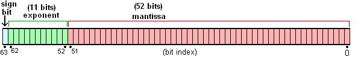
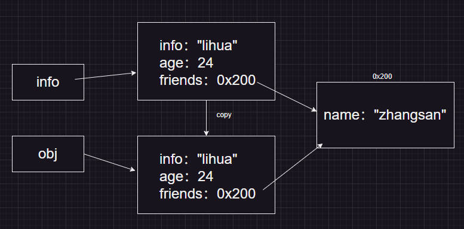

# JavaScript基础提升（一）

## 一、ECMAScript

### 1、数据类型及判断

基本数据类型（栈）：`Number、String、Boolean、Null、Undefined、Symbol、BigInt`

引用数据类型（堆）：`Object、Array、Function...`

> 原始数据类型直接存储为栈中的简单数据段，占据空间小，大小固定，属于被频繁使用的数据
>
> 引用数据类型在栈中存储了指针，而数据存储在指向指向的堆中，占据空间大、大小不固定


**判断数据类型**

**1、typeof**

`typeof`可以用来识别一些基本类型

```js
console.log(typeof true); //Boolean
console.log(typeof 2); //number
console.log(typeof 'str'); //string
console.log(typeof Symbol("foo")); //symbol
console.log(typeof undefined); //undefined

console.log(typeof function() {}); //function
console.log(typeof class {}) //function——类
console.log(typeof {}); //object
console.log(typeof []); //object
console.log(typeof null); //object——null
console.log(typeof new Set()) // object
console.log(typeof new Map()) //object
```

typeof可以识别出基本数据类型boolean、number、string、undefined、symbol、但是不能识别null

不能识别引用数据类型，会把null、array、object统一归为object类型，但是可以识别function


**2、instanceof**

**instanceof 只能用来判断两个对象是否属于实例关系**，简单地讲，就是用于判断一个对象是不是另一个对象的实例，是不是存在于其原型链上

语法：`a instanceof A`，如果a是A的实例，返回true，否则false

```js
console.log(true instanceof Boolean);  //false (Boolean包装类)
console.log(1 instanceof Number); //false (Number包装类)
console.log('str' instanceof String); //false (String包装类)
console.log(undefined instanceof Object); //false
console.log(null instanceof  Object); //false
console.log(Symbol() instanceof Symbol); //false

console.log(function(){} instanceof Function); //true
console.log({} instanceof Object); //true
console.log([] instanceof Array); //true
console.log(new Set() instanceof Set);  //true
console.log(new Map() instanceof Map);  //true
```

instanceof不能识别基本数据类型`number、string、boolean、undefined、null、symbol`

但是可以检测出引用类型，如`array、object、function`，同时对于使用new声明的类型，它还可以检测出多层继承关系

> 注意：`instanceof `后面一定要是**对象类型**，`instanceof`检查的是**原型**


**3、constructor**

```js
console.log(bool.constructor ===Boolean); //true
console.log(num.constructor ===Number); //true
console.log(str.constructor ===String); //true
console.log(arr.constructor === Array); //true
console.log(obj.constructor === Object); //true
console.log(fn.constructor === Function); //true
```

> 1.null 和 undefined 是无效的对象，因此是不会有 constructor 存在的，这两种类型的数据需要通过其他方式来判断。
>
> 2。函数的 constructor 是不稳定的，这个主要体现在自定义对象上，当开发者重写 prototype 后，原有的 constructor 引用会丢失，constructor 会默认为 Object


**4、Object.prototype.toString.call()**

适用于所有类型的判断检测,注意区分大小写.toString方法，在Object原型上返回数据格式

```js
console.log(Object.prototype.toString.call(true)); //[object Boolean]
console.log(Object.prototype.toString.call(1)); //[object Number]
console.log(Object.prototype.toString.call('str')); //[object String]
console.log(Object.prototype.toString.call(undefined)); //[object Undefined]
console.log(Object.prototype.toString.call(null)); //[object Null]
console.log(Object.prototype.toString.call(Symbol())); //[object Symbol]

console.log(Object.prototype.toString.call(function(){})); //[object Function]    
console.log(Object.prototype.toString.call({})); //[object Object]     
console.log(Object.prototype.toString.call([])); //[object Array]
```

补充：封装一个通用的判断数据类型的方法

```js
const typeOf = (obj) => Object.prototype.toString.call(obj).slice(8, -1).toLowerCase() 
```


### 2、let和const

| 命令  | 说明                                                         |
| ----- | ------------------------------------------------------------ |
| let   | 存在块级作用域、不存在变量提升（存在暂时性死区）、不能重复声明 |
| const | 存在块级作用域、不存在变量提升（存在暂时性死区）、不能重复声明、必须设置初始值且不能更改 |
| var   | 不存在块级作用域，变量提升，允许重复声明，允许不设置初始值且可以更改，全局变量会被添加到window |

> 块级作用域的作用：避免内层变量覆盖外层变量，避免循环变量泄露为全局变量


**暂时性死区**

在使用`let const`命令声明变量之前，该变量都是不可用的。这种语法称为暂时性死区(TDZ)


上面的代码中，在let声明变量tmp之前，都属于变量tmp的死区（即使全局已声明了tmp变量），因为只要块级作用域内存在let命令，它所声明的变量就绑定这个区域，不再受外部的影响

**隐蔽的死区**

```js
//没办法在y声明之前，给x赋值
const foo = (x = y,y = 2) => [x,y]
foo()
```

```js
var foo = "foo"
if (true) {
    console.log(foo) //正常来讲可以访问
    let foo = "abc" 
    //从这里开始，if块级作用域之前的代码中访问foo，都属于foo的死区
    //即使全局中有foo
}
```

```js
//函数也同样如此
var foo = "foo"
function bar() {
    console.log(foo)  //报错
    let foo = "foo"
}
bar()
```


### 3、数字精度丢失

**典型场景**

```js
//浮点数相加
let num = 0.1 + 0.2
console.log(num === 0.3); //预期：true，结果：false
```

```js
//大整数运算
let num1 = 9999999999999999
let num2 = 10000000000000000
console.log(num1 === num2); //预期：false，结果：true
```

```js
//toFixed 不会四舍五入
let num3 = 1.335
console.log(num3.toFixed(2)); //预期：1.34，结果：1.33
```


**精度丢失的原因**

计算机存储双精度浮点数需要先把十进制数转换成二进制的科学计数法的形式，然后计算机以自己的规则`符号位+ （指数位 + 指数偏移量的二进制）+ 小数部分`存储为二进制的科学计数法，因为存储时有位数限制（64位），并且某些十进制浮点数字啊转换为二进制数时会出现无限循环，会造成二进制的舍入操作（0舍1入），当再转换为十进制时就造成了计算误差

**简单剖析**

JavaScript以64位双精度浮点数存储所有Number类型值，即计算机最多存储64位二进制数。



+ 第一部分（sign）：符号位，用以区分正负数，0表示正数，1表示负数
+ 第二部分（exponent）：指数位用来存储指数，占用11位
+ 第三部分（mantissa）：尾数位用来存储有效数字，占用52位

**结合案例分析：0.1 + 0.2**

`0.1 + 0.2`实际是两者的二进制进行相加。

而`0.1`的二级制为`0.0001100110011001...`无限个`1001`循环下去，`0.2`的二进制为`0.00110011001100...`无限个`1100`循环。

**计算机采用了科学计算法的方式进行存储**，可以表示非常大的数据范围，但面对无限循环的数也是没办法存储的。双精度浮点数的小数位最大只能保留52位，剩余的只能截断舍去（0舍1入），于是，存储的0.1和0.2就存在了误差

最终导致：`0.1的二进制 + 0.2的二进制` 转为十进制等于 `0.30000000000000004`

> 科学记数法是一种记数的方法，把一个数表示成a与10的n次幂相乘的形式（1≤|a|<10，a不为分数形式，n为整数），这种记数法叫做**科学记数法**。这种表示方法可以简洁地表示非常大或非常小的数字，例如，地球的质量约为5.972 × 10^24千克，太阳的半径约为6.957 × 10^5公里


### 4、严格模式

**概念**：严格模式是一种具有限制性的JavaScript模式，从而使代码隐式的脱离了`懒散模式`。支持严格模式的浏览器在检测到代码中有严格模式时，会以更加严格的方式对代码进行检测和执行


**作用？**

+ 消除代码运行的一些不合理、不严谨之处，减少一些怪异行为
+ 提高编译器效率，提高运行速度(相同的代码，严格模式可以比非严格模式下运行得更快)
+ 为未来新版本的JavaScript做好铺垫


**开启严格模式**

```js
//方式一：在js文件中开启严格模式
"use strict";
x = 3.14;   //报错，x未定义

//方式二：只在函数内部使用严格模式
function myFunction() { 
    "use strict";
    y = 3.14;   // 报错 (y 未定义)
}
```


**严格模式的规则**

1、禁止意外创建的全局变量

```js
message = "hello world"
console.log(message) //报错
```

2、不允许函数有相同的参数名称

```js
function foo(x, y, x) {
    console.log(x, y, x)
}
foo(10, 30, 20)  //严格模式：报错

//注：非严格模式下，后边的参数值覆盖前边的。即打印结果为：20,30,20
```

3、禁止严格模式下试图删除不可删除的属性

```js
delete Object.prototype; // 抛出 TypeError 错误
```

4、不允许使用“0”开头的八进制语法

5、严格模式下，不允许使用with语句

6、在严格模式下，eval不再为上层引用变量

7、严格模式下，this绑定不会默认转成对象

```js
function foo() {
    console.log(this)
}
foo() 
//非严格模式：window
//严格模式：undefined
```


### 5、深拷贝和浅拷贝

#### 5.1 浅拷贝

将旧对象拷贝一份，赋值给新对象，新对象只是保存着旧对象的内存地址。新旧对象指向同一个内存地址（类似引用赋值）

```js
const info = { name: 'xxxx', age: 24 }
const obj = Object.assign({}, info)  // info的内容改变时，并不影响到obj
```


但是当info里边保存了一个对象，该对象指向的是一个内存地址。当拷贝到obj时，obj也会指向同一个内存地址(如图)

```js
const info = { name: 'lihua', age: 24, friends: { name: 'zhangsan' } }
const obj = Object.assign({}, info)
```



所以改变info里边other的内容，也会反映到obj里的other


**实现浅拷贝**

可以通过**展开运算符**、**Obejct.assign()**、**=**、**contact**、**slice**等方式实现浅拷贝

```js
const clone = (obj) => Object.assign({}, obj)
//或者
const clone = (obj) => ({...obj})

//或者
const clone = (obj) => {
    const newObj = {}
    for(const key in obj) {
        newObj[key] = obj[key]
    }
    return newObj
}
```


#### 5.2 深拷贝

深拷贝是指在拷贝对象时同时拷贝对象的所有属性及其属性的子属性，确保拷贝后的对象与原对象互不影响

```javascript
<!-- 深拷贝 -->
const info = { name: "xxxx", age: 20, other: { id: 100 } };
const obj = JSON.parse(JSON.stringify(info));

info.other.id = 250;
console.log(obj.other.id); //100（info怎么变化，都不能影响obj）
```

> 特别注意：虽然使用`JSON.parse(JSON.stringify(obj))`的方式可以实现深拷贝，但是在实际开发中并不推荐
>
> ```js
> const obj = {
>   aaa: () => {}, // 函数丢失
>   bbb: Symbol(), // Symbol丢失
>   ccc: undefined, // undefined丢失
>   ddd: new RegExp("\\w+"), // 变成{}
>   eee: new Error("err"), // 变成{}
>   fff: [new Date("2024-3-1"), new Date("2024-3-10")], // 时间对象变成了字符串
>   ggg: obj, // 循环引用，直接报错
> };
> console.log(JSON.parse(JSON.stringify(obj)));
> ```


**简单实现深拷贝**

```js
const deepClone = (val) => {
  // 处理函数
  if (typeof val === "function") return val;

  // 判断是否是引用数据类型
  const isObject =
    val !== null && (typeof val === "object" || typeof val === "function");
  if (!isObject) return val;

  let newObj = Array.isArray(val) ? [] : {};
  for (let key in val) {
    newObj[key] = deepClone(val[key]);
  }

  return newObj;
};
```

实现思路：

1、如果拷贝的值是一个基本数据类型，直接返回即可

2、如果是一个对象，那么要创建一个新的对象来存放。

3、如果拷贝的对象里存放了其他对象，也需要创建新的对象进行存放。所以需要递归调用

4、如果要拷贝的类型似乎数组、函数、set、map等，需要进行判断再特殊处理

**A、基本实现**

```js
function deepClone(originValue) {
  const isObject = originValue !== null && typeof originValue === "object";
  if (isObject) {
    let newObj = Array.isArray(originValue) ? [] : {};
    for (const key in originValue) {
      newObj[key] = deepClone(originValue[key]);
    }
    return newObj;
  } else {
    return originValue;
  }
}
```

**B、循环引用**

如果被拷贝的对象里边有一个属性自己引用自己，能拷贝成功吗

```js
const obj = {
  name: 'xxxxx',
  friends: {
    name: 'yyyy',
    hobbies: ["吃饭", "睡觉"]
  }
}
//新增一个info属性，值等于自身
  obj.info = obj
  const newObj = deepClone(obj)
  obj.friends.hobbies.push("看小说")
  console.log(newObj)

//输出：RangeError: Maximum call stack size exceeded （栈溢出）
```

怎么解决呢？

增加一个终止循环的条件：通过一个map来保存newObj这个对象，以originValue作为key

```js
function deepClone(originValue, map = new WeakMap()) {
  const isObject = originValue !== null && typeof originValue === "object";
  if (isObject) {
    //递归时，判断map中是否有值
    if (map.has(originValue)) {
      return map.get(originValue);
    }

    let newObj = Array.isArray(originValue) ? [] : {};
    //将newObj保存进map结构
    map.set(originValue, newObj);
    for (const key in originValue) {
      newObj[key] = deepClone(originValue[key], map);
    }
    return newObj;
  } else {
    return originValue;
  }
}
```

当开始对循环引入进行拷贝时：` map.set(originValue, newObj)`，进入对obj本身的拷贝时，由于已将map传递了过去，map中有了`map.has(originValue)`，直接返回终止了循环


### 6、this指向

JavaScript是一个文本作用域的语言。就是说，一个变量的作用域，在写这个变量的时候确定。this关键字是为了在js中加入动态作用域而做出的努力。所谓动态作用域，就是说变量的作用范围，是根据函数的调用的位置而定的，从这个角度来理解this，就简单的多。

在全局作用域下，浏览器环境下，this指向`window`；在全局作用域下，Node环境下，this指向一个`{}`；严格模式下，默认的this就是`undefined`

```js
// 1.浏览器输出 :window
// 2.node环境输出：{}
console.log(this)   

function foo() {
    "use strict";
    console.log(this);
}
//严格模式输出：undefined
```

**重点：this的指向在函数定义的时候是确定不了的，只有函数执行的时候才能确定this到底指向谁**

大致分为如下四种规则, 优先级由低到高分别如下：

+ 1、规则一：默认绑定

+ 2、规则二：隐式绑定

+ 3、规则三：显示绑定

+ 4、规则四：new绑定

>  下述内容均在浏览器环境中进行

#### 6.1. 默认绑定

this永远指向最后调用它的对象！！！

*案例一*

```js
function foo() {
    console.log(this) 
}
foo() //window
```

*案例二*

```js
function foo1() {
    console.log(this)
}
function foo2() {
    console.log(this)
    foo1()
}

foo2()  // 这个案例中，调用foo2，直接输出两个window
```

*案例三*

```js
const obj = {
    name: 'linming',
    foo: function() {
        console.log(this)
    }
}
var fn = obj.foo
fn() // 这个案例输出的是window
```

*案例四*

```js
function foo() {
    function bar() {
        console.log(this)
    }
    return bar
}
var fn = foo()
fn() // 这个案例输出的也是window`
```


#### 6.2. 隐式绑定

这一种调用方式是通过某个对象进行调用的

使用`obj.foo()`这样的语法来调用函数的时候，函数foo中的this绑定到obj对象

*案例一*

```js
function foo() {
    console.log(this)
}
var obj = {
    name: 'lingming',
    foo: foo
}

obj.foo()  //obj对象
```

*案例二*

```js
var obj1 = {
    name: 'obj1',
    foo: function() {
        console.log(this)
    }
}
var obj2 = {
    name: 'obj2',
    bar:obj1.foo
}

obj2.bar() // this指向obj2
```

> 特别注意：这种情况下会指向window。this指向最终调用它的对象
>
> ```js
> var obj = {
>     name: 'linming',
>     eating: function() { console.log(this.name + '在吃东西') }
> }
> var fn = obj.eating
> fn()
> ```


#### 6.3. 显示绑定

显示绑定一般指 `call、apply、bind`，一般情况下，我们可以通过以下的方式调用一个函数

```js
function foo() {
    console.log("函数被调用了", this)
}
//调用
foo()
foo.call()
foo.apply()
//输出：函数被调用了，window (两者效果一致)
```

那么，正常调用跟`call`、`apply`调用有什么区别呢？

直接调用跟`call`、`apply`调用的不同在于this绑定的不同，例如不希望this指向window，而是指向obj对象

```js
var obj = {
    name: 'linming'
}

foo.call(obj)
foo.apply(obj) 
// 输出：函数被调用了，obj
```


```js
// bind
function foo() {
    console.log(this)
}

var newFoo = foo.bind('aaa') //返回一个函数
newFoo() 
//String {"aaa"}
```

这里调用`newFoo()`是在全局作用域下调用的，this却指向`aaa`

原因：默认绑定和显示绑定bind冲突：显示绑定的优先级高


#### 6.4. new绑定

通过new关键字调用一个函数时（构造器），这个时候this指向这个构造器创建出来的对象

即：this = 创建出来的对象

```js
function Person(name, age) {
    this.name = name
    this.age = age
}

var p1 = new Person('linming', 18) //this = p1
var p2 = new Person('xiaohou', 18) //this 
```


构造函数一般没有返回值。如果构造函数使用了return语句，返回一个原始值/没有返回值，则this继续指向这个新创建的实例；如果`构造函数使用了return语句，返回一个对象`，那么this指向这个对象

```js
function Person(name) {
    this.name = 'linming'
    // console.log(this);
    return {
        name:'obj'
    }
}
var p1 = new Person()
console.log(p1.name); //输出obj
```


#### 6.5. 规则优先级

如果一个函数调用位置应用了多条规则，谁的优先级更高呢？

**1、默认绑定的优先级最低**

**2、显示绑定优先级高于隐式绑定**

```js
// call/apply
var obj = {
    name: 'obj',
    foo: function() {
        console.log(this);
    }
}

//隐式绑定
obj.foo()
//call/apply显示绑定高于隐式绑定
obj.foo.call('abc') 
obj.foo.apply('cna') //输出：String {"cna"}
```

可以看到，同时存在着隐式绑定和显示绑定，最终结果是绑定了显示绑定


```js
// bind
function foo() {
    console.log(this);
}

var obj = {
    name: 'obj',
    foo: foo.bind('aaa') //返回一个函数
}
obj.foo()  //输出：aaa
```

bind的优先级依然高于隐式绑定

**3、new绑定优先级高于隐式绑定**

```js
var obj = {
    name: 'obj',
    foo: function() {
        console.log(this);
    }
}

var ff = new obj.foo() //foo {}
```

**4、new绑定优先级高于bind**

new绑定和call、apply是不允许同时使用，所以不能比较

```js
function foo() {
    console.log(this);
}

var bar = foo.bind('aaa')
var obj = new bar() //输出：foo {}
```

**总结：new绑定  >  显示绑定(call/apply/bind)  >  隐式绑定  >  默认绑定（独立函数调用）**


**其他案例分析**

*1、setTimeout中的this*

```js
setTimeout(function() {
    console.log(this);
}, 1000)
//输出： window
```

注：案例中的定时器回调函数不是箭头函数，箭头函数的话情况有所不同


*2、监听点击*

```js
var box = document.querySelector('#box')
box.onclick = function() {
    console.log(this);
}
//<div id="box"></div>
```

事件点击的this绑定相当于隐式绑定,上边的案例中，this最终绑定在box上


*3、高阶函数中的this*

```js
var arr = ['abc', 'cba', 'nba']
arr.forEach(function(item) {
    console.log(item, this);
})
//输出：window
```


**补充： 规则之外**

还是有一些语法，超出了规则，当涉及这些语法时，一般是函数内部做出了特殊处理

*1、忽略显示绑定*

```js
function foo() {
    console.log(this);
}

foo.call(null)           //window
foo.apply(undefined)    //window
var fn = foo.bind(null)
fn() //window
```

按照显示绑定的规则，本来应该this指向null/undefined。但是这些方法内部做了`特殊的处理`，将this指向了window

*2、箭头函数*

箭头函数不会创建自己的`this`，它只会在自己作用域的上一层继承this，所以箭头函数中this的指向在它在定义时已经确定了，之后不会改变

特点：

+ 箭头函数没有自己的this，且继承来的this指向永远不会改变
+ `call、apply、bind`等方法也不能改变箭头函数中this的指向
+ 箭头函数不能作为构造函数使用
+ 箭头函数没有自己的`arguments`
+ 箭头函数没有`prototype`
+ 箭头函数不能用作`Generator`函数，不能使用`yeild`关键字

```js
var foo = () => {
    console.log(this);
}

foo()  //window
foo.call('str') //window
foo.apply({}) //window
```

不管怎么调用函数，this都是指向window

```js
var name = 'lihua'
var foo = () => {
    console.log(this.name);
}

foo() //lihua
foo.call('str') //lihua
foo.apply({}) //lihua
```


### 7、实现call/apply

JavaScript中的每一个Function对象都有一个`call（）`方法和一个`apply（）`方法

**作用**

call和apply的作用是一模一样的，只是传参的形式有区别而已

+ 1、改变this的指向

+ 2、借用别的对象的方法

+ 3、调用函数，因为apply、call方法会使函数立即执行

```js
// 传参的区别
function foo(n1, n2, n3, n4) {
  console.log(n1, n2, n3, n4);
}

foo.call(null, 1, 2, 3, 4);
foo.apply(null, [1, 2, 3, 4]);
```


下面将对call和apply进行分析，并手写实现。主要详细说明call的实现方式，apply同理

**1、实现call**

实现一个和系统的call有相同功能的函数`mycall`

1、首先向Function的原型添加一个`mycall`函数

```js
Function.prototype.mycall = function () {
  console.log("lmcall函数调用成功");
};

function foo() {}

foo.mycall(); //调用成功
```

2、当某个函数调用`mycall`时，执行该函数

注意：函数的本质就是js对象，在`mycall`方法中，怎么去调用`foo`函数呢。没错，通过`this`

```js
Function.prototype.mycall = function () {
  // 在这里可以去执行调用的那个函数（foo）
  var fn = this; //this 指向了foo
  fn();
};

function foo() {
  console.log("我被执行了");
}

// 隐式调用，所以this = foo
foo.mycall();
```

3、向`mycall`传入一个对象，使得调用`mycall`的函数的this = 这个对象

```js
Function.prototype.mycall = function (thisArg) {
  var fn = this; //this ==> foo
  thisArg.fn = fn;
  thisArg.fn(); //隐式函数调用，所以fn的this = thisArg（即foo的this指向thisArg）
  //问题：这里的thisArg里边有一个多余的函数属性，不过并不影响
  delete thisArg.fn; //删除这个多余的属性
};

function foo() {
  console.log("我被执行了", this);
}

foo.mycall({ name: "xxxxx" });
//输出：我被执行了 {name: "xxxxx", fn: ƒ}
```

4、如果传入的参数是数值？字符串？布尔值？该怎么处理

```js
Function.prototype.mycall = function (thisArg) {
  var fn = this;

  // 对thisArg转成对象类型（防止它传入的是非对象类型）
  thisArg = Object(thisArg);
  thisArg.fn = fn;
  thisArg.fn();
  delete thisArg.fn;
};

function foo() {
  console.log("我被执行了", this);
}

foo.mycall("hello"); //我被执行了 String {"hello", fn: ƒ}
foo.mycall(123); //我被执行了 Number {123, fn: ƒ}
foo.mycall(true); //我被执行了 Boolean {true, fn: ƒ}
```

注：Object（）可以将对应的非对象类型转换为对象类型，比如数值，就会转换成数值包装类对象

5、如果参数传入的是null或者undefined，要怎么处理

根据系统的call，如果在call中传入null/undefined，那么this会被指向window

```js
  var fn = this; //this就是调用了lmcall的函数

  thisArg = thisArg !== null && thisArg !== undefined ? Object(thisArg) : window;
  thisArg.fn = fn;
  thisArg.fn();
  delete thisArg.fn;
};

function foo() {
  console.log("我被执行了", this);
}
foo.mycall({});
//输出：我被执行了 Window{...}

```

6、传入其他的参数

```js
Function.prototype.mycall = function (thisArg, ...args) {
  var fn = this; //this就是调用了lmcall的函数

  thisArg = thisArg !== null && thisArg !== undefined ? Object(thisArg) : window;
  thisArg.fn = fn;
  thisArg.fn(...args);
  delete thisArg.fn;
};

function sum(num1, num2) {
  console.log(num1, num2, this);
}

sum.mycall({ name: "xxxxx" }, 10, 20);
//输出：10 20 {name: "xxxxx", fn: ƒ}
```


**2、实现apply**

创建一个与系统apply相似的函数`myapply`

```js
Function.prototype.myapply = function (thisArg, argArray) {
  //获取要执行的函数
  var fn = this;

  //对传入的参数进行判断
  thisArg = thisArg !== null && thisArg !== undefined ? thisArg : window;
  //执行函数
  thisArg.fn = fn;
  argArray = argArray ? argArray : []; //如果没有值，直接返回一个空
  thisArg.fn(...argArray);
  delete thisArg.fn;
};

function foo() {
  console.log(this);
}
foo.myapply({ name: "xxxxx" });
```

### 8、实现bind

与`call/apply`类似，`bind`方法也是用来改变this的指向的,不同的是bind方法返回一个修改后的函数

```js
// 了解bind的特殊性
function foo() {
  console.log("foo被执行了", this);
}
function sum(num1, num2, num3, num4) {
  console.log(num1, num2, num3, num4, this);
}

//1.返回一个函数
var fn1 = foo.bind("abc");
fn1();

//2.传递参数1
var fn2 = sum.bind("abc", num1, num2, num3, num4);
fn2();

//3.传递参数2
var fn3 = sum.bind("abc");
fn3(num1, num2, num3, num4);

//4.传递参数3
var fn3 = sum.bind("abc", num1, num2);
fn3(num3, num4);
```


**手写实现**

1、传入第一个参数

```js
Function.prototype.mybind = function (thisArg) {
  const fn = this; //this指向调用mybind的那个函数

  // 绑定this
  thisArg = thisArg !== null && thisArg !== undefined ? thisArg : window;

  return function () {
    thisArg.fn = fn;
    const result = thisArg.fn(); //隐式调用，this指向thisArg
    delete thisArg.fn;
    return result;
  };
};
```

2、传入其他参数

```js
Function.prototype.mybind = function (thisArg, ...argArray) {
  // 1.获取到真实需要调用的函数
  const fn = this;

  // 2.绑定this
  thisArg = thisArg !== null && thisArg !== undefined ? thisArg : window;

  return function (...args) {
    // 3.将函数放到thisArg中进行调用
    thisArg.fn = fn;
    // 特殊：对两个传入的参数进行合并
    const finalArgs = [...argArray, ...args];
    const result = thisArg.fn(...finalArgs); //隐式调用，this指向thisArg
    delete thisArg.fn;
    // 4.返回结果
    return result;
  };
};

//测试代码
function add(num1, num2) {
  console.log(num1, num2, this);
}
let newFn = add.mybind({}, 32);
newFn(21);
```


### 9、JSON数据存储

**基本概念**

JSON是一种非常重要的数据格式，它并不是编程语言，而是一种可以在服务器和客户端之间传输的数据格式

应用场景：

1、网络数据的传输JSON数据

2、项目的某些配置文件

3、非关系型数据库（NoSQL）将json作为存储格式


其他传输格式：

1、XML：在早期的网络传输中主要使用XML来进行数据交换的，但是这种格式在解析，传输等各方面都弱于JSON，所以目前已经很少被使用了

2、Protobuf：另外一个在网络传输中目前已经越来越多使用的传输格式是protobuf，但是它在2021年3.x版本才支持JavaScript，所以目前在前端使用的较少


**基本语法**

JSON顶层支持三种类型的值

+ 简单值：数字(Number)、字符串(String)、布尔值、null类型。（注：不支持undefined）

```json
123,
true,
'str'
```

+ 对象值：`由key、value组成`，key是字符串类型，并且必须添加双引号，value可以是简单值、对象值、数组值

```json
{
    123,
    "obj" : {
        "key": "value"
    }
}
```

+ 数组值：数组值可以是简单值、对象值、数组值

```json
[
    true,
    {
        "name": "minglin"
    }
]
```


**localStorage的问题**

当我们将一个对象进行本地缓存的时候，这个对象会被转为字符串

```js
const obj = {
    name: 'xxxx',
    age: 23
}
localStorage.setItem("obj", obj) //obj会被转为字符串，“[object, object]”
console.log(localStorage.getItem("obj")) 
//输出：[object, object]
```

发现存储的obj的内容丢失了

要解决上述的问题，可以将obj转为json格式，再转为js数据格式

```js
localStorage.setItem("obj", JSON.stringify(obj))
console.log(localStorage.getItem("obj")) 
// 输出: {"name":"xxxx","age":23}

let res = JSON.parse(localStorage.getItem("obj"))
console.log(res)
//输出： {name: 'xxxx', age: 23}
```


**JSON序列化**

JSON序列化可以将一个js数据结构转换成JSON

```js
const obj = { name: 'ming' }
JSON.stringify(obj)   //{ "name": "ming" }
```

这个方法可以接收第二个参数replacer

```js
const obj = {
    name: 'lin',
    age: 22
}
//情况一:传入数组，指定哪些是需要转换的
JSON.stringify(obj, ["name"])   //输出：{"name":"lin"}

//情况二：传入回调函数：拦截处理
let res = JSON.stringify(obj, (key, value) => {
    if(key === "age") {
        return value + 1
    }
    return value
})
console.log(res)
```

也可以有第三个参数apace，这个参数用于是输出JSON数据格式更具可读性

```js
JSON.stingify(obj, null, 8) //传入数值，表示空格
//输出：
{
        "name": "lin",
        "age": 22     
}

JSON.stingify(obj, null, "--")
//输出：
{
--"name": "lin",
--"age": 22
}
```

另外，如果被转换对象中有toJSON方法，最终结果由该方法决定

```js
const obj = {
    num: 20,
    toJSON: function() {
        return "格式由我决定"
    }
}
console.log(JSON.stringify(obj));
//输出：格式由我决定
```


**JSON解析**

`JSON.parse()`也可以将一个JSON对象转换成js数据结构

```js
const JSONString = '{ "name": "lin", "age": 22, "isFlag": true }'

console.log(JSON.parse(JSONString));
//输出：{name: 'lin', age: 22, isFlag: true}
```

也可以传进第二个参数，可以对解析的值进行拦截

```js
let res = JSON.parse(JSONString, (key, value) => {
    if(key === "age") {
        return value - 1
    }
    return value
})
console.log(res)
//{name: 'lin', age: 21, isFlag: true}
```


### 10、模块加载方案

#### 10.1 CommonJS

CommonJS是一个规范，最初提出来是在浏览器以外的地方使用，并且当时被命名为ServerJS，后来为了体现它的广泛性，修改为CommonJS。

Node是CommonJS在服务器端的一个具有代表性的实现。

1、在node中每一个js文件都是一个单独的模块

2、这个模块中包括CommonJS规范的核心变量：exports、module.exports、require


结合案例分析

**export**

创建main.js 与bar.js ，在main.js中导入bar.js模块

```js
//bar.js
const name = "xxxxx";
const age = 18;

function fn() {
    console.log("hello " + name);
}

//exports默认是一个全局空对象:{}
exports.name = name;
exports.age = age;
exports.fn = fn;
```


```javascript
//main.js

// require("./bar") 相当于导入了exports（本质是指向了与exports一样的内存地址）

//这里变量bar==exports （也指向了与exports一样的对象）
const bar = require('./bar')

// 这里利用了ES6的解构赋值
// const {name,age,fn} = require('./bar')

console.log(bar.name);
console.log(bar.age);
bar.fn();
```

从上面的例子我们可以知道，exports是一个默认存在的空的对象，我们向外导出的变量变成了exports的属性（方法），用require导入的其实就是exports这个对象。


**module.exports**

在Node中我们进行导出时，往往不用exports，而是通过module.exports导出的。

那么exports与module.exports有什么关系吗?

1、CommonJS中是没有module.exports这个概念的，但是为了实现模块的导出，Node中使用的是Module的类，每一个模块都是module的一个实例。

2、所以在Node中真正用于导出的其实根本不是exports，而是module.exports

在Node源码中规定`module.exports = exports`，所以二者指向同一个引用。即 **module.exports = exports = require（）**


**require细节**

require是一个函数，可以帮助我们引入一个文件（模块）中导入的对象。

require的查找规则是怎么样的呢？

例如：requiere（X）

1、情况一：

X是一个核心模块，比如path。那么直接返回核心模块，并停止查找

2、情况二：

X是以 `./` 或 `../` 或 `/ `开头的

查找规则：将X当做一个文件在对应目录下查找，如果有拓展名，按照拓展名查找；没有拓展名，则`查找文件X ` > `查找X.js` > `查找X.json` > `查找X.node文件`，直到找到为止。或者将X当做一个文件夹查找，会依次去查找上述规则文件夹下的index.js文件

3、情况三：

直接是一个X（没有路径），并且X不是一个核心模块

查找规则：会循着文件路径，依次去每个文件夹下的`node_modules`文件夹下查找。


**模块的加载过程**

结论一：模块在被第一次引入时，模块中的js代码会被运行一次

结论二：模块被多次引入时，会缓存，最终只加载（运行）一次

> 为什么只加载一次呢？因为每个模块对象module都有一个属性loaded，默认为false，为true时表示已经被加载了

结论三：存在循环引用、也只加载一次。而且按照的是图结构的深度优先搜索的顺序


**CommonJS规范的缺点**

1、CommonJS加载模块是同步的。

这意味着只有等到对应的模块加载完毕，后续的内容才能被运行（从上往下），这在服务器中不会有什么问题，因为服务器加载的js文件都是本地文件，加载速度非常快。

但是如果它应用于浏览器。因为浏览器需要从服务器中将文件下载下来，再运行。采用同步的方式则意味着之后的js代码无法正常运行。


#### 10.2 ES Module

ES Module与CommonJS的模块化有一些不同之处

1、它使用了import和export关键字

2、另一方面它采用编译期的静态分析，并且加入了动态引用的方式

3、采用ES Module将自动采用**严格模式**：` use strict`

4、ES Module加载模块是异步的


**导入导出的三种方式**

注：es6的模块化需要在服务器上运行才有效。（使用vscode的live serve插件）

```html
//创建index.html
<body>
    <script src="./index.js" type="module"></script>
</body>
```

> 注：下面的演示，并不是一一对应关系

1、方式一

```javascript
//foo.js
//在语句声明的前面直接加上export关键字
export const name = 'xxxxx';
export const age = 18;
export const sayHello = function (name) {
    console.log("你好"+name);
}

//index.js
//import {标识符列表} from '模块'
import { name,age,sayHello } from "./js/foo.js"; //拓展名不能省
console.log(name);
console.log(age);
sayHello('lin')
```

2、方式二

```javascript
//foo.js
//将所有需要导出的标识符，放到export后面的 {}中
const name = 'xxxxx';
const age = 18;
const sayHello = function (name) {
    console.log("你好"+name);
}
export {name,age,sayHello}
// 注：{}中统一导出，{}大括号不是一个对象

//index.js
//导入时给标识符起别名
import {name as wName, age as wAge, sayHello as Wfn} from './js/foo.js'
console.log(wName);
console.log(wAge);
Wfn('xxxxx')
```

3、方式三

```javascript
//foo.js
//导出时给标识符起一个别名
export {
    name as fName,
    age as fAge,
    sayHello as fFn
}

//index.js
//通过 * 将模块功能放到一个模块功能对象（a module object）上
import * as obj from './js/foo.js'
console.log(obj.fName);
console.log(obj.fAge);
obj.fFn('linming')
```

**default用法**

前面学习的导出功能都是有名字的导出，比如导出

```javascript
export const sayHello = function () {}
//在导出时指定了名字，在导入import时需要知道具体的名字
```

但是，默认导出（default export）可以不用指定名字，并且在导入时可以自己来指定名字。

```javascript
//导出
export default function () {}
//导入import fn from '路径'
```

> 注：在一个模块中，只能有一个默认导出


**Node对ES Module的支持**

在Node的current版本（v14.13.1）中，支持es module。

方式一：在package.json中配置 type：module

方式二：文件以.mjs结尾，表示使用的是ES Module

```javascript
//演示方式二
//js/bar.mjs
const name = 'ming';
const sayHello = function (name) {    
    console.log("你好" + name);}
export {
    name,
    sayHello
}

//main.mjs
import { name,sayHello } from "./js/bar.mjs";
console.log(name);
sayHello("xxxx");
```


**重点：commonjs与es module的区别**

+ 1、两者的导入导出语法不同，commonjs是module.exprorts、export导出，require导入；ES6则是export导出，import导入
+ 2、commonjs是运行时加载模块，ES6是在静态编译期间就进行加载
+ 3、commonjs中顶层的this指向这个模块本身，而ES6中顶层this指向undefined
+ 4、ES6在编译期间会将所有import提升到顶部，commonjs不会提升require
+ 5、commonjs导出的是一个值的浅拷贝，并进行缓存；ES6是导出一个值的引用（只存不读，类似const）

> CommonJS和ES6 Module都可以对引⼊的对象进⾏赋值，即对对象内部属性的值进⾏改变


#### 10.3 循环加载

`循环加载`指的是：a脚本执行依赖b脚本，b脚本的执行又依赖a脚本

```js
//a.js
let b = require('./b.js')

//b.js
let a = require('./a.js')
```

那么它们最终会不会报错，不报错又是怎么处理的？

通常来说，`循环加载`表示强耦合，如果处理不好，还可能导致递归加载，使得程序无法执行，因此应该避免出现这种情况。但是，在大型项目中，这种情况是很难避免的。这意味着，模块加载机制必须考虑"循环加载"的情况

在JavaScript中，目前最常见的两种格式CommonJS和ES6在处理`循环加载`时的方法是不一样的，返回的结果也不一样


**1、CommonJS循环加载**

require命令第一次加载脚本时就会执行整个脚本，然后在内存中生成一个对象

```js
{
    id：模块名，
    exports：{...}， //模块输出的接口
    loaded： true   //是否加载完毕
}
```

之后如果需要用到这个模块时，就会到exports属性上面取值，即使再次执行require命令，也不会再次执行该模块，而是到缓存之中取值（所以，无论该模块加载多少次，都只会在第一次加载时运行一次）

**一旦出现某个模块被“循环加载”，就从缓存中输出已经执行的部分，还未执行的部分不会输出**

案例

```js
//main.js文件
let a = require('./a')
let b = require('./b')
```

```js
//a.js文件
exports.role= "小孩"

let b = require('./b') //1.代码暂停，去加载b.js   //4.继续执行
// 1.此时：a: { role: '小孩' }

console.log('在a之中：',b.role)

exports.role = "大人"

console.log("a.js执行完毕");  //5.执行完毕
```

a.js先输出一个变量，然后跑去加载b，代码暂停

```js
//b.js文件
exports.role = "青少年"

let a = require('./a') //2.代码暂停，去加载a.js，但只能取出已执行的部分

console.log('在b之中：',a.role)

exports.role = "中年"

console.log("b.js执行完毕"); //3.b.js中的代码执行完毕
```

b.js执行到第二行就去加载a.js（触发循环加载），此时只能从a.js中取出已经执行的部分，即`exports.role= "小孩"`,接着b.js整个执行完毕

轮到a.js，a.js从代码暂停处继续执行下去（读取了整个b.js文件后）

```js
//输出结果：
//在b之中： 小孩
//b.js执行完毕
//在a之中： 中年
//a.js执行完毕
```

**2、es6模块的循环加载**

ES6模块是动态引用，如果使用import从一个模块中加载变量，不会去执行模块（变量也不会被缓存），而是生成一个指向被加载模块的引用，需要开发者在真正需要取值的时候，再到模块里面去取值

案例：

```js
// a.js文件
import { bar } from './b.js'
console.log('a.js');
console.log(bar);
export let foo = 'foo'

// b.js文件
import { foo } from './a.js'
console.log('b.js');
console.log(foo);
export let bar = 'bar'

//main.js文件
let a = require('./a')
let b = require('./b')

//执行a.js，输出
//b.js
//undefined
//a.js
//bar
```

执行过程：

1、执行a.js文件的第一行，因为引用了b.js，所以跑去执行b.js

2、执行b.js文件，第一行引用了a.js，因为a.js已经执行，所以继续往下执行

3、执行完毕b.js，再去执行a.js


## 二、DOM

DOM（Document Object Model），文档对象模型


### 1、基本概念

`DOM节点`(Node)，是DOM模型的组成单元

`DOM树`DOM树是DOM结构的表示形式，DOM把文档的每个节点根据父子关系连接，形成DOM树


**节点类型**：DOM文档规定了12种节点类型，分别用常量`1 ~ 12`表示，可以通过`node.nodeType`获取节点的类型常量

+ 元素节点：类型常量为`Node.ELEMENT_NODE`或`1`。最常见的节点类型，对应文档中的元素
+ 文本节点：类型常量为`Node.TEXT_NODE`或`2`。对应文档中的文本（空格与换行符也是文本节点）
+ Document节点：类型常量为`Node.DOCUMENT_NODE`或`9`。
+ 注释节点：类型常量为`Node.COMMENT_NODE`或`8`。对应文档中的注释标签


**节点查询**

```js
document.documentElement  //HTML节点
document.head //head节点
document.body //body节点

node.parentNode //当前节点的父节点
node.previousSibling //当前节点的上一个兄弟节点
node.nextSibling //当前节点的下一个兄弟节点
node.childNodes //当前节点的子节点列表
node.firstChild //当前节点的第一个子节点
node.lastChild //当前节点的最后一个子节点
```


**节点搜索**

```js
doument.getElementById(id); //根据id获取元素
document.getElementsByName(name); //根据name
document/element.getElementsByTagName(tagname); //根据标签名
document/element.getElementsByClassName(className); //根据类名

document/element.querySelector(CSSSelector); //根据css选择器匹配到第一个满足条件的元素
document/element.querySelectorAll(CSSSelector); //返回满足选择器的一组节点列表
```


**节点操作**

```js
element.innerHTML = 'xxx'; //获取或设置元素内容的HTML片段。设置的内容会被当做HTML片段解析（脚本不执行）
element.textContent = 'xxx'; //获取或设置元素的文本内容

element.hasAttribute(name); //是否存在某个特性
element.getAttribute(name); //获取某一特性值
element.setAttribute(name); //设置某一特性
element.removeAttribute(name); //删除某一特性

// 类名
element.classList // 包含所有类的可迭代类数组对象
element.classList.contains(class) //检查是否包含某个类
element.classList.add(class) //添加某个类
element.classList.remove(class) //删除某个类
element.classList.toggle(class) //切换某个类，如果已存在该类则删除该类名，如果不存在则添加

element.className // 把element上所有类名作为一个整体，进行读写
```

> 特性（attribute）和属性（property）的区别？
>
> 特性是指html中写在标签内的特性；属性是只有元素节点作为编程对象时具有的属性


**修改文档**

```js
// 创建节点
let elem = document.createElement(tagName) //元素节点
let text = document.createTextNode(data) //文本节点
let cloneNode = node.cloneNode(boolean)//复制一个节点，tree深拷贝，false浅拷贝

// 插入节点
parentNode.appendChild(node) //node作为最后一个子节点插入
parentNode.insertBefore(node, nextSibling) // 在nextSibling之前插入node
parentNode.prepend(...nodes / strings) //在第一个子节点前插入
parentNode.append(...nodes / strings) //在最后一个子节点后插入
nextSibling.before(...nodes / strings) //在本节点之前同级插入
previousSibling.after(...nodes / strings) //在本节点之后同级插入
element.innerHTML = 'HTML代码片段' //往element插入代码片段

// 移除节点
node.remove()
node.parentNode.removeChild(node) //借助父元素移除子元素

// 替换节点
node.replaceWith(...nodes / strings)
parentNode.replaceChild(newNode, node)
```


**元素位置和尺寸**


元素具有以下几何属性：

- `offsetParent` —— 是最接近的 CSS 定位的祖先，或者是 `td`，`th`，`table`，`body`。
- `offsetLeft/offsetTop` —— 是相对于 `offsetParent` 的左上角边缘的坐标。
- `offsetWidth/offsetHeight` —— 元素的“外部” width/height，边框（border）尺寸计算在内。
- `clientLeft/clientTop` —— 从元素左上角外角到左上角内角的距离。对于从左到右显示内容的操作系统来说，它们始终是左侧/顶部 border 的宽度。而对于从右到左显示内容的操作系统来说，垂直滚动条在左边，所以 `clientLeft` 也包括滚动条的宽度。
- `clientWidth/clientHeight` —— 内容的 width/height，包括 padding，但不包括滚动条（scrollbar）。
- `scrollWidth/scrollHeight` —— 内容的 width/height，就像 `clientWidth/clientHeight` 一样，但还包括元素的滚动出的不可见的部分。
- `scrollLeft/scrollTop` —— 从元素的左上角开始，滚动出元素的上半部分的 width/height。

除了 `scrollLeft/scrollTop` 外，所有属性都是只读的。如果我们修改 `scrollLeft/scrollTop`，浏览器会滚动对应的元素。

> 参考文章：`https://zh.javascript.info/size-and-scroll`


### 2、事件

JavaScript与HTML的交互是通过事件实现的，事件代表文档或浏览器窗口中某个有意义的时刻。可以使用仅在事件发生时执行的监听器订阅事件（事件意味着用户或浏览器执行的某种动作）

> 什么是事件流？
>
> 事件流描述了页面接收事件的顺序。假设当你点击了一个按钮时，实际上不光点击了这个按钮，还点击了它的容器以及整个页面。
>
> 事件流分为3个阶段：`事件捕获、到达目标、事件冒泡`，这意味着，在事件目标上，有两个机会来处理事件


**事件冒泡**

事件从最具体的元素（文档树中最深的节点）开始触发，然后向上传播至没有那么具体的元素（文档）

```html
<!DOCTYPE html>
<html lang="en">
<body>
    <div id="myDiv">
        clime me
    </div>
</body>
</html>

//点击div元素后，click事件会以如下顺序发生: 1.<div> => 2.<body> => 3.<html> => 4.document
```


**事件捕获**

事件捕获与事件冒泡顺序完全相反

事件捕获的意思是最不具体的节点应该最先收到事件，而最具体的节点应该最后收到事件

```html
<!DOCTYPE html>
<html lang="en">
<body>
    <div id="myDiv">
        clime me
    </div>
</body>
</html>

//点击div元素后，click事件会以如下顺序发生: 1.document => 2.<html> => 3.<body> => 4.<div>
```

> 现代浏览器都支持事件捕获，但几乎很少使用。通常建议使用事件冒泡


**事件处理程序**

1、方式一：html事件处理程序

```html
<input type='button' value="Click me" onclick="某个方法">
```

2、方式二：DOM0级事件处理程序

```js
let btn = document.getElementById('myBtn')
btn.onclick = function() {
    console.log('Clicked');
}
```

3、方式三：DOM2级事件处理程序（推荐）

```js
// addEventListener()与removeEventListener()
// 参数：事件名 + 事件处理函数 + 布尔值（true表示在事件捕获阶段调用处理函数，false则在事件冒泡时调用）

let btn = document.getElementById('myBtn')

btn.addEventListener('click',() => {
    console.log('clicked');
},false) //默认为false，即事件冒泡

//该方法可以进行多个处理程序
btn.addEventListener('click',() => {})
btn.addEventListener('click',() => {})
```


**2、事件对象**

在DOM中发生事件时，所有的相关信息都会被收集并存储在一个名为event的对象中。

event对象是传给事件处理程序的唯一参数，不管以哪种方式

```js
// 1.
<input type='button' value="Click me" onclick="console.log(event.type)">

//2.
 btn.onclick = function() {
    console.log(event.type);
}

//3.
btn.addEventListener('click',() => {
    console.log(event.type);
},false)
```

event对象中的公共属性和方法

| 属性/方法      | 说明                           |
| -------------- | ------------------------------ |
| bubbles        | 表示事件是否冒泡               |
| cancelable     | 表示是否可以取消事件的默认行为 |
| currentTarget  | 当前事件处理程序所在的元素     |
| preventDefault | 用于取消事件的默认行为         |
| target         | 事件目标                       |
| type           | 被触发的事件类型               |


**3、事件委托（代理）**

`过多事件处理程序`的解决方案就是使用事件委托。事件委托利用**事件冒泡**，可以只使用一个事件处理程序来管理一种类型的事件

例如，click事件冒泡到document，这意味着

可以为整个页面指定一个onclick事件处理程序，而不用为每个可点击元素分别指定事件处理程序

```html
<div id="myDiv">
    <div id="box1"></div>
    <div id="box2"></div>
    <div id="box3"></div>
</div>

<script>
    let box1 = document.querySelector('#box1')
    let box2 = document.querySelector('#box2')
    let box3 = document.querySelector('#box3')

    //这种做法是十分占用性能的(不推荐)
    box1.addEventListener('click', () => { box1 doSomething })
    box2.addEventListener('click', () => { box2 doSomething })
    box3.addEventListener('click', () => { box3 doSomething })
</script>
```

使用`事件委托`，只要给所有元素共同的祖先节点添加一个事件处理程序，就可以解决问题

```js
let myDiv = document.getElementById("myDiv")
myDiv.addEventListener('click', (event) => {
    switch(event.target.id) {
        case 'box1':
            console.log('box1 do something');
            break;
        case 'box2':
            console.log('box2 do something');
            break;
        case 'box3':
            console.log('box3 do something');
            break;
    }
})
```


## 三、BOM

BOM （Browser Object Model），浏览器对象模型


### 1、BOM有哪些对象

**1、Window对象**

BOM的核心对象就是window，是浏览器窗口中最顶层的对象，是浏览器的一个实例

浏览器的每一个标签页都有自己的window，多个标签页不会共享一个window对象

> 注：定义在全局作用域中的变量、函数都会变成window对象的属性和方法。在调用的时候可以省略`window.`

**常用事件**

1、`window.onload`事件在整个页面以及所有依赖资源如样式表和图片都已完成加载时触发

> 这意味着你可以不用在意html中，script代码的放置位置

2、`window.onresize`浏览器窗口尺寸（像素）发生变化时触发


**2、Location对象**

**`Location`** 接口表示其链接到的对象的位置（URL）。所做的修改反映在与之相关的对象上。 `Document`和 `Window`接口都有这样一个链接的 Location，分别通过 `Document.location`和`Window.location`访问

常见的属性

| 属性              | 说明                                 | 例子                   |
| ----------------- | ------------------------------------ | ---------------------- |
| location.hash     | url中#后面的字符，没有则返回空字符串 | #home                  |
| location.host     | 服务器名称和端口号                   | `www.baidu.com:80`     |
| location.hostname | 域名                                 | `www.baidu.com`        |
| location.href     | 完整的URL                            | ...                    |
| location.pathname | 资源在服务器中的文件路径             | /xxx/xxxx/xxx.html     |
| location.port     | URL的端口号，没有则为空              | 8080                   |
| location.protocol | 使用的协议                           | http:                  |
| location.search   | URL的查询字符串，通常为`？`后的内容  | ?name=lin&password=123 |


> 其他
>
> 1、`location.reload()`方法可以重新加载页面，传入true参数时，刷新时从服务器上加载数据；传入false参数时，则优先从缓存中加载数据
>
> 2、`location.replace(url)`方法，用给定的URL调换掉当前的URL并进行跳转，记录不保存在`History`中
>
> 3、`location.assign`与`location.replace(url)`类似，但记录可以保存在`History`中


**3、navigator对象**

navigator对象包含有关浏览器和设备的信息（只读）

- userAgent，该属性返回由客户机发送服务器的user-agent头部的值
- onLine，网络信息：true代表有网，false代表无网


**4、history对象**

**`History`** 接口允许操作浏览器的曾经在标签页或者框架里访问的会话历史记录

常见的属性和方法

| 方法/属性         | 说明                        | 例子                                     |
| ----------------- | --------------------------- | ---------------------------------------- |
| history.go()      | 参数可为url字符串、或者整数 | history.go(-1)或者history.go('xxxx.com') |
| history.forword() | 向前跳转一个页面            | 无                                       |
| history.back()    | 向后跳转一个页面            | 无                                       |
| history.length    | 获取历史记录数              | --                                       |

> HTML5新增了`pushState/replaceState`,可以用于向URL中添加/替换内容，但是不会立刻向后端发送网络请求。这在被应用在Vue-Router中，实现SPA


## 四、网络请求

### 1、ajax

AJAX是 Asynchronous JavaScript and XML（异步 JavaScript 和 XML）的缩写，是指一种创建交互式网页应用的网页开发技术。它是一种在无需重新加载整个网页的情况下，能够更新部分网页的技术。通过在后台与服务器进行少量数据交换，Ajax 可以使网页实现异步更新。

**示例**

```js
const xmlhttp = new XMLHttpRequest();
xmlhttp.onreadystatechange = function () {
    if (xmlhttp.readyState === 4 && xmlhttp.status === 200) {
        console.log("获取数据成功", xmlhttp.response);
    }
};
xmlhttp.open(
    "POST",
    "http://m.email.com:5173/adminApi/api/oauth/captcha",
    true
);

// 设置请求失败时的监听函数
xmlhttp.onerror = function () {
    console.error(this.statusText);
};

// 设置请求头信息
xmlhttp.responseType = "json";
xmlhttp.setRequestHeader("Accept", "application/json");

xmlhttp.send();
```

如果需要提交信息

```js
xmlhttp.setRequestHeader("Content-type","application/x-www-form-urlencoded"); 
xmlhttp.send("fname=Henry&lname=Ford"); //提交的信息（json字符串格式）
```


**注意事项：**

1、`xmlhttp.open("POST","url",true);`第三个参数true表示异步，false表示同步

2、`onreadystatechange `事件

当请求发送时，触发此事件。其中`readyState `属性存有 XMLHttpRequest 的状态信息。

- 0: 请求未初始化
- 1: 服务器连接已建立
- 2: 请求已接收
- 3: 请求处理中
- 4: 请求已完成，且响应已就绪

所以一般都需要进行判断，当`readyState`===4时，获取到的数据才是准确的

缺点：

- 本身是针对MVC编程，不符合前端MVVM的浪潮
- 基于原生XHR开发，XHR本身的架构不清晰
- 不符合关注分离（Separation of Concerns）的原则
- 配置和调用方式非常混乱，而且基于事件的异步模型不友好。


### 2、fetch

`Fetch API`提供了一个 JavaScript 接口，用于访问和操纵HTTP的请求和响应等。并提供了一个全局 `fetch() `方法来跨网络异步获取资源，`fetch`是基于promise设计的，号称是`ajax`的替代品


`fetch()`用于发起获取资源的请求。它返回一个 promise，这个 promise 会在请求响应后被 resolve，并传回 Response 对象。当遇到网络错误时，[`fetch()`](https://link.juejin.cn/?target=https%3A%2F%2Fdeveloper.mozilla.org%2Fzh-CN%2Fdocs%2FWeb%2FAPI%2FWorkerOrGlobalScope%2Ffetch) 返回的 promise 会被 reject，并传回 `TypeError`

语法：`fetch(url, options)`

```js
const options={
    //请求的 body 信息
    body: JSON.stringify(data), //这里必须匹配 'Content-Type'(GET、HEAD方法的请求不能包含body) 
   
    //请求的 cache 模式（如：default, no-cache, reload, force-cache, only-if-cached）
    cache: 'no-cache', 	 
    
    //请求的 credentials（如：omit、same-origin，include）
    credentials: 'same-origin',  
      
    //请求的头信息
    headers: {	
      'user-agent': 'Mozilla/4.0 MDN Example',
      'content-type': 'application/json'
    },
      
    //请求使用的方法（GET, POST, PUT, DELETE）
    method: 'POST', 
    
    //请求的模式（如 cors、 no-cors、same-origin）
    mode: 'cors', 
      
    //重定向模式
    redirect: 'follow', 
    
    //no-referrer、client或一个 URL。默认是 client
    referrer: 'no-referrer',
}
```


**示例**

get请求

```js
fetch("url")
  .then((response) => response.json())
  .then((data) => {
    console.log(data);
  })
  .then((error) => {
    console.log("error:", error);
  });
```

post请求

```js
fetch("url", { method: "POST", body: data })
  .then((response) => response.json())
  .then((data) => {
    console.log(data);
  })
  .catch((error) => {
    console.log("error:", error);
  });
```

```js
//上传JSON
fetch('url', {
  method: 'POST', 
  body: JSON.stringify(data), 
  headers: new Headers({
    'Content-Type': 'application/json'
  })
}) //略

//上传文件
fetch('url', {
  method: 'POST',
  body: formData
})
```


### 3、axios

Axios 是一个基于 *promise* 网络请求库，作用于`node.js` 和浏览器中。 它是 *[isomorphic](https://www.lullabot.com/articles/what-is-an-isomorphic-application)* 的(即同一套代码可以运行在浏览器和node.js中)。在服务端它使用原生 node.js `http` 模块, 而在客户端 (浏览端) 则使用 XMLHttpRequests。

中文官网：`https://www.axios-http.cn/docs/intro`

  **安装**：`npm install axios`

```javascript
import axios from 'axios'

axios({ url: 'url' }).then(res=>{ console.log(res); }) //默认get请求
```

> 在我们发送网路请求之后，axios会给服务器返回给我们的数据data中添加一些状态信息，如header,request,status,statusText等。必要时可以在响应拦截中过滤


**axios发送并发请求**：有时我们需要向服务器发送多个请求，并且需要等这些请求获取到之后才能执行下一步操作

```javascript
axios.all([axios(),axios()])
.then(result=>{ console.log(result) }) // [res1, res2]

// 也可将返回的包含多个数据的result展开
.then(axios.spread((res1,res2)=> {} ))
```


**全局配置**：在开发中，可能很多的参数都是固定的。这时候我们可以进行一些抽取

```javascript
axios({
  url:'http://xxx.xxx.xxx.xxx:8080/api/home/data',
  params:{}
})
//由于在该baseURL在基本是固定的，可以抽取出来
```

可以利用axios的去全局配置

`axios.defaults.baseURL = 'http://xxx.xxx.xxx.xxx:8080'`

`axios.defaults.timeout = 5000`    //设置全局请求延时时间


**axios的实例**：`axios.create({...})`

每个实例都可以拥有自己独立的配置

```javascript
// 创建实例
const instance = axios.create({
  baseURL:'http://xxx.xxx.xxx.xxx:8080/api/home/data',
  timeout:5000
})

// 基于instance1的网络请求
instance({ url:'/home/multidata' })
.then(res=>{ console.log(res) })
```


**2、简单封装**

> 注：开发中应当尽量避免过度封装，axios本身已经很简洁了，是否封装需要根据项目实际情况

```javascript
// utils/request.js
import axios from 'axios'

export function request(config){
    const instance = axios.create({
        baseURL:'http://xxx.xxx.xxx.xxx:8080/api/home/data',
        timeout:5000
    })
    
    // 响应拦截
    instance.interceptors.response.use(res=>{
        return res.data // 过滤状态信息
    },err=>{
        console.log(err);
    })
    
    // 请求拦截

    return instance(config) //向外返回一个promise
}
```

在其他组件中调用

```javascript
import { request } from './network/request'

//调用封装好的发送网络请求的函数
request({ 
  url:'/home/multidata'
}).then(res=>{
  console.log(res); 
})
```

