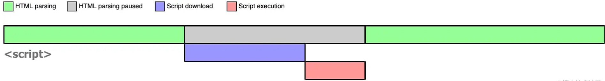
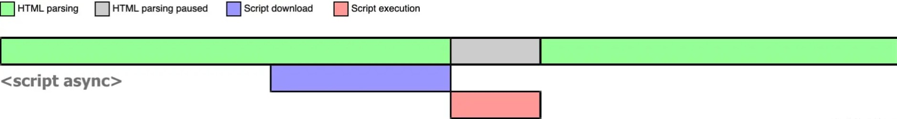

# JavaScript基础（二）

### 1、script的async与defer属性

在HTML中会遇到以下三类script:

1、``

2、``

3、``

这三类script有什么区别呢？

**1、script**

浏览器在解析HTML的时候，如果遇到一个没有任何属性的script标签，就会暂停解析

先发送网络请求获取该js脚本的代码，然后让js引擎执行该代码

当该js代码执行完毕后恢复继续解析HTML

特点：script阻塞了浏览器对HTML的解析，如果获取js脚本代码内容的网络请求迟迟得不到响应，或者js脚本执行时间过长，都会导致白屏，用户看不到页面内容

**2、async script**

async表示异步

当浏览器遇到带有async属性的script时，请求该脚本的网络请求时异步的，不会阻塞浏览器解析HTML

一旦网络请求回来之后，如果HTML还没有解析完，浏览器会暂停解析，先让JS引擎执行代码，执行完毕之后再解析HTML

、

特点：async是不可控的，因为执行时间不确定。

如果在异步js脚本中获取某个DOM元素，有可能获取不到。

如果存在多个async时，他们之间的执行顺序也不确定。完全依赖于网络传输结果，谁先到执行谁

**3、defer script**

defer表示延迟

当浏览器遇到带有defer的属性的script时，**获取**该脚本的网络请求也是异步的，不会阻塞浏览器解析HTML

一旦网络请求回来，如果HTML还没解析完，浏览器也不会去解析js

等到HTML完全执行完毕，再去执行JS代码

如果存在多个defer的script标签，会按照他们在HTML中出现的顺序执行

**4、总结**

| script标签       | js执行顺序         | 是否阻塞解析HTML       |
| ---------------- | ------------------ | ---------------------- |
| `<script>`       | 在HTML中的顺序     | 阻塞                   |
| `<script async>` | 网络请求返回的顺序 | 可能阻塞，也可能不阻塞 |
| `<script defer>` | 在HTML中的顺序     | 不阻塞                 |

### 2、BOM有哪些对象

**1、window对象**

BOM的核心对象就是window，它代表浏览器的一个实例

通俗地讲，网页中所有变量，对象，函数等，最终都是window对象的子属性

**2、location对象**

> 注：window.location和document.location引用的是同一个对象。location既是window对象的属性，也是document对象的属性

常见的属性

| 属性              | 说明                                 | 例子                   |
| ----------------- | ------------------------------------ | ---------------------- |
| location.hash     | url中#后面的字符，没有则返回空字符串 | #home                  |
| location.host     | 服务器名称和端口号                   | `www.baidu.com:80`     |
| location.hostname | 域名                                 | `www.baidu.com`        |
| location.href     | 完整的URL                            | ...                    |
| location.pathname | 服务器下面的文件路径                 | web/js/index.html      |
| location.port     | URL的端口号，没有则为空              | 8080                   |
| location.protocol | 使用的协议                           | http                   |
| location.search   | URL的查询字符串，通常为？后的内容    | ?name=lin&password=123 |

另外，还可以进行重新加载

通过`location.reload()`方法可以重新加载页面

1、`location.reload()`：重新加载（有可能会从缓存中加载）

2、`location.reload(true)`:重新加载（从服务器重新加载）

**3、navigator对象**

> navigator对象主要用来获取浏览器的属性，区分浏览器类型
>
> 该对象属性较多，且兼容性比较复杂

**4、history对象**

> history对象保存着用户上网的历史记录

常见的属性和方法

| 方法/属性         | 说明                        | 例子                                      |
| ----------------- | --------------------------- | ----------------------------------------- |
| history.go()      | 参数可为url字符串、或者整数 | history.go(-1)或者history.go('mzlin.com') |
| history.forword() | 向前跳转一个页面            | 无                                        |
| history.back()    | 向后跳转一个页面            | 无                                        |
| history.length    | 获取历史记录数              |                                           |

HTML5新增了`pushState/replaceState`,可以用于向URL中添加/替换内容，但是不会立刻向后端发送网络请求。这在被应用在Vue-Router中，实现SPA

