# JavaScript高级（一）

## 一、浏览器工作原理

**1、根据网址查询代码，并下载**

当我们访问一个网站时，假设访问的是一个IP地址。那么浏览器会根据IP地址找到对应的服务器，并将对应的网站`index.html`代码下载下来

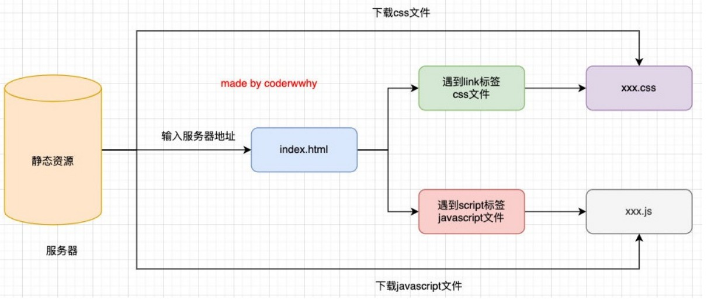

`index.html`一般关联着许许多多css代码和js代码，这个时候，也会被浏览器所下载下来

于是，浏览器呈现一个页面所需要的代码已经准备完毕，接下来就要解析这些代码了

**2、根据代码渲染页面**

浏览器渲染页面需要用到**浏览器内核**

我们常说的浏览器内核一般是指浏览器的排版引擎（浏览器引擎、页面渲染引擎）

浏览器内核，或者说浏览器引擎解析代码的过程如下：

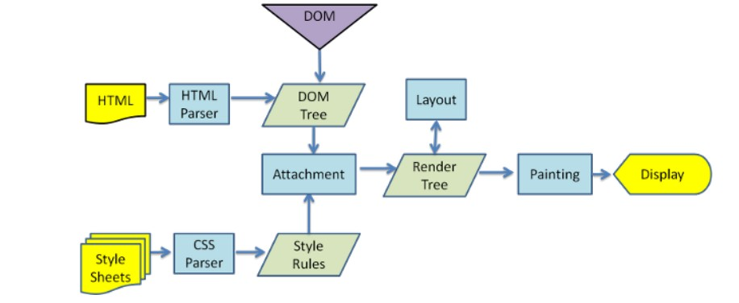

1、首先html代码会被解析（parser），构成DOM树结构

2、在解析html代码的过程中，如果**遇到js代码，会停止解析html**，转而去执行js代码（这是因为js代码可以操作DOM，而我们不想要整个DOM树构建出来后，再去解析js频繁修改DOM树，这样子十分消耗性能）

3、css代码也进行解析（parser），生成一套style Rules。并最终与DOM树结合起来（Attachment）形成的渲染树（Render Tree）

4、布局Render Tree对每个节点进行布局处理，确定在屏幕上的位置。最后通过遍历渲染树将每个节点绘制出来

**补充：浏览器内核**

+ Gocko：早期被Netscape 和Firefox浏览器使用
+ Trident：微软开发，被应用于IE4-IE11浏览器使用，但是Edge浏览器已经转向Blink
+ Webkit：苹果基于KHTML开发、开源，用于Safari、Google Chrome往前的版本也在使用
+ Blink : Webkit的一个分支，Google开发，目前应用于Google Chrome、Edge、Opera

## 二、v8引擎的工作原理

**常见的js引擎**

**SpiderMonkey**：  第一款JavaScript引擎，由Brendan Eich开发（也就是JavaScript作者）；

**Chakra**：  微软开发，用于IT浏览器； 

**JavaScriptCore**：  WebKit中的JavaScript引擎，Apple公司开发；

**V8**：  Google开发的强大JavaScript引擎，也帮助Chrome从众多浏览器中脱颖而出；

在浏览器渲染页面的过程中，解析js代码是需要依靠js引擎的

这是因为，高级编程语言都是需要转成最终的机器指令来执行的（最终要能够被CPU所识别）

v8引擎解析js代码的过程如下：

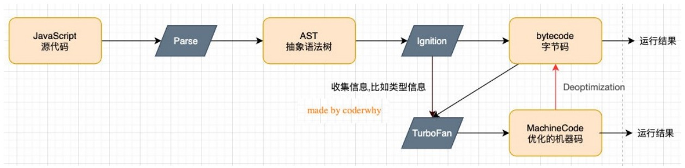

1、首先js代码会被解析（parse，经过词法分析、语法分析），形成AST树（抽象语法树）

2、Ignition是一个解释器，会将AST转换成ByteCode（字节码）

3、字节码转换为2进制代码，最终能够被CPU执行

**js代码在v8引擎中的执行流程**（理解作用域提升）

注：浏览器包含v8引擎，node也包含了v8引擎，所以两者都能执行js代码

结合上方的v8引擎解析js代码的过程，我们详细来看代码的执行过程:

1、在js代码被解析成AST树时，会创建一个**GlobalObject对象**(也被称为**GO**)

2、这个GlobalObject对象包含了常见的一些全局变量/函数/对象

```js
var GlobalObject = {
    String,
    Date,
    Number,
    setTimeout等等，
    window: GlobalObject   //其中window属性指向GlobalObject
}
```

window对象在这里相当于GlobalObject对象，拥有与其相同的属性

3、在这个阶段（即js代码被解析成AST树过程中），我们下方的代码也会被解析。因为是全局代码，所以会被加入到GlobalObject对象中

示例代码如下

```js
var name = 'linming'

var num1 = 20
var num2 = 30 
var result = num1 + num2
```

因为这些变量仅仅是定义了，尚未被执行，所以属性值没有还没有被赋值给变量，属性值暂时为undefined

```js
var GlobalObject = {
    String,
    Date,
    Number,
    setTimeout等等，
    window: GlobalObject,
    name: undefined,
    num1: undefined,
    num2: undefined,
    result:undefined
}
```

4、当到了运行代码阶段，v8引擎为了执行代码，会创建一个执行上下文栈（ECStack）（函数调用栈）

但是ECStack是用来执行函数的，这里我们并没有函数，只有全局的变量。

为了全局的代码能够正常的执行，需要创建全局执行上下文(Global Execution Context GEC)(全局代码需要被执行时才会创建)

注：全局执行上下文维护着一个VO对象（Variable Object），指向GO

5、开始执行代码，`name、num1、num2、result`的值undefined会被依次替换掉

```js
var GlobalObject = {
    String,
    Date,
    Number,
    setTimeout等等，
    window: GlobalObject,
    name: 'linming',
    num1: 20,
    num2: 30,
    result:50
}
```

6、于是不难得出，在num1执行前，如果打印num1，`console.log(num1)`,那么VO找到GO，GO找到的num1肯定是undefined

上边的代码只有变量的定义，如果要执行函数了，具体的过程是怎么样的呢？

**v8引擎执行函数的过程**（涉及函数作用域）

假设执行以下这么一段代码

```js
var name = 'linming',
foo(123) //调用
function foo(num) {
    console.log(m)
    var m = 20
    var n = 30
    console.log('v8执行函数')
}
//v8在调用函数时，执行函数
```

执行过程：

1、编译时：在代码解析成AST树时，创建一个GlobalObject对象

```js
//GO
var GlobalObject = {
    window: GlobalObject,
    setTimeout...
    name: undefined,
    foo: 0x100 // 内存地址
}
```

执行遇到函数时，会开辟一块存储函数的空间，所以GO里的`foo`指向一个内存地址

```js
//0x100
[[scope]]: parent scope  //父级作用域
函数执行体（代码块）
```

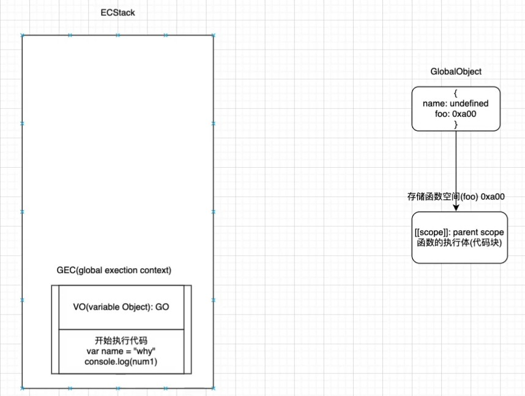

2、即将执行时：在执行函数的过程中，会创建一个函数执行上下文(FEC),并将其放入函数调用栈中

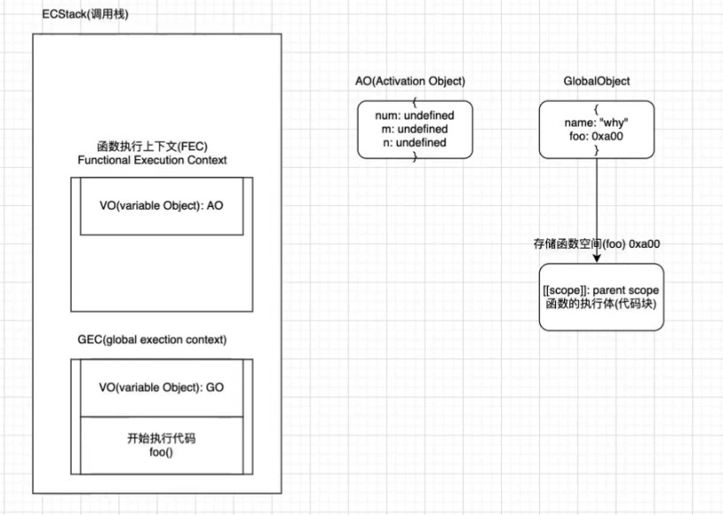

函数执行上下文中包含一个VO，指向AO

```js
//此时的AO
{
    num: undefined,
    m: undefined,
    n: undefined
}
```

3、开始执行函数

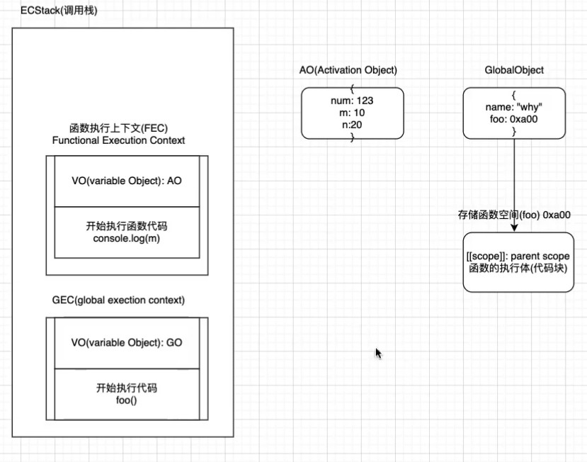

将参数123赋值给VO中的num

执行`console.log(m)`, 此时m仍为undefined，输出undefined

执行`var m = 20`,将VO中的m赋值为20，

执行`var n = 30`，将VO中的n赋值为30

执行`console.log('v8执行函数')`,输出v8执行函数

4、函数执行完成后，函数执行上下文（FEC）会弹出调用栈，并自行销毁

此时VO没有谁引用它，也被销毁了

## 三、作用域链

当我们查找一个变量时，真实的查找路径是沿着作用域链进行查找的

假设有如下代码

```js
var num = 100
function foo() {
    function bar() {
        console.log(num)
    }
    bar()
}
foo()
```

bar函数中并没有定义num，但最终会输出100

原因就是有作用域链的存在

**案例一**

来看下边这么一段代码

```js
var name = 'linming'

foo()
function foo() {
    console.log(m)
    var m = 10
    var n = 20
    console.log(name)
}
```

函数的具体的执行过程如下：

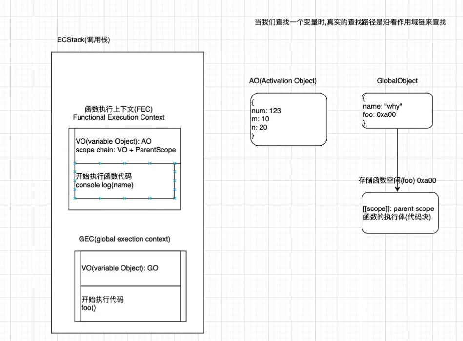

注：函数执行上下文中有一个`space chain: VO ->parentSpace`,指向父级作用域

1、解析阶段：开辟存储函数的空间（0xa00），创建函数执行上下文（FEC），将函数执行上下文放入函数调用栈

2、开始执行函数

执行`console.log(m)`，查找AO，输出undefined

执行`var m = 10,var n = 20`,为AO中的m、n赋值

执行`console.log(name)`,在AO中查找name，没有找到，则寻找上一级父级作用域（这里是GO），在GO中找到了name，输出‘linming’

**案例二**

我们让代码变得更复杂一点

```js
var name = 'linming'
foo(123)
function foo(num) {
    console.log(m)
    var m = 10
    var n = 20
    function bar() {
        console.log(name)
    }
    bar()
}
```

上边的foo函数里边返回了bar函数，并在bar函数中打印了name

具体执行过程

1、编译阶段

创建全局对象GO

创建foo、bar的函数存储空间

2、即将执行阶段

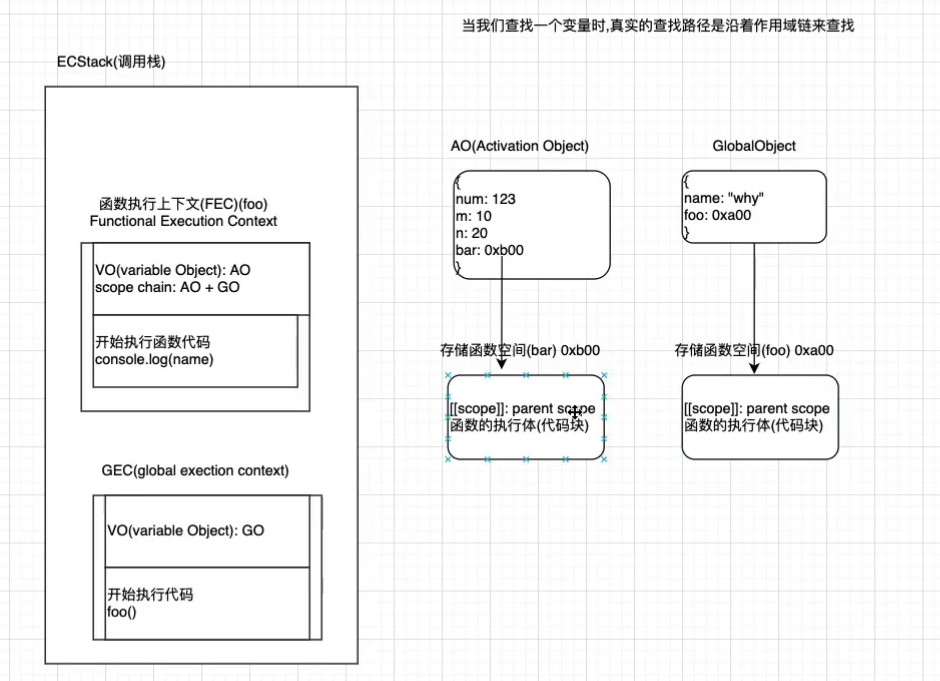

创建foo的函数执行上下文，其中`mun ： undefined   m : undefined  n : undefined  bar : 内存地址 `

3、执行阶段

将foo的函数执行上下文放入调用栈中，一次执行其中的代码

a、将num赋值为123；

b、执行`console.log(m)`，打印m = undefined

c、执行`var m = 10 var n = 20`，为VO中的m、n赋值

d、执行bar，创建一个bar的函数执行上下文

4、执行bar，沿着作用域链逐层查找

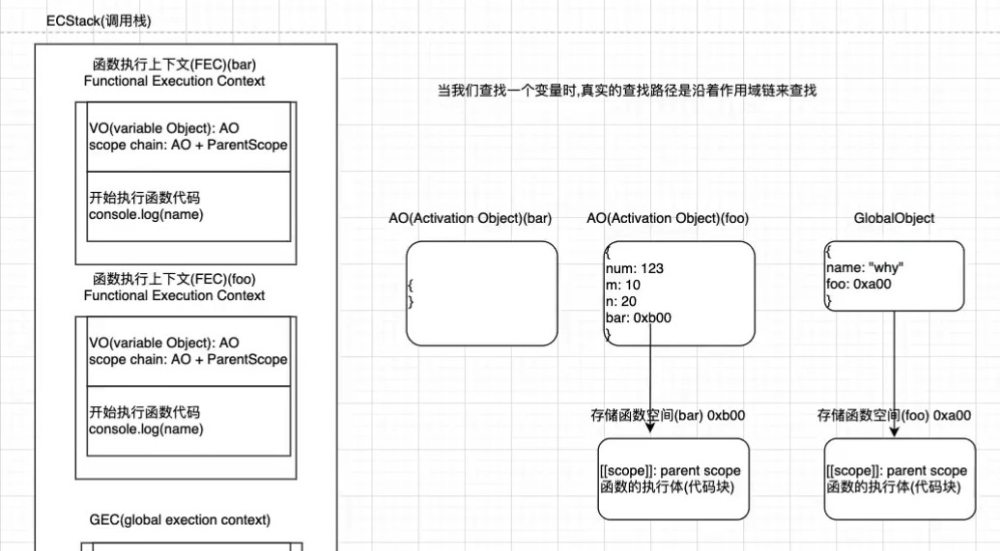

当bar的函数执行上下文在执行`console.log(name)`时，没有找到name(因为其AO是没有name的)

它会沿着`space chain`找到foo的VO，找到foo的AO，依然没有找到，

继续沿着`space chain`找到全局对象的VO，找到GO，最终在里边找到了name

**面试题一**

```js
var message = 'hello global'
function foo() {
  console.log(message);
}

function bar() {
  var message = 'hello bar'
  foo()
}
bar()
```

输出：`hello global`

代码的具体执行过程：

1、编译阶段（即代码经过词法解析、语法解析转换成AST树的过程中）

创建一个全局对象GO

```js
var GO = {
    window: GO,
    message: undefined,
    foo: 0xa00,
    bar:0xb00
}
```

开辟分别存储foo函数、bar函数的内存空间

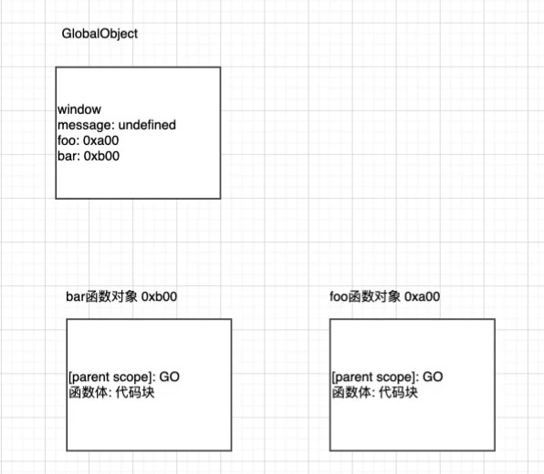

重点：这的bar的父级作用域也是GO

2、执行代码

首先在函数调用栈中创建一个全局作用域，其中的VO对象指向GO，

执行第一行代码`var message = 'hello global'`,为GO中的message赋值

执行bar函数，创建一个bar函数作用域，并添加进调用栈中，其中VO指向该函数的AO（此时AO中的message为undefined），执行bar作用域第一行代码` var message = 'hello bar'`，并为AO的message赋值

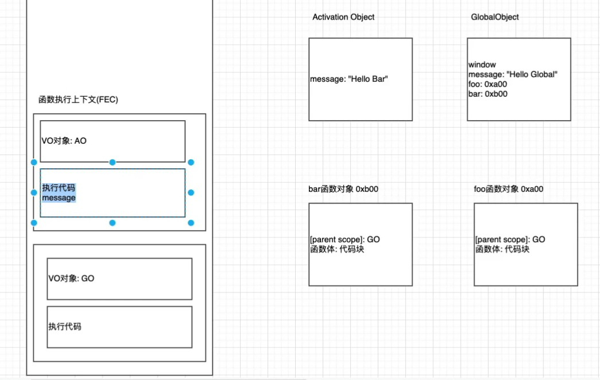

3、执行bar函数中foo函数

将foo的函数作用域添加至调用栈中，其中的VO指向其AO，不过AO为空

接着执行`console.log(message)`，现在foo自身的AO查找，没找到，沿着作用域链查找

重点：foo函数作用域的父级作用域是GO，而不是bar的AO

所以，答案为`hello global`

**面试题二**

```js
var n = 100
function foo() {
    n = 200
}
foo()
console.log(n)
```

1、编译过程：

```js
GO:{ n: undefined, foo: 0x100 }
```

```js
//0x100
[scope]:GO
代码块
```

2、执行过程

执行`var n = 100`

```js
GO:{ n: 100, foo: 0x100 }
```

执行foo（）

```js
//在foo的AO查找n
//没有找到n
```

找到父级作用域GO，找到n，并将n改为200

执行`console.log(n)`,输出200

**面试题三**

```js
function foo() {
    console.log(n)
    var n = 200
    console.log(n)
}
var n = 100
foo()
```

1、编译过程

```js
GO: { foo:0x100, n: undefined }
```

```js
//0x100
[scope]:parent scope
代码块
```

```js
//foo的AO
n: undefined
```

2、执行过程

执行`var n = 100`

```js
GO: { foo:0x100, n: 100 }
```

执行foo()

执行`console.log(n)`,根据AO,输出undefined

执行`var n = 200`,为AO中的n赋值200 `AO: { n: 200 }`

执行`console.log(n),`根据AO，输出200

**面试题四**

```js
var a = 100
function foo() {
    console.log(a)
    return 
    var a = 100
}
foo()
```

1、编译阶段

```js
GO: { a: undefined, foo: 0x100 }
```

```js
//0x100存储函数内存
[scope]:parent scope
代码块
```

```js
AO: { a: undefined }
```

2、执行阶段

执行`var a = 100`  

```js
GO: { a: 100, foo: 0x100 }
```

执行foo（）

执行`console.log(a)`,在自身的AO中查找，找到了undefined

**面试题五**

```js
function foo() {
    var a = b = 100
}
foo()

console.log(a)
console.log(b)
```

特别注意：`var a = b = 100`将会转换为`var a = 100   b = 100`

1、编译阶段

```js
GO: { foo: 0x100, b: undefined }
```

```js
//0x100
[scope]:parent scope
代码块
```

```js
AO: { a: undefined }
```

2、执行阶段

因为函数中的`b = 100`相当于是在全局中定义的，所以此时GO

```js
GO: { foo: 0x100, b: 100 }
```

执行foo（）

执行`var a = b = 100`

```js
AO: { a: 100 }
```

执行`console.log(a)`,GO没有，报错

执行`console.log(b)`,在GO中找到，输出100

## 四、内存管理

不管是什么样的编程语言，在代码的执行过程中都是需要给它分配内存的，不同的是某些编程语言需要手动的管理内存，某些编程语言可以自动管理内存

JavaScript通常情况下是不需要手动来管理的

**内存管理的生命周期**

1、分配申请的内存

2、使用分配的内存

3、不需要引用时，进行释放

**js的内存管理**

JavaScript会在定义变量时为我们分配内存

1、对于基本数据类型的分配会在执行时，直接在**栈空间**进行分配

2、js对于复杂数据类型内存的分配会在**堆内存**中开辟一块空间，并且将这块空间的指针返回值变量引用

**js的垃圾回收**

因为内存的大小是有限的，所以当内存不再需要的时候，我们需要对其进行释放，以便腾出更多的内存空间

JavaScript的运行环境js引擎内置了内存垃圾回收器（简称GC）

常见的GC算法有：引用计数、标记清除

## 五、理解闭包

### 5.1 闭包的形成

闭包的形成，执行以下代码

```js
function foo() {
    var name = 'foo'
    function bar() {
        console.log("bar", name)
    }
    return bar
}
var fn = foo()
fn()
```

**1、编译阶段**：

```js
GO: {
    window:GO,
    foo: 0xa00,
    fn: undefined
}
```

foo的内存地址

```js
//0xa00
[scope]: GO
代码块
```

**2、执行阶段  :  执行`var fn = foo()`**：

为其赋值, `GO: { fn: 0xb00 }`

同时在这里**调用了foo函数**

创建foo函数执行上下文, 并创建AO

```js
//foo的AO
AO: {
   name: undefined,
   bar: 0xb00
}
```

bar的内存地址

```js
//0xb00
[scope]: foo的作用域
代码块
```

**开始执行foo()**，

执行`var name = 'foo'` 为name赋值

bar函数是定义，直接跳过

执行`return bar`, 即直接将地址赋值给了变量`fn`

```js
//foo的AO
AO: {
   name: 'foo',
   bar: 0xb00
}
```

```js
GO: {
    window:GO,
    foo: 0xa00,
    fn: 0xb00
}
```

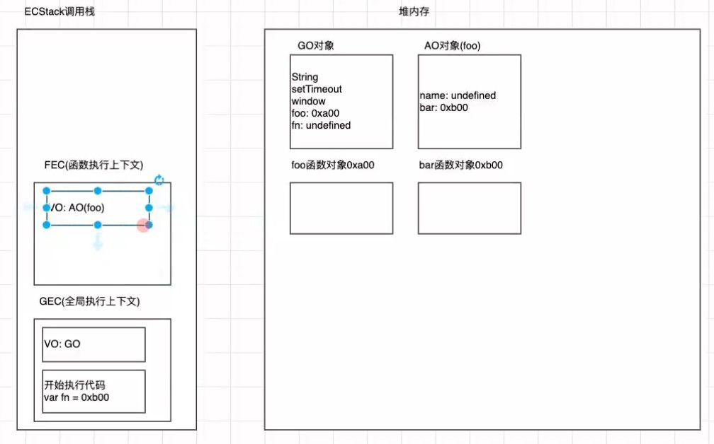

执行完`var fn = foo()`后，将foo的执行上下文弹出栈

**2、执行阶段：执行 fn（）**

因为fn在GO中表现为**0xb00**，即意味着执行的是`bar`函数

创建`bar`函数的执行上下文，放入调用栈中，并创建对应的AO对象

```js
AO:{
    //bar函数内部并无内容，为空
}
```

**开始执行bar（）**

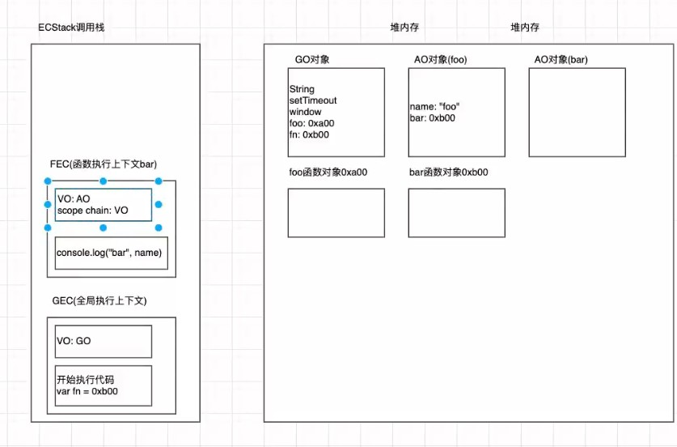

执行`console.log('bar', name)`,直接打印输出bar，遇到name，就要到上层作用域中查找

bar的上层作用域是foo的AO对象，找到了`name: foo`，输出foo

至此，代码执行完毕，闭包也形成了

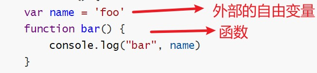

闭包：bar函数+name自由变量的组合

### 5.2 闭包的定义

 维基百科的定义：

1、闭包（closure），又称词法闭包或函数闭包

2、只在支持**头等函数**的编程语言中，实现词法绑定的一种技术

3、闭包在实现上是一个结构体，它存储了一个函数和一个关联的环境

4、闭包跟函数最大的区别在于，当捕捉闭包的时候，它的**自由变量**会在捕捉时被确定，这样即使脱离了捕捉时的上下文，它照样能运行

注：在js中，函数是一等公民，意味着函数可以作为另外一个函数的参数，也可以作为另外一个函数的返回值来使用

**简单的理解**

要理解闭包，首先必须理解JavaScript的变量作用域

JavaScript语言的特殊之处，**就在于函数内部可以直接读取全局变量**。**在函数外部无法读取函数内的局部变量**，但是闭包可以帮助我们从外部读取函数局部的变量。

基于此的理解为

**理解1：**，闭包就是能够读取其他函数内部变量的函数。在本质上，闭包就是将函数内部和函数外部连接起来的一座桥梁。

**理解2：**一个函数和对其周围状态的引用捆绑在一起，这样的组合就是闭包（closure）

也就是说，闭包让你可以在一个内层函数中访问到其外层函数的作用域

所以，函数+自由变量name的组合，就是闭包

闭包的作用：柯里化、函数外或在其他函数中访问某一函数内部的参数

### 5.3 内存泄露

容易造成内存泄露的情况：

1、闭包引起的内存泄露

2、被遗忘的定时器（没有清除定时器）

3、意外定义的全局变量

4、for循环出现死循环

下方的代码形成了一个闭包：`bar`函数 + 自由变量`name 、age`

```js
function foo() {
    var name = "foo"
    var age = 18    

    function bar() {
        console.log(name)
        console.log(age)
    }
    return bar
}
var fn = foo()
fn()
```

当执行`fn`函数时相当于执行`bar函数`，执行所在作用域在全局，却能够访问到`foo`函数作用域中的变量

当执行完`var fn = foo`后，`foo执行栈`应该是弹出栈，其AO也应该销毁了，为什么还能访问到？

我们更加详细地来剖析整个过程

**1、编译阶段**

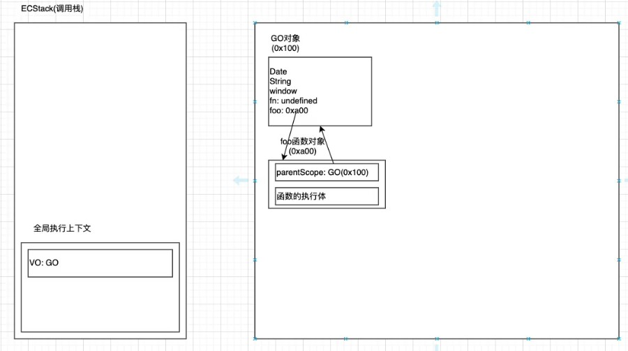

```js
GO: {
    window: GO,
    foo: 0xa00,
    fn: undefined
}
```

```js
//0xa00
[scope]: GO  //指向GO对象
代码块
```

**2、执行阶段： 执行`var fn = foo()`**

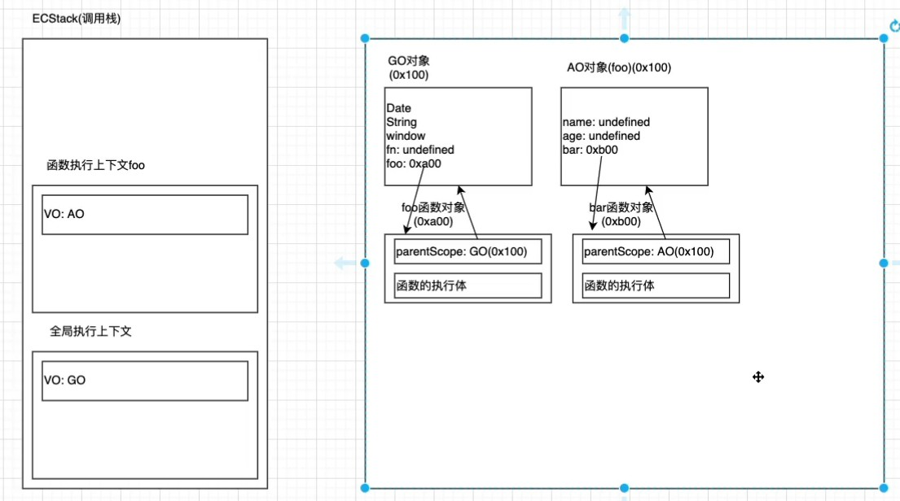

创建foo函数执行上下文，放进调用栈，并创建对应的AO

```js
//foo的AO（0x100）
AO: {
    name: undefined,
    age: undefined,
    bar: 0xb00
}
```

```js
//0xb00
[scope]: foo的AO（0x100）
代码块
```

执行`var name = "foo"，`为AO对象中的name赋值

执行`var age= 18，`为AO对象中的age赋值

执行`return bar`，结束执行`foo函数`，所以 `var fn = bar = 0xb00  `

```js
GO: {
    window: GO,
    foo: 0xa00,
    fn: 0xb00
}

//foo的AO（0x100）
AO: {
    name: "foo",
    age: 18,
    bar: 0xb00
}
```

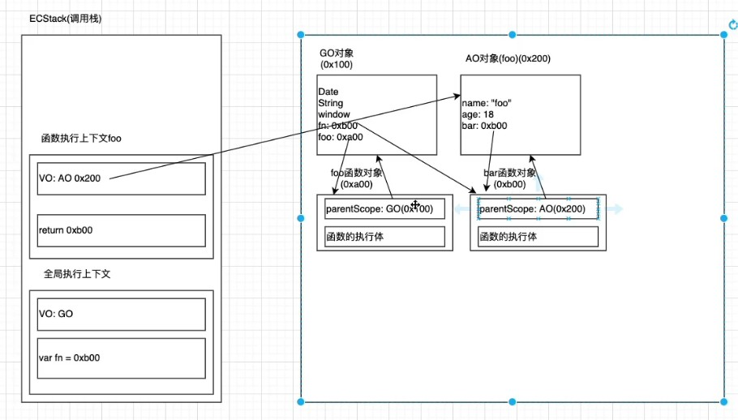

从图中可以看到，GO中的`fn`指向`bar函数对象`，而`bar函数对象`的父级作用域指向了`foo的AO对象`

所以，当`var fn = foo()`执行完毕，其函数执行上下文会从栈中弹出，但是其AO对象不会被销毁，因为有其他的对象引用着它

**3、执行阶段：fn（）**

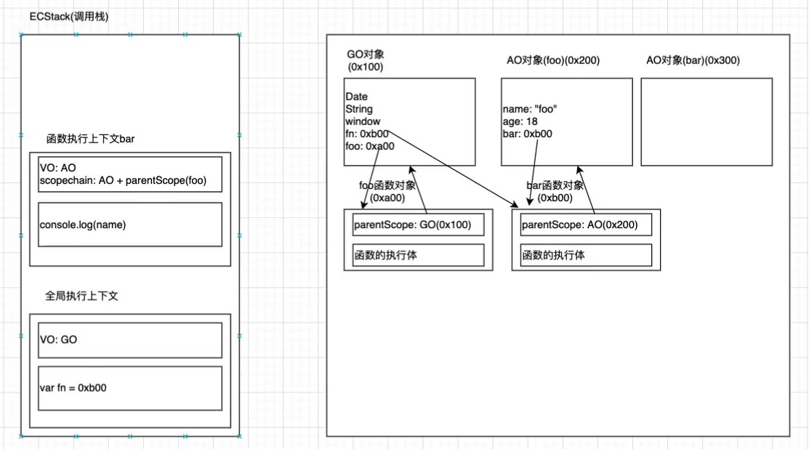

执行`fn()`相当于执行`bar()`

所以创建一个`bar`函数执行上下文放入栈中，并创建相应的AO对象

执行`console.log(name)`，从自身AO找，没找到沿着访问上层作用域`foo的AO对象`，找到并输出

执行`console.log(age)`，从自身AO找，没找到沿着访问上层作用域`foo的AO对象`，找到并输出

如果后续不再使用`fn()`函数调用，则存在**内存泄露**

因为`foo的AO对象`会一直在内存中存在着，但是不再使用就失去了它存在的意义

设置`fn = null`则可以避免内存泄露

**极端情况的内存泄露**

```js
function createFnArray() {
    // 占据的空间为4M
    var arr = new Array(1024 * 1024).fill(1)
    return function() {
        console.log(arr.length);
        // 形成闭包，每一次调用内存中都保留着4m空间的createFnArray的AO对象
    }
}

var arrarFns = []
// 运行100次，并将结果存进数组中
for(var i = 0; i < 100; i++) {
    arrarFns.push(createFnArray())
    // 此时内存中约占用了400M空间
}
```

运行代码，在浏览器控制台的Performance中选择Memory

可以看到，代码运行占用了大量的内存空间

```js
setTimeout(() => {
    arrarFns = null
}, 1000);
```

1秒钟后，释放内存

在控制台的内存占用曲线可以看到明显的断层

**js引擎会销毁不使用的变量**

```js
function foo() {
    var name = 'why'
    var age = 18

    function bar() {
        console.log(name)
    }
    return bar
}

var fn = foo()
fn()
```

上边的代码中，形成了一个闭包： `bar函数+自由变量name`

在foo的AO对象中，age显然也是存在的

```js
AO = {
    name: 'why',
    age: 18
}
```

但是显然闭包永远都不会使用到，这个age只会占用内存

所以在浏览器执行该代码的过程中，v8引擎会删除掉这个age

## 六、理解this指向

在全局作用域下，浏览器环境下，this指向window

在全局作用域下，Node环境下，this指向一个空对象

严格模式下，默认的this就是undefined

```js
console.log(this) 
//浏览器输出：window
//node输出：{}
```

```js
function foo() {
    "use strict";
    console.log(this);
}
foo() 
//输出：undefined
```

**this的指向在函数定义的时候是确定不了的，只有函数执行的时候才能确定this到底指向谁**

1、规则一：默认绑定

2、规则二：隐式绑定

3、规则三：显示绑定

4、规则四：new绑定

### 6.1 默认绑定

**案例一**

```js
function foo() {
    console.log(this) 
}

foo() //window
```

**案例二**

```js
function foo1() {
    console.log(this)
}

function foo2() {
    console.log(this)
    foo1()
}

function foo3() {
    console.log(this)
    foo2()
}

foo3()
```

这个案例中，调用`foo3`，直接输出三个`window`

**案例三**

this永远指向最后调用它的对象

```js
const obj = {
    name: 'linming',
    foo: function() {
        console.log(this)
    }
}
var fn = obj.foo
fn()
```

这个案例输出的是`window`

**案例四**

```js
function foo() {
    function bar() {
        console.log(this)
    }
    return bar
}
var fn = foo()
fn()
```

这个案例输出的也是`window`

### 6.2 隐式绑定

这一种调用方式是通过某个对象进行调用的

使用`obj.foo()`这样的语法来调用函数的时候，函数foo中的this绑定到obj对象

**案例一**

```js
function foo() {
    console.log(this)
}

var obj = {
    name: 'lingming',
    foo: foo
}

obj.foo()  //obj对象
```

**案例二**

```js
var obj = {
    name: 'linming',
    eating: function() {
        console.log(this.name + '在吃东西')
    }
}

var fn = obj.eating
fn() // 在吃东西
```

这种情况下，this指向window

**案例三**

```js
var obj1 = {
    name: 'obj1',
    foo: function() {
        console.log(this)
    }
}

var obj2 = {
    name: 'obj2',
    bar:obj1.foo
}

obj2.bar()
```

this指向obj2

### 6.3 显示绑定

显示绑定一般指 `call、apply、bind`

一般情况下，我们可以通过以下的方式调用一个函数

```js
function foo() {
    console.log("函数被调用了", this)
}
//调用
foo()
foo.call()
foo.apply()
//效果一致
```

输出：`函数被调用了，window`

那么，正常调用跟`call`、`apply`调用有什么区别呢

直接调用跟`call`、`apply`调用的不同在于this绑定的不同

比如我们不希望this指向window，而是指向obj对象

```js
var obj = {
    name: 'linming'
}

foo.call(obj)
foo.apply(obj)
```

输出：`函数被调用了，obj`

call、apply的第一个参数就是this的绑定

**call与apply的区别**

```js
function sum(num1, num2, num3) {
    console.log(num1 + num2 + num3, this)
}

sum.call("call", 20, 30, 40)
sum.apply("apply", [20, 30, 40])
```

其实区就是传参的区别

**bind**

```js
function foo() {
    console.log(this)
}

var newFoo = foo.bind('aaa') //返回一个函数
newFoo() 
//String {"aaa"}
```

这里调用`newFoo()`是在全局作用域下调用的，this却指向`aaa`

原因：默认绑定和显示绑定bind冲突：显示绑定的优先级高

### 6.4 new绑定

通过new关键字调用一个函数时（构造器），这个时候this是在这个构造器创建出来的对象

即：this = 创建出来的对象

```js
function Person(name, age) {
    this.name = name
    this.age = age
}

var p1 = new Person('linming', 18) //this = p1

var p2 = new Person('xiaohou', 18) //this 
```

**补充**

构造函数一般没有返回值

如果构造函数使用了return语句，返回一个原始值/没有返回值，则this继续指向这个新创建的实例

如果构造函数使用了return语句，返回一个对象，那么this指向这个对象

```js
function Person(name) {
    this.name = 'linming'
    // console.log(this);
    return {
        name:'obj'
    }
}
var p1 = new Person()
console.log(p1.name); //输出obj
```

返回一个`{ name: 'obj' }`,实例最终指向这个对象

### 6.5 其他案例分析

**1、setTimeout中的this**

```js
setTimeout(function() {
    console.log(this);
}, 1000)
//输出： window
```

注：案例中的定时器回调函数不是箭头函数，箭头函数的话情况有所不同

箭头函数this将指向上层作用域

**2、监听点击**

```js
var box = document.querySelector('#box')
box.onclick = function() {
    console.log(this);
}
//<div id="box"></div>
```

事件点击的this绑定相当于隐式绑定,上边的案例中，this最终绑定在box上

**3、高阶函数中的this**

```js
var arr = ['abc', 'cba', 'nba']
arr.forEach(function(item) {
    console.log(item, this);
})
//输出：window
```

### 6.6 规则优先级

如果一个函数调用位置应用了多条规则，谁的优先级更高呢？

**1、默认绑定的优先级最低**

同时存在默认绑定和其他规则，就会使用其他规则的方式来绑定this

**2、显示绑定优先级高于隐式绑定**

call/apply

```js
var obj = {
    name: 'obj',
    foo: function() {
        console.log(this);
    }
}

//隐式绑定
obj.foo()
//call/apply显示绑定高于隐式绑定
obj.foo.call('abc') 
obj.foo.apply('cna') //输出：String {"cna"}
```

可以看到，同时存在着隐式绑定和显示绑定，最终结果是绑定了显示绑定

bind

```js
function foo() {
    console.log(this);
}

var obj = {
    name: 'obj',
    foo: foo.bind('aaa') //返回一个函数
}
obj.foo()  //输出：aaa
```

bind的优先级依然高于隐式绑定

**3、new绑定优先级高于隐式绑定**

?

```js
var obj = {
    name: 'obj',
    foo: function() {
        console.log(this);
    }
}

var ff = new obj.foo() //foo {}
```

**4、new绑定优先级高于bind**

new绑定和call、apply是不允许同时使用，所以不能比较

```js
function foo() {
    console.log(this);
}

var bar = foo.bind('aaa')
var obj = new bar() //输出：foo {}
```

**总结：**

new绑定  >  显示绑定(call/apply/bind)  >  隐式绑定  >  默认绑定（独立函数调用）

### 6.7 规则之外

上边所涉及的规则已基本足以应付平时的开发，但是总还是有一些语法，超出了规则

当涉及这些语法时，一般是函数内部做出了特殊处理

**1、忽略显示绑定**

```js
function foo() {
    console.log(this);
}

foo.call(null)           //window
foo.apply(undefined)    //window
var fn = foo.bind(null)
fn() //window
```

按照显示绑定的规则，本来应该this指向null/undefined

但是这些方法内部做了特殊的处理，将this指向了window

**2、箭头函数**

箭头函数不适用this的四种标准规则（也就是不绑定this），而是根据外层作用域来决定this

```js
var foo = () => {
    console.log(this);
}

foo()  //window
foo.call('str') //window
foo.apply({}) //window
```

不管怎么调用函数，this都是指向window

```js
var name = 'linming'
var foo = () => {
    console.log(this.name);
}

foo() //linming
foo.call('str') //linming
foo.apply({}) //linming
```

**箭头函数应用场景**

1、发送网络请求，并把结果放在data属性中

```js
var obj = {
    data: [],
    getData: function() {
        // 箭头函数之前的解决方案
        var _this = this
        setTimeout(function() {
            var result = ['abc', 'cba', 'nba']
            _this.data = result
        }, 1000)
    }
}

obj.getData()
// 调用时，getData中的this指向obj，并赋值给_this

setTimeout(() => {
    console.log(obj.data);
},1500)
```

使用箭头函数，可以让定时器更方便的使用this

```js
var obj = {
    data: [],
    getData: function() {
        setTimeout(() => {
            this.data = ['abc', 'cba', 'nba']
            // 箭头函数中使用this，会绑定到上一级作用域的this
        }, 1000)
    }
}
obj.getData()
```

### 6.8 this面试题

**面试题一**

```js
var name = "window"

var person = {
    name: 'person',
    sayName: function() {
        console.log(this.name);
    }
}

var sss = person.sayName
sss()    //window :独立函数调用
person.sayName(); //person 隐式调用
(person.sayName)(); //person：隐式调用
(b = person.sayName)(); //window:赋值表达式（独立函数调用）
```

**面试题二**

```js
var name = 'window'

var person1 = {
    name: 'person1',
    foo1: function() {
        console.log(this.name);
    },
    foo2: () => console.log(this.name),
    foo3: function() {
        return function() {
            console.log(this.name);
        }
    },
    foo4: function() {
        return () => {
            console.log(this.name);
        }
    }
}

var person2 = {
    name: 'person2'
}
```

请写出下面代码中的this

```js
person1.foo1() //隐式调用：person1
person1.foo1.call(person2) //显示调用比隐式调用优先级高，person2
```

```js
person1.foo2() //箭头函数不存在this，this指向全局，window
person1.foo2.call(person2) //window
```

注：`foo2`的箭头函数的this会指向全局作用域，而不是指向`person1对象，因为person1不存在作用域`

```js
person1.foo3()() //最终返回一个独立函数，指向全局window
person1.foo3.call(person2)()//最终返回一个独立函数，指向全局window
person1.foo3().call(person2) //最终调用返回函数式，使用的是显示绑定
```

```js
person1.foo4()() //返回一个箭头函数，去上层作用域foo4中寻找person1
person1.foo4.call(person2)() //person2
person1.foo4().call(person2) //person1
```

**面试题三**

```js
var name = 'window'

function Person (name) {
    this.name = name
    this.foo1 = function () {
        console.log(this.name)
    }
    this.foo2 = () => {
        console.log(this.name)
    }
    this.foo3 = function () {
        return function () {
            console.log(this.name)
        }
    }
    this.foo4 = function () {
        return () => {
            console.log(this.name)
        }
    }
}


var person1 = new Person('person1')
var person2 = new Person('person2')
```

请输入下方代码的结果

```js
person1.foo1() //person1
person1.foo1.call(person2) //person2
```

```js
person1.foo2() //箭头函数，寻找上层作用域（Person构造函数） person1
person1.foo2.call(person2) //寻找上层作用域（Person构造函数） person1
```

## 七、实现call/apply/bind

js函数本质上就是对象

### 7.1手写call

实现一个和系统的call有相同功能的函数`lmcall`

1、首先向Function的原型添加一个`lmcall`函数

```js
Function.prototype.lmcall = function() {
    console.log("lmcall函数调用成功");
}

function foo() {}

foo.lmcall() //调用成功
```

2、当某个函数调用`lmcall`时，执行该函数

```js
Function.prototype.lmcall = function() {
    // 在这里可以去执行调用的那个函数（foo）
    //问题：需要获取到是哪一个函数执行了lmcall
    var fn = this //this就是调用了lmcall的函数
    fn()
}

function foo() {
    console.log("我被执行了");
}

// 隐式调用，所以this = foo
foo.lmcall()
```

3、向`lmcall`传入一个对象，使得调用`lmcall`的函数的this = 这个对象

```js
Function.prototype.lmcall = function(thisArg) {

    var fn = this //this就是调用了lmcall的那个函数（这里是foo）

    thisArg.fn = fn
    thisArg.fn() //隐式函数调用，所以fn的this = thisArg（即foo的this指向thisArg）
    //问题：这里的thisArg里边有一个多余的函数属性，不过并不影响
    delete thisArg.fn //删除这个多余的属性
}

function foo() {
    console.log("我被执行了", this);
}

foo.lmcall({ name: 'linming'})
//输出：我被执行了 {name: "linming", fn: ƒ}
```

4、如果传入的参数是数值？字符串？布尔值？该怎么处理

```js
Function.prototype.lmcall = function(thisArg) {

    var fn = this //this就是调用了lmcall的函数

    // 对thisArg转成对象类型（防止它传入的是非对象类型）
    thisArg = Object(thisArg)

    thisArg.fn = fn
    thisArg.fn()
    delete thisArg.fn
}

function foo() {
    console.log("我被执行了", this);
}

foo.lmcall("hello")
foo.lmcall(123)
foo.lmcall(true)
//我被执行了 String {"hello", fn: ƒ}
//我被执行了 Number {123, fn: ƒ}
//我被执行了 Boolean {true, fn: ƒ}
```

注：Object（）可以将对应的非对象类型转换为对象类型，比如数值，就会转换成数值包装类对象

5、如果参数传入的是null或者undefined，要怎么处理

根据系统的call，如果在call中传入null/undefined，那么this会被指向window

```js
Function.prototype.lmcall = function(thisArg) {

    var fn = this //this就是调用了lmcall的函数

    thisArg = (thisArg !== null && thisArg !== undefined)? thisArg : window

    thisArg.fn = fn
    thisArg.fn()
    delete thisArg.fn
}    

function foo() {
    console.log("我被执行了", this);
}
foo.lmcall({})
//输出：我被执行了 Window{...}
```

6、传入其他的参数

```js
Function.prototype.lmcall = function(thisArg, ...args) {

    var fn = this //this就是调用了lmcall的函数


    thisArg = (thisArg !== null && thisArg !== undefined)? thisArg : window

    thisArg.fn = fn
    thisArg.fn(...args)
    delete thisArg.fn
}


function sum(num1, num2) {
    console.log(num1, num2, this);
}

sum.lmcall({ name: 'linming' }, 10, 20)
//输出：10 20 {name: "linming", fn: ƒ}
```

### 7.2 手写apply

创建一个与系统apply相似的函数`lmapply`

```js
Function.prototype.lmapply = function(thisArg, argArray) {
    //获取要执行的函数
    var fn = this

    //对传入的参数进行判断
    thisArg = (thisArg !== null && thisArg !== undefined)? thisArg : window

    //执行函数
    thisArg.fn = fn
    thisArg.fn(...argArray)
    delete thisArg.fn
}

//测试代码
function sum (num1, num2) {
    console.log(num1, num2, this);
}
sum.lmapply({ name: 'linming' }, [1,2])
//输出：1 2 {name: "linming", fn: ƒ}
```

问题：如果没有传数组，这里会报错。但是确实存在不需要传数组的情况

```js
Function.prototype.lmapply = function(thisArg, argArray) {
    //获取要执行的函数
    var fn = this

    //对传入的参数进行判断
    thisArg = (thisArg !== null && thisArg !== undefined)? thisArg : window

    //执行函数
    thisArg.fn = fn
    argArray = argArray ? argArray : []  //如果没有值，直接返回一个空
    thisArg.fn(...argArray)
    delete thisArg.fn
}

function foo () {
    console.log(this);
}
foo.lmapply({ name: 'linming' })
```

### 7.3 手写bind

了解bind的特殊性

```js
function foo() {
    console.log('foo被执行了', this)
}
function sum(num1, num2, num3, num4) {
    console.log(num1, num2, num3, num4, this)
}

//1.返回一个函数
var fn1 = foo.bind('abc')
fn1()

//2.传递参数1
var fn2 = sum.bind('abc', num1, num2, num3, num4)
fn2()

//3.传递参数2
var fn3 = sum.bind('abc')
fn3(num1, num2, num3, num4)

//4.传递参数3
var fn3 = sum.bind('abc', num1, num2)
fn3(num3, num4)
```

具体实现步骤

1、传入第一个参数

```js
Function.prototype.lmbind = function(thisArg) {
    // 1.获取到真实需要调用的函数
    var fn = this //this指向调用lmbind的那个函数

    // 绑定this
    thisArg = (thisArg !== null && thisArg !== undefined)? thisArg : window

    function proxyFn() {
        thisArg.fn = fn
        var result = thisArg.fn()  //隐式调用，this指向thisArg
        delete thisArg.fn
        return result
    }
    return proxyFn
}


function foo() {
    console.log('foo被调用了', this)
}

var newFn = foo.lmbind({})
newFn()
```

2、传入其他参数

```js
Function.prototype.lmbind = function(thisArg, ...argArray) {
    // 1.获取到真实需要调用的函数
    var fn = this //this指向调用lmbind的那个函数

    // 2.绑定this
    thisArg = (thisArg !== null && thisArg !== undefined)? thisArg : window

    function proxyFn(...args) {
        // 3.将函数放到thisArg中进行调用
        thisArg.fn = fn
        // 特殊：对两个传入的参数进行合并
        var finalArgs = [...argArray, ...args]
        var result = thisArg.fn(...finalArgs)  //隐式调用，this指向thisArg
        delete thisArg.fn
        // 4.返回结果
        return result
    }
    return proxyFn
}

//测试代码
function add(num1, num2) {
    console.log(num1, num2, this);
}
let newFn = add.lmbind({}, 32)
newFn(21)
```

## 八、函数式编程

**函数式编程与面向对象**

1、函数式编程具备高扩展性和复用性。缺点是函数过多难以管理，逻辑不清晰

2、涉及到业务逻辑的代码，最好使用面向对象。面向对象非常擅长组织逻辑

3、绝大部分前端框架都使用了函数式，很大原因是函数式编程可以使用Tree-shaking

> Tree-shaking的本质是通过文档流的引入判断是否使用了某个方法，但是面向对象方案无法记录

```js
function Class1() {}
Class1.prototype.f1 = () => {  }
Class1.prototype.f2 = () => {  }
new Class1().fn1()
//但是通过webpack打包后，f2也被打包进去了
```

### 8.1 纯函数

函数式编程中有一个非常重要的概念叫纯函数，JavaScript符合函数式编程的范式，所以也有纯函数的概念

**定义：**在程序设计中，若一个函数符合以下条件，那么这个函数被称为纯函数：

1、函数在相同的输入值时，需产生相同的输出

2、函数的输出和输入值以外的其他隐藏信息或状态无关，也和由I/O设备产生的外部输出无关

3、该函数不能有语义上可观察的函数副作用，诸如“触发事件”，使输出设备输出，或更改输出值以外物件的内容

**简单理解：**

1、确定的输入，一定会产生确定的输出；

2、函数在执行过程中，不能产生副作用

**副作用？**

在计算机科学中，引入了医学的概念副作用，表示在执行一个函数时，除了返回函数值之外，还对调用函数产生了附加的影响，比如修改了全局变量，修改了参数或者改变了外部的存储（简单理解:函数依赖于外部的状态）

例如：用户输入，外部配置，数据库

（副作用往往是产生bug的“温床“）

**案例**

**1、slice和splice**

```js
//slice是纯函数
//给slice传入一个start/end，那么对于同一个数组来说，它会给我们返回确定的值
//slice本身不会修改原来的数组
var names = ["abc", "cba", "nba", "dna"]
var newName1 = names.slice(0, 3)


//splice不是纯函数
//splice在执行时，有修改掉调用数组对象本身，修改的这个操作就是产生的副作用
var newName2 = names.splice(2)
console.log(names)
```

**2、foo和bar**

```js
// foo是一个纯函数
function foo(num1, num2) {
    return num1 * 2 + num2 * num2
}

//bar不是一个纯函数
//bar执行过程中修改了全局编程name
var name = 'abc'
function bar() {
    console.log('bar其他的代码执行')
    name = 'cba'
}
bar()
```

**纯函数的优势**

保证了函数的纯度，只是单纯实现了自己的业务逻辑，需要关心传入的内容是如何获得的或者依赖其他的外部变量是否已经发生了修改

### 8.2 柯里化

柯里化也是属于函数式编程里面一个非常重要的概念

**定义：**

柯里化（Currying），是把接收多个参数的函数，变成接受一个单一参数（最初函数的第一参数）的函数，并且返回接受余下的参数，而且返回结果的新函数的技术

柯里化声称：“如果你固定某些参数，你将得到接受余下参数的一个函数”

**简单理解：**

只传递给函数一部分参数来调用它，让它返回一个函数去处理剩下的参数，这个过程就称之为柯里化

**案例**

```js
function foo(m, n, x, y) {
    return m + n + x + y
}
foo(20,30,40,50)
//柯里化
function bar(m) {
    return function (n) {
        return function (x) {
            return function(y) {
                return m + n + x + y
            }
        }
    }
}
bar(20)(30)(40)(50)
```

最终，我们将foo函数（本来需要接收四个参数），变成只接收一个参数的函数

是否觉得上方的柯里化太过繁琐，其实也是可以简写的

```js
var baz = m => n => x => y => m + n + x + y

var res = baz(20)(30)(40)(50)
console.log(res) //输出140
```

**为什么要有柯里化？**

**1、让函数的职责单一**

在函数式编程中，我们其实希望一个函数处理的问题尽可能的单一，而不是将一大堆处理过程交给一个函数来处理

那么我们是否就可以将每次传入的参数在单一的函数中进行处理，处理完后在下一个函数中再使用处理后的结果

比如有如下需求：add有三个参数，分别在不同的函数中进行不同的操作后，再进行相加

```js
//正常的函数编写
function add(x, y, z) {
    x = x + 2
    y = y * 2
    z = z ** 2
    return x + y + z
}

console.log(add(20,30,40)); //1682


//柯里化
function foo(x) {
    x = x + 2
    return function(y) {
        y = y * 2
        return function(z) {
            z = z ** 2
            return x + y + z
        }
    }
}

console.log(foo(20)(30)(40)); //1682
```

**2、柯里化的复用**

我们来看下边的两个案例

**案例一**

makeAdder函数要求我们传入一个num（并且如果我们有需要的话，可以在这里对num进行一些修改）

之后使用返回的函数时，就不需要再继续传入num了

```js
function makeAdder(num) {
    return function(count) {
        return num + count
    }
}

//假设需要多次使用5去加另外一个数
var add5 = makeAdder(5)
add5(10)
add10(100) 
```

**案例二**

日志打印：当前时间 + 类型 + 说明

封装一个日志打印的函数，一般的实现方法如下

```js
function log(date, type, message) {
    console.log('[${date.getHours()} : ${date.getMinutes()}][${type}]:[${message}]')
}

log(new Date(), "DEBUG", "查询到轮播图的bug")
log(new Date(), "DEBUG", "查询到菜单的bug")
log(new Date(), "DEBUG", "查询到数据的bug")
```

这样的写法未免太过繁琐，存在大量重复的代码

```js
//柯里化
var log = date => type => message => {
    console.log('[${date.getHours()} : ${date.getMinutes()}][${type}]:[${message}]')
}

//时间是固定的（即每次都是打印当下时间）
var nowLog = log(new Date())
newLog("DEBUG")("查询到轮播图的错误")
newLog("FETURE")("新增了添加用户的功能")


//如果类型type否是相同的，还可以进一步优化
var newAndDebug = log(new Date())("DEBUG")
newAndDebug("查询到轮播图的bug")
newAndDebug("查询到轮播图的bug")
newAndDebug("查询到轮播图的bug")
```

### 8.3 手写柯里化

实现功能：传入一个普通函数，将其转化成柯里化函数

1、基本结构：传入一个函数，返回一个函数

```js
function lmCurrying(fn) {
    function curried() {

    }
    return curried
}

function add(x, y, z) {
    return x + y + z
}

//调用
var curryAdd = lmCurrying(add)
curryAdd(20)(30)(40)
```

2、curried参数处理

上边的代码中，使用者传入一个函数，最终返回curried函数

但是调用函数的人使用curried函数时，传参的方式可能是不同的

```js
//调用
var curryAdd = lmCurrying(add)

curryAdd(20, 30, 40)
curryAdd(20, 30), 40)
curryAdd(20)(30)(40)
```

当一次性传入三个参数时，就可以简单地这样子编写代码

```js
function lmCurrying(fn) {
    function curried(...args) {
        fn(...args)
    }
    return curried
}
```

3、当已接收参数个数，与传入的函数需要的参数个数一致时，直接调用即可

```js
function lmCurrying(fn) {
    function curried(...args) {
        if (args.length >= fn.length) {
           return fn(...args)
        }
    }
    return curried
}
```

注：`fn.length`可以获取函数本身的参数个数

4、考虑调用方式的不同

比如使用者这样子调用`curryAdd(20)(30)(40)`,这个时候就需要递归调用curried函数了

```js
function lmCurrying(fn) {
    function curried(...args) {
        if(args.length >= fn.length) {
            return fn(...args)
        } else {
            //当传入参数小于原函数的参数个数时
            function curried2(...args2) {
                return curried(...args, ...args2) //递归调用
            }
            return curried2
        }
    }
    return curried
}
```

5、测试代码

```js
function lmCurrying(fn) {
    function curried(...args) {
        if(args.length >= fn.length) {
            return fn(...args)
        } else {
            //当传入参数小于原函数的参数个数时
            function curried2(...args2) {
                return curried(...args, ...args2) //递归调用
            }
            return curried2
        }
    }
    return curried
}

function add(x, y, z) {
    return x + y + z
}

var newFn =  lmCurrying(add)
console.log(newFn(20)(30)(40)); //90
console.log(newFn(20, 30)(40)); //90
console.log(newFn(20, 30, 40)); //90
```

### 8.4 组合函数

组合（Compose）函数是在js开发过程中一种对函数的使用技巧、模式：

比如我们需要获取某一个数据，执行函数fn1和fn2，这两个函数时依次执行的，如果我们每次都需要进行两个函数的调用，操作上就会显得重复，那么是否可以将fn1和fn2组成起来，自动依次调用呢

```js
//一般的调用方式
function double(x) {
    return x * 2
}

function square(y) {
    return y ** 2
}

var count = 10
//需求：对count进行乘以2，再进行平方
var res = square(dobule(count))
```

组合函数的写法

```js
function composeFn(fn1, fn2) {
    return function(count) {
        return fn2(fn1(count))
    }
}

var newFn = composeFn(dobule, square)
```

### 8.5 高阶函数

Higher-order function，

+ 高阶函数的参数可以是函数
+ 高阶函数的返回值是一个函数

例如：

`filter 、forEach、every`是高阶函数（参数是函数）

`bind`也是一个高阶函数（返回值是函数）

意义：高阶函数是用来抽象通用的问题，帮我们屏蔽细节，让我们只关注目标

**实现forEach**

```js
Array.prototype.myForEach = function(fn) {
  const arr = this //隐式调用，this就是调用该函数的数组
  for(let i in arr) {
    fn(arr[i], i, arr)
  }
}

const arr = [1,23,4,5,6,7]
arr.myForEach((item) => {
  console.log(item)
})
```

**实现filter**

```js
Array.prototype.myFilter = function(fn) {
  const arr = this
  let newArr = []
  for(let key in arr) {
    if(fn(arr[key])) {
      newArr.push(arr[key])
    }
  }
  return newArr
}

const arr = [3,4,5,6,66,2,123,6,77,23,23,32]

const res = arr.filter((item) => {
  return item > 20
})
console.log(res)
```

**实现once**

只调用一次的函数，返回值也是一个函数

> 应用场景：支付时，多次点击也只支付一次

```js
function once(fn) {
  let done = false
  return function(arg) {
      if(!done) {
          done = true
          fn(arg)
      }
  }
}


const pay = once((monkey) => {
  console.log(monkey)
})

pay(888)
pay(888)
pay(888)
pay(888) //只打印一次888
```

> 注：这里其实应用了闭包

**实现reduce**

```js
arr.reduce((pre, current, index, arr) => {return pre + current}, init)
```

可以接收第二个参数作为第一个pre，不传则将arr的第一个参数作为pre

案例分析

```js
需求一：将routes转化为对象
const routes = [
  {
    path: '/',
    component: 'home',
  },
  {
    path: '/about',
    component: 'about'
  }
]
//即{'/' :'home'}的格式

routes.reduce((pre, current) => {
  pre[current.path] = current.component
  return pre //pre将作为下一次的pre
}, {})

需求二：累加金额
const goods = [
  {
    type: 'good',
    price: 10
  },
    {
    type: 'good',
    price: 20
  },
    {
    type: 'good',
    price: 30
  },
]
goods.reduce((pre, current) => {
 if(current.type === 'good') {
   pre += current.price
 }
  return pre
}, 0)
```

手写实现

```js
Array.prototype.myreduce = function(fn, init) {
  let i = 0
  let len = this.length
  if(init === 'undefined') {
    init = fn[0]
    i = 1
  }
  for(i; i < len; i++) {
    pre = fn.call(this, pre, this[i], i, this)
  }
  return pre
}
```

### 8.6 compose和pipe

**背景**

假设有这样的需求：需要连续利用几个函数最终求得结果

```js
const fn1 = (arg) => {
  //handle result
  return result
}
const fn2 = (arg) => {
  //handle result
  return result
}
const fn3 = (arg) => {
  //handle result
  return result
}

let result = 10
result = fn1(result)
result = fn2(result)
result = fn3(result)
```

这样子求值未免太过于麻烦了

**compose函数**可以理解为为了方便我们连续执行方法，把自己调用传值的过程封装了起来，我们只需要给compose函数我们要执行哪些方法，它就会自动执行

```js
function compose() {
  //arguments，注意箭头函数没有arguments，要使用...args
  const args = [].slice.apply(arguments)
  return function (num) {
    var _result = num
    for (var i = args.length - 1; i >= 0; i--) {
      _result = args[i](_result)
    }
    return _result
  }
}

//或者
function compose() {
  //arguments
  const args = [].slice.apply(arguments)
  return function (num) {
    var _result = num
    return atgs.reduceRight((res, cb) => cb(res), num)
  }
}

//调用
compose(fn4, fn3, fn2, fn1)(10) //10初始值
```

> pipe函数与compose函数功能相同，只不过pipe函数是从左往右执行

针对上边的需求，还有另外的处理方式promise

```js
Promise.resolve(10).then(fn1).then(fn2).then(fn3).then((res) => {
  console.log(res)
})
```

## 九、严格模式

**概念**

严格模式是一种具有限制性的JavaScript模式，从而使代码隐式的脱离了“懒散模式”

支持严格模式的浏览器在检测到代码中有严格模式时，会以更加严格的方式对代码进行检测和执行

为什么使用严格模式？

+ 消除代码运行的一些不合理、不严谨之处，减少一些怪异行为
+ 提高编译器效率，提高运行速度
+ 为未来新版本的JavaScript做好铺垫

**开启严格模式**

1、在js文件中开启严格模式

```javascript
"use strict";
x = 3.14;   //报错，x未定义
```

2、在函数中使用

```javascript
//只在函数内部使用严格模式
function myFunction() { 
   "use strict";
    y = 3.14;   // 报错 (y 未定义)
}
```

**严格模式的限制**

1、禁止意外创建的全局变量

```js
message = "hello world"
console.log(message) //报错
```

2、不允许函数有相同的参数名称

```js
function foo(x, y, x) {
    console.log(x, y, x)
}
foo(10, 30, 20)  
//非严格模式下，后边的参数值覆盖前边的：20，30， 20
//严格模式：报错
```

3、禁止严格模式下试图删除不可删除的属性

4、不允许使用“0”开头的八进制语法

5、严格模式下，不允许使用with

6、在严格模式下，eval不再为上层引用变量

7、严格模式下，this绑定不会默认转成对象

```js
function foo() {
    console.log(this)
}
foo() 
//非严格模式：window
//严格模式：undefined
```

## 十、面向对象

JavaScript其实支持多种编程范式的，包括**函数式编程和面向对象编程**： 

1、JavaScript中的对象被设计成一组属性的无序集合，像是一个哈希表，有key和value组成

2、key是一个标识符名称，value可以是任意类型，也可以是其他对象或者函数类型

3、如果值是一个函数，那么我们可以称之为是对象的方法

**创建对象**

```js
//方式一: new关键字
var obj = new Object()

//方式二: 字面量
var obj = {}
```

**操作对象**

```js
//赋值
obj.name = "linming"

//取值
obj.name

//删除值
delete obj.name
```

有时候我们也希望对一个属性进行比较精准的操作控制，比如不允许对象的某个值被删除、被赋值、不允许哪一个值被遍历等等，这个时候，就可以使用`Object.defineProperty`

### 10.1 defineProperty

`Object.defineProperty()`方法会直接在一个对象上定义一个新属性，或者修改一个对象的现有属性，并返回此对象。

**可接收三个参数**

1、obj要定义属性的对象

2、prop要定义或修改的属性的名称或Symbol

3、descriptor要定义或修改的**属性描述符**

返回值：被修改的对象obj

```js
var obj = {
    name: "linmnig",
    age: 19
}

// 为obj增加一个属性
Object.defineProperty(obj, "height", {
    value: 1.88
})
console.log(obj) //输出：{ name: 'linmnig', age: 19 }
```

注：通过该函数添加的新属性，默认不可被遍历

**属性描述符分类**

属性描述符的类型有两种：

1、数据属性描述符

2、存取属性(访问器)描述符

| 分类    | configurabel | enumerable | value | writable | get | set |
| ----- | ------------ | ---------- | ----- | -------- | --- | --- |
| 数据描述符 | 可以           | 可以         | 可以    | 可以       | 不可以 | 不可以 |
| 存取描述符 | 可以           | 可以         | 不可以   | 不可以      | 可以  | 可以  |

如何区分：当存在get、set时，不能有value和writable（不能共存），反之同理

**数据描述符的特性**

1、`[[Configurable]]`：表示属性是否可以通过delete删除属性，是否可以修改它的特性，或者是否可以将它**修改为存取属性描述符**

A、直接在一个对象上定义某个属性时，这个属性的[[Configurable]]为true

B、通过属性描述符定义一个属性时，这个属性的[[Configurable]]默认为false

2、[[Enumerable]]：表示是否可以通过遍历获得该属性

A、直接在一个对象上定义某个属性时，这个属性的[[Enumerable]]为true

B、通过属性描述符定义一个属性时，这个属性的[[Enumerable]]默认为false

3、[[Writable]]：表示是否可以修改属性的值

A、直接在一个对象上定义某个属性时，这个属性的[[Writable]]为true

B、通过属性描述符定义一个属性时，这个属性的[[Writable]]默认为false

4、[[value]]：属性的value值，读取属性时会返回该值，修改属性时，会对其进行修改

A、默认情况下这个值是undefined

```js
var obj = {
    name: 'linming'
}

//原先obj并没有age这个属性
Object.defineProperty(obj, 'age', {
    //默认值为undefined
    //age默认不可修改或删除
    //age不可被遍历
})
```

**存取属性描述符**

1、[[Configurable]]——与数据属性描述符一致

2、[[Enumerable]]——与数据属性描述符一致

3、**[[get]]**：获取属性时会执行的函数，默认为undefined

4、**[[set]]:**设置属性时会执行的函数，默认为undefined

```js
let obj = {
    name: 'linming',
    _address: '广州'
}

Object.defineProperty(obj, "address", {
    enumerable: true, //可遍历
    configurable: true, //可删除
    get: function() {
        return this._address
    },
    set: function(value) {
        this._address = value
    }
})
```

**get、set**的应用

1、隐藏一个私有属性，不希望直接被外界使用和赋值

2、希望截获某一个属性访问时，设置值时的过程

```js
Object.defineProperty(obj, "address", {
    enumerable: true, //可遍历
    configurable: true, //可删除
    get: function() {
        foo()
        return this._address
    },
    set: function(value) {
        bar()
        this._address = value
    }
})

function foo() {
    console.log("取值前截获到了");
}

function bar() {
    console.log("设置值前截获到了");
}


console.log(obj.address);
console.log(obj.address = "深圳");
```

**Object.defineProperties()**

Object.defineProperties()方法直接在一个对象上定义多个新的属性或修改现有属性，并且返回该对象

例如：同时配置name、age属性

```js
const obj = {
    _age: 18
}

Object.defineProperties(obj, {
    name: {
        configurable: true,
        enumerable: true,
        writableL: true,
        value: "linming"
    },
    age: {
        configurable: false,
        enumerable: false,
        get: function() {
            return this._age
        },
        set: function(value) {
            this._age = value
        }
    }
})
```

**获取某一个属性的属性描述符**

`getOwnPropertyDescriptor()`

```js
console.log(Object.getOwnPropertyDescriptor(obj, "age"));

//输出：
//{
//  get: [Function: get],
//  set: [Function: set],
//  enumerable: false,
//  configurable: false
//}
```

**获取对象的所有属性描述符**

`Object.getOwnPropertyDescriptors()`

```js
console.log(Object.getOwnPropertyDescriptors(obj));
```

### 10.2 批量创建对象

**1、工厂模式**

工厂模式是一种常见的设计模式

通常我们会有一个工厂方法，通过该工厂方法我们可以产生想要的对象

```js
//基本结构
function createPerson () {
    var p = {}
    return p
}

//创建对象实例
var p1 = createPerson()
```

具体案例如下

```js
function createPerson (name, age, height, address) {
    var p = {}
    p.name = name
    p.age = age
    p.height = height
    p.address = address
    p.eating = function() {
        this.name + "在吃东西"
    }
    p.running = function() {
        this.name + "在跑步"
    }
    return p
}

var p1 = createPerson('linming', 22, 1.81, "广州")

console.log(p1.eating);
console.log(p1.name);
```

**工厂模式的缺点：**获取不到对象的具体类型，我们在打印对象时，对象的类型都是Obejct类型

**2、构造函数**

构造函数也称之为构造器（constructor），通常是我们在创建对象时会调用的函数

如果一个普通的函数被使用new操作符来调用了，那么这个函数就称之为是一个构造函数

```js
function foo() {
    console.log("foo~")
}

//普通方式调用
foo() //输出：foo~

//new调用
new foo()  //输出：foo~
```

问题：**new调用有什么特殊的地方吗？**

如果一个函数被使用new操作符调用了，那么它会执行如下操作：

1、在内存中创建一个新的对象（空对象）

2、这个对象内部的[[prototype]]属性会被赋值为该构造函数的prototype属性

3、构造函数内部的this，会指向创建出来的新对象 `{} = this`

4、执行函数的内部代码（函数体代码）

5、如果构造函数没有返回非空对象，则返回创建出来的新对象

```js
function Person() {

}
var p1 =  new Person() //创建一个{}，this = {} ，执行函数体代码，返回新对象

console.log(p1) //输出：Person {}
```

完整的案例代码

```js
function Person (name, age, height, address) {
    //1.new 调用时创建一个{}
    //2.这里的this = 那个空对象
    //执行函数体，往对象里边添加属性、方法
    this.name = name  
    this.age = age
    this.height = height
    this.address = address

    this.eating = function() {
        console.log(this.name + "在吃东西~")
    }
    this.running = function() {
        console.log(this.name + "在跑步~");
    }
}

var p1 = new Person("linming", "18", "2.00", "深圳市")
var p2 = new Person('xiaoming', 22, "1.92", "广州市")
console.log(p1);

p1.eating()
p2.eating()

console.log(p1.eating === p2.eating) //false
```

**构造函数的缺点：**从上边的案例中，`console.log(p1.eating === p2.eating) //false` 我们可以得出，创建出来的实例的函数地址是不同的（即内部创建了不同的内存空间来保存这个函数），但是完成没有必要。但这样子的创建实例多了，就浪费了很多的内存空间

### 10.2 对象的原型

**隐式原型**

JavaScript当中每个对象都有一个特殊的**内置属性[[prototype]]**,这个特殊的属性可以**指向另一个对象**

```js
let obj = { name: 'linming' }  //[[prototype]]
```

如何查看这个属性？

1、方式一：`__proto__`

通过对象的这个属性可以获取到

```js
let obj = {}
console.log(obj.__proto__)
//输出：[Object: null prototype] {}
```

2、方式二：`Object.getPrototypeOf()`

```js
let obj = {}
console.log(Object.getPrototypeOf(obj))
//输出：[Object: null prototype] {}
```

从上边的代码中，都获取到了一个空对象，这个对象有什么用呢？

当我们通过引用对象的属性key来获取一个value时，它会触发[[Get]]的操作，这个操作会首先检查该属性是否对应的属性，如果有的话就使用它；如果没有该属性，那么会访问对象的[[prototype]]内置属性指向的对象上的属性

```js
let obj = {}
obj.__proto__.name = "linming"

console.log(obj.name) //linming
```

### 10.3 函数的原型

1、函数本质上也是一个对象，所以它有**隐式原型**

```js
function foo() {}
console.log(foo.__proto__) // {}
```

2、函数还有一个显示原型属性：prototype

```js
console.log(foo.prototype)  // {}
```

思考：函数的prototype也是一个对象，那么这个对象的隐式原型是谁呢？

```js
console.log(foo.prototype.__proto__)
//输出：[Object: null prototype] {}
```

答案：Object的原型对象

3、当函数作为构造函数被调用时，其内部创造出来的对象的隐式原型会指向显示原型

我们之前讨论过通过new调用一个函数会发生什么？

其中的第二步：`这个对象内部的[[prototype]]属性会被赋值为该构造函数的prototype属性`

```js
function Foo() {
    //1.创建出 {}
    //2. {}.__proto__ = Foo.prototype
    //3.this = {}
    //4.执行代码
    //5.return this 
}
```

所以，构造函数创建出来的实例，它的隐式原型 === 它的显示原型

```js
let f1 = new Foo()
let f2 = new Foo()

console.log(f1.__proto__ === Foo.prototype)
console.log(f2.__proto__ === Foo.prototype)
```

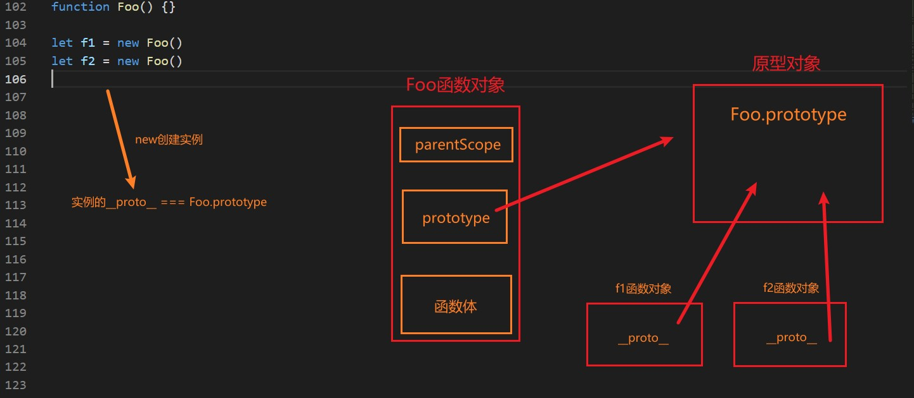

所以，这样一来，往`Foo.prototype`中添加属性，在f1，f2都能访问

```js
Foo.protype.name = 'linming'

console.log(f1.name) //linming
console.log(f2.name) //linming

//通过f1，或者f2向原型对象添加属性
f1.__proto__.age = 22
f2.__proto__.age = 18

console.log(f1.age) //输出：18
```

**4、constructor属性**

```js
function Foo() {}

console.log(Foo.prototype) //输出：{}
```

从上边可以知道，Foo的显示原型对象是空的。

实际上，它不是空的，只是这个原型对象的**enumerable**属性被设置为false，所以我们不能遍历出其中的属性

原型对象上有一个**constructor属性**，指向Foo函数本身

```js
console.log(Foo.prototype.constructor)
//输出：[Function: Foo]
```

所以，下面这样写也是允许的

```js
//获取函数名
console.log(Foo.prototype.constructor.name)  //输出：Foo

//也可以这样
console.log(Foo.prototype.constructor.prototype.constructor.prototype.constructor)
//输出：[Function: Foo]
```

5、修改原型对象

有时候我们不想用原来的原型对象，可以这么做

```js
function Foo() {}

Foo.prototype = {}  //直接修改了整个prototype
```

这样的结果是，我们直接断开了指向原本的原型对象，转而指向这个新的{}

```js
Foo.prototype = {
    name: 'linming',
    age: 22,
    height:1.78
}
```

当然这个新创建的`{}`对象并不完美，因为 其中没有constructor属性

真实开发中，我们可以通过`Object.defineProperty`方法添加constructor

```js
Object.defineProperty(Foo.prototype, "constructor", {
    enumerable: false,  //原来的原型对象的constructor是不能被遍历的
    writable: true,
    configurable: true,
    value: Foo //指向本身
})
```

测试代码

```js
let f1 = new Foo()
let f2 = new Foo()

console.log(f1.name, f2.age, f2.height);

console.log(Foo.prototype.constructor.name); //Foo
```

### 10.4 原型链

我们知道，查找一个对象的属性和方法时，会触发[[ get ]]操作

1、在当前对象中查找

2、如果没有找到，将会去对象的原型上（`__proto__`）查找

```js
const obj = {}
obj.__proto__.address = "广州市"
console.log(obj.address) //输出：广州市
```

3、如果还没找到，会继续沿着原型链查找（原型对象是一个对象，对象有自己的原型对象）

```js
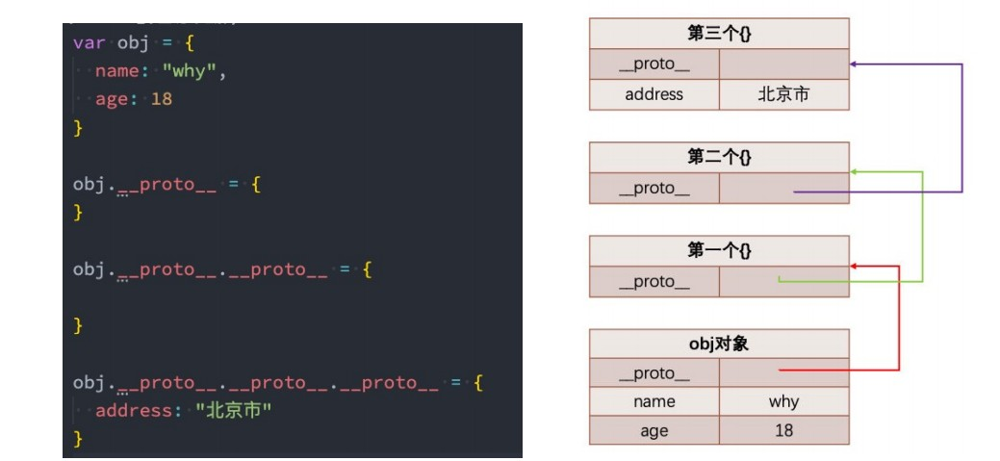obj.__proto__ = {}
obj.__proto__.__proto__ = {}
obj.__proto__.__proto__.__proto__ = {
    address: 'linming'
}
console.log(obj.address) //输出：linming
```

​    

但是原型链不是无限的，最终会止于最顶层原型

那么最顶层的原型是是谁呢？就是Object的原型对象

### 10.5 Object的原型

**Object本质上是一个构造函数**，Object也是js所有类的父类

```js
const obj = {}
console.log(obj.__proto__)
//输出：[Object: null prototype] {}
```

这里输出的obj的隐式原型就是Object的显式原型对象`[Object: null prototype] {}`

为什么呢？为什么obj的隐式原型可以打印出来的就是顶层原型？

**重点理解**

```js
const obj = {}
//等于
const obj = new Obejct()
```

事实上字面量定义一个对象，就是`new Object()`的语法糖

结合前面说过的调用new创建出一个对象所经过的步骤，就不难理解

```js
const obj = new Object()
//1.创建出一个{}
//2.this = {}
//3.{}.__proto__ = Object.prototype
//4.执行函数体
//5.返回这个对象
```

所以，这样一来，`obj.__proto__ === Object.prototype`

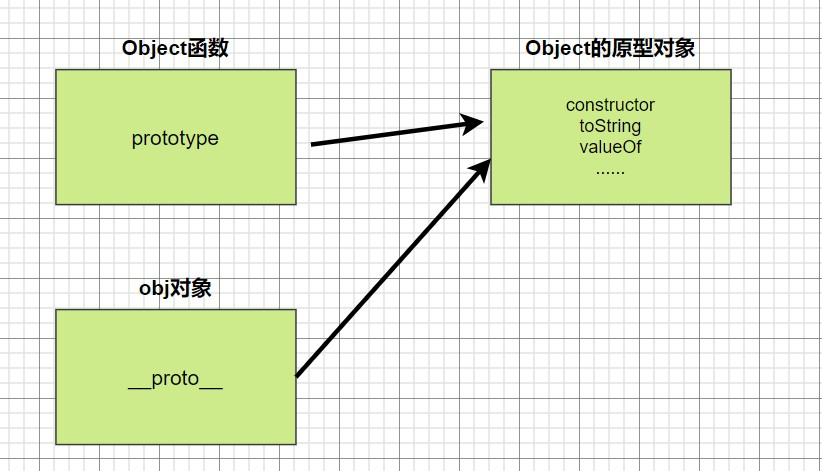

那么Object的原型对象里边都有什么呢？

有很多默认的属性和方法

```js
console.log(Object.getOwnPropertyDescriptors(Object.prototype))
//输出：
//constructor
//defineGetter__
//defineSetter__
// __lookupGetter__
//__lookupSetter__
//isPrototypeOf
//toString
//valueOf
//__proto__
//...
```

注意：其中，顶层显式原型对象是一个对象，它的隐式原型是null

```js
const obj = new Object()
console.log(obj.__proto__.__proto__) //输出：null
```

**构造函数的顶层原型对象**

思考：构造函数的显式原型也是一个对象，这个对象是否有[[prototype]]隐式原型属性呢？

答案是肯定的

```js
function People() {}

console.log(People.prototype.__proto__) 
//[Object: null prototype] {}
```

并且该People构造函数的原型对象的原型指向最顶层的Object的原型

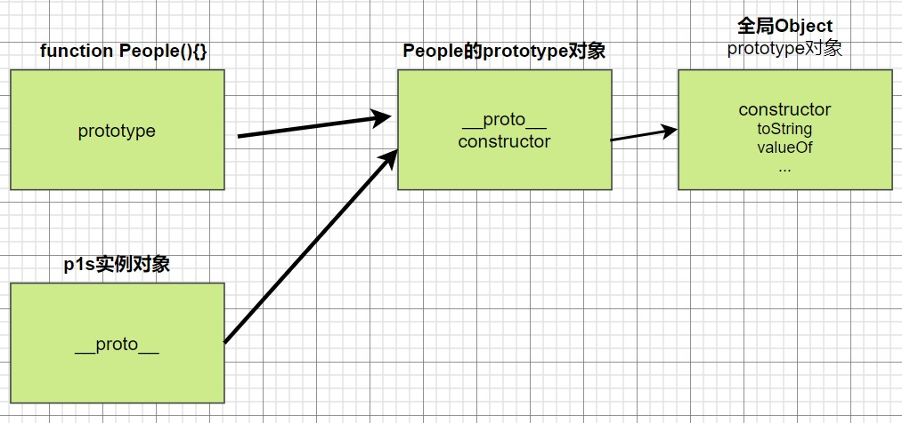

所以，可以说People构造函数继承自Object

### 10.6 继承

**1、基于原型链的继承方案**

```js
// 父类
function People() {
    this.name = 'linming'
}
People.prototype.running = function() {
    console.log(this.name + "在跑步")
}

// 子类
function Student() {
    this.age = 22
}

// 继承：改写了Student的显示原型，指向People的实例
Student.prototype = new People()
//也可以写成： const p1 = new People()  Student.prototype = p1

Student.prototype.eating = function() {
    console.log(this.name + "在吃东西")
}

const stu = new Student()
console.log(stu.age) //22
console.log(stu.name) //linming
stu.running() //linming在跑步
stu.eating() //linming在吃东西
```

最主要的代码是`Student.prototype = new People()`

这里将Student的原型改写为People的实例，由此实现了继承

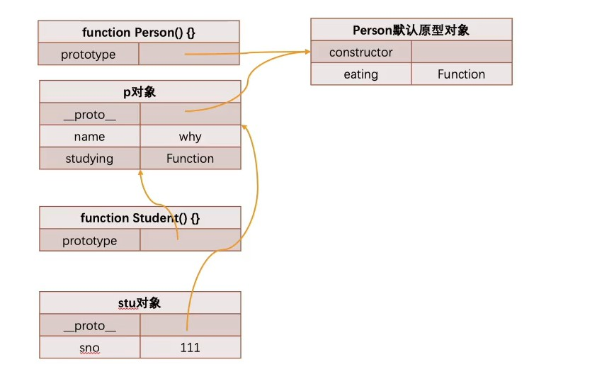

原型链实现的继承有很多的弊端：

1、继承的属性是打印不出来的

```js
console.log(stu)
//输出：People { age: 22 }
```

但是明显我们要的是能显示出继承的name属性、eating方法

（错误？）2、实现继承的多个实例，新增属性时会共享,即多个实例都能访问得到（只能修改已定义的属性，新增的属性不会共享）

```js
var stu1 = new Student()
var stu2 = new Student()

stu1.name = 'xiaoming' //原先的name修改会被共享
console.log(stu2.name);
```

通常情况下我们希望的效果是，修改stu1的name，应该只能应用在stu1上，但实际上stu2也被修改了

3、传递参数不方便

**2、借用构造函数的继承方案**

对上边的案例进行简单的改造，就可以很好的解决出现的三个弊端

```js
function People(name, age, address) {
    this.name = name
    this.age = age
    this.address = address
}
People.prototype.running = function() {
    console.log(this.name + "在跑步")
}

function Student(name, age, address, sno) {
    // this = 所创建的实例
    People.call(this, name, age, address)
    this.sno = sno
}
//改写Student的原型对象
Student.prototype = new People()

//解决弊端1、3
const stu1 = new Student('linming', 22, '揭阳', 20180201) 
const stu2 = new Student('小明', 223, '广州', 201803041) 
console.log(stu1) 
console.log(stu2)
//解决
stu1.name = "林明" 
console.log(stu2.name)
```

弊端：

1、Person函数至少被调用了两次

2、stu的原型对象上会多出一些属性，但是这些属性是没有存在的必要

**3、原型式继承**

```js
var obj = {
    name: 'linming',
    age : 22
}
//原型式继承函数
function createObject(newPrototype) {
    var obj = {}
    // 将obj的原型改写为newPrototype
    Object.setPrototypeOf(obj, newPrototype)
    return obj
}

const info = createObject(obj)
console.log(info) //输出：{}
console.log(info.__proto__) //输出：{ name: 'linming', age: 22 }
```

创建出第三方的对象obj，使其成为info的隐式原型

ES6之后，有一个新的函数`Object.create`，可以实现与`createObject()`同样的效果

```js
const info = Object.create(obj)
console.log(info) //输出：{}
console.log(info.__proto__) //输出：{ name: 'linming', age: 22 }
```

**`Object.create()`**方法创建一个新对象，使用现有的对象来提供新创建的对象的__proto__

**4、寄生式继承**

```js
var personObj = {
    running: function() {
        console.log("running");
    }
}


function createStudent(name) {
    var stu = Object.create(personObj)
    stu.name = name
    stu.studying = function() {
        console.log("studying~")
    }
    return stu
}

var stuObj = createStudent("why")
var stuObj1 = createStudent("Kobe")
var stuObj2 = createStudent("james")

console.log(stuObj)
//输出：{ name: 'why', studying: [Function (anonymous)] }
```

**5、寄生组合式继承**

```js
function Person(name, age, firedns) {
    this.name = name
    this.age = age
    this.firedns = firedns
}

Person.prototype.running = function() {
    console.log("running~")
}
Person.prototype.eating = function() {
    console.log("eating~")
}

function Student(name, age, friends, sno, score) {
    Person.call(this, name, age, friends)
    this.sno = sno
    this.score = score
}

// 改写Student的原型对象
// 创建一个对象，该对象的隐式原型指向Person的原型对象，赋值给Student的原型
Student.prototype = Object.create(Person.prototype)
//解决Student的原型中的constructor指向Person的问题
Object.defineProperty(Student.prototype, "constructor", {
    enumerable: false,
    configurable: true,
    writable: true,
    value: Student
})

Student.prototype.studying = function() {
    console.log("studying~");
}

var stu = new Student("why", 18, ['kobe'], 111, 100)
console.log(stu) 
stu.studying() //studying~
stu.running() //running~
stu.eating() //eating~
```

### 10.7 原型内容补充

**1、hasOwnProperty**

判断对象是否有一个属于自己的属性（不是在原型上的属性）

```js
var obj = {
    name: 'linming',
    age: 18
}

var info = Object.create(obj, {
    address: {
        value: "上海市",
        enumerable: true
    }
})
//注：Object.create的第二个参数，是给info对象直接添加上去的属性，不在原型上


console.log(obj.hasOwnProperty("address")) //true
console.log(obj.hasOwnProperty("name")) //false
```

**2、in操作符**

判断某个属性是否在某个对象或者对象的原型上

```js
console.log("address" in info) //true
console.log("name" in info) //true
```

**3、for...in**

该遍历操作可以遍历出原型上的属性

```js
for (let key in info) {
    console.log(key)
}
// address name age
```

**4、instanceof**

用于检测构造函数的prototype，是否出现在某个实例对象的原型链上

假设Student构造函数继承自People类

```js
var stu = new Student()

console.log(stu instanceof Student) //true
console.log(stu instanceof People)  //true
console.log(stu instanceof Object)  //true
```

### 10.8 对象-函数-原型的联系

1、对象存在**隐式原型**

```js
const obj = {}
//相当于
const obj = new Object() //new操作，使obj的隐式原型指向Object的显式原型

console.log(obj.__proto__) //顶层Object的显示原型：[Object: null prototype] {}

console.log(obj.__proto__ === Object.prototype) //true
```

2、函数存在**隐式原型**、也存在**显式原型**

隐式原型(对象)：`Foo.__proto__`

显式原型(对象)：`Foo.prototype`

```js
//为什么FOO函数也是一个对象？
let Foo = new Function()
```

Funtion是Foo的父类（同时，Function本身也是一个对象、也是一个构造函数）

函数的显式原型与隐式原型是不相等的

```js
console.log(Foo.__proto__ === Foo.prototype) //false
```

```js
//Foo.protorype来自哪里
//答案：创建一个函数时，js引擎自动为其添加的
Foo.prototype = { constructor: Foo }
```

```js
//Foo.__proto__来自哪里
//答案：new Function()，即Function对象的显式原型
// Foo.__proto__ === Function.prototype
```

3、关系图

特别注意：

A、`Function.__proto__ === Function.prototype`（自己创造了自己）

B、Object函数对象也可以理解成`const Object = new Function()`,所以它的隐式原型指向Function的显式原型

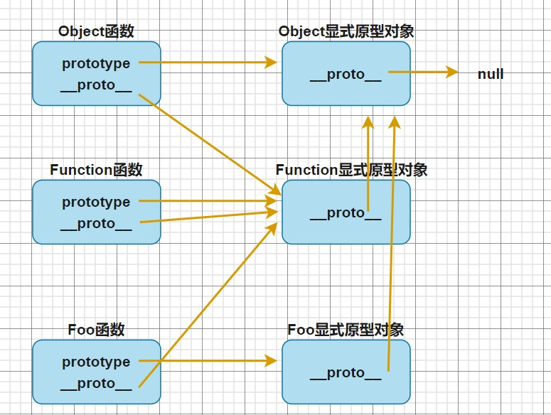

创建一些实例，其指向关系如何

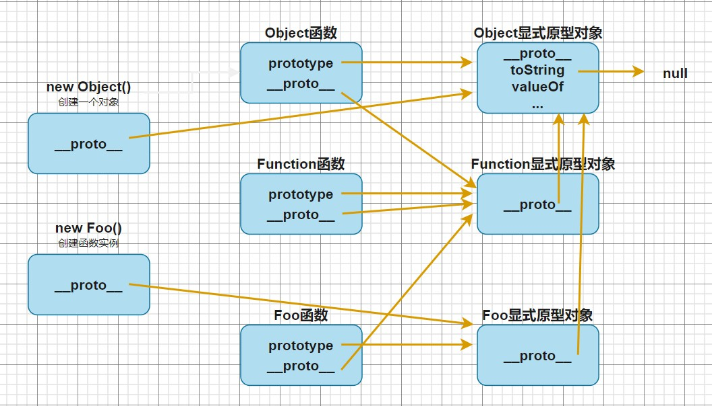

**总结**

```js
1、对象
在js中,每个对象都存在一个隐式原型，默认是一个空对象，可以通过.__proto__访问
当我们访问js对象中的属性时，如果对象自身没有，则会沿着隐式原型查找，找到则返回，直到顶层对象的显示原型

2、函数
函数因为本质也是对象，所以也存在隐式原型
同时函数也存在显示原型，通过prototype访问，显示原型里有一个constructor属性指向函数本身,同时因为显示原型也是一个对象，它也包含了隐式原型，这个隐式原型指向了顶层对象的原型

3、顶层Object
顶层Object是一个构造函数，它的显示原型中存在很多的方法，例如toString等
它的隐式原型是null

4、构造函数
当我们创建一个实例对象时，默认这个实例对象的隐式原型会指向构造函数的显示原型。所以我们可以通过原型链一层层地查找想要的属性，直到顶层Obecjt
```
