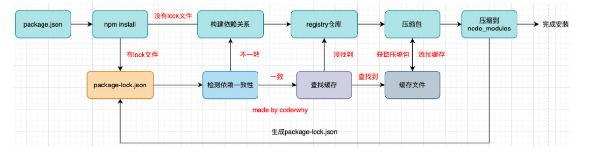

# JavaScript高级（三）

```js
@title 'JavaScript高级（三）' 
@description 'JavaScript新版本特性、高级用法与部分原理提升'
@image 'https://mzlin2020-notes.oss-cn-shenzhen.aliyuncs.com/img/js%E9%AB%98%E7%BA%A7/esmodule%E5%8E%9F%E7%90%861.jpg'
```

## 一、async和await

### 1.1 推导

需求：

假设有这么一个网络请求函数request，每次请求到结果后需要处理一下，再次发送网络请求

```js
//模拟网络请求
function request(url) {
    return new Promise((resolve, reject) => {
        setTimeout(() => {
            resolve(url)
        }, 2000)
    })
}
```

**方式一：回调地狱**

```js
request('mall').then(res =>{
    request(res + '/home').then(res => {
        request(res + '/detail').then(res => {
            console.log(res)
        })
    })
})
//输出：mall/home/detail
```

**方式二：promise返回值**

```js
request('mall').then(res => {
    return request(res + '/home')
}).then(res => {
    return request(res + '/detail')
}).then(res => {
    console.log(res)
})
//输出：mall/home/detail
```

**方式三：promise + generator**

```js
function *getData() {
    yield request('mall')
}

const  generator = getData()
generator.next()
//输出：request('mall')结果（一个promise）：{ value: Promise { <pending> }, done: false }

generator.next().value.then(res1 => {
    console.log(res1)
}) //输出：mall
```

重要一步：（理解yield的参数传递）将拿到的mall，传到第一个yield前面`const res1 = yield request('mall') `

调用第二个yield时，就可以使用res1了

```js
function *getData() {
    cosnt res1 = yield request('mall')
    const res2 = yield request(res1 + '/home')
}
const  generator = getData()
generator.next().value.then(res1 => {
    generator.next(res1) //传递参数
})
```

完整的代码如下

```js
function *getData() {
    const res1 = yield request('mall')
    const res2 = yield request(res1 + '/home')
    const res3 = yield request(res2 + '/detail')
}
const  generator = getData()
generator.next().value.then(res1 => {
    generator.next(res1).value.then(res2 => {
        generator.next(res2).value.then(res3 => {
            console.log(res3)
        })
    })
})

//输出：mall/home/detail
```

是不是觉得上边的代码相比起前两种方式没什么改进？但是其实可以利用一些方式让生成器自调用

或者利用一些库（co），来省略这一步。所以经过这两种方式的转化，代码简化为如下

```js
function *getData() {
    const res1 = yield request('mall')
    const res2 = yield request(res1 + '/home')
    const res3 = yield request(res2 + '/detail')
    console.log(res3)
}
```

**方式四：async与await**

而async与await就是上方的语法糖(`*` -> async，yield -> await )

```js
async function getData() {
    const res1 = await request('mall')
    const res2 = await request(res1 + '/home')
    const res3 = await request(res2 + '/detail')
    console.log(res3)
}
getData()
//输出：mall/home/detail
```

### 1.2 基本语法

添加一个async，函数的执行顺序是怎样的？

```js
async function foo() {
    console.log('内部代码执行~')
}
console.log('start~')
foo()
console.log('end~')

//输出：start~ 内部代码执行 end~
```

答案：同步执行

**与普通函数的区别一**

返回一个promise

```js
async function foo() {}
const promise = foo() 
promise.then(res => {
    console.log(res)
})
```

那么promise中的状态是由什么决定的呢？什么时候能调用then

答案：当foo函数有返回值时，状态变为fulfilled

```js
//情况1：返回普通对象或值
async function foo() {
    return '123'
}
const promise = foo() 
promise.then(res => {
    console.log(res) 
})//输出：123

//情况2：返回一个promise，状态由这个promise决定
async function foo() {
    return new Promise((resolve) => {
        resolve('hahah')
    })
}
foo().then(res => {
    console.log(res)
}) //hahah

//情况3：thenable
async function foo() {
    return {
        then: function(resolve) {
            resolve('111')
        }
    }
}
foo().then(res => {
    console.log(res)
}) //111
```

**与普通函数的区别二（抛出异常）**

异步函数中的异常，会被作为异步函数返回的promise的reject值

```js
async function foo() {
    console.log("代码执行");
    throw new Error("发生了不可描述的错误~")
}
foo().catch(err => {
    console.log(err);
})

//输出：代码执行，发生了不可描述的错误,.....(错误说明)
```

## 二、JavaScript的模块化

**什么是模块化？**

- 将一个复杂的程序依据一定的规则(规范)封装成几个块(文件), 并进行组合在一起
- 块的内部数据与实现是私有的, 只是向外部暴露一些接口(方法)与外部其它模块通信

**模块化的优势？**

1、避免命名冲突

2、更好的分离，按需加载

3、更高复用性

4、高可维护性

### 2.1 CommonJS规范

CommonJS是一个规范，最初提出来是在浏览器以外的地方使用，并且当时被命名为ServerJS，后来为了体现它的广泛性，修改为CommonJS。

Node是CommonJS在服务器端的一个具有代表性的实现。

1、在node中每一个js文件都是一个单独的模块

2、这个模块中包括CommonJS规范的核心变量：exports、module.exports、require

**exports与require**

案例理解

创建main.js 与bar.js ，在main.js中导入bar.js模块

```javascript
//main.js

// require("./bar") 相当于导入了exports（本质是指向了与exports一样的内存地址）
//require是一个函数，可以理解成它返回了exports对象

//这里变量bar==exports （也指向了与exports一样的对象）
const bar = require('./bar')

// 这里利用了ES6的解构赋值
// const {name,age,fn} = require('./bar')

console.log(bar.name);
console.log(bar.age);
bar.fn();
```

```javascript
//bar.js
const name = "linming";
const age = 18;

function fn() {
    console.log("hello " + name);
}

//exports默认是一个全局空对象
exports.name = name;
exports.age = age;
exports.fn = fn;
```

从上面的例子我们可以知道，exports是一个默认存在的空的对象，我们向外导出的变量变成了exports的属性（方法），用require导入的其实就是exports这个对象。

**module.exports**

在Node中我们进行导出时，往往不用exports，而是通过module.exports导出的。

那么exports与module.exports有什么关系吗?

1、CommonJS中是没有module.exports这个概念的，但是为了实现模块的导出，Node中使用的是Module的类，每一个模块都是module的一个实例。

2、所以在Node中真正用于导出的其实根本不是exports，而是module.exports

在Node源码中规定`module.exports = exports`，所以二者指向同一个引用。即**module.exports = exports=require（）**

所以，在开发中，尽量使用`module.exports`进行导出

**require细节**

require是一个函数，可以帮助我们引入一个文件（模块）中导入的对象。

require的查找规则是怎么样的呢？

requiere（X）

1、情况一：

X是一个核心模块，比如path。那么直接返回核心模块，并停止查找

2、情况二：

X是以 ./ 或 ../ 或 / 开头的

查找规则：

将X当做一个文件在对应目录下查找，如果有拓展名，按照拓展名查找；

没有拓展名，则查找文件X>查找X.js >查找X.json > 查找X.node文件，直到找到为止。或者将X当做一个文件夹查找，会依次去查找上述规则文件夹下的index.js文件

3、情况三：

直接是一个X（没有路径），并且X不是一个核心模块

查找规则：会循着文件路径，依次去每个文件夹下的node_modules文件夹下查找。

**模块的加载过程**

结论一：模块在被第一次引入时，模块中的js代码会被运行一次

结论二：模块被多次引入时，会缓存，最终只加载（运行）一次

为什么只加载一次呢？因为每个模块对象module都有一个属性loaded，默认为false，为true时表示已经被加载了

结论三：存在循环引用、也只加载一次。而且按照的是图结构的深度优先搜索的顺序

**CommonJS规范的缺点**

1、CommonJS加载模块是同步的。

这意味着只有等到对应的模块加载完毕，后续的内容才能被运行（从上往下），这在服务器中不会有什么问题，因为服务器加载的js文件都是本地文件，加载速度非常快。

但是如果它应用于浏览器。因为浏览器需要从服务器中将文件下载下来，再运行。采用同步的方式则意味着之后的js代码无法正常运行。

### 2.2 ES Module

ES Module与CommonJS的模块化有一些不同之处

1、它使用了import和export关键字

2、另一方面它采用编译期的静态分析，并且加入了动态引用的方式。

3、采用ES Module将**自动**采用严格模式： use strict

4、ES Module加载模块是异步的

**导入导出的三种方式**

注：es6的模块化需要在服务器上运行才有效。（使用vscode的live serve插件）

```javascript
//创建index.html
<body>
    <script src="./index.js" type="module"></script>
</body>
```

注：下面的演示，并不是一一对应关系

1、方式一

```javascript
//foo.js
//在语句声明的前面直接加上export关键字
export const name = 'linming';
export const age = 18;
export const sayHello = function (name) {
    console.log("你好"+name);
}

//index.js
//import {标识符列表} from '模块'
import { name,age,sayHello } from "./js/foo.js"; //拓展名不能省
console.log(name);
console.log(age);
sayHello('lin')
```

2、方式二

```javascript
//foo.js
//将所有需要导出的标识符，放到export后面的 {}中
const name = 'linming';
const age = 18;
const sayHello = function (name) {
    console.log("你好"+name);
}
export {name,age,sayHello}
// 注：{}中统一导出，{}大括号不是一个对象

//index.js
//导入时给标识符起别名
import {name as wName, age as wAge, sayHello as Wfn} from './js/foo.js'
console.log(wName);
console.log(wAge);
Wfn('linming')
```

3、方式三

```javascript
//foo.js
//导出时给标识符起一个别名
export {
    name as fName,
    age as fAge,
    sayHello as fFn
}

//index.js
//通过 * 将模块功能放到一个模块功能对象（a module object）上
import * as obj from './js/foo.js'
console.log(obj.fName);
console.log(obj.fAge);
obj.fFn('linming')
```

**default用法**

前面学习的导出功能都是有名字的导出，比如导出

```javascript
export const sayHello = function () {}
//在导出时指定了名字，在导入import时需要知道具体的名字
```

但是，默认导出（default export）可以不用指定名字，并且在导入时可以自己来指定名字。

```javascript
//导出
export default function () {}
//导入import fn from '路径'
```

注：在一个模块中，只能有一个默认导出

**Node对ES Module的支持**

在Node的current版本（v14.13.1）中，支持es module。

方式一：在package.json中配置 type：module

方式二：文件以.mjs结尾，表示使用的是ES Module

```javascript
//演示方式二
//js/bar.mjs
const name = 'ming';
const sayHello = function (name) {    
    console.log("你好" + name);}
export {
    name,
    sayHello
}

//main.mjs
import { name,sayHello } from "./js/bar.mjs";
console.log(name);
sayHello("明明");
```

### 2.3 ES Module原理

**ES Module的解析流程**

+ 阶段一：构建（constructor）,根据地址查找js文件，并且下载，将其解析成模块记录（module record）

+ 阶段二：实例化(instantiation)，对模块记录进行实例化，并且分配内存空间（其中的属性为undefined，未赋值），解析模块的导入和导出语句，把模块指向对应的内存地址

+ 阶段三：运行（Evaluation），运行代码，计算值，并且将值填充到内存地址中

**阶段一：构建**


```html
<script src="main.js" type="module"></script>
```

当执行上方代码时，浏览器会把main.js中的代码下载下来，并生成一个`Module Record`（数据结构），它有一个属性`RequestedModules`，这个属性记录着main.js中依赖的其他js文件

是否存在同一个文件被多次引用的情况呢？

不存在，因为每一个JS文件都会被映射到了`Module Map`表中，该映射表不允许存在相同的文件地址

ES Module有个特点：静态分析。也就是说js文件被下载好了，但是并不会执行其中的代码

```js
//静态分析
import bar from 'bar.js'

//静态分析不了的代码:因为代码未被执行，isFlag的值也没有确定下来
let isFlag = true
if(isFlag) {
    import bar from 'bar.js'
}
```

**阶段二、阶段三**


```js
//假设main.js引用着其他两个js文件
import { count } from 'counter.js'
import { render } from 'display.js'
```

这两个被引用的JS文件也会形成`Module Record`数据结构，并且两个文件分别向外暴露了`count`和`render`函数，这些变量方法会被存放在一块内存空间中，在静态编译阶段，他们的值都是undefined。

代码运行后，他们被赋值了，并最终引入了main.js中

注：

1、允许在原文件中修改数据，但是通过导入方式导入的数据不允许被修改

2、在webpack环境下，允许CommonJS与ESModule相互引用

### 2.4 对比

1、导入导出语法不同，commonJS是`module.exports、exports、require`，es模块是`export、import`

2、CommonJS模块输出的是一个值的拷贝（浅拷贝），ES模块输出的是值的引用

注：CommonJS导出的是一个值拷贝，会对加载结果进行缓存，一旦内部再修改这个值，则不会同步到外部。ES6是导出一个值的引用，内部修改可以同步到外部（一般不建议修改）

3、CommonJS模块是运行时加载，ES模块是静态编译时加载

4、CommonJS中顶层的this指向这个模块本身，而ES6中顶层this指向undefined

5、ES6在编译期间会将所有import提升到顶部，CommonJS不会提升require

## 三、包管理工具npm

Node package Manager 

### 4.1 package.json

事实上，每一个项目（无论是前端项目还是后端项目），都有一个对应的配置文件。

说明：这个配置文件记录着项目的名称、版本号、项目描述等，也记录着项目所依赖的其他库的信息和依赖的版本号。

**常见的属性**

1、name是项目的名称；(必要)

2、version是当前项目的版本号；(必要)

3、description是描述信息，很多时候是作为项目的基本描述；

4、author是作者相关信息（发布时用到）；

5、license是开源协议（发布时用到）；

6、scripts属性——该属性用于配置一些脚本命令，以键值对的形式存在。配置后我们就可以通过npm run 命令的key来执行这个命令

7、dependencies属性——指定无论开发环境还是生产环境都需要依赖的包

8、devDependencies属性——通过npm install ** --save -dev 安装的包，开发时依赖，项目上线后不需要

**版本管理的问题**

我们安装的版本依赖：^2.0.3 或者 ~2.0.3 这是什么意思呢？

npm的包通常需要遵从semver版本规范

1、X主版本号：当发布了不兼容之前版本的API修改（如webpack4升级到webpack5）

2、Y次版本号：当做了向下兼容的功能性新增（新功能增加）

3、Z修订号：当做了向下兼容的问题修正（没有新功能，修复之前版本的bug）

^ 和 ~ 的区别

1、^x.y.z：表示x是保持不变的，y和z永远安装最新的版本；

2、~x.y.z：表示x和y保持不变的，z永远安装最新的版本

所以，在package.json中，安装的依赖都是大致的版本，并不是精确的版本。真正精确的版本信息保存在**package-lock.json**中

### 4.2 npm install

1、全局安装： `npm install <包> -g`

2、局部安装：`npm install <包>`

其中局部安装分为开发时依赖和生产时依赖：

安装开发和生产依赖：`npm install <包> `

开发依赖：`npm install <包> -dev` 

注：--save是表示将依赖关系添加到package.json中，但是npm5之后可以省略。



npm install会检测是有package-lock.json文件。

**其他命令**

卸载某个依赖包：`npm uninstall <package>`

强制重新build ：`npm rebuild`

清除缓存：`npm cache clean     `

### 4.3 其他工具

**yarn**

yarn是为了弥补npm的一些缺陷而出现的

常见的命令：

安装依赖：`yarn install`

填加包：`yarn add <package>`

移除包 ：`yarn remove <package>`

**cnpm**

查看当前npm镜像

`npm config get registry` 

输出（npm镜像）：`#npm config get registry`

输出（淘宝镜像）：`#httpS://r.npm.taobao.org/`

我们可以直接将npm命令设置为淘宝镜像（不推荐）

`npm config set registry https://registry.npm.taobao.org`

比较推荐将镜像绑定在cnpm上，并且将cnpm设置为淘宝的镜像，这样子不会影响原来npm命令的使用。

`npm install -g cnpm --registry=https://registry.npm.taobao.org`

## 四、JSON数据存储

### 4.1 基本概念

JSON是一种非常重要的数据格式，它并不是编程语言，而是一种可以在服务器和客户端之间传输的数据格式

应用场景：

1、网络数据的传输JSON数据

2、项目的某些配置文件

3、非关系型数据库（NoSQL）将json作为存储格式

其他传输格式：

1、XML：在早期的网络传输中主要使用XML来进行数据交换的，但是这种格式在解析，传输等各方面都弱于JSON，所以目前已经很少被使用了

2、Protobuf：另外一个在网络传输中目前已经越来越多使用的传输格式是protobuf，但是它在2021年3.x版本才支持JavaScript，所以目前在前端使用的较少

### 4.2 基本语法

JSON顶层支持三种类型的值

+ 简单值：数字(Number)、字符串(String)、布尔值、null类型。（注：不支持undefined）

```json
123,
true,
'str'
```

+ 对象值：由key、value组成，key是字符串类型，并且必须添加双引号，值可以是简单值、对象值、数组值

```json
{
    123,
    "obj" : {
        "key": "value"
    }
}
```

+ 数组值：数组值可以是简单值、对象值、数组值

```json
[
    true,
    {
        "name": "linming"
    }
]
```

**localStorage的问题**

当我们将一个对象进行本地缓存的时候，这个对象会被转为字符串

```js
const obj = {
    name: 'linming',
    age: 23
}
localStorage.setItem("obj", obj) //obj会被转为字符串，“[object, object]”
console.log(localStorage.getItem("obj")) 
//输出：[object, object]
```

发现存储的obj的内容丢失了

要解决上述的问题，可以将obj转为json格式，再转为js数据格式

```js
localStorage.setItem("obj", JSON.stringify(obj))
console.log(localStorage.getItem("obj")) 
// 输出: {"name":"linming","age":23}

let res = JSON.parse(localStorage.getItem("obj"))
console.log(res)
//输出： {name: 'linming', age: 23}
```

### 4.3 序列化与解析

**JSON序列化**

JSON序列化可以将一个js数据结构转换成JSON

```js
const obj = { name: 'ming' }
JSON.stringify(obj)   //{ "name": "ming" }
```

这个方法可以接收第二个参数replacer

```js
const obj = {
    name: 'lin',
    age: 22
}
//情况一:传入数组，指定哪些是需要转换的
JSON.stringify(obj, ["name"])   //输出：{"name":"lin"}

//情况二：传入回调函数：拦截处理
let res = JSON.stringify(obj, (key, value) => {
    if(key === "age") {
        return value + 1
    }
    return value
})
console.log(res)
```

也可以有第三个参数apace，这个参数用于是输出JSON数据格式更具可读性

```js
JSON.stingify(obj, null, 2) //传入数值，表示空格
//输出：
{
  "name": "lin",
  "age": 22
}

JSON.stingify(obj, null, "--")
//输出：
{
--"name": "lin",
--"age": 22
}
```

另外，如果被转换对象中有toJSON方法，最终结果由该方法决定

```js
const obj = {
    num: 20,
    toJSON: function() {
        return "格式由我决定"
    }
}
console.log(JSON.stringify(obj));
//输出：格式由我决定
```

**JSON解析**

`JSON.parse()`也可以将一个JSON对象转换成js数据结构

```js
const JSONString = '{ "name": "lin", "age": 22, "isFlag": true }'

console.log(JSON.parse(JSONString));
//输出：{name: 'lin', age: 22, isFlag: true}
```

也可以传进第二个参数，可以对解析的值进行拦截

```js
let res = JSON.parse(JSONString, (key, value) => {
    if(key === "age") {
        return value - 1
    }
    return value
})
console.log(res)
//{name: 'lin', age: 21, isFlag: true}
```

### 4.4 实现深拷贝

利用JSON我们可以来拷贝一个对象，并且实现的是深拷贝

```js
const obj = {
    name: 'linming',
    age: 23,
    friends: {
        name: 'xiaohao',
        age: 22,
        hobbies: ["吃饭", "睡觉", "看剧"]
    },
}

const obj2 = JSON.stringify(obj)
obj2 = JSON.parse(obj2)
//obj与obj2相互独立，改变不会相互影响
obj.friends.hobbies[3] = "刷手机"
console.log(obj2);  //输出的值里没有变化
```

上边的案例中，实现了obj与obj2的深拷贝。但是利用JSON进行深拷贝有一个致命的缺陷：

JSON实现的深拷贝，无法拷贝函数

```js
const obj = {
    name: 'linming',
    friends: {
        name: 'xiaohao',
        age: 22,
        hobbies: ["吃饭", "睡觉", "看剧"]
    },
    run: function() { //函数
        console.log(this.name, "喜欢跑步")
    }
}

let obj2 = JSON.parse(JSON.stringify(obj))
console.log(obj2)  //发现没有把函数拷贝下来！！！
```

另外：undefined、Symbol也会被忽略

### 4.5 indexedDB

indexedDB是一种数据库。一般而言，存储大量数据是需要使用后端的数据库的，但是如果想要保存在浏览器，就可以选择使用indexedDB

indexedDB是一种底层的API，用于在客户端存储大量的结构化数据。它是一种事务型数据库系统，是一种基于JavaScript面向对象数据库。我们需要指定数据库模式，打开与数据库的连接，然后检索和更新一系列事务即可

为什么不适用web storage来保存大量数据呢？

因为首先是web storage的存储大小有限，另一个是不利于搜索，效率不高

基本使用

**indexedDB连接数据库**

1、打开indexedDB的某一个数据库

通过`indexedDB.open(数据库名称，数据库版本)`方法打开一个数据库（如果数据库不存在则创建）

```js
const dbRequest = indexedDB.open("linming")
```

打开成功/失败会触发一下回调函数

```js
//失败
dbRequest.onerror = function(err) {
    console.log("打开数据库失败~")
}
//成功
let db = null
dbRequest.onsuccess = function(event) {
    console.log("打开数据库成功~")
    db = event.target.result
}
```

2、第一次打开数据库时，触发以下回调

```js
dbRequest.onupgradeneeded = function(event) {
    const db = event.target.result
    //创建一些存储对象，users表，主键为keyPath
    db.createObjectStore("users", { keyPath: "id" })
}
```

上面的操作中，数据库第一次被打开后，我们创建了db对象，后续可以通过db这个对象操作数据库。

3、往表中添加数据

```js
const dbRequest = indexedDB.open("linming", 2)
//失败
dbRequest.onerror = function(err) {
    console.log("打开数据库失败~")
}
//成功
let db = null
dbRequest.onsuccess = function(event) {
    console.log("打开数据库成功~")
    db = event.target.result
    console.log(db);
}

dbRequest.onupgradeneeded = function(event) {
    console.log("第一次打开数据库时，触发");
    const db = event.target.result
    //创建一些存储对象，users表，主键为keyPath
    db.createObjectStore('users', {keyPath: 'id'})
}

const  info = {
    "id" : 200,
    "name" : "linming",
    "age" : "14"
}

setTimeout(() => {
    const transaction = db.transaction("users", "readwrite")
    let store = transaction.objectStore("users")
    // 往users表中新增数据  
    const res = store.add(info)
    res.onsuccess = function() {
        console.log("添加操作完成");
    }
}, 300)
```

4、查询数据

```js
const request = store.get(200)
request.onsuccess = function(event) {
    console.log(event.target.result)
}

//输出：{id: 200, name: 'linming', age: '14'}
```

## 五、防抖节流

**防抖节流**的概念其实最早并不是出现在软件工程中，防抖是出现在电子元件中，节流出现在流体流动中。

JavaScript是事件驱动的，大量的操作会触发事件，加入到事件队列中处理。而对于某些频繁的事件处理会造成性能的损耗，我们就可以**通过防抖和节流来限制事件频繁的发生**。

### 5.1 防抖基本理解

在开发中，我们经常使用一些库来提供防抖节流的方法

```js
//lodash
//说明：传递一个想要进行防抖处理的函数与触发时间，返回一个处理好的防抖函数
const newFn = lodash.debounce(fn, 1000)
btn.onclick = newFn
```

**防抖案例理解**：假设有一个搜索框，用户往里边输入内容时，该搜索框下方会帮用户匹配可能想要搜索的内容

```html
搜索：<input type="text">
```

问题：但是如果用户每输入一个单词，都触发一次处理程序去联想可能的内容。假设用户输入：`helloworld`，就触发了10次处理程序，十分消耗性能

解决思路：规定一个时间（如500ms），用户每输入一个单词后延迟500ms后才触发处理程序。

注：（每次输入一个新单词，都会刷新这个500ms的延迟时间）

**防抖的应用场景**

1、输入框中频繁输入内容，搜索或者提交信息

2、频繁的点击按钮，触发某个事件

3、监听浏览器滚动事件，完成某些特定操作

4、用户缩放浏览器的resize事件

**防抖代码案例**

```html
<!--输入框案例-->
<body>
  搜索：<input type="text">
  <script>
    const inputEl = document.querySelector("input")
    let counter = 0
    inputEl.addEventListener('input', () => {
      console.log(`发送了第${++counter}次网络请求`);
    })
  </script>
</body>
```

在输入框中输入`12345`，结果触发了5次事件`发生了第1、2、3、4、5次网络请求`

```html
<!--借助第三方库进行防抖-->
<body>
  搜索：<input type="text">
  <script src="https://cdn.jsdelivr.net/npm/underscore@1.13.1/underscore-umd-min.js"></script>
  <script>
    const inputEl = document.querySelector("input")
    let counter = 0
    const fn = function() {
      console.log(`发送了第${++counter}次网络请求`);
    }
    // 使用防抖函数
    const newFn = _.debounce(fn, 1000)
    inputEl.addEventListener('input', newFn)
  </script>
</body>
```

1秒内输入内容`12345`，最后只有发送一次网络请求。实现了防抖的效果

### 5.2 节流的基本理解

防抖与节流的区别：防抖是从触发事件停止时，开始计时去触发处理程序；而节流是按照固定的频率触发处理程序

理解：假设宣讲会后，讲师进行答疑

情况一：一分钟内，无论有多少同学提问，都只回答一个问题（节流）

情况二：一分钟内，如果有同学提问那么回答问题。超过一分钟无人提问，那么答疑环节结束（防抖）

**节流案例理解**：

1、当事件被触发时，会执行这个事件的响应函数。如果事件被频繁触发，那么节流函数会按照一定的频率来执行函数；不管这中间有多少次触发这个事件，执行函数的频率总是固定的

2、在飞机大战游戏中，假设按一次空格键发射一颗子弹。但是用户在1s内按了10次空格键发射10颗子弹，显然不正常。所以一般会使用节流函数来进行处理，不论1s内按了多少次空格键，都只发射一颗

**节流的应用场景**

1、监听页面的滚动事件

2、鼠标移动事件

3、用户频繁点击按钮的操作

4、游戏中的一些设计

**节流的案例**

```html
<body>
  搜索：<input type="text">
  <script src="https://cdn.jsdelivr.net/npm/underscore@1.13.1/underscore-umd-min.js"></script>
  <script>
    const inputEl = document.querySelector("input")
    let counter = 0
    const fn = function() {
      console.log(`发送了第${++counter}次网络请求`);
    }
    // 节流处理
    const newFn = _.throttle(fn, 1500)
    inputEl.addEventListener('input', newFn)
  </script>
</body>
```

在输入框中持续输入内容，每1.5秒会发送一次网络请求

### 5.3 手写防抖函数

希望实现的效果

```js
let counter = 0
function fn() {
    console.log(`第${++counter}次触发`)
}
//调用
let newFn = debounce(fn, 1000)
input.oninput = newFn
//触发input事件时，调用的是经过防抖处理的newFn
```

**1、基本结构**

所以，我们要实现的就是debounce函数

```js
function debounce(fn, delay) {}
```

最后结果是要返回一个函数

```js
function debounce(fn, delay) {
    const _debounce = function() {

    }
    reutrn _debounce
}
```

传进来的fn函数，能够被执行

```js
function debounce(fn, delay) {
    const _debounde = function() {
        fn()
    }
}

//调用
let newFn = debounce(fn, 1000)
input.oninput = newFn
//输入时，每输入一个值就会触发一次
```

为了实现防抖的延迟执行效果，我们可以加入定时器控制

```js
function debounce(fn, delay) {
    const _debounde = function() {
        setTimeout(() => {
            fn()
        }, delay)
    }
}
```

问题：但是这样子做所有的输入都会在自身被输入后的delay时间后被执行

解决办法：**定义一个清除定时器的变量，每一次进行输入时，把上一次的定时器给清除掉**

```js
//防抖函数基本结构
function debounce(fn, delay) {
    // 1.定义一个变量，保存上一次的定时器
    let timer = null
    //2.真正执行的函数
    const _debounce = function() {
        //取消上一次的定时器
        if(timer) clearTimeout(timer)
        timer = setTimeout(() => {
            //外部传入的真正要执行的函数
            fn()
        }, delay)
    }
    return _debounce
}

//测试代码
    const input = document.querySelector('input')
    let counter = 0
    let fn = function() {
      console.log(`第${++counter}次触发`);
    }

    let newFn = debounce(fn, 1000)
    input.oninput = newFn
```

这样一来，我们就基本实现了防抖函数的基本结构

**2、this与参数**

上边的`debounce`函数已经基本实现了防抖功能，但是`this`与参数传递仍有一些问题

```js
//默认情况下，事件处理程序中的this和event参数
const input = document.querySelector("input")
input.addEventListener("input", function(event) {
    console.log(this, event);
})
//输出：<input type="text"> InputEvent {...}
```

但是，在上方我们自己封装的`debounce`中，打印this和event参数却不是我们想要的结果

```js
let counter = 0
function fn(event) {
    console.log(`第${++counter}次触发`, this, event)
}
//调用
let newFn = debounce(fn, 1000)
input.oninput = newFn
//触发input事件时，输出：window undefined
```

显然是不对的

```js
//解决
function debounce(fn, delay) {
    let timer = null
    return function(...args) {
        if(timer) clearTimeout(timer)
        timer = setTimeout(() => {
            fn.apply(this, args)
        }, delay)
    }
}

    const input = document.querySelector('input')
    let counter = 0
    let fn = function(event) {
      console.log(`第${++counter}次触发`, this, event);
    }

    let newFn = debounce(fn, 1000)
    input.oninput = newFn
```

**3、第三个参数：立即执行**

我们想要实现这么一个功能，往`debounce`中输入一个布尔值，来决定是否立刻触发一次事件处理程序

为什么需要这么一个参数？

```js
//假设用户输入第一个单词，立马就触发一次事件处理程序
搜索：<input type="text">
```

后面用户可能持续在输入，但一直都不会触发第二次程序。那么第一次已触发的事件处理程序可以提升一点用户的体验

所以，我们可以为`debounce`函数增加第三个参数，当这个参数为true时，用户第一次输入立马执行事件处理程序，而不进行防抖

```js
function debounce(fn, delay, immediate = false) {
    let timer = null
    return function(...args) {
        if(timer) clearTimeout(timer)
        if(immediate) { //如果为true立即执行
            fn.apply(this, args)
            immediate = false
        } else {
        timer = setTimeout(() => {
            fn.apply(this, args)
        }, delay)
        }
    }
}

//效果
let newFn = debounce(fn, 1000, true)
input.addEventListener('input', newFn)
//当用户输入第一个字母时，就会立即触发一次
```

以上的防抖函数已经可以解决大部分的应用场景。

如果想要用户输入一段内容后，停顿了一些时间。用户在输入第二段内容的时候，第二段内容的第一个字母也能实现立即执行事件处理程序，可以对代码进行如下改变

```js
//最终效果
function debounce(fn, delay, immediate = false) {
    let timer = null
    let isInvoke = false
    return function(...args) {
        if(timer) clearTimeout(timer)
        if(immediate && !isInvoke) { 
            fn.apply(this, args)
            isInvoke = true
        } else {
        timer = setTimeout(() => {
            fn.apply(this, args)
            isInvoke = false
        }, delay)
        }
    }
}
```

**4、取消功能**

把本次的防抖功能取消掉

为什么需要这一功能？比如搜索框中，我们利用防抖来给用户提供智能联想。但是有些用户目的明确，快速输入内容并点击搜索，此时根本来不及进行一个防抖的时间还在计算当中，同时也因为用户已经不需要这一次的智能联想了，所以可以在用户点击搜索按钮时，把这个防抖功能取消掉，提升性能

```js
function debounce(fn, delay, immediate = false) {
    let timer = null
    let isInvoke = false
    let _debounce = function(...args) {
        if(timer) clearTimeout(timer)
        if(immediate && !isInvoke) {
            fn.apply(this, args)
            isInvoke = true
        } else {
        timer = setTimeout(() => {
            fn.apply(this, args)
            isInvoke = false
        }, delay)
        }
    }

    //取消功能
    //_debounce本身也是一个对象，往其上添加一个方法
    _debounce.cancel = function() {  
        if(timer) clearTimeout(timer)
        timer = null
        isInvoke = false
    }
    return _debounce
}

 // 测试取消功能
const btn = document.querySelector("button")
btn.onclick = newFn.cancel
```

### 5.4 手写节流函数

节流函数的实现效果：

1、第一个输入的内容会立马执行一次事件处理程序

2、后续内容输入会根据时间周期来触发事件处理程序

3、最后一次事件周期，不论内容输入是否达到这个周期，都要执行一次

```js
const remainTime = interval - (nowTime - lastTime)
// remainTime表示用户停止输入后离周期触发时的间隔时间
//interval时间周期
//nowTime每次触发事件的时间戳
//lasttime初始时间

if(remainTime <= 0) {
    //说明一个周期过去了，该触发事件处理程序了
} 
```

**1、基本结构**

```js
function throttle(fn, interval) {
    //1.记录上一次开始的时间
  let lastTime = 0
  // 2.事件触发时，真正执行的函数
  const _throttle = function() {
      //2.1 获取当前事件触发时的时间
    let nowTime = new Date().getTime()
    // 2.2 计算出还剩多少时间去触发函数
    let remainTime = interval - (nowTime - lastTime)
    if(remainTime <= 0) {
      fn() //触发函数
      lastTime = nowTime
    }
  }
  return _throttle
}
```

这个也是实现了第一次输入时，会立即触发一次

**2、控制开始与结尾**

我们可以自定义第一次是否触发或者最后一次输入没有达到周期是否触发

如何控制第一次不触发呢?

可以让`lastTime = nowTime`，只有当`lastTime`过了`nowTime`时间后，才执行第一次事件处理程序

```js
function throttle(fn, interval, options = { leading: true, trailing: false }) {
    const { leading , trailing } = options
    let lastTime = 0
    const _throttle = function() {
        const nowTime = new Date().getTime()
        if(!lastTime && !leading) lastTimg = nowTime //判断是否第一次输入？是怎让其等于当前时间
        const remainTime = interval - (nowTime - lastTime)
        if(remainTime <= 0) {
            fn()
            lastTime = nowTime
        }
    }
    return _throttle
}

//节流
let newFn = throttle(fn, 1000, { leading: false})
inputEl.oninput = newFn
```

效果：在时间周期内，输入内容不会立马触发事件处理程序

trailing的实现比较麻烦，后续再作补充

**3、this和参数**

```js
function throttle(fn, interval, options = { leading: true }) {
    let lastTime = 0
    let { leading } = options
    const _throttle = function(...args) {
        //获取当前时间戳
        let nowTime = new Date().getTime()
        //判断是否为第一次输入，并且传进来的leading为false
        if(!lastTime && !leading) lastTime = nowTime
        let remainTime = interval - (nowTime - lastTime)
        if(remainTime <= 0) {
            fn.apply(this, args)
            lastTime = nowTime
        } 
    }
    return _throttle
}

//测试
function fn(event) {
    console.log(`第${++counter}次触发`, this, args)
}
let newFn = throttle(fn, 2000, { leading: false })
inputEl.oninput = newFn
```

**节流的实现方式二**

```html
<body>
  <input type="text" id="input">
</body>
<script>

  const throttle = function(fn, delay) {
      let flag = true
      return function(...args) {
        if(flag) {
          setTimeout(() => {
            console.log(this)
            fn.apply(this, args)
            flag = true
          }, delay)
          flag = false
        }else {
          return false
        }
      }
    }
  const inputDom = document.getElementById("input")
  inputDom.oninput = throttle(function(e) {
    console.log(e.target.value)
  }, 500)


</script>
```


## 七、设计模式

### 7.1 概述

**分类**

1、创建型

工厂模式---大量创建对象

单例模式---全局只有一个实例

建造者模式---精细化组合对象

原型模式

2、结构型

外观模式

适配器模式---用适配代替更改

享元模式---共享减少数量

桥接模式

装饰器模式---更好地扩展需求

3、行为型

观察者模式

职责链模式---像生产线一样组织模块

状态模式

命令模式

策略模式

迭代器模式

4、技巧性

链模式---链式调用

惰性模式

委托模式

等待着模式

数据访问模式

### 7.2 发布订阅


基本代码结构

```js
//消息中心
let eventMap = {};

// 发布者
function pub(msg, ...rest) {
  eventMap[msg] && eventMap[msg].forEach((cb) => {
    cb(...rest)
  })
}

//订阅者
function sub(msg, cb) {
  eventMap[msg] = eventMap[msg] || []
  eventMap[msg].push(cb)
}
```

简单理解：以日常点外卖为例，消费者（订阅者）向美团平台（消息中心）订阅一种美食，商家（发布者）发布了该美食

应用：解决回调地狱的问题

```js
const pubSub = new PubSub();

request('url1', (err, res) => {
  // 处理逻辑
  // 发布请求1成功的消息
  pubSub.publish('request1Success')
})

//订阅请求1成功的消息，然后发起请求2
pubSub.subscribe('request1Success', () => {
  request('url2', (err, res) => {
    //逻辑处理...
    //发布请求2成功的消息
    pubSub.publish('request2Success')
  })
})
```

### 7.3 观察者模式

发布订阅和观察者有一定的区别：

1、发布订阅低耦合，通过消息中心连接发布者和订阅着，发布者和订阅者之间没有直接的联系

2、在观察者模式里就是被观察者（Subject），它只需要维护一套观察者的集合（Observer），将有关状态的任何变更自动通知给他们watcher（观察者），这个设计的松耦合的

应用：Vue的响应式

### 7.3 创建型设计模式

**工厂模式**---大量创建对象

> 应用场景：当某一个对象需要经常创建的时候
> 
> 设计方式：写一个方法，只需要调用该方法，就能拿到想要的对象

```js
function fn(type) {
  switch (type) {
    case:'type1':
      return new Type1()
    //...
  }
}
```

```js
//案例:创建多个不同的弹窗
(function() {
function infoPop() {}
function confirmPop() {}

function pop(type, content, color) {
  switch (type) {
    case: 'infoPop':
      return new infoPop(content, color)
    case 'confirmPop':
      return new confirmPop(content, color)
  }
}
}){}


pop('infoPorp', 'hello','red')


//改进
(function() {

function pop(type, content, color) {
  if(this instanceof pop) {
    var s = new this[type](content, color)
  }else {
    return new pop(type, content, color)
  }
  pop.prototype.infoPop = function() {}
  pop.prototype.confirmPop= function() {}
}
}){}
```

**单例模式**---全局只有一个实例

> 目的：需要确保全局只有一个对象
> 
> 应用场景：为了避免重复新建，避免多个对象存在互相干扰
> 
> 设计方式：通过定义一个方法：使用时只允许通过此方法拿到存在内部的同一实例化对象

```js
let Singletin = function(name) {
  this.name = name
}
Singlenton.genInstance = function(name) {
  if(this.instance) return this.instance

  return this.instance = new Singleton(name)
}
```

```js
//例子
function store() {
  this.store = {};
  if (store.install) {
    return store.install;
  }
  store.install = this;
}
var s1 = new store();
var s2 = new store();
s1.store.name = "lin";
console.log(s2);

//输出：{store:{ name:'lin' } }
// 这样以来，只要创建实例，都会指向同一个对象
```

```js
//例子2：vue-router保障全局有且只有一个，否则会错乱

let _Vue
function install(Vue) {
  if(install.installed && _Vue === vue) return
  install.installed = true

   _Vue = Vue
}
vue.use(router) //每次执行都会指向同一个对象
```

**建造者模式**---精细化组合对象

> 目的：需要组合出一个全局对象
> 
> 应用场景：当要创建单个、庞大的组合对象时
> 
> 设计方式：把一个复杂的类各个部分，拆分成独立的类，然后再在最终类里组合到一块

```js
//模块1
function Mode1() {}
//模块2
function Mode2() {}
//组合
function fn() {
  this.mode1 = new Mode1()
  this.mode2 = new Mode2()
}
```

```js
//例子：编辑器与插件

//最终类
function Editor() {
  this.initer = new initHTML()
  this.fontControll = new fontControll( )
}


//子
function initHTML() {}
initHTML.prototype.initStyle = function() {}

//子
function fontControll() {}
fontControll.prototype.changeColor = function() {}


window.Editor = Editor 
```

### 7.4 提高复用性的设计模式

**桥接模式**

> 目的：通过桥接代替耦合
> 
> 应用场景：减少模块之间的耦合

```js
//例子：有三种形状，每种形状有不同的颜色
function rect(color) {
  showColor(color)
}
function circle(color) {
  showColor(color)
}
function delta(color) {
  showColor(color)
}
function showColor(color) {} 
```

**享元模式**

> 目的： 减少对象/代码数量
> 
> 应用场景：当代码中创建了大量类似对象和类似的代码块

```js
//例子：有一百种不同的弹窗，除了文字样式不同，其他内容相同

function Pop() {} 
Pop.prototype.action = function () {}
Pop.prototype.show = function() {}

//提取不同
var = popArr = [
  {text: 'hello111111', style: {} },
  {text: 'hello22222', style: {} },
]
let poper = new Pop()
for (let i = 0; i < 100; i++) {
  pop.show(popArr(i))
}
//思想：创建一个类保存弹窗共有的，不同的部分作为一个公共的享元
```

**模板方法模式**

> 目的：定义一系列操作的骨架，简化后面类似的操作内容
> 
> 应用场景：当项目中出现很多类似操作内容

```js
//例子：编译个导航组件，可能其中包含很多类型。先定下一个基础的组件类，后续的需求延迟到具体使用时再决定


function banseNav() {}

baseNav.prototype.action = function(fn) {}
```

### 7.5 提高扩展性的设计模式

**适配器模式**

> 目的：通过写一个适配器，来代替替换
> 
> 应用场景：面临接口不通用的问题

```js
//例子：后端返回了数据格式不符合，我们需要在获取数据时，实现适配
  data: [
  {
    path: "/home",
    components: home
  },
  {
     path: "/about",
     components: about
  }
]


function handle () {
  return {
    "/home": home,
    "/about": about
  }
}
```

```js
//例子2：例如你有一个自研框架，其中有很多方法跟jquery相似
//那么完全可以不用再写一次该方法

myMethods.deepClone = function() {
  return $.cloneDeep.call(this, arguments)
}
```

**装饰者模式**

> 目的：不重写方法的扩展方法 
> 
> 应用场景：当一个方法需要扩展，但是又不好去修改方法

```js
//例子：当需要去改动他人的代码，往其中增加新功能时。例如给某些点击事件新增操作提示
function decorator(dom, fn) {
  if (typeof dom.onclick === "function") {
    let _old = dom.onclick;
    //重写
    dom.onclick = function () {
      //调用老方法
      _old();
      //执行新的操作
      fn();
    };
  }
}
```

**命令模式**

> 目的：解耦实现和调用，让双方互不干扰
> 
> 应用场景：调用的命令充满不确定性

**观察者模式**

> 目的：减少对象间的耦合，来提高扩展性
> 
> 应用场景：当两个模块直接沟通会增加他们的耦合性时

```js
/基本结构
// 观察存储器
function observe() {
  this.message = {};
}

// 注册监听
observe.prototype.regist = function (type, fn) {
  this.message[type] = fn;
};

// 触发监听
observe.prototype.fire = function (type) {
  this.message[type]();
};
```

```js
//例子：存在两个不相关的模块，需要实现通信
const obj = {
  message: {},
  regist: function (type, fn) {
    this.message[type] = fn;
  },
  function(type) {
    this.message[type](); 
  },
};

// A模块
obj.regist('getSomething', (data) => {
    //doSomething
})
// B模块
obj.fire("getSomething")
```

**职责链模式**

> 目的：为了避免请求发送者与多个请求处理者耦合再一起，形成一个链条
> 
> 应用场景：把操作分割成一系列模块，每个模块只处理自己的事情


**提高代码质量的设计模式**

 **策略模式/状态模式**

> 目的：优化if-else分支
> 
> 应用场景：当出现过多if-else分支


**外观模式**

> 目的：通过为多个复杂的子系统提供一个一致的接口
> 
> 应用场景：当完成一个操作，需要操作多个子系统，不如提供一个更高级的


**迭代器模式**

> 目的：不访问内部的情况下，便利数据
> 
> 应用场景：当我们要对某个对象进行操作，但是又不能暴露内部


**备忘录模式**

> 目的：记录状态，方便回滚
> 
> 应用场景：系统状态多样，为了保证状态的回滚方便，记录状态


## 八、webWorker

webworker是JavaScript的一种多线程机制

包括了dedicatedWorker和sharedWorker（兼容性不好）两大部分

应用：创建新的线程与主线程并行执行，减少卡顿，提升性能

弊端：存在通信开销


所以真正的性能提升：并行的时间消耗 - 通信开销的时间开销

webWorker与主线程的相同点


不同点


```js
//创建DedicatedWorker
const worker = new Worker("worker.js")

//创建sharedWorker
var myWorker = new SharedWorker("worker.js")
```

```js
//index.js
const worker = new Worker('./worker.js')
worker.postMessage('hello')
worker.onmessage = (event) => {
  console.log(event.data) //world
}

//worker.js
self.onmessage = (event) => {
  console.log(event.data)
  postMessage('world')
}
```

## 九、其他

### 9.1 异步函数的传染性

在开发中，如果定义一个网络请求函数并要求返回其结果，那么需要使用到async await。并且如果其他函数执行了该函数，他们也需要用上async await

```js
async function getData() {
  return await fetch('https://my-json-server.typicode.com/typicode/demo/profile').then((resp) => resp.json())
}

async function fn1(){
  //other  works
  return await getData()
}

async function fn2(){
  //other  works
  return await fn1()
}
fn2()
```

弊端：每个使用到getData的函数，都需要使用到async await。破坏了纯函数的结构，产生了副作用


想要实现的效果，不使用async await能够获取到网络请求的结果

思路：在调用时直接报错，在报错中进行结果的处理

```js
//实现
function run(func) {
  let cache = []; //缓存的列表，由于可能不止一个fetch，所以要用一个list
  let i = 0; //缓存列表的下标
  const _originalFetch = window.fetch; //储存原先的fetch
  window.fetch = (...args) => {
    //重写fetch函数，这个fetch要么抛出异常，要么返回真实的数据
    if (cache[i]) {
      //判断一下缓存是否存在，如果存在就返回真实的数据或抛出异常
      if (cache[i].status === "fulfilled") {
        return cache[i].data;
      } else if (cache[i].status === "rejected") {
        throw cache[i].err;
      }
    }
    const result = {
      status: "pending",
      data: null,
      err: null,
    };
    cache[i++] = result; //添加缓存
    //发送请求
    //真实的fetch调用
    const prom = _originalFetch(...args)
      .then((resp) => resp.json())
      .then(
        (resp) => {
          //等待返回结果，然后修改缓存
          result.status = "fulfilled";
          result.data = resp;
        },
        (err) => {
          result.status = "rejected";
          result.data = err;
        }
      );
    //如果没有缓存，就添加缓存和抛出异常
    throw prom;
    //这里为什么会抛出真实fetch返回的promise，主要是因为外面会用到这个promise然后等待拿到最终结果
  };

  try {
    //在try里调用func也就是上述的main函数
    //由于main里面有fetch，且第一次没有缓存，所以会抛出一个异常
    func();
  } catch (err) {
    //从这里捕获到异常
    //这里的err就是上述fetch返回的promise

    if (err instanceof Promise) {
      //验证一下是不是promise
      const reRun = () => {
        i = 0; //重置一下下标
        func();
      };
      err.then(reRun, reRun); //待promise返回结果后重新执行func，也就是重新执行main
      //这次执行已经有缓存了，并且返回中有了正确的结果，所以重写的fetch会返回真实的数据
    }
  }
}


// 调用
function main() {
  const res = fetch(
    "https://my-json-server.typicode.com/typicode/demo/profile"
  );
  console.log("res", res); //res要得到一个data数据而不是一个promise对象
}
run(main);
```

### 9.2 禁止网页被调试

1、如何绕过别人网站的断点进行调试

+ 禁止网页所有断点
+ 右键断点选择`add logpoint`,返回`false`
+ 右键断点选择`add script to ignore list`，添加的忽略代码

2、如何防止自己的网站被调试（不完善）

```js
;(() => {
  function block() {
    if (window.outerHeight - window.innerHeight > 200 || window.outerWidth - window.innerWidth > 200) {
      document.body.innerHTML = '检测到非法调试,请关闭后刷新重试!'
    }
    setInterval(() => {
      ;(function () {
        return false
      })
        ['constructor']('debugger')
        ['call']()
    }, 50)
  }
  try {
    block()
  } catch (err) {}
})()
```

