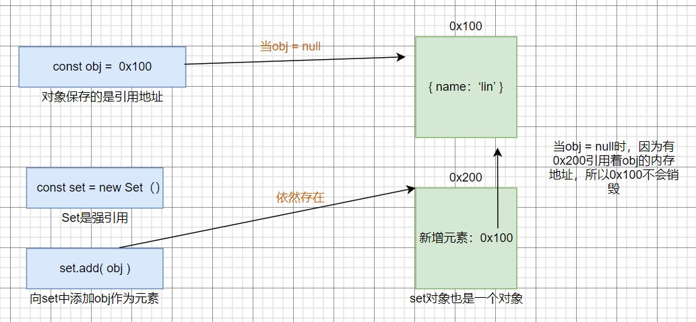
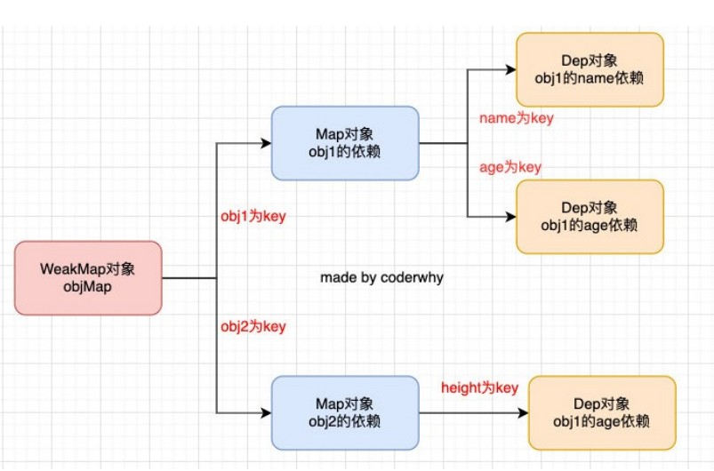

​	

## 一、class类

### 1.1 class基础

**1、定义类**

类本质上就是构造函数的一种语法糖

```js
//普通写法
class People { }

//字面量写法
const People = class { }
```

**2、分析类**

类也有隐式原型，显示原型

```js
//隐式原型
console.log(People.__proto__) //输出： {}

//显示原型
console.log(People.prototype) //输出： {}

console.log(People.prototype.constructor) //输出：[class People]
```

如果检测一个class属于哪个数据类型，最终也会返回function

```js
console.log(typeof People); //输出：function
```


**3、类的构造函数**

每个类都有一个构造函数`constructor`，当使用new操作符时，就会调用这个构造函数

（注：不论有没有写这个constructor，创建实例时都会默认执行一次）

```js
class People {
    constructor(name, age) {
        this.name = name
        this.age = age
    }
}
```

new操作，创建实例

```js
const p1 = new People("linming", 22)
//具体过程：
//1.创建一个{}
//2.{}.__proto__ = People.prototype
//3.this = {}
//4.执行函数体
//5.如果构造函数没有返回非空对象，则返回创建出来的新对象
```


**4、类定义方法**

我们往类中添加属性，可以向constructor传参，那么添加方法呢？

```js
//定义方法就直接在类中定义
class People {
    constructor(name) {
        this.name = name
    }
    eating() {
        console.log(this.name, "正在吃饭")
    }
}
```

事实上，这样子添加的方法最终会被放在People的显示原型上

```js
console.log(Object.getOwnPropertyDescriptors(People.prototype))
//输出：constructor、eating

const p1 = new People("xiaoming")
const p2 = new People("xiaohong")

p1.eating()
p2.eating()
```

注：`Object.getOwnPropertyDescriptors()`方法用来获取一个对象的所有自身属性的描述符


**5、类的访问器方法**？

在类中也可以创建访问器方法（get、set），对获取属性、修改属性做一层拦截

```js
class People {
    constructor() {
        console.log("l")
        this._address = "广州市"
    }
    get address() {
        console.log("拦截访问操作")
        return this._address
    }
    set address(newValue) {
        console.log("拦截设置操作")
		this._address = newValue
    }
}
```


**6、类的静态方法**

类的静态方法也称为**类方法**

普通的方法，是通过实例直接访问，如`p1.eating()`

类的静态方法，**通过类名**直接访问，如`People.createPerson()`，没有必要创建实例

```js
class People {
    static createPerson() {}
}
//访问：People.createPerson()
```

```js
//案例：随机姓名，随机年龄
class People {
    constructor(name, age) {
        this.name = name
        this.age = age
        this._address = "广州市"
    }
    // 类的静态方法
    static randomPerson() {
        const names = ['吴彦祖','张家辉','彭于晏','胡歌','黎明','刘德华']
        var nameIndex = Math.floor(Math.random() * names.length)
        var name = names[nameIndex]
        var age = Math.floor(Math.random() * 100)
        return new People(name, age)
    }
}
//调用
for(let i = 0; i < 50; i++) {
    console.log(People.randomPerson());
}
```

静态方法与普通方法的另外一个区别：静态方法存放在类上（所以可以直接调用），普通方法存放在类的显示原型上


### 1.2 class的继承

**7、类的继承**

ES6中新增了extends关键字，可以方便我们实现继承

在js中类只能有一个父类：单继承

```js
class Person {
    constructor() {}
}

//继承
class Student extends Person() {}
```

js引擎在解析子类的时候有要求，如果我们有实现继承，那么子类的构造方法中，在使用this之前，必须调用**super**

1、调用父类的属性

```js
//Person(父类)
class Person {
    constructor(name, age) {
        this.name = name
        this.age = age
    }
}

//Student（子类）
class Student extends Person {
    constructor(name, age ,sno) {
        super(name, age)
        this.sno = sno
    }
}

//创建实例
var stu = new Student("ming", 19, 2323123)
console.log(stu) //输出：Student { name: 'ming', age: 19, sno: 2323123 }
```

2、调用父类的方法

如果想要在父类方法的基础上进行重写，没有必要整个重写，而是可以从父类继承一些代码逻辑下来，

```js
class Person {
    //父类的方法
    personMethod() {
        console.log("逻辑1");
        console.log("逻辑2");
        console.log("逻辑3");
    }
}

class Student extends Person {
    //重写
    personMethod() {
        super.personMethod() //复用原来的逻辑
        console.log("逻辑4");
        console.log("逻辑5");
    }
}

var stu = new Student()
stu.personMethod() //输出：逻辑1、逻辑2、逻辑3、逻辑4、逻辑5
```


### 1.3 ES5代码转化

前面提到，class本质上是构造函数的语法糖。最终会被babel转化为浏览器能够认识的低版本代码（一般是ES5代码）

转换方式：`https://babeljs.io/`

1、基本的转换

```js
//转换前
class Person {}

//转换后
"use strict";

function _classCallCheck(instance, Constructor) {
  if (!(instance instanceof Constructor)) {
    throw new TypeError("Cannot call a class as a function");
  }
}

var Person = function Person() {
  _classCallCheck(this, Person);
};
```

上边的ES5代码，为了防止用户这样子使用类`People()`——将类作为函数直接调用

这种情况下，会调用`_classCallCheck(this, Person)`，此时this为window/undefined，那么会直接抛出错误


假设去掉这一层判断，class转换后的代码跟一个正常的构造函数没有区别

```js
function Person() {
    
}
```


2、对属性方法的转换

```js
//转换前
class Person {
    constructor(name, age) {
        this.name = name
        this.age = age
    }
    eating() {
        console.log(this.name, "正在吃饭");
    }
}

//转换后
"use strict";

function _classCallCheck(instance, Constructor) {
  if (!(instance instanceof Constructor)) {
    throw new TypeError("Cannot call a class as a function");
  }
}

function _defineProperties(target, props) {
  for (var i = 0; i < props.length; i++) {
    var descriptor = props[i];
    descriptor.enumerable = descriptor.enumerable || false;
    descriptor.configurable = true;
    if ("value" in descriptor) descriptor.writable = true;
      //最终定义了该方法
    Object.defineProperty(target, descriptor.key, descriptor);
  }
}

function _createClass(Constructor, protoProps, staticProps) {
    //普通的方法，定义在原型上
  if (protoProps) _defineProperties(Constructor.prototype, protoProps);
    //静态的方法，定义在类上
  if (staticProps) _defineProperties(Constructor, staticProps);
  return Constructor;
}

var Person = /*#__PURE__*/ (function () {
  function Person(name, age) {
    _classCallCheck(this, Person);
	//属性直接添加即可
    this.name = name;
    this.age = age;
  }
	//调用_createClass，添加方法
  (Person, [ 
    {
      key: "eating",
      value: function eating() {
        console.log(this.name, "正在吃饭");
      }
    }
  ]);

  return Person;
})();

```

以前我们需要在`Person.prototype`上添加eating方法，这里同样是这样做，只不过换了写法

调用`_createClass`,判断是普通方法，调用`_defineProperties(person原型，需要添加的方法)`，并使用`Object.defineProperty`定义了这个方法


3、继承的转换

由于babel转换后，代码量过多，这里不直接展示

结论：class继承的实现，转换为ES5，实际上利用了寄生组合式继承的方法


## 二、ES6小语法

### 2.1 字面量增强写法

1、property shorthand（属性的简写）

```js
var name = "linmming"
var age = 22
var obj = {
    name, //简写
    age   //简写
}
```

2、method shorthand(方法的简写)

```js
var obj = {
    foo: function() {
        console.log(this)
    }
    //简写
    foo() {
        console.log(this)
    }
}
```

3、computed property name（计算属性名）

```js
var name = "ming"
var obj = {
    [name + 321]: 'hello world'
}
console.log(obj) //输出：{ ming321: 'hello' }
```


### 2.2 let和const

之前学习var声明时，我们知道var一个变量，会在GO中进行保存，值一开始为undefined

但是这是ECMA规范早期版本的说法，最新的说法是保存在VE变量环境中（VariableEnvironment）

每一个执行上下文都会关联到一个变量环境，当我们用`let const var`声明一个变量或者函数，它们会被作为环境记录添加到环境变量中。对于函数来说，参数也会被作为环境记录添加到变量环境中


**块级作用域**

在ES5中只有两种作用域

1、全局作用域

```js
var name = 'linming'
//name声明在全局作用域中
```

2、函数作用域

```js
function foo() {
    //函数作用域
}
```

在ES6中，存在块级作用域。但是这个块级作用域对`let / const / function / class`声明的类型是有效的，对`var`声明的类型无效

```js
{	
    var baz= "linming"
    let foo = "ming"
    const bar = "lin"
    function demo() {} 
    class People {}
}
console.log(baz);  //能访问，说明块级作用域无效
console.log(foo);  //访问不了，报错
console.log(bar);	//访问不了，报错
console.log(demo);	//函数可以访问
console.log(People); //访问不了，报错
```

其中，函数是比较特殊的。（不同的浏览器有不同的实现，大部分浏览器为了兼容以前的代码，默认让function没有块级作用域）

另外，var声明的大括号不是块级作用域

```js
var obj = {
    //不存在块级作用域
}
```


if语句、switch语句、for循环语句也有块级作用域

```js
if(true) {
    let lastName = 'ming'
    var age = 22
    }
 console.log(lastName) //报错
 console.log(age) //22
```

```js
var color = "red"
switch (color) {
    case "red":
    var foo = "foo"
    let bar = "bar"
}
console.log(foo) //foo
console.log(bar) //报错
```

```js
<body>
    <button>按钮</button>
    <button>按钮</button>
    <button>按钮</button>
    <button>按钮</button>
</body>

let btn = document.getElementsByTagName('button')
for (var i = 0; i < btn.length; i++) {
    btn[i].onclick = function() {
        console.log(`第${i}个按钮的点击`);
    }
}
```

这种用var的for循环，当点击按钮后，会去访问全局的i，而此时全局的i已固定为4，所以不论点击哪个按钮，都显示`第4个按钮的点击`，用let可以很好的解决这个问题


特别注意，在普通的for循环中不能使用const，但在`for...of`循环中可以

```js
for (const i = 0; i < 10; i++) {...} //报错

for(const i of arr) {...} //b
```


### 2.3 标签模板字符串

模板字符串有一种比较少见的用法：标签模板字符串

```js
function foo() {
    console.log("---")
}
//普通函数的调用
foo()
//通过模板字符串调用
foo``
```


如果有字符串的参数，第一个参数是模板字符串中的的全部字符串（放在数组中）

```js
function foo(m, n) {
    console.log(m, n, "--");
}

    foo`hello world`
    //输出：
    //[ 'hello world' ] undefined --
```

如果传入参数时，插入了其他变量

```js
function foo(m, n, x) {
    console.log(m, n, x, '------')
}

const name = "linming"
const age = 18
foo`hello${name}world${18}`
```

第一个参数依然是模板字符串中整个字符串，只是被切成了多块，放到了一个数组中

第二、三个参数，依次是模板字符串中的变量


### 2.4 参数的默认值

ES5以及之前给参数默认值的写法

```js
function foo(m, n) {
    m = m || "aaa"
    n = n || "bbb"
    console.log(m, n)
}
```

缺点：

1、写起来比较麻烦，并且代码的阅读性是比较差的

2、存在bug

```js
//当我们传入参数0或者“”
foo(0,"")
//输出：aaa、bbb（本应该是0或者“”才对）
```


### 2.5 展开语法的浅拷贝

```js
var info = {
    name: 'linming',
    friend: { name: 'lihua' }
}

const obj = {...info} //浅拷贝

```

改变obj的friend，info中的friend也会被改变

```js
obj.friend.name = 'Tom'
console.log(info.friend) 
//{ name: 'Tom' }
```

### 2.6 Symbol

**1、概念**

Symbol（符号）是ES6中新增的一个基本数据类型

**2、为什么需要这个类型？**

在ES6之前，对象的属性名都是字符串形式，很容易造成属性名冲突

比如原来有一个对象，我们希望在其中添加一个新的属性和值，但是我们在不确定它原来内部有什么内容的情况下，很容易造成冲突，从而覆盖掉它内部的某个属性

```js
//ES6之前，对象的属性名不能重复
const obj = {
    name: 'linming'
}

obj["name"] = "小明"  //原先的会被覆盖
console.log(obj);
//输出：{ name: '小明' }
```

Symbol的作用：Symbol可以解决属性命名冲突的问题，可以生成一个独一无二的值

**3、Symbol的基本使用**

Symbol值是通过Symbol函数来生成的，生成后可以作为属性名（在ES6中，属性名可以使用字符串，也可以使用Symbol值）

```js
//Symbol函数执行后每次创建出来的值都是独一无二的
const s1 = Symbol()
const s2 = Symbol()

console.log(s1 === s2) //false
```

在ES2019中，Symbol还有一个描述（description）

```js
const s3 = Symbol("aaa")
console.log(s3.description) //输出：aaa
```

**4、Symbol值作为key**

方式一

```js
//在定义对象字面量时使用
const s1 = Symbol()
const s3 = Symbol()
const obj = {
    [s1]: "hello",
    [s2]: "world"
}
```

方式二

```js
//新增属性
const s3 = Symbol()
obj[s3] = "linming"
```

方式三

```js
const s4 = Symbol()
Object.defineProperty(obj, s4, {
    enumerable: true,
    configurable: true,
    writable: true,
    value: 'lihua'
})
```

**5、获取值**

一般获取方式：

```js
console.log(obj[s1], obj[s2], obj[s3], obj[s4])
```

不能通过`.`语法获取

```js
console.log(obj.s1)  //undefined
```

不能通过一般的方式来获取key

```js
console.log(Object.keys(obj))  //[]
console.log(Object.getOwnPropertyNames(obj)) //[]
```

需要通过`Object.getOwnPropertySymbols`来获取所有Symbol的key

```js
console.log(Object.getOwnPropertySymbols(obj))

//遍历
const sKeys = Object.getOwnPropertySymbols(obj)
for(const sKey of sKeys) {
    console.log(obj[sKey])
}
```


## 三、Set和Map

ES6之前，存储数据结构的主要有两种方式：数组、对象

ES6新增了另外的两种数据结构：Set、Map，以及它们的另外形式WeakSet、WeakMap


### 3.1 Set的基本使用

Set（集合），可以用来保存数据，类似于数组，但是和数组的区别是元素不能重复


1、创建Set

```js
//暂时没有字面量的创建形式
const set = new Set()
```

2、添加元素

```js
set.add(10)
set.add(20)
set.add(30)
console.log(set) //输出：Set(3) { 10, 20, 30 }
```

注：可以添加任意类型的数据，但是不能添加重复数据

```js
set.add(10) //重复
console.log(set) //输出：Set(3) { 10, 20, 30 } 重复的10会被移除
```

注：可添加多个空对象，因为空对象的引用指向是不同的

```js
set.add({})
set.add({})
console.log(set) //输出：Set(5) { 10, 20, 30, {}, {} }
```

3、对数组进行去重

```js
const arr = [10,20,30,10,20]
const newArr = Array.from(new Set(arr)) //方式一
const newArr2 = [...new Set(arr)] //方式二
 
console.log(newArr2);  //输出：[ 10, 20, 30 ]
```


4、size属性

```js
//获取长度
const arr = [19, 20, 21]
const set = new Set(arr)
console.log(set.size); //3
```

5、delete方法

```js
//删除元素
set.delete(21)
```

6、has方法

```js
console.log(set.has(20))
//true
```

7、clear方法

```js
console.log(set.clear())
//清空
```


### 3.2 weakSet

和Set相似的另外一个数据结构称之为WeakSet，也就是内部元素不能重复的数据结构


**1、创建weakSet**

```js
const weakSet = new WeakSet()
```


**2、只能存放对象类型**

```js
weakSet.add(10) //报错

weakSet.add([10]) //ok
```


**3、对对象是一个弱引用**

Set中对象的引用都是强引用并不会允许垃圾回收；它能存储任意类型的数据；

WeakSet中的对象的引用是弱引用，也就是说，即使WeakSet引用了某个对象，但垃圾回收不把这种引用计为“引用”，只要其他地方没有强引用引用这个对象，该对象就不可达，任何时候都可能被回收；


**强引用与弱引用**

强引用（string reference）：当垃圾回收（GC）认为该引用有效，不会对该对象进行回收

弱应用（weak reference）：垃圾回收器认为该引用无效，将其进行回收



上图的情况为weakSet时，当obj为null时，GC不认为0x200对0x100的连接有效，所以垃圾回收会将其回收


**4、weakSet的应用**

因为weakSet只是对对象的弱引用，如果我们遍历获取到其中的元素，那么有可能造成对象不能正常的销毁。

所以存储到weakSet中的对象是没办法获取的

（weakSet应用比较少，一般在构建大型框架的时候可能会使用）


### 3.3 Map的基本使用

Map是ES6新增的数据结构，用于存储映射关系

基本作用：事实上我们对象存储映射关系只能用字符串（ES6新增了Symbol）作为属性名（key）

某些情况下我们可能希望通过其他类型作为key，比如对象，这个时候会自动将对象成字符串来作为key


**1、允许使用对象类型作为key**

```js
const obj = {
	name: 'lin'
}
const map = new Map()
map.set(obj, "ming") //key为obj
map.set(1, "hi") // key为基本数据类型

console.log(map)
//输出：Map(2) { { name: 'lin' } => 'ming', 1 => 'hi' }
```

或者也可以这样子创建

```js
const map = new Map([[obj, "ming"], [1, "hi"]])
console.log(map)
//输出：Map(2) { { name: 'lin' } => 'ming', 1 => 'hi' }
```


**2、创建的属性和方法**

``` js
//size属性
console.log(map.size)

//新增属性set
map.set("ming", "aaa")

//获取属性get（key）
console.log(map.get("ming"))

//has（key）
console.log(map.has("ming")) //true

//delelte(key)
map.delete("ming")  // true

//clear() 清空
map.clear()
```


**3、遍历**

```js
map.forEach((item, key) => {
    console.log(item, key)
})

for(const [key, value] of map2) {
    console.log(key, value)
}
```


### 3.4 weakMap

和Map类型相似的另外一个数据结构称之为weakMap，也是以键值对的形式存在

**1、和Map的区别**

区别一：weakMap只能使用对象，不接受其他的类型作为key

```js
const weakmap = new WeakMap()
weakmap.set(obj, "aaa")  //ok
weakmap.set(1, "bbb") //报错
```


区别二：weakmap的key对象的引用是弱引用，如果没有其他对象引用这个对象，那么GC可以回收该对象

```js
const obj = {
    name: 'lin'
}
const weakmap = new WeakMap()
weakmap.set(obj, "aaa")
```

当obj被设置为null时，虽然weakmap的元素中有一个obj指向了obj的内存地址，但是GC不认为该指向有效，依旧将obj回收


**2、weakMap常见的方法**

1、set（key，value）：在Map中添加key、value，并且返回整个Map对象

2、get（key）：根据key获取Map中的value

3、has（key）：判断是否包括某一个key，返回布尔值

4、delete（key）：根据key删除一个键值对，返回布尔值


**3、weakMap的应用场景**

vue的响应式原理

### 3.5 响应式原理中weakMap的使用

**1、什么是响应式**

以vue2的响应式为例(vue3的响应式数据需要reactive函数包裹的)

```js
const data = {
    name: 'linmng',
    age: 22
}
```

```html
<template>
    <div>
	<div>{{name}}</div>
    <div>{{age}}</div>
    </div>
</template>
```

当data中的name或者age属性发生变化时，template中的对这两个属性有依赖的地方要进行相应的变化

事实上，template会被编译成render()函数，数据变化时，重新调用render函数即可


所以，类似于如下的场景

obj1中name变化，会引发两个函数的变化

obj1age变化，同样会引发两个函数的变化

```js
//组件1中
const obj1 = {
    name: 'linmng',
    age: 22
}
function obj1NameChange1 () {
    console.log("obj1中的name发生了变化，后续操作1")
}
function obj1NameChange2 () {
    console.log("obj1中的name发生了变化，后续操作2")
}

function obj1AgeChange1 () {
    console.log("obj1中的age发生了变化，后续操作1")
}
function obj1AgeChange1 () {
    console.log("obj1中的age发生了变化，后续操作2")
}

//另一个组件2中
const obj2 = {
    name: "小明",
    age: 18
}
function obj2NameChange2 () {
    console.log("obj2中的name发生了变化，后续操作1")
}
function obj2AgeChange2 () {
    console.log("obj2中的age发生了变化，后续操作2")
}
```

当obj中数据发生了变化，执行对应的函数

**2、将data中的值与对应函数关联起来**

```js
//1.创建weakMap
const weakMap = new WeakMap() 


//2.创建map结构
//key为name的值为两个关联的函数
//key为age的值也是两个关联着的函数
const map = new map()
map.set(name, [obj1NameChange1, obj1NameChange2]) 
map.set(age, [obj1AgeChange1, obj1AgeChange2])

//向weakMap中添加元素
weakMap.set(obj1, map)
```

当修改了obj1中的name值时

```js
weakMap.get(obj1)  //找到了map

//修改的是map的name属性
map.get(name) //找到了[obj1NameChange1, obj1NameChange2]两个函数

//最后通过forEach函数一次将他们执行,做到了对应数据变化，其关联着的函数发生了变化
forEach(item => item())
```


**3、具体的代码逻辑**

```js
const obj1 = {
	name: "小林",
	age: 22
}
function linNameChange1() {
	console.log("小林改了名，后续发生的故事1...");
}
function linNameChange2() {
	console.log("小林改了名，后续发生的故事2...");
}
function linAgechange() {
	console.log("小林的年龄增长了，这一年发生的故事...");
}
const obj2 = {
	name: "小明",
	age: 20
}
function mingNameChange() {
	console.log("小明改了名，后续操作...");
}
function mingAgeChange() {
	console.log("小明年龄增长了，后续操作...");
}

//1.创建weakMap
const weakMap = new WeakMap()

//2.收集依赖
//2.1 对小林收集的数据结构
const linMap = new Map()
linMap.set("name", [linNameChange1, linNameChange2])
linMap.set("age", [linAgechange])
//2.2对小明收集的数据结构
const mingMap = new Map()
mingMap.set("name", [mingNameChange])
mingMap.set("age", [mingAgeChange])

weakMap.set(obj1, linMap)
weakMap.set(obj2, mingMap)

//3.如果小林.name发生了变化
obj1.name = "linming"
const targetMap = weakMap.get(obj1)
const fns = targetMap.get("name")
fns.forEach(item => item())
//结果输出：
/小林改了名，后续发生的故事1...
小林改了名，后续发生的故事2...
```


## 四、ES7小语法

### 4.1 includes

在ES7之前，如果我们想要判断一个数组中是否包含某一个元素，需要通过`indexOf`获取结果，并且判断是否为-1

ES7中新增了`includes`来判断一个数组中是否包含一个指定的元素，返回布尔值

```js
const arr = [10, 20, "hello", 30]

//旧方式
console.log(arr.indexOf(20)) //返回索引值，找不到返回-1

console.log(arr.includes(10)) //true
```

注：**includes**的第二个参数可以指定从什么位置开始查找


### 4.2 指数运算符

```js
//ES7之前
const result1 = Math.pow(3,3) //计算3的3次方
//输出： 27
```

ES7新增了 `**`运算符，适用于指数运算

```js
//ES7
const result2 = 3 ** 3
console.log(result2) //输出 27
```


## 五、ES8小语法

### 5.1 Object的遍历

**Object.values**

我们可以通过Obejct获取一个对象所有的key，在ES8中提供了Object.values来获取所有的value值

```js
const obj = {
    name: '林明',
    age: 22
}
console.log(Object.keys(obj)) //输出：[ 'name', 'age' ]
console.log(Object.values(obj)); //输出：[ '林明', 22 ]
```

一般用来遍历对象，但是也是可以传入数组或者字符串

```js
console.log(Object.values(["abc", "cba", "nba"]))
console.log(Object.values("abc")) //输出： ["a", "b", "c"]
```


**Object.entries**

获取键值对（结果放入数组中）

```js
const obj = {
    name: "linming",
    age: 22
}
console.log(Object.entries(obj))
//输出：[ [ 'name', 'linming' ], [ 'age', 22 ] ]
```


### 5.2 填充pad

`padStart`:从开头位置开始填充

`padEnd`:从末尾位置开始填充

```js
const msg = "hello"
console.log(msg.padStart(5, "*")) //输出；*****hello
console.log(msg.padEnd(5, "-"))  //输出：hello-----
```


## 六、ES10小语法

### 6.1 flat()

flat（）方法会按照一个可指定的深度递归遍历数组，并将所有元素与遍历到的子数组中的元素合并为一个新数组返回

```js
const arr = [10, 20, [2, 4], [[30, 40], [20, 12]], 44, [55]]
//上方的数组中存在着二维数组和三维数组
```

flat方法可以将其转变成一个一维的数组

```js
const newArr = arr.flat()
console.log(newArr)
//输出：[ 10, 20, 2, 4, [ 30, 40 ], [ 20, 12 ], 44, 55 ] 是一个二维数组

//可以再调用一次flat，或者直接在原数组调用flat时，传入一个要遍历的深度
const newArr = arr.flat(2)
console.log(newArr)
//输出：[ 10, 20,  2,  4, 30, 40, 20, 12, 44, 55 ]
```


手动实现该flat函数的方法：遍历数组中的每一个元素，如果元素还是一个数组，递归调用


### 6.2 flatMap

flatMap方法首先使用映射函数映射每个元素，然后将结果压缩成一个新数组（该方法十分接近于数组的map方法）

1、flatMap是先进行map操作，再做flat的操作

2、flatMap中的flat相当于深度为1

```js
const message = ["hello world", "hi linming", "good morning"]

//使用flatMap
    const newArr = message.flatMap(item => {
        return item.split(" ")
    })
    console.log(newArr)
//输出：[ 'hello', 'world', 'hi', 'linming', 'good', 'morning' ]


//如果采用map
    const newArr = message.map(item => {
        return item.split(" ")
    })
    console.log(newArr)
//输出：[ [ 'hello', 'world' ], [ 'hi', 'linming' ], [ 'good', 'morning' ] ]
//map不会自动将其进行降维
```


### 6.3 数组扁平化

数组扁平化其实就是将多维数组转换为一维数组

简单理解为flat函数的实现

flat函数的特点：

不传参数时，默认“拉平”一层；传入一个整数参数，整数即为拉平的层数；参数为Infinity，通通转为一维数组;参数为小于等于0的整数，不拉平；如果数组有空位，跳过空位

**1、简单实现**

```js
//利用简单递归实现功能
function myFlat(arr) {
  let result = []
  arr.forEach((value, index, arr) => {
    if(!Array.isArray(arr[index])) {//该元素不是数组
      result.push(value)
    } else {//该元素是数组
      result = result.concat(myFlat(arr[index])) //递归调用
    }
  })
  return result
}
```


**2、考虑多种情况**

后续补充....


### 6.4 trimStart、trimEnd

ES5的时候，我们使用trim方法来去除首尾空格

```js
const str ="   hello wolrd     "
console.log(str.trim())
//输出：hello wolrd
```

使用trimStart、trimEnd可以更加精准的控制

```js
const str = "    hello"
console.log(str.trimStart()) //输出：hello


const str2 = "    hello     "
console.log(str.trimEnd) //输出：     hello
```


## 七、ES11小语法

### 7.1 bigInt

由于js数字精度问题，在js中所能表示的最大安全整数为：

```js
const maxInt = Number.MAX_SAFE_INTEGER
console.log(maxInt)
//输出：9007199254740991
```


如果想要获取更大的数，就要使用bigInt了

```js
//最大安全整数的100倍
const bigInt = 900719925474099100n //n是必要的

//增加100
const num = 100
console.log(bigInt + BigInt(num))
```


### 7.2 空值合并运算??

在以前我们经常使用 || 来表示或运算

```js
let num = 100
console.log(num || "default value") //输出：100

num = null
console.log(num || "default value") //输出：default value

num = undefined
console.log(num || "default value") //输出：default value
```

但是，逻辑或是有弊端的

如果，num就是一个空字符串，或者就是一个0呢

```js
num = 0
console.log(num || "default value") //期望输出：0

num = ""
console.log(num || "default value") //期望输出：""
```

结果都输出：default value


所以ES11增加了空值运算符来解决这个问题

```js
num = 0
console.log(num ?? "default value") //输出：0

num = ""
console.log(num ?? "default value") //输出：""
```


### 7.3 可选链

```js
const obj = {
    name: 'lihua',
    friend: {
        name: 'lin',
        girlfriend: {
            name: 'ting'
        }
    }
}

//访问lihua的朋友的女朋友的姓名
console.log(obj.friend?.girlfriend?.name)
```


这样写会使得代码更加严谨，不会因为其中的某个值为undefined时，而报错，从而造成后续代码不能执行


## 八、Proxy与Reflect

### 8.1 Proxy优势

**Object.defineProperty的缺点**

1、无法监听数组的变化

2、只能劫持对象的属性，因此我们需要对每个对象的每个属性进行遍历，如果属性值也是对象那么需要深度遍历，显然能劫持一个完整的对象是更好的选择。

如果是新增属性，没办法进行响应式设置，（vue中可以通过$set方法）


**Proxy的优点**

1、Proxy可以直接监听数组的变化

2、proxy可以监听对象而非属性，它在目标对象之前架设一层“拦截”，外界对该对象的访问，都必须通过这层拦截，因此提供了一种机制，可以对外界的访问进行过滤和改写。Proxy直接可以劫持整个对象，并返回一个新对象


### 8.2 Proxy基本使用

proxy可以理解成在目标对象前架设一个“拦截”层，外界对该对象的访问都必须先通过这层拦截，因此提供了一种机制可以对外界的访问进行过滤和改写

**1、创建proxy实例**

`var proxy = new Proxy(target, handler)`

其中，target参数表示所要拦截的目标对象，handler参数也是一个对象，用来定制拦截操作

如果handler没有设置任何拦截，那就等同于直接通向原对象

**2、proxy实例的方法——get（）**

get方法用于拦截某个属性的读取操作

```js
        let person = {
            name: "张三"
        }
        var proxy = new Proxy (person, {
            get: function(target, key) {
                if(property in target) {
                    return target[key]
                } else {
                    throw new ReferenceError("出错啦")
                }
            }
        })
        // console.log(proxy.name)
        // console.log(proxy.age) //报错
```

如果没有这个拦截器，访问不存在的属性只会返回undefined


**3、set（）方法**

set（）方法用于拦截某个属性的赋值操作

```js
//假定obj对象有一个age属性，要求该属性是一个不大于150的整数，可以使用proxy对象保证age的属性符合要求

        handler = {
            set: function(obj, key, value) {
                if (key ==='age') { //如果属性名为age
                    if (!Number.isInteger(value)) { //如果值不为整数
                        throw new TypeError('the age is not a integer')
                    }
                    if (value > 150) { // 如果值大于150
                        throw new RangeError('the age seems invalid')
                    }
                }
                obj[key] = value
            }
        }
        const proxy = new Proxy({}, handler)
        console.log(proxy.age = 100); //100
        console.log(proxy.age = 151); //报错 the age seems invalid
```


**4、has方法**

has方法用来拦截HasProperty操作，即判断对象是否具有某个属性，这个方法会生效

```js
let handler = {
    has (target, key) {
        if (key[0] === '_') {
            return false
        }
        return key in target
    }
}

let target = {
    _prop : 'foo', //不允许被in运算符发现
    prop : 'foo'
}

let proxy = new Proxy(target, handler)
console.log('prop' in proxy);
console.log('_prop' in proxy);
```

**5、deleteProperty方法**

该方法用于拦截delete操作，如果这个方法排抛出错误或者返回false，当前属性就无法被delete命令删除

```js
let handler = {
    deleteProperty (target, key) {
        invariant (key, 'delete')
        return true
    }
}

let target = {
    _prop : 'foo'
}
let proxy = new Proxy(target, handler)
console.log(delete proxy._prop);
```


注：proxy一共有13中捕获器，不过最长用的就是以上四种


### 8.3Reflect的作用

Reflect是ES6新增的一个API，它是一个**对象**，字面的意思是**反射**

它主要提供了很多操作JavaScript对象的方法，在某种程度上跟Object构造函数相同


既然有了Object，为什么要有Reflect呢？

Obejct作为一个构造函数，有一些操作放在它身上并不合适。所以ES6增加了Reflect对象，让一些操作都集中到了这个对象上


```js
const obj = {
    name: 'linming'
}

//创建Proxy
const objProxy = new Proxy(obj, {
    get(target, key, receiver) {
        return target[key]
    },
    set(target, key, newValue, receiver) {
        target[key] = newValue
    }
})
```

我们利用Proxy本意就是不想直接操作原对象，上方的写法直接就是操作对象了

```js
//利用Reflect重写Proxy
const objProxy = new Proxy(obj, {
    get(target, key, receiver) {
        console.log('get操作')
        return Reflect.get(target, key)
    },
    set(target, key, newValue, receiver) {
        console.log('set操作')
        Reflect.set(target, key, newValue)
    }
})

objProxy.name = 'lin' // set操作
console.log(obj.name); //lin
```

另外，Reflect有返回值

```js
const Boolean = Reflect.get(target, key) //Boolean反映了获取值成功与否

const Boolean = Reflect.set(target, key, newValue) //Boolean反映了设置值成功与否
```


目前Reflect最多的应用场景就是跟Proxy配合使用


### 8.4 Reflect的常见方法

Reflect中的常见方法与Proxy是一一对应的，也是13个

| 方法                                                    | 说明                                                         |
| ------------------------------------------------------- | ------------------------------------------------------------ |
| Reflect.getPrototypeOf(target)                          | 类似于 Object.getPrototypeOf()                               |
| Reflect.setPrototypeOf(target, prototype)               | 设置对象原型的函数. 返回一个 Boolean                         |
| Reflect.isExtensible(target)                            | 类似于 Object.isExtensible()                                 |
| Reflect.preventExtensions(target)                       | 类似于 Object.preventExtensions()                            |
| Reflect.getOwnPropertyDescriptor(target, propertyKey)   | 类似于 Object.getOwnPropertyDescriptor()                     |
| Reflect.defineProperty(target, propertyKey, attributes) | 和 Object.defineProperty() 类似，如果设置成功就会返回 true   |
| Reflect.ownKeys(target)                                 | 返回一个包含所有自身属性（不包含继承属性）的数组             |
| Reflect.has(target, propertyKey)                        | 判断一个对象是否存在某个属性，和 in 运算符 的功能完全相同    |
| Reflect.get(target, propertyKey[, receiver])            | 获取对象身上某个属性的值                                     |
| Reflect.set(target, propertyKey, value[, receiver])     | 将值分配给属性的函数。返回一个Boolean，如果更新成功，则返回true |
| Reflect.deleteProperty(target, propertyKey)             | 作为函数的delete操作符，相当于执行 delete target[name]       |
| Reflect.apply(target, thisArgument, argumentsList)      | 对一个函数进行调用操作，同时可以传入一个数组作为调用参数。和Function.prototype.apply() 功能类似 |
| Reflect.construct(target, argumentsList[, newTarget])   | 对构造函数进行 new 操作，相当于执行 new target(...args)      |


### 8.5 响应式原理

**1、什么是响应式？**

```js
let num = 100

//一段代码
console.log(num)
console.log(num * 2)
console.log(num ** 2)
console.log("hello world")
```

当num变化时，这么一段代码可以**自动执行**一次。那么就可以说，这段代码是可以自动响应num的变化的


在开发中，最常见的是对象的响应式

```js
const obj = {
    name: 'ming',
    age: 22
}

console.log(name) //100行代码

console.log(age) //200行代码
```

当对象中的name发生变化时，`console.log(name)`等100行代码自动执行一次

当对象中的age发生变化时，`console.log(age)`等200行代码自动执行一次


**2、封装一个响应式函数**

如果一段代码、一些函数对某一个数值有依赖时，将其添加进一个数组(`reactiveFns`)中

```js
let reactiveFns = []

function watchFn(fn) {
    reactiveFns.push(fn)
}
```

假如有obj对象，有两个函数foo、bar对obj中的属性有依赖

```js
const obj = {
    name: 'lin'
}

//收集依赖
watchFn(function foo() {
    console.log("name值变化了：", obj.name)
    console.log("hello~") //100行代码
})

watchFn(function bar() {
    console.log("name值变化了：", obj.name) //10行代码
})
```

这样依赖，数组`reactiveFns`中就有foo和bar两个函数了


当obj的name发生变化时，只要遍历出数组中的函数，并进行调用即可

```js
obj.name = "linming"
reactiveFns.forEach((item) => {
    item()
})
```


**小总结**

上面的代码中，实现了：

1、将对name有依赖的函数收集到了一个数组中

2、当name值变化时，遍历出数组中的函数并执行


但是，仍然不是我们想要的响应式。需要进行一些改进：

1、开发中，有很多的数据(data)，以及对各个数据(data)有依赖的函数代码。不能将所有的代码都装进一个`reactiveFns`数组中。而是需要一种数据结构，来存储不同数据的依赖

2、实现依赖的自动收集，而不是手动收集

3、数据(data)变化时，自动执行依赖，而不是手动执行


**4、创建depend类管理依赖**

为了解决所有的依赖都装进一个数组中的弊端，做到一个数据有其独有的数组，我们可以创建一个depend类

```js
class depend {
    //订阅者
    constructor() {
        this.reactiveFns = [] //其实使用set来装依赖会更好
    }
    
    //添加依赖
    addDepend(fn) {
        this.reactiveFns.push(fn)
    }
    
    //通知执行
    notify() {
        this.reactiveFns.forEach(item => {
            item()
        })
    }
}
```

```js
const depend = new Depend()
//重写watchFn函数
function watchFn(fn) {
	depend.addDepend(fn)
}

//利用watchFn找到数据name的依赖函数foo、bar
watchFn(foo)
watchFn(bar) //两者都被添加进了reactiveFn数组中

//当name发生变化时，通知reactiveFns执行
depend.notify()
```


**5、自动监听对象变化，执行依赖**

这一步要解决的就是每次手动执行`depend.notify()`的弊端


是时候用到Proxy了。利用Proxy对obj对象进行代理

```js
const objProxy = new Proxy(obj, {
    get(target, key) {
        return target[key]
    },
    set(target, key, newValue) {
        target[key] = newValue
        depend.notify()
    }
})
```

完整代码如下

```js
class Depend {
	//订阅者
	constructor() {
		this.reactiveFn = []
	}
	//添加依赖
	addDepend(fn) {
		this.reactiveFn.push(fn)
	}
	//通知执行
	notify() {
		this.reactiveFn.forEach(item => {
			item()
		})
	}
}

const depend = new Depend()

//收集依赖的函数
function watchFn(fn) {
	depend.addDepend(fn)
}
const obj = {
	name: 'linming'
}
//代理
const objProxy = new Proxy(obj, {
	get(target, key) {
		return target[key]
	},
	set(target, key, newValue) {
		target[key] = newValue
		depend.notify() //弊端，执行的是所有data的依赖
	}
})
watchFn(function foo() {
	console.log("foo,obj的name变化了:" , objProxy.name);
})
watchFn(function bar() {
	console.log("bar,obj的name变化了:" , objProxy.name);
})
//改变数值
objProxy.name = "lin"
```

上边的代码依旧没能解决多个数据依赖的保存

正常来说一个数据，应该有独立的depend来进行保存



**6、封装获取depend的函数**

​	一个数据应该对应一个depend

```js
const objProxy = new Proxy(obj, {
	get(target, key) {
		return target[key]
	},
	set(target, key, newValue) {
		target[key] = newValue
        //最好是能够根据这个obj对象，及其key：name，获取到其依赖收集的类
		const depend = getDepend(target, key)
        depend.notify()
	}
})
```

所以，我们需要封装一个获取depend类的函数

```js
const weakMap = new WeakMap()
function getDepend(target, key) {
    //取出map
    let map = weakMap.get(target)
    //如果不存在则创建map
    if(!map) {
        map = new Map()
        weakMap.set(target, map) //添加
    }
    
    //根据key获取depend对象
    let depend = map.get(key)
    if(!depend) {
        depend = new Depend()
        map.set(key, depend)
    }
    r
}
```


**7、自动收集依赖**

如何自动实现收集依赖呢？让watchFn在调用时，传入的fn参数调用一次

当fn参数被调用时，必然触发proxy的get，在get操作中进入依赖收集

```js
//收集依赖的函数
function watchFn(fn) {
    fn() //调用，触发get
}

watchFn(function foo() {
	console.log("foo,obj的name变化了:" , objProxy.name);  //自动执行了一次
})
```

get是什么样的情况呢？

```js
const objProxy = new Proxy(obj, {
	get(target, key) {
        //创建只属于target[key]的dep实例
        const dep = getDepend(target, key)
        //添加依赖
        dep("需要添加依赖的那个函数")
		return target[key]
	},
})
```

我们需要想办法获取传入到watchFn收集依赖函数中的参数，让这个参数传递给get函数中，方便添加到依赖中

```js
let activeReactiveFn = null //全局变量
function watchFn(fn) {
    activeReactiveFn = fn
    fn() //调用，触发get
    activeReactiveFn = null
}
```

解决方案：让watchFn函数给全局变量activeReactiveFn赋值为它的参数，这样子我们就拿到了这个函数

```js
const objProxy = new Proxy(obj, {
	get(target, key) {
        //创建只属于target[key]的dep实例
        const dep = getDepend(target, key)
        //添加依赖
        dep(activeReactiveFn)
		return target[key]
	},
})
```


**8、优化**

1、、可能会存在同一个函数被多次收集的现象，最好把存储依赖的结构改为Set结构

```js
class Depend {
	//订阅者
	constructor() {
		this.reactiveFn = new Set()
	}
}
```


2、假设我们现在又有一个obj2对象，想要变成响应式，难道要去重新创建一个proxy对象吗？能否将proxy对象变得更加通用写

```js
function reactive(obj) {
	return new Proxy(obj, {
	get(target, key) {
        //创建只属于target[key]的dep实例
        const dep = getDepend(target, key)
        //添加依赖
        dep(activeReactiveFn)
		return target[key]
	},
	set(target, key, newValue) {
		target[key] = newValue
		depend.notify() //弊端，执行的是所有data的依赖
	}
}
```

这样一来以后调用reactive函数，就可以将传入的obj对象变成proxy对象，并在proxy对象中实现对其的get、set操作

```js
const obj2 = {
    name: 'ming'
}
reactive(o)
```


## 九、Promise

### 9.1 基本用法

Promise是一个类，可以翻译成承诺、许诺 、期约

**1、executor**

Promise的参数是一个executor函数，会在promise被调用时，立即执行。

而executor也有两个参数，分别是reoslve函数、reject函数

```js
//这个传入的函数，称为executor
const promise = new Promise(() => {
  console.log("我会立刻被执行");
})

//executor有两个参数：reoslve、reject
const promise = new Promise((resolve, reject) => {
    resolve() // 立刻执行promise.then()
    reject() //立刻执行promise.catch()
})
```

下面这几种使用方式都是类似的

```js
const promise = new Promise((resolve, reject) => {
    //resolve(res)
    //reject(err)
})
//写法一
//第一个回调函数，会在Promise执行resolve时，被回调
//第二个回调函数，会在Promise执行reject时，被回调
promise.then( res => {
    console.log(res)
}, err => {
    console.log(err)
})

//写法二
promise.then(res => {
    console.log(res)
}).catch(err => {
    console.log(err)
})

//写法三
new Promise((resolve, reject) => {
    //resolve(res)
    //reject(err)
}).then(res => {
    console.log(res)
}).catch(err => {
    console.log(err)
}) 
```

注：resolve或reject传递参数时，如果参数也是一个promise，那么最终Promise的状态由这个参数promise决定


**2、promise的三种状态**

1、待定（pending）：初始状态，既没有被兑现，也没有被拒绝（当执行executor中的代码时，处于该状态）

2、已兑现（fulfilled）：意味着操作成功，执行了resolve时，处于该状态

3、已拒绝（rejected）：意味着操作失败，执行了reject时，处于该状态

```js
new Promise((resolve, reject) => {
    console.log('executor')
    //resolve()
    //reject()
}).then(res => {
    console.log(res)
}, err => {
    console.log(err)
})
```

注：状态一旦确定，便不可更改。但不意味着后面的其他代码不能被执行


**3、resolve的参数**

1、参数是普通的值，则直接传递

```js
new Promise((resolve, reject) => {
  resolve("参数")
}).then(res => {
  console.log(res)
})
//输出：参数
```

2、参数是一个Promise

```js
const inSidePromise = new Promise()

new Promise((resolve, reject) => {
  resolve(inSidePromise)
}).then(res => {
  console.log(res)
})
//没有输出
```

注：如果参数是一个promise，那么当前promise的状态会由传入的promise来决定

```js
const inSidePromise = new Promise((resolve, reject) => {
    resolve("我是inSidePromise")
})

new Promise((resolve, reject) => {
  resolve(inSidePromise)
}).then(res => {
  console.log(res)
})

//输出：我是inSidePromise
```


3、thenable

如果传入一个对象，并且这个对象有实现then方法，那么也会执行then方法，并且由该then方法决定后续状态

```js
new Promise((resolve, reject) => {
    const obj = {
        then: function(resolve, reject) {
            reject("reject message")
        }
    }
    resolve(obj)
}).then(res => {
    console.log('res:', res)
}, err => {
    console.log('err:', err)
})
//本来应该输出obj对象
//结果输出：err: reject message
```


### 9.2 promise的对象方法

promise的对象方法是放在Promise的原型上的，我们可以打印一下上面都有什么方法

```js
console.log(Promise.prototype)
//输出：Object [Promise] {} 

//遍历所有属性描述器
console.log(Object.getOwnPropertyDescriptors(Promise.prototype));
//输出：constructor、then、catch、finally等
```


**1、then方法**

特点1：同一个promise可以被多次调用then方法

当我们的resolve方法被回调时，所有then方法传入的回调函数都会被调用

```js
const promise = new Promise((resolve, reject) => {
    resolve("linlinlin~")
})
promise.then(res => {
    console.log('res1:', res)
})
promise.then(res => {
    console.log('res2:', res)
})
promise.then(res => {
    console.log('res3:', res)
})
//输出：
//res1: linlinlin~
//res2: linlinlin~
//res3: linlinlin~
```


特点2：then方法传入的“回调函数”，可以有返回值

如果我们返回一个普通对象，那么这个普通对象被作为一个新的promise的resolve值

```js
promise.then(res => {
    return 'abcdefg'
})

//相当于
promise.then(res => {
    return new Promise(resolve => {
        resolve('abcdefg')
    })
})
```

所以，then方法本身也有返回值，它返回了一个promise

```js
promise.then(res => {
    return 'abcdefg'
}).then(res => {
    console.log(res)
})
//输出：abcdefg
```

完整代码

```js
const promise = new Promise((resolve, reject) => {
  resolve('1111111')
})

promise.then(res1 => {
  console.log(res1);
  return '2222222'
}).then(res2 => {
  console.log(res2);
})
//输出：1111111   2222222
```

如果返回的是一个promise

```js
promise.then(res => {
  return new Promise((resolve, reject) => {
      resolve(123321)
  })
}).then(res => {
  console.log('res:', res)
})
//输出：
```

里边还是会使用一个Promise包裹return的promise，但是最终状态由里边的promise决定


当然，还有第三种，如果返回的是对象，并且对象实现了thenable

```js
promise.then(res => {
    return {
        then: function(resolve, reject) {
            resolve(222222)
        }
    }
}).then(res => {
    console.log('res:', res)
})
//输出：res:
```


**2、catch方法**

利用then的第二个参数捕获错误

```js
const promise = new Promise((resolve, reject) => {
    reject('rejected status')
})

promise.then(undefined, err => {
    console.log("err:", err)
})
```

即使不使用reject，当executor抛出异常时，也是会调用错误捕获的回调函数的

```js
const promise = new Promise((resolve, reject) => {
    throw new Error("rejected status")
})
promise.then(undefined, err => {
    console.log("err:", err) //触发
    console.log("-------")
})
```


但是利用then方法的第二个参数捕获异常，会使得代码十分臃肿。所以更推荐使用catch方法捕获异常

```js
const promise = new Promise((resolve, reject) => {
    reject('rejected status')
})

promise.catch(err => {
    console.log("err:", err)
})
```


思考：下方的链式调用中，catch捕获的是谁的异常

```js
const promise = new Promise((resolve, reject) => {
    reject('rejected status')
})

promise.then(res => {
    return new Promise((resolve, reject) => {
        reject("then rejected status")
    })
}).catch (err => {
    console.log("谁的err", err)
})
//输出：谁的err rejected status
//上面的代码中有两个promise，err默认先捕获了外层的错误
```


**2、finally方法**

表示无论Promise对象无论变成fulfilled还是reject状态，最终都会被执行的代码

```js
const promise = new Promise((resolve, reject) => {
    reject("reject")
})

promise.then(res => {
    console.log(res)
}).catch(err => {
    console.log(err)
}).finally(() => {
    console.log("finally action")
})
```


### 9.3 promise的类方法

前面学习的then、catch、finally方法都属于Promise的实例方法，都是存放在Promise的prototype上。

还有直接存放在Promise类上的方法

**1、resolve方法**

思考：如何将一个对象转换成promise对象，传给其他人调用

```js 
//一般方法
function foo() {
    let obj = {
        name: 'linming'
    }
    return new Promise(resolve => {
        resolve(obj)
    })
}
//调用
foo().then(res => {
    console.log(res)
})
```

使用Promise.resolve()方法也可以

```js
const promise = Promise.resolve({name: 'linming'})
promise.then(res => {
    console.log('res:', res)
})
```

**2、reject方法**

reject方法与resolve方法类似

```js
const promise = Promise.reject("rejected message")
//相当于
const promise2 = new Promise((resolve, reject) => {
    reject("rejected message2")
})

promise.then(res => {
    console.log("res:", res)
}).catch(err => {
    console.log("err:", err)
})
```


**3、all方法**

promise.all方法，可以将多个Promise包裹在一起形成一个新的Promise

新的promise状态由参数共同决定（所有参数状态为fulfilled，返回一个结果数组；有一个参数状态为reject，返回该reject）

```js
const p1 = new Promise((resolve, reject) => {
    resolve('1111')
})
const p2 = new Promise((resolve, reject) => {
    resolve('2222')
})

Promise.all([p1, p2]).then(res => {
    console.log(res)
})
//输出：[ '1111', '2222' ]
```

```js
const p1 = new Promise((resolve, reject) => {
    reject('error') //reject
})
const p2 = new Promise((resolve, reject) => {
    resolve('2222')
})

Promise.all([p1, p2]).then(res => {
    console.log(res)
}).catch(err => {
    console.log(err)
})
//输出：error
```


**4、race方法**

只要有一个promise变成了fulfilled状态，即停止执行返回结果

```js
const p1 = new Promise((resolve, reject) => {
    setTimeOut(() => {
        reject('1111')
    }, 1000)  //1s
})
const p2 = new Promise((resolve, reject) => {
    setTimeOut(() => {
        reject('2222')
    }, 2000)  //2s
})

Promise.race([p1, p2]).then(res => {
    console.log(res)
}).catch(err => {
    console.log(err)
})
//输出：1111
```


### 9.4 promise的实现

#### 1、基本结构

1、Promise接收一个参数（executor函数），并且创建实例时，会直接执行executor函数

```js
class MzPromise {
    constructor(executor) {
        executor()
    }
}

const promise = new MzPromise(() => {
    console.log("传进来的函数被执行了")
})
//输出：传进来的函数被执行了
```


2、加入resolve，reject函数

executor函数，接收两个函数作为参数

```js
class MzPromise {
    constructor(executor) {
        const resolve = () => {
            console.log("resolve被调用了")
        }
        const reject = () => {
            console.log("reject被调用了")
        }
        executor(resolve, reject)
    }
}

const promise = new MzPromise((resolve, reject) => {
    resolve()
    reject()
})

//输出：resolve被调用了、reject被调用了
```

问题：resolve、reject不能同时被调用。要么状态是fulfilled、要么是rejected

3、加入三种状态

```js
const PROMISE_STATUS_PEDDING = 'pending'
const PROMISE_STATUS_FULFILED = 'fulfilled'
const PROMISE_STATUS_REJECTED = 'rejected'
class MzPromise {
    constructor(executor) {
        //默认状态是pending
        this.status = PROMISE_STATUS_PEDDING
        
        const resolve = () => {
            if(this.status === PROMISE_STATUS_PEDDING) {
                //改变状态
                this.status = PROMISE_STATUS_FULFILED
                console.log("resolve被调用了")
            }
        }
        const reject = () => {
            if(this.status === PROMISE_STATUS_PEDDING) {
                //改变状态
                this.status = PROMISE_STATUS_REJECTED
                console.log("reject被调用了")
            }
        }
        executor(resolve, reject)
    }
}
```

```js
//测试
const promise = new MzPromise((resolve, reject) => {
    resolve()
    reject()
})
//输出：resolve被调用了
```

率先执行了resolve函数，状态变为满足状态，之后的reject便不会执行了


4、在resolve、reject中传入参数

```js
class MzPromise {
    constructor(executor) {
        //默认状态是pending
        this.status = PROMISE_STATUS_PEDDING
        this.value = undefined
        this.reason = undefined
        
        const resolve = (value) => {
            if(this.status === PROMISE_STATUS_PEDDING) {
                this.status = PROMISE_STATUS_FULFILED
                this.value = value //保存传递来的value
                console.log("resolve被调用了")
            }
        }
        const reject = (reason) => {
            if(this.status === PROMISE_STATUS_PEDDING) {
                this.status = PROMISE_STATUS_REJECTED
                this.reason = reason //保存传递来的value
                console.log("reject被调用了")
            }
        }
        executor(resolve, reject)
    }
}
```


#### 2、对象方法then的实现

我们知道，当Promise执行resolve()时，会调用then方法

```js
new Promies(resolve => {
    resolve() //执行
}).then(res => {
    
}, err => {
    
})
```

then方法的回调在哪里调用呢？

```js
class MzPromise {
    constructor(executor) {
        const resolve = (value) => {
            if(this.status === PROMISE_STATUS_PEDDING) {
                this.status = PROMISE_STATUS_FULFILED
                this.value = value //保存传递来的value
                console.log("resolve被调用了")
                then传进来的回调函数1
            }
        }
        const reject = (reason) => {
            if(this.status === PROMISE_STATUS_PEDDING) {
                this.status = PROMISE_STATUS_REJECTED
                this.reason = reason //保存传递来的value
                console.log("reject被调用了")
                then传进来的回调函数2
            }
        }
        executor(resolve, reject)
    }
}
```

实现then方法，并在相应的resolve或者reject中调用

```js
class MzPromise {
    constructor(executor) {
        const resolve = (value) => {
            if(this.status === PROMISE_STATUS_PEDDING) {
                this.status = PROMISE_STATUS_FULFILED
                this.value = value
                console.log("resolve被调用了")
                //then传进来的回调函数1
                this.onFulfilled() //调用
            }
        }
        executor(resolve, reject)
    }
    //then方法-MzPromise的对象方法
    then(onFulfilled, onReject) {
        this.onFulfilled = onFulfilled //保存传来的onFulfilled函数
        this.onReject = onReject //保存传来的onReject函数
    }
}
```

但是执行时，报错了。主要是`this.onFulfilled()`的执行时机有问题。

当我们创建实例时，执行了resolve()函数，此时会调用MzPromise中的resolve的方法，执行到`this.onFulfilled()`行时，找不到该方法，直接就报错了。

解决办法就是将MzPromise中的resolve的方法延迟执行，直到then方法已被执行

```js
//使用setTimeout延迟
class MzPromise {
    constructor(executor) {
        this.status = PROMISE_STATUS_PEDDING

        const resolve = (value) => {
            if(this.status === PROMISE_STATUS_PEDDING) {
                this.status = PROMISE_STATUS_FULFILED
                setTimeout(() => {
                    this.value = value //保存传递来的value
                    this.onFulfilled(this.value)
                }, 0)
            }
        }
        const reject = (reason) => {
            if(this.status === PROMISE_STATUS_PEDDING) {
                this.status = PROMISE_STATUS_REJECTED
                setTimeout(() => {
                    this.reason = reason //保存传递来的value
                    this.onReject(this.reason)
                }, 0)
            }
        }
        executor(resolve, reject)
    }

    // then 方法
    then(onFulfilled, onReject) {
        this.onFulfilled = onFulfilled
        this.onReject = onReject
    }
}

const promise = new MzPromise((resolve, reject) => {
    resolve("我是resolve")
    reject("我是reject")
})


promise.then(res => {
    console.log("res:", res)
}, err => {
    console.log( "err:", err);
})
//输出：res: 我是resolve
```

上方的代码，基本实现了then方法。但是Promise是微任务队列的任务，而setTimeout属于宏任务，使用setTimeout显然不合适


应该利用一个能将代码添加进微任务，又能延迟执行的方法——queueMicrotask

```js
class MzPromise {
    constructor(executor) {
        this.status = PROMISE_STATUS_PEDDING

        const resolve = (value) => {
            if(this.status === PROMISE_STATUS_PEDDING) {
                this.status = PROMISE_STATUS_FULFILED
                queueMicrotask(() => {
                    this.value = value //保存传递来的value
                    this.onFulfilled(this.value)
                })
            }
        }
        executor(resolve, reject)
    }

}
```


#### 3、then方法的优化

问题1：上边的then方法还存在着许多缺陷：比如不能多次调用

解决办法：分别将then方法中resolve、reject回调放进数组中，调用时直接遍历出数组中的函数并进行调用

```js
class MzPromise {
    constructor(executor) {
        this.onFulfilledFns = []
        this.onRejectFns = []

        const resolve = (value) => {
            if(this.status === PROMISE_STATUS_PENDING) {
                this.status = PROMISE_STATUS_FULFILED
                    queueMicrotask(() => {
                        console.log('resolve被调用了');
                        this.value = value
                        this.onFulfilledFns.forEach(item => {
                            item(this.value)
                        })
                    })
            }
        }
        executor(resolve, reject)
    }
    then(onFulfilled, onReject) {
        // 将成功和失败的回调放进数组中
        this.onFulfilledFns.push(onFulfilled)
        this.onRejectFns.push(onReject)
    }
}

```

这样一来就可以多次调用了

```js
promise.then(res => {
    console.log('res:', res);
}, err => {
    console.log('err:', err);
})

promise.then(res => {
    console.log('res1:', res);
}, err => {
    console.log('err2:', err);
})
```


问题2：在确定Promise状态后，再次调用then将不会执行

```js
setTimeout(() => {
    promise.then(res => {
        console.log('res3:', res);
    }, err => {
        console.log('err3:', err);
    })
}, 1000)
//输出：无输出
```

解决

```js
class MzPromise {
    constructor(executor) {
        this.status = PROMISE_STATUS_PENDING
        this.value = undefined
        this.reason = undefined
        this.onFulfilledFns = []
        this.onRejectFns = []

        const resolve = (value) => {
            if(this.status === PROMISE_STATUS_PENDING) {
                // 添加微任务
                    queueMicrotask(() => {
                        if(this.status !== PROMISE_STATUS_PENDING) return 
                        this.status = PROMISE_STATUS_FULFILLED
                        console.log('resolve被调用了');
                        this.value = value
                        this.onFulfilledFns.forEach(item => {
                            item(this.value)
                        })
                    })
            }
        }
        executor(resolve, reject)
    }
    then(onFulfilled, onReject) {
        if(this.status === PROMISE_STATUS_FULFILLED && onFulfilled) {
            onFulfilled(this.value)
        }
        if(this.status === PROMISE_STATUS_REJECTED && onReject) {
            onReject(this.reason)
        }
        // 将成功和失败的回调放进数组中
        this.onFulfilledFns.push(onFulfilled)
        this.onRejectFns.push(onReject)
    }
}
```

下一步优化要实现then的链式调用，暂略

目前阶段完整代码

```js
const PROMISE_STATUS_PENDING = 'pending'
const PROMISE_STATUS_FULFILLED = 'fulfilled'
const PROMISE_STATUS_REJECTED = 'rejected'


class MzPromise {
    constructor(executor) {
        this.status = PROMISE_STATUS_PENDING
        this.value = undefined
        this.reason = undefined
        this.onFulfilledFns = []
        this.onRejectFns = []

        const resolve = (value) => {
            if(this.status === PROMISE_STATUS_PENDING) {
                // 添加微任务
                    queueMicrotask(() => {
                        if(this.status !== PROMISE_STATUS_PENDING) return 
                        this.status = PROMISE_STATUS_FULFILLED
                        console.log('resolve被调用了');
                        this.value = value
                        this.onFulfilledFns.forEach(item => {
                            item(this.value)
                        })
                    })
            }
        }
        const reject = (reason) => {
            if(this.status === PROMISE_STATUS_PENDING) {
                // 添加微任务
                    queueMicrotask(() => {
                        if(this.status !== PROMISE_STATUS_PENDING) return 
                        this.status = PROMISE_STATUS_REJECTED
                        console.log("reject被调用了");
                        this.reason = reason
                        this.onRejectFns.forEach(item => {
                            item(this.reason)
                        })
                    })
            }
        }
        executor(resolve, reject)
    }
    then(onFulfilled, onReject) {
        if(this.status === PROMISE_STATUS_FULFILLED && onFulfilled) {
            onFulfilled(this.value)
        }
        if(this.status === PROMISE_STATUS_REJECTED && onReject) {
            onReject(this.reason)
        }
        // 将成功和失败的回调放进数组中
        this.onFulfilledFns.push(onFulfilled)
        this.onRejectFns.push(onReject)
    }
}

const promise = new MzPromise((resolve, reject) => {
    console.log("executor");
    reject('err')
    // resolve('res')
    
})

promise.then(res => {
    console.log('res:', res);
}, err => {
    console.log('err:', err);
})
```


#### 4、类方法的实现

1、实现resolve方法

```js
class MzPromise {
    static resolve(value) {
        return new MzPromise((resolve) => resolve(value))
    }
}

//创建实例
MzPromise.resolve("hello woeld") //把该字符串转成了promise
.then(res => {
    concole.log('res:', res)
})
//输出：res：hello world
```


2、实现reject方法

```js
class MzPromise {
    static reject(reason) {
        return new MzPromise((resolve, reject) => reject(reason))
    }
}

//创建实例
MzPromise.reject("error").then(undefined, err => {
    console.log('err:', err);
})
//输出：err: error
```


3、实现all方法

问题关键：什么时候执行resolve，什么时候要执行reject

```js
class MzPromise {
    static all(promises) {
        return new MzPromise((resolve, reject) => {
            const values = []
            promises.forEach(promise => {
                promise.then(res => {
                    values.push(res)
                    if(values.length === primises.length) {
                        resolve(values)
                    }
                }, err => {
                    reject(err)
                })
            })
        })
    }
}
```

```js
//测试代码
const p1 = new Promise((resolve, reject) => {
    resolve('10')
})
const p2 = new Promise((resolve, reject) => {
    resolve("20")
})
const p3 = new Promise((resolve, reject) => {
    resolve('30')
})

MzPromise.all([p1, p2, p3]).then(res => {
    console.log('res:', res);
}, err => {
    console.log('err:', err)
})
//输出：res: [ '10', '20', '30' ]
```


4、实现race方法

```js
static race(promises) {
    return new MzPromise((resolve, reject) => {
        promises.forEach(promise => {
            promise.then(res => {
                //只要一有结果，立刻resolve
                resolve(res)
            }, err => {
                reject(err)
            })
        })
    })
}
```

```js
//测试代码
const p1 = new Promise((resolve, reject) => {
    setTimeout(() => {
        resolve('10')
    }, 1000)
})
const p2 = new Promise((resolve, reject) => {
    setTimeout(() => {
        resolve('20')
    }, 2000)
})
const p3 = new Promise((resolve, reject) => {
    setTimeout(() => {
        resolve('30')
    }, 3000)
})

MzPromise.race([p1, p2, p3]).then(res => {
    console.log('res:', res);
}, err => {
    console.log('err:', err)
})
//输出：res：10
```

## 十、iterator和generator

### 10.1 迭代器Iterator

**基本概念**

在js中，迭代器是一个具体的**对象**，这个对象需要符合迭代器协议（iterator protocol）

迭代器协议定义了产生一系列值（无论是有限个还是无限个）的标准方式，在js中这个标准就是next方法


**next函数**

next函数是一个无参数函数，返回一个应当拥有以下两个属性的对象：

1、done（boolean）

如果迭代器可以产生序列中的下一个值，则为false；如果迭代器已经将序列迭代完毕，则为true

迭代器返回的任何JavaScript值，done为true时一般为undefined


```js
//创建迭代器
const names = ['xiaolin', 'xiaohong', 'xiaoqiang', 'xiaohua']

let index = 0
const namesIterator = {
    next: function() {
        if(index < names.length) {
            return { done: false, value: names[index++] } //闭包
        } else {
            return { done: true, value: undefined }
        }
    }
}

console.log(namesIterator.next()); //{ done: false, value: 'xiaolin' }
console.log(namesIterator.next()); 
console.log(namesIterator.next());
console.log(namesIterator.next());  //{ done: false, value: 'xiaohua' }
console.log(namesIterator.next()); // { done: true, value: undefined }
```

**生成迭代器的函数**

```js
function createIterator(arr) {
    let index = 0
    return {
        next: function() {
            if(index < arr.length) {
                return { done: false, value: arr[index++] }
            } else {
                return { done: true, value: undefined }
            }
        }
    }
}
```

测试

```js
const names = ['xiaolin', 'xiaohong']

const namesIterator = createIterator(names)

console.log(namesIterator.next());
console.log(namesIterator.next());	
console.log(namesIterator.next());
```


### 10.2 可迭代对象Iterable

明确：迭代器对象和可迭代对象不是同一个概念，可迭代对象里有一个【Symbol.iterator】属性，可以返回一个迭代器对象

可迭代对象与迭代器是不同的概念，当一个对象实现了iterator protocol协议时，它就是一个可迭代对象

这个对象要求必须实现了@@iterator方法，在代码中我们使用Symbol.iterator访问该属性

优点：当一个对象变成一个可迭代对象时，进行某些迭代操作，比如for...of操作时，其实就会调用它的@@iterator方法

```js
//实现一个可迭代对象
const iterableObj = {
    names: ['abc', 'cba', 'nba'],
    [Symbol.iterator]: function() {
        let index = 0
        return {
            next: () => {
                if (index < this.names.length) {
                    return { done: false, value: this.names[index++] }
                } else {
                    return { done: true, value: undefined }
                }
            }
        }
    }
}
//必须使用箭头函数，才能保证this指向的是上层作用域interableObj对象
```

上方的`iterableObj`就是一个可迭代对象

```js
//1.第一次调用
const iterator = iterableObj[Symbol.iterator]()
console.log(iterator.next())
console.log(iterator.next())

//第二次调用
const iterator2 = iterableObj[Symbol.iterator]()
console.log(iterator2.next())
console.log(iterator2.next())
```

每次调用，生成都是一个新的迭代器


可迭代对象除了每次调用生成一个新的迭代器，还能使对象可以被for...of遍历

```js
for(let value of obj) // 报错：TypeError: obj is not iterable
    
for(let value of iterableObj) //输出：'abc', 'cba', 'nba'
```

所以`for...of`的原理是遍历出其中的value值


**原生可迭代对象**

我们平时创建的很多原生对象已经实现了可迭代协议，会生成一个迭代器对象：

`String、Array、Map、Set、arguments对象、NodeList集合`

```js
//测试
const arr = [1, 2, 3]
console.log(arr[Symbol.iterator]) //输出：[Function: values]

const arrIterator = arr[Symbol.iterator]()
console.log(arrIterator.next())
console.log(arrIterator.next())
console.log(arrIterator.next())
console.log(arrIterator.next())
```


**可迭代对象的应用**

1、除了for...of外，展开语法、yield、解构赋值也都用到了可迭代对象

2、创建一些对象时，要求我们传入的必须是可迭代对象：`new Map([Iterable])  new Set([Iterable])`

3、一些方法的调用，也要求参数是可迭代的

如：`Promise.all(iterable)  Promise.race(iterable)  Array.from(iterable)`


### 10.3 生成器Generator

生成器函数是ES6中新增的一种函数控制、使用方案，它可以让我们更加灵活地控制函数什么时候继续执行、暂停执行

```js
function foo () {
    代码块1
    //需求：暂停执行
    代码块2
    
    代码块3
}
```

有时候我们有这种需求：暂停执行一个函数，稍后恢复执行（不能使用return）

重点理解：`生成器函数与生成器是不同的，在调用生成器函数可以返回一个生成器`

事实上，生成器是一种特殊的迭代器

生成器函数也是一个函数，但是和普通函数有一些区别：

1、生成器函数需要在function后加上一个符号`*`

2、生成器函数可以通过yield关键字来控制函数的执行流程

3、生成器函数的返回值是一个Generator（生成器）


**基本使用**

```js
function* foo() {
    console.log('生成器函数开始执行~')
    
    const value1 = '100'
    console.log('第一段代码', value1)
    yield
    
    const value2 = '200'
    console.log('第二段代码', value2)
    yield
    
    const value3 = '300'
    console.log('第三段代码', value3)
    console.log("生成器函数结束")
}

//不能直接调用
foo()

//返回值是一个generator对象
const generator = foo()
generator.next() //生成器函数开始执行~ 第一段代码 100
generator.next() //第二段代码 200
generator.next() //第三段代码 300 生成器函数结束
```


**返回值**

如果想要每一小段有返回值，可以在yield后边跟上返回值

```js
function* foo() {
    console.log('生成器函数开始执行~')
    
    const value1 = '100'
    console.log('第一段代码', value1)
    yield '返回值'
    //....
}
const generator = foo()
console.log(generator.next());
//生成器函数开始执行~
//第一段代码 100
//{ value: '返回值', done: false }
```


**参数**

如果想要每块代码有独有的参数，例如第一段代码有自己的参数m，第二段代码有自己的参数n....


```js
//第二段代码的参数，是第一段代码yield的返回值
function* foo() {
    console.log('生成器函数开始执行~')

    const value1 = 100
    console.log('第一段代码', value1)
    const m = yield value1

    const value2 = 200 * m
    console.log('第二段代码', value2)
    yield value2

    const value3 = 300
    console.log('第三段代码', value3)
}


const generator = foo()
console.log(generator.next());
console.log(generator.next(20)); // 第二段代码 4000  { value: 4000, done: false }

```

如果是想要给第一段代码传进一些参数

```js
function* foo(x) {
    console.log('生成器函数开始执行~')
    
    const value1 = 100 * x
    console.log('第一段代码', value1)
    yield value1
    //....
}

const generator = foo(33)
console.log(generator.next());
// 生成器函数开始执行~
// 第一段代码 3300
// { value: 3300, done: false }
```


**终止执行**

```js
console.log(generator.return(10));
```


### 10.4 生成器替代迭代器

之前我们写一个生成迭代器的函数，如下

```js
function createIterator(arr) {
    let index = 0
    return {
        next: function() {
            if(index < arr.length) {
                return { done: false, value: arr[index++] }
            } else {
                return { done: true, value:  undefined }
            }
        }
    }
}
const arr = [1,2,4,5]
const iterator = createIterator(arr)
console.log(iterator.next());
```

但是生成器是一种特殊迭代器，调用生成器函数返回一个生成器，生成器约等于迭代器，可以调用next方法

```js
function* createIterator(arr) {
    let index = 0
    yield arr[index++] //返回生成器
    yield arr[index++]
    yield arr[index++]
    yield arr[index++]
}
const arr = [1,2,4]
const generator = createIterator(arr)
console.log(generator.next());
console.log(generator.next());
console.log(generator.next());
console.log(generator.next());


//甚至可以更加简洁
function* createIterator(arr) {
    for(const item fo arr) {
        yield item
    }
}

//最简洁的方式(语法糖)
function* createIterator(arr) {
    yield* arr
}
```


