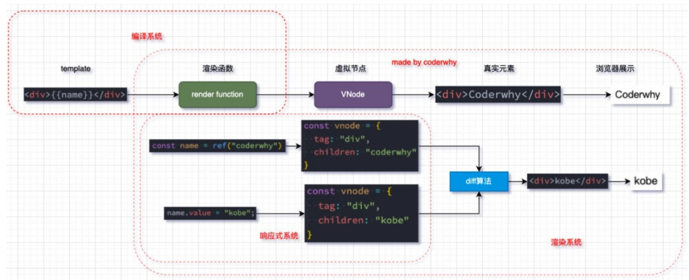

# Mini-Vue

```js
@title 'Mini-Vue' 
@description '探索vue的基本实现原理，并基于vue源码的三大核心功能实现一个简单版本的Vue'
@image 'https://gw.alipayobjects.com/zos/rmsportal/JiqGstEfoWAOHiTxclqi.png'
```


## 一、项目简介

实现一个简洁的Mini-Vue框架，包括三个模块

1、渲染系统模块

2、可响应式系统模块

3、应用程序入口模块


**vue简单剖析**

vue的源码包括三大核心：

1、Compiler模块：编译模板系统

2、Runtime模块：也可以称之为Renderer模块，真正渲染的模块

3、Reactivity模块：响应式系统




## 二、渲染系统实现

**渲染系统**：该模块主要包含三个功能：

功能一：h函数，用于返回一个VNode对象

功能二：mount函数，用于将VNode挂载到DOM上

功能三：patch函数，用于对比两个VNode进行对比，决定如何处理新的VNode


### 2.1 H函数

通过调用h函数，用于返回一个**VNode对象**。

虚拟节点：元素名（tag）、属性（props）、children（子节点）

```js
//renderer.js
const h = (tag, props, children) => {
    // 虚拟DOM就是一个js对象
    return {
        tag,
        props,
        children
    }
}
```

在index.html中引入

```html
<!DOCTYPE html>
<html lang="en">
<head>
    <title>Document</title>
</head>
<body>
    <div id="app"></div>
    <script src="./renderer.js"></script>
    <script>
        // 1.通过h函数来创建一个vnode
        const vnode = h('div', { class: 'ming' }, [
            h("h2", null, "当前计数：100"),
            h("button", null, "+1")
        ])
        console.log(vnode);
    </script>
</body>
</html>
```

事实上，我们上边创建的vnode已经可以看成是一个虚拟DOM了

```js
<div class="ming">
<h2>当前计数：100</h2>
<button>+1</button>
</div>
```


### 2.2 mont函数

mount函数，用于将VNode挂载到DOM上

1、根据vnode创建出真实DOM，并处理相应的属性（如果有，则添加进新创建的节点中）

```js
//renderer.js

const mount = (vnode, container) => {
    //将vnode -> 真实DOM
    // 1.创建出真实的原生节点，并且在vnode上保留el
    const el = vnode.el = document.createElement(vnode.tag)

    // 2.处理props
    //如果虚拟节点的props有值，则将值添加进新创建的节点上
    if(vnode.props) { 
        for(const key in vnode.props) {
            const value = vnode.props[key]
            el.setAttribute(key, value)
        }
    }
}
```


2、属性props的边界处理

dom元素的属性可能是这样子的,针对这种情况，我们需要对事件进行监听

```js
<div onclick="function() {}"></div>
```

```js
const mount = (vnode, container) => {
    //将vnode -> 真实DOM
    // 1.创建出真实的原生，并且在vnode上保留el
    const el = vnode.el = document.createElement(vnode.tag)

    // 2.处理props
    if (vnode.props) { 
        for (const key in vnode.props) {
            const value = vnode.props[key]
            
            if (key.startsWith("on")) { //对事件进行监听
                el.addEventListener(key.slice(2).toLowerCase(), value)
            } else {
                el.setAttribute(key, value)
            }
        }
    }
}
```


3、处理childern

如果vnode没有子节点，那么就直接跳过

如果vnoed有子节点，那么分为两种情况：

1、子节点为文本字符串，直接将文本添加到新创建的真实的el元素上即可

2、如果子节点是一个数组，说明vode的子节点有其他节点需要处理，递归调用mount函数即可

```js
    // 3.处理childern
    if (vnode.children) {
        if (typeof vnode.children === "string") { //如果是文本
            el.textContent = vnode.children
        } else { //其他情况视为数组
            vnode.children.forEach(item => {
                mount(item, el)
            })
        }
    }
```


4、将el挂载到container上

```js
const mount = (vnode, container) => {
    //将vnode -> 真实DOM
    // 1.创建出真实的原生，并且在vnode上保留el
    const el = vnode.el = document.createElement(vnode.tag)

    // 2.处理props
    if (vnode.props) { 
        for (const key in vnode.props) {
            const value = vnode.props[key]
            
            if (key.startsWith("on")) { //对事件进行监听
                el.addEventListener(key.slice(2).toLowerCase(), value)
            } else {
                el.setAttribute(key, value)
            }
        }
    }

    // 3.处理childern
    if (vnode.children) {
        if (typeof vnode.children === "string") { //如果是文本
            el.textContent = vnode.children
        } else { //其他情况视为数组
            vnode.children.forEach(item => {
                mount(item, el)
            })
        }
    }

    // 4.将el挂载到container上
    container.appendChild(el)
}

```

在index.html中使用

```html
<html>
<head>
    <title>Document</title>
</head>
<body>
    <div id="app"></div>
    <script src="./renderer.js"></script>
    <script>
        // 1.通过h函数来创建一个vnode
        const vnode = h('div', { class: 'ming' }, [
            h("h2", null, "当前计数：100"),
            h("button", null, "+1")
        ])
        

        // 2. 通过mount函数，将vnode挂载到div#app上
        mount(vnode, document.querySelector("#app"))
    </script>
</body>
</html>
```

这样一来，页面上就可以显示出vnode的内容了

**知识点补充**

1、为元素添加属性（DOM操作）

```js
    <div id="app"></div>
	<script>
        let app = document.querySelector("#app")
        app.setAttribute('class','box')
    </script>

	//输出：<div id="app" class="box"></div>	
```


### 2.3 patch函数

patch函数，用于对比两个VNode进行对比，决定如何处理新的VNode


假设用户更新了修改了vnode,这个时候我们需要进行differ算法

```js
        const vnode = h('div', { class: 'ming' }, [
            h("h2", null, "当前计数：100"),
            h("button", null, "+1")
        ])
        
        const vnode1 = h('div', null, '诶嘿')
```

上边的代码中，如果通过differ算法，找到两者的不同之处，把新的修改内容替换掉原先vnode的内容


1、判断两者的类型是否一致

```js
//renderer.js
const patch = (n1, n2) => {
    if (n1.tag !== n2.tag) { //类型不同
        //拿到n1的父节点（这里是<div id="app">）
        const n1ElParent = n1.el.parentElement;
        //删除n1
        n1ElParent.removeChild(n1.el)
        //将n2挂载上去
        mount(n2, n1ElParent)
    } else {
        
    }
}
```

如果两个类型不一致，则简单粗暴地将整个的n2替换掉n1（将n1的DOM树直接移除），而不是去修改n1


2、两者类型相同,处理属性

对比新旧两个虚拟DOM的属性，并将新的n2中的属性添加进el中

```js
const patch = (n1, n2) => {
    if (n1.tag !== n2.tag) { //类型不同
        const n1ElParent = n1.el.parentElement
        //直接删除掉n1，并将n2挂载到原n1位置
        n1ElParent.removeChild(n1.el)
        mount(n2, n1ElParent)
    } else { //类型是相同的
        // 1.取出element对象，并且在n2中进行保存
        const el = n2.el = n1.el

        // 2.处理props
        const oldProps = n1.props || {}
        const newProps = n2.props || {}
        // 2.1 获取所有的newProps，并添加进el中
        for (const key in newProps) {
            const newValue = newProps[key]
            const oldValue = oldProps[key] //如果oldValue有值，说明新旧n1、n2存在相同的属性
            if (newValue !== oldValue) {
                //将不相同的属性进行添加操作
                if (key.startsWith("on")) {
                    el.addEventListener(key.slice(2).toLowerCase(), newValue)
                } else {
                    el.setAttribute(key, newValue)
                }
            }
        }

        // 3.处理children
    }
}
```


3、处理属性

剔除掉el的属性中，旧的虚拟DOM的属性

```js
const patch = (n1, n2) => {
    if (n1.tag !== n2.tag) { //类型不同
        const n1ElParent = n1.el.parentElement
        //直接删除掉n1，并将n2挂载到原n1位置
        n1ElParent.removeChild(n1.el)
        mount(n2, n1ElParent)
    } else { //类型是相同的
        // 1.取出element对象，并且在n2中进行保存
        const el = n2.el = n1.el

        // 2.处理props
        const oldProps = n1.props || {}
        const newProps = n2.props || {}
        // 2.1 获取所有的newProps，并添加进el中
        for (const key in newProps) {
            const newValue = newProps[key]
            const oldValue = oldProps[key] //如果oldValue有值，说明新旧n1、n2存在相同的属性
            if (newValue !== oldValue) {
                //将不相同的属性进行添加操作
                if (key.startsWith("on")) {
                    el.addEventListener(key.slice(2).toLowerCase(), newValue)
                } else {
                    el.setAttribute(key, newValue)
                }
            }
        }
        // 2.2 删除旧的props
            for (const key in oldProps) {
              if (key.startsWith("on")) { // 对事件监听的判断
                const value = oldProps[key];
                el.removeEventListener(key.slice(2).toLowerCase(), value)
              } 
              if (!(key in newProps)) {
                el.removeAttribute(key);
              }
            }
        // 3.处理children
    }
}
```


4、两者类型相同，处理children

如果新的节点是文本，直接替换掉旧节点的整个children即可

```js
        // 3.处理children
        const newChildren = n2.children || []
        const oldChildren = n1.children || []

        if (typeof newChildren === 'string') {
            // 如果新节点的children是文本，替换掉旧el的整个innerHTML
            el.innerHTML = newChildren 
        }
```


5、处理children

新节点是本身是一个数组的情况：假设旧节点是一个文本，那么我们应该先清空旧节点的文本，并将新节点的children挂载到对应的位置上

```js
        // 3.处理children
        const newChildren = n2.children || []
        const oldChildren = n1.children || []
        // 3.1 新节点是一个文本
        if (typeof newChildren === 'string') {
            // 替换掉旧el的整个innerHTML
            el.innerHTML = newChildren
        } else {//3.2 新节点是一个数组
            //旧节点是一个文本
            if (typeof oldChildren === 'string') {
                el.innerHTML ="" //清空
                newChildren.forEach(item => {
                    mount(item, el) // 递归 ：将每一个item挂载到el上
                })
            }
```


6、处理children

新节点是一个数组，当旧节点也是一个数组时，就需要分为多种情况进行考虑

取出新旧节点的children的长度最小值，以最小值的长度为遍历依据，使新旧节点两两进行对比（patch，回调）

（考虑到新旧节点都是可能有多层的树结构，子节点，子节点的子节点....）

如果新节点的children有多余的元素，或者旧节点的children有多余的元素，就要进行添加/删除的操作

```js
        // 3.处理children
        const newChildren = n2.children || []
        const oldChildren = n1.children || []
        // 3.1 新节点是一个文本
        if (typeof newChildren === 'string') {
            // 替换掉旧el的整个innerHTML
            el.innerHTML = newChildren
        } else {//3.2 新节点是一个数组
            //3.2.1 旧节点是一个文本
            if (typeof oldChildren === 'string') {
                el.innerHTML ="" //清空
                newChildren.forEach(item => {
                    mount(item, el) // 递归 ：将每一个item挂载到el上
                })
            } else {
                //3.2.2旧节点是一个数组
                //oldChildren: [v1, v2, v3]
                //newChildren: [v1, v5, v6]
                const commonLength = Math.min(oldChildren.length, newChildren.length)
                for (let i = 0; i < commonLength; i++) {
                    // 有相同节点的元素进行patch操作
                    patch(oldChildren[i], newChildren[i])
                }
            }
        }
```


7、处理children

当新节点的children长度大于旧节点的children，就需要对超出公共长度的节点进行添加操作

```js
 	else {
                //3.2.2旧节点是一个数组
                //oldChildren: [v1, v2, v3]
                //newChildren: [v1, v5, v6]
                const commonLength = Math.min(oldChildren.length, newChildren.length)
                for (let i = 0; i < commonLength; i++) {
                    // 有相同节点的元素进行patch操作
                    patch(oldChildren[i], newChildren[i])
                }

                //newChildren.length > oldChildren.length
                //oldChildren: [v1, v2, v3]
                //newChildren: [v1, v5, v6, v7, v8]
                if (newChildren.length > oldChildren.length) {
                    //newChildren: [v7, v8] 添加至el上
                    newChildren.slice(oldChildren.length).forEach(item => {
                        mount(item, el)
                    })
                }
            }
```


8、处理children

当新节点的children的长度小于旧节点的children的长度，我们需要将旧节点大于公共长度的的元素进行移除

```js
	else {
                //3.2.2旧节点是一个数组
                //情况一
                //oldChildren: [v1, v2, v3]
                //newChildren: [v1, v5, v6]
                const commonLength = Math.min(oldChildren.length, newChildren.length)
                for (let i = 0; i < commonLength; i++) {
                    // 有相同节点的元素进行patch操作
                    patch(oldChildren[i], newChildren[i])
                }

                ////情况二：newChildren.length > oldChildren.length
                //oldChildren: [v1, v2, v3]
                //newChildren: [v1, v5, v6, v7, v8]
                if (newChildren.length > oldChildren.length) {
                    //newChildren: [v7, v8] 添加至el上
                    newChildren.slice(oldChildren.length).forEach(item => {
                        mount(item, el)
                    })
                }

                // 情况三：newChildren.length < oldChildren.length
                //oldChildren: [v1, v2, v3, v7, v8]
                //newChildren: [v1, v5, v6]
                if (newChildren.length < oldChildren.length) {
                    //oldChildren: [v7, v8]进行移除
                    oldChildren.slice(newChildren.length).forEach(item => {
                        el.removeChild(item.el)
                    })
                }
            }
```


## 三、响应式系统模块

**响应式的思想**

```js
    <script>
        const info = { counter: 100 }

        function dobuleCounter() {
            console.log(info.counter * 2) //依赖
        }
        dobuleCounter()

        //当页面某处执行了
        info.counter++
        //应该自动在这里再执行一次dobuleCounter()
    </script>
```

`dobuleCounter`函数依赖于`info.counter`,当`info.counter`发生改变时，`dobuleCounter`函数应该使用新的数据执行一次

简单地讲，当某一个数据发生变化时，页面中的另外一个数据对这个数据有依赖，也应该进行相应的变化

### 3.1 依赖收集系统

创建一个收集依赖的类

> Dep: depend（依赖）  subscribers：订阅者

```js
class Dep {
    constructor () {
        this.subscribers = [] //用于收集依赖
    }
}
```

当然，`this.subscribers = []`使用集合Set会更好，因为集合规定了元素不能出现重复。重复了只保留一个


```js
class Dep {
    constructor () {
        this.subscribers = new Set() //用于收集依赖
    }
    
    //收集依赖，修改了数据后会产生的影响
    addEffect(effect) {
        //数据变化后，将这个被影响的目标添加进subscribers中
        this.subscribers.add(effect)
    }
    
    //执行
    notify() {
        this.subscribers.forEach(effect => {
            //调用被影响的目标
            effect()
        })
    }
}

// 创建实例
const dep = new Dep()

const info = {
    counter: 100
}

//下面的两个函数依赖于info.counter
function dobuleCounter() {
    console.log(info.counter * 2)
}
function powerCounter() {
    console.log(info.counter * info.counter)
}

//收集依赖
dep.addEffect(dobuleCounter)
dep.addEffect(powerCounter)


//依赖发生改变
info.counter++  
dep.notify()

```

在index.html在引入上边的代码，可以看到代码确实`info.counter `改变后，对应的`dobuleCounter、powerCounter`也重新调用并更新了数据


**问题：**

上边的代码存在很大的问题，比如需要手动收集依赖、需要手动执行执行依赖的函数。

我们希望当一个对象对目标有依赖时，能够自动被收集，自动在目标改变时，自动执行


对上边的代码进行重新构建

```js
class Dep {
    constructor () {
        this.subscribers = new Set() //用于收集依赖
    }

    depend() {
        if (activeEffect) {
            this.subscribers.add(activeEffect)
        }
    }
    
    //执行
    notify() {
        this.subscribers.forEach(effect => {
            //调用被影响的目标
            effect()
        })
    }
}

let activeEffect = null
function watchEffect(effect) {
    activeEffect = effect
    dep.depend()
    effect() //执行时，因为读取数据而被收集了依赖
    activeEffect = null
}

// 创建实例
const dep = new Dep()

const info = {
    counter: 100
}

//下面的两个函数依赖于info.counter
watchEffect(function() {
    console.log(info.counter * 2)
})
watchEffect(function() {
    console.log(info.counter * info.counter)
})


//数据发生改变
info.counter++  
dep.notify()
```


> 先理解上边的代码，不然下面的代码可能理解不了

上边的代码依旧有些缺陷

假设存在effect1、effect2、effect3，其中effect1、effect3依赖于info中的name属性，当只有name属性发生变化时，再次调用`dep.nitify()`显然是不合适的（因为，effect2并没有受影响）

```js
//实例
const dep = new Dep()

//数据
const info = {
    name: 'linming',
    counter: 10
}
const foo = {
    height: 1.88
}

//effect1
watchEffect(function () {
    console.log(info.counter * 2, info.name)
} )
//effect2
watchEffect(function () {
    console.log(info.counter * info.counter)
})
//effect3
watchEffect(function () {
    console.log(info.counter + 10, info.name)
})

info.name = "linlin"
dep.notify() //不适合
```


所以，我们不能随随便便地进行依赖收集。

也不能将所有的依赖都收集在一个dep中，而是应该不同的数据，应该创建不同的dep去收集

```js
dep1(info.counter)=》subscribers //关于info.counter的订阅者
dep2(info.name)=》subscribers    //关于info.name的订阅者
dep3(foo.height)=》subscribers   //关于foo.height的订阅者
```

需要一种专门的数据结构来管理这些dep实例——MAP（可以将对象作为键），当然使用Weakmap会更好。


### 3.2 vue2数据劫持

**实现效果**

封装一个reactive函数，希望实现以下效果

```js
//传入一个对象，将其变为响应式

const info = reactive({ name: 'linming', counter: 10 })
const foo = reactive({ height: 1.88 })
```


最重要的是，我们需要实现当`info、foo`对象里边的值发生变化时，能够进行数据劫持

在vue2中，数据响应原理使用了`Object.defineProperty`,而vue3使用了`proxy`


**1、实现数据劫持**

这里我们先写vue2的数据劫持方式	

```js
// vue2的数据劫持
function reactive(raw) {
    Object.keys(raw).forEach(key => {
        Object.defineProperty(raw, key, {
            get() {  },
            set(newValue) {  }
        })
    })
    return raw
}

const info = reactive({ name: 'linming', counter: 10 })
const foo = reactive({ height: 1.88 })
```

这样一来，我们就实现了对info对象、foo对象的数据劫持


我们可以在get里边实现依赖的收集

```js
function reactive(raw) {
    const dep = new Dep()
    Object.keys(raw).forEach(key => {
        Object.defineProperty(raw, key, {
            get() {
                dep.depend()
            },
            set(newValue) {  }
        })
    })
    return raw
}
```

这样一来，一旦数据发生改变，例如`counter`，与counter相关的函数目标就会被添加依赖中


**1、封装getDep函数**

上边的代码中，每一次添加依赖，都是新创建一个dep实例，显然是不合适的

所以，我们需要封装一个这个工具函数，基本机构如下

```js
// 结构图：
//1.最外层的targetMap（WeakMap类型，键为对象）
//2.targetMap的属性为：target（键，对象）：depsMap（值，对象）
//3.depsMap对象的属性有：key（键，字符串）：dep（值，对象）
```

```js
const targetMap = new WeakMap()
function getDep(target, key) {
    // 1.根据对象（target）取出对应的map对象
    let depsMap = targetMap.get(target)
    //如果没有则创建
    if (!depsMap) {
        depsMap = new Map()
        targetMap.set(target, depsMap)
    }

    // 2. 取出具体的dep对象
    let dep = depsMap.get(key)
    //如果没有则创建
    if(!dep) {
        dep = new Dep()
        depsMap.set(key, dep)
    }
    return dep
}
```

调用getDep函数，最终实现效果如下

```js
let activeEffect = null
function watchEffect(effect) {
    activeEffect = effect
    effect()
    activeEffect = null
}

//创建getDate工具函数
const targetMap = new WeakMap()
function getDep(target, key) {
    // 1.根据对象（target）取出对应的map对象
    let depsMap = targetMap.get(target)
    //如果没有则创建
    if (!depsMap) {
        depsMap = new Map()
        targetMap.set(target, depsMap)
    }

    // 2. 取出具体的dep对象
    let dep = depsMap.get(key)
    //如果没有则创建
    if(!dep) {
        dep = new Dep()
        depsMap.set(key, dep)
    }
    return dep
}

// vue2的数据劫持
function reactive(raw) {
    Object.keys(raw).forEach(key => {
        //创建dep实例
        const dep = getDep(raw, key)
        let value = raw[key]

        Object.defineProperty(raw, key, {
            get() {
                // 获取值时
                dep.depend()
                return value
            },
            set(newValue) {
                // 设置值时
                value = newValue
                dep.notify() //响应
            }
        })
    })
    return raw
}


// 创建实例
const dep = new Dep()

//测试代码
const info = reactive({ name: 'linming', counter: 10 })
const foo = reactive({ height: 1.88 })

//effect1
watchEffect(function () {
    console.log("effect1:", info.counter * 2, info.name)
} )
//effect2
watchEffect(function () {
    console.log("effect2:", info.counter * info.counter)
})
//effect3
watchEffect(function () {
    console.log("effect3:", info.counter + 10, info.name)
})
//effect4
watchEffect(function () {
    console.log("effect4:", foo.height);
})

//数据发生改变
info.counter++  
```

当`info.counter++  `发生变化时，结果如下

```js
//effect1: 20 linming
//effect2: 100
//effect3: 20 linming
//effect4: 1.88
//effect1: 22 linming
//effect2: 121
//effect3: 21 linming
```

前四个是收集依赖，必然会执行。后边的effect1、2、3因为依赖了`info.counter`，所以也执行了，而effect4并没有依赖它，就没有执行


### 3.3 vue3数据劫持

**为什么vue3选择Proxy？**

1、最主要的原因：Object.defineProperty是劫持对象的属性，如果新增元素，那么vue2需要再次调用definedProperty。而Proxy劫持的是整个对象，不需要做特殊处理

2、修改对象的不同：使用Object.defineProperty时，修改原来的obj对象就可以触发拦截；而使用proxy，就必须修改代理对象，即Proxy的实例才可以触发拦截

3、Proxy能观察的类型比defineProperty更丰富

A、has：in操作符的捕获器

B、deleteProperty：delete操作符的捕捉器

4、Proxy作为新标准将受到浏览器厂商重点的持续的性能优化


缺点：Proxy不兼容IE


具体代码如下

```js
class Dep {
    constructor () {
        this.subscribers = new Set() //用于收集依赖
    }

    depend() {
        if (activeEffect) {
            this.subscribers.add(activeEffect)
        }
    }
    
    //执行
    notify() {
        this.subscribers.forEach(effect => {
            //调用被影响的目标
            effect()
        })
    }
}

let activeEffect = null
function watchEffect(effect) {
    activeEffect = effect
    effect() //获取数据时，利用get收集依赖 （所以一开始会多打印4个effect）
    activeEffect = null
}

//创建getDate工具函数
const targetMap = new WeakMap()
function getDep(target, key) {
    // 1.根据对象（target）取出对应的map对象
    let depsMap = targetMap.get(target)
    //如果没有则创建
    if (!depsMap) {
        depsMap = new Map()
        targetMap.set(target, depsMap)
    }

    // 2. 取出具体的dep对象
    let dep = depsMap.get(key)
    //如果没有则创建
    if(!dep) {
        dep = new Dep()
        depsMap.set(key, dep)
    }
    return dep
}

// vue3的数据劫持
function reactive(raw) {
    return new Proxy(raw, {
        get(target, key) {
            const dep = getDep(target, key)
            dep.depend()
            return target[key]
        },  
        set(target, key, newValue) {
            const dep = getDep(target, key)
            target[key] = newValue
            dep.notify()
        }
    })
} 


// 创建实例
const dep = new Dep()

//测试代码
const info = reactive({ name: 'linming', counter: 10 })
const foo = reactive({ height: 1.88 })

//effect1
watchEffect(function () {
    console.log("effect1:", info.counter * 2, info.name)
} )
//effect2
watchEffect(function () {
    console.log("effect2:", info.counter * info.counter)
})
//effect3
watchEffect(function () {
    console.log("effect3:", info.counter + 10, info.name)
})
//effect4
watchEffect(function () {
    console.log("effect4:", foo.height);
})

//数据发生改变
info.name = 'hahah'  
```

打印的前四个effect1、2、3、4是为了收集依赖


### 3.4 mini-vue实现

1、创建一个index.html文件，导入renderer函数和reactive函数

并创建一个根组件	

```js
<!DOCTYPE html>
<html lang="en">
<head>
    <title>Document</title>
</head>
<body>
    <div id="app"></div>

    <script src="../响应式系统/reactive.js"></script>
    <script src="../渲染器的实现//renderer.js"></script>
    <script>
        // 1.创建根组件
        const app = {
            data: reactive({
                counter : 100
            }),
            render() { //返回一个vnode
                return h("div", null, [
                    h("h2", null, `当前计数：${ this.data.counter }`),
                    h("button", {
                        onclick: () =>{
                            this.data.counter++
                        }
                    }, "+1")
                ])
            }
        }

        //挂载根组件
        
    </script>
</body>
</html>
```


2、挂载根组件

```js
createApp(App).mount("#app")

//或者这样写
const app = createApp(App)
app.mount("#app")
```

这意味着调用了createApp函数后，返回一个对象，对象中有一个mount函数


3、创建createApp函数

第一次进入该函数是挂载根组件，第二次是更新

```js
function createApp(rootComponent) {
    return {
        mount(selector) {
            const container = document.querySelector(selector)
            let isMounted = false  //是否完成挂载
            let oldVnode = null

            watchEffect(function() { //挂载时，将进行依赖的收集
                if (!isMounted) {
                    //尚未挂载
                    oldVnode = rootComponent.render()
                    mount(oldVnode, container)
                    isMounted = true  //将其转态改为已挂载
                } else {
                    //已实现挂载
                    const newVnode = rootComponent.render()
                    //更新数据
                    patch(oldVnode, newVnode)
                    oldVnode = newVnode //为了可再次更新
                }
            })
        }

    }
}
```


