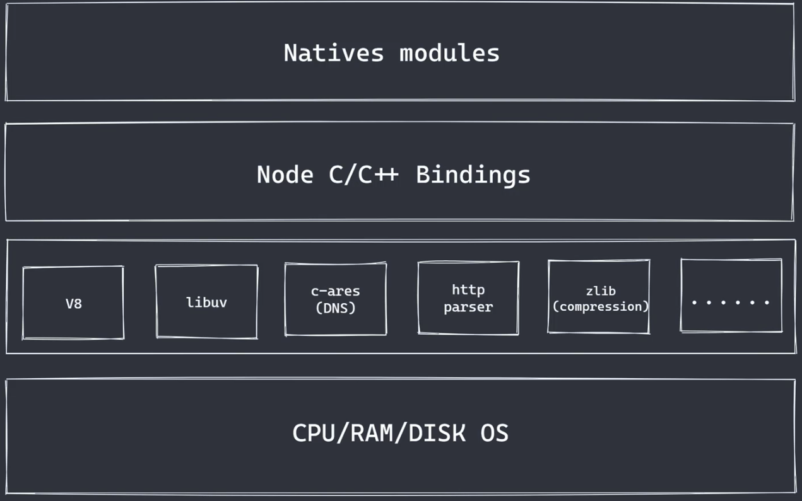

# Node进阶

```js
@title 'Node.js进阶' 
@description 'nodejs进阶包含了许多原理性知识，包括了常见的数据库类型与基本使用，基本的node框架、服务端渲染等内容'
@image 'https://gw.alipayobjects.com/zos/rmsportal/JiqGstEfoWAOHiTxclqi.png'
```



### 1、代理客户端

**基本结构**

**get请求**

```js
//server.js
const http = require('http')

const server = http.createServer((res, req) => {
  console.log('请求进来，相关处理内容')
})

server.listen(8080, () => {
  console.log('server is running')
})
```

```js
//agent-client.js 
const http = require('http')

// 发送get请求
http.get({host: 'localhost', port: 8080}, (res) => {})
```

**post请求**

```js
//server
const http = require('http')
const url = require('url')

const server = http.createServer((req, res) => {
  // post
  let arr = []
  req.on('data', (data) => {
    arr.push(data)
  })
  req.on('end', () => {
    let obj = Buffer.concat(arr).toString()
    let handleValue = JSON.parse(obj)
    handleValue.age = 22
    res.end(JSON.stringify(handleValue))
  })
})

server.listen(8080, () => {
  console.log('server is running')
})


//agent-client
const http = require('http')

const options = {
  host: 'localhost',
  port: 8080,
  method: 'post',
  path: '/?age=25',
  headers: {
    "Content-type": "application/json" //json格式
    //"Content-type": "application/x-www-form-urlencoded" //表单格式 
  }
}
// 发送post请求
let req = http.request(options, (res) => {
  let arr = []
  res.on('data', (data) => {
    arr.push(data)
  })
  res.on('end', () => {
    console.log(Buffer.concat(arr).toString())
  })
})

//发送json数据
req.end('{"name": "mzlin"}')
```

**使用代理**

为了解决跨域问题，我们可以将agent-client改造为代理服务器，浏览器通过这个代理服务器请求数据，而代理服务器直接向web服务器获取数据返回给客户端

```js
//服务器
const http = require('http')

const server = http.createServer((req, res) => {
  let arr = []
  req.on('data', (data) => {
    arr.push(data)
  })
  req.on('end', () => {
    console.log(Buffer.concat(arr).toString())
    // 返回数据
    res.end(JSON.stringify('来自web服务的msg'))
  })
})

server.listen(8080, () => {
  console.log('server is running')
})
```

```js
//代理服务器
const http = require('http')


const options = {
  host: 'localhost',
  port: 7777,
  path: '/',
  method: 'post'
}

const server = http.createServer((request, response) => {
  let req = http.request(options, (res) => {
    let arr = []
    res.on('data', (data) => {
      arr.push(data)
    })
    res.on('end', () => {
      let ret = Buffer.concat(arr).toString()
      response.setHeader('Content-type', 'text/hyml;charset=utf-8')
      response.end(ret)
    })
  })

  req.end('请求web服务器')
})

server.listen(7777, () => {
  console.log('agent server is running')
})
```

### 2、静态服务

目标：模拟服务器加载静态资源的过程

在本地准备`index.html / index.css `等静态资源，并创建 server.js用于提供服务

```js
//server.js初始代码
const http = require('http')

const server = http.createServer((req, res) => {
  console.log('请求进来了')
})

server.listen(8080, () => {
  console.log('server is start......')
})
```

当在浏览器请求`127.0.0.1:8080`时，就会进入到server中来

**路径处理**

```js
const http = require('http')
const url = require('url')
const path = require('path')

const server = http.createServer((req, res) => {
  //路径处理
  let { pathname } = url.parse(req.url)
  pathname = decodeURIComponent(pathname) //防止中文路径乱码
  let absPath = path.join(__dirname, pathname) //本地资源路径
  res.end(absPath)
})
```

当在浏览器请求`127.0.0.1:8080/index.html`时，能够正确解析路径

但是如果用户请求的是不存在的路径，也应当进行404处理

```js
const server = http.createServer((req, res) => {
  //路径处理
  let { pathname } = url.parse(req.url)
  pathname = decodeURIComponent(pathname) //防止中文路径乱码
  let absPath = path.join(__dirname, pathname) //本地资源路径

  // 目标资源处理
  fs.stat(absPath, (err, statObj) => {
    if(err) {
      res.statusCode = 404
      res.end('Not Found')
      return
    }
  })
})
```

**读取资源**

```js
const http = require('http')
const url = require('url')
const path = require('path')
const fs = require('fs')

const server = http.createServer((req, res) => {
  //路径处理
  let { pathname } = url.parse(req.url)
  pathname = decodeURIComponent(pathname) //防止中文路径乱码
  let absPath = path.join(__dirname, pathname) //本地资源路径

  //目标资源处理
  fs.stat(absPath, (err, statObj) => {
    if(err) {
      res.statusCode = 404
      res.end('Not Found')
      return
    }
    //如果路径是一个文件，直接读取即可
    if(statObj.isFile()) {
      fs.readFile(absPath, (err, data) => {
        res.setHeader('Content-type', 'text/html;chartset=utf-8')
        res.end(data)
      })
    }
    // 如果路径是一个文件夹，则读取其中的index.html
    else {
      fs.readFile(path.join(absPath, 'index.html'), (err, data) => {
        res.setHeader('Content-type', 'text/html;chartset=utf-8')
        res.end(data)
      })
    }
  })
})

server.listen(8000, () => {
  console.log('server is start......')
})
```

这样当我们输入`localhost:8000/index.html`时，就能够访问资源了

**边界处理**

1、处理响应头contetn-type错误问题

```js
//npm install mime
res.setHeader('Content-type', mime.getType(pathname)+';chartset=utf-8')
```

### 3、socket.io

#### 3.1 基本使用

Socket.io是基于Websocket封装的一个框架

官方案例：实时通信

`https://socket.io/zh-CN/get-started/chat`

**服务端**

```js
const express = require('express');
const app = express();

const http = require('http');
const server = http.createServer(app);

const { Server } = require("socket.io");
const io = new Server(server);

//处理HTTP协议（使用Express的实例的app）
app.get('/', (req, res) => {
  res.sendFile(__dirname + '/index.html');
});

//处理Websocket协议的使用socket.io的实例io
io.on('connection', (socket) => {
  console.log('a user connected');
});

server.listen(8888, () => {
  console.log('listening on *:8888');
});
```

**客户端**

```js
<!DOCTYPE html>
<html>
  <head>
    <title>Socket.IO chat</title>
    <meta name="viewport" content="width=device-width, initial-scale=1.0">
    <style>
      body { margin: 0; padding-bottom: 3rem; font-family: -apple-system, BlinkMacSystemFont, "Segoe UI", Roboto, Helvetica, Arial, sans-serif; }

      #form { background: rgba(0, 0, 0, 0.15); padding: 0.25rem; position: fixed; bottom: 0; left: 0; right: 0; display: flex; height: 3rem; box-sizing: border-box; backdrop-filter: blur(10px); }
      #input { border: none; padding: 0 1rem; flex-grow: 1; border-radius: 2rem; margin: 0.25rem; }
      #input:focus { outline: none; }
      #form > button { background: #333; border: none; padding: 0 1rem; margin: 0.25rem; border-radius: 3px; outline: none; color: #fff; }

      #messages { list-style-type: none; margin: 0; padding: 0; }
      #messages > li { padding: 0.5rem 1rem; }
      #messages > li:nth-child(odd) { background: #efefef; }
    </style>
  </head>
  <body>

    <ul id="messages"></ul>

    <form id="form" action="">
      <input id="input" autocomplete="off" /><button>Send</button>
    </form>

    <script src="/socket.io/socket.io.js"></script>
    <script>
      var socket = io();  

            socket.on('connect', () => {
        console.log('连接成功')
      })
      //断开了连接
      socket.on("disconnect", (reason) => {
        if(reason === "io server disconnect") {
          socket.connect() //尝试重连
        }
      })
      socket.on('connect_error', (error) => {
        console.log('连接失败', error)
      })
    </script>
  </body>
</html>
```

启动服务，就可以在浏览器看见服务器socket连接成功了`a user connected`，客户端打印连接成功

**客户端收发消息**

```js
<script src="/socket.io/socket.io.js"></script>
<script>
  var socket = io();

  var messages = document.getElementById('messages');
  var form = document.getElementById('form');
  var input = document.getElementById('input');

  form.addEventListener('submit', function(e) {
    e.preventDefault();
    if (input.value) {
      socket.emit('chat message', input.value);
      input.value = '';
    }
  });

  socket.on('chat message', function(msg) {
    var item = document.createElement('li');
    item.textContent = msg;
    messages.appendChild(item);
    window.scrollTo(0, document.body.scrollHeight);
  });
</script>
```

**服务器收发消息**

```js
//处理Websocket协议的使用socket.io的实例io
io.on('connection', (socket) => {
  socket.on('chat message', (msg) => {
    io.emit('chat message', msg);
  });
});
```

**群发信息**

由于每个用户连接上服务器都回触发“connection”，并创建一个socket。可以利用这个特点群发信息

```js
//存储所有用户的socket通信端口
const clients = []

//连接成功只会发一次
io.on('connection', (socket) => {
  clients.push(socket)
  socket.on('chat message', (msg) => {
    console.log(msg)
    io.emit('chat message', msg);
  });

  // 发送给当前所有已连接的在线用户
  clients.forEach(item => {
    item.emit('chat message', '这是群发的信息')
  })
});
```

```js
  // 刷新或断开连接时，移除对应用户的socket
  socket.on("disconnect", () => {
    const index = clients.findIndex(item => item === socket)
    if(index !== -1) {
      clients.splice(index, 1)
    }
  })
```

事实上，socket.io提供了群发消息的api，我们不用自己实现

```js
//连接成功只会发一次
io.on('connection', (socket) => {
  socket.on('chat message', (msg) => {
    // 群发消息
    io.emit('chat message', msg)
    // 发送给不包括当前用户的其他用户
    // socket.broadcast('chat message', msg)
  })
```

#### 3.2 案例

**在vue中使用socket.io**

安装`npm install socket.io-client`

```vue
<template>
  <div class="home">
    <ul id="messages"></ul>

    <form id="form" action="">
      <input id="input" autocomplete="off" /><button>Send</button>
    </form>
  </div>
</template>
<script setup>
  import { io } from 'socket.io-client'
  const socket = io("http://localhost:8888", {
  //重连的延迟时间
  reconnectionDelayMax: 10000, 
  // 身份信息
  auth: {
    token: "123"
  },
  //自定义查询参数
  query: {
    "my-key": "my-value"
  }
});

socket.on('connect', () => {
    console.log('连接成功')
  })
socket.on('disconnect', () => {
  console.log('断开连接')
})

socket.on('connect_error', err => {
  console.log('连接失败', err)
})
</script>
<style>
body { margin: 0; padding-bottom: 3rem; font-family: -apple-system, BlinkMacSystemFont, "Segoe UI", Roboto, Helvetica, Arial, sans-serif; }
#form { background: rgba(0, 0, 0, 0.15); padding: 0.25rem; position: fixed; bottom: 0; left: 0; right: 0; display: flex; height: 3rem; box-sizing: border-box; backdrop-filter: blur(10px); }
#input { border: none; padding: 0 1rem; flex-grow: 1; border-radius: 2rem; margin: 0.25rem; }
#input:focus { outline: none; }
#form > button { background: #333; border: none; padding: 0 1rem; margin: 0.25rem; border-radius: 3px; outline: none; color: #fff; }
#messages { list-style-type: none; margin: 0; padding: 0; }
#messages > li { padding: 0.5rem 1rem; }
#messages > li:nth-child(odd) { background: #efefef; }
</style>  
```

```js
//server.js
const express = require('express');
const app = express();

const http = require('http');
const server = http.createServer(app);

const { Server } = require("socket.io");
const io = new Server(server);

app.get('/', (req, res) => {
  res.sendFile(__dirname + '/index.html');
});

io.on('connection', (socket) => {
  socket.on('chat message', (msg) => {
  //   console.log(msg)
  //   io.emit('chat message', msg);
  // });

    // 群发消息
    io.emit('chat message', msg)
    // 发送给不包括当前用户的其他用户
    // socket.broadcast('chat message', msg)
  })


  // 刷新或断开连接时，移除对应用户的socket
  socket.on("disconnect", () => {
    const index = clients.findIndex(item => item === socket)
    if(index !== -1) {
      clients.splice(index, 1)
    }
  })

});

server.listen(8080, () => {
  console.log('listening on *:8888');
});
```

运行vue项目与app服务，即可看到项目成功打通了

如果前端项目与server存在跨域问题，则需要进行配置

```js
//添加
const { Server } = require("socket.io");
const io = new Server(server, {
  cors: {
    origin: "*" // 允许所有
  }
});
```

**增加用户登录**

```vue
<template>
  <div class="login">
    <form action="">
      <div>
        <label for="name">
        用户名：
        <input type="text" id="name" v-model="user.name">
      </label>
      </div>
      <div>      
        <label for="password">
        密码：
        <input type="password" id="password" v-model="user.passsord">
        </label></div>
      <div><button @click.prevent="loginbtn">登录/注册</button></div>
    </form>
  </div>
</template>

<script setup>
import { reactive } from 'vue'
import axios from 'axios'

const user = reactive({
  name: '',
  passsord: ''
})

const loginbtn = async() => {
  try {
    const { data } = await axios.post('http://localhost:8888/api/login', user)
  } catch (error) {
    console.log(error.message)
  }
}
</script> 
<style></style>
```

点击登录时，遇到跨域问题

安装cors库

```js
//server.js
const cors = require('cors')
// http跨域问题处理
app.use(cors())
```

**完整代码**

```js
//server
//server.js
const express = require('express');
const router = require('./server-login')
const cors = require('cors')
const app = express();

const http = require('http');
const server = http.createServer(app);

//配置解析post请求体
app.use(express.json())
// http跨域问题处理
app.use(cors())
app.use(router)

const { Server } = require("socket.io");
const io = new Server(server, {
  cors: {
    origin: "*" // 允许所有
  }
});

app.get('/', (req, res) => {
  res.sendFile(__dirname + '/index.html');
});

io.on('connection', (socket) => {
  socket.on('chat message', (msg) => {
  //   console.log(msg)
  //   io.emit('chat message', msg);
  // });

    // 群发消息
    io.emit('chat message', msg)
    // 发送给不包括当前用户的其他用户
    // socket.broadcast('chat message', msg)
  })

  // 刷新或断开连接时，移除对应用户的socket
  // socket.on("disconnect", () => {
  //   const index = clients.findIndex(item => item === socket)
  //   if(index !== -1) {
  //     clients.splice(index, 1)
  //   }
  // })

});

server.listen(8888, () => {
  console.log('listening on *:8888');
});


//server-login
const express = require('express')
const mongoose = require('mongoose')


// 创建用户模型
const userSchema = new mongoose.Schema({
  username: {
    type: String,
    require: true
  },
  password: {
    type: String,
    require: true
  }
})

//连接数据库
mongoose.connect('mongodb://localhost/chat-demo', {
  useNewUrlParser: true, useUnifiedTopology: true
})
const db = mongoose.connection
db.on('error', err => {
  console.log('连接失败', err)
})
db.once('open', function() {
  console.log('连接成功')
})
const User = mongoose.model('User', userSchema)


const router = express.Router()

router.post('/login', async(req, res, next) => {
  const { username, password } = req.body

  let user = await User.findOne({username})
  if(user) {
  //有账号，登录
  } 
  else {
  //无账号，注册
  user = await new User(req.body).save()
  }

  res.status(200).send({
    user: {
      username: user.username,
      status: 1
    }
  })
})

module.exports = router
```

### 4、NoSql

**背景**

传统的关系型数据库的弊端：

+ 难以应付每秒上万次的高并发数据写入
+ 查询上亿量级的速度及其缓慢
+ 分库、分表形式形成的子库到达一定规模后难以进一步拓展
+ 分库、分表的规则可能回因为需求变更而发生变更
+ 修改表结构困难

在数据量暴增的时代，若想用传统的关系型数据库来满足数据高并发读写、巨量数据的存储、数据库的扩展和高可用、则需要增加软硬件的规格、这将大幅度提高成本。

而NoSql，非关系型数据库把数据直接放进一个大仓库，不标号，不连线，单纯的堆起来，从而提高了对海量数据的高性能存储及访问需求

**NoSol分类**

（1）键值数据库

这类数据库主要使用数据结构中的key来查找特定数据的value。优势在于存储时不采用任何模式，因此极易添加数据。这类数据库有极高的读写性能，用于处理大量数据的高访问负载比较合适。主要代表：Redis、Flare

（2）文档型数据库

这类数据库满足了海量数据的存储和访问需求、同时对字段要求不严格、可以随意增加、删除、修改字段、且不需要预先定义表结构，适用于各类网络应用

主要代表：MongoDB

（3）列存储型数据库

这类数据库查找速度快，可扩展性强，适合用作分布式文件存储系统。

（4）图数据库

这类数据库利用“图结构”的相关算法来存储实体之间的关系信息，适合用于构建社交网络和推荐系统的关系图谱

### 5、MongoDB

#### 5.1 安装与基本使用

官网`https://www.mongodb.com/`

参考链接：`https://blog.csdn.net/weixin_44275686/article/details/125390302`

**在mac上安装**

【步骤 1】解压缩刚刚下载的压缩包，并将其重命名为 mongodb：

```shell
sudo tar -zxvf mongodb-macos-x86_64-4.4.3.tgz     # 解压 MongoDB 压缩包
sudo mv mongodb-osx-ssl-x86_64-4.0.17/ mongodb  # 重命名解压得到的文件夹
```

【步骤 2】在 /usr/local/mongodb 目录下新建两个文件夹 data 和 log，用于存储 MongoDB 的数据和日志。

```shell
sudo mkdir -p /usr/local/mongodb/data
sudo mkdir -p /usr/local/mongodb/log
```

使用如下命令为当前用户分配目录的读写权限：

```shell
sudo chown username /usr/local/mongodb/data
sudo chown username /usr/local/mongodb/log
```

其中“username”为当前的用户名，您需要修改为您当前系统的用户名。

【步骤 3】配置 PATH。在终端中输入`open -e .bash_profile`命令打开 bash_profile 配置文件，然后将 MongoDB 的安装目录下的 bin 目录添加到环境变量中，如下所示：

```shell
export PATH=${PATH}:/usr/local/mongodb/bin 
```

编辑完成后保存并退出，然后使用`source .bash_profile`命令使配置立即生效。

最后通过`mongod -version`命令查看是否安装成功

**启动与停止**

```js
mongod --dbpath="数据存储目录"
```

注：默认占用27017端口

> 注意：在新版的mac中，.bash_profile文件已弃用。更换终端都需要重新使用open -e .bash_profile命令。我们可以新建一个.zshrc文件，将该命令写入其中，并在终端运行source ~/.bash_profile，就解决了

停止服务在连接上客户端的命令行中进行

```js
use admin;
db.shutdownServer();
```

**mongo shell 是 MongoDB 的交互式 JavaScript 接口。可以使用mongo shell 来查询和更新数据以及执行管理操作。**

1、连接默认端口上的本地mongodb服务

```js
mongo
```

2、连接本地其他端口

```js
mongo --port 28015
```

3、连接远程主机上的服务

```js
mongo "mongodb://mongodb0.example.com:28015"
//或者
mongo --host mongodb0.example.com --port 28015
```

4、连接具有身份认证的服务

```js
mongo "mongodb://用户身份@mongodb0.examples.com:28015/?anthSource=admin"
//或者
mongo --username mzlin --password xxx --authenticationDatabase adlin --host mongodb0.example.com --port 28015
```

> 注意：在mac上使用mongosh工具，`brew install mongosh`  参考链接：https://www.cnblogs.com/Denny_Yang/p/16666375.html

连接成功后进入一个js环境的终端，可以通过执行`show dbs`等mongodb命令

#### 5.2 mongodb基础概念

存储结构：数据库 》 集合 〉文档

```js
{
  //数据库
  "dbname": {
    //集合collection，对应关系型数据库的table
    "users": [
      //文档document，对应关系型数据库的行row
      {
        //数据字段field，对应关系型数据库的列column
        "id": 1,
        "username": "mzlin",
        "password": "1234567"
      }
    ]
  }
}
```

**常见操作**

1、查看数据库列表 `show dbs`

2、查看当前数据库 `db`

3、创建/切换数据库 `use db_name`

> 只有数据库中有了数据，才会被真正创建出来
> 
> d b.users.insert({ name: "mzlin", age: 22 })

4、删除数据库 `db.dropDatabase()`

**集合**

1、创建集合 `db.users.insert({ name: "mzlin" })`

> 往集合中创建数据，集合会被自动创建
> 
> 也可以通过db.createCollection方法来创建自定义规则的集合

2、查看集合 `shwo collections`

3、删除集合 `db.集合名.drop()`

**文档**

mongodb将数据记录存储为BSON文档（json的二进制表示形式，拥有更多的数据类型）

```js
{
  field1: value1,
  name: "mzlin",
  status: 1,
     groups: ["ddd"]
  ...
  fieldN: valueN
}
```

> 注意：字段名称_id保留作为主键（自动生成），它的值在集合中必须是唯一的，不可变，并且可以是除数组外的任何类型

| 用法                                    | 说明             |
| ------------------------------------- | -------------- |
| db.collection.insertOne()             | 插入单个文档到集合中     |
| db.collection.insertMany()            | 插入多个文档到集合中     |
| db.collection.insert()                | 将一个或多个文档插入到集合中 |
| db.collection.find(query, projection) | 查看集合中的所有文档     |
| db.collection.findOne()               | 返回符合查询结果的一个    |

#### 5.3 查询

创建一个集合，并往其中插入一些测试数据

```js
db.inventory.insertMany([
    {item: "journal", qty: 25, size: { h: 14, w: 21, uom: "cm"}, status: "A"},
    {item: "notebook", qty: 50, size: { h: 8.5, w: 11, uom: "im"}, status: "A"},
    {item: "paper", qty: 100, size: { h: 8.5, w: 11, uom: "im"}, status: "D"},
    {item: "planner", qty: 75, size: { h: 22.85, w: 30, uom: "cm"}, status: "D"},
    {item: "postcard", qty: 45, size: { h: 10, w: 25, uom: "cm"}, status: "A"},
])
```

**1、db.inventory.find({})**

默认查询所有内容，但也可以传入一些 查询参数

**返回指定字段**

```js
db.inventory.find({}, {
  item: 1, 
  qty: 1 
})
```

1表示包括,0表示不包括,二者不能同时出现

**想等条件查询**

```hs
db.inventory.find({status: "D"})
```

status===D等哪一行数据被查询

**指定AND条件**

```js
db.inventory.find({status: "A", qty: { $lt: 30 }})
```

$lt表示小于号，这个语句表示查询status=A，且qty小于30的哪一行内容

> 更多运算符可查看文档： https://www.mongodb.com/docs/manual/reference/operator/query/

**指定OR条件**

使用$or运算符

```js
db.inventory.find({
  $or:[
    { status: "A" },
    { qty: { $lt: 30  } }
  ]
})
```

**指定AND和OR条件**

```js
db.inventory.find({
  status: "A",
  $or: [
    { qty: { $lt: 30 } },
    { item: /^p/ } //以p开头 
  ]
})
```

**查询嵌套文档**

1、匹配嵌套文档

```js
db.inventory.find({
    size: { h: 14, w:21, uom: "cm" }
})
```

必须完全匹配每一项，更换顺序也不能被匹配到

2、查询嵌套字段

```js
db.inventory.find({
    "size.uom": "in"
})
```

```js
db.inventory.find({
    "size.h": { $lt: 15 }
})
```

3、指定AND条件

```js
db.inventory.find({
    "size.h": { $lt: 15 },
  "size.uom": "in",
  status: "D"
})
```

**指定从查询返回的项目字段**

默认情况下，mongodb回返回匹配文档的所有字段。我们也可以进行限制

 1、返回匹配的所有字段

```js
db.inventory.find({status: "A"})
```

2、仅返回指定字段和_id字段

```js
db.inventory.find({ status: "A" }, { item: 1, status:1 })
```

不要_id字段

```js
db.inventory.find({ status: "A" }, { item: 1, status:1, _id:0 })
```

**查询空字段或缺少字段**

```js
db.inventory.insertMany({
  { _id: 1, item: null },
  { _id: 2 }
})
```

```js
db.inventory.find( { item: null  } )
```

查询将匹配包含其值为null的item字段或不包含item字段的文档

```js
db.inventory.find({ item: { $type: 10 } })
```

仅匹配包含item字段，其值为null的文档

```js
db.inventory.find( {item: {$exists: false}} )
```

查询仅返回不包含item字段的文档

**更新文档**

```js
db.collection.updateOne(<filter>, <update>, <options>)
db.collection.updateMany(<filter>, <update>, <options>)
db.collection.replaceOne(<filter>, <update>, <options>)
```

示例

```js
db.users.updateMany(
    { age: { $lt: 18 } },
  { $set: { status: "reject" } }
)
```

$set用于修改字段

**删除文档**

```js
db.collection.deleteMany()
db.collection.deleteOne()
```

删除所有文档

```js
db.collection.deleteMany()
```

删除符合条件的文档

```js
db.inventory.deleteMany({status: "A"})
```

删除1个符合条件的文档

```js
db.inventory.deleteOne({status: "D"})
```

#### 2.4 查询数组

测试数据

```js
db.inventory2.insertMany([
    {item: "journal", qty: 25, tags: ["blank", "red"], dim_cm: [14, 21]},
    {item: "notebook", qty: 50, tags: ["red", "blank"], dim_cm: [14, 21]},
    {item: "paper", qty: 100, tags: ["red", "blank", "plain"], dim_cm: [14, 21]},
    {item: "planner", qty: 75, tags: ["blank", "red"], dim_cm: [22.85, 30]},
    {item: "postcard", qty: 45, tags: ["blue"], dim_cm: [10, 15.25]},
])
```

**匹配一个数组**

```js
db.inventory2.find({
  tags: ["red", "blank"]
})
```

顺序必须完成相同

```js
db.inventory2.find({
  tags: { $all: ["red", "blank"] }
})
```

**查询数组中的元素**

```js
db.inventory2.find({
  tags: "red"
})
```

包含tags：“red”都会被查询

```js
db.inventory2.find({
  dim_cm: { $gt: 25 }
})
```

**为数组元素指定多个条件**

```js
db.inventory2.find({
  dim_cm: { $gt: 15, $lt: 20 }
})
```

**查询满足多个条件的数组元素**

$elemMath可以在数组的元素上指定多个条件

```js
db.inventory2.find({
  dim_cm: { $eleMatch: { $gt: 22, $lt: 30 } }
})
```

**通过数组索引位置查询元素**

使用点符号（必须包括中引号内）

```js
db.inventory2.find( { "dim_cm.1": { $gt: 25 } } )
```

表示查询数组dim_cm中第二个大于25的所有文档

**通过数组长度查询数组**

使用$size运算符

```js
db.inventory2.find( { "tags": { $size: 3 } } )
```

**查询嵌套文档的数组**

测试数据

```js
db.inventory3.insertMany([
    {item: "journal", instock: [ { warehouse: "A", qty:5 } , {warehouse: "C", qty:5}]},
    {item: "notebook", instock: [ { warehouse: "C", qty:5 }]},
    {item: "paper", instock: [ { warehouse: "A", qty:60 } , {warehouse: "B", qty:5}]},
    {item: "planner", instock: [ { warehouse: "B", qty:40 } , {warehouse: "C", qty:5}]},
    {item: "postcard",instock: [ { warehouse: "B", qty:15 } , {warehouse: "C", qty:5}]},
])
```

1、查询嵌套在数组中的文档

```js
db.inventory3.find({
  "instock": { warehouse: "A", qty: 5 }
})
```

2、指定查询条件

```js
db.inventory3.find({
  "instock.qty": { $lte: 20 }
})
```

$lte小于等于

3、使用索引

```js
db.inventory.find({ 'instock.0.qty': { $lte:20 } })
```

4、满足多个查询条件

```js
db.inventory3.find({
  "instock" {
          $eleMatch: { qty: 5, warehouse: "A" }
    }
})
```

表示同时包含qty等于5和warehouse等于A

5、元素组合满足标准

复合查询条件为使用$eleMatch运算符，则查询将选择其数组包含满足条件的元素的任意组合的文档

```js
db.inventory3.find({
  "instock.qty": { $gt: 10, $lte: 20 }
})
```

#### 2.5 Node连接数据库

 参考文档：https://docs.mongodb.com/driver/node

官方库安装：`npm install mongodb`

```js
const { MongoClient } = require('mongodb')

const client = new MongoClient('mongodb://127.0.0.1:27017')

async function run() {
  try {
    // 开始连接
    await client.connect()
    const testDB = client.db('test')
    const inventoryCollection = testDB.collection("inventory")
    const res = await inventoryCollection.find()
    console.log(await res.toArray())
  } catch (err) {
    console.log('连接失败', err)
  } finally {
    // 关闭连接
    await client.close()
  }
}

run()
```

**简单案例**

安装：`npm install express mongodb`

```js
const express = require('express')
const { MongoClient } = require('mongodb')

const client = new MongoClient('mongodb://localhost:27017')
const app = express()
app.use(express.json()) //解析json

app.post('/write', async(req, res) => {
  const { name, age } = req.body
  if(!name || !age) return 

  //连接数据库
  await client.connect()
  const usersCollection = client.db('test').collection('users')
  await usersCollection.insertOne({name, age})
  res.status(200).json({
    name,
    age
  })
})

app.listen(8888, () => {
  console.log('server is running.')
})
```

### 6、Redis

#### 6.1 概述

官网：`https://redis.io/`

推荐图形化工具：RDM

Redis是一个使用ANSI C编写的开源、支持网络、基于内存、可选持久性的键值对存储数据库

Redis数据库中的所有数据都存储在内存中。相对于磁盘，内存的数据读/写速度要快很多，所以Redis一般用做缓存数据库。在一台普通电脑上，Redis可以在一秒内读写超过10万个键值。

Redis也提供了持久化的支持，可以将内存中的数据异步写入到磁盘中，同时不影响继续提供服务

**功能**

（1）作为缓存系统

（2）作为队列系统

（3）“发布订阅”功能

**特点**

Redis是一个key-value存储系统，大部分情况下是因为其高性能的特性，被当作缓存使用。

+ 读写性能优异
+ 持久化
+ 数据类型丰富
+ 单线程
+ 数据自动过期
+ 发布订阅
+ 分布式 

**安装**

mac上安装： `brew install redis`

编译后在Redis源代码目录的src文件夹中会有以下几个可执行文件

`redis-server 服务`、`redus-cli 命令行`...

1、启动服务`redis-server`

默认使用6379端口

2、启动服务指定端口`redis-server --port 7777`

3、在后台运行redis `redis-server --daemonize yes`

验证`ps -ef | grep -i redis`

4、停止redis `redis-cli shutdown` 

5、连接服务 `redis-cli`

也可以指定服务器地址和端口连接`redis-cli -h 127.0.0.1 -p 7777` 

6、断开连接 `quit`

redis提供了一个配置文件的模板redis.conf，位于源代码的根目录

启动该配置文件`redis-server 配置文件目录`

#### 6.2 基本操作

**多数据库**

redis支持的数据类型`string / hash / List / Set / ZSet ...`

redis默认支持16个数据库，分别以0,1,2...15命令。不支持自定义数据库名字。可以配置参数`databases`修改支持的数据库个数

连接上redis后，默认选择0号数据库

**通用命令**

```js
// 返回所有key
    keys *

// 返回以 my 开头的key
    keys my*

// 获取key类型
  type key

//查询key是否存在
  exists key

//将key改名为newkey
  rename key newkey

//从当前数据库中随机返回
  randomkey

//清空当前数据库所有内容
  flushdb

//清空所有数据库内容
  flushall
```

**过期时间**

在redis中可以设置一个键的过期时间，到时间后redis会自动删除它

```js
//给定key设置生存时间，过期时自动清除
expire key seconds

// 查看剩余时间
ttl key

//清除过期时间
persist key
```

**字符串**

```js
SELECT 1 // 切换数据库

//String
//添加
SET key value

//修改指定key的value
GETSET key value

//只有key不存在时设置key的值
SETNX key value

//同时设置一个或多个key-value
MSET key value [key value...]
```

> 注意：在redis命令不区分大小写。但是一般约定以大写的形式确定是redis命令

查询

```js
//String

//获取指定key的值
get key

//返回key中字符串值的子字符
getrange key start end

// 获取所有给定的key的值
mget key1 key2 。。。

// 返回key所存储的字符串值的长度
strlen key

// 是否存在指定key
exists key

// 判断类型
type key
```

删除

```js
//删除1个或多个指定的key
del key1 key2
```

**数字值**

数字类型的操作与字符串大致相同，但有一些特有操作

```js
//将key中存储的数字值增1
incr key


//将key所存储的值加上给定的增量值
incrby key incement

//-1
decr key

// -n
decrby key decrement
```

**列表**

列表类似于数字，基于 双向链表实现，所以对于读取头部与尾部的效率非常高。

具体操作参考文档

**哈希**

哈希类型是一种字典结构，存储了字段和字段值的映射，且字符值只能是字符串。类似js对象

**集合**

集合中的元素是唯一的，无序的。可以理解为没有顺序且不重复的列表。

 利用集合常用的操作是向集合中加入或删除元素、判断某个元素是否存在等。这些操作的时间复杂度为O(1)

#### 6.3 持久化

redis性能好的一个原因是将数据存在内存中。但是当数据库重启或者宕机了，数据就会丢失。

持久化就是希望redis能将数据从内存中以某种形式同步到硬盘中，使得重启后可以根据硬盘的数据恢复数据

**RDB持久化**

根据指定规则“定时”将内存中的数据存储在硬盘上，在重启之后读取硬盘上的`.rdb`快照文件将数据恢复到内存中

**AOF持久化**

AOF持久化记录服务器执行的所有操作命令形成`.aof`日志文件保存到硬盘中，并在服务器启动时，通过重新执行这些命令来还愿数据

#### 6.4 node连接数据库

安装库：ioredis

```js
const ioredis = require('ioredis')

// 1.建立连接
const redis = new ioredis({
  port: 6379,
  host: '127.0.0.1'
})

// 2.操作redis数据库
const action = async() => {
  try {
    const res = await redis.set('name', 'mzlin')
    console.log('操作成功',res)
  } catch (error) {
    console.log('操作失败',error)
  }
}
action()
```

批量发送命令（性能较好）

```js
const ioredis = require('ioredis')

// 1.建立连接
const redis = new ioredis({
  port: 6379,
  host: '127.0.0.1'
})

// 2.操作redis数据库
const action = async() => {
  try {
    const pipeline = redis.pipeline()
    for(let i = 0; i < 20; i++) {
      pipeline.set(`friend-${i}`, `name${i}`)
    }
    const res = await pipeline.exec() //执行
    console.log(res)
  } catch (error) {
    console.log('操作失败',error)
  }
}
action()
```

### 7、express

#### 7.1 基础

Express是一个快速，简单，极简的Node.js web应用开发框架，通过它，可以轻松的构建各种web应用

**特性**

1、简单易学

2、丰富的基础API支持，以及常见的HTTP辅助程序

3、强大的路由功能

4、灵活的中间件

5、高性能

6、非常稳定

7、视图系统支持14个以上的主流模版引擎

**常见应用场景**

1、传统的web网站

2、接口服务

3、服务端渲染中间层

4、开发工具（如webpack-dev-server）

**路由**

路由是指确定应用程序如何响应客户端特定端点的请求，该特定端点是URL和特定的HTTP请求方法（get，post等）

```js
//基本结构
app.get(path, handler)
```

**req / res**

> 注意：express是对node进行二次抽象，并且扩展了一些web所需的基本功能，其内部使用的还是http模块。
> 
> 请求对象继承自 http.incomongMessage
> 
> 响应对象继承自http.ServerResponse

res响应内容的方式

```js
res.write() //多个，会依次执行，拼接返回，需要res.end()表明结束

res.end(content) //传递内容比较单一

res.send(content) //支持多种格式

res.json()
```

路由设计

```js
//动态路由
app.get('/path/:id', (req, res) => {
  res.status(200).send(req.params.id)
})

//返回json数据
app.get('/path', (req, res) => {
  res.status(200).json(data)
})

//解析json请求体：application/json
app.use(express.json())
app.post('/path', (req, res) => {
  const data = req.body
  res.end()
})

//解析表单请求体
app.use(express.urlencoded())
app.post('/path', (req, res) => {
  const data = req.body
  res.end()
})
```

#### 7.2 中间件

在express中，中间件就是一个可以访问请求对象，响应对象和调用next方法的函数

所有请求都会经过中间件的处理,中间件依次执行

1、日志

```js
app.use((req, res, next) => {
  //请求日志相关处理
  console.log(req.method, req.url, Data.now())
  next()
})
```

2、错误处理中间件

```js
router.get('/path', async(req, res, next) => {
  try{
    ...
  }catch(err) {
    // 任何内容传递给next（字符串‘route’除外），express都将视为错误，直接跳转到错误处理中间件
    next(err)
  }
})

//错误处理中间件需要在所有路由之后使用
app.use((err, req, res, next) => {
   //错误处理
})
```

3、处理404

通常需要在所有路由之后处理404内容

```js
app.use('/', ...)

//所有路由都匹配不上，将进入该中间件
app.use(req, res, next)=> {
  res.status(404).send("404 Not Found")
}
```

4、路由

 路由可看做是一个mini Express实例

```js
const router = express.Router()

//配置路由
router.get('/foo', (req, res) => {
  ...
})

module.exports = router

//main.js
app.use(router)
```

 5、内置中间件

```js
express.json() //解析Content-Type为application/json的请求题

express.urlencoded()//Content-Type:application/x-www-form-urlencoded

express.raw //Content-Type:application/octet-stream

express.text()//Content_type:text/plain

express.static() //托管静态资源文件
```

#### 7.3 传统web应用

传统web应用是服务端渲染的，统一由后端返回一个静态页面

```js
//app.js
const express = require('express')
const fs = require('fs')
const info = require('./data/index')
const app = express()

app.get('/', (req, res) => {
  fs.readFile('./views/index.html', 'utf8', (err, data) => {
    if(err) return res.status(404).send('Not Found')

    // 动态页面渲染：数据 + 模板
    const str = `my name is ${info.name}, i come from ${info.address}`
    const ret = data.replace('~_~', str)
    res.send(ret)
  })
})

app.listen(3000, () => {
  console.log('server is running')
})


//index.html
<!DOCTYPE html>
<html lang="en">
<head>
  <meta charset="UTF-8">
  <meta http-equiv="X-UA-Compatible" content="IE=edge">
  <meta name="viewport" content="width=device-width, initial-scale=1.0">
  <title>Document</title>
</head>
<body>
  <!-- 指定一个特殊标记，用于替换 -->
  <div>~_~</div>
</body>
</html>
```

但是在开发中，如果手动进行替换会很麻烦，这个时候就需要用到模板引擎

模板引擎就是根据特定的规则进行字符串解析替换

`npm install art-template`

```js
const template = require('art-template')

app.get('/', (req, res) => {
  fs.readFile('./views/index.html', 'utf8', (err, data) => {
    if(err) return res.status(404).send('Not Found')

    // 动态页面渲染：数据 + 模板
    const str = `my name is ${info.name}, i come from ${info.address}`
    const ret = template.render(data, {
      str
    })
    res.send(ret)
  })
})

//index.html
<div>{{ str }}</div>
```

art-template也可以和exrpess结合，使得代码更加简洁

```js
npm install --save art-template
npm install --save express-art-template
```

```js
const express = require('express')
const info = require('./data/index')
const path = require('path')

const app = express()

// view engine setup
app.engine('art', require('express-art-template'));
app.set('view options', {
    debug: process.env.NODE_ENV !== 'production'
});
app.set('views', path.join(__dirname, 'views')); //模板文件目录
app.set('view engine', 'art'); //可以省略的模板文件后缀名


// routes
app.get('/', function (req, res) {
  const str = `my name is ${info.name}, i come from ${info.country}`
  res.render('index.art', { str });
});

app.listen(3000, () => {
  console.log('server is running')
})


//views/index.art
<div>{{ str }}</div>
```

**托管静态资源**

如果在index.html中直接引用css文件js文件等静态资源，客户端会找不到该文件而报错

```html
<body>
  <link rel="stylesheet" href="./assets/base.css">
  <div>{{ str }}</div>
</body>
```

express内置了一个中间件解决这个问题

```js
app.use(express.static('./assets'))
//这样子访问资源可以不用加目录
<body>
  <link rel="stylesheet" href="base.css">
  <div>{{ str }}</div>
</body>
```

最好的方式，并且可以加上资源目录

```js
app.use('/assets',express.static(path.join(__dirname, './assets')))
<body>
  <link rel="stylesheet" href="./assets/base.css">
  <div>{{ str }}</div>
</body>
```

托管静态资源也可以托管多个

```js
app.use(express.static('./node_modules'))
app.use(express.static('.//assets'))
//这样可以在客户端访问这些资源
```

### 8、restful协议


 **重要概念**

1、资源（resource）

服务端拥有的一个个资源，一个资源用一个URL表示

命名：/user/login ===> /token 

2、表示（representation）

服务端的资源在客户端进行表示，客户端拥有操作服务端资源的方法

命名：GET/products ===> 产品列表组件 

3、转换（transfer）

客户端收到新的表示，从而向用户展示新的内容

**优点**

+ 客户端无状态（简化开发）

+ 资源独立、接口间独立（缓存好设计）

+ 对http协议依赖不严重（可迁移）

### 9、文件上传

#### 9.1 form表单文件上传

```html
//form.html
    这是一个表单
    <form action="file" method="post" enctype="multipart/form-data">
        <div><input type="file" name="file"></div>
        <input type="submit" value="提交">
    </form>
```

```js
//node main
const express = require("express");
const path = require("path");
const fileUpload = require("express-fileupload");

const app = express();
app.get("/submit", (req, res) => {
  res.sendFile(path.resolve(__dirname, "form.html"));
});

app.post("/file", fileUpload(), (req, res) => {
  console.log(req.files);
  req.files.file.mv(path.resolve(__dirname, "a.jpg"));
  res.status(201).send("ok");
});
app.listen(3000);
```

#### 9.2 HTML5方式

前端代码

```html
<body>
        <input type="file" name="file" id="file" >
        <br/>
        <input type="submit" onClick="submit()">

        <script>
            let upload = {} //存储要上传的文件
            function submit () {
                fetch('fileb64', {
                    method: 'post',
                    body: JSON.stringify(upload),
                    headers: {
                        'Content-Type': "application/json"
                    }
                })
            }

            // 监听change方法
            document.getElementById("file").addEventListener('change', e=> {
                const files = e.target.files 
                for(let file of files) {
                    const fr = new FileReader() //Blob类型
                    fr.readAsDataURL(file)
                    fr.onload = () => {
                        console.log('base64:',fr.result);
                        // data:image/png;base64, 这段类型描述无需上传，截去22个字符
                        upload.data = fr.result.substr(22)
                        upload.name = file.name
                    }
                }
            })
        </script>
</body>
```

服务端

```js
app.get("/submitb64", fileUpload(), (req, res) => {
  res.sendFile(path.resolve(__dirname, "h5fileupload.html"));
});

app.use(bodyParser.json());

app.post("/fileb64", (req, res) => {
  const buffer = Buffer.from(req.body.data, "base64");
  fs.writeFileSync(path.resolve(__dirname, "x.jpg"), buffer);
  res.send("ok");
});
```

但是图片转换为base64体积变大了，可以使用另外一种方式

```html
<body>
        <input type="file" name="file" id="file" >
        <br/>
        <input type="submit" onClick="submit()">

        <script>
            let upload = {} //存储要上传的文件
            function submit () {
                const formData = new FormData()
                formData.append('name', upload.name)
                formData.append('file', upload.data)
                fetch('fileBlob', {
                    method: 'post',
                    body: formData,
                    headers: {}
                })
            }

            // 监听change方法
            document.getElementById("file").addEventListener('change', e=> {
                const files = e.target.files 
                for(let file of files) {
                    upload.data = file
                    upload.name = file.name
                    }

            })
        </script>
</body>
```

```js
app.post("/fileBlob", fileUpload(), (req, res) => {
  req.files.file.mv(path.resolve(__dirname, "a.jpg"));
  res.status(201).send("ok");
});
```

#### 9.3 大文件上传切片

前端代码

```html
<body>
    <input type="file" id="input">
    <button id="uploadBtn">上 传</button>
    <!-- 上传进度 -->
    <div style="width: 300px" id="progress"></div>

    <script>
        const inputDOM = document.getElementById('input')
        const uploadBtn = document.getElementById('uploadBtn')
        let files = {}//创建一个文件对象
        let chunkList = []//存放切片的数组

        inputDOM.addEventListener("change", (e) => {

            files = e.target.files[0]
            chunkList =  createChunk(files)
            console.log('切片',chunkList);
        })

        // 创建切片
        function createChunk(file, size = 1 * 1024 * 1024) {
            console.log(files);
            const chunkList = []
            let cur = 0
            while(cur < file.size) {
                chunkList.push({
                    // file(Blob)
                    file: file.slice(cur, cur + size) 
                })
                cur += size
            }
            return chunkList
        }

        // 文件上传
        uploadBtn.addEventListener('click', () => {
            const uploadList = chunkList.map(({file}, index) => ({
                file,
                size: file.size,
                percent: 0,
                chunkName: `${files.name}-${index}`,
                fileName: files.name,
                index
            }))
            //发请求，调用函数
             uploadFile(uploadList)
        })


        //请求函数
        function axiosRequest({method = "post",url,data}) {
            return new Promise((resolve, reject) => {
                const config = {//设置请求头
                    headers: 'Content-Type:application/x-www-form-urlencoded',
                }
                //默认是post请求，可更改
                axios[method](url,data,config).then((res) => {
                    resolve(res)
                })
            })
        }


        // 数据处理
        async function uploadFile(list) {
            const requestList = list.map(({file, fileName, index, chunkName}) => {
                // 创建表单类型数据
                const formData = new FormData() 
                formData.append('file', file)
                formData.append('fileName', fileName)
                formData.append('chunkName', chunkName)
                return {formData, index}
            })

            const formatData = requestList.map(({formData, index}) => axiosRequest({
                method:'post',
                url:'http://localhost:3333/upload',
                data: formData
             }).then(res => {
                console.log(res);
                // 显示每个切片上传进度
                let p = document.createElement('p')
                p.innerHTML = `${list[index].chunkName}--${res.data.message}`
                document.getElementById('progress').appendChild(p)
             }))

            //  //保证所有的切片都已经传输完毕
             await Promise.all(formatData)
             //调用函数，当所有切片上传成功之后，通知后端合并
             console.log('-----通知合并');
             merge(files.size, files.name)
        }

        // 通知后端去做切片合并
            function merge(size, fileName) {
                axiosRequest({
                    method: 'post',
                    url: 'http://localhost:3333/merge',//后端合并请求
                    data: JSON.stringify({
                        size,
                        fileName
                    }),
                })
            }
    </script>

</body>
```

服务端代码

```js
//app.js
const http = require("http");
const multiparty = require("multiparty"); // 中间件，处理FormData对象的中间件
const path = require("path");
const fse = require("fs-extra"); //文件处理模块

const server = http.createServer();
const UPLOAD_DIR = path.resolve(__dirname, ".", "qiepian"); // 读取根目录，创建一个文件夹qiepian存放切片

server.on("request", async (req, res) => {
  // 处理跨域问题，允许所有的请求头和请求源
  res.setHeader("Access-Control-Allow-Origin", "*");
  res.setHeader("Access-Control-Allow-Headers", "*");

  if (req.url === "/upload") {
    //前端访问的地址正确
    const multipart = new multiparty.Form(); // 解析FormData对象
    multipart.parse(req, async (err, fields, files) => {
      if (err) {
        //解析失败
        return;
      }
      //   console.log("fields=", fields);
      //   console.log("files=", files);

      const [file] = files.file;
      const [fileName] = fields.fileName;
      const [chunkName] = fields.chunkName;

      const chunkDir = path.resolve(UPLOAD_DIR, `${fileName}-chunks`); //在qiepian文件夹创建一个新的文件夹，存放接收到的所有切片
      if (!fse.existsSync(chunkDir)) {
        //文件夹不存在，新建该文件夹
        await fse.mkdirs(chunkDir);
      }

      // 把切片移动进chunkDir
      await fse.move(file.path, `${chunkDir}/${chunkName}`);
      res.end(
        JSON.stringify({
          //向前端输出
          code: 0,
          message: "切片上传成功",
        })
      );
    });
  }
  if (req.url === "/merge") {
    // 该去合并切片了
    const data = await resolvePost(req);
    const { fileName, size } = data;
    const filePath = path.resolve(UPLOAD_DIR, fileName); //获取切片路径
    await mergeFileChunk(filePath, fileName, size);
    res.end(
      JSON.stringify({
        code: 0,
        message: "文件合并成功",
      })
    );
  }
});

server.listen(3333, () => {
  console.log("服务已启动");
});

// 合并
async function mergeFileChunk(filePath, fileName, size) {
  const chunkDir = path.resolve(UPLOAD_DIR, `${fileName}-chunks`);

  let chunkPaths = await fse.readdir(chunkDir);
  chunkPaths.sort((a, b) => a.split("-")[1] - b.split("-")[1]);

  const arr = chunkPaths.map((chunkPath, index) => {
    return pipeStream(
      path.resolve(chunkDir, chunkPath),
      // 在指定的位置创建可写流
      fse.createWriteStream(filePath, {
        start: index * size,
        end: (index + 1) * size,
      })
    );
  });
  await Promise.all(arr); //保证所有的切片都被读取
}

// 将切片转换成流进行合并
function pipeStream(path, writeStream) {
  return new Promise((resolve) => {
    // 创建可读流，读取所有切片
    const readStream = fse.createReadStream(path);
    readStream.on("end", () => {
      fse.unlinkSync(path); // 读取完毕后，删除已经读取过的切片路径
      resolve();
    });
    readStream.pipe(writeStream); //将可读流流入可写流
  });
}

// // 解析POST请求传递的参数
function resolvePost(req) {
  // 解析参数
  return new Promise((resolve) => {
    let chunk = "";
    req.on("data", (data) => {
      //req接收到了前端的数据
      chunk += data; //将接收到的所有参数进行拼接
    });
    req.on("end", () => {
      resolve(JSON.parse(chunk)); //将字符串转为JSON对象
    });
  });
}
```


### 10、SSR与SPA

编写一个render函数，该函数允许传入dom、html、rehydrate三种类型。

```js
function render(node, renderAs = "dom", path = []) {
  const { name, props, style, children } = node;
  if (renderAs === "dom") {
    const element = document.createElement(name);
    if (props && props.onClick) {
      element.addEventListener("click", props.onClick);
    }

    if (style) {
      Object.keys(style).forEach((key) => {
        element.style[key] = style[key];
      });
    }

    if (typeof children === "string") {
      element.innerHTML = children;
    } else if (Array.isArray(children)) {
      children.forEach((child, i) => {
        element.appendChild(render(child, renderAs, path.concat(i)));
      });
    } else {
      throw "invalid children";
    }
    return element;
  } else if (renderAs === "html") {
    let styles = [];
    if (style) {
      styles = Object.keys(style).map((key) => {
        const k = key.replace(/([A-Z])/, (m) => "-" + m.toLowerCase());
        const val = style[key];
        return `${k}=${val}`;
      });
    }
    const styleString = styles.join(";");
    let childrenStr = "";
    if (typeof children === "string") {
      childrenStr = children;
    } else {
      childrenStr = children
        .map((child, i) => render(child, renderAs, path.concat(i)))
        .join("");
    }
    return `<${name} id='node-${path.join(
      "-"
    )}' style='${styleString}'>${childrenStr}</${name}>`;
  } else if (renderAs === "rehydrate") {
    if (props && props.onClick) {
      document
        .getElementById("node-" + path.join("-"))
        .addEventListener("click", props.onClick);
    }

    if (Array.isArray(children)) {
      children.forEach((child, i) => {
        render(child, renderAs, path.concat(i));
      });
    }
  }
}
```

当传入DOM时，会将传入的vnode，转为真实DOM

当传入html时，会将传入的vnode,转为可被浏览器执行的html字符串

当传入rehydrate时，会将传入的vnode（此vnode应与生成的html字符串同）进行事件的判断，如果有则挂载事件（这部分代码由浏览器执行）

#### 10.1 SPA单页面应用

传统的SPA页面，前端根目录只有一个div，由后端返回js文件，生成DOM并渲染到页面上

过程如下

```js
const app = require("express")();
const path = require("path");

app.get("/page.js", (req, res) => {
  res.sendFile(path.resolve(__dirname, "page.js"));
});

// spa单页面渲染原理
app.get("/", (req, res) => {
  res.send(`<html>
    <body>
    <div id="root">
    </div>
    <script src='/page.js'></script>
  </body>`);
});

app.listen(3000);
```

```js
//page.js
const element = render(
  {
    name: "div",
    props: {
      onClick: () => {
        window.alert("123");
      },
    },
    children: [
      {
        name: "ul",
        children: [
          {
            name: "li",
            children: "Apple",
          },
          {
            name: "li",
            children: "Alibaba",
          },
        ],
      },
    ],
  },
  "dom"
);

document.getElementById("root").appendChild(element);
```

使用了脚手架的vue项目都会带有一个根index.html，后端会返回这个html文件以及一堆js，css文件在浏览器执行生成最终页面

#### 10.2 ssr页面渲染

**后端执行**

服务端拿到用户的vNode并将其生成可被浏览器执行的html字符串，发送给前端浏览器直接生成页面。（相比于spa，ssr不用到前端执行js文件生成DOM，这部分变为在后端转html字符串，并在前台直接展示）

问题：后端生成的html字符串不能绑定事件，仅有浏览器能够绑定事件

```js
const app = require("express")();
const render = require("./renderFn");
const path = require("path");
const html = render(
  {
    name: "div",
    props: {
      onClick: () => {
        window.alert("123");
      },
    },
    children: [
      {
        name: "ul",
        children: [
          {
            name: "li",
            children: "Apple",
          },
          {
            name: "li",
            children: "Alibaba",
          },
        ],
      },
    ],
  },
  "html"
);

app.get("/page-ssr.js", (req, res) => {
  res.sendFile(path.resolve(__dirname, "page-ssr.js"));
});

// ssr渲染原理
app.get("/ssr", (req, res) => {
  res.send(`<html>
    <body>
      <div id="root">
      ${html}
      </div>
    <script src='/page-ssr.js'></script>
  </body>`);
});

app.listen(3000);
```


**前端执行**

因为浏览器绑定不了事件，所以会将生成了html字符串的vNode交由前端执行一次，执行过程中为所对应的节点绑定上事件

```js
//page-ssr.js
render(
  {
    name: "div",
    props: {
      onClick: () => {
        window.alert("123");
      },
    },
    children: [
      {
        name: "ul",
        children: [
          {
            name: "li",
            children: "Apple",
          },
          {
            name: "li",
            children: "Alibaba",
          },
        ],
      },
    ],
  },
  "rehydrate"
);
```

