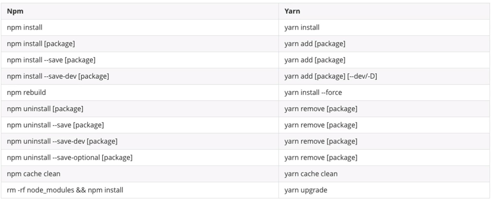
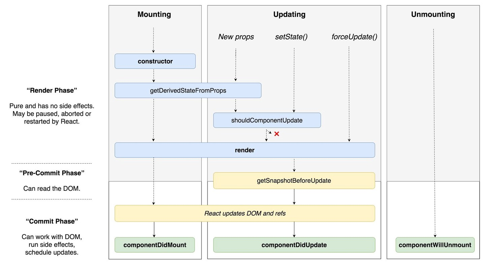
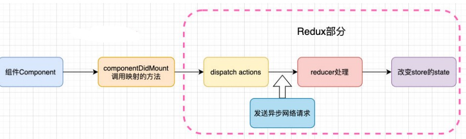

# React（一）

react是一个构建用户界面的JavaScript库

## 一、初识react

### 1.1 基本了解

**1、开发react依赖三个库**

+ react：包含react所必须的核心代码
+ react-dom：react渲染在不同平台所需要的的核心代码
+ babel：将jsx转换成React代码的工具


**2、react和babel的关系**

默认情况下开发React其实可以不使用babel，但前提是我们自己使用React.createElement来编写源代码，但是它编写的代码非常的繁琐、可读性差。

那么就可以直接编写jsx（JavaScript XML）的语法，并且使用babel转换成React.createElement


**3、引入react依赖**

1、方式一：直接CDN

```js
<script src="https://unpkg.com/react@16/umd/react.development.js" crossorigin></script>
<script src="https://unpkg.com/react-dom@16/umd/react-dom.development.js" crossorigin></script>
<script src="https://unpkg.com/babel-standalone@6/babel.min.js"></script>
```

2、方式二：下载到本地，引用本地依赖

3、方式三：通过npm管理


**4、基本使用**

```html
  <div id="app"></div>
  <script src="https://unpkg.com/react@16/umd/react.development.js" crossorigin></script>
  <script src="https://unpkg.com/react-dom@16/umd/react-dom.development.js" crossorigin></script>
  <script src="https://unpkg.com/babel-standalone@6/babel.min.js"></script>

  <script type="text/babel">
    ReactDOM.render(<h2>hello world</h2>, document.getElementById("app"))
  </script>
```

注：给`script`增加`type = "text/babel"`，其中的jsx代码才能够被解析。


### 1.2 简单案例

点击按钮，改变文字

```jsx
<div id="app"></div>
<script type="text/babel">
	let message = "hello world"
	function btnClick() {
		message = "hello react"
	}
	ReactDOM.render(
	<div>
    	<h2>{message}</h2> 
            <button onClick={btnClick}>change</button>
    </div>,
    document.getElementById("app"))
</script>

<!-- 注意跟vue的区别-->
```

上面的代码看起来没什么问题，但是其实是运行不成功的

因为点击button时，div根标签中的内容不会重新渲染一遍

```jsx
<!-- 正确做法 -->
<div id="app"></div>
<script type="text/babel">
	let message = "hello world"
	function btnClick() {
		message = "hello react"
		render()
	}
	function render() {
	ReactDOM.render(
        <div>
            <h2>{message}</h2> 
            <button onClick={btnClick}>change</button>
        </div>,
    document.getElementById("app"))
	}
	render()
</script>
```

将其放进一个函数中，点击按钮时重新执行一遍


### 1.3 组件化改进案例

可以发现，上方的代码逻辑十分的混乱。可以将其中的一些逻辑抽离出来形成一个组件

```jsx
<script type="text/babel">
//封装组件
  class App extends React.Component {
    constructor() {
        super()
        this.state = {
            message: "hello world"
        }
    }
    render() {
        return (
        	<div>
            	<h2>{this.state.message}</h2>
            	<button onClick={this.btnClick.bind(this)}>改变文本</button>
            </div>
        )
    }
    btnClick() {
    this.setState({
        message: "hello React"
      })
    }
}

//渲染组件
ReactDOM.render(<App/>, document.getElementById("app"))
</script>
```


**电影列表案例**

```jsx
  <script type="text/babel">
    class App extends React.Component {
      constructor() {
        super()
        this.state = {
          movies: ["哈利波特","指环王","楚门的世界","霸王别姬"]
        }
      }
      render() {
        return (
          <div>
            <h2>电影列表展示</h2>
            <ul>
              {this.state.movies.map((item) => {
                return <li>{item}</li>
              })}
            </ul>  
          </div>
        )
      }
    }
    ReactDOM.render(<App/>, document.getElementById("app"))
  </script>
```

**计数器案例**

```jsx
  <script type="text/babel">
    class App extends React.Component {
      constructor() {
        super()
        this.state = {
          counter: 0
        }
      }
      render() {
        return (
          <div>
            <h2>当前计数：{this.state.counter}</h2>  
            <button onClick={this.increment.bind(this)}>+1</button>
            <button onClick={this.decrement.bind(this)}>-1</button>
          </div>
        )
      }
      increment() {
        this.setState({
          counter: this.state.counter + 1
        })
      }
      decrement() {
        this.setState({
          counter: this.state.counter -1
        })
      }
    }
    ReactDOM.render(<App/>, document.getElementById("app"))
  </script>
```

## 二、JSX

### 2.1 基本概念

JSX是一种JavaScript的语法拓展，在很多地方称之为JavaScript XML。它用于描述我们的UI界面，并且可以和JavaScript融合在一起使用。

```jsx
//js与html融合在一起
const element = <div>hello world</div>
```

上边的语法就是JSX，只不过在浏览器直接输入这个内容浏览器是解析不了的，正确的规范应该如下

```jsx
<script src="https://unpkg.com/babel-standalone@6/babel.min.js"></script>
<script type="text/babel">
	const element = <div>hello world</div>    
</script>
```


**JSX书写规范**

1、顶层只能有一个根元素

2、通常在JSX外层包括一个小括号，方便阅读并且可以进行换行

3、JSX中可以使用单标签，但是必须使用/结尾


**JSX注释**

````jsx
const element = 
      <div>
      		{/*我是注释*/}
          <P>content</P>
      </div>
````


### 2.2 JSX嵌入数据

1、字符串、数值、数组在JSX中能够正常显示

```jsx
    class App extends React.Component {
      constructor() {
        super()
        this.state = {
          //正常显示
          str: "hello",
          num: 123,
          arr: [5,2,0],
        }
      }
      render() {
        return (
          <div>
            <p>{this.state.str}</p>
            <p>{this.state.num}</p>
            <p>{this.state.arr}</p>
          </div>
        )
      }
    }
```


2、布尔值、null、undefined在JSX中显示不了

```jsx
        this.state = {
          //不能正常显示
          name: null,
          age: undefined,
          isflat: true
        }
```

这样子有个好处

```jsx
{/*当flag为false时，页面不会展示null。提高了体验*/}
<p>{this.state.flag? "hello" : null}</p>
```

如果真想让他们显示出来，可以将他们转换成字符串

```jsx
          <div>
            <p>{this.state.name + ""}</p>
            <p>{this.state.age + ""}</p>
            <p>{this.state.isflat.toString()}</p>
          </div>
```

3、对象类型不能作为子元素

```jsx
        this.state = {
          //报错
            obj: {
                name: 'linming',
                age: 12
            }
        }

		<p>{this.state.obj}</p>
```

上面的代码直接报错


4、嵌入表达式

```jsx
  <script type="text/babel">
    class App extends React.Component {
      constructor() {
        super()
        this.state = {
          firstName: 'lin',
          lastName: 'ming',
          isLogin: true
        }
      }
      render() {
        const { firstName, lastName, isLogin } = this.state
        return (
          <div>
            {/*1.运算表达式*/}
            <p>{ firstName + " " + lastName }</p>

            {/*2.三元运算符*/}
            <p>{ isLogin? "欢迎~" : "请先登录~"}</p>

            {/*3.进行函数调用*/}
            <p>{this.getName()}</p>
          </div>
        )
      }
      getName() {
        return this.state.firstName + " " + this.state.lastName
      }
    }
    ReactDOM.render(<App/>, document.getElementById('app'))
  </script>
```


### 2.3 JSX绑定属性

1、绑定标签的title属性和img的src属性

```jsx
  <script type="text/babel">
    class App extends React.Component {
      constructor() {
        super()
        this.state = {
          title: "something",
          imgUrl: "https://p3.music.126.net/UU1PbEAJgUd-NXw0DDEevw==/109951166611866092.jpg?param=100y100"
        }
      }

      render() {
        const { title, imgUrl } = this.state 
        return(
          <div>
            <h2 title={title}>标题</h2>
            
          </div>
        )
      }
    }
    ReactDOM.render(<App/>, document.querySelector("#app"))
  </script>
```


2、绑定class属性和for属性要特别注意

因为JSX是一种融合了js与html的语法，所以在其中使用class、for属性时，相当于占用了关键字，代码会发出警告。

正确做法：`class --> className`、 `for --> htmlFor`

```jsx
      render() {
        const { title, imgUrl } = this.state 
        return(
          <div>
            <h2 className="box">something</h2>
            <label htmlFor="ab"></label>
          </div>
        )
      }
```

也可以动态绑定class

```jsx
      render() {
        const { title, active } = this.state 
        return(
          <div>
            <p className="box1 title">标题</p>
            <p className={"box title " + (active ? "active" : "") }></p>
          </div>
        )
      }
```

注：可以安装classnames这个库，使用起来更加方便

3、绑定style

```jsx
      render() {
        return(
          <div>
            <div style={{color: "red", fontSize: "40px"}}>content</div>
          </div>
        )
      }
```


### 2.4 JSX绑定事件

```jsx
class App extends React.Component {
    constructor() {
        super()
    }
    render() {
        return (
            <div>
                <button onClick={this.btnClick}>按钮</button>
            </div>
        )
    }
    btnClick() {
        console.log("发生了点击")
    }
}
```

**事件处理程序中的this**

如果事件处理函数`btnClick`中打印this，this指向谁呢？

```js
btnClcik() {
    console.log(this)
}
//输出：undefined
```

这是因为react内部是这样调用的`btnClick.call(undefined)`


怎么让this指向正确的对象？

方式一：显示绑定

```jsx
    class App extends React.Component {
      constructor() {
        super()
      }
      render() {
        {/*利用了render中可以正确打印this*/}
        console.log(this); 
        return (
          <div>
            <button onClick={this.btnClick.bind(this)}>按钮</button>
          </div>
        )
      }
      btnClick() {
        console.log("发生了点击", this)
      }
    }
```

方式二：使用箭头函数

```jsx
    class App extends React.Component {
      constructor() {
        super()
      }
      render() {
        return (
          <div>
            <button onClick={this.increment}>+1</button>
          </div>
        )
      }
      increment = () => {
        console.log(this);
      }
    }
```

因为箭头函数本身没有this，当在一个函数中访问时，js会沿着作用域链找到this。而上层this指向App实例

方式三：事件绑定中，传入箭头函数

```js
    class App extends React.Component {
      constructor() {
        super()
      }
      render() {
        return (
          <div>
            <button onClick={() => { this.decrement() }}>-1</button>
          </div>
        )
      }
      decrement() {
        console.log(this);
      }
    }
```


**绑定事件，并传递参数**

```jsx
    class App extends React.Component {
      constructor() {
        super()
        this.state = {
          movies: ["哈利波特", "怦然心动", "魔戒", "楚门的世界"]
        }
      }
      render() {
        const { movies } = this.state
        return (
          <ul>
            {
              movies.map((value, index) => {
                return <li onClick={(event) => { this.isClick(value, index, event) }}>{value}</li>
              })
            }
          </ul>
        )
      }
      isClick(name, index, event) {
        console.log("点击了：" + index + name, event);
      }
    }
    ReactDOM.render(<App/>, document.getElementById('app'))
```


### 2.5 JSX条件渲染

**1、if判断的方式**

```jsx
    class App extends React.Component {
      constructor() {
        super()
        this.state = {
          isLogin: true
        }
      }
      render() {
        let message = null
        const { isLogin } = this.state
        if(isLogin) {
          message = <h3>"欢迎回来~"</h3>
        } else {
          message = <h3>"请先登录~"</h3>
        }
        return(
          <div>
            { message }
          </div>
        )
      }
    }
```

**2、三元运算**

```jsx
<button>{isLogin? "退出" : "登录"}</button>
```

或者，当处于登录状态时，显示某些内容

```jsx
<h2>{ isLogin? "hello world" : null }</h2>

{/*可以更加简洁*/}
<h2>{ isLogin && "hello world" }</h2>
```


**3、实现v-show效果**

上边的条件渲染都是类似于vue中的v-if，即都是通过DOM来控制渲染。

我们也可以在react中实现自己的v-show

```jsx
<div>
    <button onClick={() => { this.loginClick() }}>{isLogin? "退出" : "登录"}</button>
    <div style={{ display: (isLogin? "block" : "none") }}>hello world</div>
</div>
```


### 2.6 JSX的本质

实际上，`JSX`仅仅只是`React.createElement(component, props, ...children)`函数的语法糖。

最终的`JSX`都会被转换成`React.createElement`的函数调用

```jsx
<script src="https://unpkg.com/babel-standalone@6/babel.min.js"></script>
<script type="text/babel">
    const message1 = <h2>hello react</h2>
    const message2 = React.createElement("h2", null, "hello react")

    ReactDOM.render(message2, document.getElementById("app"))
</script>
```

在上方的代码中，message1与message2可以说是相等的

前面提到，引入babel是用来解析jsx的，但是上方的代码并没有用到jsx，所以可以改成这样子

```jsx
<script>
    const message2 = React.createElement("h2", null, "hello react")
    ReactDOM.render(message2, document.getElementById("app"))
</script>
```

依然是能够正常运行的


**createElement的三个参数**

参数一：type

当前的ReactElement的类型。如果是标签元素，那么就使用字符串表示；如果是组件元素，那么就直接使用组件的名称

参数二：config

所有的jsx中的属性都在config中以对象的属性和值的形式存储

参数三：children

存放标签中的内容（可能是文本或者新的标签），以children数组的方式进行存储


**babel转化**

将我们编写的JSX代码通过Babel可以转换成`React.createElement`函数

```jsx
//JSX代码
<div>
    <h2 className="title">title</h2>
    <div>content</div>
    <div>footer</div>x
</div>
```

转化

```js
/*#__PURE__*/
React.createElement(
  "div",
  null,
  /*#__PURE__*/ React.createElement(
    "h2",
    {
      className: "title"
    },
    "title"
  ),
  /*#__PURE__*/ React.createElement("div", null, "content"),
  /*#__PURE__*/ React.createElement("div", null, "footer")
);	
```


**虚拟DOM**

我们通过上方的`React.createElement`最终创建出来的就是一个`ReactElement`对象，而它就是所谓的虚拟DOM

验证	

```jsx
      render() {
        const CreateElement = (
          <div>
              <h2 className="title">title</h2>
              <div>content</div>
              <div>footer</div>
            </div>
        )
        console.log(CreateElement);
        return CreateElement
        }
```

输出：

```js
//一个OBJECT对象
{$$typeof: Symbol(react.element), type: 'div', key: null, ref: null, props: {…}, …}
```


**总结**

我们来梳理整个过程：

```js
JSX --> createElment函数 --> ReactElement(虚拟DOM树) --> ReactDOM.render --> 真实DOM
```


## 三、react脚手架

安装脚手架： `npm install create-react-app -g`


### 3.1 yarn

react的包管理工具是yarn

```shell
npm install yarn -g
```




### 3.2 创建项目

```js
//创建 
create-react-app 项目名称
```

注：项目名称不能大写

```js
//运行项目
yarn start
```


**项目结构说明**

| 文件名              | 说明                                                         |
| ------------------- | ------------------------------------------------------------ |
| yarn.lock           | 该文件与`package.json.lock`的职能相同，记录了项目中实际的版本依赖 |
| favicon.icn         | 图标，显示在浏览器的项目标题处                               |
| robots.txt          | 指定搜索引擎可以或者无法爬取哪些文件                         |
| App.css与App.js     | App组件的代码文件和相关样式                                  |
| App.test.js         | App组件的测试代码文件                                        |
| index.css与index.js | 全局的样式文件与整个程序的入口文件                           |
| setupTests.js       | 测试初始化文件                                               |
| manifest.json       | 和web app配置相关                                            |
| serviceWorker.js    | 默认帮助我们写好的注册Pwa相关的代码                          |


`manifest.json`与`serviceWorker.js`两个文件是帮助我们在开发web App时，提供一些配置

（所以删除这两个文件，对于web端开发没有什么影响）

**概念理解：PWA**

PWA全称`Progressive Web App`，即渐进式WEB应用。

一个PWA应用首先是一个网页，我们可以通过web技术编写出一个网页应用，随后加上App Manifest和Service Worker来实现PWA的安装和离线等功能，这种Web存在的形式，称之为Web App


Pwa解决了哪些问题？

1、可以添加至主屏幕，点击主屏幕图标可以实现启动动画以及隐藏地址栏

2、实现离线缓存功能，即使用户手机没有网络，依然可以使用一些离线功能

3、实现了消息推送等等类似于Native App相关的功能


### 3.3 基本使用


为了更好地理解react脚手架，我们可以将src下的所有文件都删除，public文件夹下也只保留index.html与图标

安装一个HTML智能填写的插件：htmltagwrag

**1、配置index.js**

注：代码最终是挂载到`<div id="root"></div>`上

```jsx
//index.js
const React = require('react')
const ReactDOM = require('react-dom')

ReactDOM.render(<h2>hello React</h2>, document.getElementById('root'))
```

最终效果是h2被挂载到页面上


将jsx代码抽取到一个类中

```jsx
import React from 'react'
import ReactDOM from 'react-dom'

class App extends React.Component {
  constructor() {
    super()
    this.state = {}
  }
  render() {
    return (
      <div>
        <h2>hello React</h2>
      </div>
    )
  }
}
ReactDOM.render(<App/>, document.getElementById('root'))
```


这样做有一个很大的好处，可以将类抽离出去再导入

```jsx
//App.js
import React from "react"
export default class App extends React.Component {
  constructor() {
    super()
    this.state = {}
  }
  render() {
    return (
      <div>
        <h2>hello React</h2>
      </div>
    )
  }
}

//index.js
import React from 'react'
import ReactDOM from 'react-dom'
import App from './App'


ReactDOM.render(<App/>, document.getElementById('root'))
```


## 四、组件化开发

> 小技巧: 
>
> vscode中,通过alt + shift + f ，可以实现对代码的格式化
>
> 生成react代码片段插件： ES7 React/Redux/GraphQL/React-Native snippets
>

### 4.1 类组件与函数组件

根据组件的定义方式，可以分为：**函数组件**和**类组件**

类组件的定义**要求**：

1、组件的名称以大写字符开头

注：如果小写会被当做html的标签，如`<div>`默认是标签，`<Div>`会默认为一个组件

2、类组件需要继承自`React.Component`

3、类组件必须实现render函数


使用**class定义**一个组件： 

1、constructor是可选的，我们通常在constructor中初始化一些数据； 

2、this.state中维护的就是我们组件内部的数据； 

3、render() 方法是 class 组件中唯一必须实现的方法；


```jsx
//类组件
export default class App extends React.Component {
  constructor() {
    super();
  }
  render() {
    return (
        <div>hello react</div>
    );
  }
}
```

```jsx
//函数组件
export default function App() {
  return (
    <div>hello React</div>
  )
}
```

函数式组件的特点：

1、没有this

2、没有内部状态


### 4.2 render返回值

当render函数被调用时，它会检查this.props和this.state的变化并返回以下类型之一：

1、react元素（通常就是JSX）

2、数组或者fragments（使得render方法可以返回多个元素）

3、Portals（可以渲染子节点到不同的DOM子树中）

4、字符串或者数值类型（他们在DOM中会被渲染为文本节点）

5、布尔类型或null（什么都不会渲染）


### 4.3 生命周期

React组件有自己的生命周期，了解组件的生命周期可以让我们在最合适的地方完成自己想要的功能

一般React生命周期，主要是指类的生命周期，因为函数式组件是没有生命周期函数的

1、componentDidMount函数：组件已经挂载到DOM上时，就会回调

2、componentDidUpdate函数：组件已经发生了更新时，就会回调

3、componentWillUnmount函数：组件即将移除时，就会回调




**挂载阶段**

挂载阶段会按如下顺序执行

```jsx
import React, { Component } from 'react'

export default class App extends Component {
  constructor() {
    super()
    console.log("1、执行了constructor方法");
  }
  render() {
    console.log("2、执行了render函数");
    return (
      <div>
        
      </div>
    )
  }

  componentDidMount() {
    console.log("3、执行了componentDidMount方法");
  }
}

//输出：
//1、执行了constructor方法
//2、执行了render函数
//3、执行了componentDidMount方法
```


**更新阶段**

数据发生变化时（更新），重新执行render函数，以及生命周期函数componentDidUpdate

```jsx
export default class App extends Component {
  constructor() {
    super()
    this.state = {
      counter: 0
    }
  }
  render() {
    console.log("1、更新时，重新执行render函数");
    return (
      <div>
        <h2>当前计数：{ this.state.counter }</h2>
        <button onClick={ e => this.increment() }>+1</button>
      </div>
    );
  }
  increment() {
    this.setState({
      counter: this.state.counter + 1
    })
  }
  componentDidUpdate() {
    console.log("2、执行componentDidUpdate该回调函数~");
  }
}
//点击+1按钮，输出
//1、更新时，重新执行render函数
//2、执行componentDidUpdate该回调函数~
```


**卸载阶段**

```jsx
//子组件
class Cpn extends Component {
  render() {
    return <h2>我是Cpn组件</h2>;
  }
  componentWillUnmount() {
    console.log("组件即将卸载时回调");
  }
}

export default class App extends Component {
  constructor() {
    super();
    this.state = {
      isShow: false,
    };
  }
  render() {
    return (
      <div>
        {this.state.isShow && <Cpn></Cpn>}
        <button
          onClick={(e) => {
            this.changeIsShow();
          }}
        >
          change
        </button>
      </div>
    );
  }
  changeIsShow() {
    this.setState({
      isShow: !this.state.isShow,
    });
  }

}
```

当点击取消Cpn组件时，就会触发其上的componentWillUnmount组件


**汇总**

| 函数名称             | 说明                                                        | 适用                                        |
| -------------------- | ----------------------------------------------------------- | ------------------------------------------- |
| constructor          | 可选，如果不初始化state或不进行方法绑定，则不需要该构造函数 | 通过this.state赋值对象来初始化内部的state   |
| componentDidMount    | 组件挂载后立即调用                                          | 依赖于DOM的操作；发送网络请求；添加一些订阅 |
| componentDidUpdate   | 更新时立即调用，首次渲染时不执行该函数                      | 组件更新后，可对DOM进行操作；发送网络请求   |
| componentWillUnmount | 组件卸载以及销毁之前直接调用                                | 执行必要的清除操作                          |


### 4.4 组件间的通信

**父传子（类组件）**

```jsx
//子组件
class Cpn extends Component {
  constructor(props) {
    super()
    this.props = props
  }
  render() {
    const { name, age, address } = this.props
    return (
      <div>	
        { name + " " + age + " " + address }
      </div>
    )
  }
}

//父组件
export default class App extends Component {
  render() {
    return (
      <div>
       {/*传递参数*/}
        <Cpn name="linming" age="12" address="广东"/>
      </div>
    );
  }
}
```

甚至子组件的constructor函数可以不使用

```jsx
//子组件
class Cpn extends Component {
  render() {
    const { name, age, address } = this.props
    return (
      <div>
        { name + " " + age + " " + address }
      </div>
    )
  }
}
```


**父传子（函数组件）**

```jsx
//子组件
function ChildCnp (props) {
  const { name, age } = props
  return (
    <div>
      { name + " : " + age }
    </div>
  )
}

//父组件
export default class App extends Component {
  render() {
    return (
      <div>
        <ChildCnp name="linming" age="22"/>
      </div>
    );
  }
}
```


**父传子（类型检测）**

在react中，如果想要对父组件传递到子组件的中内容进行限制，需要导入`prop-types`这个库

通过子组件调用这个库，来对传入的值进行类型限制等操作

```js
ChildCnp.propTypes = {
  name: propTypes.string.isRequired, //name是字符串，必传
  age: propTypes.number,  //age是数值
  arr: propTypes.array //arr是数组
}
```

````jsx
import propTypes from "prop-types"
function ChildCnp (props) {
  const { name, age } = props
  const { arr } = props
  return (
    <div>
      { name + " : " + age }
      <ul>
      { 
        arr.map(item => {
          return <li>{ item }</li>
        })
      }
      </ul>
    </div>
  )
}
ChildCnp.propTypes = {
  name: propTypes.string.isRequired,
  age: propTypes.number,
  arr: propTypes.array
}

export default class App extends Component {
  render() {
    return (
      <div>
        <ChildCnp name="linming" age={ 22 } arr={[ '1', '2', '3', '4' ]}/>
      </div>
    );
  }
}
````


也可以定义默认值

```jsx
ChildCpn.defaultProps = {
    name: "linming",
    age: 22
}

//父组件
export default class App extends Component {
  render() {
    return (
      <div>
        <ChildCnp />
      </div>
    );
  }
}
```


**子传父**

子传父与vue的方式不同，react使用的的props来进行传递

我们来实现这么一个案例：在子组件中点击按钮，而在父组件中实现counter+1

```jsx
// 子组件
class ChildCpn extends Component {
  render() {
    const { increment } = this.props
    return (
      <div>
        <button onClick={increment}>+1</button>
      </div>
    )
  }
}

// 父组件
export default class App extends Component {
  constructor() {
    super()
    this.state = {
      counter: 0
    }
  }
  render() {
    return (
      <div>
        <h2>当前计数：{this.state.counter}</h2>
        <ChildCpn increment= { e => this.increment()}/>
      </div>
    )
  }
  increment() {
    this.setState({
      counter: this.state.counter + 1
    })
  }
}
```


### 4.5 实现插槽

在react中是没有插槽这个概念的，但其实是完全没有这个必要，因为插槽在react中实现起来比较地简单

**方式一（不推荐）**

使用一个具备插槽功能的组件，组件中的写入的内容会默认传递到组件中的`this.props.children`中

```jsx
<NavBar>
    <span>左边</span>
    <span>中间</span>
    <span>右边</span>
</NavBar>	
```

在插槽组件中将传递过来的内容填充到对应的位置

```jsx
export default class navBar extends Component {
  constructor(props) {
    super(props)
    this.state = {}
  } 
  render() {
    return(
      <div className="navBar">
        <div className="slotLeft">
          {this.props.children[0]}
        </div>
        <div className="slotCenter">
          {this.props.children[1]}
        </div>
        <div className="slotRight">
          {this.props.children[2]}
        </div>
      </div>
    )
  }
}
```


**方式二**

直接将`jsx`代码传递到具备插槽功能的组件中

```jsx
//使用
      <div>
        <NavBar2 slotLeft={<div>左边</div>}
                 slotCenter={<div>中间</div>}
                 slotRight={<div>右边</div>}/>
      </div>
```

从`this.props`中获取到传递过来的数据，并填充到对应的位置

```jsx
export default class navBar2 extends Component {
  render() {
    const { slotLeft, slotCenter, slotRight } = this.props
    return (
      <div className="navBar">
        <div className="slotLeft">
          {slotLeft}
        </div>
        <div className="slotCenter">
          {slotCenter}
        </div>
        <div className="slotRight">
          {slotRight}
        </div>
      </div>
    )
  }
}
```


### 4.6 跨组件通信

假设有三个组件：ABC，A是B的父组件，B是C的父组件，要怎么实现A向C传递数据呢

```jsx
//传统的方式：层层传递
export default class ComponentA extends Component {
  constructor(props) {
    super(props)
    this.state = {
      roleName: "李逍遥",
      level: 99
    }
  }
  render() {
    const { roleName, level } = this.state
    return (
      <div>
        <ComponentB roleName={roleName} level={level}/>
      </div>
    )
  }
}

function ComponentB(props) {
  return (
    <div>
      <ComponentC roleName={props.roleName} level={props.level}/>
      {/*也可以这样写*/}
      {/* <ComponentC {...props} /> */}
    </div>
  )
}

class ComponentC extends Component {
  render() {
    const { roleName, level } = this.props
    return (
      <div>
        <p>用户名：{ roleName }</p>
        <p>等级：{ level }</p>
      </div>
    )
  }
}
```


**Context**

Context提供了一种在组件之间共享此类值的方式，而不必显示地通过组件树逐层传递props，Context设计的目的就是为了共享那些对于一个组件树而言是“全局”的数据。

1、React.createContext

创建一个需要共享的Context对象：如果一个组件订阅了Context，那么这个组件会从离自身最近的那个匹配的Provider中读取到当前的context值。

defaultValue是组件在顶层查找过程中没有找到对应的Provider，那么就使用默认值

`const MyContext = React.createContext(defaultValue)`

2、Context.Provider

每个Context对象都会返回一个Provider React组件，它允许消费组件订阅context的变化：Provider接收一个value属性，传递给消费组件；一个Provider可以和多个消费组件有对应关系；多个Provider可以嵌套使用，里层的会覆盖外层的数据；当Provider的value值发生变化时，它内部的所有消费组件都会重新渲染。

`<MyContext.Provide value={/*某个值*/} >`


3、Class.contextType

挂载在class上的contextType属性会被重新赋值为一个由React.createContext()创建的Context对象：这能让你使用this.context来消费最近Context上的那个值；你可以在任何生命周期中访问到它，包括render函数中

`MyClass.contextType = MyContext`


使用过程

```jsx
//1. 创建context对象
const UserContext = React.createContext({
  roleName: "李逍遥", {/*默认值*/}
  level: 99
})

//2.1 UserContext中有一个Provider组件，将要传递过去内容的组件纳入其中
//2.2 在UserContext.Provider组件中放入想要传递的值value
//2.3 如果不设置value，那么将获取UserContext的默认值
export default class ComponentA extends Component {
  constructor(props) {
    super(props)
    this.state = {
        roleName: "李逍遥",
        level: 99
    }
}
  render() {
    return (
      <div>
        <UserContext.Provider value={ this.state }>
          <ComponentB/>
        </UserContext.Provider>
        
      </div>
    )
  }
}
```

在每一个类组件中都有一个属性context，默认是一个空对象。

`console.log(this.context)`

```jsx
//3 组件C的contextType属性设置为UserContext，这样this.context就不为空了
class ComponentC extends Component {
  render() {
    return (
      <div>
        <p>用户名：{this.context.roleName}</p>
        <p>等级：{this.context.level}</p>
      </div>
    )
  }
}
ComponentC.contextType = UserContext
```


在函数式组件中没有this.context，要怎么使用呢？

```jsx
//函数式组件中的用法
function ComponentC () {
  return (
    <UserContext.Consumer>
      {
        value => {
          return (
            <div>
              <h2>用户名称： {value.roleName}</h2>
              <h2>登记： {value.level}</h2>
            </div>
          )
        }
      }
    </UserContext.Consumer>
  )
}
```


### 4.7 事件总线

前面通过Context主要实现的数据的共享，但是在开发中如果有跨组件之间的事件传递，就需要用到事件总线。在react中使用比较多的是events来完成对应的操作

安装：`yarn add events`


event常用的API

1、创建EventEmitter对象：eventBus对象

2、发出事件：eventBus.emit（“事件名称”，参数列表）

3、监听事件：eventBus.addListener（“事件名称”，监听函数）

4、移除事件：eventBus.removeListener（“事件名称”，监听函数）


**案例：A组件与B组件进行事件传递**

```jsx
import  { EventEmitter } from 'events'

// 创建事件总线
const eventBus = new EventEmitter()

class CpnA extends PureComponent {
  render() {
    return (
      <div>
        A组件
        <button onClick={e => this.sendSomgthing()}>A按钮</button>
      </div>
    )
  }
  sendSomgthing() {
    eventBus.emit('something', "arg1", "arg2")
  }
}
class CpnB extends PureComponent {
  componentDidMount() {
    // 监听事件something，第二个参数对传递过来的内容进行处理
    eventBus.addListener('something', (...args)=> {
      console.log(args);
    })
  }
  render() {
    return (
      <div>
        B组件
      </div>
    )
  }
}
```

一般在`componentWillUnmount`生命周期中对这个事件进行卸载处理


### 4.8 ref

在react开发中，通常情况下不需要，也不建议直接操作DOM原生，但是某些特殊的情况确实需要取到DOM进行某些操作，这个时候就可以使用ref了

```jsx
export default class App extends PureComponent {
  constructor(props) {
    super(props)

    this.titleRef = createRef()
    this.titleEl = null
  }
  render() {
    return (
      <div>
        {/* 方式一：字符串 */}
        <div ref="divRef">hello react</div>
        {/* 方式二：对象 */}
        <div ref={this.titleRef}>hello react</div>
        {/* 方式三：回调函数 */}
        <div ref={arg => this.titleEl = arg}>hello react</div>
      </div>
    )
  }
  componentDidMount() {
    // 1.方式一：字符串（不推荐，已弃用）
    this.refs.divRef.innerHTML = "字符串形式"
    // 2.方式二：对象（官方推荐）
    this.titleRef.current.innerHTML = "对象形式"
    // 3.方式三：回调函数
    this.titleEl.innerHTML = "回调函数"
  }
}
```

ref属性不仅可以使用在html标签上，还能使用在类组件上。

但是如果要使用在函数式组件上，需要通过`React.forwordRef`


### 4.9 受控组件

实现了类似于vue中`v-model`功能的组件就是受控组件

```jsx
export default class App extends PureComponent {
  constructor(props) {
    super(props)

    this.state = {
      userName: ""
    }
  }
  render() {
    return (
      <div>
        <form>
          {/* 受控组件 */}
         用户名：<input type="text" onInput={ e => this.getMsg(e)} value={this.state.userName}/>
         <input type="submit" value="提交" onClick={ e => this.sendMsg(e)}/>
        </form>
      </div>
    )
  }
  sendMsg(event) {
    //阻止默认点击行为
    event.preventDefault()
    console.log(this.state.userName);
  }
  getMsg(event) {
    this.setState({
      userName: event.target.value
    })
  }
}
```


## 五、setState


### 5.1 基本认识

1、在react中，**不能直接修改state的值来让界面发生更新**

```jsx
{/*计数器案例*/}
  increment() {
    this.state.counter += 1
    console.log(this.state.counter);
  }
```

直接修改state中的值，实际修改成功了。但是react不能更新到界面上。

这种修改方式react并不知道数据发生了变化


2、setState方法是从Component中继承过来的


3、setState是异步更新的

```jsx
{/*改变文本案例*/}
  changeMsg() {
    this.setState({
      message: "你好，世界"
    })
    console.log(this.state.message);
  }
```

如果是同步状态的，那么控制台应该打印`你好，世界`，而实际上它仍然打印`hello world`。说明setState是异步的

**为什么setState要设计成异步的**

+ 可以提升性能。如果每次调用setState都进行一次更新，那么意味着render函数会被频繁调用，页面重新渲染，效率低。最好的办法是获取到多个更新，之后进行批量更新
+ 保持state和props一致，避免产生其他bug。同步更新了state，但是还未执行render函数时，state与props中的数据是不一致的


4、立即获取到setState更新后的数据

setState的第二个参数是一个回调函数，会等到数据发生更新后调用

类似于vue中的nexttick方法，即上方的案例中，message改变了，想要获取到更新后的值而非更新前的值

```jsx
{/*setState的第二个参数（回调函数）*/}
  changeMsg() {
    this.setState({
      message: "你好，世界"
    }, () => {
      console.log(this.state.message);
    })
  }
```

输出：`你好，世界`

另一个方式是通过生命周期函数：`componentDidUpdate()`


5、在某些特殊情况下，setState是同步的

情况一：定时器

```jsx
{/*使用定时器*/}
  changeMsg() {
    setTimeout(() => {
      this.setState({
        message: "你好世界"
      })
      console.log(this.state.message);
    }, 0);
  }
```

直接同步输出：`你好世界`


情况二：原生DOM事件


6、this.setState中更新了state，但是并不会覆盖掉整个state

```jsx
this.state = {
    message1: "hello world",
    message2: "hi react"
};
```

假设`setState`更新了message1，那么它最终仅仅只更新了message1，而不会返回一个新的对象覆盖掉原来的state

源码：`return Object.assign({}, preState, newState)`


7、在this.setState中多次调用相同的操作会被合并

```jsx
{/*调用了三次*/}
  increment() {
    this.setState({
      counter: this.state.counter + 1
    })
    this.setState({
      counter: this.state.counter + 1
    })
    this.setState({
      counter: this.state.counter + 1
    })
  }
```

最终结果并不会+3，而是简单地加1


### 5.2 不可变数据

**结论**：要保证state中复杂数据的不可变性，特别是处理深层嵌套数据时

在开发中，为了提升性能，经常会使用`shouldComponentUpdate`，或者`PureComponent`。这种情况下通过`setState`直接改变`state`中的复杂数据将会直接导致失效。

```jsx
export default class App extends Component {
  constructor(props) {
    super(props);
    this.state = {
      friends: [
        { name: 'lihua', age: 22 },
        { name: 'tom', age: 23 },
        { name: 'lucy', age: 20 }
      ]
    };
  }
  render() {
    return (
      <div>
        <h2>我的朋友</h2>
        <ul>
          {
            this.state.friends.map(item => {
              return <li key={item.name}>{ item.name }</li>
            })
          }
        </ul>
        <button onClick={ e => { this.addFriend() }}>增加</button>
      </div>
    );
  }
  addFriend() {
    const newFriend = { name: 'xiaoming', age: 23 }
    this.state.friends.push(newFriend)
    this.setState({
      friends: this.state.friends
    })
  }
}
```

上边的代码中往friends数组中新增一个对象。这样子的代码是能够正常运行的。但是一旦加了render的渲染优化，这个代码就失效了

```jsx
shouldComponentUpdate(newProps, newState) {
    if(newState.friends !== this.state.friends) return true
    return false
}
```

原因是：上边的判断是相等的。

为什么呢？明明已经新增一个对象到friends中了，竟然`newState.friends === this.state.friends`

**重点理解**：从内存的角度理解，friends保存的是数组的引用地址，即使之后friends新增了内容，this.state.firends保存的依然是数组的引用地址不变。

正确的处理方式：不要直接通过setState去修改this.state中的值

```jsx
{/*推荐做法*/}
const newFriends = [...this.state.friends]
newFriends.push({name: 'xiaoming', age: 23})
this.setState({
    friends: newFriends
})
```


## 六、性能优化

### 6.1 keys优化

在遍历列表时，总是会提示一个警告：需要添加一个key属性

添加key可以使代码的运行效率更高，有以下两种情况

情况一，在最后的位置插入数据。（这种情况下有无key的意义不大）

情况二，在前面插入数据。（没有key时，所有的元素都需要进行修改；有key时，react会使用key来匹配原有树上的子元素以及最新树上的子元素，匹配到的元素仅仅进行位移，不需要其他的修改）


注意事项：

1、可以应该是唯一的。（尽量不使用index作为key，对性能并无优化）

2、key不要使用随机数，应该是固定的


### 6.2 渲染优化

分析一下的情况

```jsx
render() {
    return (
        <div>
            <h2>当前计数：{this.state.message}</h2>
            <button onClick={(e) => this.changeMsg()}>changeMsg</button>
            <OtherCpn />
        </div>
    );
}
```

上方的代码功能很简单，就是可以通过点击按钮修改文本内容。

默认情况下，我们只希望修改数据发生变化的内容。结果是点击按钮后，不仅仅当前的render函数整个重新执行了一次，包括`OtherCpn`组件中的render函数也整个重新渲染了。

这样子非常地消耗性能


**shouldComponentUpdate**

默认情况下，存在`shouldComponentUpdate(nextProps, nextState)`这么一个生命周期函数，其中返回值为true。表示不对组件中的内容渲染进行阻止（即调动render函数）

我们可以利用这一点来决定无关的内容不对其进行渲染

```jsx
shouldComponentUpdate(nextProps, nextState) {
    if(this.state.message !== nextState.message) {
        return true
    }

    return false
}
```

这有做有点不严谨，且不方便


**pureComponent**

所以在开发中，一般让一个类继承自`pureComponent`

`pureComponent`会检测props或者state中的数据是否发生了变化，来决定`shouldComponentUpdate`返回true或者false

```jsx
{/*使用方法*/}
import React, { PureComponent } from "react";
export default class App extends PureComponent { }
```


**memo**

那么函数式组件不能继承自`PureComponent`，要怎么实现这个功能呢？

```react
{/*使用memo*/}
import React, { memo } from "react";

const MemoOtherCpn = memo(function OtherCpn () {
  console.log("OtherCpn被调用了");
  return (
    <div>其他的组件</div>
  )
})
```

## 七、组件内容补充

### 7.1 高阶组件

高阶组件（HOC）：高阶组件是参数为组件，返回值为新组件的函数


案例：创建一个高阶组件，将App组件传递进去并返回新的组件挂载到root上

```jsx
function hightOrderComponent(WrapperComponent) {
  class NewComponent extends PureComponent {
    render() {
      return <WrapperComponent {...this.props}/>;
    }
  };
  //自由决定创建出来的组件名称
  NewComponent.displayName = "NewCpn"
  return NewComponent
}

const EnhanceComponent = hightOrderComponent(App)
export default EnhanceComponent
```

理解：高阶组件可以看做是对传入组件进行了拦截操作，再处理后的组件返回出去


**应用一**：增强props

在使用子组件时，统一在父组件为所有子组件增加新的props

```jsx
class Home extends PureComponent {
  render() {
    return(
      <div>Home：{`用户名：${this.props.roleName} 等级：${this.props.level}`}</div>
    )
  }
}
class About extends PureComponent {
  render() {
    return(
      <div>About: {`用户名：${this.props.roleName} 等级：${this.props.level}`}</div>
    ) 
  }
}

//需求，统一为Home、About增加新的属性level
function enhanceProps(Cpn,num) {
  return function(props) {
    return <Cpn {...props} level={num}/>
  }
}

const NewHome = enhanceProps(Home, 88)
const NewAbout = enhanceProps(About, 99)

export default class App extends PureComponent {
  render() {
    return (
      <div>
        <NewHome roleName="李逍遥1" />
        <NewAbout roleName="李逍遥2"/>
      </div>
    )
  }
}
```


### 7.2 fragment

fragment类似于vue中的template，可以用来代替外层的div标签，并且不会渲染到页面上

```jsx
// jsx代码
    return (
      <div>
        <h2>hello</h2>
      </div>
    )
```


```html
<div id="root">
    <div>
        <h2>hello</h2>
    </div>
</div>
```

可以看到h2外部包裹的div标签是多余的，如果在编写jsx代码时，采用fragment标签就不会有

```jsx
    return (
      <Fragment>
        <h2>hello</h2>
      </Fragment>
    )
```

语法糖

```jsx
<></>
{/*这种写法比较简洁，但是不能添加任何属性*/}
```


### 7.3 StrictMode

StrictMode是一个用来突出显示应用程序中潜在问题的工具，相当于react的严格模式

特点：不会渲染任何可见的UI，为其后代元素触发额外的检查和警告，仅在开发模式下运行不会影响生产构建


**开启StrictMode**

1、默认创建的脚手架，就是会自动开启严格模式的

```jsx
ReactDOM.render(
  <React.StrictMode>
    <App />
  </React.StrictMode>,
  document.getElementById('root')
);
```

2、也可以为部分组件开启严格模式检查

```jsx
{/*为ComponentA开启严格模式*/}
<div>
	<React.StrictMode>
    	<ComponentA />
    </React.StrictMode>
    <ComponentB />
</div>
```


**检测内容**

1、识别不安全的生命周期（如已弃用、将要弃用的）

2、使用过时的ref API

3、使用废弃的findDOMNode方法

4、检查意外的副作用（如一个组件的constructor被调用了两次）

5、检测过时的context API


## 八、react的CSS

在react中，并没有统一的css编写规定

### 8.1 内联样式

内联样式是官方推荐的一种css样式的写法

优点：

1、样式之间不会有冲突

2、可以实现动态设置

缺点:

1、需要使用驼峰标识

2、某些样式没有提示

3、如果需要写大量样式，代码看起来十分混乱

4、某些样式无法编写（伪类、伪元素）

```jsx
export default class App extends PureComponent {
  constructor(props) {
    super(props)
    this.state = {
      pColor: 'blue'
    }
  }
  render() {
    const pStyle = {
      color: this.state.pColor,
      textDecoration: 'underline'
    }
    return (
      <div>
        <h2 style={{color: 'red', fontSize: '40px'}}>Hello World</h2>
        <p style={pStyle}>Hi React</p>
      </div>
    )
  }
}
```

### 8.2 普通的css

该方式就是简单地为每一个组件单独创建一个css文件，要引入其中。

这种编写方式和普通的网页开发中编写方式是一致的。

缺点：及其容易造成组件之间的样式相互污染


### 8.3 css modules

css modules不是react特有的解决方案，而是所有使用了类似于webpack配置的环境都可以使用。

**使用步骤：**

1、react脚手架已经内置了css modules的配置，直接编写对应组件的`style.module.css`

2、在组件中引入该样式文件`import style from './style.module.css'`

3、在需要相关样式的标签上通过类名使用`<p className={style.PStyle}></p>`

**缺陷**

1、引用的类名不能使用连接符（需要切换成驼峰）

2、比较麻烦，所有样式都需要通过`style.className`的形式来编写

3、不方便动态修改某些样式


**案例**

```jsx
//组件
import AppStyle from './style.module.css'
export default class App extends PureComponent {
  render() {
    return (
      <div>
        <h2 className={AppStyle.title}>CSS modules的方式</h2>
        <p className={AppStyle.content}>该方式比较地流行</p>
      </div>
    )
  }
}
```

```css
/*style.module.css*/
.title {
  color: brown;
  font-size: 30px;
}

.content {
  color: #aaa;
}
```


React 脚手架搭建出来的项目，只有 `.module.css` 支持模块化。

 实际上 CSS Modules 推荐的命名是驼峰式，这样可以直接通过`style.className`访问到，如果是使用连接符的类名就需要改为如下形式

```jsx
import styles from './App.module.css';

// ...
<header className={styles['App-header']}></header>
```

默认情况下，我们添加的类名会根据特定的规则（可以修改）生成相应的类名

```jsx
//如上header会被渲染为
<header class='App-App-header-XMDSK'></header>
```


全局作用域`:global`，在css modules中也可以像使用普通的`.css`文件一样使用类名，直接添加样式

```css
:global(.className) {
  color: #61dafb;
}
```


class组合，一个选择器可以继承另外一个选择器的规则

```css
.font-red {
  color: red;
}

.App-header {
  composes: font-red;
}
```

甚至可以继承其他`module.css`文件的样式

```css
/*another.module.css*/
.font-blue {
  color: blue;
}

/*App.module.css*/
.App-header {
  composes: font-blue from './another.module.css';
}
```


### 8.4 CSS in JS

`css in js`是指一种模式，其中CSS由JavaScript生成而不是在外部文件中定义

JSX就是将html写到了js中，而`css in js`就是CSS样式写入到js中。

`css in js`通过JavaScript来为css赋予一些能力，包括类似于css预处理器一样的样式嵌套、函数定义、逻辑复用、动态修改状态等等。目前比较流行的`css in js `库是**styled-components**

安装：`yarn add styled-components`


**标签模板字符串**

在正式使用`css in js`前，我们有必要对标签模板字符串的相关知识点进行补充。

正常来讲，我们一般通过`FnName()`的方式来调用函数，但是其实也可以通过模板字符串来调用

```js
function test(...args) {
    console.log(args)
}
test`aaaa`
//输出：['aaaa']
```

标签模板字符串传入的参数有一定的规律

```js
const name = 'lin'
const age = 23
test`my name is ${name}, age is ${age}`;
//输出：[["my name is", ", age is ", ""], "lin", "23"]
```

可以发现其中字符串部分被${}分割成三部分传进一个数组中，做为结果的第一个元素，${name}，${age}作为数组的第二、第三个元素


**使用步骤**

为了在`css in js`有css的智能提示，可以安装vscode的插件`vscode-styled-components`

1、基本使用

```jsx
import styled from 'styled-components'

const StyleWrapper = styled.div`
  font-size: 30px;
  color: red;
`
export default class App extends PureComponent {
  render() {
    return (
      <StyleWrapper>
        <h2>i an title</h2>
        <p>content</p>
      </StyleWrapper>
    )
  }
}
```

可以创建多个`css in js`附带样式的组件替换调用需要使用样式的组件，不过一般在外层结构中使用一个就可以了

2、选择内部的样式，并给其添加对应样式

```jsx
const StyleWrapper = styled.div`
  font-size: 30px;
  color: red;
  .content {
    background-color: blue;
  }
`
return (
    <StyleWrapper>
        <h2>i an title</h2>
        <p className="content">content</p>
    </StyleWrapper>
)
```


3、也可以使用伪类和伪元素

为class值为content的标签添加伪类hover，伪元素：：after

```jsx
const StyleWrapper = styled.div`
  font-size: 30px;
  color: red;
  .content {
    background-color: blue;
    &:hover{
      font-size:50px
    }
    &::after {
      content: "新增内容"
    }
  }
`
```


4、穿透props

是否能够给带了样式的组件也添加上其他属性呢？比如`input`被替换成样式组件后，能够为其添加type属性

方式一：直接添加

```jsx
const StyleInput = styled.input`
  background-color: yellowgreen;
`
<div>
	输入框：<StyleInput type="password"></StyleInput>      
</div>
```

方式二：添加到attribute属性中

用法：`styled.input.attrs`返回一个函数，所以可以实现链式调用

```jsx
const StyleInput = styled.input.attrs({
    type: "password",
    placeholder: "linming"
})
```

也可以将样式定义在attrs中

```jsx
const StyleInput = styled.input.attrs({
    bgColor: "red"
})`
	background-color: ${props => props.bgColor}
`
```

也可以使用state中定义的属性

```jsx
const StyleInput = styled.input`
  padding: ${props => props.pd};
`

export default class App extends PureComponent {
  constructor(props) {
    super(props)
    this.state = {
      pd: "50px"
    }
  }
  render() {
    return (
      <div>
        输入框：<StyleInput pd={this.state.pd}></StyleInput>
      </div>
    )
  }
}
```


5、实现样式继承

假设要定义两个按钮样式组件，其中存在大量相同的代码

```jsx
const Btn1 = styled.button`
  padding: 10px 20px;
  background-color: blanchedalmond;
`
const Btn2 = styled.button`
  padding: 10px 20px;
  background-color: blanchedalmond;
  border:none;
`
```

这样子写太繁琐，就可以通过继承的方式

```jsx
{/*Btn2继承自Btn1*/}
const Btn2 = styled(Btn1)`
  border: none;
`
```


6、实现样式共享

在外层的样式组件中添加的样式，可以被共享到里层样式组件的attrs上


## 九、AntDesign

### 9.1 基本认识

AntDesign ，简称 antd 是基于 Ant Design 设计体系的 React UI 组件库，主要用于研发企业级中后台产品。

AntDesign的**特点**： 

1、提炼自企业级中后台产品的交互语言和视觉风格。 

2、开箱即用的高质量 React 组件。 

3、使用 TypeScript 开发，提供完整的类型定义文件。 

4、全链路开发和设计工具体系。 

5、数十个国际化语言支持。 

6、深入每个细节的主题定制能力。


**安装**

安装库：`npm install antd`或`yarn add antd`

安装icon图标：` npm install --save @ant-design/icons `


### 9.2 基本使用

```jsx
import 'antd/dist/antd.css';
import { Button } from 'antd';  //按需引入

import React, { PureComponent } from 'react'
import 'antd/dist/antd.css';
import { Button } from 'antd'; 

export default class App extends PureComponent {
  render() {
    return (
      <>
      <Button type="primary">Primary Button</Button>
      <Button>Default Button</Button>
      <Button type="dashed">Dashed Button</Button>
      <br />
      <Button type="text">Text Button</Button>
      <Button type="link">Link Button</Button>
    </>
    )
  }
}
```


### 9.3 自定义主题

 我们需要对 create-react-app 的默认配置进行自定义，这里我们使用 [craco](https://github.com/gsoft-inc/craco) 

第一步：安装：` yarn add @craco/craco `

第二步：修改script脚本命令

```js
  "scripts": {
    "start": "craco start",
    "build": "craco build",
    "test": "craco test",
    "eject": "react-scripts eject"
  },
```


第三步：在根目录下创建craco.config.js文件用于修改默认配置

```js
onst CracoLessPlugin = require('craco-less');

module.exports = {
  plugins: [
    {
      plugin: CracoLessPlugin,
      options: {
        lessLoaderOptions: {
          lessOptions: {
            modifyVars: { '@primary-color': '#1DA57A' },
            javascriptEnabled: true,
          },
        },
      },
    },
  ],
};
```


第四步：按照 配置主题 的要求，自定义主题需要用到类似 less-loader 提供的 less 变量覆盖功能

安装：`yarn add craco-less`


第五步：引入antd的样式时，引入antd.less文件

`import 'antd/dist/antd.less';`，原先的`import 'antd/dist/antd.less';`可以注释掉


第六步：重启整个项目


## 十、react动画

### 10.1 基本认识

是React社区为我们提供了react-transition-group用来完成过渡动画

安装`yarn add react-transition-group`


react-transition-group主要包含四个组件： 

**1、Transition** 

该组件是一个和平台无关的组件（不一定要结合CSS），在前端开发中，我们一般是结合CSS来完成样式，所以比较常用的是CSSTransition

**2、CSSTransition** 

通常使用CSSTransition来完成过渡动画效果 

**3、SwitchTransition** 

两个组件显示和隐藏切换时，使用该组件 

**4、TransitionGroup** 

将多个动画组件包裹在其中，一般用于列表中元素的动画


### 10.2 CSSTransition

CSSTransition是基于Transition组件构建的： 

**有三个状态**：appear、enter、exit ，需要定义对应的CSS样式： 

1、第一类，开始状态：对于的类是-appear、-enter、exit

2、第二类：执行动画：对应的类是-appear-active、-enter-active、-exit-active

3、第三类：执行结束：对应的类是-appear-done、-enter-done、-exit-done


**CSSTransition常见对应的属性：** 

**1、in：触发进入或者退出状态** 

当in为true时，触发进入状态，会添加-enter、-enter-acitve的class开始执行动画，当动画执行结束后，会移除两个class， 

并且添加-enter-done的class

当in为false时，触发退出状态，会添加-exit、-exit-active的class开始执行动画，当动画执行结束后，会移除两个class，并 

且添加-enter-done的class

**2、classNames：动画class的名称** 

决定了在编写css时，对应的class名称：比如card-enter、card-enter-active、card-enter-done

**3、timeout** 

过渡动画的时间 

**4、appear** 

是否在初次进入添加动画（需要和in同时为true） ，unmountOnExit：退出后卸载组件 


CSSTransition对应的钩子函数：主要为了检测动画的执行过程，来完成一些JavaScript的操作 

A、onEnter：在进入动画之前被触发

B、onEntering：在应用进入动画时被触发

C、onEntered：在应用进入动画结束后被触发


**案例：实现显示隐藏的过渡效果**

```jsx
import React, { PureComponent } from "react";
import { CSSTransition } from "react-transition-group";
import 'antd/dist/antd.css';
import './CSSTransition.css'

import { Card, Avatar } from "antd";
import { EditOutlined, EllipsisOutlined, SettingOutlined } from "@ant-design/icons";
const { Meta } = Card;

export default class App extends PureComponent {
  constructor(props) {
    super(props);

    this.state = {
      isShow: true,
    };
  }
  render() {
    const { isShow } = this.state
    return (
      <div>
        <button onClick={e => {this.setState({isShow: !isShow})}}>显示/隐藏</button>
        <CSSTransition in={isShow}
                       classNames="card"
                       timeout={5000}>
          <Card
            style={{ width: 300 }}
            cover={}
            actions={[
              <SettingOutlined key="setting" />,
              <EditOutlined key="edit" />,
              <EllipsisOutlined key="ellipsis" />,
            ]}
          >
            <Meta
              avatar={<Avatar src="https://joeschmoe.io/api/v1/random" />}
              title="Card title"
              description="This is the description"
            />
          </Card>
        </CSSTransition>
      </div>
    );
  }
}


//CSSTransition.css
.card-enter{
  opacity: 0;
  transform: scale(.6);
}

.card-enter-active {
  opacity: 1;
  transform: scale(1);
  transition: opacity 1000ms, transform 1000ms;
}

.card-exit-active {
  opacity: 0;
  transform: scale(.6);
  transition: opacity 1000ms, transform 1000ms;
}
```


# React（二）

## 一、redux

### 1.1 基本认识

Redux是JavaScript的状态容器，提供了可供预测的状态管理。

它不仅可以和react一起使用，也可以和其他界面库（如vue）一起使用。并且其体积非常小（只有2kb）


**核心概念**

1、Store

数据需要统一保存在Store中

```js
const initialState = { friend: [ { name: "linming", age: 22 } ] }
```

2、action

所有的数据的变化，必须通过派发(dispatch)action来更新

```js
const action = { type: "ADD_FRIEND", info: { name: "lihua", age: 20 } }
```

3、reducer

reducer是一个纯函数，这个函数的做的事情就是将传入的state和action结合起来生成一个新的state


**三大原则**

1、单一数据源

整个应用程序的state被存储在一颗object tree中，并且这个object tree只存储在一个store中。单一的数据源可以让整个应用程序的state变得方便维护、追踪、修改

2、state是只读的

唯一修改state的方法一定是触发action，不能试图通过其他方式来修改state

3、使用纯函数来执行修改

通过reducer将旧state和actions联系在一起，并且返回一个新的state。所有的reducer都应该是纯函数，不能产生任何副作用


### 1.2 基本使用

安装：`yarn add redux`

简单的案例

```js
const redux = require("redux");

const initialState = {
  counter: 0,
};

// reducer
function reducer(state = initialState, action) {
  switch (action.type) {
    case "INCREMENT":
      return { ...state, counter: state.counter + 1 };
    case "DECREMENT":
      return { ...state, counter: state.counter - 1 };
    case "ADD_NUMBER":
      return { ...state, counter: state.counter + action.num };
    case "SUB_NUMBER":
      return { ...state, counter: state.counter - action.num };
    default:
      return state;
  }
}

// store(创建时需要传入一个reducer)
const store = redux.createStore(reducer);

//订阅store的修改
store.subscribe(() => {
  console.log("counter:", store.getState().counter);
});

// actions
const action1 = { type: "INCREMENT" };
const action2 = { type: "DECREMENT" };
const action3 = { type: "ADD_NUMBER", num: 5 };
const action4 = { type: "SUB_NUMBER", num: 12 };

// 派发action
store.dispatch(action1);
store.dispatch(action2);
store.dispatch(action3);
store.dispatch(action4);

//输出：
//counter: 1
//counter: 0
//counter: 5
//counter: -7
```


但是在真实的开发环境下，我们一般不会这么使用redux。而是会对其进行解构的抽离，使其解构更加地清晰

1、创建store文件夹，专门用来保存redux相关的代码

```js
//store/index.js
const redux = require('redux')
const reducer = require('./reducer.js')
const store = redux.createStore(reducer) //创建store，传入reducer

module.exports = store
```

2、创建reducer.js文件，编写reducer函数

```js
//reducer.js
const { ADD_NUMBER, SUB_NUMBER } = require('./constants.js')

const defaultStore = {
  counter: 0
}

function reducer(state=defaultStore, action) {
  switch (action.type) {
    case ADD_NUMBER:
      return {...state, counter: state.counter + action.num }
    case SUB_NUMBER:
      return {...state, counter: state.counter - action.num }
    default:
      return state
  }
}

module.exports = reducer
```

3、创建actionCreators.js文件，编写具体的修改state的action函数

```js
//actionCreators.js
const { ADD_NUMBER, SUB_NUMBER } = require('./constants.js')
const addAction = num => {
  return {
    type: ADD_NUMBER,
    num
  }
}
const subAction = num => {
  return {
    type: SUB_NUMBER,
    num
  }
}
module.exports = {
  addAction,
  subAction
}
```

4、抽离type到一个统一的文件中

```js
//constants.js
const ADD_NUMBER = "ADD_NUMBER"
const SUB_NUMBER = "SUB_NUMBER"

module.exports = {
  ADD_NUMBER,
  SUB_NUMBER
}
```

5、最后在入口文件main.js中进行修改派发及修改订阅

```js
//main.js
const store = require('./store/index.js')
const { addAction, subAction } = require('./store/actionCreators.js')

// 订阅store的修改
store.subscribe(() => {
  console.log(store.getState());
})


// 派发action，进行数据修改
store.dispatch(addAction(10))
store.dispatch(subAction(15))
```

### 1.3 在react中使用

在react开发中会将redux相关的代码存放在一个store文件夹下，如上方的做法

这里简单说一下怎么使用

```jsx
import React, { PureComponent } from "react";
import store from "./store";
const { addAction } = require("./store/actionCreators");
export default class App extends PureComponent {
  constructor(props) {
    super(props);
    this.state = {
      counter: store.getState().counter,
    };
  }
  //在生命周期中订阅该变化
  componentDidMount() {
    store.subscribe(() => {
      this.setState({
        counter: store.getState().counter,
      });
    });
  }

  //数据变化时，重新执行render函数
  render() {
    return (
      <div>
        <h2>当前计数: {this.state.counter}</h2>
        <button onClick={(e) => this.inctement(1)}>+1</button>
        <button onClick={(e) => this.inctement(5)}>+5</button>
      </div>
    );
  }
  //派发action
  inctement(num) {
    store.dispatch(addAction(num));
  }
}

```

最后，我们还需要在组件卸载前将订阅取消掉

```jsx
componentDidMount() {
    this.unSubscribe = store.subscribe(() => {
        this.setState({
            counter: store.getState().counter,
        });
    });
}
componentWillUnmount() {
    this.unSubscribe()
}

```


### 1.4 connect高阶函数

上方的代码中，我们实现了在react中使用redux。但是会发现为了使用redux会使整个组件变得比较复杂，如果多个页面要是用redux，也需要编写逻辑相同额度重复代码。

所以我们可以将里边重复的代码抽离到一个connect高阶组件中

```jsx
//utils/connect.js
import { PureComponent } from "react"
import store from '../store/index'

export default function connect(mapStateToProps, mapDispatchToProps) {
  return function handleMapCpn(WrappedComponent) {
    return class extends PureComponent{
      constructor(props) {
        super(props)
        this.state = {
          storeState: mapStateToProps(store.getState())
        }
      }
	//订阅
      componentDidMount() {
        this.unsubscribe = store.subscribe(() => {
          this.setState({
            storeState: mapStateToProps(store.getState())
          })
        })
      }
     //删除订阅
      componentWillUnmount() {
        this.unsubscribe()
      }
      render() {
        //处理这些props，进行数据传递
        return <WrappedComponent {... this.props}
                                 {...mapStateToProps(store.getState())}
                                 {...mapDispatchToProps(store.dispatch)}/>
      }
    }
  }
}

```

注：

1、connect函数接收两个参数：`mapStateToProps和mapDispatchToProps`，第一个参数用来传递组件的变量，第二个参数用来提交组件想要执行的dispatch

2、connect函数最终返回一个处理过的组件

```jsx
//应用
import React, { PureComponent } from "react";
import connect from './utils/connect'
const { addAction } = require("./store/actionCreators");
class App extends PureComponent {
  render() {
    return (
      <div>
        <h2>当前计数: {this.props.counter}</h2>
        <button onClick={(e) => this.props.inctement(1)}>+1</button>
        <button onClick={(e) => this.props.inctement(5)}>+5</button>
      </div>
    );
  }
}
const mapStateToProps = state => {
  return {
    counter: state.counter
  }
}
const mapDispatchToProps = dispatch => {
  return {
    inctement: function(num) {
      dispatch(addAction(num))
    }
  }
}
export default connect(mapStateToProps,mapDispatchToProps)(App)

```


### 1.5 react-redux库

在真实的开发中，如果手动去封装connect这个高阶函数就太麻烦了。事实上react提供了一个react-redux的库，实现了我们想要的功能

1、安装：`yarn add react-redux`

2、使用步骤

```jsx
//入口文件
import { Provider } from 'react-redux'
import store from './store'

ReactDOM.render(
  <Provider store={store}>
    <App />
  </Provider>,
  document.getElementById('root')
);

//App.js组件导入
import { connect } from 'react-redux'

```

其余的步骤不用改变，这样一来我们就省略了编写connect函数的步骤


**案例分析——发送异步网络请求，保存数据**

1、书写相应的action函数，同时定义类型type常量

```js
//actioncCreators.js
const { SAVE_BANNERS } = require('./constants.js')
const saveBannersAction = banners => {
  return {
    type: SAVE_BANNERS,
    banners
  }
}
module.exports = {
  saveBannersAction
}

```


2、书写reducer函数

```js
const { ADD_NUMBER, SUB_NUMBER, SAVE_BANNERS } = require('./constants.js')

const defaultStore = {
  banners: [] //定义一个空的原始值
}

function reducer(state=defaultStore, action) {
  switch (action.type) {
    case SAVE_BANNERS:
      return {...state, banners: action.banners}
    default:
      return state
  }
}

module.exports = reducer

```

3、在App组件中编写业务代码

```jsx
import React, { PureComponent } from "react";
import axios from "axios";
import { connect } from "react-redux";
import { saveBannersAction } from "./store/actionCreators";

class App extends PureComponent {
  componentDidMount() {
  //在生命周期函数中发送网络请求，并保存数据
    axios({
      url: "http://123.207.32.32:8000/home/multidata",
    }).then((res) => {
      this.props.saveBanners(res.data.data.banner.list);
    });
  }
  render() {
    return (
      <div>
        {this.props.banners.map((item) => {
          return <li key={item.acm}>{item.title}</li>;
        })}
      </div>
    );
  }
}
const mapStateToProps = (state) => {
  return {
    banners: state.banners,
  }
}
const mapDispatchToProps = (dispatch) => {
  return {
    saveBanners(banners) {
      dispatch(saveBannersAction(banners));
    },
  }
}
export default connect(mapStateToProps, mapDispatchToProps)(App);

```


### 1.6 redux中异步操作

事实上，发送网络请求的数据也属于状态管理的一部分（不应该在生命周期中进行），最好也交给redux来管理。在redux中可以在**中间件**中发送网络请求

**中间件**

redux中间件的目的是在dispatch的action和最终到达的reducer函数之间，扩展一些自己的代码。比如调用异步接口，添加代码调试功能等等

官方推荐的网络请求的中间件`redux-thunk`


**redux-thunk**

默认情况下`dispatch(action)`，action需要是一个JavaScript对象。

redux-thunk可以让dispatch(对象)，可以接收一个函数作为参数。

其原理是：该函数会被调用，并且传给这个函数一个dispatch函数和getState函数

安装：`yarn add redux-thunk`



**具体使用步骤**

1、在store中的index.js文件中导入该中间件，并应用这个中间件

```js
import reducer from './reducer'
import thunkMiddleware from 'redux-thunk'
import { createStore, applyMiddleware } from 'redux'
//应用中间件
const storeEnhancer = applyMiddleware(thunkMiddleware)

const store = createStore(reducer, storeEnhancer)

export default store

```

2、在组件中调用获取数据的函数

```js
  componentDidMount() {
    this.props.getMuitidata();
  }

```

注：此时组件中还没有这个函数，我们需要进行映射

3、映射getMuitidata到组件上

```js
import { getMutidataAction } from "./store/actionCreators";
const mapDispatchToProps = (dispatch) => ({
  getMuitidata() {
    dispatch(getMutidataAction); //派发一次action，不过该getMutidataAction是个函数
  },
});

```

4、编写对应的getMutidataAction函数

```js
//actionCreators.js
export const getMutidataAction = dispatch => {
      axios({
      url: "http://123.207.32.32:8000/home/multidata",
    }).then((res) => {
      dispatch(saveBannersAction(res.data.data.banner.list)) //在派发的action里，再次进行派发
    });
}

```

在这里发送网络请求，并进行下一次派发，将网络请求的内容发送出去


**devtools工具**

在谷歌商店安装该插件`Redux-DevTools`

另外还需要进行一些配置才能使用

```js
//store/index.js
import reducer from './reducer'
import thunkMiddleware from 'redux-thunk'
import { createStore, applyMiddleware, compose } from 'redux'


//composeEnhancers函数
const composeEnhancers = window.__REDUX_DEVTOOLS_EXTENSION_COMPOSE__({trace: true}) || compose

//应用中间件
const storeEnhancer = applyMiddleware(thunkMiddleware)
const store = createStore(reducer, composeEnhancers(storeEnhancer))

export default store


```


### 1.7 异步操作saga

redux-saga是另一个比较常用在redux发送异步请求的中间件，它的使用更加灵活

安装：`yarn add redux-saga`

**使用步骤**

1、引用saga

```js
//store/index
import { createStore, applyMiddleware, compose } from 'redux';
import createSagaMiddleware from 'redux-saga';

import saga from './saga';
import reducer from './reducer.js';

// 应用一些中间件--创建sagaMiddleware中间件
const sagaMiddleware = createSagaMiddleware();

const storeEnhancer = applyMiddleware(sagaMiddleware);
const store = createStore(reducer, storeEnhancer);

sagaMiddleware.run(saga);

export default store;

```

运行saga中间件时要求传入一个saga的生成器函数

2、创建saga生成器函数

```js
//store/saga.js
import { takeEvery, put, all, takeLatest } from 'redux-saga/effects';
import axios from 'axios';
import {
  FETCH_HOME_MULTIDATA, ADD_NUMBER
} from './constants';
import {
  changeBannersAction,
  changeRecommendAction
} from './actionCreators';

function* fetchHomeMultidata(action) {
  const res = yield axios.get("http://123.207.32.32:8000/home/multidata");
  const banners = res.data.data.banner.list;
  const recommends = res.data.data.recommend.list;
  // yield put(changeBannersAction(banners));
  // yield put(changeRecommendAction(recommends));
  yield all([
    yield put(changeBannersAction(banners)),
    yield put(changeRecommendAction(recommends))
  ])
}

function* mySaga() {
  // takeLatest takeEvery区别:
  // takeLatest: 依次只能监听一个对应的action
  // takeEvery: 每一个都会被执行
  yield all([
    takeLatest(FETCH_HOME_MULTIDATA, fetchHomeMultidata),
    // takeLatest(ADD_NUMBER, fetchHomeMultidata),
  ]);
}

export default mySaga;

```


## 二、router

### 2.1 基本使用

react router不是集中在一个包中进行管理

1、react-router是router的核心部分代码

2、react-router-dom是用于浏览器的

3、react-router-native是用于原生应用的


安装：`yarn add react-router-dom@5.2.0`(会自动帮助我们安装react-router的依赖)


react-router最主要的API是给我们提供了一些组件

1、BrowserRouter或HashRouter

Router包含了对路径改变的监听，并且会将相应的路径传递给子组件。

BrowserRouter使用history模式，HashRouter使用hash模式

2、Link和NavLnik

通常路径的跳转是使用Link组件，但最终会被渲染成a元素；

NavLink是Link基础上增加了一些样式属性；

to属性：Link中最重要的属性，用于设置跳转到的路径

3、Route

Route用于路径的匹配；

path属性用于设置匹配到的路径；

component属性：设置匹配到的路径后，渲染的组件

exact：精准匹配，只有精准匹配到完全一致的路径，才会渲染对应的组件

```jsx
    return (
      <div>
        <BrowserRouter>
          <Link to="/">首页</Link>
          <Link to="/about">关于</Link>
          <Link to="/profile">我的</Link>

          <Route exact path="/" component={home}/>
          <Route path="/about" component={about}/>
          <Route path="/profile" component={profile}/>
        </BrowserRouter>
      </div>
    );
```


### 2.2 navlink与switch

**NavLink**

我们有时候会有这种需求，选择对应的路由时，对应的a元素发生某些变化。这个时候就可以使用navlink组件来代替link组件

属性说明：

1、activeStyle：活跃时的样式

2、activeClassName：活跃时添加的class（默认会给活跃的a标签一个active的类名）

3、exact：是否实现精准匹配


```jsx
<BrowserRouter>
    <NavLink to="/" exact activeStyle={{clolr:"red", fontSize: "30px"}}>首页</NavLink>
    <NavLink to="/about" activeStyle={{clolr:"red", fontSize: "30px"}}>关于</NavLink>
    <NavLink to="/profile" activeStyle={{clolr:"red", fontSize: "30px"}}>我的</NavLink>

    <Route exact path="/" component={home}/>
    <Route path="/about" component={about}/>
    <Route path="/profile" component={profile}/>
</BrowserRouter>

```

当然，也可以给navLink一个类名`activeClassName`，到专门的样式文件中添加样式

**Switch**

在开发中往往存在多个路由被匹配的情况。但是真实情况是我们仅需要匹配一个路由

比如：

在开发中我们会增加一个其他路由都没被匹配时，跳转到的路由

`<Route component={NoMatch}/>`

或者当需要路由传参时，也会被经常匹配到

`<Route path="/:id"/>`

针对以上这些情况我们在开发中就可以使用switch来将所有的Route进行包裹

```jsx
<Switch>
    <Route exact path="/" component={home} />
    <Route path="/about" component={about} />
    <Route path="/profile" component={profile} />
</Switch>

```


**redirect**

redirect用于路由的重定向，当这个组件出现时，就会执行跳转到对应的to路径中

```jsx
render() {
    return this.state.isLogin ? (
    <div>
            <div>user</div>
            <div>otherInfo</div>
	</div>
    ) : <Redirect to="/login" />
}

```

### 2.3 嵌套路由

```jsx
function CultureCpn () {
  return <h3>企业文化</h3>
}
function HistoryCpn () {
  return <h3>我们拥有悠久的历史</h3>
}
function ConnacteCpn () {
  return <h3>联系电话:020-123122144414</h3>
}

export default class about extends PureComponent {
  render() {
    return (
      <div>
        <NavLink exact to="/about">企业历史</NavLink>
        <NavLink exact to="/about/culture">企业文化</NavLink>
        <NavLink exact to="/about/contact">联系我们</NavLink>

        <Switch>
          <Route exact path="/about" component={HistoryCpn}></Route>
          <Route exact path="/about/culture" component={CultureCpn}></Route>
          <Route exact path="/about/contact" component={ConnacteCpn}></Route>
        </Switch>
      </div>
    )
  }
}

```


### 2.4 手动路由跳转

目前我们实现的跳转主要是通过Link或者NavLink进行跳转的，实际上我们也可以通过JavaScript代码进行跳转。

这样做有个好处：我们可以自定义想要跳转的tag，而不是使用a标签

```jsx
function JoinUsCpn () {
  return <h3>简历投递:221231@163.com</h3>
}
export default class about extends PureComponent {
  render() {
    return (
      <div>
        <NavLink exact to="/about">企业历史</NavLink>
        <button onClick={ e => this.ToJoinUs()}>加入我们</button>

        <Switch>
          <Route exact path="/about" component={HistoryCpn}></Route>
          <Route exact path="/about/joinus" component={JoinUsCpn}></Route>
        </Switch>
      </div>
    )
  }
  ToJoinUs() {
      // 跳转路由
  }
}

```

问题1：我们要怎么实现改变url呢？这里并不提供vue中那样的router对象，也不能直接访问到history对象

其实这里about组件是被路由创建的`<Route path="/about" component={about} />`，在创建about组件时，react-router往组件中的props中传递了一个history对象，我们可以利用这个对象实现跳转。

```jsx
  ToJoinUs() {
      // 跳转路由
      console.log(this.props.history)
      this.props.history.push('/about/joinus')
  }
```


问题2：但是App组件不是路由创建，里边没有history属性，要怎么实现自定义tag跳转？

要是App组件拥有props属性，可以将APP组件包裹在一个withRouter高阶组件中，而withRouter组件有需要包裹在Router组件内	

所以需要修改一下代码

```jsx
//入口文件
ReactDOM.render(
  <BrowserRouter>
    <App />
  </BrowserRouter>
,
  document.getElementById('root')
);

```

```jsx
//App.js
class App extends PureComponent {
  render() {
    return (
      <div>
          <NavLink to="/" exact >
            首页
          </NavLink>
          <NavLink to="/about" >
            关于
          </NavLink>
          <NavLink to="/profile" >
            我的
          </NavLink>
          <button onClick={e => this.goToShare()}>分享</button>

          <Switch>
            <Route exact path="/" component={home} />
            <Route path="/about" component={about} />
            <Route path="/profile" component={profile} />
          </Switch>
      </div>
    );
  }
  goToShare() {
    console.log(this.props.history);
  }
}
export default withRouter(App)

```

这样一来，就能获取到`this.props.history`


### 2.5 动态路由

传递参数的方式有三种：

1、动态路由的方式

2、search传递参数

3、Link中to传入对象


**动态路由的方式**

```jsx
  render() {
    const { id } = this.state
    return (
      <div>
          <NavLink to="/" exact>首页</NavLink>
          <NavLink to="/about">关于</NavLink>
          <NavLink to={`/profile/${id}`}>我的</NavLink>
          <Switch>
            <Route exact path="/" component={home} />
            <Route path="/about" component={about} />
            <Route path="/profile/:id" component={profile} />
          </Switch>
      </div>
    );
  }
}

//在profile组件中可以获取到这个参数
  render() {
    console.log(this.props.match.params.id); //123
    return <h2>profile</h2>
  }

```

该方式最后通过`this.props.match`来获取传递的参数


**Link中to传入对象**

方式二不推荐使用

在传递参数时，如果传入的是复杂的数据（比如一个对象），那么最好使用to属性进行传递

```jsx
    return (
      <div>
          <NavLink to="/" exact activeStyle={{ clolr: "red", fontSize: "30px" }}>首页</NavLink>
          <NavLink to={{
            pathname: "/detail",
            state: { name: 'linming', age: 22 }
          }}>
            详情
          </NavLink>

          <Switch>
            <Route exact path="/" component={home} />
            <Route path="/detail" component={detail} />
          </Switch>
      </div>
    );
  }
  
  //在detail组件中获取
  export default class detail extends PureComponent {
  render() {
    console.log(this.props.location); {/*获取到info对象*/}
    return (
      <div>
        <h2>detail</h2>
      </div>
    )
  }
}

```


### 2,6 react-router-config

从上边的演示中，我们发现react将所有路由的配置都放在一起，这样子非常不利于管理。

通过`react-router-cinfig`这个插件可以实现像vue一样通过配置文件来划分结构


安装`yarn add react-router-config`

```js
//router/index.js
export const routes = [
    {
        path: "/"
        exact: true, // 精准匹配
        component: Home
    },
    {
        path: "/about",
        component: About,
        routes: [] //子路由
    }
]

```

使用`{renderRoutes(routes)}`

注：如果是嵌套路由，在使用时应该是这样子`renderRoutes(this.props.route.routes)`


## 三、Hook

### 3.1 基本认识

Hook是react 16.8的新增特性，它可以让我们在不编写class的情况下使用state以及其他react特性

**Hook可以基本替代class组件**


**A、class组件与函数式组件的对比**

1、class组件可以定义state，并保留内部状态。函数式组件做不到

2、class组件有自己的生命周期，在生命周期中执行网络请求等操作比较方便

3、class组件可以在状态改变时只重新执行render函数，而函数式组件整个会被执行


**B、class组件存在的问题**

1、复杂的组件变得难以理解。随着业务的增多，class组件会变得非常复杂，很多的逻辑往往混在一起。

2、难以理解的class。为了使用class组件，首先要掌握ES的class，并且在class组件中this的指向是比较复杂的

3、组件复用状态困难


### 3.2 计数器案例


**实现方式：class组件**

```jsx
import React, { PureComponent } from 'react'

export default class App extends PureComponent {
    constructor(props) {
        super(props)
        this.state = {
            counter: 0
        }
    }
    render() {
        return(
            <div>
            	<h2>当前计数：{this.state.counter}</h2>
                <button onClick={e => this.increment()}>+1</button>
                <button onClick={e => this.decrement()}>-1</button>
            </div>
        )
    }
    increment() {
        this.setState({
            counter: this.state.counter + 1
        })
    }
    decrement() {
        this.setState({
            counter: this.state.counter - 1
        })
    }
}

```


**实现方式：hook**

useState来自于react，需要从react中导入，它是一个hook

+ 参数：默认值
+ 返回值：数组（元素1是当前的state的值，元素2是setState函数）

```jsx
import React, { useState } from "react";

export default function CounterHook() {
  const arr = useState(0)
  const state = arr[0]
  const setState = arr[1]
  return (
  <div>
    <h2>当前计数:{state}</h2>
    <button onClick={e => setState(state + 1)}>+1</button>
    <button onClick={e => setState(state - 1)}>-1</button>
  </div>
  );
}

```


**实现方式：hook（优化）**

还可以更加简洁

```jsx
import React, {useState} from 'react'

export default function CounterHookBetter() {
  const [count, setCount] = useState(0)
  return (
    <div>
      <h2>当前计数:{count}</h2>
      <button onClick={e => setCount(count + 1)}>+1</button>
      <button onClick={e => setCount(count - 1)}>-1</button>
    </div>
  )
}

```

### 3.3 Effect Hook

Effect  Hook可以让你来完成一些类似于class中生命周期的功能

**案例理解**

点击按钮修改state中的title数据，同时使网页的标题绑定这个title

实现方式一：class组件

```jsx
{/*核心代码*/}
  // 挂载时改变
  componentDidMount() {
    document.title = this.state.title
  }
  //更新时改变
  componentDidUpdate() {
    document.title = this.state.title
  }

```

可以看到，为了实现这一效果在class组件中使用了两个生命周期函数

实现方式二：使用effect hook的方式

```jsx
import React, { useEffect, useState } from 'react'

export default function ChangeTitleHook() {
  const [title, setTitle] = useState(0)
  useEffect(() => {
    document.title = title
  })
  return (
    <div>
    当前的标题:{title}
    <button onClick={e => setTitle(title + 1)}>change</button>
  </div>
  )
}

```

useEffect是一个hook，传入一个回调函数。这个回调函数会在组件第一次挂载时、更新时回调


**模拟实现生命周期的功能**

在effect hook中可以模拟实现componentDidMount和componentDidUpdate的功能

```jsx
//子组件
export default function HookDemo() {
  useEffect(() => {
    console.log("这里是类似于componentDidMount");
    return () => {
      console.log("这里是类似于componentDidUpdate");
    }
  })
  return (
    <div>
      模拟生命周期
    </div>
  )
}

//在父组件控制子组件的显示与隐藏
    return (
      <div>
        {isShow ? null : <HookDemo/> }
        <div>
          <button onClick={e => this.changeIsShow()}>显示/隐藏</button>
        </div>
      </div>
    )

```

可以看到，当组件显示时，打印`这里是类似于componentDidMount`，当组件隐藏时，打印`这里是类似于componentDidUpdate`

1、所以不难分析useEffect可以模拟组件挂载、更新、销毁时的生命周期


2、useEffect可以多次调用，每次可以执行不同的内容

与class组件的生命周期不同，class组件的生命周期会将所有需要的代码涵盖其中

```jsx
export default function HookEffect() {
  useEffect(() => {
    console.log("修改了DOM");
  })
  useEffect(() => {
    console.log("订阅了事件");
  })
  useEffect(() => {
    console.log("发送了网络请求");
  })
  const [counter, setCounter] = useState(0)
  return (
    <div>
      当前计数: {counter}
      <button onClick={e => setCounter(counter + 1)}>+1</button>
    </div>
  )
}

```

useEffect可以调用多中内容的操作，并且不用堆在一个useEffect里边，增强了代码的可阅读性

问题：当执行页面的更新操作时，useEffect会默认全部执行。点击counter+1，修改了DOM，但是不相干的useEffect也执行了，影响性能。

解决：

3、useEffect的第二个参数：传入一个数组，数组中的元素发生更新时，该useEffect才会更新。当传入一个空数组时，默认只执行一次

```jsx
  const [counter, setCounter] = useState(0)
  useEffect(() => {
    console.log("修改了DOM");
  },[counter])
  useEffect(() => {
    console.log("订阅了事件");
  },[])
  useEffect(() => {
    console.log("发送了网络请求");
  },[])

```


### 3.4 useContext

在之前的开发中，我们在组件中共享的context有两种方式：

+ 类组件可以通过类名.contextType = myContext方式，并在类中获取context
+ 在函数式组件中通过MyContext.Consumer方式共享context

但是在函数式组件中使用起来及其麻烦，useContext提供了一些简便的方式

```jsx
//父组件（提供者）
export const MyContext = React.createContext();
export default class App extends PureComponent {
  render() {
    return (
      <div>
        <MyContext.Provider value={{name: "李逍遥", age: 999}}>
          <UseContext />
        </MyContext.Provider>
      </div>
    );
  }
}

//子组件（接收）
import React, { useContext } from 'react'
import { MyContext } from '../App'
export default function UseContext() {
  const userInfo = useContext(MyContext)
  return (
    <div>
      UseContext----{userInfo.name}----{userInfo.age}
    </div>
  )
}
```


### 3.5 其他的Hook

**1、useReducer**

useReducer是useState的一种替代方案：在某些场景下，如果state的处理逻辑比较复杂，我们可以通过useReducer来对其进行拆分。

```jsx
import React, { useReducer } from 'react'

function reducer(state, action) {
  switch (action.type) {
    case "increment":
      return {...state, counter: state.counter + 1}
    case "decrement":
      return {...state, counter: state.counter - 1}
    default:
      return state
  }
}

export default function UseReducerHook() {
  const [state, dispatch] = useReducer(reducer, { counter: 0})
  return (
    <div>
      <h2>当前计数:{state.counter}</h2>
      <button onClick={e => dispatch({type: "increment"})}>+1</button>
      <button onClick={e => dispatch({type: "decrement"})}>-1</button>
    </div>
  )
}

```


**2、useRef**

useRef返回一个ref对象，返回的ref对象在组件的整个生命周期保持不变

常用的两种用法：

1、引入DOM（或者组件，但是需要是class组件）元素

2、保存一个数据，这个对象在整个生命周期中可以保存不变

```jsx
//访问DOM，并进行修改
export default function UseRefHook() {
  const changeH2 = useRef()
  const changeDOM = () => {
    changeH2.current.innerHTML = "hello word"
  }
  return (
    <div>
      <h2 ref={changeH2}>修改DOM</h2>
      <button onClick={changeDOM}>change</button>
    </div>
  )
}

```

这个hook可以访问类组件（但是不能访问函数组件，访问直接报错）

```jsx
// 类组件
class ClassCpn extends React.Component {
  render() {
    return <h2>我是类组件</h2>;
  }
}

export default function UseRefHook() {
  const Cpn_c = useRef()
  const fn = () => {
    console.log(Cpn_c.current); {/*正常访问*/}
  };
  return (
    <div>
      <ClassCpn ref={Cpn_c}/>
	  <button onClick={fn}>change</button>
    </div>
  );
}

```


也可以使用该hook来保存一些数据，并且这些数据不会被改变

```jsx
export default function UseRefSaveData() {
  const numRef = useRef(10)
  return (
    <div>
      <h2>numRef的值{numRef.current}</h2>
    </div>
  )

```

```jsx
export default function UseRefSaveData() {
  const [count, setCount] = useState(10)
  const numRef = useRef(count)
  return (
    <div>
      <h2>numRef的值{numRef.current}</h2>
      <h2>count的值{count}</h2>
      <button onClick={e => setCount(count + 10)}>+10</button>
    </div>
  )
}

```

当点击+10时，`{numRef.current}`的值始终保持不变


## 四、React SSR

### 4.1 SPA的弊端

**为什么需要SSR？**

因为单页面富应用的局限性。

在开发程序的过程中采用spa的方式，浏览器是怎么执行代码的

```js
// 1、请求index.html
// 2、下载js等资源
// 3、执行js代码
// 4、发送网络请求获取数据
// 5、继续执行js代码，并将请求到的数据填充到index.html中
// 6、展示页面
```

所以，最终整个应用只有一个html文件。

由此产生了两个严重的问题：

1、首屏显示的速度较慢

2、不利于SEO


**为什么不利于SEO呢**

因为许多搜索引擎直接就是只检索index.html页面，而不会等js代码执行完毕后在执行检索。

此时检索出来的index.html是基本没有什么关键词的

我们可以利用postman来看看一个没有执行js等资源的index.html是什么样子

```js
120.25.202.60:8888
```

```js
<!DOCTYPE html>
<html lang="">

<head>
	<meta charset="utf-8">
	<meta http-equiv="X-UA-Compatible" content="IE=edge">
	<meta name="viewport" content="width=device-width,initial-scale=1">
	<link rel="icon" href="/favicon.ico">
	<title>找直播网红后台系统</title>
	<link href="/css/chunk-0000611c.4e123bba.css" rel="prefetch">
	<link href="/css/chunk-21cbafe4.1734b55c.css" rel="prefetch">
	<link href="/css/chunk-2256714a.835e8b5e.css" rel="prefetch">
	<link href="/css/chunk-24143e1e.a0aad18f.css" rel="prefetch">
	<link href="/css/chunk-2791b526.da146432.css" rel="prefetch">
	<link href="/css/chunk-476dbc9a.8603e9a9.css" rel="prefetch">
	<link href="/css/chunk-56455a2a.a9a55b6c.css" rel="prefetch">
	<link href="/css/chunk-9574d16c.42c373b7.css" rel="prefetch">
	<link href="/css/chunk-9d3a2c4c.c9115805.css" rel="prefetch">
	<link href="/css/chunk-d786db44.46cd7e9a.css" rel="prefetch">
	<link href="/js/chunk-0000611c.296e68ce.js" rel="prefetch">
	<link href="/js/chunk-21cbafe4.2992b648.js" rel="prefetch">
	<link href="/js/chunk-2256714a.297ab406.js" rel="prefetch">
	<link href="/js/chunk-24143e1e.88519606.js" rel="prefetch">
	<link href="/js/chunk-2791b526.b6fe96f0.js" rel="prefetch">
	<link href="/js/chunk-2d0ae507.4bcecfe1.js" rel="prefetch">
	<link href="/js/chunk-2d0bce34.3d8af904.js" rel="prefetch">
	<link href="/js/chunk-476dbc9a.c0f6d035.js" rel="prefetch">
	<link href="/js/chunk-56455a2a.a95003c4.js" rel="prefetch">
	<link href="/js/chunk-9574d16c.b93cee82.js" rel="prefetch">
	<link href="/js/chunk-9d3a2c4c.ff6bdc1d.js" rel="prefetch">
	<link href="/js/chunk-d786db44.7cb9b4a8.js" rel="prefetch">
	<link href="/css/app.0e139c77.css" rel="preload" as="style">
	<link href="/css/chunk-vendors.834272ee.css" rel="preload" as="style">
	<link href="/js/app.1e9cfc71.js" rel="preload" as="script">
	<link href="/js/chunk-vendors.a4d945e4.js" rel="preload" as="script">
	<link href="/css/chunk-vendors.834272ee.css" rel="stylesheet">
	<link href="/css/app.0e139c77.css" rel="stylesheet">
</head>

<body>
	<noscript><strong>We're sorry but ic_lechouchou doesn't work properly without JavaScript enabled. Please enable it to continue.</strong></noscript>
	<div id="app"></div>
	<script src="/js/chunk-vendors.a4d945e4.js"></script>
	<script src="/js/app.1e9cfc71.js"></script>
</body>

</html>
```


所以，为了提高首屏加载速度、提供网站搜索排名，我们需要SSR


### 4.2 SSR基本认识

SSR（Server Side Rendering，服务端渲染），指的是页面在服务端已经生成了完整的HTML页面结构，不需要浏览器解析。与SSR对应的就是CSR（Client Side Rendering，客户端渲染），即SPA页面通常就是CSR


早期的服务端渲染包括PHP、JSP、ASP等方式。

在目前前后端分离的开发模式下，我们可以借助于在利用Node来帮助我们执行js代码，提前完成页面的渲染


**什么是同构**

一套代码既可以在服务端运行又可以在客户端运行，这就是同构应用。同构是一种SSR的形态。当用户发出请求时，现在服务器通过SSR渲染出首页的内容，对应的代码同样也可以在客户端被执行，执行的目的包括事件绑定等以及其他页面切换时也可以在客户端被渲染


### 4.3 react的SSR

目前react比较成熟的服务端渲染方案是`next.js`，而vue是`nuxt.js`

我们可以来体验一下`next.js`


```js
//安装
npm install –g create-next-app

//创建项目
create-next-app next-demo

//运行项目
yarn dev
```

一个文件就是一个页面，在pages下增加一个页面，就可以不用配置路由，直接通过`ip/文件名`访问到


