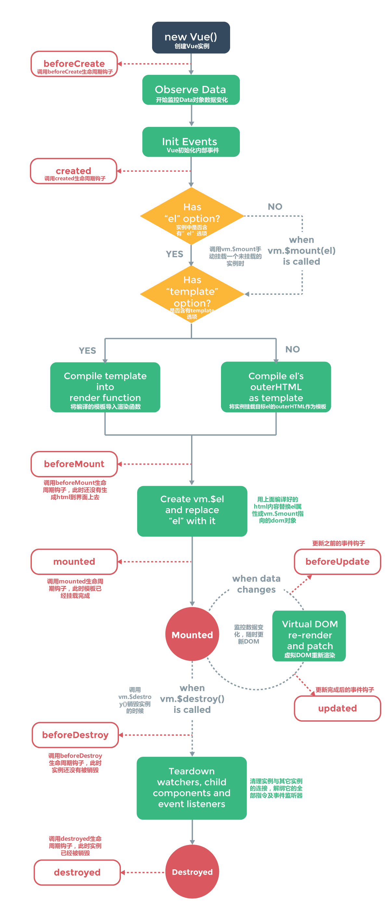
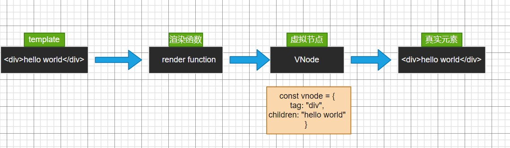

# Vue

### 1、v-model的实现原理

v-model其实是一个语法糖，它实际上是做了两步动作：

1、绑定数据value

2、触发输入事件input

```javascript
    <div id="app">
        <input type="text" :value="message" @input="change">
        <div>{{message}}</div>
    </div>

    <script>
        const app = new Vue({
            el:"#app",
            data () {
                return {
                    message:""
                }
            },
            methods:{
                change(event) {
                    this.message = event.target.value
                }
            }
        })
    </script>
```


### 2、生命周期函数



vue实例有一个完整的生命周期，包括了开始创建、初始化数据、编译模板、挂载DOM、渲染-更新-渲染、卸载。

这一整个流程称为Vue实例的生命周期，而钩子函数给了我们在某个阶段处理代码的机会。

| 生命周期钩子  | 详细内容                                                     |
| ------------- | ------------------------------------------------------------ |
| beforeCreate  | 实例初始化之后，数据观测(data observer)和事件配置(event/watcher)之前调用。注：此时组件的选项对象还未建立，**el和data还未初始化**，因此无法访问methods,data,computed等上的方法和数据 |
| created       | 实例已经创建完成之后被调用。在这一步，实例已完成一下配置：数据观测(data observer),属性和方法的运行，watch/event事件回调。然而，挂载阶段还没开始，**$el属性目前不可见** |
| beforeMount   | 挂载开始之前被调用，相关的render函数首次被调用（**虚拟DOM**），实例已完成以下配置：编译模板、把data里面的数据和模板生成了html，**完成了el和data初始化，但是此时还没有挂载到html页面上**。 |
| mounted       | 挂载完成。el被新创建的vm.$el替换，并挂载到实例上去后调用该钩子函数。**mounted只会执行一次**。可以做一些ajax操作 |
| beforeUpdate  | 数据更新之前被调用，发生在虚拟DOM重新渲染和打补丁之前，可以在该钩子中进一步更改状态，这不会触发附加的重渲染过程 |
| updated       | 由于数据更改导致的虚拟DOM重新渲染和打补丁，调用时，组件DOM已经更新，所以可以执行依赖于DOM的操作。应避免在此期更改状态，可能会导致更新无线循环。 |
| beforeDestroy | 实例销毁之前调用，在这一步，实例仍然完全可用。这一步还可以使用this来获取实例，可以做以下重置操作，比如清除掉组件中的定时器和监听的dom事件 |
| destroyed     | Vue实例销毁后调用。调用后，实例指示的所有东西都会解除绑定，所有事件监听器都会移除，所有子实例也会被销毁 |

（除了beforeCreate和created钩子之外，其他钩子均在服务器端渲染期间不被调用）

**补充**

1、created是一个比较常用的生命周期函数，可以调用methods方法，改变data数据，获取methods中的计算属性等等，通常可以在这个函数中对实例进行预处理。

ajax请求最好放在created里面，因为此时已经可以访问this了，请求到数据就可以直接放在data中

2、在mouted钩子函数中，对挂载的dom进行操作。

关于DOM的操作要放在mouted中，在mouted前面访问DOM都是undefined


### 3、data为什么是一个函数

vue实例的data必须是一个函数，这是js本身的特性带来的，跟vue本身设计无关。

**理解：**

组件时可复用的vue实例，一个组件被创建好之后，可能被用在各个地方。而组件管被复用了多少次，其内部的data数据都应该是互相隔离，互不影响的。

**如果data是个对象**

Object是引用数据类型，如果不用function返回，组件中的data保存着一个内存地址，当存在多个组件时，这些组件的data都指向同一个内存地址，改变其中一个，其他的也会被改变。

**如果data是一个函数**

JavaScript只有函数构成作用域（只有函数{}构成作用域，对象{}以及if（）{}都不构成作用域），data是一个函数时，每个组件实例都有自己的作用域，每个实例相互独立，不会相互影响。


### 4、虚拟DOM

分析虚拟DOM之前，先来看看真实DOM的渲染

```js
<html>
<head>
    <title>Document</title>
</head>
<body>
    <h1>hello world</h1>
</body>
</html>
```

以上代码经过浏览器解析，会形成一颗DOM树


**虚拟DOM的优势**

目前的框架都引入了虚拟DOM来对真实DOM进行抽象，这样做有很多的好处：

1、首先可以对真实的元素节点进行抽象，抽象成VNode（虚拟节点），这样方便后续对其进行各种操作

2、其次是方便实现跨平台，可以将VNode节点渲染成任意想要的节点，vue允许开发者开发自己的渲染器（renderer），在其他的平台上渲染



3、在传统开发的模式中，假设需要更新10个DOM节点，浏览器收到第一个DOM请求后马上执行流程，最终执行10次，真实DOM增删改会引起浏览器的回流和重绘，效率很低；

虚拟DOM是用js对象模拟出来的一个DOM，将页面中内容的改变先应用到DOM上，对虚拟DOM修改时不会引起回流和重绘，然后通过diff算法比较虚拟DOM和真实DOM的不同，找出最小变更，再把这些变更写入真实DOM中，减少了实际DOM操作次数，性能会有较大的提升


### 5、双向数据绑定原理


### 5、computed与watch

当一个值A，是同时受到B和C影响的，这个时候应该使用computed；

当一个值A发生变化后，要执行一系列操作，这个时候应该使用watch

**计算属性computed**

1、支持缓存，只有依赖的数据发生改变时，才会重新进行计算

2、不支持异步，当computed内有异步操作时无效，无法监听数据的变化

3、在computed中，属性都有一个get和set方法，当数据变化时，调用set方法


**侦听属性watch**

1、不支持缓存，可以监听某一个数据，然后执行相应的操作

2、支持异步操作

3、监听的函数接收两个参数，参数一newValue，参数二oldValue

4、监听的数据必须是data中声明过或者父组件传递过来的props中的数据。监听对象时，默认是监听 其引用，当内部的值发生变化时，无法监听到（使用deep深度监听解决）


### 6、v-for的key的作用

在使用v-for进行列表渲染时，我们通常会给元素或者组件绑定一个key属性

这个key有什么作用呢？官方的解释：

1、key属性主要用在Vue的虚拟DOM算法，在新旧nodes对比时辨识vNodes

2、不使用key，Vue会使用一种最大限度减少动态元素并且尽可能的尝试就地修改/复用相同类型元素的算法

3、使用key，它会基于key的变化重新排列元素顺序，并且会移除/销毁key不存在的元素

**案例分析**

在数组letters中间添加一个新的元素f

```js
<body>
    <div id="app"></div>

    <!-- 模板 -->
    <template id="my-app">
            <ul>
                <li v-for="item in letters">{{item}}</li>
            </ul>
            <button @click="insertF">添加</button>
    </template>
    <script>
        const App = {
            template:'#my-app',
            data() {
                return {
                    letters: ['a', 'b', 'c', 'd']
                }
            },
            methods:{
                insertF() {
                    this.letters.splice(2,0,'f')
                }
            }
        }
        Vue.createApp(App).mount('#app')
    </script>
</body>
```

对于这次更新ul和button是不需要进行更新的，需要更新的是li列表

要完成这一步操作，有三种方法

1、直接生成一个新的vnode，整个替换掉旧的vnode

2、将c、d位置内容改成f、c，并在末尾添加一个元素d

3、直接往中间添加f元素，其他元素依次往后移动一个位置


那么Vue中对于这种情况的更新是如何操作的呢？

Vue会根据有没有key，调用两个不同的方法

1、有key，那么就使用patchKeyedChildren方法

2、没有key，那么就使用patchUnkeyedChildren方法


**patchUnkeyedChildren**

没有key的情况下，采用该方法，具体步骤可以参考mini-vue的patch函数的实现

```js
const patch = (n1, n2) => {
    if (n1.tag !== n2.tag) { //类型不同
        const n1ElParent = n1.el.parentElement
        //直接删除掉n1，并将n2挂载到原n1位置
        n1ElParent.removeChild(n1.el)
        mount(n2, n1ElParent) 
    } else { //类型是相同的
        // 1.取出element对象，并且在n2中进行保存
        const el = n2.el = n1.el

        // 2.处理props
        const oldProps = n1.props || {}
        const newProps = n2.props || {}
        // 2.1 获取所有的newProps，并添加进el中
        for (const key in newProps) {
            const newValue = newProps[key]
            const oldValue = oldProps[key] //如果oldValue有值，说明新旧n1、n2存在相同的属性
            if (newValue !== oldValue) {
                //将不相同的属性进行添加操作
                if (key.startsWith("on")) {
                    el.addEventListener(key.slice(2).toLowerCase(), newValue)
                } else {
                    el.setAttribute(key, newValue)
                }
            }
        }
        // 2.2 删除旧的props
        for (const key in oldProps) {
            //如果存在旧n1的属性在n2中，进行删除操作
            if(key.startsWith('on')) {
                const value = oldProps[key]
                el.removeEventListener(key.slice(2).toLowerCase(), value)
            }
            if(!(key in newProps)) {
                el.removeAttribute(key)
            }
        }
        // 3.处理children
        const newChildren = n2.children || []
        const oldChildren = n1.children || []
        // 3.1 新节点是一个文本
        if (typeof newChildren === 'string') {
            // 替换掉旧el的整个innerHTML
            if (typeof oldChildren === 'string') {
                if (newChildren !== oldChildren) {
                    el.textContent = newChildren
                } } else {
                    el.innerHTML = newChildren
            }
        } else {//3.2 新节点是一个数组
            //3.2.1 旧节点是一个文本
            if (typeof oldChildren === 'string') {
                el.innerHTML ="" //清空
                newChildren.forEach(item => {
                    mount(item, el) // 递归 ：将每一个item挂载到el上
                })
            } else {
                //3.2.2旧节点是一个数组
                //情况一
                //oldChildren: [v1, v2, v3]
                //newChildren: [v1, v5, v6]
                const commonLength = Math.min(oldChildren.length, newChildren.length)
                for (let i = 0; i < commonLength; i++) {
                    // 有相同节点的元素进行patch操作
                    patch(oldChildren[i], newChildren[i])
                }

                ////情况二：newChildren.length > oldChildren.length
                //oldChildren: [v1, v2, v3]
                //newChildren: [v1, v5, v6, v7, v8]
                if (newChildren.length > oldChildren.length) {
                    //newChildren: [v7, v8] 添加至el上
                    newChildren.slice(oldChildren.length).forEach(item => {
                        mount(item, el)
                    })
                }

                // 情况三：newChildren.length < oldChildren.length
                //oldChildren: [v1, v2, v3, v7, v8]
                //newChildren: [v1, v5, v6]
                if (newChildren.length < oldChildren.length) {
                    //oldChildren: [v7, v8]进行移除
                    oldChildren.slice(newChildren.length).forEach(item => {
                        el.removeChild(item.el)
                    })
                }
            }
        }
    }
}
```

总的来说，如有没有key,就对children进行三种情况的对比

情况一：新旧节点个数相同，递归调用patch

情况二：旧节点大于新节点，移除多余的节点

情况三：新节点大于旧节点，挂载新节点


**patchKeyedChildren**

如果有key的情况下，每次进行patch，不仅要判断新旧node的类型，还要（&&）对比两者的key

大致分成五步：

第一，从头到尾开始两两对比，如果不同（类型不同或者key不同），跳出while循环

第二，从末尾到头部开始对比，同理遇见不同，跳出循环

第三，如果旧的节点，遍历完，还有新的节点，那么新增多的新节点

第四，如果新的节点，遍历完，还有旧的节点，那么移除多的旧节点

第五，考虑到中间可能是乱序的，vue会尽可能在新旧node中，找到相同的，然后对不同的进行patch


所以，vue在进行diff算法的时候，会尽量利用key进行优化操作，没有key的时候效率是非常低的。

在进行插入或者重置顺序的时候，保持相同的key可以让diff算法更加高效

### 7、nexttick

官方解释：将回调推迟到下一个DOM更新周期之后执行。在更改了一些数据以及等待DOM更新后立即使用它。

**案例分析**

假设宽度固定的div中，有一个空字符串。当第一次为文本增加了内容后，div有了高度offsetHeight。（不断增加文本后，div会换行，高度会不断增加）

```vue
<template>
    <div class="box" ref="box">{{ message }}</div>
    <button @click="addMsg">增加</button>
</template>

<script>
export default {
  data() {
    return {
      message: "",
    };
  },
  methods: {
    addMsg() {
      this.message += "哈哈哈";
      // 获取高度
      console.log(this.$refs.box.offsetHeight); // 第一次，输出：0
    },
  },
    updated() {
        console.log(this.$refs.box.offsetHeight); //第一次，输出：41
    }
}
</script>
```

说明了当div有了高度，第一次在methods获取到的是**DOM数据更新之前**的高度

当div有了高度，第一次在updated获取到的是**DOM数据更新之后**的高度


显然，我们经常需要获取数据更新之后的数据（即updated中的数据），但是我们不能经常在updated回调函数中获取，因为只要**页面数据发生变化，都会触发updated**，在updated中定义代码A后，有时候其他无关的数据B变化，updated会执行一次。显然这个时候并不需要执行我们的A代码，但它还是运行了


nexttick可以解决上方的问题

```js
//正确的形式
	addMsg() {
      this.message += "哈哈哈"; //数据发生变化
      //更新DOM
      console.log(this.$refs.box.offsetHeight);  //最终获取到正确的结果
    },
```

```js
//使用$nexttick
    addMsg() {
      this.message += "哈哈哈";
      this.$nextTick(() => {
        console.log(this.$refs.box.offsetHeight); //输出41
      });
    },
```


**nexttick原理**

理解nexttick需要从事件循环的角度理解

```js
	addMsg() {
      this.message += "哈哈哈"; // 更新数据
      console.log(this.$refs.box.offsetHeight);  
    },
```

当我们更新数据时，Vue会往微任务队列里边添加三个微任务

```js
// 1. watch(回调函数) preQueue
// 2. 组件的更新 update jobQueue
// 3.声明周期回调 postQueue
```

认真想一下，当以上三个微任务尚未执行，`console.log(this.$refs.box.offsetHeight); `已经放入调用栈执行，结果肯定是0

而nexttick做的事情简单，它将执行的时机延迟到这三个微任务执行之后（包裹一个Promise，因为Pomise的then回调默认会放进微任务队列）

所以，nexttick的回调函数的最终执行时机

```js
//1....
//2... 更新DOM
//3...
//4.nexttick的回调，此时已经能够获取到正确的数据
```


### 8、vue的优点与不足

**优点**

1、轻量级的框架，只关注视图层，是一个构建数据的视图结合，大小只有几十KB

2、简单易学，国人开发，中文文档，不存在语言障碍，便于理解和学习

3、双向数据绑定，在数据操作中较为简单

4、组件化，用可复用、解耦的组件来构建页面

5、数据驱动：自动计算属性和追踪依赖的模板表达式

6、虚拟DOM：DOM操作十分消耗性能，vue不再使用原生的dom操作节点，极大地解放了dom操作，但具体操作还是dom，只不过换了一种方式

**缺点**

1、大量地进行封装，不利于SEO优化

2、报错不明显，适合单人开发，适合中小型项目


### 9、vue源码解析

vue的源码包括三大核心：

1、Compiler模块：编译模板系统

2、Runtime模块：也可以称之为Renderer模块，真正渲染的模块

3、Reactivity模块：响应式系统


### 10、diff算法

1、为什么要用Diff算法

由于在浏览器中操作DOM的代价是非常“昂贵”的，十分消耗性能（开销十分大），所以Vue才引入了虚拟DOM（Virtual DOM），xuniDOM是对真实DOM的一种抽象描述

但是即使使用了虚拟DOM来进行真是DOM的渲染，在页面更新的时候，而不能全量地将整颗虚拟DOM进行渲染，而是去渲染改变的部分，这个时候就需要计算xuniDOM树改变部分的算法了，这就个算法就是Diff算法


diff的过程就是调用名为`patch`的函数，比较新旧节点，一边比较一边给**真实的DOM**打补丁


### 11、Vuex的实现原理


### 12、导航守卫

通俗的讲，导航守卫就是路由跳转过程中的一些钩子函数。

有的时候，我们需要通过路由来进行一些操作，比如最常见的登录权限验证，当用户满足条件时，才让其进入导航，否则就取消跳转，并跳到登录页面让其登录

导航守卫分为：**全局的、单个路由独享的、组件内的**三种


**全局守卫**（三个）

1、`router.beforeEach`全局前置守卫：进入路由前

2、`router.beforeResolve`全局解析守卫：在`beforeRouteEnter`调用之后调用

3、`router.afterEach`全局后置路由：进入路由后

```js
//全局前置守卫
router.beforeEach((to, from, next) => {
    console.log("进入路由前");
    next()
})

//全局解析守卫
router.beforeResolve((to, from, next) => {
    console.log("beforeResolve");
    next()
})

//全局后置路由(没有next)
router.afterEach((to, from) => {
    console.log("路由跳转后");
})
```


**to、from、next参数说明**

1、to和form是将要进入和将要离开的路由**对象**（可以通过this.$route获取）

2、next函数，如果有这个参数必须调用，否则不能进入路由（页面空白）

+ next()进入该路由
+ next(false):取消进入路由，url地址重置为from路由地址（也就是将要离开的路由地址）
+ next跳转新路由，当前的导航被中断，重新开始一个新的导航

```js
//或者可以这样子跳转
next("path地址")、next({ path: '' }) 、 next({ name: '' })
```


**路由独享守卫**

指的是单个路由配置的时候可以设置钩子函数。目前只有beforeEnter这一个

```js
const router = new VueRouter({
    routes: [
        {
            path: '/foo',
            component: Foo,
            beforeEnter: (to, from, next) =>{
                //代码逻辑
            }
        }
    ]
})
```


**路由组件内的守卫**

指的是组件内执行的钩子函数，类似于组件内的生命周期

1、`beforeRouteEnter`：进入路由前

2、`beforeRouteUpdate`：路由复用同一个组件时

3、`beforeRouteLeave`：离开当前路由时

```js
<script>
export default {
	beforeRouteEnter (to, from, next) {
        //不能获取组件实例 `this`
        //因为当函数执行前，实例还未被创建
    },
	beforeRouteUpdate (to, from, next) {
        //在当前路由改变，但是该组件被复用是调用，可以访问组件实例`this
    },
	beforeRouteLeave (to, from, next) {
        //导航离开该组件对应路由时调用，可以访问组件实例`this`
    }
};
</script>
```


**跳转死循环，页面永远空白**

```js
router.beforeEach((to, from, next) => {
    if(登录) {
        next()
    } else {
        next({ name:'login' })
    }
})
```

逻辑貌似是对的，但是跳转到login之后，因为此时还是未登录状态，所以会一直跳转到login，然后死循环，页面一直空白，所以要把判断条件稍微改一下

```js
router.beforeEach((to, from, next) => {
    if(登录 || to.name === 'login') {
        next()
    } else {
        next({ name:'login' })
    }
})
```


**完整的路由导航解析流程（不包含其他声明周期）**

1、触发进入其他路由

2、调用离开路由的组件守卫`beforeRouteLeave`

3、调用全局前置守卫`beforeEach`

4、在重用的组件里调用`beforeRouteUpdate`

5、调用路由独享守卫`beforeEnter`

6、解析异步路由组件

7、在将要进入的路由组件中调用`beforeRouteEnter`

8、调用全局解析守卫`beforeResolvle`

9、导航被确认

10、调用全局后置钩子的`afterEach`钩子

11、触发DOM更新`mouted`

12、执行`beforeRouteEnter`守卫中传给next的回调函数


### 13、keep-alive

在开发Vue项目的时候，大部分组件是没必要多次渲染的，所以Vue提供了一个内置组件`keep-alive`来缓存组件内部状态，避免重新渲染

**1、基本使用**

A、缓存动态组件(不推荐)

包裹动态组件时，会缓存不活动的组件实例，而不是销毁他们。不过这种方式意义不大

```html
//示例
    <keep-alive>
      <home v-if="active" />
      <cart v-else />
    </keep-alive>
```


B、缓存路由组件

使用`keep-alive`可以将所有路径匹配到的路由组件都缓存起来，包括路由组件里面的组件。`keep-alive`大多数场景就是这种

```html
<keep-alive>
	<router-view></router-view>    
</keep-alive>
```


**2、生命周期钩子**

在`keep-alive`包含的组件/路由中，会多出两个生命周期的钩子：`activated`和`deactivated`

**activated**

1、`activated`在组件第一次渲染时会被调用，之后在每次缓存组件被激活时调用

2、`activated`的调用时机：在moutend之后，`beforeRouteEnter`之前

3、因为组件被缓存了，再次进入缓存路由/组件时，不会触发这些钩子

```js
//beforeCreate created beforeMount mounted 都不会触发
```

理解：当把Home路由、Cart路由放在`keep-alive`中，会在这两个路由第一次创建时触发以上的声明周期函数，之后被缓存下来，来回切换这两个路由就不会再次触发以上钩子函数了


**keep-alive的属性**

有时候，我们只想缓存部分路由。（例如商城项目中的详情页，因为商品个数十分多，详情页也十分多，缓存下来显然浪费了内存）

+ `include`: 匹配的路由/组件 会被缓存
+ `exclude`:匹配的路由/组件 不会被缓存

注：`include、exclude`支持三种方式来缓存有条件的路由：采用逗号分隔的字符串形式、正则形式、数组形式

```html
<!--逗号分隔 -->
<keep-alive exclude="a,b">
	<router-view></router-view>
</keep-alive>
<!--数组 -->
<keep-alive :include="['a', 'b']"></keep-alive>

```

注：`keep-alive`会优先匹配组件的name选项。(开发中尽量给组件补充个name属性)


### 13、v-if和v-show

**Vue里面v-if、v-show的区别**

两者都可用来控制DOM元素的显示和隐藏，区别在于：
v-if是真正的条件渲染，它会在切换过程中被适当地销毁和重建；v-if也是惰性的，就是初始条件为假的话什么也不做，直到条件第一次变为真时才开始渲染条件块。

相比之下，v-show就简单得多，无论初始条件是什么都会进行渲染，只是简单地基于CSS进行切换，隐藏的话就加入`display:none`的属性值。

所以v-if具有较高的切换开销，适用于运行时条件很少改变的场景，而v-show具有较高的初始化渲染开销，适用于需要频繁切换的场景。


### 14、computed和methods

**computed**：

+ 编写时要求有返回值
+ 系统刚运行时会调用一次，在数值发生变化的时候会一直执行，而不是调用的时候执行。数值一直变化的时候很消耗性能
+ 调用时可视为一个变量值使用，无需进行函数调用
+ 计算结果不变时，该函数仅会调用一次。computed具有缓存功能

**methods：**

+ 页面刚加载时调用一次，后期只有调用的时候才执行
+ 需要进行函数式调用（加括号）
+ methods中的返回值可写可不写


### 15、scoped及其原理

默认情况下，CSS总是全局生效的，即使是在模块化编程下也是如此。为了避免CSS样式之间的污染，vue引入了scoped这个概念


**1、scoped属性**

```vue
<style scoped></style>
```

当一个style标签拥有了scoped属性时，它的CSS样式就只能作用于当前的组件。

通过设置该属性，使得组件之间的样式不相互污染，如果一个项目中的style标签全部加上了scoped，相当于实现了样式的模块化

**2、原理**

vue中的scoped通过在DOM结构以及css样式上加**唯一不重复的标记`data-v-hash`的方式，以保证唯一**，而这个工作是由PostCSS转译实现的，达到样式私有化模块化的目的

渲染规则：

1、给HTML的DOM节点加一个不重复data属性（形如：data-v-19fca230）来表示他的唯一性

2、在每句css选择器的末尾（编译后的生成的css语句），加上一个当前组件的data属性选择器如[data-v-19fca230]来私有化样式

3、如果组件内部包含有其他组件，只会给其他组件最外层标签加上当前组件的data属性


**3、例子**

```html
<div class="box">
    <button class="btn">确定</button>
</div>

<style scoped>
    .box{
        background-color:white;
    }
    .btn{
        width:200px;
    }
</style>
```

经过PostCSS转译后

```js
<div class="box" data-v-2311c06a>
    <button class="btn" data-v-2311c06a>确定</button>
</div>

<style scoped>
    .box[data-v-2311c06a]{
        background-color:white;
    }
    .btn[data-v-2311c06a]{
        width:200px;
    }
</style>
```

PostCSS会给一个组件中所有DOM添加一个独一无二的动态属性data-v-xxxx，然后CSS选择器额外添加一个对应的属性选择器来选择该组件中的DOM，这中做法使得样式只作用于含该属性的DOM——组件内部DOM，从而达到了样式模块化的效果


**4、穿透scoped**

在项目中，我们有时会引用第三方组件，但又想局部改变第三方组件中的样式，该怎么办呢？

这个时候就可以使用穿透scoped>>>

```vue
<template>
	<div class="box">
        <dialog></dialog>
    </div>
</template>

<style scoped>
    .box >>> input {
        width:2000px;
        text-align: c
    }
</style>
```


### 16、router的两种模式

前端路由的核心，就在于——**改变视图的同时不会向后端发出请求**


为了达到这一目的，浏览器当前提供了以下两种支持：

1、**hash**——即地址栏URL中的`#`符号，例如：`http://www.abc.com/#/hello`

本质：hash模式本质上是改变`window.location`的href属性，可以直接赋值`location.hash`来改变href，但页面不发生刷新

```js
//演示一
setTimeout(() => {
    location.hash = 'home'
}, 2000)
//输出url: ..../#/home
```

```html
//演示二
<a href="#/home">change</a>
<!-- URL: .../#/home-->
```

特点：hash虽然出现在URL中，但不会被包括在HTTP请求中，对后端完全没有影响，因此改变hash不会重新加载页面


监听路由的改变

```js
window.addEventListener("hashchange", () => {
    console.log(location.hash)
    //可以在这里做出路由改变后的操作，比如url改变后，页面怎么变化。（这就是前端路由的原理）
})
```


2、**history**——利用了HTML5 History Interface中新增的`pushState()`和`replaceState()`方法

```js
//pushState
history.pushState({}, '', 'home')

//replaceState
histoyr.replaceState({}, '', 'category')
```

这两个方法应用于浏览器的历史记录栈，在当前已有的`back`、`forword`、`go`的基础上，他们提供了对历史记录进行修改的功能

只是当它们执行修改时，虽然改变了当前的URL，但浏览器不会立即向后端发送请求


因此可以说，history模式和hash模式都属于浏览器自身的特性，Vue-Router只是利用二这两个特性来实现前端路由


