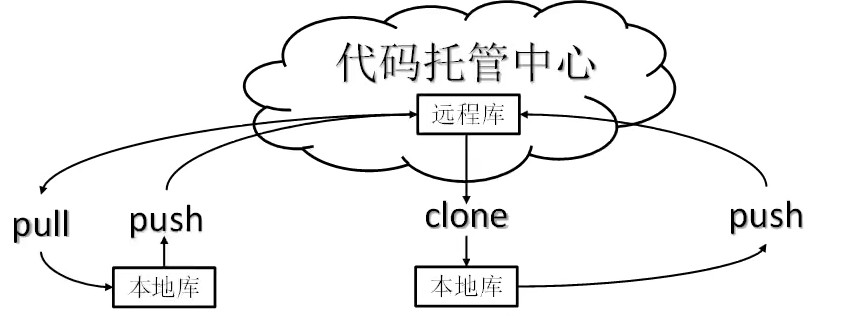
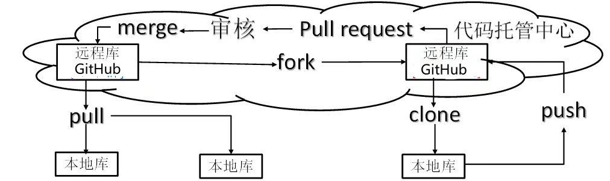

# git

## 一、简介

Git是一个免费的、开源的分布式版本控制系统，可以快速高效地处理从小型到大型的各种项目。


**集中式版本控制**

集中式版本控制系统诸如SVN等，都有一个单一的集中管理的服务器，保存所有文件的修订版本。协同工作的人们都通过客户端连到这台服务器，取出最新的文件或者提交更新。

优点：每个人都可以在一定程度上看到项目中其他人正在做些什么。管理员也能轻松掌握每个开发者的权限

缺点：中央服务器的单点故障，那么在故障时间内开发者无法更新，无法协同工作


**分布式版本控制系统**

像git这种分布式版本控制工具，客户端提取的不是最新版本的文件快照，而是把代码仓库完整地复制到本地库。这样任何移除协同工作用的文件发生故障，事后都可以使用其他客户端的本地仓库进行恢复。客户端的每一次文件提取操作，实际上都是一次对整个文件仓库的完整备份

优点：

服务器断网情况下也可以进行开发（因为版本控制是在本地进行）

每个客户端保存的都是整个完整的项目（包含历史记录，更加安全）

缺点：增加了本地存储空间的占用

## 二、Git常用命令

| 名称                                 | 说明           |
| ------------------------------------ | -------------- |
| git config --global user.name 用户名 | 设置用户签名   |
| git config --global user.email 邮箱  | 设置用户邮箱   |
| git init                             | 初始化本地库   |
| git status                           | 查看本地库状态 |
| git add 文件名                       | 添加到缓存区   |
| git commit -m '日志信息' 文件名      | 提交到本地库   |
| git reflog                           | 查看历史记录   |
| git reset --hard 版本号              | 版本穿梭       |

### 2.1 初始化

1、设置git的用户名、邮箱。（必要）

设置完成后，可在c盘用户文件夹下的`.gitconfig`查看

注：首次安装git，必须设置，否则提交代码时会报错。这里设置的用户签名和GitHub的账号并无关系


2、初始化一个本地库

初始化：`git init`

查看状态：`git status`

```shell
$ git status
On branch master

No commits yet

nothing to commit (create/copy files and use "git add" to track)
```


### 2.2 添加至本地库

当向文件夹中添加新文件`test.txt`时，查看状态

```shell
$ git status
On branch master

No commits yet

Untracked files:
  (use "git add <file>..." to include in what will be committed)
        test.txt #标红的

nothing added to commit but untracked files present (use "git add" to track)

```

标红的文件说明未被添加到git的跟踪下


3、添加到暂存区

```js
//添加到暂存区
git add test.txt

//从暂存区中删除
git rm --cached test.txt

//添加所有文件到暂存区
git add .
```


4、添加到本地库

```shell
git commit -m 'first commit' test.txt

[master (root-commit) 2ec20a0] first commit
 1 file changed, 1 insertion(+)
 create mode 100644 test.txt
```

说明：`2ec20a0`是此次提交的版本号

```shell
#查看历史记录
git reflog
2ec20a0 (HEAD -> master) HEAD@{0}: commit (initial): first commit

#查看详细历史记录
git log
commit 2ec20a00299427ef56ea8947700f9bd26b7c1d28 (HEAD -> master)
Author: mzlin <mzlin2020@163.com>
Date:   Tue Oct 26 23:50:29 2021 +0800

    first commit

```


4、多次修改文件并保存至本地库

重复修改三次并提交到本地库，查看历史信息

```shell
8069480 (HEAD -> master) HEAD@{0}: commit: third commit
d92342b HEAD@{1}: commit: second commit
2ec20a0 HEAD@{2}: commit (initial): first commit
```

可以看到指针指向第三版


### 2.3 版本穿梭

1、查看历史版本信息：`git reflog`

2、查看详细版本信息：`git log`

需求切换回第二个版本

```shell
git reset --hard d92342b
HEAD is now at d92342b second commit

#再次查看历史版本信息
git reflog
d92342b (HEAD -> master) HEAD@{0}: reset: moving to d92342b
8069480 HEAD@{1}: commit: third commit
d92342b (HEAD -> master) HEAD@{2}: commit: second commit
2ec20a0 HEAD@{3}: commit (initial): first commit

```

可以看到，get新增了一个版本号为`d92342b`的版本，目前的版本是指向第二个版本。

（意思是新增的第四版`d92342b`指向了第二版`d92342b`）


## 三、分支

### 3.1 分支的简介

1、什么是分支？

在版本控制的过程中，同时推进多个任务，为每个任务，我们就可以创建每个任务的单独分支。使用分支意味着可以把自己的工作从开发主线上分离开来，开发自己分支的时候，不会影响主线分支的运行。

（可以简单将分支理解成副本，一个分支就是一个单独的副本）

2、分支的好处

同时并行推进多个功能开发，提高开发效率

各个分支在开发的过程中，如果某一个分支开发失败，不会对其他分支有任何影响。失败的分支删除重新开始即可

### 3.2 分支的操作

| 命令名称                              | 作用                         |
| ------------------------------------- | ---------------------------- |
| `git branch`分支名                    | 创建分支                     |
| `git branch -v`                       | 查看分支                     |
| `git checkout `分支名                 | 切换分支                     |
| `git merge`分支名                     | 把指定的分支合并到当前分支上 |
| git clone -b 分支名 项目地址          | 克隆指定分支                 |
| git push --set-upstream origin 分支名 | 向远程仓库创建一个新分支     |


1、创建新的分支，并查看

```shell
#查看当前分支
$ git branch -v
* master d92342b second commit   #只有主线分支

#创建一个新的分支
git branch hot-fix

#再查看当前的所有分支
$ git branch -v
  hot-fix d92342b second commit
* master  d92342b second commit

```

发现多了一个分支，默认当前是使用的是master


2、切换到新的分支上

```shell
git checkout hot-fix

#再次查看
git branch -v
* hot-fix d92342b second commit  #切换成功
  master  d92342b second commit
```

在这个分支下修改代码，同样需要`git add   git commit`等操作，添加至本地库


3、合并分支

`git merge 分支名`——把指定的分支合并到当前分支上

一般都是把其他分支的内容合并到master分支上，这里就是把hot-fix合并到master上，所以需要先回到master分支

```shell
#切换回master
git checkout master

#查看当前分支状态
git branch -v
  hot-fix 9feec31 hot-fix first commit
* master  d92342b second commit

#合并分支
git merge hot-fix
Updating d92342b..9feec31
Fast-forward
 test.txt | 2 +-
 1 file changed, 1 insertion(+), 1 deletion(-)

#查看test.txt的内容
$ cat test.txt
hello world 第一次在分支上修改  #合并成功

```


### 3.3 合并冲突

合并时发生冲突的原因：

合并分支时，两个分支在同一个文件中有两套完全不同的修改。git无法替我们决定使用哪一个（即不知道用哪个覆盖哪个），必须人为决定新代码内容


1、制造冲突

修改master中的test.txt文件中的内容，并提交至本地库

修改hot-fix中的test.txt文件中的内容，并提交本地库

切换回master，进行合并，发生冲突

```shell
#合并
git merge hot-fix
Auto-merging test.txt
CONFLICT (content): Merge conflict in test.txt #在test.txt中发生了冲突，不知道使用哪一个
Automatic merge failed; fix conflicts and then commit the result. # 自动合并失败

```

此时当前所在的分支状态有了些变化：`(master|MERGING)`,意思是处于合并状态中，尚未完成

```shell
#此时查看本地库状态
git status
On branch master
You have unmerged paths. # 有没有合并的部分
  (fix conflicts and run "git commit")
  (use "git merge --abort" to abort the merge)

Unmerged paths:
  (use "git add <file>..." to mark resolution)
        both modified:   test.txt  #两个分支被修改

no changes added to commit (use "git add" and/or "git commit -a")

```


2、手动合并代码（解决冲突）

```shell
#编辑test.txt文件
hello world 第一次在分支上修改
<<<<<<< HEAD
master:合并冲突
=======
hot-fix: 合并冲突
>>>>>>> hot-fix

# 修改 
i
```

把想要的代码留下，不想要的代码删除

```shell
hello world 第一次在分支上修改
master:合并冲突
hot-fix: 合并冲突

# 退出编辑模式
esc

#保存并退出文件
wq
```

现在我们已经修改了代码，需要重新提交到本地库

注：这次提交`commit`时，不能提及文件名

```shell
$ git commit -m'overcome conflict' test.txt  # 跟了文件名
fatal: cannot do a partial commit during a merge. #提交失败
```

```shell
#正确的提交方式
$ git commit -m'overcome conflict'
[master 6ac5576] overcome conflict ##成功！
```

此时，状态也会重新变回`master`


## 四、团队协作

### 4.1 团队内协作



1、作者将自己的项目从本地库push到远程库（GitHub）

2、团队成员可以从远程库将项目clone到自己的本地库，并做出自己的修改。如果要将修改后的本地库同步到远程库，需要有作者提供的权限，才能将自己修改过的项目push到远程库

3、团队成员修改了远程库的项目，作者想要自己本地的项目也发生更新，就需要从远程库pull到本地库


具体操作

1、团队内成员小明将项目克隆到了本地并进行修改，并想要将代码push到远程

```shell
# 无权限推送
git push https://github.com/koajs/koa.git #修改了koa源码
remote: Permission to ... #没有权限
fatal: unable to access...  
```


2、作者需要将小明拉进团队

步骤：在远程仓库的setting中找到Manage access选项，邀请一个新成员`invite a clooaborator`，会生成一个邀请函连接`Pending Invite`，将这个连接发给小明，小明点击同意即可进入团队


### 4.2 跨团队协作



1、团队外的人（小A）想要修改作者的代码，可以先fork到自己的远程库

2、小A再从自己的远程库将代码clone到本地库，修改后再push到自己的远程库

3、小A想要将自己修改过的代码合并到作者的远程仓库，需要先提交申请pull request，作者审核同意后，才能进行合并（merge）


### 4.3 远程仓库操作

| 命令名称                         | 作用                                                     |
| -------------------------------- | -------------------------------------------------------- |
| git remote -v                    | 查看当前所有远程地址别名                                 |
| git remote add 别名 远程地址     | 起别名                                                   |
| git push  别名 分支              | 将本地分支上的内容推送到远程仓库                         |
| git clone 远程地址               | 将远程仓库的内容克隆到本地                               |
| git pull 远程地址别名 远程分支名 | 将远程仓库对于分支最新内容拉下来后与当前本地分支直接合并 |


1、在GitHub上创建一个远程仓库，获得一个远程库的https地址

```js
https://github.com/mzlin2020/git-demo.git
```

2、查看本地现有的别名，并建立新的别名

许多远程库的地址难以记住，可以给它起一个容易记住的别名

```shell
#查看当前左右的别名
git remote -v
(无)

#给这个远程仓库地址起别名
git remote add git-demo https://github.com/mzlin2020/git-demo.git

#再次查看所有别名
git remote -v
git-demo        https://github.com/mzlin2020/git-demo.git (fetch)
git-demo        https://github.com/mzlin2020/git-demo.git (push)
```


3、将本地库的主分支推送到远程仓库

```shell
git push git-demo master
```

注：这一步经常失败，原因是GitHub的服务器在国外，一般需要科学上网解决或者多试几遍


4、将远程库的代码同步到本地库

假设某天在远程库中修改了代码，想要本地库的代码与远程保持一致，就需要pull命令

```shell
#同步远程到本地（会进行合并）
git pull git-demo master

#查看内容
cat test.txt
内容在远程库中修改了，需要同步到本地库
```


5、克隆其他人的项目到本地

注：克隆其他人的项目是不用进行登录验证的

```shell
# 克隆
git clone 项目地址

# 克隆react
git clone https://github.com/facebook/react.git
```

注：clone会做以下操作：拉取代码、初始化一个本地库、创建别名


## 五、SSH免密登录

项目的地址有https和SSH两种，没有设置过ssh免密登录SSH默认不可用

（在c盘用户文件夹中有这个.ssh这个文件）

1、没有.ssh文件，需要通过命令行生成.ssh秘钥目录

```shell
ssh-keygen -t rsa -C mzlin2020@163.com
```

会自动生成公钥和私钥

2、拿到公钥`id_rsa.pub`的内容，到远程仓库中进行设置

`SSH and GPS keys` -> ` new ssh key	` -> 输入公钥内容


3、无密码访问远程仓库

完成以上操作后，就可以在本机自由地访问远程仓库了（可以通过https地址，也可以是SSH地址）


## 六、git回滚代码

### 6.1 git reset

git reset命令有3种方式：

1、git reset --mixed：

此为默认方式，等同于不带任何参数的git reset。

2、git reset --soft：

回退到某个版本，只回退了commit的信息，如果还要提交，直接commit即可（修改的内容变成未add的状态），索引（暂存区）和工作目录的内容是不变的，在三个命令中对现有版本库状态改动最小。

3、git reset --hard：

彻底回退到某个版本，本地的源码也会变为上一个版本的内容，所有修改的内容都会丢失， (修改的代码 不会变成未add的状态)。索引（暂存区）内容和工作目录内容都会变给定提交时的状态。


### 6.2 git revert

在当前提交后面，新增一次提交，抵消掉上一次提交导致的所有变化，不会改变过去的历史，主要是用于安全地取消过去发布的提交


两者主要区别如下：

- git revert是用一次新的commit来回滚之前的commit，git reset是直接删除指定的commit
- git reset 是把HEAD向后移动了一下，而git revert是HEAD继续前进，只是新的commit的内容和要revert的内容正好相反，能够抵消要被revert的内容
- 在回滚这一操作上看，效果差不多。但是在日后继续 merge 以前的老版本时有区别


