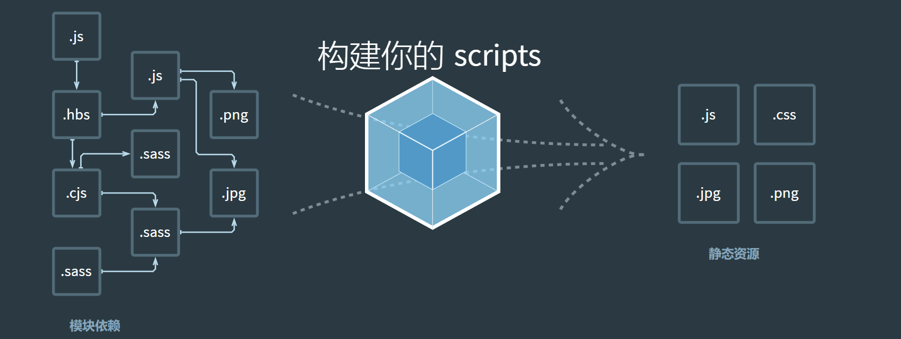

# vue3笔记


Vue是一套构建用户界面的渐进式框架。

## 一、初识Vue3

### 1.1 概述

在2020年9月19日，万众期待的Vue3终于发布了正式版，命名为“One Piece”

**新的特性**：更好的性能、更小的包体积、更好的TypeScript集成、更优秀的API设计

vue3带来的新变化：

1、源码——源码通过Monorepo的形式来管理源代码

源码使用TypeScript来进行重写

Mono：单个

Repo : repositiry仓库

主要是将许多项目的代码存储在同一个repository中，这样做的目的是多个包本身相互独立，可以有自己的功能逻辑、单元测似乎等，同时又在同一个仓库下方便管理，而且模块划分的更加信息，可维护性、可拓展性更强

2、性能

在vue2.x的时候，Vue2是使用**Object.defineProperty**来劫持数据的getter和setter方法的，但是这种方法的缺陷是当给对象添加或删除属性时，是无法劫持和监听的

而在Vue3.x开始，Vue使用**Proxy**来实现数据的劫持

3、删除了不必要的API

移除了实例上的 $on, $off 和 $once ;

移除了一些特性：如filter、内联模板等

4、新的API

(1)由Option API 到 Composition API：在vue2.x的时候，我们通过Option API来描述组件的对象，Option API包括data、props、methods、computed、生命周期等等的选项。

存在比较大的问题是多个逻辑可能是在不同的地方：比如created中使用某一个method来修改data的数据，代码的内聚性非常差

(2)Composition API可以将相关联的代码放在同一处进行处理

(3)Hooks函数增加代码的复用性，在vue2.x，我们使用mixins在多个组件之间共享逻辑，但是mixins也是由一大堆Options组成的，并且多个mixins会存在命名冲突；

(3)vue3.x中，Hook函数将一部分独立的逻辑抽取出去，并且它们还可以做到是响应式的


### 1.2 基本使用

```vue
	
	<div id="app">
        {{str}}
    </div>


	const app = Vue.createApp({
		data(){
			return {
				str:"hello world"
			}
		}

	})
	app.mount('#app') //挂载

//或者 
	Vue.createApp({
		data(){
			return {
				str:"hello world"
			}
		}
	}).mount("#app") //挂载

//或者
	const App ={
            template:"#my-app",
            data () {
                return {
                    info:"hello world"
                }
            }
        }

        Vue.createApp(App).mount("#app")
```


Vue.createApp（{ 对象 }）

该对象有什么属性呢？


**1、template**

表示Vue需要帮助我们渲染的模板信息
它里边包含很多的HTML标签，这些标签替换掉我们挂载的元素的innerHTML

```vue
//方法一
<script type="template" id="tem">
	//模板内容
</script>

Vue.createApp({
	template:"#tem"
})


//方法二
<template id="tem">
//模板内容
</template>

Vue.createApp({
	template:"#tem"
})
```


**2、data属性**

1、data属性传入的是一个函数，并且函数返回一个对象。
2、在Vue3.x的时候，如果传入一个对象，会直接报错
3、data中返回的对象会被Vue的响应式系统劫持，之后对该对象的修改或者访问都会在劫持中被处理


**3、methods属性**

改属性是一个对象，通常会在这个对象中定义很多方法：
1、这些方法会被绑定到template模板中
2、在该方法中，我们可以使用this关键字来直接访问到data中返回的对象的属性	

注意：不能在methods中使用箭头函数，因为这里箭头函数绑定了父级作用域的上下文

+ 为什么不能使用箭头函数？

```javascript
methods:{
    fn:()=>{  //不能这样子写
        console.log(this)  //this指向window
    }
}
```


### 1.3 拓展补充

**CDN**

内容分发网络

1、它是指通过相互连接的网络系统，利用最靠近每个用户的服务器

2、更快、更可靠地将音乐、图片、视频、应用程序以及其他文件发送给用户

3、来提供高性能、可拓展性及低成本的网络内容传递给用户

vue3的cdn

`<script src="https://unpkg.com/vue@next"></script>`


**MVVM模式**

mvvm（Model - View - ViewModel）是非常流行的架构设计模式

Vue并没有完全遵守MVVM的模型，但是整个设计是受到了它的启发


**vscode代码片段**

如果经常需要在编辑器中编写重复的代码，我们可以自定义代码片段，从而达到节省时间，高效编程

```vue
<!DOCTYPE html>
<html lang="en">
<head>
    <meta charset="UTF-8">
    <meta http-equiv="X-UA-Compatible" content="IE=edge">
    <meta name="viewport" content="width=device-width, initial-scale=1.0">
    <title>Document</title>
</head>
<body>
    <div id="app"></div>

    <template id="my-app">
        <h2>{{info}}</h2>
    </template>

    <script src="./js/vue.js"></script>
    <script>
        const App ={
            template:"#my-app",
            data () {
                return {
                    info:"hello world"
                }
            }
        }

        Vue.createApp(App).mount("#app")
    </script>
</body>
</html>
```

那么，如何将上边的代码定义为用户的代码片段呢？

1、找到vscode的User snippets

2、选择其中的html.json

3、将我们需要作为模板的代码转换为json格式（https://snippet-generator.app/）

4、将生成的代码输入html.json的对象中

5、如果我们在html.json设置的`"prefix": "vueapp"`，那么以后就可以在html文件中快速通过vueapp命令快速创建模板


**yarn**

Yarn 是一个软件包管理器，还可以作为项目管理工具

Yarn 对你的代码来说是一个软件包管理器， 你可以通过它使用全世界开发者的代码，或者分享自己的代码给全世界的开发者。快捷、安全、可靠。

安装命令：`npm install yarn -g`


**对象引用赋值、浅拷贝与深拷贝**

1、对象引用赋值

```javascript
    <!-- 对象的引用赋值 -->
        const info = {name:'linming',age:20} //保存的是引用地址
        const obj = info //info,obj指向同一个引用地址
        info.name = 'hello world'
        console.log(obj.name) //hellow world

```

2、浅拷贝

```javascript
    <!-- 浅拷贝 -->
        const info = {name:'linming',age:20}
        const obj = Object.assign({},info) 
```

浅拷贝为obj创建了一个新的引用地址，并将info的内容拷贝了一份。所以当info的内容改变时，并不影响到obj、


但是当info里边保存了一个对象，该对象指向的是一个内存地址。当拷贝到obj时，obj也会指向同一个内存地址


所以改变info里边other的内容，也会反映到obj里的other

3、深拷贝

```javascript
    <!-- 深拷贝 -->
        const info = {name:'linming',age:20,other:{id:100}}
        const obj = JSON.parse(JSON.stringify(info))

        info.other.id = 250
        console.log(obj.other.id) //100 
		// info怎么变化，都不能影响obj
```


## 二、基本语法

### 2.1 Mustache语法

如果我们希望把数据显示到模板（template）中，使用最多的语法是 “Mustache”语法 (双大括号) 的文本插值。

注：vue3允许template有多个根元素

```vue
    <div id="app"></div>

    <template id="my-app">
        <div>
            <!-- 1.直接使用 -->
            <div>{{info}}</div>
            <!-- 2.表达式 -->
            <div>{{count * 10}}</div>
            <!-- 3.可以调用计算属性 -->
            <div>{{reverseInfo}}</div>
            <!-- 4.三元运算符 -->
            <div>{{isShow? info : ""}}</div>

        </div>
    </template>

    <script src="./js/vue.js"></script>
    <script>
        const App ={
            template:"#my-app",
            data () {
                return {
                    info:"hello world",
                    count:10,
                    isShow:true
                }
            },
            computed: {
                reverseInfo(){
                    return this.info.split(" ").reverse().join(" ")
                }
            }
        }

        Vue.createApp(App).mount("#app")
```


### 2.2 基本指令

（以下的指令用的并不多，特殊情况下使用）

**v-once**

当数据发生变化时，元素或者组件以及所有的子元素将视为静态内容并且跳过（该指令可以用于性能优化）

```vue
    <template id="my-app">
        <div>{{count}}</div>
        <div v-once>{{count}}</div>  //组件渲染后将不会再改变
        <button @click="increment">增加</button>
    </template>
```


**v-text**

用于更新元素的 textContent

```vue
    <template id="my-app">
        <div v-text="count"></div>
		//等价于
		<div>{{count}}</div>
    </template>
```


**v-html**

默认情况下，如果展示的内容本身是 html 的，那么vue并不会对其进行特殊的解析。 

如果我们希望这个内容被Vue可以解析出来，那么可以使用 v-html 来展示；

```vue
<div v-html="info"></div>
//info的HTML标签会被解析
//info:"<h2 >hello world</h2>"
```


**v-pre**

v-pre用于跳过元素和它的子元素的编译过程，显示原始的Mustache标签：

跳过不需要编译的节点，加快编译的速度

```vue
    <template id="my-app">
    <div v-pre>{{info}}</div>
    //输出{{info}}
    </template>
```

### 2.3 v-bind绑定属性

1、v-bind绑定class（对象语法）

```vue
        <!-- 对象语法：{'类名'：Boolean} -->
            <div :class="{'actvie':true}">
                我走过你的世界
			</div>
```

也可以有多个键值对

```vue
        <div :class="{'actvie':true,'bgcolor':true}">
            我走过你的世界
		</div>
```

注：'actvie' 与 'bgcolor' 可以不用加单引号

也可以将| :class =  对象  |中的对象放在data中，或者通过computed(methods)中定义函数返回

```javascript
        <div :class="isFunc">
            我走过你的世界
		</div>
```


2、v-bind绑定class（数组语法）

```javascript
<div :class="['title',msg]"></div>
//             字符串  变量
//title，以及msg指向的内容会被当类名做添加进div
```


3、绑定style（对象语法）

```javascript
<div :style="{color:'red'}">我变红了</div> 
//注：这里的red必须加引号，不加则会当变量处理
```

```javascript
<div :style="{color:'red','font-size':'20px'}">我变红了</div> 
//使用-连接的css属性需要引号，使用驼峰命名则不用
<div :style="{color:'red',fontSize:'20px'}">我变红了</div>
```


4、动态绑定属性

根据data中的数据动态决定div的属性名称与值

```javascript
        <div :[name]="value">
            动态绑定属性名与值
		</div>

        data(){
            return {
                name:'abc',
                value:'info'
            }
        }
```


5、动态绑定一个对象

```javascript
<div v-bind="info">哈哈哈哈</div>
data(){
    return {
        info:{
            name:'mzlin',
            age:20,
            height:1.80
        }    }}
//效果：最终
<div name:'mzlin' age="20" , height="1.80">哈哈哈哈</div>
```


### 2.4 v-on绑定事件

在前端开发中，我们需要经常和用户进行各种各样的交互： 这个时候，我们就必须监听用户发生的事件，比如点击、拖拽、键盘事件等等 

在Vue中如何监听事件呢？使用v-on指令。

```javascript
        <!-- 基本使用 -->
            <button v-on:click="btnClick">按钮</button>
		<!-- 语法糖 -->
            <button @click="btnClick">按钮</button>
		<!-- 绑定一个表达式 -->
            <button @click="count++">按钮</button>
		<!-- 绑定一个对象 -->
            <div class="box" v-on="{click:btnClick,mouseover:mouseMove}"></div>
```


**参数传递**

```javascript
        <!-- 参数传递 -->
            <button @click="btnClick">按钮</button>
methods:{
    btnClick(event){
        console.log(event)
        //输出事件对象
    }
}
```

如果需要传递多个参数，需要给改为$event

```javascript
        <!-- 参数传递 -->
            <button @click="btnClick($event,'mzlin')">按钮</button>
methods:{
    btnClick(event,name){
        console.log(event,name)
        //输出事件对象
    }
}	
```


**修饰符**


### 2.5 条件渲染

**v-if 、v-else 、 v-else-if**

根据条件来渲染某一块的内容，只有当条件为true时，才会被渲染出来

```javascript
    <template id="my-app">
        <div v-if="isShow">你好</div>
	</template>

        data () {
            return {
                isShow:false
            }
        }
```

```javascript
    <template id="my-app">
        <div v-if="score > 90">优秀</div>
        <div v-else-if="score > 60 && score <=90">良好</div>
        <div v-else="score <= 60">不及格</div>
	</template>

    data () {
        return 
        score:88
    }
    }
```

**渲染原理**

1、v-if 是惰性的

2、当条件为false时，其判断的内容完全不会被渲染或者会被销毁掉（即标签不存在）

3、当条件为true时，才会真正渲染条件块中的内容


**template元素**

v-if是一个指令，所以必须添加到一个元素上，但是如果我们希望切换多个元素呢？

```javascript
    <template id="my-app">
        <div v-if="isShow">
            <h2>嘿嘿嘿嘿</h2>
            <h2>嘿嘿嘿嘿</h2>
            <h2>嘿嘿嘿嘿</h2>
        </div>

        <div v-else>
        <h2>哈哈哈哈</h2>
        <h2>哈哈哈哈</h2>
        <h2>哈哈哈哈</h2>
        </div>
	</template>
```

问题：template最终都会残留一个外层div标签，然后并没有必要

这个时候我们可以使用template来包裹

```javascript
        <template v-if="isShow">
            <h2>嘿嘿嘿嘿</h2>
            <h2>嘿嘿嘿嘿</h2>
            <h2>嘿嘿嘿嘿</h2>
        </template>

        <template v-else>
            <h2>哈哈哈哈</h2>
            <h2>哈哈哈哈</h2>
            <h2>哈哈哈哈</h2>
         </template>
```

template元素可以当做不可见的包裹元素，并且在v-if上使用，但是最终template不会被渲染出来


**v-show**

v-show与v-if都是能够动态控制元素是否渲染到页面上

```javascript
        <div v-show="isShow">
            哈哈哈哈诶
        </div>
        //区别
        <div v-if="isShow">你好</div>
```


**v-if与v-show的区别**

1、v-show不支持template

2、v-show不可以和v-else一起使用

3、v-show元素无论是否需要显示到浏览器上，它的DOM实际上都是有渲染的，只是通过css的display来进行切换

4、v-if当条件为false时，其对应的元素不会被渲染到DOM


如何选择？

1、如果元素需要在显示和隐藏之间平凡切换，则使用v-show（它只是改变display的值）	

2、如果不频繁切换，则使用v-if


### 2.6 v-for

v-for除了遍历数组，也可以遍历对象

```javascript
    <template id="my-app">
        <!-- 数组 -->
        <div v-for="(item,index) in arr">
            {{index}}-{{item}}
         </div>
        <!-- 对象 -->
        <div v-for="(value,key,index) in obj">
         //默认只传一个参数时，默认为value
          {{index}} - {{key}} - {{value}}
        </div>
    </template>
        data () {
            return {
                arr:['魔戒','哈利波特','小谢尔顿','楚门的世界'],
                obj:{
                    movie:"盗梦空间",
                    music:"枫",
                    game:'LOL',
                    novel:'穆斯林的葬礼'
                }
            }
        }
```

也可以遍历数字

```javascript
        <!-- 遍历数字 -->
            <div v-for="num in 20">
                {{num}}
           	</div>
```


**v-for中key的作用**

在使用v-for进行列表渲染时，我们通常会给元素或者组件绑定一个key属性

官方的解释是：

1、key属性主要用在vue的虚拟DOM算法，在新旧nodes对比时辨识VNodes

2、如果不使用key，vue会使用一种最大限度减少动态元素并且尽可能的尝试就地修改、复用相同类型元素的算法

3、而使用key时，它会基于key的变化重新排列元素的顺序，并且会移除、销毁key不存在的元素


要理解以上概念，我们需要先了解VNode

**VNode**

VNode的全称是Virtual Node，也就是虚拟节点。VNode的本质是一个JavaScript的对象。

事实上，无论是组件还是元素，他们最终在Vue中表示出来的都是一个个VNode


vue会将template里边的内容进行处理，形成VNode

例如：

```javascript
    <template id="my-app">
            <div class="title" style="font-size: 30px; color: red;">嘿嘿嘿</div>    		</template>
           
     //最终表现出来的VNode是            
     const vnode = {
         type:"div",
         props:{
             class:"title",
             style:{
                 "font-size":"30px",
                 "color":"red"
             }
         },
         chlidren:"嘿嘿嘿"
     }
```


**虚拟DOM**

vNode不只是一个简单的div，而是有一大堆的元素，那么它们应该会形成一个VNode Tree：


我们通过案例分析key的作用

```javascript
    <template id="my-app">
        <ul>
        <li v-for="item in letters" :key="item">{{item}}</li>
        </ul>
        <button @click="insertF">insert f</button>
    </template>

        const App ={
            template:"#my-app",
            data () {
                return{
                    letters:['a','b','c','d']
                }
            },
            methods:{
                insertF(){
                    this.letters.splice(2,0,'f')
                }
            }
```

可以确定的是，这次更新对于ul和button是不需要进行更新，需要更新的是li的列表：

 Ø 在Vue中，对于相同父元素的子元素节点并不会重新渲染整个列表；

 Ø 因为对于列表中 a、b、c、d它们都是没有变化的；

 Ø 在操作真实DOM的时候，只需要在中间插入一个f的li即可；


那么Vue中对于列表的更新究竟是如何操作的呢？

Ø Vue事实上会对于有key和没有key会调用两个不同的方法； 

Ø 有key，那么就使用 patchKeyedChildren方法； 

Ø 没有key，那么久使用 patchUnkeyedChildren方法；


### 2.7 计算属性

对于任何响应式数据的复杂逻辑，都应该使用计算属性

计算属性被混入到组件实例中，所有getter和setter的this上下文自动地绑定为组件实例

计算属性的用法： 

+ 选项：computed 

+ 类型：{ [key: string]: Function | { get: Function, set: Function } }


```javascript
    <template id="my-app">
        <!-- 执行三次 -->
        <div>{{getFullName()}}</div>
        <div>{{getFullName()}}</div>
        <div>{{getFullName()}}</div>
        <!-- 执行一次 -->
        <div>{{fullName}}</div>
        <div>{{fullName}}</div>
        <div>{{fullName}}</div>
    </template>

        data () {
            return {
                firstName:'lin',
                lastName:'明'
            }
        },
            methods:{
                getFullName(){
                    console.log('调用多次，执行多次');
                    return this.firstName + " " + this.lastName
                }
            },
            computed: {
                 fullName(){
                    console.log('执行一次，有缓存');
                     return this.firstName + ' ' + this.lastName
                    }
                }
        }
```

计算属性会基于他们的依赖关系进行缓存，当数据不发生变化时，计算属性不需要重新计算的。

但是如果依赖的数据发生变化，在使用时，计算属性依然会重新进行计算


**计算属性的getter和setter**

```javascript
            computed: {
                fullName(){ //相当于get的语法糖写法
                    return this.firstName + ' ' + this.lastName
                },
                // 相当于get
                fullName:{ //计算属性的另一种写法
                    get:function() {
                        return this.firstName + ' ' + this.lastName
                    }
                }
            }
```

```javascript
	<button @click="changeFullName()">改值</button>

    computed: {
    fullName:{
        get:function() {
            return this.firstName + ' ' + this.lastName
        },
        set:function (newValue) {
                console.log(newValue)
                    }
            }
        },
        methods:{
            changeFullName(){
                this.fullName = '林林同学'
            }
        }
```


### 2.8 侦听器watch

类型：{ [key: string]: string | Function | Object | Array }

侦听器也称为监听器，当代码逻辑发生变化时，我们可以使用watch来进行相应的监听操作

```javascript
    <template id="my-app">
        请输入密码：<input type="text" v-model="password">
    </template>

    <script src="./js/vue.js"></script>
    <script>
        Vue.createApp({
        template:'#my-app',
        data () {
            return {
                // 侦听password的变化，去进行一些逻辑的处理
                password:''
            }
        },
        // 监听
        watch: {
            // password侦听data中属性的名称
            // newValue变化后的新值
            // oldValue变化前的旧值
            password(newValue,oldValue) {
                console.log('新值:',newValue, '旧值:',oldValue);
            }
        }
    }).mount('#app')
    </script>
```


问题：默认情况下，侦听器只会针对侦听数据本身的改变（内部的改变时不能侦听的）

例如：可以监听到info对象，整个对象的改变。但是当info对象中的某个属性改变时，侦听不了

```javascript
    <template id="my-app">
        {{info.name}}
            <!--点击按钮2时改变，但是侦听不到-->
                <button @click="changeInfo">改变对象</button>
        <button @click="changeInfoName">改变对象中的值</button>
    </template>

<script src="./js/vue.js"></script>
<script>
    const app = {
        template:'#my-app',
        data () {
            return {
                info:{
                    name:'linming',
                    age:18
                }
            }
        },
        // 监听
        watch: {
            info(newValue,oldValue){
                console.log('新值',newValue,'旧值',oldValue);
            }	
        },
        methods:{
            changeInfo(){
                // 改变整个info
                this.info = {name:'哈利波特',age:12}
            },
            changeInfoName(){
                //改变info中的值
                this.info.name = '嘿嘿嘿'
            }
        }
    }
Vue.createApp(app).mount("#app")
</script>
```

为了解决这个问题，我们需要设置侦听器的配置选项


**侦听器的配置选项**

1、深度侦听

开启深度侦听后，我们便可以侦听info的内部的变化了

`watchinfo{ deep:true }`

```javascript
 // 监听
watch: {
    info:{
        handler: function(newValue,oldValue) {
            console.log('newValue:',newValue,'oldValue',oldValue);
        },
        deep:true //深度侦听
    }
},
```

2、立即执行

页面加载时，立即侦听一次info

```javascript
            watch: {
                info:{
                    handler: function(newValue,oldValue) {
                        console.log('newValue:',newValue,'oldValue',oldValue);
                    },
                    deep:true, //深度侦听
                    immediate:true
                }
            },
```


**侦听器的另一种使用方式**

```javascript
            created(){
                this.$watch("info", (newValue,oldValue)=>{
                    console.log('newValue',newValue,'oldValue',oldValue);
                }, { deep:true })
            }
```


### 2.9 v-model数据绑定

实现原理:

1、v-bind绑定value属性

2、v-on绑定input事件监听到函数中，函数会获取最新的值，并赋值到绑定的属性中

```javascript
    <template id="my-app">
        <input type="text" :value="info" @input="changeInput">
            <h2>{{info}}</h2>
    </template>

    <script src="./js/vue.js"></script>

    <script>
        const App ={
            template:"#my-app",
            data () {
                return {
                    info:"hello world"
                }
            },
            methods: {
                changeInput (event) {
                    this.info = event.target.value
                }
            }
        }
    Vue.createApp(App).mount("#app")
    </script>
```

所以，v-model实际上是上边写法的一种语法糖

1、v-model与textarea

```javascript
        <!-- v-model绑定textarea -->
            <textarea cols="30" rows="10" v-model="article"></textarea>

        <div>内容:{{article}}</div>
```


2、v-model绑定checkbox

单个勾选框

```javascript
        <!-- v-model绑定checkbox -->
        <!-- 1、单选框 -->
        <label for="agreement">
            <input id="agreement" type="checkbox" v-model='isAgree'>同意协议
            <div>isAgree:{{isAgree}}</div>
        </label>
```

注：当label与相关属性的id属性相同时，当鼠标点击在文本上，就会触发此控件

多个勾选框

```javascript
<!-- 2、多选框 -->
    <div>
    <label for="football">
        <input type="checkbox" value="football" id="football" v-model="hobbies">足球
</label>
<label for="basketball">
    <input type="checkbox" value="basketball" id="basketball" v-model="hobbies">篮球
</label>
<label for="tennis">
    <input type="checkbox" value="tennis" id="tennis" v-model="hobbies">网球
</label>
<div>hobbies:{{hobbies}}</div>
</div>
```


3、v-model绑定radio

```javascript
<div>
    <label for="male">
      <input type="radio"  id="male" value="male" v-model="gender">男
    </label>

    <label for="female">
      <input type="radio"  id="female" value="female" v-model="gender">女           		 	 </label>

	<div>你的选择：{{gender}}</div>
</div>
```


4、v-model绑定select

```javascript
        <!-- v-model 绑定select -->
            <div>
            <select v-model="fruit">
                <option value="banana">香蕉</option>
                <option value="apple">苹果</option>
                <option value="pear">梨子</option>
            </select>
            <div>你的选择：{{fruit}}</div>
            </div>
```

**v-model修饰符**

1、v-model.lazy=""

默认情况下，v-model在进行双向绑定时，绑定的是input事件，那么会在每次内容输入后就将最新的值和绑定 的属性进行同步；如果我们在v-model后跟上lazy修饰符，那么会将绑定的事件切换为 change 事件，只有在提交时（比如回车） 才会触发；


2、number

使用v-model双向绑定数据时，vue会将同步的数据转化为string类型。使用number修饰符则可以将其改为number类型


3、trim

使用v-model.trim=""，可以自动过滤自动过滤用户输入的守卫空白字符

```javascript
    <template id="my-app">
        账号:<input type="text" v-model.trim="msg">
            <button @click="getMsg">捕捉</button>
    </template>

    methods: {
        getMsg(){
            console.log(this.msg);
        }
    }
```


## 三、 组件化开发

### 3.1 注册全局组件

```javascript
<body>
    <div id="app"></div>

<template id="my-app">
    {{info}}
    <component-a></component-a>
</template>

<script>
        const App = {
            template:'#my-app',
            data(){
                return{
                    info:'hello world'
                }
            }
        }
        const app = Vue.createApp(App)
        // 注册全局组件
        app.component('component-a',{
            template:
            `<h2>我是标题</h2>
        	<div>我是内容</div>`,
            data(){
                return {}
            },
            methods:{}
        })
        app.mount("#app")
</script>
```


### 3.2 注册局部组件

```javascript
<body>
    <div id="app"></div>
<template id="my-app">
    {{info}}
    <component-a></component-a>

</template>

<!-- 局部组件模板 -->
        <template id="ComponentA">
        <h2>我是标题</h2>
        <div>我是内容</div>
		</template>

<script>
const ComponentA ={
     template:'#ComponentA'
     }
const App ={
    template:"#my-app",
    components: { 
        ComponentA
    },
    data () {
        return {
            info:"hello world"
        }
    }
}
Vue.createApp(App).mount("#app")
</script>
</body>
```


## 四、webpack

### 4.1 初识webpack



webpack是一个静态的模块化打包工具，为现代的JavaScript应用程序

1、打包bundler：webpack可以将代码进行打包

2、静态的static：最终打包的代码是静态资源

3、模块化module：webpack默认支持各种模块化开发，如ES Module、CommonJS等

脚手架是依赖于webpack的，目前前端三大框架的脚手架Vue-CLI、create-react-app、Angular-CLI都依赖于webpack。

webpack的运行依赖于Node，所以电脑上必须要有Node环境

webpack各个版本之间不能相互兼容


**安装**

webpack的安装目前分为两个：webpack、webpack-cli

```javascript
npm install webpack webpack-cli –g # 全局安装
```

```javascript
npm install webpack webpack-cli –D # 局部安装 
```

使用局部webpack `npx webpack`

注意：在真正的开发过程中，用的更多的是局部安装。一个项目有对应该项目版本的webpack。

另外：在开发项目时，只需要安装webpack的开发时依赖，不需要运行时依赖。

webpack与webpack-cli之间的联系：

1、执行webpack命令，会执行node_modules下的.bin目录下的webpack

2、webpack在执行时是依赖webpack-cli的，没有安装就报错

3、而在webpack-cli中代码执行时，也需要用到webpack进行编译和打包


### 4.2 webpack的基本使用

在js文件夹下创建两个函数，并用不同的规范导出

```javascript
//sum.js文件// ES6语法导出
export function addNum (a,b){return a + b ;}
```

```javascript
//mult.js文件
function mult (a,b) { return a * b}
// CommonJS的导出
module.exports = {mult}
```

将两个文件导入到入口文件index.js中

```javascript
// 获取通过es6导出的addNum函数
import {addNum} from './js/Sum'// 获取CommonJS导出的mult函数
const {mult} = require('./js/mult')
console.log(addNum(10,20));
console.log(mult(10,20));
```

在index.html中引用入口文件index.js（注意需要开启服务器才能运行）

```javascript
<!DOCTYPE html>
    <html lang="en">
        <head>    
        <meta charset="UTF-8">    
        <meta http-equiv="X-UA-Compatible" content="IE=edge">    
        <meta name="viewport" content="width=device-width, initial-scale=1.0">    				<title>Document</title>
		</head>
		<body>    
            
            //直接导出，浏览器识别不了    
        <!-- <script src="./index.js" type="module"></script> -->	

        //引用打包好的文件    
        <script src="./dist/main.js"></script>
		</body>
	</html>
```

但是报错了

原因：浏览器不能识别ES6语法，或者不能识别node语法

解决：通过webpack将入口文件打包成浏览器能够识别的js代码

```javascript
webpack ./index.js -o ./dist
```


**自定义打包命令**

初始化：`npm init`

在package.json中定义

```javascript
  "scripts": {    "build":"webpack"  },
```

之后就可以通过`npm run build`进行打包（注意：源代码必须在src文件夹下）

当执行`npm run build`打包时，webpack默认会到src文件夹下寻找index.js，所以src文件夹是必要的，index.js入口文件也是必要的


当然，也可以指定以哪个文件作为入口文件（可以不必是index.js），哪个文件夹作为出口文件夹（可以不必是dist）

```javascript
npx webpack --entry ./src/main.js --output-path ./build			
//入口    任意文件名       出口         任意文件名
```


**最终解决方案：自定义打包**

综上所述的打包方式都是不是很方便，即使使用的是`npm run build`，也需要提前创建好src，并且将index.js文件创建好

所以，可以在项目中创建webpack.config.js文件，用来解决打包的路径文件问题

```javascript
const path = require("path");
module.exports = {    
    entry:"./src/main.js", //入口文件的位置    
                  
    output:{        
        path:path.resolve(__dirname,'./build'), 
        //利用node的内置对象path的resolve方法拼接当前文件的绝对路径和 ./build        
        filename:"bundle.js" 
        // 打包好的文件名
    }} 
```

再次使用`npm run build`时，会执行webpack.config.js的代码，读取里边的信息，按照配置信息进行打包


**loader配置方式**

rules属性对应的值是一个数组：**[Rule]**

数组中存放的是一个个的Rule，Rule是一个对象，对象中可以设置多个属性：

1、test属性：用于对 resource（资源）进行匹配的，通常会设置成正则表达式；

2、use属性：对应的值时一个数组：**[UseEntry]** 

​	UseEntry是一个对象，可以通过对象的属性来设置一些其他属性

​	Ø loader：必须有一个 loader属性，对应的值是一个字符串；

​	Ø options：可选的属性，值是一个字符串或者对象，值会被传入到loader中；

​	Ø query：目前已经使用options来替代；

​	**传递字符串（如：use: [ 'style-loader' ]）是 loader 属性的简写方式（如：use: [ { loader: 'style-loader'} ]）；**

​	loader属性： Rule.use: [ { loader } ] 的简写。


**webpack打包css**

webpack默认可以识别CommonJS、ES6，但是不能识别css。如果想要识别css，必须安装css-loader

1、安装

 `npm install css-loader -d`

`npm install style-loader -d`

2、配置

```javascript
const path = require("path");module.exports = {
    entry:"./src/main.js", //入口文件的位置
    output:{
        path:path.resolve(__dirname,'./build'),
        //利用node的内置对象path的resolve方法拼接当前文件的绝对路径和 ./build
        filename:"bundle.js"
        // 打包好的文件名
    },
    module:{
        rules:[
            {
                test:/\.css$/, //匹配模块中以.css文件结尾的
                //用法一（语法糖）
                // loader:"css-loader",
                // 用法二：（完整写法）
                use:[
                    // 注意顺序
                    "style-loader",
                    "css-loader"
                ]
            }
        ]
    }} 
```


**webpack打包less**

局部安装less ：`npm install less -d` 

测试

```less
// test.less
@bgColor : #abc;
@fontSize : 30px;
#box2{
    background-color:@bgColor;
    font-size:@fontSize;
}
```

通过npx找到module包里边lessc转换为css：`npx lessc ./test.less demo.css`

```css
// demo.css#box2 {
    background-color: #abc;
    font-size: 30px;
}
```


通过webpack的方式就行打包less文件

1、安装less-loader: `npm install less-loader -d`

2、配置webpack.config.js文件

```javascript
    module:{
        rules:[
            {
                test:/\.less$/, //匹配模块中的.less结尾的文件
                use:[
                    "style-loader",
                    "css-loader",
                    "less-loader"
                ]
            }
        ]
    }
```

注意：webpack是从下往上执行loader的，过程为：先把less转为css，再由css转为浏览器能够识别的打包代码

### 4.3 webpack打包其他资源

**1、打包图片资源**

安装loader：`npm install file-loader -d`

配置

```javascript
    module:{
        rules:[
            {
                test:/\.(jpg|png|jpeg|gif)/ ,
                use:[
                    "file-loader"
                ]
            }
        ]
    }
```

测试：

通过element.js向页面添加div元素，并设置类名为bg-img

```javascript
// 创建div标签
const bgdiv = document.createElement("div")
bgdiv.className = "bg-img"
// 将bgdiv添加进body
document.body.appendChild(bgdiv)
```

通过css将图片作为该div的背景图

```css
.bg-img{
    background-image: url('../img/b1.jpeg');
    width: 200px;
    height: 100px;
}
```

将文件都导入入口文件后进行打包，就可以看到图片被打包到了build文件夹下

如果有多种静态资源（如多个图片）都放在build文件夹下，结构会显得混乱。那么我们可以通过配置webpack的相关配置来规定路径

```javascript
    module:{
        rules:[
            {
                test:/\.(jpg|png|jpeg|gif)/ ,
                use:{
                    loader:"file-loader",
                    options:{
                        // [ext]表示根据原有图片的后缀命名
                        name:'img/[name]_[hash:6].[ext]'
                        //[name]_[hash:6] 表示文件名的命名规则
                    }
                }
            }
        ]
    }
```


**2、打包图片资源2**

原理：**url-loader和file-loader**的工作方式是相似的，但是可以将较小的文件，转成base64的URI。

在被打包好的文件夹中，不再能看见图片资源，默认情况下，url-loader会将所有图片资源转成base64编码

优点：占用更小的空间，有利于优化高并发

安装`npm install url-loader -d`

配置

```javascript
{
    test:/\.(jpg|png|jpeg|gif)/ ,
        use:{
            loader:"url-loader",
                options:{
                    name:'img/[name]_[hash:6].[ext]'
                }
        }
}
```

问题：但是对于体积较大的图片，一般不进行打包。因为打包出来的base64编码多，造成bundle.js文件体积过大，反而也会影响加载速度。

所以一般只对体积小的图片使用用url-loader

```javascript
{
    test:/\.(jpg|png|jpeg|gif)/ ,
        use:{
            loader:"url-loader",
                options:{
                    name:'img/[name]_[hash:6].[ext]',
                    limit: 100*1024 
                    //即小于100kb的图片使用url-loader进行打包，大于的不使用
                }
        }
}
```


**3、打包图片资源3**

**资源模块类型(asset module type)**，通过添加 4 种新的模块类型，来替换所有这些 loader： 

**asset/resource** 发送一个单独的文件并导出 URL。之前通过使用 file-loader 实现；

**asset/inline** 导出一个资源的 data URI。之前通过使用 url-loader 实现；

**asset/source** 导出资源的源代码。之前通过使用 raw-loader 实现；

**asset** 在导出一个 data URI 和发送一个单独的文件之间自动选择。之前通过使用 url-loader，并且配置资源体

积限制实现；


### 4.4 Plugin 插件

**plugin与loader的区别**

loader适用于特定的模块类型进行转换，Plugin可以用于执行更加广泛的任务，比如打包优化、资源管理、环境变量注入等


**1、cleanWebpackPlugin**

功能：每次执行打包命令时，将原有的dist文件夹删除

安装：`npm install clean-webpack-plugin -d`

配置：

```javascript
    const {CleanWebpackPlugin} = require("clean-webpack-plugin");

    plugins:[
        new CleanWebpackPlugin()
        // CleanWebpackPlugin是一个类
    ]
```


**2、HtmlWebpackPlugin**

最终在打包的dist文件夹下根据webpack的模板生成index.html文件。

安装：`npm install html-webpack-plugin -d`

配置：

```javascript
module.exports = {
    entry:"./src/main.js", //入口文件的位置
    output:{
        path:path.resolve(__dirname,'./build'),
        //利用node的内置对象path的resolve方法拼接当前文件的绝对路径和 ./build        
        filename:"js/bundle.js" 
        // 打包好的文件名
    },
        module:{
            rules:[]
        },
        plugins:[
            new CleanWebpackPlugin() ,
            // CleanWebpackPlugin是一个类
            new HtmlWebpackPlugin()
        ]} 
```

注：默认情况下是根据ejs模板来生成的inedx.html的，不是根据根目录下的


**3、自定义html模板**

如果不想使用ejs模板的index.html模板，想用自己自定义的html模板，如下vue3-cli模板

在根目录下创建public/index.html

```javascript
<!DOCTYPE html>
    <html lang="">
    <head>
    <meta charset="utf-8">
        <meta http-equiv="X-UA-Compatible" content="IE=edge">
            <meta name="viewport" content="width=device-width,initial-scale=1.0">    <link rel="icon" href="<%= BASE_URL %>favicon.ico">
                <title><%= htmlWebpackPlugin.options.title %></title>
	</head>

		<body>
    <noscript>
     	<strong>We're sorry but <%= htmlWebpackPlugin.options.title %> doesn't work properly without JavaScript enabled. Please enable it to continue.
     	</strong>
    </noscript>
    <div id="app"></div>
    <!-- built files will be auto injected -->
        </body>
    </html>
```

所以，当我们在配置HtmlWebPackPlugin时，我们可以添加如下的配置

1、template：指定想要使用的模板所在的路径

```javascript
        plugins:[
            new HtmlWebpackPlugin({
                template:'模板路径'
            })
        ]
```


2、title：在进行htmlWebpackPlugin.options.title读取时，就会读到该信息；

但是此时使用`npm run build`进行打包时会报错，因为模板中还使用到一个BASE_URL的常量

解决：

使用**DefinePlugin**

DefinePlugin允许在编译时创建配置的全局常量，是一个webpack内置的插件（不需要单独安装）

配置

```javascript
    const {DefinePlugin} = require('webpack');
plugins:[
    new CleanWebpackPlugin() ,
    // CleanWebpackPlugin是一个类
    new HtmlWebpackPlugin({
        template:'./public/index.html', 
        //根据这个html模板进行打包
    }) ,
    new DefinePlugin({
        BASE_URL:"'./'"
    })
]
```

此时打包就不会报错了


**4、CopyWebpackPlugin**

在vue的打包过程中，如果我们将一些文件放到public的目录下，那么这个目录会被复制到dist文件夹中。

因为public文件夹一般用于存放静态资源，不需要进行转换改变的资源。

这个复制的功能，我们可以使用CopyWebpackPlugin来完成；

安装：`npm install copy-webpack-plugin -d`

相关的配置：from:设置从哪一个源中开始复制。to:复制到的位置。globOptions:设置一些额外ed选项，如要忽略的文件

```javascript
    plugins:[
        new CleanWebpackPlugin() ,// CleanWebpackPlugin是一个类
        new HtmlWebpackPlugin({
            template:'./public/index.html', //根据这个html模板进行打包
        }) ,
        new DefinePlugin({
            BASE_URL:"'./'"
        }),
        new CopyWebpackPlugin({
            patterns:[
                {
                    from:"public",
                    to:"./",
                    globOptions:{
                        ignore:[
                            "**/index.html" //除了index.html外，都复制过去
                        ]
                    }
                }
            ]
        })
    ]
```


### 4.5 mode模式

Mode配置选项，可以告知webpack使用响应模式的内置优化： 

1、默认值是production（什么都不设置的情况下---生产阶段的代码，难以阅读调试）；

2、可选值有：'none' | 'development' | 'production'； 

```javascript
module.exports = {
    //设置模式
    //development 开发阶段，会设置development
    //production 准备打包上线的时候，设置production
    mode:"development",

    // 设置source-map，建立js映射文件，方便调试代码和错误
    devtool:"source-map",
    
    
    entry:"./src/main.js", //入口文件的位置
    output:{
        path:path.resolve(__dirname,'./build'), //利用node的内置对象path的resolve方法拼接当前文件的绝对路径和 ./build
        filename:"js/bundle.js" // 打包好的文件名
    },
    module:{
        
    },
    plugins:[]
} 
```


### 4.6 Babel

在实际开发中，我们很少直接去接触babel，但是babel对于前端开发来说，目前是不可缺少的一部分：

1、ES6+、TypeScript、开发react项目，都离不开Babel

2、学习Babel对于理解代码从编写到线上转变过程至关重要


那么，什么是Babel

Babel是一个工具链，主要用于旧浏览器或环境中将ES6+代码转换为向后兼容版本的JavaScript，包括：语法转换、源代码转换等


**babel命令行的使用**

安装：

`npm install @babel/cli @babel/core -d`

1、@babel/core：babel的核心代码，必须安装

2、@babel/cli：可以让我们在命令行使用babel

使用：

`npx babel src --out-dir dist`

src : 是源文件目录

--out-dir : 指定要输出的文件夹dist


babel可以指定代码中的那些语法进行转换（使用插件），也可以使用预设（preset）:

安装：

`npm install @babel/preset-env -d`

使用：

`npx babel src --out-dir dist --presets=@babel/preset-env `


**webpack的babel-loader**

1、安装：

`npm install babel-loader -d`

`npm install @babel/core -d ` babel核心代码（必要）

`npm install @babel/preset-env -d` 预设插件

2、配置webpack.config.js

```javascript
    module:{
        rules:[
            {
                test:/\.js$/, //js结尾的文件使用babel进行打包转换
                use:{
                    loader:"babel-loader",
                    options:{
                        presets:[
                            "@babel/preset-env"
                        ]
                    }
                }
            }
        ]
    }
```

当webpack.config.js插件或者loader太多，难以阅读维护，可以单独抽离出去

```javascript
//babel.config.js文件

module.exports = {
    presets:[
        ["@babel/preset-env"]
    ]
}
```

```javascript
//webpack.config.js文件
module:{
        rules:[
            {
                test:/\.js$/, //js结尾的文件使用babel进行打包转换
                use:"babel-loader"
            }
        ]
    }
```


### 4.7 vue

在vue的开发过程中，有三种方式来编写DOM元素：

+ 方式一：template模板的方式

+ 方式二：render函数的方式，使用h函数来编写渲染的内容
+ 通过.vue文件的template来编写模板

vue在让我们选择版本的时候分为：运行时+编译器 vs 仅运行时

1、运行时+编译器 包含了对template模板的编译代码，更加完整，但是也更大一些；

2、仅运行时，没有包含对template版本的编译代码，相对更小一些。


安装vue2：`npm install vue`

安装vue3：`npm install vue@next`

当我们向main.js中使用vue时，出现了警告

```javascript
import {createApp} from 'vue' //导入vue的createApp方法
const app = createApp({
    template:`<div>这是vue渲染出来的<div>`,
    data(){
        return{
            info:"hahahah"
        }
    }
})
app.mount("#app")
```

由于webpack默认使用了 ‘ 仅运行时 ’ 版本的代码，不包含template的编译，所以无法渲染出来

修改`import {createApp} from 'vue/dist/vue.esm-bundler'`


安装`npm i vue-loader@next -d` 并配置

```javascript
            // 配置.vue文件打包
            {
                test:/.\vue$/,
                loader:"vue-loader"
            }
```

打包时报错，因为vue-loader同时依赖于另外一个包:安装`npm i @vue/compiler-sfc -d `

同时需要再配置一个插件，该插件存在于vue-loader的包里，可以直接配置使用

```javascript
const {VueLoaderPlugin} = require("vue-loader/dist/index")

        // 使用v-loader插件
        new VueLoaderPlugin()
```


### 4.8 webpack搭建本地服务

每次修改代码都需要使用`npm run build`打包编译代码，影响效率。

为了完成自动编译，webpack提供了几种可选的方式：

1、webpack watch mode

2、webpack-dev-server（常用）

3、webpack-dev-middleware


**1、webpack watch mode**

webpack提供了watch模式，在该模式下，webpack依赖于图中所有的文件，只要一个发生了更新，那么代码将重新编译

开启方式一：

在导出的配置中，添加watch：true

```javascript
module.exports = {
    mode:"development",
    devtool:"source-map",
    watch:true
    }
```


开启方式二：在启动webpack的命令中，添加--watch标识

```javascript
  "scripts": {
    "build": "webpack --watch"
  },
```


**2、webpack-dev-server**

通过配置watch的方式可以监听到文件的变化，但是事实上它本身没有自动刷新浏览器的功能，而是依赖了vscode的live-server插件

那么，如何在不适用live-serve的情况下，可以具备live reloading（实时重新加载）的功能

安装：

`npm install webpack-dev-server -d`

配置：

```javascript
  "scripts": {
    "build": "webpack --watch",
    "serve":"webpack serve"
  },
```

注意：webpack-dev-server在编译之后不会写入到任何输出文件（即不进行任何打包），而是将bundle文件保留在内存中。事实上，它使用了一个名为menfs的库

另外，如果修改了webpack.confog.js里边的代码，还是要重新执行`npm run serve`命令

**dev-sercer的配置**

1、contentBase

```javascript
module.exports = {
	//dev-server的配置
    devServer:{
        contentBase:"./public" 
    }
}
```

在不适用CopyWebpackPlugin插件的情况下，该配置意味着public文件夹下的资源也可以在浏览器中呈现。但是跟CopyWebpackPlugin相区别，contentBase只是不会将资源打包进bundle。

该配置，可以有利于开发阶段，不想将大型public下的资源进行打包，浪费时间性能时可以使用


2、模块热替换（HMR）

HMR全称是Hot Module Replacement，是指在应用程序运行的过程中，添加、替换、删除模块，而**无须重新刷新整个页面**

优点：

+ 不重新加载整个页面，这样可以保留某些应用程序的状态不丢失
+ 只更新变化的内容，节省开发时间
+ 修改了css、js源代码，会立即在浏览器更新，相当于直接在浏览器的devtools中直接修改样式

如何使用?

默认情况下，webpack-dev-server支持HMR，只需要开启即可

```javascript
    target:"web", //针对web浏览器
    devServer:{
        hot:true //开启
    },
```

为需要操作的模块进行配置

```javascript
import add from './js/add'

if(module.hot) {
    module.hot.accept("./js/add.js",()=>{
        console.log("add文件热加载成功");
    })
}
```

这样一来，在add.js文件中更改内容，就可以进行热更新了

事实上，如果在vue中进行修改、替换、删减操作，不需要以上的操作，因为vue-loader中默认已经有HMR，开箱即用

3、host配置

host设置主机地址：默认是localhost，如果希望其他地方也可以访问，可以设置为0.0.0.0

```javascript
    devServer:{
        host: "0.0.0.0"
    },
```


localhost与0.0.0.0的区别：

1、localhost本质上是一个域名，通常情况下会被解析成127.0.0.1；

2、127.0.0.1：回环地址，表达的意识是主机自己发出去的包，直接被自己接收；

​		a、正常的数据库包经历：应用层-传输层-网络层-数据链路层-物理层

​		b、回环地址：在网络层直接被获取到了，是不会经历数据链路层和物理层的

​		c、比如监听127.0.0.1时，在同一网段下的主机中，通过ip地址是不能访问的；

3、0.0.0.0 :监听IPV4上所有的地址，再根据端口找到不同的应用程序；

​		a、比如监听0.0.0.0时，在同一网段下的主机中，通过ip地址是可以访问的


4、其他配置

**port**

设置监听的端口，默认情况下是8080

**open**

more是false，设置为true会打开浏览器

**compress**

默认值为false，设置为true会开启静态文件打包为gzip


5、proxy

proxy是开发中非常常用的一个配置选项，它的目的是设置代理来解决跨域访问问题。

**跨域问题 **：比如发送一个api请求时http://localhost:8888，但是本地启动服务器的域名是 http://localhost:8000.这是候发送网络请求就会出现跨域的问题。

解决方案：将请求先发送到一个代理服务器，代理服务器和API服务器没有跨域问题，就可以解决我们的跨域问题

案例

假设我们现在开启一个本地服务器http://localhost:8888，并向里边content请求内容.已知我们当前的服务器域名为http://localhost:8000，于是出现了跨域访问问题，导致请求数据失败

```javascript
// 测试跨域问题
import axios from 'axios'

axios.get("http://localhost:8888/content").then(res=>{
    console.log(res);
})
```

所以我们需要通过live-server的代理来解决这个问题

```javascript
module.exports = {

    devServer:{
        proxy:{
            "/api": {
                target:"http://localhost:8888",
                pathRewrite:{
                    "^/api" : ""
                }
            }
        }
    }
}
```

同时,发送网络请求的代码也要相应的进行修改

```javascript
import axios from 'axios'

axios.get("/api/content").then(res=>{
    console.log(res);
})
```

这样子就可以正常访问到想要的数据了


### 4.9 resolve模块解析

（用于起别名，引用文件的时候省略扩展名）

**resolve用于设置模块如何被解析**

1、在开发中我们会有各种各样的模块依赖，这些模块可能自己编写的代码，也可能是来自第三方库

2、resolve可以帮助webpack从每个require/import语句中，找到需要引入的合适的模块代码


+ 应用一：省略文件扩展名配置

```javascript
module.exports = {
    resolve:{
        extensions:['.js','.vue','.ts']
    }
}
```

之后引用文件由`import App from './vue/App.vue'`可变为 `import App from './vue/App'`

原理：如果导入的是一个文件，文件具有扩展名,则可以直接打包；否则，将使用resolve.extensions选项作为扩展名解析。

extensions的默认值：【'.wasm' , '.mjs' , '.js' , '.json'】


+ 应用二：起别名alias

1、当我们项目的目录结构比较深的时候，或者一个文件的路径需要.././../这种路径片段；就可以给某些常见的路径起一个别名

```javascript
const path = require('path')
module.exports = {
        resolve:{
        alias: {
            "js":path.resolve(__dirname,"./src/js"),
            "@":path.resolve(__dirname,"./src/js")
        }
    }
}
```

之后就可以在导入文件的时候使用别名了

```javascript
import add from 'js/add'
const {mult} = require("js/mult")
```


## 五、vue-cli 脚手架

安装：`npm i @vue/cli -g`

更新版本： `npm update @vue/cli -g`

创建项目：`vue create 项目名称`

**项目结构说明**

1、gitignore——git的忽略文件

2、.browserslistrc——设置适配的浏览器

3、babel.config.js——babel的设置

4、README.md——项目说明


## 六、 vite

Vite是一种新型前端构建工具，能够显著提升前端开发体验。官方定位：下一代前端开发与构建工具。

它主要由两部分组成：

1、一个开发服务器，它基于原生ES模块提供了丰富的内建功能，HMR的速度非常快速

2、一套构建指令，它使用rollup打开我们的代码，并且它是预配置的，可以输出生成环境的优化过ed静态资源。

安装`npm install vite -D`

启动项目：`npx vite`


### 6.1 基本使用

1、初始化一个文件夹`npm init`,生成package.json文件，并创建main.js（入口文件，引用了add.js）

2、创建src文件夹，在里边创建add.js（向外导出一个相加函数add）

3、在根目录下创建index.html，并引用main.js

4、安装vite: `npm i vite -D`并启动：`npx vite`，可以看见index.js被执行

```javascript
//index.html

<body>
    <script src="./main.js" type="module"></script>
</body>
```

vite的优势：

a、不用配置resolve，即可省略扩展名，

b、引用module中的文件不需要长路径，指定所需要的的文件名即可（vite内部已经帮我们实现）

c、network的只呈现主要文件，结构清晰

```javascript
//main.js
import {add} from './src/add' //导入add函数

console.log(add(2,4));
console.log("我是入口文件");
```


**对css样式的支持**

vite支持对css的直接处理，直接导入css文件即可

```javascript
//main.js
// 导入css样式
import './css/style.css' 
```

注：不需要跟webpack一样：安装配置一些loader


**对less样式的支持**

vite也无需less-loader，即可将less代码转为浏览器能识别的代码

需要安装一下less ：`npm install less -D`

```less
@fontSize : 30px;
@fontColor : red;

.boxClass{
    font-size: @fontSize;
    color: @fontColor;
}
//在main.js在导入
```


**对ts的支持**

vite对TypeScript是原生支持的，它会直接使用ESBuild来完成编译：直接导入即可

步骤：

1、创建一个ts文件夹，并创建mul.ts

```typescript
export default function (num1:number,num2:number):number {
    return num1 *num2
}
```

2、在main.js中引用

```javascript
import mul from './ts/mul'
console.log(mul(23,43));
```

3、浏览器成功渲染出了我们想要的结果


**对vue的支持**

1、安装支持vue的插件：`npm install @vitejs/plugin-vue -D`

配置

```javascript
import vue from '@vitejs/plugin-vue'

module.exports = {
    plugins:[
        vue() //函数
    ]
}
```

2、安装vue3:`npm install vue@next -D`

3、安装vue3依赖的库：`npm i @vue/compiler-sfc -d`

4、在vue文件夹下创建App.vue，并在main.js中引用

```javascript
//main.js
import {createApp} from 'vue'
import App from './vue/App.vue'

console.log(mul(23,43));

// 测试vue
createApp(App).mount("#app")
```


### 6.2 vite打包

打包：我们可以通过 `npx vite build` 来对当前项目进行打包

预览：预览打包后的效果 `npx vite preview`

当然，如果不想也可以在配置文件中设置成我们习惯的命令npm，而不是npx

```javascript
  "scripts": {
    "serve":"vite",
    "build":"vite build",
    "preview":"vite preview"
  }
```

启动项目：`npm run serve`

打包项目：`npm run build`

预览打包好的项目：`npm run preview`


### 6.3 vite脚手架

在开发中，我们不可能所有项目都使用vite从零去构建，比如一个vue项目，react项目；

所以vite还提供了对应ed脚手架工具。

1、vite：相当于是一个构建工具，类似于webpack、rollup

2、@vite/create-app : 类似vue-cli、create-react-app

安装脚手架工具：npm install @vitejs/create-app -g

构建项目：`create-app`


## 七、组件化开发

vscode插件：

1、volar（识别vue——官方指定）

2、vetur（识别vue）

3、Vue VSCode Snippets（代码片段）


### 7.1 父传子

**props**

1、props是在组件上注册一些自定义的attribute；

2、父组件给这些attribute赋值，子组件通过attribute的名称获取到对应的值

两种写法：

方式一：字符串数组，数组中的字符串就是attribute的名称

```javascript
//子组件
<script>
    export default {
        props: ["info1","info2"]
    }
</script>

//父组件
<template>
    <nav-bar info1="传递信息一" info2="传递信息二"></nav-bar>
</template>
```


方式二：对象类型，对象类型使我们可以在指定attribute名称的同时，指定它需要传递的类型、是否是必须的、默认值等。

```javascript
//指定类型
        props: {
            propsA:String
        }
```

```javascript
//指定是否为必传的字符串
        props: {
            propsB:{
                type:String,
                require:true,
            }
        }
```

```javascript
//指定类型为数值，默认值为200，父组件没传值时，显示200
        props: {	
            propsC:{
                type:Number,
                default:200
            }
        }
```

```javascript
//当父组件传递给子组件的值是一个对象时，且有默认值时，default是一个函数。
        props: {
            obj:{
                type:Object,
                default(){
                    return {} //默认返回一个空对象
                }
            }
        }
```


### 7.2 子传父

vue3有新的写法

**数组写法**

```javascript
//子组件
<template>
    <div>
        <button @click="increment">+</button>
        <button @click="decrement">-</button>
        <input type="text" v-model.number="num">
        <button @click="incrementN">+n</button>
    </div>
</template>

<script>
    export default {
        data () {
            return {
                num:0
            }
        },
        // 数组写法
        emits: ["add", "sub", "addN"],
        methods: {
            increment(){
                console.log("++");
                this.$emit("add");
            },
            decrement(){
                console.log("--");
                this.$emit("sub");
            },
        //传递参数
            incrementN(){
                this.$emit("addN",this.num)
            }
        }
    }
</script>

//父组件
<template>
<div>
  {{counter}}
  <counter-click @add="addOne" @sub="subOne" @addN="incrementN"></counter-click>
</div>
</template>
```

**对象写法**

```javascript
        // 对象写法，可以对传递的参数进行验证
        emits:{
            "add":null, //不进行验证
            "sub":null, //不进行验证
            "addN": function(payload) {
                if(payload ===10){
                    return true
                }
                return false 
                //当输入的值>10时，也能传递过去，但是会报警告
            }
        },
```

### 7.3 非父子组件通信

两种方式：

1、provied/inject

2、Mitt全局事件总线


**方式一：Provide与Inject**

有一些深度嵌套的组件，子组件想要获取父组件的部分内容，在这种情况下，如果仍然将props沿着组建链逐级传递下去，就会非常麻烦。

比如A是B的子组件，C是B的子组件，D是C的子组件，现在D想要获取A的部分内容，就可以使用Provide与Inject

```javascript
//祖先(提供数据)
provide:{
    name:"linming",
    age:18
  },
      
//后代（接收数据）
inject:['name','age']  
```


如果Provide中提供的数据来自于data，那么应该将Provide作为一个函数来使用，才能使用正确的this

```javascript
//祖先（提供数据）
  provide(){
    return{
      data:this.info, //包含data中的数据
      name:"linming",
      age:18
    }
  },
  data () {
    return {
      info:"120220"
    }
  }

//后代（接收数据）
inject:['name','age','data']
```


**方式二：Mitt全局事件总线**

vue3从实例中移除了$on,$off和$once方法，所以如果想继续使用全局事件总线，需要安装第三方库。

vue官方推荐了mitt

安装：`npm install mitt`

具体步骤：

1、引用mitt

```javascript
// （eventBus.js）
import mitt from 'mitt';
const emitter = mitt();
export default emitter;
```

2、在相互存在依赖关系的两个组件比如Home.vue、detail.vue中，实现通信

```javascript
//Home.vue  触发事件
import emitter from './components/eventbus'

  <button @click="btnClick">触发</button>

  methods:{
    btnClick(){
      emitter.emit("ming",{name:"linming",age:18})
    }
  }
```

```javascript
//detail.vue 监听事件
import emitter from './eventbus'
    export default {
        created () {
            emitter.on("ming",(info)=>{
                console.log("接收到了",info);
            })
        }
    }
```


**父子组件的访问方式**

1、父组件访问子组件：$refs

```javascript
//案例
  <async-profile ref="profile"></async-profile>
  <button @click="getInfo">获取</button>

  methods:{
    getInfo(){
      console.log(this.$refs.profile.info);
    }
  }
```


2、子组件访问父组件：$parent  $root

```javascript
//子组件
        methods: {
            getParent(){
                console.log(this.$parent.currentTab);
            }
}
```


### 7.4 插槽的使用

**1、基本使用**

```vue
//NavBar.vue
    <div class="nav-bar">
        <div>我是左边</div>
        <slot></slot>
        <div>我是右边</div>
    </div>

//App.vue
  <nav-bar></nav-bar>
```


**2、默认值**

```vue
//NavBar.vue
    <div class="nav-bar">
        <div>我是左边</div>
        <slot>我是默认值（中间）</slot>
        <div>我是右边</div>
    </div>

//App.vue
  <nav-bar></nav-bar> //如果中间有插入新值，新值将替换默认值
```

假如使用nav-bar时，中间插入多个值，那么这多个值都会被替换到插槽中

```vue
//App.vue
  <nav-bar>
	<div>ahha</div>
    <span>hieehie</span>
  </nav-bar>
```


**3、具名插槽**

不指定具名插槽的话，当存在多个插槽时，会造成混乱

例如

```vue
//定义插槽
	<div class="nav-bar">
        <slot>我是左边</slot>
        <slot>我是中间</slot>
        <slot>我是右边</slot>
    </div>

//使用
  <nav-bar>
    <div>哈哈哈</div>
    <span>嘿嘿嘿</span>
  </nav-bar>
//问题：div和span两者会同时存在于3个插槽中
```


```vue
//定义插槽
    <div class="nav-bar">
        <slot name="left">我是左边</slot>
        <slot name="center">我是中间</slot>
        <slot name="right">我是右边</slot>
    </div>

//使用
  <nav-bar>
    <template v-slot:letf>
      <div>哈哈哈</div>
    </template>

    <template v-slot:center>
      <div>嘿嘿嘿</div>
    </template>

    <template v-slot:right>
      <span>呵呵呵</span>
    </template>
  </nav-bar>
```


**4、v-slot的缩写**

v-slot ：替换为字符#

```vue
  <nav-bar>
    <template #letf>
      <div>哈哈哈</div>
    </template>

    <template #center>
      <div>嘿嘿嘿</div>
    </template>

    <template #right>
      <span>呵呵呵</span>
    </template>
    
  </nav-bar>
```


**5、渲染作用域**

1、父级模板里的所有内容都是在父级作用域中编译的

2、子模板里所有的内容都是在子作用域中编译的

```vue
//NavBar.vue
    <div class="nav-bar">
        <slot>我是左边</slot>
    </div>

//App.vue
  <nav-bar>
    <div>{{info}}</div> 
  </nav-bar>
//注意：这里的info只会在App.vue中查找data，虽然div最终是替换进slot里，但不会访问NavBar里边的内容
```

但是，有时候我们也想要插槽能够访问到子组件中的内容，所以有了作用域插槽


**6、作用域插槽**

```vue
//App.vue
  data () {
    return {
        //在父组件中定义数据，并传给子组件
      arr:['孙为空','唐僧','沙和尚','猪八戒']
    }
  }

  <slot-area :arr="arr">
    <template v-slot="slotProps">
      <span>{{slotProps.item}}-{{slotProps.index}}</span>
    </template>
  </slot-area>
```

```vue
//SlotArea.vue
    <template v-for="(item,index) in arr" >
         <slot :item="item" :index="index"></slot>
    </template>

        props:{
            arr:{
                type:Array,
                default(){
                    return []
                }
            }
        }
```


### 7.5 动态组件的实现

假设我们需要实现一个功能：点击一个tab-bar，切换不同的组件显示

两种思路实现：

1、通过v-if来判断，显示不同的组件

```vue
<div>
  <button v-for="item in btn" :key="item" :class="{active:currentTab == item}" @click="btnclick(item)">
    {{item}}
  </button>
  <!-- 显示 -->
  <category v-if="currentTab==='分类'"></category>
  <share v-else-if="currentTab==='分享'"></share>
  <about v-else></about>
</div>

<script>
import Category from './components/Category.vue'
import Share from './components/Share.vue';
import About from './components/About.vue'

export default {
  name: 'App',
  components: {
    Category,
    Share,
    About
  },
  data () {
    return {
      btn:['关于','分类','分享'],
      currentTab:'关于'
    }
  },
  methods:{
    btnclick(item){
      this.currentTab = item
    }
  }
}
</script>
```

2、动态组件的方式

动态键使用的是component 组件，通过一个特殊的attribute——is来实现

`<component :is="组件"></comonent>`

is后绑定的‘组件’：应是通过component函数注册过的组件，或者在组件对象的components对象中注册的组件

```javascript
<component :is="currentTab"></component>

export default {
  name: 'App',
  components: {
    Category,
    Share,
    About
  },
  data () {
    return {
      btn:['About','Category','Share'],
      currentTab:'About'
    }
  },
  methods:{
    btnclick(item){
      this.currentTab = item
    }
  }
}
</script>
```

同时，也可以通过component标签向对应的组件传值。


**keep-alive**

在开发中，我们希望切换组件时，可以继续保存组件的状态，而不是销毁掉，这个时候就可以使用内置组件keep-alive

keep-alive的一些属性：

1、include——string | RegExp | Array 

只有名称匹配的组件会被缓存

2、exclude——string | RegExp | Array 

任何名称匹配的组件都不会被缓存

3、max——number | string 

最多可以缓存多少个组件实例

```vue
  <keep-alive include="share">
      //这里的share是根据组件的name属性来确定的
    <component :is="currentTab"></component>
  </keep-alive>
```

对于缓存的组件来说，再次进入时，是不会执行created或者mounted等生命周期函数的：

所以为了监听到何时重新进入到组件，何时离开了组件，我们可以使用**activated、deactivated**

1、activated：组件处于活跃状态时触发

2、deactivated：组件不活跃时触发


### 7.6 vue中实现异步组件

**webpack的代码分包**

默认情况下，在构建整个组件树的过程中，因为组件和组件之间通过模块化直接依赖的，那么webpack在打包时就会将组件模块打包到一起（比如打包到一个app.j文件中）

但是随着项目的不断庞大，app.js文件内容过大，会造成首屏的渲染速度变慢

这个时候，对于一些不需要立即用到的组件，可以单独对其进行拆分，拆分成一些小的代码块chunk.js。这些chunk.js会在需要时，从服务器加载下来，并且运行代码。

例子

```javascript
//add.js(将该文件单独打包)
export  function add(a,b) {
    return a + b;
}
```

```javascript
//main.js(将add.js加入组件树)

import("./add.js").then(res=>{
    console.log(res.add(20,30));
})
```


**实现异步组件**

如果项目过大，某些组件我们希望通过异步的方式进行加载（目的是可以对其进行分包处理）

vue提供了一个函数：defineAsyncComponent

defineAsyncComponent接收两种类型的参数

```javascript
//类型一：工厂函数
<template>
<div>
  <async-profile></async-profile>
</div>
</template>

<script>
import {defineAsyncComponent} from 'vue';
const AsyncProfile = defineAsyncComponent(()=> import('./components/Profile.vue'));

export default {
  components: {
    AsyncProfile //注册
  }
}
</script>
```


```javascript
//类型二：接收一个对象类型，对异步函数进行配置
import {defineAsyncComponent} from 'vue';

const AsyncProfile = defineAsyncComponent({
  loader: () => import('./components/Profile.vue'),
  //其他参数
})
```


### 7.7 组件的生命周期 

每个组件都可能会经历：创建、挂载、更新、写在等一系列的过程。在这个过程中的某个阶段，用于可能会想要添加一些属于自己的代码逻辑。

生命周期函数是一些钩子函数，在某个时间会被Vue源码内部进行回调。


## 八、 vue3动画

Vue中为我们提供了一些内置组件和对应的API来完成动画，利用它们可以方便的实现过渡动画效果


### 8.1 单个元素/组件实现过渡动画

**方式一：使用transition过渡内置组件**

```vue
//案例
    <button @click="isShow = ! isShow">切换</button>
    <transition name="lin">
      <h2 v-if="isShow">vue3动画</h2>
    </transition>

<style scoped>
  .lin-enter-from,
  .lin-leave-to{
    opacity:0;
  }

  .lin-enter-to,
  .lin-leave-from{
    opacity: 1;
  }

  .lin-enter-active,
  .lin-leave-active{
    transition: opacity 1s ease;
  }
</style>
```

```vue
//加深理解
<style scoped>
/* 进入动画 */
  .lin-enter-from{
    opacity:0;
  }
  .lin-enter-active{
    transition: opacity 1s ease;
  }
  .lin-enter-to{
    opacity: 1;
  }


/* 离开时动画 */
  .lin-leave-from{
    opacity: 1;
  }
  .lin-leave-active{
    transition: opacity 1s ease;
  }
  .lin-leave-to{
    opacity:0;
  }

</style>
```


**实现原理**

当插入或删除包含在transition组件中的元素时，Vue将会做以下处理：

1、自动查找目标元素是否应用了CSS过渡或者动画，如果有，那么将在恰当的时机添加/删除CSS类名

2、如果transition组件提供了JavaScript钩子函数，这些钩子函数将会在恰当的时机被调用

3、如果没有找到JavaScript钩子并且也没有检测到CSS过渡/动画，DOM插入、删除操作将会立即执行


**常见的过渡动画Class**


1、v-enter-from:定义进入过渡的开始状态。在元素被插入之前生效，在元素被插入之后的下一帧移除

2、v-enter-active：定义进入过渡生效时的状态。在整个进入过渡的阶段中应用，在元素被插入之前生效，在过渡动画完成之后移除。这个类还可以用来定义进入过渡的过程时间，延迟和曲线函数

3、v-enter-to：定义进入过渡的结束状态。在元素被插入之后下一帧生效（此时v-enter-from被移除），在过渡动画完成之后移除


4、v-leave-from：定义离开过渡开始状态。在离开过渡被处罚时立刻生效，下一帧被移除

5、v-leave-active：定义离开过渡生效时的状态。在整个离开过渡的阶段中应用，在离开过渡被触发时立刻生效，在过渡/动画完成之后移除。这个类可以用来定义离开过渡时间，延迟和曲线函数

6、v-leave-to：离开过渡的结束状态。在离开过渡被触发之后下一帧生效（此时v-leave-from被移除），在过渡/动画完成之后移除


注：如果我们使用的是一个没有name的transition，那么所有的class是以v-作为默认前缀。如果添加了name属性，比如`<transition name="lin">`，那么说有的class会以lin-开头


**方式二：通过animation动画**

```javascript
<template>
    <div class="a-demo">
        <button @click="isShow = !isShow">变化</button>
        <transition name="bounce">
            <h2 v-if="isShow">哈哈哈哈</h2>
        </transition>
    </div>
</template>


</script>

<style scoped>
.a-demo{
    text-align: center;
}
.bounce-enter-active{
    animation:bounce-in 0.5s;
}
.bounce-leave-active{
    animation:bounce-in 0.5s reverse;
}

@keyframes bounce-in {
    0% {
        transform: scale(0);
    }
    50% {
        transform: scale(1.25);
    }
    100% {
        transform: scale(1);
    }
}
</style>
```


**补充transition的属性**

1、duration指定动画时间

`<transition :duration="1000"><div></div></transition>`

2、mode过渡的模式

如果不希望同时执行进入和离开动画，可以设置过渡模式

pin-out: 新元素先进行过渡，完成之后当前元素过渡离开；

pout-in: 当前元素先进行过渡，完成之后新元素过渡进入；

3、appear 初次渲染

页面创建完成自动执行动画

`<transition name="bounce" :appear="true">`


### 8.2 animate.css动画库

开发中，如果我们一个个来编写动画，效率是非常低的，所以在开发中我们可能需要引用一些第三方库的动画库。

**animate.css**是一个已经准备好的，跨平台的动画库为我们的web项目，对于强调、主页、滑动、注意力引导非常有用

使用步骤：

1、安装`npm install animate.css --save`

2、导入animate.css库的样式

在main.js导入`import "animate.css"`

3、使用animate.css动画或者animate提供的类

+ 用法一：直接使用animate库中定义的keyframes动画

```javascript

<template>
    <div id="page">
        <button @click="isShow = !isShow">切换</button>
        <transition name="ming" :appear="true">
            <h2 v-if="isShow">animate动画</h2>
        </transition>
    </div>
</template>

<style scoped>
#page{
    text-align: center;
}
.ming-enter-active{
    animation: rubberBand 0.8s;
}

.ming-leave-active{
    animation: bounceInRight 0.5s reverse;
}

</style>
```

+ 用法二：直接使用animate库提供给我们的类

我们可以通过以下attribute来自定义过渡类名

1、enter-from-class

2、enter-active-class

3、enter-to-class

4、leave-active-class

5、leave-active-class

6、leave-to-class

他们的优先级高于普通的类名

```javascript
        <transition name="ming" 
                    :appear="true"
                    enter-active-class="animate__animated animate__bounceInUp"
                    leave-active-class="animate__animated animate__bounceInRight">
            <h2 v-if="isShow">animate动画</h2>
        </transition>
```

其中类名animate__animated是必要的，因为它规定了动画所需要的的时间等

动画的类名可以在该动画库中复制


**补充**

transition组件给我们提供了JavaScript钩子，这些钩子可以帮助我们监听动画执行到了什么阶段

```javascript
<template>
    <div id="page">
        <button @click="isShow = !isShow">动画</button>
        <transition @before-enter="beforeEnter"
                    @enter="enter"
                    @before-leave="beforeLeave"
                    @leave="leave">
            <h2 v-if="isShow">gsap动画库</h2>
        </transition>
    </div>
</template>
```


### 8.3 gsap动画库

某些情况下我们希望通过JavaScript来实现一些动画效果。gasp可以通过JavaScript为css属性、SVG、Canvas等设置动画，并且是浏览器兼容的

如何使用：

1、安装

`npm install gsap`

2、导入gsap库

在使用的组件中导入`import gsap from 'gsap';`

3、使用对应的api

```javascript
    <div id="page">
        <button @click="isShow = !isShow">动画</button>
        <transition @enter="enter"
                    @leave="leave">
            <h2 v-if="isShow">gsap动画库</h2>
        </transition>
    </div>

        methods:{
            enter(el,done) {
                gsap.from(el,{
                    scale:0,
                    x:200,
                    onComplete:done
                })
            },
            leave(el,done) {
                gsap.to(el,{
                    scale:0,
                    x:200,
                    onComplete:done
                })
            }
        }
```

案例二：使用gsap实现数字快速变化的动画

```javascript
<template>
    <div>
        <template>
            请输入数值：<input type="number" step="100" v-model="counter">
        </template>
        <div>您输入的数值：{{showNumber.toFixed(0)}}</div>
    </div>
</template>

<script>
import gsap from 'gsap'
    export default {
        data () {
            return {
                counter:0,
                showNumber:0
            }
        },
        watch:{
            counter(newValue){
                console.log("counter改变了");
                gsap.to(this,{duration:1,showNumber:newValue})
            }
        }
        
    }
</script>
```


### 8.4 列表的过渡

前边所讲的过渡动画是针对单个元素或者组件的，如果希望渲染多个元素，比如列表，并且该列表中添加删除数据也希望有动画执行，这个时候就要用`<transition-group>`组件

特点：

1、默认情况下，它不会渲染一个元素的包裹器，但是可以指定一个远古三并以tag attribute进行渲染

2、过渡模式不可用，因为我们不再互相切换特有的元素

```vue
<template>
    <div>
        <button @click="add">增加</button>
        <button @click="sub">删除</button>

        <transition-group tag="p" name="lin"> 
            <span v-for="item in number" :key="item">{{item}}</span>
        </transition-group>
    </div>
</template>

<script>
    export default {
        data () {
            return {
                number:[0,1,2,3,4,5,6,7,8,9],
                newValue:10
            }
        },
        methods: {
            add() {
                this.number.splice(this.randomNumber(),0,this.newValue++)
            },
            sub() {
                this.number.splice(this.randomNumber(),1)
            },

            // 随机数
            randomNumber(){
                return Math.floor(Math.random()*this.number.length)
            }
        }
    }
</script>

<style scoped>
span{
    margin-right: 5px;
    display: inline-block;
}

/* 添加动画 */
.lin-enter-from,
.lin-leave-to{
    opacity: 0;
    transform: translateY(30px);
}

.lin-enter-to{
    opacity: 0.5;
}
.lin-enter-active,
.lin-leave-active{
    transition: all 1s ease;
}
.lin-leave-active{
    position: absolute;
}

.lin-move{
    transition: transform 1s ease;
}
</style>
```


结合animation与transition实现上方的效果

```javascript
<style scoped>
span{
    margin-right: 5px;
    display: inline-block;
}

/* 添加动画 */
.lin-leave-to{
    opacity: 0;
    transform: translateY(30px);
}

.lin-enter-to{
    opacity: 0.5;
}
.lin-leave-active{
    transition: all 1s ease;
}
.lin-leave-active{
    position: absolute;
}

.lin-move{
    transition: transform 1s ease;
}

.lin-enter-active{
    animation: push-in 1s;
}

@keyframes push-in {
    0%{
        transform: translateY(30px);
        opacity: 0;
    }
    100%{
        transform: translateY(0px);
        opacity: 1;
    }
}
</style>
```


## 九、 Composition API

### 9.1 mixin

组件与组件之间有时候会存在相同的代码逻辑，我们希望对相同的代码进行抽取。

在vue2和vue3中都支持的一种方式就是使用mixin来完成：

1、mixin提供了一种非常灵活的方式，来分发Vue组件中的可复用功能

2、一个mixin对象可以包含任何组件选项

3、当组件使用Mixin对象时，所有Mixin对象的选项将被混合进入该组件本身的选项中

**基本使用**

在mixins文件夹下创建demomixins.js

```javascript
export default {
    data () {
        return {
            info:"hello"
        }
    },
    methods:{
        btnClick() {
            console.log("被点击了");
        }
    }
}
```

将上边的代码混入到App.vue

```javascript
<template>
<div>
  <div>
    {{info}}
  </div>
  <button @click="btnClick">点击</button>
</div>
</template>

<script>
import demoMixin from './mixins/demoMixin'
export default {
  mixins: [demoMixin],
}
```


**合并规则**

如果mixin对象中的选项和组件对象中的选项发生了冲突，那么Vue会怎么做呢

1、情况一：如果data返回值对象的属性发生了冲突，那么会保留组件自身的数据

2、情况二：生命周期的钩子函数会被合并到数组中，都会被调用

3、情况三：methods、component等值为对象的选项，将会被合并为同一对象。比如都有methods选项，并且都定义了方法，他们都会生效


**全局混入**

如果组件中的某些选项是所有组件都需要拥有的，那么就可以使用全局的mixin

```javascript
const app = createApp(App);
app.mixin({
    created() {
        console.log("全局都会触发");
    }
})
app.mount("#app");
```


### 9.2 Composition API概述

**Options API的弊端**

在vue2中，我们编写组件的方式是Options API

1、Options API的一大特点就是在对应的属性中编写对应的功能模块，比如data定义数据、methods定义方法、computed定义计算属性等等

2、这种代码有一个很大的弊端：当我们实现某一个功能时，这个功能对应的代码逻辑会被拆分到各个属性中，当我们组件变得更大、更复杂时，逻辑关注点的列表就会增长，那么同一个功能的逻辑就会被拆分得很分散。这样子的组件代码是难以阅读和理解的


composition API就是能够解决大组件的逻辑分散的。

为了开始使用Composition API，我们需要有一个实际使用它的地方，在VUE组件中，这个位置就是setup函数。

**setup函数**

setup函数其实就是组件的另一个选项，只不过它强大到可以用来替代之前所编写的大部分其他选项，比如methods、computed、watch、data、生命周期等等

它主要有两**参数**：props，context

1、props

props就是父组件传递过来的属性会被放到props对象中，如果setup中需要使用，那么就可以通过props参数获取

```javascript
<script>
    export default {
        props:{
            msg:{
                type:String,
                default(){
                    return ""
                }
            }
        },
        setup(props){
            console.log(props); //拿到了props
        }
    }
</script>
```

注:不能在setup中使用this

2、context

context包含三个属性：

attrs：所有的非prop的attribute

slots：父组件传递过来的插槽

emit：当我们组件内部需要发出事件时会用到emit

```javascript
        //home.vue
		<home msg="你好啊，林同学" class="heihei" id="firstpage"/>
        
        setup(props,context){
            console.log(props);
            console.log(context.attrs);  //获取到了class、id
            console.log(context.emit);
        }
```


**setup函数的返回值**

setup的返回值可以在模板template中被使用，也就是说我们可以通过setup的返回值来代替data选项。

```javascript
<template>
    <div>
        {{counter}}
    </div>
</template>

    export default {
        setup() {
            return{
                counter:1000
            }
        }
    }
```

甚至我们可以返回一个执行函数来替代methods中定义的方法（以计数器为例）

```javascript
<template>
    <div>
        {{counter}}
        <button @click="increment">+1</button>
        <button @click="decrement">-1</button>
    </div>
</template>

<script>
    export default {
        setup() {
            let counter = 1000;
            let increment = () =>{
                counter++;
                console.log('增加：',counter);
            }
            let decrement = () =>{
                counter--;
                console.log('减少',counter);
            }
            return{
                counter,
                increment,
                decrement
            }
        }
    }
</script>
```

出现的问题：counter是否会在界面实现响应式呢？

不会！这是因为对于一个定义的变量，Vue并不会跟踪它的变化，来引起界面的响应式操作


### 9.3 reactive与ref

**reactive API**

如果想为setup中定义的数据提供响应式的特性，可以使用reactive的函数

```javascript
<template>
    <div>
        {{state.counter}}
        <button @click="increment">+1</button>
        <button @click="decrement">-1</button>
    </div>
</template>

<script>
    import {reactive} from 'vue';
    export default {
        
        setup() {
            const state = reactive({
                counter:1000
            })
            let increment = () =>{
                state.counter++;
            }
            let decrement = () =>{
                state.counter--;
            }
            return{
                state,
                increment,
                decrement
            }
        }
    }
</script>
```

使用reactive函数处理数据后，数据再次被使用时就会进行依赖收集。当数据发生改变时，所有收集到的依赖都是进行对应的响应式操作（比如更新界面）

**ref API**

reactive API对传入的类型是有限制的，它要求我们必须传入的是一个对象或者数组类型

Vue3提供了另一个API，ref会返回一个可变的响应式的对象，该对象作为一个响应式的引用维护着它内部的值，它内部的值实在ref的value属性中被维护的。

```javascript
<template>
    <div>
        {{counter}}
        <!-- 本来应填counter.value，但vue对其解包，可简写 -->
        <button @click="increment">+1</button>
        <button @click="decrement">-1</button>
    </div>
</template>

    import {ref} from 'vue';
    export default {
        setup() {
            const counter = ref(1000)
            let increment = () =>{
                counter.value++;
                // 没有解包，不能简写
            }
            let decrement = () =>{
                counter.value--;
            }
            return{
                counter,
                increment,
                decrement
            }
        }
    }
```

注：在模板中引入ref的值时，vue会自动帮助我们进行解包操作，所以我们并不需要在模板中通过ref.value的方式来使用；但是在setup函数内部，它依然是一个ref引用，所以对其进行操作时，我们依然需要使用ref.value的方式

```js
ref传入的数据是基本数据类型时，使用的是Object.defineProperty,如果是对象则调用了proxy。相当于如果传入的是对象类型，则会自动调用reactive
```


### 9.4 其他API


**readonly**

我们通过reactive或者ref可以获取到一个响应式的对象，但是某些情况下，我们传入给其他地方（组件）的这个响应式对象希望在另一个地方（组件）被使用，但是不能被修改，这个使用就要使用readonly

readonly会返回原生对象的只读代理（也就是说它依然只是一个proxy，这是一个proxy的set方法被劫持，并不能对其进行修改）

在开发中常见的readonly方法会传入三个类型的参数

```javascript
//类型一：普通对象
<script>
    import {ref} from 'vue';
    export default {
        setup() {
            // 1.普通对象
            const obj1 = {
                name:"linming"
            }
            const readonlyInfo1 = readonly(obj1);
            let increment = () =>{
                readonlyInfo1.name = 'othername';
            }
            return{
                increment,
            }
        }
    }
</script>
```

```javascript
//类型二：响应式对象reactive
<script>
    import {readonly,reactive} from 'vue';
    export default {
        setup() {
            // 2.响应式对象reactive
            const obj2 = reactive({
                name:"linming"
            })
            const readonlyInfo2 = readonly(obj2);
            let increment = () =>{
                readonlyInfo2.name = 'othername';
            }
            return{
                increment,
            }
        }
    }
</script>
```

```javascript
//类型三：响应式对象ref
<script>
    import {ref,readonly} from 'vue';
    export default {
        setup() {
            const obj3 = ref("linming");
            const readonlyInfo3 = readonly(obj3);
            let increment = () =>{
                readonlyInfo3.value = 'othername';
            }
            return{
                increment,
            }
        }
    }
</script>
```


**toRefs**

当我们使用ES6的结构语法，对reactive返回的对象进行解构获取值，那么之后无论是修改解构后的变量，还是修改reactive返回state对象，数据都不再是响应式的；

解决方案：

vue提供了toRefs函数，可以将reactive返回的对象中的属性都转成ref。

`const {name,age} = toRefs(state);`

这种做法相当于已经在state.name和ref.value之间建立了链接，任何一个修改都会引起另一个变化

```javascript
<template>
  <div>
    <p>{{name}}</p>
    <p>{{age}}</p>
    <button @click="change">增加</button>
  </div>
</template>

<script>
import {toRefs,reactive} from 'vue'
export default {
  name: 'App',
  setup(){
    const obj = reactive({name:"linzeming",age:18});
      //使用解构，并且实现响应式
    const {name,age} = toRefs(obj);

    const change = () =>{
      obj.age++;
    }

    return{
      name,
      age,
      change
    }
  }
}
</script>

//或者
setup() {
  ...refs(obj)
}

```


**toRef**

如果我们只希望转换一个reactive对象中的属性为ref，就可以使用toRef的方法

```javascript
<script>
import {reactive,toRef} from 'vue'
export default {
  name: 'App',
  setup(){
    const obj = reactive({name:"linzeming",age:18});
    const age = toRef(obj,'age');

    const change = () =>{
      obj.age++;
    }

    return{
      age,
      change
    }
  }
}
</script>

//或者
setup() {
  return {
    age: toRef(obj, 'age')
  }
}
```

**provide函数 与inject函数**

composition API 也可以代替之前的provide和inject选项。

provide可以传入两个参数：1、name提供的属性名称 2、value提供的属性值

在后代组件中（不推荐父子组件使用，父子组件用props）可以通过inject来注入需要的属性和方法

```javascript
//APP.vue
import {provide,ref} from 'vue'

import home from './components/Home.vue'

export default {
  name: 'App',
  components: {
    home
  },
  setup() {
    const name = "linming"; //非响应式
    const age = ref(18);

    provide("name",name);
    provide("age",age);
  }
}

//home.vue
import {inject} from 'vue';
    export default {
        setup() {
            const name = inject('name');
            const age = inject('age');
            return {
                name,
                age
            }
        }
    }
```

问题：当我们向home注入了age响应式数据，但是却可以在后代组件中改变祖先组件中的age值，这是不应该出现的。我们需要通过readonly约束一下

```javascript
provide("age",readonly(age));
```


### 9.5 computed 与 watch

**computed**

在composition API 中，我们可以在setup函数中使用computed方法来编写一个计算属性

方式一：接收一个getter函数，并为getter函数返回的值，返回一个不变的ref对象；

```javascript
<script>
import {computed,ref} from 'vue'
export default {
  name: 'App',
  setup(){
    const firstName = ref("lim");
    const lastName = ref('ming');

    const fullName = computed(()=>{
      return firstName.value + " " + lastName.value;
    })
    return{
      fullName
    }
  }
}
</script>
```


方式二：接收一个具有get和set的对象，返回一个可变（可读写）ref对象

```javascript
<script>
import {computed,ref} from 'vue'
export default {
  name: 'App',
  setup(){
    const firstName = ref("lim");
    const lastName = ref('ming');

    const fullName = computed({
      get: () => firstName.value + " " + lastName.value,
      set(newValue) {
        const names = newValue.split(" ");
        firstName.value = names[0];
        lastName.value = names[1];
      }
    });
    
    const changeBtn = () =>{
      fullName.value = "hello world"
    }

    return{
      fullName,
      changeBtn
    }
  }
}
</script>
```


**侦听数据的变化**

在composition API 中，我们可以使用watchEffect和watch来完成响应式数据的侦听；

**watchEffect**

watchEffect具有和`watch`是一样的功能

watchEffect用于自动收集响应式数据的依赖；

watchEffect传入的函数会被立即执行一次，并且在执行的过程中会收集依赖(自动默认开启了`immediate:true`)

其次，只有收集的依赖发生变化时，watchEffect传入的函数才会再次执行

```javascript
<script>
import {ref,watchEffect} from 'vue'
export default {
  name: 'App',
  setup(){
    const name = ref('ming');
    const change = () =>{
      name.value = "others"
    };
    watchEffect(() => {
      console.log("改变了:",name.value);
    })
      
    return{
      name,
      change
    }
  }
}
</script>
```

如果希望**停止监听**，可以获取watchEffect的返回值函数，调用该函数即可。

```javascript
  setup(){
    const age = ref('25');
    const change = () =>{
      age.value++;
    };
    const stop = watchEffect(() => {
      if(age.value >=30) {
        stop(); //当大于30时，调用即可停止侦听
      }
      console.log("改变了:",age.value);
    })
    return{
      age,
      change
    }
  }
}
```

默认情况下，watchEffect会立即执行一次（会在组件挂载前执行），如果希望在挂载后再执行，可以传第二个参数

```javascript
watchEffect(()=>{},{
    flush:"post" //默认为pre
})
```

在setup中使用ref获取组件/元素

```javascript
<template>
  <div>
    <div ref="title">nav-bar</div>
  </div>
</template>

<script>
import {ref} from 'vue'
export default {
  name: 'App',
  setup(){
    const title = ref(null); 
    return {
      title //此时通过title可以取得这个标签了
    }
  }
}
</script>
```

验证是否拿到了`<div ref="title">nav-bar</div>`

```javascript
<script>
import {ref,watchEffect} from 'vue'
export default {
  name: 'App',
  setup(){
    const title = ref(null);
    watchEffect(() => {
      console.log("此时的title：",title.value);
    },{
      flush:"post" //不使用该参数，则title会在挂载前后各打印一次
    })
    return {
      title
    }
  }
}
</script>
```


**watch**

watch需要手动指定侦听的数据源

1、watch的API完全等同于组件watch选项的property。

2、watch需要侦听特定的数据源，并在回调函数中执行副作用

3、默认情况下watch是惰性的，只有当被侦听的源发生变化时才会执行回调。

watch侦听数据源有**两种类型**

1、一个getter函数：但是该getter函数必须引用响应式的对象（比如reactive或者ref）

```javascript
  setup(){
    const obj = reactive({name:"lining",age:18});

    // 1、侦听watch时，传入一个getter函数

    watch(() => obj.name,(newValue,oldValue) => {
      console.log("新值：",newValue,"旧值",oldValue);
    })
    const changeBtn = () => {
      obj.name = 'hahah';
    }
    return {
      obj,
      changeBtn
    }
  }
```

> 注意：watch如果直接监听一个reactive或者ref对象，是不能够获取到oldValue的，默认两个参数都是newValue
>
> 可以通过数组的方式监听多个值：watch([()=> obj.name, ()=>obj.age], ...)

2、直接写入一个可响应的对象，reactive或者ref

```javascript
//写入的是ref
  setup(){
    const name = ref('linming');
	
    watch(name,(newValue,oldValue) => { //默认深度侦听
      console.log("新值：",newValue,"旧值",oldValue);
    })
    const changeBtn = () => {
      name.value = 'hahah';
    }
    return {
      name,
      changeBtn
    }
  }
```

```javascript
//写入的是reactive
//reactive对象获取到的newValue和oldValue本身都是reactive对象
  setup(){
    const info = reactive({name:"linming",age:18});

    watch(info,(newValue,oldValue) => { //默认开启深度侦听
      console.log("新值：",newValue,"旧值",oldValue);
    })

    const changeBtn = () => {
      info.name = 'hahah';
    }
    return {
      info,
      changeBtn
    }
  }
//如果希望newValue和oldValue是普通对象
watch(() =>{
    return {...info}
},(newValue,oldValue) => {
    console.log(...)
})
//使用该方式，默认是不能深度侦听
//开启深度侦听
watch(() =>{
    return {...info}
},(newValue,oldValue) => {
    console.log(...)
}，{
    deep:true               
                })
```


### 9.6 生命周期

setup也可用来代替以前的生命周期钩子

| 选项式 API    | Hook inside setup |
| ------------- | ----------------- |
| beforeMount   | onBeforeMount     |
| mounted       | onMounted         |
| baforeUpdate  | onBeforeUpdate    |
| updated       | onUpdated         |
| beforeUnmount | onBeforeUnmount   |
| unmounted     | onUnmounted       |
| activated     | onActivated       |
| deactivated   | onDeactivated     |

注：setup中没有beforeCreate、created生命周期钩子，因为setup在这两个钩子函数差不多的时间调用（之前），所以完全没必要再定义这两个函数。

```javascript
import {onMounted} from 'vue'

export default {
  name: 'App',
    setup() {
      onMounted (() => {
        console.log("触发了mounted");
      })
    }

}
```


### 9.7 案例分析

**计数器Hook抽取**

```javascript
  setup() {
    const counter = ref(0);
    const doubleCounter = computed(() => {
     return counter.value * 2
    })
    const increment = () => {counter.value++};


    return {
      counter,
      doubleCounter,
      increment
    }
  }
```

之后写代码时，我们会将这样一个小功能的代码封装成一个hook

创建Hooks文件夹，并创建useCounter.js文件

```javascript
//将计数器代码逻辑抽取进来
import {ref,computed} from 'vue'

export default function () {
    const counter = ref(0);
    const doubleCounter = computed(() => {
     return counter.value * 2
    })
    const increment = () => {counter.value++};

    return {
        counter,
        doubleCounter,
        increment
    }
}
```

```javascript
//App.vue
import useCounter from './hooks/useCounter'

export default {
  setup() {
    const {counter,doubleCounter,increment} = useCounter();//使用计数器

    return {
      counter,
      doubleCounter,
      increment
    }
  }

}
```

**修改title案例**

```javascript
//创建useTitle.js
import {ref,watch} from 'vue';

export default function (title="默认标题") {
    let titleRef = ref(title);
    watch(titleRef,(newValue) =>{
        document.title = newValue;
    },{
        immediate:true
    })
    return titleRef
}
```

使用这个hook，改变title

```javascript
//app.vue
  setup() {
      useTitle("我是新的标题");
  }
```

**useScrollPosition案例**

滚动页面获取对应的scrollX，scrollY

```javascript
//创建useScrollPosition
import {ref} from 'vue';

export default function () {
    const scrollX = ref("0");
    const scrollY = ref("0");

    document.addEventListener('scroll',() => {
      scrollX.value = window.scrollX;
      scrollY.value = window.scrollY;
    })
    return {
        scrollX,
        scrollY
    }
}
```

使用

```javascript
  setup() {
    const {scrollX,scrollY} = useScrollPosition();

    return {
      scrollX,
      scrollY
    }
  }
```

## 十、vue3高级语法补充

### 10.1 自定义指令

vue允许我们来自定义自己的指令

注：在Vue中，代码的复用和抽象主要是通过组件，通常某些情况下，你需要对DOM元素进行底层操作，这个时候就会用到自定义指令。

自定义指令分为两种：

1、自定义局部指令：组件中通过directives选项，只能在当前组件中使用；

2、自定义全局指令：app的directive方法，可以在任意组件中被使用。

案例讲解：元素挂载后自动获取焦点

**一般的方式**

```javascript
<script>
import { ref,onMounted} from 'vue';
export default {
  setup () {
    const theFoucs = ref(null);

    onMounted(() => {
      theFoucs.value.focus()
    }) 

    return {
      theFoucs
    }
  }
}
</script>
```

**局部自定义指令**

自定义一个v-focus的局部指令，需要在组件选项中使用directives即可；它是一个对象，在对象中编写自定义组件的名称（不用加v-），自定义指令有一个生命周期，是在组件挂载后调用的mounted，我们可以在其中完成操作

```javascript
//使用
  <input type="text" v-focus>

<script>
export default {
  directives: {
    focus:{
      mounted (el) {
        el.focus()
      }
    }
  }
}
</script>
```

**全局自定义指令**

自定义的全局v-focus指令可以让我们在任何地方直接使用

```javascript
//main.js

const app = createApp(App)

app.directive("focus",{
    mounted(el) {
        el.focus()
    }
})
app.mount('#app')
```


**全局自定义指令格式化时间戳**

时间转化的第三方库`npm install dayjs`

```javascript
//mian.js

import registerFormatTime from './directives/format-time';

const app = createApp(App)

registerFormatTime(app) //将app传到该时间戳格式化函数中

app.mount('#app')
```

```javascript
//format-time.js
import dayjs from 'dayjs'

export default function (app) {
    app.directive('time',{
        mounted (el) {
            const textContent = el.textContent

            // 将textContent转化为数字
            let timestamp = parseInt(textContent)
            // 判断是秒数还是毫秒 秒数是10位，毫秒是13位
            if (textContent.length === 10) {
                timestamp = timestamp * 1000
            }

            el.textContent = dayjs(timestamp).format('YYYY-MM-DD HH:mm:ss')
        }
    })
}
```

也可以根据其他人传进来的参数，来显示时间格式

`<h2 v-time="YYYY/MM/DD">1624537893</h2>`

```javascript
import dayjs from 'dayjs'

export default function (app) {
    app.directive('time',{
        mounted (el,bindings) {
            // 接收用户传进来的值
            let formatString = bindings.value;
            if(!formatString) {
                formatString = 'YYYY-MM-DD HH:mm:ss'
            }

            const textContent = el.textContent
            // 将textContent转化为数字
            let timestamp = parseInt(textContent)
            // 判断是秒数还是毫秒 秒数是10位，毫秒是13位
            if (textContent.length === 10) {
                timestamp = timestamp * 1000
            }

            el.textContent = dayjs(timestamp).format(formatString)
        }
    })
}
```


## 十一、Router


### 11.1 前端路由

路由其实是一个网络工程中的一个术语，在架构一个网络时，非常重要的两个设备就是路由器和交换机。

而路由器主要维护的是一个映射表，映射表决定了数据的流向。


web路由的发展主要经历了这样三个阶段：后端路由阶段、前后端分离阶段、单页面富应用（SPA）


**后端路由阶段**

早期的网站开发整个HTML页面是由服务器来渲染的，服务器直接生产渲染好对应的HTML页面，返回给客户端进行展示。

但是对于一个网站，有许许多多的页面，服务器要怎么处理呢?

一个页面有自己对应的网址，也就是URL。URL会发送到服务器，服务器会通过正则对该URL进行匹配，最终生成HTML或者数据返回给前端。这种情况下渲染好的页面，不需要单独加载任何js和css，可以直接交给浏览器展示，**好处**是利于SEO的优化。


后端路由的缺点：整个页面的模块都由后端人员来编写和维护，而且通常情况下HTML代码和数据以及对应的逻辑会混在一起，编写和维护都是非常槽糕的事情。


**前后端分离阶段**

随着Ajax的出现，有了前后端分离的开发模式。后端只是提供API来返回的数据，前端通过Ajax获取数据，并且可以通过JavaScript将数据渲染到页面中。这样做最大的优点就是前后端责任的清晰，后端专注于数据上，前端专注于交互和可视化上。


前端渲染：

1、每次请求涉及到的静态资源都会从静态资源服务器获取，这些资源包括HTML+CSS+JS，然后在前端对这些请求回来的资源进行渲染。

2、需要注意的是，客户端的每一次请求，都会从静态资源服务器请求文件。这时候的后端只是负责提供API了


### 11.2 URL的hash

前端路由是如何做到URL和内容进行映射呢?

答案：监听URL的改变


URL的hash也就是锚点（#），本质上是改变window.location的href属性；我们可以通过直接赋值location.hash来改变href，但是页面不发生刷新

onHashchange事件可以监听到location.hash的变化，从而进行替换页面内容的DOM操作

```vue
    <div id="app">
        <a href="#/home">home</a>
        <a href="#/about">about</a>

        <div class="content">default</div>

        <script>
            const content = document.querySelector(".content")
            window.addEventListener("hashchange",()=>{
                switch(location.hash ) {
                    case "#/home":
                        content.innerHTML = "Home";
                        break;
                    case "#/about" :
                        content.innerHTML = "About"
                        break;
                    default:
                        content.innerHTML = "Default"
                }
            })
        </script>
```

hash的优势就是兼容性更好，但是缺陷是有一个#，显得不像一个真实的路径。


### 11.3HTML5的history

HTML5的history的方法可以改变url的值，而且不会刷新页面，也不会向服务器发送请求

它有六种模式改变URL而不刷新页面：
1、replaceState：替换原来的路径

2、pushState：使用新的路径

3、popState：路径的回退

4、go：向前向后改变路径

5、forward：向前改变路径

6、back：向后改变路径

```javascript
<button id="btn">改变路径</button>

const btn = document.querySelector("#btn")
btn.onclick = function () {
    history.pushState({},'',"home")  //点击，页面不进行刷新，URL改变
}
```


### 11.4 vue-router

Vue Router 是Vue.js的官方路由，它与Vue.js核心深度集成，让用Vue.js构建单页面应用变得非常容易

vue-router是基于理由和组件的，路由用于设定访问路径，将路径和组件映射起来，在vue-router的单页面应用中，页面的路径的改变就是组件的切换。


**安装**：`npm install vue-router@4`


vue-router的**使用步骤**

1、创建路由组件

2、配置路由映射：组件和路径映射关系的routes数组

3、通过createRouter创建路由对象，并且传入routes和history模式

4、使用路由：通过`<router-link>`和`<router-view>`


创建router/index.js

```javascript
import Home from '../pages/Home.vue';
import About from '../pages/About.vue';
import {createRouter,createWebHashHistory} from 'vue-router'

// 配置路由映射
const routes = [
    { path: '/home', component: Home },
    { path: '/about', component: About }
]

// 创建router对象
const router = createRouter ({
    routes,
    history:createWebHashHistory()
})

export default router
```

在main.js文件中使用路由

```javascript
import { createApp } from 'vue'
import App from './App.vue'
import router from './router/index' //导入路由


const app = createApp(App)

app.use(router) //使用路由
app.mount("#app")
```


通过`<router-link>连接到相应的路由`、`<router-view>`显示相应的组件（两者均为全局组件）

```vue
<template>
  <div>
    <router-link to="/home">首页</router-link>
    <router-link to="/about">关于</router-link>

    <router-view></router-view>
  </div>
</template>
```


**默认路径**

默认情况下, 进入网站的首页, 我们希望渲染`<router-view>`首页的内容

```javascript
// 配置路由映射
const routes = [
    { path:'/', redirect:'/home'},
    { path: '/home', component: Home },
    { path: '/about', component: About }
]
```


**修改history**

有两种个函数：`import {createWebHashHistory,createWebHistory} from 'vue-router'`

```javascript
// 创建router对象
const router = createRouter ({
    routes,
    history:createWebHistory() //HTML5的模式
})
```


**router-link**

router-link上有很多的属性可以配置

1、to属性：是一个字符串，或者对象

2、replace属性：设置为replace时，会调用router.replace(),而不是router.push()，这意味着页面不能往回跳


注：当任何一个router-link处于点击状态是，会默认添加两个class：`class="router-link-active router-link-exact-active"`


**路由的其他属性**

```javascript
const routes = [
    { path: '/about', 
      redirect: About,
      name:"about-page",
      meta:{
         name:"linming",   //这些属性都可通过this.$route获取到
         age:18
      }
    }
]

```


### 11.5 路由的懒加载

```javascript
// 配置路由映射
const routes = [
    { path: '/', redirect: '/home' },
    { path: '/home', component: () => import('../pages/Home.vue')},
    { path: '/about', component: () => import('../pages/About.vue') }
]
```

利用这样的导入方式，到时候打包的路由将会分为多个chunk文件


打包好的多个chunk文件名字是随机的，如果想要指定名字：

注释块中的代码将会被webpack识别

```javascript
const routes = [
    { path: '/', redirect: '/home' },
    { path: '/home', component: () => import(/* webpackChunkName: "home-chunk"*/'../pages/Home.vue')},
    { path: '/about', component: () => import(/* webpackChunkName: "about-chunk"*/'../pages/About.vue') }
]
```


### 11.6 动态路由

很多时候我们需要给定匹配模式的路由映射到同一组件

例如在一个User组件，每一个用户点击显示的是同一个组件，但是部分信息有所不同

**动态路由传参**

方式一

```javascript
//router/index.js
const routes = [
    { path: '/user/:username', component: () => import('../pages/User.vue') }
]

//App.vue
<router-link to="/user/linming">用户</router-link> //传递参数

//user.vue
created () {
    this.name = this.$route.params.username //通过this.$route获取参数
}
```

方式二：路由规则中开启props传参

```js
//router/index
const routes = [
  //....
  {
    path: '/detail/:id',
    name: 'detail',
    props: true,
    component: () => import('../view/Detail.vue')
  },
]
```

```vue
//detail.vue
<template>
  <div>
    {{id}}
  </div>
</template>

<script>
export default {
  props: ['id']
}
</script>
```


问题：**setup中没有this，怎么用获取参数呢？**

在setup中，可以使用vue-router库给我们提供的hook useRoute

```javascript
<script>
    import { useRoute } from 'vue-router'
    export default {
        setup() {
            const route = useRoute()
            console.log(route.params.username);
        }
    }
</script>
```


**NotFound页面**

对于那些没有匹配到的路由（用户输入错误路径），我们通常会匹配到固定的某个页面。

比如：NotFound的错误页面中，这个时候我们可编写一个动态路由用于匹配所有的页面。

```javascript
// 配置路由映射
const routes = [
    //当以上的路由规则全部匹配不到时，触发
    { path: '/:pathMatch(.*)', component: () => import('../pages/NotFound.vue') }

]
```


### 11.7 嵌套路由

假设Home、About、User等都属于底层路由，我们在他们之间可以来回进行切换。

但是呢，我们Home页面本身，也可能会在多个组件之间来回切换。这个时候我们就需要使用嵌套路由

**使用步骤**：

1、创建homeMsg和HomeInfo组件，并在Home路由下配置

```javascript
//嵌套路由
const routes = [
    { 
        path: '/home', 
        component: () => import(/* webpackChunkName: "home-chunk"*/'../pages/Home.vue'),
        children:[ 
            { path: 'HomeMsg', component: () => import('../pages/HomeMsg.vue') },
            { path: 'HomeInfo', component: () => import('../pages/HomeInfo.vue') }
        ]
    }
]
```

2、在Home组件下使用

```vue
<template>
    <div>
        <div>home页面</div>

        <router-link to="/home/HomeInfo">消息</router-link>
        <router-link to="/home/HomeMsg">信息</router-link>

        <router-view></router-view>
    </div>
</template>
```


**代码的页面跳转**

有时候我们希望通过代码来完成页面的跳转，比如点击按钮实现跳转

```javascript
  <button @click="gotoAbout">跳转</button>

  methods: {
    gotoAbout() {
      this.$router.push("/about")
    }
  }
```

也可以在setup中实现这个效果

```javascript
<button @click="gotoUser">用户</button>

  setup() {
    const router = useRouter()

    const gotoUser = () =>{
      router.push('./home')
    }

    return{
      gotoUser
    }
  }
```


### 11.8 补充与增强

**1、router-link**

vue-router3.x的时候，router-link有一个tag属性，可以决定router-link到底渲染成什么元素。

但是vue-router4.x开始，tag属性被移除了，而是提供了更具有灵活性的v-slot方式来定制渲染的内容。

```javascript
  //通过该方式也可决定渲染的标签
  <router-link to="/home">
    <button>首页</button>
  </router-link>

  //甚至可以是一个组件
  <router-link to="/home">
    组件
  </router-link>
```

v-slot怎么使用呢？

首先，我们需要使用custom表示我们整个元素要自定义，如果不写那么自定义的元素会被包裹在一个a元素中。

其次，我们使用v-slot的作用域插槽来获取内部传给我们的值

+ href：解析后的URL

```javascript
  <router-link to="/home" v-slot="props">
    <button>{{props.href}}</button>
  </router-link>

+ route：解析后的规范化的route对象
+ navigate：触发导航的函数

​```javascript
  <router-link to="/home" v-slot="props" custom>
    <button @click="props.navigate"> 首页</button>
  </router-link>
```

+ isActive：是否匹配的状态

```javascript
  <router-link to="/home" v-slot="props" custom>
    {{props.isActive}}
  </router-link>
```


+ isExactActive：是否精准匹配的状态


**2、router-view**

router-view提供了一个插槽，可以用于`<transition>`和`<keep-alive>`组件来包裹路由组件

```javascript
  <router-view v-slot="props">
    <transition name="ming">
      <component :is="props.Component"></component>
    </transition>
  </router-view>
```

参数说明：Component：要渲染的组件；route：解析出标准化路由对象

动画效果css

```javascript
<style>
.ming-enter-active{
  animation:bounce-in 1s;
}

@keyframes bounce-in {
  0% {
    opacity: 0;
  }
  50% {
    opacity: 0.5;
  }
  100% {
    opacity: 1;
  } 
}
</style>
```


**3、动态添加路由**

某些情况下我们可能需要动态来添加路由：

比如根据用户不同的权限，注册不同的路由。这个时候可以使用一个方法addRoute

```javascript
// 动态添加路由
const categoryRouet = {
    path:"/category",
    component:() => import('../pages/Category.vue')
}
router.addRoute(categoryRouet)
```


**4、路由导航守卫**

vue-router提供的导航守卫主要用来通过跳转或取消的方式守卫导航。

**beforeEach**

全局的前置守卫beforeEach是在导航触发时会被回调,可以在路由跳转之前进行拦截

两个参数：to（即将进入的路由Route）from（即将离开的路由Route对象）

返回值：false（取消当前导航）、不返回或者undefined（进行默认导航）、

返回一个路由地址（可以使string类型的路径、对象）有什么样的string路径则跳转到该路径


案例：只有登录后才能看到其他页面

```javascript
//router/index.js

router.beforeEach((to,from) => {
    if(to.path !== '/login') {
        const token = window.localStorage.getItem('token')
        if(!token) {
            return {
                path:'/login'
            }
        }
    }
})

//APP.vue
<button @click="login">登录</button>

  setup() {
    const router = useRouter()

    const login = () => {
      window.localStorage.setItem('token','123')
      router.push({
        path:"/home"
      })
    }
    return{
      login
    }
  }
```


**5、historyApiFallback**

简单理解：

1、url中搜索`www.linming.org`会发生什么？

首先域名会经过DNS服务器解析成对应的IP地址，浏览器根据IP地址找到对应的服务器，并请求资源。服务器返回资源（一般是html/css/js的资源包）给浏览器，浏览器解析资源并渲染到页面上。

假设页面的默认首页为`172.19.213.53:8080/inedx.html`，当用户在该网站进入到其他页面，如`172.19.213.53:8080/about`，并点击刷新浏览器，此时会再一次向服务器发送网络请求，但是服务器并没有该路径的文件，就会返回404（Not Found）

这就解释了，当我们用express启动一个服务器，并部署本地资源，在点击到其他页面后不能刷新的原因。


2、通过vue-cli创建的项目为什么可以做到路由跳转刷新返回正常呢？

url:`localhost:8080/home，`  , 刷新 `localhost:8080/about`不会返回404

原因就是vue-cli创建的项目包含了webpack，而webpack中的historyApiFallback**在本地**解决了这个问题


**historyApiFallback**是开发中一个非常常见的属性，它的主要作用是解决SPA页面在路由跳转之后，进行页面刷新时，返回的404错误。

boolean值：默认是false。如果设置为true，那么在刷新时，不会返回404错误，而是自动返回index.html。而且会根据当前页面的url，找到其中的当下页面路径。所以刷新后还是原位置


## 十二、Vuex

### 12.1 概述

**状态管理**

在开发中，我们的应用程序需要处理各种各样的数据，这些数据需要保存在我们应用程序中的某一个位置，对于这些数据的管理，我们就称之为状态管理


**vuex的思想**

管理不断变化的state是非常困难的，因此可以考虑将组建内部状态抽离出来，以一个全局单例的方式来进行管理。

在这种模式下，程序的组件树构成了一个巨大的“视图View”，不管在树的哪个位置，任何组件都能够获取状态或者触发行为，通过定义和隔离状态管理中的各个概念，并通过强制性的规则来维护视图和状态间的独立性，我们的代码会变得更加结构化和易于维护、跟踪


**手动安装vue-devtool**

1、github下载源码 （v6.0.0-beta.15）

2、执行yarn install 安装依赖

3、yarn run build 打包

4、谷歌浏览器-加载已解压的扩展程序-选择shell-chrome


**安装vuex**

`npm install vuex@next`

### 12.2 state


**基本使用**

创建Vuex应用的核心就是store（仓库）。store本质上就是一个容器，包含着应用的大部分的状态（state）

注意：

1、Vuex的状态存储是响应式的

2、不能直接修改store中的状态，修改store的状态的唯一途径就是显示提交（commit）mutation


**利用vuex实现计数器（案例）**

```javascript
//store/index.js
import { createStore } from 'vuex'

const store = createStore({
    state() {
        return {
            counter:100
        }
    },
    mutations: {
        increment (state) {
            state.counter++;
        },
        decrement (state) {
            state.counter--;
        }
    }
})

export default store  //向外导出
```

```javascript
//在main.js中引用
import { createApp } from 'vue'
import App from './App.vue'
import store from './store/index'

createApp(App).use(store).mount('#app')
```

```javascript
  <p>计数：{{this.$store.state.counter}}</p>
  <div>
    <button @click="increment">+</button>
    <button @click="decrement">-</button>
  </div>

  methods: {
    increment () {
      this.$store.commit("increment")  //不能直接修改，而是要提交commit
    },
    decrement() {
      this.$store.commit("decrement")
    }
  }
```


**mapState的辅助函数**

当我们在state中定义了许多变量，并且应用到页面中时，会显得代码臃肿

```javascript
  <p>计数：{{$store.state.counter}}</p>
  <p>姓名：{{$store.state.name}}</p>
  <p>年龄：{{$store.state.age}}</p>
```

此时就可以使用mapState辅助函数了 `import {mapState} from 'vuex'`

该函数默认返回一个对象，我们可以通过展开运算符将其跟原来computed中的属性混合在一起

```javascript
  <div>
  <p>计数：{{counter}}</p>
  <p>姓名：{{name}}</p>
  <p>年龄：{{age}}</p>
  <div>
      
  import {mapState} from 'vuex'
  computed: {
    ...mapState(['counter',"name","age"])
  }
```


### 12.3 getters

类似于computed

```javascript
const store = createStore({
    state() {
        return {
            books:[
                {name:"vuejs",count:2,price:100},
                {name:"nodejs",count:2,price:110},
                {name:"webpack",count:2,price:120},
            ]
        }
    },
    getters:{
        totalPrice(state) {
            let totalPrice = 0;
            for (const book of state.books){
                totalPrice += book.price
            }
            return totalPrice
        }
    }
})

//展示
<p>书籍总价格：{{$store.getters.totalPrice}}</p>
```


getters可以接收第二个参数

通过这个参数getters里边的函数（属性）可以引用getters的其他函数（属性）


```javascript
    getters:{
        totalPrice(state,getters) {
            let totalPrice = 0;
            for (const book of state.books){
                totalPrice += book.price
            }
            return getters.userName + " " + totalPrice 
        },
        userName(state) {
            return state.name
        }
    }
})
```


### 12.4 mutation

更改Vuex的store中的状态的唯一方法就是提交mutation

不带参数的mutation参考上方的计数器案例

很多时候我们在提交mutation的时候，会携带一些数据，这个时候我们可以使用参数

```javascript
  <p>计数：{{counter}}</p>
  <div>
    <button @click="incrementN">+10</button>
  </div>

  methods: {
    incrementN() {
      this.$store.commit("incrementN",10)
    }
  }

    mutations: {
        incrementN (state,payload) {
            state.counter += payload
        }
    },
```

参数也可以有多个值，只需要传递一个对象


### 12.5 actions

Action类似于mutation。

不同点在于action可以包含任意异步操作，而mutation不能包含异步操作。而且action提交的是mutation，而不能直接更改数据


**参数content**

context是一个和store实例有相同方法和属性的对象

所以我们可以从其中取到commit方法来提交mutation（this.$store.commit 约等于 context.commit）

或者通过context.state和context.getters来获取到state和getters


**案例**：（异步实现计数器案例）

1、methods中定义方法提交给actions

```vue
<div>
  <div>{{$store.state.counter}}</div>
  <button @click="increment">异步+1</button>
</div>

  methods:{
    increment () {
      //1.提交给actions处理
      this.$store.dispatch("incrementAction")
    }
  }
```

2、在actions中调用异步操作，并提交给mutations

```javascript
    actions:{
        incrementAction (context) {
            // 2.actions需要不能直接修改state，需要提交给mutations
            setTimeout(() => {
                context.commit('increment')
            }, 1000);
        }
    }
```

3、在mutations中修改counter

```javascript
    mutations: {
        // 接收到actions的提交，修改state中的counter
        increment (state) {
            state.counter++
        }
    }
```


**其他细节**

1、actions也是可以传递参数，用法与mutation一致

2、context包含了许多实用的属性

`console.log(context)` ==> commit、dispatch（在actions中调用其他的actions方法）、state、getters（调用getters中的方法）等

3、类似于state、getters、mutations，actions也有辅助函数

`import { mapAtions} from 'vuex'`

之后代码会变得更加简洁

```javascript
  <div>{{$store.state.counter}}</div>
  <button @click="incrementAction">异步+1</button>

<script>
import {mapActions} from 'vuex'
export default {
    
  methods:{
    ...mapActions(["incrementAction"])
  }
}
</script>
```


### 12.6 module

什么是module？

由于使用单一状态树，应用的所有状态会集中到一个比较大的对象中，当应用变得非常复杂时，store对象就有可能变得相当臃肿。

vuex允许我们将store分割成陌模块（module），每个模块都有自己的state，mutation，action、getter、甚至是嵌套子模块


在store文件夹下创建modules文件夹，用于存放其他子模块

```javascript
//modules/home.js
const home = {
    state() {
        return {
            homeCounter:10
        }
    }
} 
export default home

//modules/user.js

const user = {
    state () {
        return{
            userCounter:100
        }
    }
}
export default user
```

```javascript
import home from './modules/home'
import user from './modules/user'

const store = createStore({
    state() {
        return {
            counter:1000
        }
    },
    modules:{
        home,
        user
    }
})
```

这样子就可以在其他页面应用这三个不同的counter了

```vue
//App.vue
  <div>{{$store.state.counter}}</div>
  <div>{{$store.state.home.homeCounter}}</div>
  <div>{{$store.state.user.userCounter}}</div>
```


**module的局部状态**

要怎么使用模块内部的mutation、getter、action呢？

默认情况下，模块内部的action和mutation仍然是注册在全局命名空间中的，这样使得多个模块能够对同一个action或mutation做出响应。

如果我们希望模块具有更高的封装都和复用性，可以添加namespaced：true的方式使其称为带命名空间的模块：当模块被注册后，它所有的getter、action及mutation都会自动根据模块的路径调整命名。

```javascript
//以mutation为例
    <div>{{$store.state.counter}}</div>
    <div>{{$store.state.home.homeCounter}}</div>
    <div>{{$store.state.user.userCounter}}</div>
    <button @click="increment">+1</button>

  methods:{
    increment() {
      this.$store.commit('increment')
      this.$store.commit('user/increment')
      this.$store.commit('home/increment')
    }
  }
```

## 十三、其他

### 13.1 全局变量

```js
//main.js
const app = createApp(App)
app.config.globalProperties.$formatTime = FormatDate
```

在template中可以直接使用

```vue
<template>
	{{$formatTime(args)}}
</template>
```

如果在script中使用

```js
import { ref, getCurrentInstance } from 'vue'

// proxy相当于 vue2的this，从getCurrentInstance 实例中获取，proxy对象
const { proxy } = getCurrentInstance()
const format = () => {
  proxy.$formatTime()
}
```

