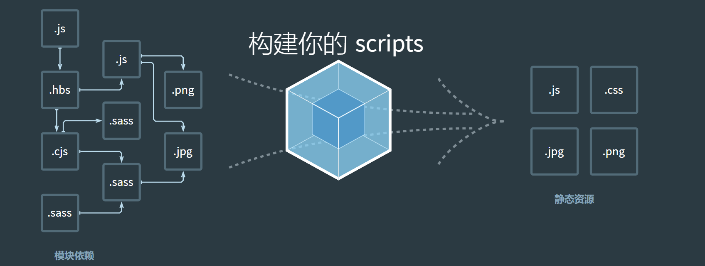

# 	webpack

```js
@title 'Webpack框架' 
@description 'Webpack5基本知识点，讲解了在脚手架项目中代码转化、babel、plugin等基本常识。以及如何从零搭建出一个项目'
@image 'https://gw.alipayobjects.com/zos/rmsportal/JiqGstEfoWAOHiTxclqi.png'
```

### 1、 初识webpack



**官方定义**：webpack是一个静态的模块化打包工具，应用于现代的JavaScript应用程序

解释：

```js
1、打包bundler：webpack可以将代码进行打包

2、静态的static：最终打包的代码是静态资源

3、模块化module：webpack默认支持各种模块化开发，如ES Module、CommonJS等 
```


脚手架是依赖于webpack的，目前前端三大框架的脚手架Vue-CLI、create-react-app、Angular-CLI都依赖于webpack。而webpack的运行依赖于Node，所以电脑上必须要有Node环境

> 注意：webpack各个版本之间不能相互兼容


**安装**

webpack的安装目前分为两个：`webpack、webpack-cli`

```javascript
npm install webpack webpack-cli –g # 全局安装
```

```javascript
npm install webpack webpack-cli –D # 局部安装 
```

使用局部webpack `npx webpack`

注意：在真正的开发过程中，用的更多的是局部安装。一个项目有对应该项目版本的webpack。并且在开发项目时，只需要安装webpack的开发时依赖，不需要运行时依赖。

webpack与webpack-cli之间的联系：

1、执行webpack命令，会执行node_modules下的.bin目录下的webpack

2、webpack在执行时是依赖webpack-cli的，没有安装就报错

3、而在webpack-cli中代码执行时，也需要用到webpack进行编译和打包


### 2、 webpack的基本使用

在js文件夹下创建两个函数，并用不同的规范导出

```javascript
//sum.js文件// ES6语法导出
export function addNum (a,b){return a + b ;}
```

```javascript
//mult.js文件
function mult (a,b) { return a * b}
// CommonJS的导出
module.exports = {mult}
```

将两个文件导入到入口文件index.js中

```javascript
import {addNum} from './js/Sum' // 获取通过es6导出的addNum函数
const {mult} = require('./js/mult') // 获取CommonJS导出的mult函数
console.log(addNum(10,20));
console.log(mult(10,20));
```

在index.html中引用入口文件index.js（注意需要开启服务器才能运行）

```html
<!-- 报错！！ 浏览器不能识别ES6语法，或者不能识别node语法-->
<!DOCTYPE html>
<html lang="en">
    <head><title>Document</title></head>
    <body>    
        //直接导出，浏览器识别不了    
        <!-- <script src="./index.js" type="module"></script> -->	
    </body>
</html>
```

解决：通过webpack将入口文件打包成浏览器能够识别的js代码，再引入

```javascript
webpack ./index.js -o ./dist
```

**自定义打包命令**

初始化：`npm init`

```javascript
// package.json
"scripts": {    "build": "webpack"  },
```

之后就可以通过`npm run build`进行打包

> 注意：源代码必须在src文件夹下，当执行`npm run build`打包时，webpack默认会到src文件夹下寻找index.js，所以src文件夹是必要的，index.js入口文件也是必要的

当然，也可以指定以哪个文件作为入口文件（可以不必是index.js），哪个文件夹作为出口文件夹（可以不必是dist）

```javascript
// npx webpack --入口 任意文件名  --出口 任意文件名
npx webpack --entry ./src/main.js --output-path ./build			
```

**最终解决方案：自定义打包**

综上所述的打包方式都是不是很方便，即使使用的是`npm run build`，也需要提前创建好src，并且将index.js文件创建好

所以，可以在项目中创建`webpack.config.js`文件，用来解决打包的路径文件问题

```javascript
const path = require("path");
module.exports = {    
    entry:"./src/main.js", //入口文件的位置    
                  
    output:{        
        path:path.resolve(__dirname,'./build'), 
        //利用node的内置对象path的resolve方法拼接当前文件的绝对路径和 ./build        
        filename:"bundle.js" 
        // 打包好的文件名
    }
} 
```

再次使用`npm run build`时，会执行webpack.config.js的代码，读取里边的信息，按照配置信息进行打包


### 3、 配置Loader

**什么是loader**

loader是文件加载器，能够加载资源文件，并对这些文件进行一些处理，诸如**编译**、**压缩**等，最终一起**打包**到指定的文件中，处理一个文件可以使用多个loader。（简单讲就是用于在编译过程中解析各类文件格式，并输出）


> 注意 loader的执行顺序和配置中的顺序是相反的，也就是说最后一个loader最先执行，第一个loader最后执行。


**loader配置方式**

rules属性对应的值是一个数组：**[Rule]**

数组中存放的是一个个的Rule，Rule是一个对象，对象中可以设置多个属性：

1、test属性：用于对 resource（资源）进行匹配的，通常会设置成正则表达式；

2、use属性：对应的值时一个数组：**[UseEntry]** 

例如：`use: [ { loader: 'style-loader'} ]）`

> 注意：如果UseEntry是一个对象，可以通过对象的属性来设置一些其他属性（options），如果没有其他属性，则可以简写

简写：`use: [ 'style-loader' ]`


```js
//案例
module.exports = {
    module:{
        rules:[
            {
                test:/\.css$/,
                use:[
                    "style-loader",
                    "css-loader"
                ]
            }
        ]
    }} 
```


**webpack打包css**

webpack默认可以识别CommonJS、ES6，但是不能识别css。如果想要识别css，必须安装css-loader

1、安装

 `npm install css-loader -d`

`npm install style-loader -d`

2、配置

```javascript
const path = require("path");
module.exports = {
    entry:"./src/main.js", //入口文件的位置
    output:{
        path:path.resolve(__dirname,'./build'),
        //利用node的内置对象path的resolve方法拼接当前文件的绝对路径和 ./build
        filename:"bundle.js"
        // 打包好的文件名
    },
    module:{
        rules:[
            {
                test:/\.css$/, //匹配模块中以.css文件结尾的
                //用法一（语法糖）
                // loader:"css-loader",
                // 用法二：（完整写法）
                use:[
                    // 注意顺序
                    "style-loader",
                    "css-loader"
                ]
            }
        ]
    }} 
```


**webpack打包less**

局部安装less ：`npm install less -d` 

```less
// test.less
@bgColor : #abc;
@fontSize : 30px;
#box2{
    background-color:@bgColor;
    font-size:@fontSize;
}
```

通过npx找到module包里边lessc转换为css：`npx lessc ./test.less demo.css`

```css
// demo.css（说明安装成功了）
#box2 {
    background-color: #abc;
    font-size: 30px;
}
```


通过webpack的方式就行打包less文件

1、安装less-loader: `npm install less-loader -d`

2、配置webpack.config.js文件

```javascript
    module:{
        rules:[
            {
                test:/\.less$/, //匹配模块中的.less结尾的文件
                use:[
                    "style-loader",
                    "css-loader",
                    "less-loader"
                ]
            }
        ]
    }
```

注意：webpack是从下往上执行loader的，过程为：先把less转为css，再由css转为浏览器能够识别的打包代码


 **webpack打包其他资源**

**1、打包图片资源**

安装loader：`npm install file-loader -d`

配置

```javascript
    module:{
        rules:[
            {
                test:/\.(jpg|png|jpeg|gif)/ ,
                use:[
                    "file-loader"
                ]
            }
        ]
    }
```

测试：

通过element.js向页面添加div元素，并设置类名为bg-img

```javascript
// 创建div标签
const bgdiv = document.createElement("div")
bgdiv.className = "bg-img"
// 将bgdiv添加进body
document.body.appendChild(bgdiv)
```

通过css将图片作为该div的背景图

```css
.bg-img{
    background-image: url('../img/b1.jpeg');
    width: 200px;
    height: 100px;
}
```

将文件都导入入口文件后进行打包，就可以看到图片被打包到了build文件夹下

如果有多种静态资源（如多个图片）都放在build文件夹下，结构会显得混乱。那么我们可以通过配置webpack的相关配置来规定路径

```javascript
    module:{
        rules:[
            {
                test:/\.(jpg|png|jpeg|gif)$/ ,
                use:{
                    loader:"file-loader",
                    options:{
                        // [ext]表示根据原有图片的后缀命名
                        name:'img/[name]_[hash:6].[ext]'
                        //[name]_[hash:6] 表示文件名的命名规则
                        outputPath: "img"
                    }
                }
            }
        ]
    }
```


**2、打包图片资源2**

原理：**url-loader和file-loader**的工作方式是相似的，但是可以将较小的文件，转成base64的URI。

在被打包好的文件夹中，不再能看见图片资源，默认情况下，url-loader会将所有图片资源转成base64编码

优点：占用更小的空间，有利于优化高并发

安装`npm install url-loader -d`

配置

```javascript
{
    test:/\.(jpg|png|jpeg|gif)/ ,
        use:{
            loader:"url-loader",
                options:{
                    name:'img/[name]_[hash:6].[ext]'
                }
        }
}
```

问题：但是对于体积较大的图片，一般不进行打包。因为打包出来的base64编码多，造成bundle.js文件体积过大，反而也会影响加载速度。

所以一般只对体积小的图片使用用url-loader

```javascript
{
    test:/\.(jpg|png|jpeg|gif)$/ ,
        use:{
            loader:"url-loader",
                options:{
                    name:'img/[name]_[hash:6].[ext]',
                    limit: 100*1024 
                    //即小于100kb的图片使用url-loader进行打包，大于的不使用
                }
        }
}
```


**3、打包图片资源3**

在webpack5中，**资源模块类型(asset module type)**，通过添加 4 种新的模块类型，来替换以下的 loader： 

**asset/resource** 发送一个单独的文件并导出 URL。之前通过使用 file-loader 实现；

**asset/inline** 导出一个资源的 data URI。之前通过使用 url-loader 实现；

**asset/source** 导出资源的源代码。之前通过使用 raw-loader 实现；

**asset** 在导出一个 data URI 和发送一个单独的文件之间自动选择。之前通过使用 url-loader，并且配置资源体

积限制实现；


webpack5实现`file-loader`打包图片的方式

```js
{
    test:/\.(jpg|png|jpeg|gif)$/ ,
    type: "asset/resource"
}
```

如果想要自定义输出路径及文件名

```js
output: {
    assetModuleFilename: "img/[name].[hash:6][ext]"
}
//或者
{
    test:/\.(jpg|png|jpeg|gif)$/ ,
    type: "asset/resource",
    generator: {
        filename: "img/[name].[hash:6][ext]"
    }
}
```


webpack5实现`url-loader`打包图片的方式

```js
{
    test:/\.(jpg|png|jpeg|gif)$/ ,
    type: "asset",
    generator: {
        filename: "img/[name].[hash:6][ext]"
    },
    parser: {
        dataUrlCondition: {
            maxSize: 100 * 1024
        }
    }
}
```


webpack5实现`raw-loader`打包字体图标等资源的方式

```js
{
    test:/\.ttg|eot|woff2?$/i ,
    type: "asset/resource",
    generator: {
        filename: "font/[name].[hash:6][ext]"
    },
}
```


### 4、 Plugin 插件

**是什么？**

plugin的功能更加强大，loader不能做的都是它做，它的功能要更加丰富，从打包优化和压缩，到重新定义环境变量，功能强大到可以用来处理各种各样的任务


**plugin与loader的区别**

loader适用于特定的模块类型进行转换，Plugin可以用于执行更加广泛的任务，比如打包优化、资源管理、环境变量注入等


**1、cleanWebpackPlugin**

功能：每次执行打包命令时，将原有的dist文件夹删除

安装：`npm install clean-webpack-plugin -d`

配置：

```javascript
    const {CleanWebpackPlugin} = require("clean-webpack-plugin");

    plugins:[
        new CleanWebpackPlugin()
        // CleanWebpackPlugin是一个类
    ]
```


**2、HtmlWebpackPlugin**

在打包的dist文件夹下根据webpack的模板生成index.html文件。

安装：`npm install html-webpack-plugin -d`

配置：  

```javascript
module.exports = {
    entry:"./src/main.js", //入口文件的位置
    output:{
        path:path.resolve(__dirname,'./build'),
        //利用node的内置对象path的resolve方法拼接当前文件的绝对路径和 ./build        
        filename:"js/bundle.js" 
        // 打包好的文件名
    },
        module:{
            rules:[]
        },
        plugins:[
            new CleanWebpackPlugin() ,
            // CleanWebpackPlugin是一个类
            new HtmlWebpackPlugin()
        ]} 
```

注：默认情况下是根据ejs模板来生成的inedx.html的，不是根据根目录下的


**自定义html模板**

如果不想使用ejs模板的index.html模板，想用自己自定义的html模板，如下vue3-cli模板

在根目录下创建public/index.html

```javascript
<!DOCTYPE html>
    <html lang="">
    <head>
    <meta charset="utf-8">
        <meta http-equiv="X-UA-Compatible" content="IE=edge">
            <meta name="viewport" content="width=device-width,initial-scale=1.0">    <link rel="icon" href="<%= BASE_URL %>favicon.ico">
                <title><%= htmlWebpackPlugin.options.title %></title>
	</head>

		<body>
    <noscript>
     	<strong>We're sorry but <%= htmlWebpackPlugin.options.title %> doesn't work properly without JavaScript enabled. Please enable it to continue.
     	</strong>
    </noscript>
    <div id="app"></div>
    <!-- built files will be auto injected -->
        </body>
    </html>
```

所以，当我们在配置HtmlWebPackPlugin时，我们可以添加如下的配置：

1、template：指定想要使用的模板所在的路径

```javascript
        plugins:[
                new HtmlWebpackPlugin({
                template:'模板路径'
            })
        ]
```


2、title：在进行htmlWebpackPlugin.options.title读取时，就会读到该信息；

但是此时使用`npm run build`进行打包时会报错，因为模板中还使用到一个**BASE_URL的常量**

解决：

使用**DefinePlugin**

DefinePlugin允许在编译时创建配置的**全局常量**，是一个webpack内置的插件（不需要单独安装）

配置

```javascript
const {DefinePlugin} = require('webpack');
plugins:[
    new CleanWebpackPlugin() ,
    // CleanWebpackPlugin是一个类
    new HtmlWebpackPlugin({
        template:'./public/index.html', 
        //根据这个html模板进行打包
    }) ,
    new DefinePlugin({
        BASE_URL:"'./'"
    })
]
```

此时打包就不会报错了


**3、CopyWebpackPlugin**

在vue的打包过程中，如果我们将一些文件放到public的目录下，那么这个目录会被复制到dist文件夹中。

因为public文件夹一般用于存放静态资源，不需要进行转换改变的资源。

这个复制的功能，我们可以使用CopyWebpackPlugin来完成；

安装：`npm install copy-webpack-plugin -d`

相关的配置：from:设置从哪一个源中开始复制，to:复制到的位置。globOptions:设置一些额外的选项，如要忽略的文件

```javascript
    plugins:[
        new CleanWebpackPlugin() ,// CleanWebpackPlugin是一个类
        new HtmlWebpackPlugin({
            template:'./public/index.html', //根据这个html模板进行打包
        }) ,
        new DefinePlugin({
            BASE_URL:"'./'"
        }),
        new CopyWebpackPlugin({
            patterns:[
                {
                    from:"public",
                    to:"./",
                    globOptions:{
                        ignore:[
                            "**/index.html" //除了index.html外，都复制过去
                        ]
                    }
                }
            ]
        })
    ]
```


### 5、 mode模式

Mode配置选项，可以告知webpack使用响应模式的内置优化： 

1、默认值是production（什么都不设置的情况下---生产阶段的代码，难以阅读调试）；

2、可选值有：'none' | 'development' | 'production'； 

```javascript
module.exports = {
    //设置模式
    //development 开发阶段，会设置development
    //production 准备打包上线的时候，设置production
    mode:"development",

    // 设置source-map，建立js映射文件，方便调试代码和错误
    devtool:"source-map",
    
    
    entry:"./src/main.js", //入口文件的位置
    output:{
        path:path.resolve(__dirname,'./build'), //利用node的内置对象path的resolve方法拼接当前文件的绝对路径和 ./build
        filename:"js/bundle.js" // 打包好的文件名
    },
    module:{
        
    },
    plugins:[]
} 
```


### 6、 Babel

**是什么**

Babel是一个工具链，主要用于旧浏览器或环境中将ES6+代码转换为向后兼容版本的JavaScript，包括：语法转换、源代码转换等


在实际开发中，我们很少直接去接触babel，但是babel对于前端开发来说，目前是不可缺少的一部分：

1、ES6+、TypeScript、开发react项目，都离不开Babel

2、学习Babel对于理解代码从编写到线上转变过程至关重要


**babel命令行的使用**

安装：

`npm install @babel/cli @babel/core -d`

1、@babel/core：babel的核心代码，必须安装

2、@babel/cli：可以让我们在命令行使用babel

使用：

`npx babel src --out-dir dist`

src : 是源文件目录

--out-dir : 指定要输出的文件夹dist


babel可以指定代码中的那些语法进行转换（使用插件），也可以使用预设（preset）:

安装：

`npm install @babel/preset-env -d`

使用：

`npx babel src --out-dir dist --presets=@babel/preset-env `


**webpack的babel-loader**

1、安装：

`npm install babel-loader -d`

`npm install @babel/core -d ` babel核心代码（必要）

`npm install @babel/preset-env -d` 预设插件

2、配置webpack.config.js

```javascript
    module:{
        rules:[
            {
                test:/\.js$/, //js结尾的文件使用babel进行打包转换
                use:{
                    loader:"babel-loader",
                    options:{
                        presets:[
                            "@babel/preset-env"
                        ]
                    }
                }
            }
        ]
    }
```

> 该预设会默认去根据.browserslistrc中需要适配的浏览器进行转换。如果没有.browserslistrc文件，可以在webpack的配置文件中指定适配的浏览器options: {presets: [ targets: [ "chrome 88" ] ]}

当babel插件的代码过多时，也可以将其抽取到一个单独的文件中`babel.config.js`中

```js
module.exports = {
    presets: [
        "@babel/preset-env"
    ]
}
```


同理，babel**解析jsx**也需要安装插件

`npm install @babel/preset-react -D `

```js
module.exports = {
    presets: [
        "@babel/preset-env",
        "@babel/preset-react"
    ]
}
```


使用babel**解析ts**代码

```js
//webpack.config.js
module: {
    rules: [
        {
            test: /\.ts$/,
            use: "babel-loader"
        }
    ]
}
```

使用ts插件`@babel/tranform-typescript`，更推荐直接使用预设：`@babel/preset-typescript`

```js
//babel.config.js
module.exports = {
    presets: [
        "@babel/preset-env",
        "@babel/preset-react",
        "@babel/preset-typescript"
    ]
}
```

> webpack转化ts代码其实也可以使用ts-loader，但是为什么要用babel-loader呢？因为ts-loader不能解析一些新特性语法（如promise等）但是可以检测类型错误，而babel-loader具备polyfill，但是却不能检测类型错误

所以比较好的方式是使用babel-loader的同时，在每次打包前利用ts进行类型检测

```js
//package.json
module.exports = {
    "script" : {
        "build": "webpack --config webpack.config.js",
        "type-check": "tsc --noEmit",
        "type-check-watch": "tsc --noEmit --watch"
    } 
}
```


### 7、polyfill

polyfill：填充物、补丁

在开发中我们有时会使用一些新的语法特性（例如Promise、Symbol等），但是部分浏览器不能识别这些特性，必然就会报错，这个时候就可以使用polyfill来填充一个补丁。


babel7.4之后，可以通过单独引入core-js和regenerator-runtime来完成polyfill的使用

`npm install core-js regenerator-runtime --save`

配置babel.config.js

```js
module.exports = {
    presets: [
        ["@babel/preset-env", {
            useBuiltIns: "usage",
            // false:不用任何polyfill相关的代码
            // useage: 代码中需要哪些polyfill，就引用相关的api
            // entry： 需要手动在入口文件中导入 core-js/ regenerator-runtime,之后根据目标浏览器引入所有对应
            // 的polyfill
            corejs: 3
            
        }]
    ]
}
```


### 8、 vue

在vue的开发过程中，有三种方式来编写DOM元素：

+ 方式一：template模板的方式

+ 方式二：render函数的方式，使用h函数来编写渲染的内容
+ 通过.vue文件的template来编写模板

vue在让我们选择版本的时候分为：`运行时+编译器` 与 ` 仅运行时`

1、运行时+编译器 包含了对template模板的编译代码，更加完整，但是也更大一些；

2、仅运行时，没有包含对template版本的编译代码，相对更小一些。


安装vue2：`npm install vue`

安装vue3：`npm install vue@next`

当我们向main.js中使用vue时，出现了警告

```javascript
import {createApp} from 'vue' //导入vue的createApp方法
const app = createApp({
    template:`<div>这是vue渲染出来的<div>`,
    data(){
        return{
            info:"hahahah"
        
    }
})
app.mount("#app")

```

由于webpack默认使用了 ‘ 仅运行时 ’ 版本的代码，不包含template的编译，所以无法渲染出来

修改`import {createApp} from 'vue/dist/vue.esm-bundler'`


安装`npm i vue-loader@next -d` 并配置

```javascript
// 配置.vue文件打包
{
    test:/.\vue$/,
    loader:"vue-loader"
}
```

打包时报错，因为vue-loader同时依赖于另外一个包:安装`npm i @vue/compiler-sfc -d `

同时需要再配置一个插件，该插件存在于vue-loader的包里，可以直接配置使用

```javascript
const {VueLoaderPlugin} = require("vue-loader/dist/index")

// 使用v-loader插件
new VueLoaderPlugin()
```


### 9、 webpack搭建本地服务

每次修改代码都需要使用`npm run build`打包编译代码，影响效率。

为了完成自动编译，webpack提供了几种可选的方式：

1、webpack watch mode

2、webpack-dev-server（常用）

3、webpack-dev-middleware


**1、webpack watch mode**

webpack提供了watch模式，在该模式下，webpack依赖于图中所有的文件，只要一个发生了更新，那么代码将重新编译

开启步骤一：

在导出的配置中，添加watch：true

```javascript
module.exports = {
    mode:"development",
    devtool:"source-map",
    watch:true
    }
```


开启步骤二：在启动webpack的命令中，添加--watch标识

```javascript
  "scripts": {
    "build": "webpack --watch"
  },
```


**2、webpack-dev-server**

通过配置watch的方式可以监听到文件的变化，但是事实上它本身没有自动刷新浏览器的功能，而是依赖了vscode的live-server插件

那么，如何在不适用live-serve的情况下，可以具备live reloading（实时重新加载）的功能?

安装：

`npm install webpack-dev-server -d`

配置：

```javascript
  "scripts": {
    "build": "webpack --watch",
    "serve":"webpack serve"
  },
```

注意：webpack-dev-server在编译之后不会写入到任何输出文件（即不进行任何打包），而是将bundle文件保留在内存中。事实上，它使用了一个名为menfs的库

另外，如果修改了webpack.confog.js里边的代码，还是要重新执行`npm run serve`命令

**dev-sercer的配置**

1、contentBase

```javascript
module.exports = {
	//dev-server的配置
    devServer:{
        contentBase:"./public" 
    }
}
```

在不使用CopyWebpackPlugin插件的情况下，该配置意味着public文件夹下的资源也可以在浏览器中呈现。

但是跟CopyWebpackPlugin相区别，contentBase不会将资源打包进bundle.js文件中。

该配置，可以有利于开发阶段，不想将大型public下的资源进行打包，浪费时间性能时可以使用


2、模块热替换（HMR）

HMR全称是Hot Module Replacement，是指在应用程序运行的过程中，添加、替换、删除模块，而**无须重新刷新整个页面**

优点：

+ 不重新加载整个页面，这样可以保留某些应用程序的状态不丢失
+ 只更新变化的内容，节省开发时间
+ 修改了css、js源代码，会立即在浏览器更新，相当于直接在浏览器的devtools中直接修改样式

如何使用?

默认情况下，webpack-dev-server支持HMR，只需要开启即可

```javascript
    target:"web", //针对web浏览器
    devServer:{
        hot:true //开启
    },
```

为需要操作的模块进行配置

```javascript
import add from './js/add'

if(module.hot) {
    module.hot.accept("./js/add.js",()=>{
        console.log("add文件热加载成功");
        //当该模块发生更新了，可以在这里额外做些什么
    })
}
```

这样一来，在add.js文件中更改内容，就可以进行热更新了


事实上，如果在vue中进行修改、替换、删减操作，不需要以上的操作，因为vue-loader中默认已经有HMR，开箱即用

3、host配置

host设置主机地址：默认是localhost，如果希望其他地方也可以访问，可以设置为0.0.0.0

```javascript
    devServer:{
        host: "0.0.0.0"
    },
```


localhost与0.0.0.0的区别：

1、localhost本质上是一个域名，通常情况下会被解析成127.0.0.1；

2、127.0.0.1：回环地址，表达的意识是主机自己发出去的包，直接被自己接收；

​		a、正常的数据库包经历：应用层-传输层-网络层-数据链路层-物理层

​		b、回环地址：在网络层直接被获取到了，是不会经历数据链路层和物理层的

​		c、比如监听127.0.0.1时，在同一网段下的主机中，通过ip地址是不能访问的；

3、0.0.0.0 :监听IPV4上所有的地址，再根据端口找到不同的应用程序；

​		a、比如监听0.0.0.0时，在同一网段下的主机中，通过ip地址是可以访问的


4、其他配置

**port**

设置监听的端口，默认情况下是8080

**open**

more是false，设置为true会打开浏览器

**compress**

默认值为false，设置为true会开启静态文件打包为gzip（性能优化）


5、proxy

proxy是开发中非常常用的一个配置选项，它的目的是设置代理来解决跨域访问问题。

**跨域问题 **：比如发送一个api请求时http://localhost:8888，但是本地启动服务器的域名是 http://localhost:8000.这是候发送网络请求就会出现跨域的问题。

解决方案：将请求先发送到一个代理服务器，代理服务器和API服务器没有跨域问题，就可以解决我们的跨域问题

案例

假设我们现在开启一个本地服务器http://localhost:8888，并向里边content请求内容.已知我们当前的服务器域名为http://localhost:8000，于是出现了跨域访问问题，导致请求数据失败

```javascript
// 测试跨域问题
import axios from 'axios'

axios.get("http://localhost:8888/content").then(res=>{
    console.log(res);
})
```

所以我们需要通过dev-server的代理来解决这个问题

```javascript
module.exports = {

    devServer:{
        proxy:{
            "/api": {
                //将/api代理到http://localhost:8888
                target:"http://localhost:8888",
                pathRewrite:{
                    "^/api" : ""
                }
            }
        }
    }
}
//为什么需要pathRewrite？
//是因为当我们在发送网络请求时axios.get("/api/content")，会被代理到http://localhost:8888/api/content，所以这里我们需要将/api置空
```

因为devServer本身就是一个express服务器，服务器与服务器之间不存在跨域关系（只有浏览器与服务器之间存在跨域限制），所以我们可以借助devServer来实现跨域访问


同时,发送网络请求的代码也要相应的进行修改

```javascript
import axios from 'axios'

axios.get("/api/content").then(res=>{
    console.log(res);
})
```

这样子就可以正常访问到想要的数据了


其他属性

```js
    devServer:{
        proxy:{
            "/api": {
                //将/api代理到http://localhost:8888
                target:"http://localhost:8888",
                pathRewrite:{
                    "^/api" : ""
                },
                secure: false， //默认情况下true表示不接收转发到https的服务器上，希望支持则false
                changeOrigin: true //表示是否更新代理后请求的headers中的host地址
            }
        }
    }
```


**3、webpack-dev-middleware**

自定义一个服务，帮助我们运行代码

安装：`npm install express webpack-dev-middleware`

```js
//server.js
const express = require('express')
const webpack = require('webpack')
const webapckDevMiddleware = require('webpack-dev-middleware')
const app = express()

const config = require('./webpack.config')
const cpmpiler = webpack(config)

const middleware = webapckDevMiddleware(cpmpiler)
app.use(middleware)

app.listen(3000, () => {
  console.log('服务在3000端口启动成功')
})
```

运行`node server.js`，可以看到在3000端口运行了一个服务，该服务即是本地代码的运行结果


### 10、 resolve模块解析

（用于起别名，引用文件的时候省略扩展名）

**resolve用于设置模块如何被解析**

1、在开发中我们会有各种各样的模块依赖，这些模块可能自己编写的代码，也可能是来自第三方库

2、resolve可以帮助webpack从每个require/import语句中，找到需要引入的合适的模块代码


+ 应用一：省略文件扩展名配置

```javascript
module.exports = {
    resolve:{
        extensions:['.js','.vue','.ts']
    }
}
```

之后引用文件由`import App from './vue/App.vue'`可变为 `import App from './vue/App'`

原理：如果导入的是一个文件，文件具有扩展名,则可以直接打包；否则，将使用resolve.extensions选项作为扩展名解析。

extensions的默认值：【'.wasm' , '.mjs' , '.js' , '.json'】


+ 应用二：起别名alias

1、当我们项目的目录结构比较深的时候，或者一个文件的路径需要.././../这种路径片段；就可以给某些常见的路径起一个别名

```javascript
const path = require('path')
module.exports = {
        resolve:{
        alias: {
            "js":path.resolve(__dirname,"./src/js"),
            "@":path.resolve(__dirname,"./src")
        }
    }
}
```

之后就可以在导入文件的时候使用别名了

```javascript
import add from 'js/add'
const {mult} = require("js/mult")
```

### 11、postcss

postCSS是一个通过js来转换样式的工具，可以帮助我们进行一些css的转换和适配，例如自动添加浏览器前缀、css样式的重置

> 由于该工具本身的功能很少，所以通常为了实现一些功能需要安装对应的插件

**独立使用**

安装：`npm i postcss postcss-cli -d	`

> postcss-cli允许我们在命令行中使用postcss这个工具

转换css

```css
/* 以下css代码存在浏览器兼容问题 */
:fullscreen {
    
}
.content {
    user-select: none;
    transition: all 2s ease;
}
```

`使用 npx postcss -o result.css ./src/css/test.css`

输出成功，但是结果并不是我们想要的，因为添加浏览器适配这一功能需要安装额外的插件

安装插件：`npm install autoprefixer -d`

使用插件进行转换：`npx postcss --use autoprefixer -o result.css ./src/css/test.css`

```css
/* result.css */
:-webkit-full-screen {
    
}
:-ms-fullscreen {
    
}
:fullscreen {
    
}
.content {
    -webkit-user-select: none;
       -moz-user-select: none;
        -ms-user-select: none;
            user-select: none;
    transition: all 2s ease;
}
```


**在webpack中使用**

安装：`npm install postcss-loader -d`

```js
// webpack.config.js
{
    loader: "postcss-loader",
	options: {
        postcssOptions: {
            plugins: [
                require("autoprefixer")
            ]
        }
    }
}
```

现在，可以在使用任意css而不用考虑浏览器的兼容了，因为postcss会自动给它加上前缀

> 注意：postcss需要使用在css loader、style loader之前


**最终使用**

事实上，我们可以安装`postcss-preset-env`这个插件，该插件默认集成了autoprefixer，并且也拓展了一些其他新功能，例如可以帮助我们将一些现代的css特性，转换成大多数浏览器认识的css，并且根据目标浏览器或者运行时环境添加所需要的polyfill

安装：`npm i postcss-preset-env -d`

使用

```js
{
    loader: "postcss-loader",
	options: {
        postcssOptions: {
            plugins: [
                // require("autoprefixer") 不需要了
                require("postcss-preset-env")
            ]
        }
    }
}
```


简化代码

```js
{
    test: /\.css$/,
    use: [
        "style-loader",
        "css-loader",
        "postcss-loader"
    ]
}
```

具体的options配置可以在根目录下创建一个`postcss.config.js`

```js
module.exports = {
    plugins: [
        require("postcss-preset-env")
    ]
}
```


存在的问题：当解析css文件时，如果该文件引用了其他css文件，那么引入的css文件不会被postcss-loader解析。例如index.css引用了other.css，那么other.css不会被解析

解决：当css文件存在引用关系时，让其从下往上执行一次解析流程

```js
{
    test: /\.css$/,
    use: [
        "style-loader",
        "css-loader": {
        	options: {
        		importLoaders: 1
        	}
        },
         "postcss-loader"
    ]
}
```


### 12、eslint

安装：`npm install eslint -d`

定义规范：`npx eslint --init`

```js
> To check syntax only //仅检查语法
  To check syntax and find problems //检查语法、找出错误
  To check syntax, find problems, and enforce code style //检查语法、找出错误并规定代码风格
```

最终生成`eslintrc.js`文件

```js
module.exports = {
    "env": { //运行环境
        "browser": true,
        "commonjs": true,
        "es2021": true
    },
    "extends": "eslint:recommended", // 扩展当前的配置
    "parserOptions": { // 这里指定ESMAscript的版本
        "ecmaVersion": "latest"
    },
    "rules": { // 自定义规则
    }，
    "plugins": {} //插件
}
```


```js
// src/index.js
const name = "hehehe"
console.log(name)
```

检验： `npx eslint ./src/index.js`

```js
  1:14  error    Strings must use singlequote                     quotes
  1:22  error    Expected linebreaks to be 'LF' but found 'CRLF'  linebreak-style
  1:22  error    Missing semicolon                                semi
  2:1   warning  Unexpected console statement                     no-console
  2:18  error    Newline required at end of file but not found    eol-last
  2:18  error    Missing semicolon                                semi
```

如果不想要某些语法被归类为错误，可以在`eslintrc.js`文件中关闭

```js
  rules: {
    semi: 'off', //这里有三个取值，默认是error(2)，也可以设置为warn(1)或者直接关闭off(0)
  },
```


**在webpack中使用eslint**

安装loader：`npm install eslint-loader -D`

```js
{
    test: /\.js$/,
    exclude: /node_moudles/,
    use: [
        "babel-loader",
        "eslint-loader"
    ]
}
```

这样在进行打包时，进行babel转化前先进行代码规范检测


**编译阶段校验代码规范**

例如在vscode中使用**ESLint插件**，该插件会默认读取项目中的`eslintrc.js`文件，没有则使用自身的规则。

使用该插件的好处在于，在编译阶段就可以报出格式错误，便于直接修改


**格式化Prettier-Code formatter**

Prettier 是一款强大的代码格式化工具，支持 JavaScript、TypeScript、CSS、SCSS、Less、JSX、Angular、Vue、GraphQL、JSON、Markdown 等语言，基本上前端能用到的文件格式它都可以搞定，是当下最流行的代码格式化工具。

安装

在vscode中安装该插件，并在设置中找到`Editor:Default Formatter`，设置为`Prettier-Code formatter`

该插件有自己的规则，当然也可以通过`.prettierrc`进行自定义


配置.prettierrc文件：

```js
* useTabs：使用tab缩进还是空格缩进，选择false；
* tabWidth： tab是空格的情况下，是几个空格，选择2个；
* printWidth：当行字符的长度，推荐80，也有人喜欢100或者120；
* singleQuote：使用单引号还是双引号，选择true，使用单引号；
* trailingComma：在多行输入的尾逗号是否添加，设置为 `none`；
* semi：语句末尾是否要加分号，默认值true，选择false表示不加；
```


创建.prettierignore忽略文件

```
/dist/*
.local
.output.js
/node_modules/**

**/*.svg
**/*.sh

/public/*
```

> 注：ESLint与prettier都是规范代码，两个有时会有一些冲突。比如在prettier中规定单引号，在ESLint规定双引号就会产生冲突，需要进行配置


### 13、环境分离

在上述的代码实践中，我们的配置代码都是在`webpack.config.js`中，但是在生产环境与开发环境下，所需要的配置是不相同的。（例如在生产环境下，不需要devServer）


**方式一**

新建config文件夹，并在其中分别创建`webpack.common.js/webpack.prod.js/webpack.dev.js`

在执行命令时区分不同的环境

```js
//package.json
{
"scripts": {
    "build": "webpack --config ./config/webpack.prod.js", //打包时使用生产环境的配置
    "serve": "webpack serve --config ./config/webpack.dev.js" //开发时使用开发环境配置
  },
}
```


**方式二**

通过传递参数的方式告知当前环境

```js
//package.json
{
"scripts": {
    "build": "webpack --config ./config/webpack.common.js --env production", //传递production：true
    "serve": "webpack serve --config ./config/webpack.common.js --env development"
  },
}
```

在`webpack.common.js`中，获取到传递过来的参数，以此判断环境

```js
//webpack.common.js
const path = require('path')

module.exports = function(env) {
  console.log('env', env)

  return {
    entry: "./src/index.js",//该路径并不是相对于文件所在的路径，而是相对于context配置的路径
    output: {
      filename: "bundle.js",
      path: path.resolve(__dirname, './build')
    },
  }
}

//env：{ WEBPACK_BUNDLE: true, WEBPACK_BUILD: true, prodution: true }
```


**分离代码**

```js
//webpack.config.js
const path = require('path')
const { CleanWebpackPlugin } = require('clean-webpack-plugin')
const HtmlWebpackPlugin = require('html-webpack-plugin')

module.exports = {
  mode: "development",
  devtool: "source-map",

  entry: "./src/index.js",
  output: {
    filename: "bundle.js",
    path: path.resolve(__dirname, './build')
  },
  devServer: {
    hot: true
  },
  resolve: {
    extensions: ['.js', '.vue', '.ts'],
    alias: {
      "@": path.resolve(__dirname, "./src")
    }
  },
  module: {
    rules: [
      {
        test: /\.js$/,
        use: {
          loader: 'babel-loader'
        }
      }
    ]
  },
  plugins: [
    new CleanWebpackPlugin(),
    new HtmlWebpackPlugin({
      template: './index.html'
    })
  ]
}
```

分离到`webpack.common.js`

```js
const path = require('path')
const HtmlWebpackPlugin = require('html-webpack-plugin')
const devConfig = require('./webpack.dev')
const prodConfig = require('./webpack.prod')
const { merge } = require('webpack-merge')

const commonConfig = {
  entry: "./src/index.js",
  output: {
    filename: "bundle.js",
    path: path.resolve(__dirname, '../build')
  },
  resolve: {
    extensions: ['.js', '.vue', '.ts'],
    alias: {
      "pages": path.resolve(__dirname, "./src/pages")
    }
  },
  module: {
    rules: [
      {
        test: /\.js$/,
        use: {
          loader: 'babel-loader'
        }
      }
    ]
  },
  plugins: [
    new HtmlWebpackPlugin({
      template: './index.html'
    })
  ],
}

module.exports = function(env) {
  
  const isProduction = env.production
  console.log('env', isProduction)
  return isProduction? merge(commonConfig, prodConfig) : merge(commonConfig,devConfig)
}
```

分离到`webpack.dev.js`

```js
module.exports = {
  mode: "production"
}
```

分离到`webpack.prod.js`

```js
const { CleanWebpackPlugin } = require('clean-webpack-plugin')

module.exports = {
  mode: "development",
  plugins: [
    new CleanWebpackPlugin(),
  ],
  devServer: {
    hot: true
  }
}
```

其中，需要安装`npm install webapck-merge -D`，将通用配置合并到对应环境的文件

```js
//package.json
  "scripts": {
    "build": "webpack",
    "serve": "webpack serve",
    "build2": "webpack --config ./config/webpack.common.js --env production",
    "serve2": "webpack serve --config ./config/webpack.common.js --env development"
  },
```

这样一来，运行`npm run build2`就会合并运行`webpack.common.js`和`webpack.dev.js`中的配置

运行`npm run serve2`就会合并运行`webpack.common.js`和`webapck.prod.js`中的配置


### 14、代码分离

代码分离是将代码分离到不同的bundle中，之后我们可以按需加载

不分离代码的话，所有代码都在一个bundle.js文件中，下载慢从而影响首页加载速度

> 只要是异步引用的代码，webpack都会进行分离


常见的方式有三种：

+ 入口起点：使用entry配置手动分离代码
+ 防止重复：使用`Entry Ddpendencies`或者`SplitChunksPlugin`去重和分离代码
+ 动态导入：通过模块的内联函数调用分离代码


**方式一**

假设入口文件`index.js`中有home、about的代码，我们可以将其分成两个文件`home.js`和`about.js`

配置多个入口文件

```js
//webpack.config.js
module.exports = {
  mode: "development",
  entry: {
    home: "./src/home.js",
    about: "./src/about.js"
  },
  output: {
    filename: "[name].bundle.js",
    path: path.resolve(__dirname, './build')
  }
}
```

这样打包出来就有`home.bundle.js`和`about.bundle.js`


但是这种方式存在问题：当两者都引入一些库时，都会被重复打包（home.bundle.js打包一份，about.bundle.js也会打包再一次）


**方式二：splitChunks**

该插件webpack已默认安装与集成

```js
const path = require('path')
const TerserPlugin = require('terser-webpack-plugin')

module.exports = {
  mode: "development",
  entry: {
    main: "./src/main.js",
    index: "./src/index.js"
  },
  output: {
    filename: "[name].bundle.js",
    path: path.resolve(__dirname, './build')
  },
  optimization: {
    minimizer: [
      new TerserPlugin({
        extractComments: false
      })
    ],
    splitChunks: {
      // async 异步导入
      // initial 同步导入
      // 异步/同步导入
      chunks: "all"
    },
  },
}
```

splitChunks的其他属性

```js
    splitChunks: {
      chunks: "all",
      minSize: 20000, //拆出来的包的最小尺寸：必须达到这个值，否则不进行拆分
	  maxSize: 30000, //拆出来的包大于该值，再次进行拆分（需大于minSize）
      minChunks: 2, // 表示引入的包，至少被导入了几次才进行拆分
      cacheGroups: { //根据匹配到的文件夹/文件名,进行单独打包
        vendor: {
          test: /[\\/]node_modules[\\/]/,
          filename: "[id]_vendors.js"
        },
        default: {
          minChunks: 2,
          filename: "common_[id].js"
        }
      }
    },
```


**方式三**

**懒加载**

在需要的时候再将代码下载并执行

```js
//例如可以创建一个按钮，点击时才引入相关的代码文件
button.addEventListener("click", () => {
    import(/* webpackChunkName: '自定义文件名' */"./foo").then(res => {
        console.log(res)
    })
})
```

在这种懒加载情况下，仅有点击时浏览器才会去下载代码，并执行代码

问题：但是当加载的文件过大、过慢时，也会影响用户体验。能否利用浏览器的空闲时间，主动进行预下载，这样当需要用到该文件时，直接执行即可（省去了下载的时间）


```js
//解决：利用浏览器空闲预加载——魔法注释

button.addEventListener("click", () => {
    import(
        /* webpackChunkName: '自定义文件名' */
        /* webpackPrefetch: true */
        "./foo").then(res => {
        console.log(res)
    })
})
```


### 15、其他性能优化配置

**1、CDN**

在开发中，我们使用CDN的两种方式：

一、打包所有的静态资源，放到CDN服务器，用户所有资源都是通过CDN服务器加载的

二、一些第三方资源放到CDN服务器上


使用

需要购买CND服务器，并将资源放置在上边

```js
//webapck.config.js
  output: {
    filename: "[name].bundle.js",
    path: path.resolve(__dirname, './build'),
    publicPath: "https://linzm.com/cdn/"
  },
```

这样一来，资源都会从CDN上进行加载

```html
</script><script defer="defer" src="https://linzm.com/cdn/index.bundle.js">
```


**第三方库的CDN服务器**

中小型企业可能没有购买的CDN，但是将一些频繁使用的大型库（lodash、dayjs、vue、react）打包部署，又十分消耗性能，导致打包的文件十分大。

这时候，就可以利用第三方库已有的CDN服务器。利用这些CDN，我们完全可以不用再将lodash等大型库进行打包了


通常一些比较出名的开源框架都会将打包后的源码放到一些比较出名、免费的CDN服务器上：

+ 国际上出名的有：unpkg、JSDelivr、cdnjs
+ 国内：bootcdn


应用

```js
//webpack.config.js
module.exports = {
  externals: { //将不需要打包的库罗列出来
    "loadsh": "_", //key: 全局对象
    "dayjs": "dayjs"
  },
}
```

此时打包后的文件不再包含这两个库的代码

之后在html模板中直接引用这两个库CDN

```html
//index.html
<body>
  <div id="app"></div>
  <script src="https://cdnjs.cloudflare.com/ajax/libs/dayjs/1.11.3/dayjs.min.js"></script>
  <script src="https://cdnjs.cloudflare.com/ajax/libs/lodash.js/4.17.21/lodash.min.js"></script>
</body>
```


**2、miniCssExtractPlugin**

实现将css代码抽离到css文件中

安装：`npm install mini-extract-plugin -D`

```js
//webpack.config.js
const MiniCssExtractPlugin = require('mini-css-extract-plugin')
module.exports = {
  module: {
    rules: [
      {
        test: /\.css$/,
        use: [
          // "style-loader", //生产环境需要
          MiniCssExtractPlugin.loader, // 开发环境需要
          "css-loader"
        ]
      }
    ]
  },
  plugins: [
    new MiniCssExtractPlugin({
      filename: "css/[name].[hash:8].css"
    })
  ]
}
```


**3、DLL库**

DLL（动态链接库Dynamic Link Library），是为软件在Windows中实现共享函数库的一种实现方式。

webapck中也有内置的DLL功能，它可以将可共享的，不经常改变的代码抽取成一个公共的库。这个库在之后编译的过程中，会被引入到其他项目的代码中。


使用

+ 打包一个DLL库
+ 项目中引入DLL库


> 注意：目前出名的脚手架都移除了DLL库


**4、Terser**

Terser是一个对JavaScript进行解释（Parser）、丑化（Mangler）、压缩（Compressor）的工具集

terset是一个独立的工具，所以可以独立安装`npm install terser`

使用：

`npx terser inputfiles -o outputfile`

但是运行以上命令会发现它仅仅是删除了空格。要更大力度的压缩需要增加一些参数

例如：删除不可达的代码

`npx terser ./src/index.js -o index.min.js -c dead_code=true`

例如：丑化代码

`npx terser ./src/index.js -o index.min.js -m toplevel=true`


**在webpack中使用terser**

webpack5默认安装了terser-webpack-plugin，在production环境下会应用该插件

当然我们也可以进行自定义设置


```js
//webapck.config.js
const TerserPlugin = require('terser-webpack-plugin')
module.exports = {
  optimization: {
    minimizer: [
      minimize: true
      new TerserPlugin({
        extractComments: false
      })
    ],
  }
}
```


**css压缩**

css压缩通常是去除无用的空格，因为很难修改选择器、属性等

通常使用的插件：`npm install css-minimizer-webpack-plugin -D`

使用

```js
const CssMinimizerPlugin = require('css-minimizer-webpack-plugin')
module.exports = {
    plugins: [
        new CssMinimizerPlugin()
    ]
}
```


### 16、Tree Shaking

Tree Shaking是一个术语，在计算机中表示消除死代码。


在webpack中实现Tree Shaking有两种方案

**1、usedExports**

该方式的目的在于标注出哪些代码是未被使用的（打上注释），之后terser根据这些注释，进行删除。

```js
//webpack.config.js
module.exports = {
    optimazation:{
        usedExports: true //在production模式下，默认为true
    }
}
```


**2、sideEffects**

该方式用于告知webpack comoiler哪些**模块**具有副作用，有副作用就不进行删除


使用方式：在package.json中设置sideEffect值，false即表示可以删除所有未用到的exports，如果希望保留一些有副作用的模块，可以设置为数组（例如css文件）

```js
//假设format模块具有副作用，不想被删除
{
    "sideEffects": [
        "./src/util/format.js",
        "**.css"
    ]
}
```


但是上边的两种方式都是针对于JavaScript代码的Tree Shaking，对于css不起作用

css中有时候也会存在未被使用的代码，则需要利用一些插件实现摇树功能


**css实现Tree Shaking**

安装`PurgeCss`的webpack插件 `npm install purgecss-webpack-plugin`

```js
//webpack.config.js
const PurgecssPlugin = require('purgecss-webpack-plugin')
const glob = require('glob')
module.exports = {
    plugins: [
        new PurgecssPlugin({
            // 匹配到src文件夹下的所有css文件（不包括文件夹）
          paths: glob.sync('./src/**/*', {nodir: true}),
          safelist: function() {
            // 添加白名单，以下属性均会被加入到打包中
            return {
              standard: ["body", "html"]
            }
          }
        })
    ]
}
```

> glob该库为webpack默认安装，这里用于帮助匹配文件

这样子一来，只要是没用过的css代码，就会被删除掉


### 17、HTTP压缩

HTTP压缩是一种内置在服务器和客户端之间的，以改进传输速度和带宽利用率的方式

**流程**

+ HTTP数据在服务器发送前已经被压缩（可在webpack中完成）
+ 兼容的浏览器在向服务器发送请求时，会告知服务器自己支持哪些压缩格式`Accept-Encoding:gzip`
+ 服务器在浏览器的压缩格式下，直接返回对应的压缩后的文件，并且在响应头告知浏览器`Content-Encoding: gzip`

**压缩格式**

常见的有以下几种

1、compress（不推荐使用）

2、deflate -（基于deflate算法的压缩，使用zlib数据格式封装）

3、gzip - （GNU zip格式，是目前使用比较广泛的压缩算法）

4、br - （一种新的开源压缩算法，专为HTTP内容的编码而设计）


**webpack对文件压缩**

webpack中相当于是实现了HTTP压缩的第一步操作，可以使用CompressionPlugin

安装：`npm install compression-webpack-plugin -D`

```js
const CompressionPlugin = require("compression-webpack-plugin")
module.exports = {
    plugins: [
        new CompressionPlugin({
            test: /\.(css|js)$/i
        })
    ]
}
```

可以看到打包的的文件夹中出现了许多`.gz`结尾的文件