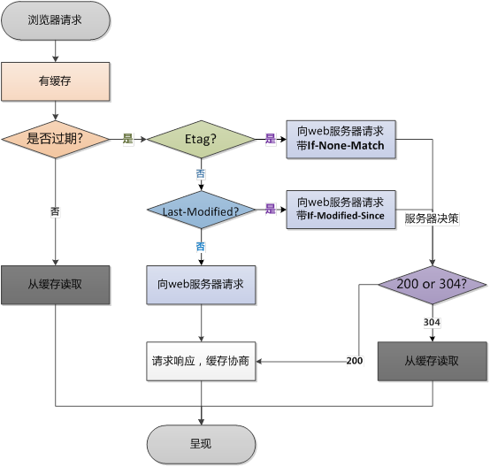

# Web基础

## 一、http和https

### 1、http 和 https 的基本概念

**http：**超文本传输协议，是互联网上应用最为广泛的一种网络协议，是一个客户端和服务器请求和应答的标准（TCP），用于从WWW服务器传输超文本到本地浏览器的传输协议，它可以使浏览器更加高效，使网络传输减少

**https：**是以安全为目标的http通道，简单讲是http的安全版，即HTTP下加入SSL层，HTTPS的安全基础是SSL，因此加密的详细内容就需要SSL（https的SSL加密是在传输层实现的）

https协议的主要作用是：建立一个信息安全通道，来确保数据的传输，确保网站的真实性。

### 2、http和https的区别

1、https协议需要ca证书，费用较高

2、http是超文本传输协议，信息是明文传输，https则是具有安全性的ssl加密传输协议

3、使用不同的链接方式，端口也不同，http协议默认端口：80，https默认端口：443

4、http的链接很简单，是无状态的；https协议是由SSL+HTTP协议构建的可进行加密传输、身份认证的网络协议、比http协议安全

### 4、http状态码

**概述**

http状态码（http status code）是用来表示http响应状态的数字代码。http状态码非常多，可以根据不同的情况，给客户端返回不同的状态码

**1xx状态码** 

| 1xx状态码                   | 表示目前是协议处理的中间状态，还需要后续操作                    |
| ------------------------ | ----------------------------------------- |
| 101——Switching Protocols | 在HTTP升级为websocket的时候，如果服务器同意变更，就会发送状态码101 |

**2xx状态码**

| 2XX——Success成功状态码         | 2XX响应的结果表明请求被正常处理了                           |
| ------------------------- | -------------------------------------------- |
| 200——OK（成功）               | 表示从客户端发送的请求在服务器端被正常处理了                       |
| 204——No Content 无内容       | 表示服务器接收到请求已成功处理，但是不用返回数据，浏览器不用刷新页面，也不用导向新的页面 |
| 206——Partial Content 部分内容 | 该状态码表示客户端进行了范围请求，而服务器成功执行了这部分的GET请求          |

**3xx状态码**

| 3XX——Redirection（重定向状态码）     | 表明浏览器需要执行某些特殊的处理以正确处理请求                                                      |
| ---------------------------- | ---------------------------------------------------------------------------- |
| 301——Moved Permanently 永久重定向 | 请求的资源已经永久移动到新位置                                                              |
| 302——Found 临时性重定向            | 资源的URL临时定位到了其他位置，希望用户本次能使用新的URL访问                                            |
| 303——See other 查看其他位置        | 与302类似，资源的URL已更新。不同在于客户端应当采用GET方法来获取资源                                       |
| 304——Not Modified 未修改        | 客户端发送附带条件的请求时，服务器端允许访问资源，但未满足条件。（条件指请求报文中包含If-none-Match、If-Modified-Since等） |

注:304虽然被划分在3xx中，但是和重定向没有关系

**4xx状态码**

| 400——Bad Request 错误请求        | 服务器不理解请求的语法     |
| ---------------------------- | --------------- |
| 401——Unauthorized 未授权        | 请求要求身份验证        |
| 403——Forbidden 禁止            | 服务器拒绝请求         |
| 4xx——Client Error 客户端错误状态码   | 表明客户端是发生错误的原因所在 |
| 404——Not Found 未找到           | 服务器找不到请求的网页     |
| 405——Method Not Allowed 方法禁用 | 服务器禁止使用该方法      |

**5xx状态码**

| 5xx_Server Error 服务器错误状态码          | 表明服务器本身发生错误                       |
| ---------------------------------- | --------------------------------- |
| 500——Internal Server Error 服务器内部错误 | 服务器在执行请求时发生了错误                    |
| 502——Bad Gateway 错误网关              | 表明扮演网关或代理角色的服务器，从上游服务器中接收到的响应是无效的 |
| 503——Service Unavailable 服务不可用     | 由于超载或系统维护，服务器暂时的无法处理客户端的请求        |

常见的状态码

| 状态代码 | 状态描述                  | 说明                         |
| ---- | --------------------- | -------------------------- |
| 200  | OK                    | 客户端请求成功                    |
| 400  | Bad Request           | 客户端请求的语法错误，服务器无法理解         |
| 401  | Unauthorized          | 请求要求用户的身份认证                |
| 403  | Forbidden             | 服务器收到请求，但是拒绝提供服务           |
| 404  | Not Found             | 服务器无法根据客户端的请求找到资源（网页）      |
| 500  | internal server error | 服务器内部错误，无法完成请求             |
| 503  | service unavailable   | 由于超载或系统维护，服务器暂时的无法处理客户端的请求 |

### 5、http常见的请求方法

http1.0定义了三种：get、post、head

http1.1新增了五种：options、put、delete、trace、connect

| 方法   | 描述                                                               |
| ---- | ---------------------------------------------------------------- |
| GET  | 请求指定的页面信息，并返回实体主体                                                |
| POST | 向指定资源提交数据进行处理请求（提交表单、上传文件）。数据被包含在请求体中，post请求可能会导致新的资源建立或者已有资源的修改 |

### 6、GET和POST的区别

**不同**

1、基本概念不同

GET-从指定的资源请求数据

POST-向指定的资源提交要被处理的数据

2、get参数通过url传递，post放在request body（请求体中）

3、get请求在url中传递的参数时有长度限制的，而post没有

4、get比post更不安全，因为参数直接暴露在url中，不能用来传递敏感信息

5、get请求只能进行url编码，而post支持多种编码方式

6、get请求参数会被完整保留在浏览历史记录里，而post中的参数不会被保留

7、get产生一个TCP数据包；post产生两个tcp数据包

对于get方式的请求，浏览器会把http、header和data一并发送出去，服务器响应200（返回数据）；

对于post，浏览器先发送header，服务器响应100 continue，浏览器字啊发送data，服务器响应200 ok（返回数据）

**相同**

GET和POST的底层都是TCP/IP，GET/POST都是TCP链接

### 7、http常见请求头

客户端发送一个http请求到服务器的请求消息包括一下格式：**请求行（request line）、请求头部（header）、空行和请求数据**

| 请求头               | 说明                                                                                                                            |
| ----------------- | ----------------------------------------------------------------------------------------------------------------------------- |
| `Host`            | 发送请求时，该头域是必需的。主要用于指定被请求资源的Internet主机和端口，它通常从HTTP URL中提取出来的                                                                    |
| `Accept`          | 浏览器可接受的MIME类型。例如：Accept：text/html代表浏览器可以接受服务器回发的类型为text/html,即HTML文档；Accept：* / * 代表浏览器可以处理所有类型                               |
| `Accept-Encoding` | 浏览器能够进行解码的数据编码方式。通常指定压缩方法，是否支持压缩，支持什么压缩方法（gzip、deflate）。注：如果请求消息中没有设置这个域，服务器假定客户端对各种内容编码都可以接受                                 |
| `Accept-Charset`  | 浏览器可接受的字符集。注：请求消息中没有设置这个域，表示任何字符集都可以接受                                                                                        |
| `Accept-Language` | 浏览器申明自己接收的语言。注：语言跟字符集的区别：中文是语言，中文有很多字符集（gbk、gb2312等）。例如：Accept-Language：en-us                                                 |
| `User-Agent`      | 告知http服务器，客户端使用的操作系统和浏览器的名称和版本                                                                                                |
| `Content-Length`  | 表示请求信息正文的长度                                                                                                                   |
| `Referer`         | 包含一个URL，用户从该URL代表的页面触发访问当前请求的页面                                                                                               |
| `Cookie`          | 最重要的请求头之一，将cookie的值发送给HTTP服务器                                                                                                 |
| `Connection`      | connettion:keep-alive表示当一个页面打开完成后，客户端和服务器之间用于传输HTTP数据的TCP连接不会关闭，如果客户端再次访问这个服务器上的网页，会继续使用这一条已经建立的连接                            |
| `Authorization`   | 授权信息，通过出现在对服务器发送的WWW-Authenticate头应答中。主要用于证明客户端有权查看某个资源。当浏览器访问一个页面时，如果收到服务器的响应代码401，可以发送一个包含Authorization请求报文域的请求，要求服务器对其进行验证 |

### 8、http常见响应头

HTTP响应也由四个部分组成，分别是：状态行、消息报头、空行和响应正文

| 应答头              | 说明                                                                                                                                                                                                                                                                                                                                                                                                                                                                                       |
|:---------------- |:---------------------------------------------------------------------------------------------------------------------------------------------------------------------------------------------------------------------------------------------------------------------------------------------------------------------------------------------------------------------------------------------------------------------------------------------------------------------------------------- |
| Allow            | 服务器支持哪些请求方法（如GET、POST等）。                                                                                                                                                                                                                                                                                                                                                                                                                                                                 |
| Content-Encoding | 文档的编码（Encode）方法。只有在解码之后才可以得到Content-Type头指定的内容类型。利用gzip压缩文档能够显著地减少HTML文档的下载时间。Java的GZIPOutputStream可以很方便地进行gzip压缩，但只有Unix上的Netscape和Windows上的IE 4、IE 5才支持它。因此，Servlet应该通过查看Accept-Encoding头（即request.getHeader("Accept-Encoding")）检查浏览器是否支持gzip，为支持gzip的浏览器返回经gzip压缩的HTML页面，为其他浏览器返回普通页面。                                                                                                                                                                                                |
| Content-Length   | 表示内容长度。只有当浏览器使用持久HTTP连接时才需要这个数据。如果你想要利用持久连接的优势，可以把输出文档写入 ByteArrayOutputStream，完成后查看其大小，然后把该值放入Content-Length头，最后通过byteArrayStream.writeTo(response.getOutputStream()发送内容。                                                                                                                                                                                                                                                                                                               |
| Content-Type     | 表示后面的文档属于什么MIME类型。Servlet默认为text/plain，但通常需要显式地指定为text/html。由于经常要设置Content-Type，因此HttpServletResponse提供了一个专用的方法setContentType。                                                                                                                                                                                                                                                                                                                                                           |
| Date             | 当前的GMT时间。你可以用setDateHeader来设置这个头以避免转换时间格式的麻烦。                                                                                                                                                                                                                                                                                                                                                                                                                                            |
| Expires          | 应该在什么时候认为文档已经过期，从而不再缓存它？                                                                                                                                                                                                                                                                                                                                                                                                                                                                 |
| Last-Modified    | 文档的最后改动时间。客户可以通过If-Modified-Since请求头提供一个日期，该请求将被视为一个条件GET，只有改动时间迟于指定时间的文档才会返回，否则返回一个304（Not Modified）状态。Last-Modified也可用setDateHeader方法来设置。                                                                                                                                                                                                                                                                                                                                              |
| Location         | 表示客户应当到哪里去提取文档。Location通常不是直接设置的，而是通过HttpServletResponse的sendRedirect方法，该方法同时设置状态代码为302。                                                                                                                                                                                                                                                                                                                                                                                                 |
| Refresh          | 表示浏览器应该在多少时间之后刷新文档，以秒计。除了刷新当前文档之外，你还可以通过setHeader("Refresh", "5; URL=http://host/path")让浏览器读取指定的页面。 注意这种功能通常是通过设置HTML页面HEAD区的＜META HTTP-EQUIV="Refresh" CONTENT="5;URL=http://host/path"＞实现，这是因为，自动刷新或重定向对于那些不能使用CGI或Servlet的HTML编写者十分重要。但是，对于Servlet来说，直接设置Refresh头更加方便。  注意Refresh的意义是"N秒之后刷新本页面或访问指定页面"，而不是"每隔N秒刷新本页面或访问指定页面"。因此，连续刷新要求每次都发送一个Refresh头，而发送204状态代码则可以阻止浏览器继续刷新，不管是使用Refresh头还是＜META HTTP-EQUIV="Refresh" ...＞。  注意Refresh头不属于HTTP 1.1正式规范的一部分，而是一个扩展，但Netscape和IE都支持它。 |
| Server           | 服务器名字。Servlet一般不设置这个值，而是由Web服务器自己设置。                                                                                                                                                                                                                                                                                                                                                                                                                                                     |
| Set-Cookie       | 设置和页面关联的Cookie。Servlet不应使用response.setHeader("Set-Cookie", ...)，而是应使用HttpServletResponse提供的专用方法addCookie。参见下文有关Cookie设置的讨论。                                                                                                                                                                                                                                                                                                                                                              |
| WWW-Authenticate | 客户应该在Authorization头中提供什么类型的授权信息？在包含401（Unauthorized）状态行的应答中这个头是必需的。例如，response.setHeader("WWW-Authenticate", "BASIC realm=＼"executives＼"")。 注意Servlet一般不进行这方面的处理，而是让Web服务器的专门机制来控制受密码保护页面的访问（例如.htaccess）。                                                                                                                                                                                                                                                                               |

## 二、浏览器

### 1、url到页面渲染的步骤

1、DNS解析域名，找到对应的ip地址

2、建立TCP链接

3、发送HTTP请求

4、服务器处理请求并返回HTTP报文

5、浏览器解析渲染页面

6、连接结束

### 2、浏览器缓存

浏览器缓存是浏览器在本地磁盘对用户最近请求过得文档进行存储，当访问者再次访问同一页面时，浏览器就可以直接从本地磁盘加载文档。

浏览器缓存主要分为**强缓存**（也称**本地缓存**）和**协商缓存**（也称**弱缓存**）

**优点**：1、减少冗余的数据传输 2、减少服务器负担 3、加快客户端加载网页速度

**浏览器缓存是web性能优化的重要方式**

**浏览器第一次发起请求**

浏览器第一次发起请求时，本地无缓存，向web服务器发送请求，服务器响应请求，浏览器缓存。

这个过程中，服务器会将资源的更新时间通过Last-Modified标识发送给客户端；还会再发送一个Etag

（注：第一次请求肯定是协商缓存）


**浏览器再次发送请求**



1、第一种情况：先获取本地缓存资源的header信息，根据header中的**Cache-Contro** 和**Expires**判断是否过期。

**没有过期**，则不向浏览器请求，直接从缓存中获取资源。（强缓存相关）

2、第二种情况：资源显示**过期**，浏览器向服务器发送请求

A.与服务器对比Etag，相同，返回304，客户端继续使用本地缓存，不解析服务器发回的数据。不同则返回200

B.对比两者的Last-Modified（更新时间），相同则返回304，客户端继续使用本地缓存。不同返回200

### 3、强缓存和协商缓存

缓存分成两种：强缓存和协商缓存，根据响应的header内容来决定

最直接**区别**：

1、强缓存：直接使用本地的缓存，不用跟服务器进行通信

2、协商缓存：将资源一些相关信息返回服务器，让服务器判断浏览器是否能直接使用本地缓存，整个过程至少与服务器通信一次

| 类别   | 获取自资源形式 | 状态码               | 是否发送请求到服务器       |
| ---- | ------- | ----------------- | ---------------- |
| 强缓存  | 从缓存取    |                   | 否，直接从缓存取         |
| 协商缓存 | 从缓存取    | 304（not modified） | 是，通过服务器来告知缓存是否可用 |

强缓存相关字段：expires、cache-control。同时存在时，cache-control > expires

协商缓存相关字段：Last-Modified / if-Modified-Since , Etag/if-None-Match

### 4、cookie和session

**为什么要有cookie和session？**

HTTP协议是无状态的协议。一旦数据交换完毕，客户端与服务器端的连接就会关闭，再次交换数据需要建立新的连接。服务器无法跟踪上一次的会话

**cookie**

Cookie,类型为“小型文本文件”，某些网站为了辨别用户身份而存在用户本地的数据。浏览器会在特定的情况下携带上cookie来发送请求，可以通过cookie来获取一些信息。

1、cookie数据保存在客户**浏览器**上，而session数据放在服务器上

2、cookie是明文存储的，不是很安全。

3、单个cookie保存的数据不能超过**4k**，很多浏览器都限制一个站点最多保存20个cookies

4、cookie分为**内存cookie**（会话cookie）和**硬盘cookie**，内存cookie保存在内存中，在浏览器关闭时会消失。硬盘cookie保存在硬盘中，过期时才会删除。

5、cookie是以文本的方式保存在客户端，每次请求时都带上它，消耗带宽

**session**

session是基于cookie实现其机制

1、session数据存放在**服务器**上

2、session可以以密文形式存储cookie，考虑到安全应当使用session

3、session会在一定时间内保存在服务器上。当访问增多，会比较占用服务器的性能

现在用的最多的是token

**cookie和session的缺点**

1、cookie会附加在每个http请求中，增加了用户流量

2、cookie是明文传递的，存在安全性问题

3、cookie的大小限制是4kb，对复杂的需求来说是不够的

4、对于浏览器外的其他客户端（IOS、android），需要手动设置cookie和session

5、对于分布式系统和服务器集群，难以保证其他系统也可以正确解析session

### 5、token

**什么是token？**

token也可以翻译成令牌，就是在验证用户账号密码正确的情况下，给用户颁发一个令牌，这个令牌作为后续用户访问一些接口或者资源的凭证，服务器会根据这个凭证来判断用户是否有权限来访问。

具体可分为两步：

1、生成token：登录的时候，颁发token

2、验证token：访问某些资源或者接口时，验证token

**JWT实现tkoen**

`token：header+payload+signature`

jwt生成的token由三部分组成：

1、header

会通过base64Url算法进行编码

参数alg：采用的加密算法，默认是HMAC SHA256，采用同一密钥进行加密解密

参数typ：JWT，固定值，通常写成JWT

2、payload

表示携带的数据，会通过base64Url算法进行编码

可以携带用户的id，name，过期时间等信息，默认携带iat令牌的签发时间

3、signature

signature会将前两个结果合并进行HS256的算法（相当于加密）

### 6、Web Storage

在HTML5中，重新提供了一种在客户端本地保存数据的功能，它就是Web Storage。

Web Stotage存储机制是对html4中cookie存储机制的改善

**分类**

**1、localStorage**（本地存储）

将数据保存在客户端本地的硬件设备（通常是硬盘），即时浏览器关闭了，该数据仍然存在，下次打开浏览器访问网站时仍然可以继续使用

**2、sessionStorage**（会话储存）

将数据保存在session对象中。所谓session，是指用户在浏览某个网站时，从进入网站到浏览器关闭所经过的这段时间，也就是用户浏览这个网站所花费的时间。session对象可以用来保存在这段时间内所要求保存的任何数据。

**主要区别：localStorage为永久保存，sessionStorage是临时保存**

| 特性     | cookie                                         | sessionStorage   | localStorage   |
| ------ | ---------------------------------------------- | ---------------- | -------------- |
| 数据生命周期 | 生成时指定的maxAge值，就是cookie的生命周期                    | 页面会话期间可用，页面关闭即清除 | 除非数据被清除，否则一直存在 |
| 存放数据大小 | 4k左右（并且每次http请求都会携带cookie）                     | 5M               | 5M             |
| 与服务器通信 | 由服务器的请求来传递，每次都会携带在http头中，使用cookie保存过多数据会带来性能问题 | 不参与和服务器通信        | 不参与和服务器通信      |
| 易用性    | cookie需要自己封装setCookie、getCookie                | 直接使用原生接口         | 直接使用原生接口       |

注：sessionStorage在关闭了浏览器窗口就会被销毁。同时独立打开同一窗口同一个页面，sessionStorage也是不一样的

**基本使用**

```js
        // 设置sessionStorage
        sessionStorage.setItem('name','linming')
        sessionStorage.setItem('password','123123')

        // 读取
        let name = sessionStorage.getItem('name')
        let password = sessionStorage.getItem('password')
        console.log(name,password);
```

```js
        // 设置localStorage
        localStorage.setItem('name','linming')
        localStorage.setItem('password','123123')

        // 获取
        const name = localStorage.getItem('name')
        const password = localStorage.getItem('password')
        console.log(name,password);
```

### 7、回流与重绘

**回流（reflow）**

当render tree中的一部分（或全部）因为元素的尺寸、布局、隐藏等改变而需要重新构建，就称为回流。

注：每个页面至少需要一次回流，就是在页面第一次加载的时候

**重绘（repaint）**

当render tree中的一些元素需要更新属性，而这些属性只是影响元素的外观、风格、而不会影响布局的，比如color、background-color等，就称为重绘

**区别**

1、引起DOM树结构变化，页面布局变化的行为就是回流

2、只式样式的变化，不会引起DOM树变化、页面布局变化的行为叫重绘

3、回流必将引起重绘，而重绘不一定会引起回流

4、回流的代价要远远大于重绘

**如何减少回流**

1、减少对DOM的增删行为

比如删除某个节点、给某个父元素添加子元素

2、减少几何属性的变化

比如元素的宽高变化、border变化、字体大小变化

（可以将这些变化放在一个class中，直接添加class，这样就只引起一次回流）

3、减少元素位置的变化

比如修改一个元素的margin、padidng

（可以脱离文档流的改变位置会更好）

4、减少获取元素的偏移量属性

例如获取一个元素的scrollTop、scrollLeft等属性，浏览器为了保证值的正确也会回流取得最新的值

5、页面的初次渲染

无法避免

6、浏览器窗口尺寸变化

resize事件也会引起回流

## 三、计算机网络

### 1、 OSI七层模型

**开放式系统互联模型**

从上到下：

**应用层**：文件传输、常用协议HTPP、FTP

定义了网络主机提供的方法和接口，往往直接对应用户行为

**表示层**：数据格式化、代码转换、数据加密，字符串编码解码等

确保数据发送出去后可以被理解

**会话层**：建立，解除会话

**传输层**：提供端对端的接口，tcp

提供主机到主机的数据通信能力

**网络层**：为数据包选择路由，ip，icmp

**数据链路层**：传输有地址的帧

提供了数据在设备与设备间的传输能力

**物理层**：二进制的数据在物理媒体上传输数据，物理层是规定传输媒体接口的标准


**案例：微信聊天**

+ 用户提交的输入被微信存储成某种内部格式——应用层

+ 数据被转换成传输用的格式（如加密、压缩等）——表示层

+ 微信客户端建立到服务器的连接——会话层

+ 微信客户端向服务器传输数据——传输层

+ 数据帧在一个个设备之间传输——数据链路层

+ 数据最终以光电信号的形式再物理设备间传输——物理层

### 2、TCP/IP模型


**TCP/IP体系结构的优点**

1、简化了计算机网络的结构，由原来的七层变成现在的四层，但是功能并没有减少

2、每一层既独立又有联系

**1、网络接口层**

功能：实现了网卡接口的网络驱动程序，以处理数据在物理媒介（如以太网、令牌环网等）上的传输

对应设备：网线、网桥、集线器、交换机

常用协议：

​    （1）ARP（地址解析协议）：它实现IP地址到物理地址（MAC地址）的转换

​    （2）RARP（逆地址解析协议）：它与ARP是相反的，它是实现从物理地址到IP地址的转换

**2、网络层**

功能：实现数据包的选路和转发

对应设备：路由器

常用协议：

​    （1）ip协议：根据数据包的目标ip地址来决定如何将它发送给目标主机。如果数据包不能直接发送给目标主机，那么ip协议为它寻找一个合适的下一跳路由器，将数据包交给路由器来转发，多次之后数据包将到达目标主机，或者因发送失败而被丢弃

​    （2）ICMP协议是网络层的另一个重要协议，它是ip协议的重要补充，主要用于检测网络连接

**3、传输层**

功能：为两台主机上的应用程序提供端到端的通信。与网络层使用的逐跳通信不同，传输层只关心通信的起始端和目的端，而不在乎数据包的中转过程

主要协议：

​    （1）TCP（传输控制协议）：为应用层提供可靠的、面向连接的河流式服务

​    （2）UDP（用户数据报协议）：为应用层提供不可靠的、无连接的和数据报服务

**4、应用层**

功能：负责处理应用程序的逻辑、比如文件传输，名称查询和网络管理等

常用协议：

​    （1）OSPF（开放最短路径优先）协议：是一种动态路由更新协议，用于路由器之间的通信，以告知对方各自的路由信息

​    （2）DNS（域名服务）协议：提供及其域名到IP地址的转换

​    （3）telnet协议是一种远程登录协议，使我们能在本地完成远程任务

​    （4）HTTP协议（超文本传输协议）是一个基于请求与响应模式的、无状态、应用层的协议，常基于TCP的连接方式

### 3、TCP协议

客户端与服务器之间数据的发送和返回的过程需要创建一个TCP connection的连接

**TCP报文格式**

1、序号（sequence number）：seq序号，占32位，用来标识从TCP源端向目的端发送的字节流（发起方发送数据时的标记）

2、确认号（acknowledge number）：Ack序号，占32位，只有ACK标志位为1时，确认号字段才有效，Ack = Seq + 1

3、标志位（Flags）：URG、ACK、PSH、RST、SYN、FIN

| 字段  | 含义                |
| --- | ----------------- |
| ACK | 确认序号有效，一般置为1      |
| PSH | 接收方应该尽快将这个报文交给应用层 |
| RST | 重置连接              |
| URG | 紧急指针有效            |
| SYN | 发起一个新连接           |
| FIN | 释放一个连接            |

注：确认号Ack与标志位中的ACK是不一致的。确认方Ack = 发起方Seq + 1

### 4、TCP连接3次握手

三次握手即TCP连接的建立，这个连接必须是一方主动打开，另一方被动打开


握手之前主动打开连接的客户端结束CLOSED阶段，被动打开的服务器端也结束CLOSED阶段，并进入LISTEN阶段，随后开始“三次握手”

（1）**第一次握手**

首先客户端向服务器端发送一段TCP报文：

+ 标志位为SYN，表示请求“建立新的连接”
+ 序号为Seq = x （x一般为1）
+ 随后客户端进入SYN-SENT阶段

（2）**第二次握手**

服务器端收到来自客户端的TCP报文之后，结束LISTEN阶段。并返回一段报文：

+ 标志位为SYN和ACK，表示“确认客户端的报文Seq序号有效，服务器能正常接收客户端发送的数据，并同意创建新连接“
+ 序号为Seq = y
+ 确认号为Ack = x + 1，表示收到了客户端的序号Seq并将其值加1作为自己确认号Ack的值。随后服务器端进入SYN-RCVD阶段

（3）**第三次握手**

客户端接收到来自服务器的确认收到的TCP报文之后，明确了从客户端到服务器的数据传输是正常的，结束SYN-SENT阶段，并返回最后一段TCP报文：

+ 标志位为ACK，表示“确认收到服务器端统一连接的信号”
+ 序号为seq = x + 1，表示收到服务器端的确认号Ack，并将其值作为自己的序号值
+ 随后客户端进入ESTABLISHED阶段

在客户端与服务器端传输的TCP报文中，双方的确认号Ack和Seq的值，都是在彼此Ack和Seq值额度基础上进行计算的，这样做保证了TCP报文传输的连贯性，一旦出现某一方发出的TCP报文丢失，便无法继续“握手”，以此确保“三次握手”的顺利完成。

此后，客户端和服务器端进行正常的数据传输，这就是“三次握手”的过程

**为什么要进行第三次握手？**

**简要概括**：为了防止服务器端开启一些无用的连接增加服务器开销，以及防止已失效的连接请求报文段突然又传送到了服务端，因而产生的错误。

**简单剖析**

如果第二个握手过程中，服务器端返回的包含SYN、ACK和Seq等内容的数据包突然丢失了，那么客户端就没办法接收到。

客户端一般会设置一个超时时间，一旦超时，客户端会重新发送全新的连接请求，服务端会重新开启一个端口进行连接。

然而的服务器端的上一个连接的端口就一直开着。经常产生这样子的情况，会有许多端口被搁置，造成服务器端严重浪费。

所以，我们需要“第三次握手”来确认这个过程，让客户端和服务器端能够即时察觉到因为网络等一些问题导致的连接创建失败，这样子服务器端的端口就可以关闭了而不用一直等待

**三次握手可以都可以携带数据吗？**

答：第三次握手可以携带数据，但是第一次、第二次握手不可以携带数据

第一次握手不可以放数据，其中一个原因是会让服务器变得更加容易受到攻击（每次发送的SYN报文携带大量数据，无数次发送给服务器，严重影响服务器性能）

而对于第三次握手，此时客户端已经处于ESTABLISHED状态，连接已经建立起来，双方的接受、发送能力是正常的，携带数据也就很正常

**ISN是固定的吗**

三次握手的一个重要功能是客户端和服务端交换ISN，以便让对方知道接下来接受数据的时候如何按序列号组装数据

如果ISN是固定的， 攻击者很容易猜出后续的确认号，因此ISN是动态生成的

**什么是半连接队列**

服务器第一次收到客户端的SYN之后，会处于SYN-RCVD状态，此时双方还没有完全建立起连接，服务器会把这种状态下请求连接放进一个队列里，我们把这种队列称之为半连接队列

### 5、TCP连接4次挥手

概述：四次挥手即TCP连接的释放（解除）。连接的释放必须是一方主动释放，另一方被动释放


挥手之前主动释放连接的客户端结束ESTABLISHED阶段，随后开始“四次挥手”

**1、第一次挥手**

首先客户端想要释放连接，向服务器端发送一段TCP报文

+ 标志位为FIN，表示“请求释放连接”
+ 序号为Seq = U
+ 随后客户端进入FIN-WAIT-1阶段，即半关闭阶段，并且停止在客户端到服务器端方向上发送数据，但是客户端仍然能接收从服务器端传输过来的数据

注：这里不发送的是正常连接时传输的数据（非确认报文），而不是一切数据，所以客户端仍然能发送ACK确认报文

**2、第二次挥手**

服务器端接收到从客户端发出的TCP报文之后，确认客户端想要释放连接，随后服务器器端结束ESTABLISHED阶段，进入CLOSE-WAIT阶段（半关闭状态）并返回一段TCP报文

+ 标志位为ACK，表示“接收到客户端发送的释放连接的请求”
+ 序号为Seq = V
+ 确认号为Ack = U + 1，表示是在收到客户端报文的基础上，将其序号Seq值加1作为本段报文确认号Ack的值
+ 随后服务器端开始准备释放服务器端到客户端方向上的连接

客户端收到从服务器端发出的TCP报文之后，确认服务器收到了客户端发出的释放连接请求，随后客户端结束FIN-WAIT-1阶段，进入FIN-WAIT-2阶段

> 前“两次挥手”既让服务器端知道了客户端想要释放连接，也让客户端知道服务器端了解自己想要释放连接的请求。于是确认关闭客户端到服务器端方向上的连接

**3、第三次挥手**

服务器端自动发出ACK确认报文之后，经过CLISED-WAIT阶段，做好了释放服务器端到客户端方向上的连接准备，再次向客户端发出一段TCP报文，其中：

+ 标志位为FIN,ACK，表示“已经准备好释放连接了”。注：这里ACK并不是确认收到服务器端报文的确认报文
+ 序号为Seq = W
+ 确认号为Ack = U + 1，表示是在收到客户端报文的基础上，将其序号Seq值加上1作为本段报文确认号Ack的值

随后服务器端结束CLOSE-WAIT阶段，进入LAST-ACK阶段，并且停止在服务器端到客户端的方向上发送数据，但是服务器端仍然能够接收从客户端传输过来的数据

**4、第四次挥手**

客户端收到服务器发出的TCP报文，确认服务器端已做好释放连接的准备，结束FIN-WAIT-2阶段，进入TIME-WAIT阶段，并向服务器端发送一段报文，其中：

+ 标志位ACK，表示“接收到服务器准备好释放连接的信号”
+ 序号Seq = U + 1，表示是在收到了服务器端报文的基础上，将其确认号Ack值作为本段报文序号的值
+ 确认号Ack = W +1；表示是在收到了服务器端报文的基础上，将其序号Seq值作为本段报文确认号的值

随后客户端开始在TIME-WAIT阶段等待2MSL

服务器端收到客户端发出的TCP报文之后结束LAST-ACK阶段，进入CLOSED阶段。由此正式确认关闭服务器端到客户端方向上的连接

客户端等待2MSL之后，结束TIME-WAIT阶段，进入CLOSED阶段，由此完成“四次挥手”

> 后“两次挥手”既让客户端知道了服务器端准备好释放连接了，也让服务器知道了客户端了解自己准备好释放连接了。于是，可以确认关闭服务器端到客户端方向上的连接，由此完成了“四次挥手”

与“三次挥手”一样，在客户端与服务器端传输的TCP报文中，双方的确认号Ack和序号Seq的值，都是在彼此Ack和Seq值的基础上进行计算的，这样做保证了TCP报文传输的连贯性，一旦出现包一方发出的TCP报文丢失，便无法继续“挥手”，一次确保“四次挥手的顺利完成”

**问题**

**1、为甚么“握手”是三次，“挥手”要四次**

TCP建立连接时之所以只需要"三次握手"，是因为在第二次"握手"过程中，服务器端发送给客户端的TCP报文是以SYN与ACK作为标志位的。SYN是请求连接标志，表示服务器端同意建立连接；ACK是确认报文，表示告诉客户端，服务器端收到了它的请求报文。

即SYN建立连接报文与ACK确认接收报文是在同一次"握手"当中传输的，所以"三次握手"不多也不少，正好让双方明确彼此信息互通。

TCP释放连接时之所以需要“四次挥手”,是因为FIN释放连接报文与ACK确认接收报文是分别由第二次和第三次"握手"传输的。为何建立连接时一起传输，释放连接时却要分开传输？

> 建立连接时，被动方服务器端结束CLOSED阶段进入“握手”阶段并不需要任何准备，可以直接返回SYN和ACK报文，开始建立连接。释放连接时，被动方服务器，突然收到主动方客户端释放连接的请求时并不能立即释放连接，因为还有必要的数据需要处理，所以服务器先返回ACK确认收到报文，经过CLOSE-WAIT阶段准备好释放连接之后，才能返回FIN释放连接报文。

**2、为什么客户端在TIME-WAIT阶段要等2MSL?**

为的是确认服务器端是否收到客户端发出的ACK确认报文

当客户端发出最后的ACK确认报文时，并不能确定服务器端能够收到该段报文。所以客户端在发送完ACK确认报文之后，会设置一个时长为2MSL的计时器。MSL指的是Maximum Segment Lifetime：一段TCP报文在传输过程中的最大生命周期。2MSL即是服务器端发出为FIN报文和客户端发出的ACK确认报文所能保持有效的最大时长。

服务器端在1MSL内没有收到客户端发出的ACK确认报文，就会再次向客户端发出FIN报文；

> 如果客户端在2MSL内，再次收到了来自服务器端的FIN报文，说明服务器端由于各种原因没有接收到客户端发出的ACK确认报文。客户端再次向服务器端发出ACK确认报文，计时器重置，重新开始2MSL的计时；否则客户端在2MSL内没有再次收到来自服务器端的FIN报文，说明服务器端正常接收了ACK确认报文，客户端可以进入CLOSED阶段，完成“四次挥手”。

### 6、TCP与UDP的区别

## 四、前端安全

### 1、XSS

**什么是XSS？**

Cross-Site Scripting（跨站脚本攻击），简称XSS，是一种代码注入攻击。攻击者通过在目标网站上注入恶意脚本，使之在用户的浏览器上运行。利用这些恶意脚本，攻击者可以获取用户的敏感信息，如Cookie、SessionID等，进而危害数据安全

（为了和CSS区分，这里把攻击的第一个字母改成X，于是叫做XSS）

**XSS的本质**

XSS的本质是：恶意代码未经过滤，与网站正常的代码混在一起，浏览器无法分辨哪些脚本是可信的，导致恶意脚本被执行

而由于直接在用户的终端执行，恶意代码能够直接获取用户的信息，或者利用这些信息冒充用户向网站发起攻击者定义的请求

**案例一**

假设有这么一个页面，**根据URL决定关键词内容**

```js
<input type="text" value="<%= getParameter("keyword") %>">
<button>搜索</button>
```

攻击者发送了这样子的URL：`http://xxx/search?keyword="><script>alert('XSS');</script>`

即keyword提取出来后为`"><script>alert('XSS');</script>`

这个keyword拼接到HTML，返回给浏览器的代码如下

```js
<input type="text" value=""><script>alert('XSS');</script>">
<button>搜索</button>
```

显然，浏览器会弹出一个显示XSS的弹窗

**经验总结**：攻击者可以利用页面用户的输入片段，拼接特殊格式的字符串，突破原有位置的限制，形成代码片段。相当于往目标网站注入了脚本，使其在用户的浏览器上运行，从而引发潜在的风险

通过HTML转义，可以在一定程度上防止XSS攻击

**案例二**

具体的超链接跳转位置，可以截取自用户的输入

```js
<a href="截取用户输入的位置进行跳转">跳转...</a>
```

攻击者输入了`javascript:alert('XSS')`

结果服务器就响应成了`<a href="javascript:alert('XSS')">跳转...</a>`，跳出弹窗

**经验总结**：对于连接跳转，如`<a href = "xxx"`或`location.href = "xxx"`，要检验其内容，禁止以`javascript:`开头的链接，和其他非法的scheme

**漏洞总结**

1、在HTML中嵌入的文本中，恶意内容以script标签形成注入

2、在内联的JavaScript中，拼接的数据突破了原本的限制（字符串，变量，方法名等）

3、在标签属性中，恶意内容包含引号，从而突破属性值的限制，注入其他属性或者标签

4、在href、src等属性中，包含`javascript:`等可执行代码

5、在onload、onerror、onclick等事件中，注入不受控制的代码

### 2、XSS 分类

根据攻击的来源，XSS攻击可分为存储型、反射型、DOM型三种

| 类型      | 存储区            | 插入点          |
| ------- | -------------- | ------------ |
| 存储型XSS  | 后端数据库          | HTML         |
| 反射型XSS  | URL            | HTML         |
| DOM型XSS | 后端数据库、前端存储、URL | 前端JavaScript |

存储区：恶意代码存放的位置

插入点：由谁取得恶意代码，并插入到网页上

**存储型XSS**

攻击步骤：

1、攻击者将恶意代码提交到目标网站的数据库中

2、用户打开目标网站时，网站服务端将恶意代码从数据库中取出，拼接在HTML中返回给浏览器

3、用户浏览器接收到响应后解析执行，混在其中的恶意代码也被执行

4、恶意代码窃取用户数据并发送到攻击者的网站，或者冒充用户的行为，调用目标网站接口执行攻击者指定的操作

（这种攻击常见于带有用户数据的网站功能，如论坛发帖、商品评论、用户私信等）

**反射型XSS**

攻击步骤：

1、攻击者构造出特殊的URL，其中包含恶意代码

2、用户打开带有恶意代码的URL时，网站服务器端将恶意代码从URL中取出，拼接在HTML中返回给浏览器

3、用户浏览器接收到响应后解析执行，混在其中的恶意代码也被执行

4、恶意代码窃取用户数据并发送到攻击者的网站，或者冒充用户的行为，调用目标网站接口执行攻击者指定的操作

注：反射性XSS跟存储型XSS的区别：存储型XSS的恶意代码存在数据库，反射型存在URL中

（反射型XSS漏洞常见于通过URL传递参数的功能，如网站搜索，跳转。由于需要用户主动打开恶意的URL才能生效，攻击者往往会结合多种手段用户点击）

**DOM型XSS**

攻击步骤：

1、攻击者构造出特殊的URL，其中包含恶意代码

2、用户打开有恶意代码的URL

3、用户浏览器接收到响应解析执行，前端JavaScript取出URL中的恶意代码并执行

4、恶意代码窃取用户数据并发送到攻击者的网站，或者冒充用户的行为，调用目标网站接口执行攻击者指定的操作

（DOM型XSS跟前两种XSS的区别：DOM型XSS攻击中，取出和执行恶意代码由浏览器端完成，属于前端JavaScript自身的安全漏洞，而其他两种XSS都属于服务端漏洞）

### 3、XSS的预防

XSS攻击有两大要素：

1、攻击者提交恶意代码

2、浏览器执行恶意代码

**方案：过滤恶意代码？**

1、在用户提交时，由前端过滤输入，然后提交到后端，是否可行？

不可行，因为攻击者可以直接构造请求，不需要经过前端

2、在后端写入数据库前，进行过滤？

但是用户输入的内容可能同时提供给前端后端，会引起很大的不确定性和乱码问题

所以，通过输入过滤并非完全可靠，我们就要通过“防止浏览器执行恶意代码”来防范XSS（分为两类）

+ 防止HTML中出现注入
+ 防止JavaScript执行时，执行恶意代码

| 类型      | 预防方法                            |
| ------- | ------------------------------- |
| 存储型XSS  | 纯前端渲染、转义HTML                    |
| 反射型XSS  | 纯前端渲染，转义HTML                    |
| DOM型XSS | 主要是JavaScript代码不够严谨，要注意一些API的使用 |

存储型和反射型XSS都是在服务器取出恶意代码后，插入到响应HTML中，攻击者可以编写的“数据”被内嵌到“代码”中，被浏览器执行

有两种常见预防方法：1、改成纯前端渲染，代码和数据分隔开；2、对HTML充分转移

**方案：纯前端渲染**

过程：

1、浏览器先加载一个静态HTML，此HTML中不包含任何跟业务相关的数据

2、然后浏览器执行HTML中的JavaScript

3、JavaScript通过Ajax加载业务数据，调用DOM API更新到页面上

为什么可以预防：在纯前端渲染中，我们明确告诉浏览器——下面要设置的内容是文本(.innerText)，还是属性（.serAttribute），还是样式(.style)等等。浏览器不会被轻易的欺骗，执行预期外的代码了

**方案：转义HTML**

如果拼接HTML是必要的，就需要采用合适的转义库，对HTML模板各处插入点进行充分的转义

常用的模板引擎，如doT.js、ejs、FreeMarker等，对HTML转义通常只有一个规则，就是把`& <> " ' /`这几个字符转义掉，确实能起到一定的XSS防护作用，但并不完善

**方案：预防DOM型XSS攻击**

DOM性XSS攻击，实际上就是网站前端JavaScript代码本身不够严谨，把不可信的数据当做代码执行了

1、在使用`.innerHtml .outerHTML document.write()`时要特别小心，不要把不可信的数据作为HTML插入到页面上，而应尽量使用`.textContent .setAttribute`等

2、使用Vue时，尽量不使用v-html

3、DOM中的内联事件监听器，如`location、onclick、onerror、onload、onmouseover`等，`<a>`标签的`href`属性，JavaScript的`eval()、 setTimeout、 setInterval`等，都能把字符串作为代码运行。如果不可信的数据拼接到字符串中传递给这些API，很容易产生安全隐患，请务必避免

**方案：其他安全措施**

1、输入内容长度控制（对于不受信任的输入，都应该限定一个合理的长度）

2、验证码：防止脚本冒充用户提交危险操作

3、HTTP-only Cookie：禁止JavaScript读取某些敏感Cooike,攻击者完成XSS注入后也无法窃取此Cookie

### 4、CSRF

**什么是CSRF？**

CSRF（Cross-site request forgery）跨站请求伪造：攻击者诱导受害者进入第三方网站，在第三方网站中，向被攻击者网站发送跨站请求。利用受害者在被攻击网站已经获取的注册凭证，绕过后台的用户验证，达到冒充用户对被攻击的网站执行某项操作的目的

具体的CSRF攻击流程（经典案例）：

1、受害者登录a.com，并保留了登录凭证（Cookie）

2、攻击者引诱受害者访问了b.com

3、b.com向a.com发送了一个请求：a.com/act = xx，浏览器要做出什么...

4、a.com接收到请求后，对请求进行验证，并确认是受害者的凭证，误以为是受害者自己发送的请求

5、a.com以受害者的名义执行了act = xx

6、攻击完成，攻击者在受害者不知情的情况下，冒充受害者，让a.com执行了自己定义的操作

**CSRF的特点：**

+ 攻击一般发起在第三方网站，而不是被攻击的网站。被攻击的网站无法防止攻击发生
+ 攻击利用受害者在攻击网站的登录凭证，冒充受害者提交操作，而不是直接窃取数据
+ 整个过程攻击者必不能获取到受害者的登录凭证，仅仅是“冒用”
+ 跨站请求可以用各种方式：图片URL、超链接、CORS、Form提交等等。部分请求方式可以直接嵌入第三方论坛、文章中，难以进行追踪

CSRF通常是跨域的，因为外域通常更容易被攻击者掌握

### 5、CSRF的攻击类型

**1、GET类型的CSRF**

GET类型的CSRF利用非常简单，只需要一个HTTP请求，一般会这样利用：

```js
  
```

在受害者访问含有这个img的页面后，浏览器会自动向`http://bank.example/withdraw?amount=10000&for=hacker`发出一次HTTP请求。

bank.example网站就会收到包含受害者登录信息的一次跨域请求

**2、POST类型的CSRF**

这种类型的CSEF利用起来通常使用的是一个自动提交的表单，如：

```js
<form action="http://bank.example/withdraw" method=POST>
    <input type="hidden" name="account" value="xiaoming" />
    <input type="hidden" name="amount" value="10000" />
    <input type="hidden" name="for" value="hacker" />
</form>
<script> document.forms[0].submit(); </script> 
```

访问该页面后，表单会自动提交，相当于模拟用户完成了一次POST操作

POST类型的攻击通常比GET要求更加严格一点，但仍并不复杂。任何个人网站、博客，被黑客上传页面的网站都有可能是发起攻击的来源。

**3、链接类型的CSRF**

链接类型的CSRF并不常见，比起其他两种用户打开页面就中招的情况，这种需要用户点击链接才会触发。这种类型通常是在论坛中发布的图片中嵌入恶意链接，或以广告的实行诱导用户中招，攻击者通常会以比较夸张的赐予诱骗用户点击，例如：

```js
  <a href="http://test.com/csrf/withdraw.php?amount=1000&for=hacker" taget="_blank">
  重磅消息！！
  <a/>
```

由于之前用户登录了信任的网站A，并且保存了登录状态，只要用户主动访问了上面的PHP页面，则表示攻击成功

### 6、CSRF的预防

CSRF通常从第三方网站发起，被攻击的网站无法防止攻击发生，只能通过增强自己的网站针对CSRF的防护能力来提升安全性

针对CSRF通常发生在第三方域名，并且不能获取到Cookie等信息，只是使用，针对这两点，我们可以专门制定防护策略

+ 阻止不明外域的访问
  + 同源策略
  + Samesite Cookie
+ 提交时要求附加本域才能获取的信息
  + CSRF Token
  + 双重Cookie验证

**方案：CSRF Token**

前面讲到CSRF的另一个特征是，攻击者无法直接窃取到用户的信息（Cookie、Header、网站内容等），仅仅是冒用Cookie中的信息

CSRF攻击之所以能够成功，是因为服务器误把攻击者发送的请求当成用户自己的请求。那么我们可以要求所有**用户的请求都携带一个CSRF攻击者无法获取到的Token**。服务器通过校验请求是否携带正确的token，来把正常的请求和攻击的请求区分开，也可以防范CSRF的攻击

**方案：双重Cookie验证**

会话中存储CSRF Token比较繁琐，而且不能在通用的拦截上统一处理所有接口

双重Cookie：利用CSRF攻击不能取到用户Cookie的特点，我们可以要求Ajax和表单请求携带一个Cookie的值

具体流程：

1、用户访问网站页面时，向请求域名注入一个Cookie，内容为随机字符串（例如`csrfcookie=v8g9e4ksfhw`）

2、在前端向后端发起请求时，取出Cookie，并添加到URL的参数中（`https://www.a.com/comment?csrfcookie=v8g9e4ksfhw`）

3、后端接口验证Cookie中字段与URL参数中的字段是否一致，不一致则拒绝

优点：无需使用session，适用面更广；Token存储在客户端，不会给服务器压力

缺点：Cookie增加了额外字段；难以做到子域名的隔离；如果有其他漏洞如XSS，这种方式会失效

### 7、方案：同源策略

既然CSRF大多来自第三方网站，那么我们就直接禁止外域（或者不受信任的域名）对我们发起的请求

**问题**：如何判断请求来自外域？

在HTTP请求中，每一个异步请求都会携带两个Header，用来标记**来源域名**：

+ Origin Header
+ Referer Header

这两个Header在浏览器发起请求时，大多数情况会自动带上，并且不能由前端自定义内容。服务器可以通过解析这两个Header中的域名，确定请求的来源域

1、**使用Origin Header确定来源域名**：大部分HTTP请求都会包含Orgin字段，但是有两种情况例外（IE11浏览器，302重定向）

2、**使用Referer Header确定来源域名**：HTTP头有一个字段叫Referer，记录了该HTPP请求的来源。

但是Referer的值是由浏览器提供的，在部分情况下，攻击者可以隐藏、甚至修改自己请求的Referer

3、不存在Origin和Referer字段，直接进行阻止

问题：**如何阻止外域的请求**

通过Header的验证，我们可以知道发起请求的来源域名，这些来源域名可能是网站本域，或者子域名，或者有授权的第三方域名，又或者来自不可信的未知的域名

当一个请求域名来自不可信的域名，我们直接阻止掉这些请求

综上所述：同源验证是一个相对简单的防范方法，能够防范绝大多数的CSRF攻击。但这并不是万无一失的，对于安全性要求较高，或者有较多用户输入内容的网站，我们就要对关键的接口做额外的防护措施

​    

## 五、错误处理

### 1、try/catch

基本语法

```js
try{
    //可能出错的代码
} catch {
    // 出错时要做什么
}
```

如果try块中有代码发生了错误，代码会立即退出执行，并跳到catch块中。catch块此时接收到一个对象，该对象包括发生错误的相关信息

```js
try {
    const name;
} catch (error) {
    console.log(error.message);
}
```

这个例子中使用message属性向用户显示错误信息

**finally子句**

try/catch中有一个可选的finally子句

```js
try{
    //可能出错的代码
} catch {
    // 出错时要做什么
} finaly {
    // 做些什么
}
```

1、如果try块中的代码执行完，则执行finally子句（如果try有return语句，会被忽略）

2、如果try发生错误，执行catch后会继续执行finally子句

总之，try或catch块无法阻止finally块执行，包括return

**错误类型**

代码执行过程中会发生各种类型的错误。每种类型都会对应一个错误发生时抛出的错误对象

| 错误类型           | 说明                                                      |
| -------------- | ------------------------------------------------------- |
| Error          | Error是基类型，其错误类型继承该类型，因此，所有错误类型共享相同的属性。该类型主要用于开发者抛出自定义错误 |
| InternalError  | InternalError类型的错误会在底层JavaScript引擎抛出异常时由浏览器抛出           |
| RangeError     | 该错误会在数值越界时抛出                                            |
| ReferenceError | 找不到对象时发生，常常是由访问不存在的变量而导致的（著名的“Object expected”浏览器错误的原因） |
| TypeError      | 主要发生在变量不是预期类型，或者访问不存在的方法时                               |
| EvalError      | 在使用eval（）函数发生异常时抛出                                      |
| SyntaxError    | 经常在给eval（）传入的字符串包含JavaScript语法错误时发生                     |
| UrlError       | 使用encodeURL（）和decodeURL（）但传入格式错误的url时发生                 |

### 2、throw

throw是另外一种抛出错误机制，用于在任何时候抛出自定义错误。

throw操作符必须有一个值，但值的类型不限

```js
throw 12345
throw "hello world"
throw true
throw { name: 'linming' }
```

使用throw操作符时，代码立即停止执行

可以通过内置的错误类型来模拟浏览器错误

```js
throw new Error("something bad happene")
```

```js
function foo() {
  throw new Error('发生了错误~')
}

function bar() {
  foo()
}

function baz() {
  bar()
}

baz()
console.log('后续代码不再执行')
//Error: 发生了错误~
//    at foo (C:\Users\Administrator\Desktop\前端总结\test.js:2:9)
//    at bar (C:\Users\Administrator\Desktop\前端总结\test.js:6:3)
//    at baz (C:\Users\Administrator\Desktop\前端总结\test.js:10:3)
//    at Object.<anonymous> (C:\Users\Administrator\Desktop\前端总结\test.js:13:1)
//?[90m    at Module._compile (internal/modules/cjs/loader.js:1063:30)?[39m
//?[90m    at Object.Module._extensions..js (internal/modules/cjs/loader.js:1092:10)?[39m
//?[90m    at Module.load (internal/modules/cjs/loader.js:928:32)?[39m
//?[90m    at Function.Module._load (internal/modules/cjs/loader.js:769:14)?[39m
//?[90m    at Function.executeUserEntryPoint [as runMain] (internal/modules/run_main.js:72:12)?[39m
//?[90m    at internal/main/run_main_module.js:17:47?[39m
```

foo错误如果一直不被处理，那么就会沿着调用栈逐层向下抛出错误，直到最底层调用栈。

如果最底层（全局）调用栈也不进行处理，那么后续代码将会停止执行

## 六、输入网址到页面展示的过程

大致的流程分为一下几步：

1、DNS解析域名，找到对应的ip地址

2、建立TCP连接

3、发送HTTP请求

4、服务器处理请求并返回HTTP报文

5、浏览器解析渲染页面

6、连接结束

下面将详细的介绍从输入URL到页面渲染的过程中发生的过程：

### 1、DNS解析

互联网中的每一台计算机都有唯一标识的IP地址，但是IP地址不便于记忆，所以需要一个网址和IP地址的转换，也就是DNS解析。**DNS解析能够把域名解析成对应的IP地址**。

假设用户想要登录B站，在网页上输入了`www.bilibili.com`，请求一旦发起，浏览器首先要做的事情就是解析这个域名。

**dns解析过程**


1、 首先查询浏览器自身的 DNS 缓存，如果查到 IP 地址就结束解析，由于缓存时间限制比较大，一般只有1分钟，同时缓存容量也有限制，所以在浏览器缓存中没找到 IP 地址时，就会搜索系统自身的 DNS 缓存；如果还未找到，接着就会尝试从系统的 hosts 文件中查找。 

2、 在本地主机进行的查询若都没获取到，接下来便会在本地域名服务器上查询。如果本地域名服务器没有直接的目标 IP 地址可供返回，则本地域名服务器便会采取迭代的方式去依次查询根域名服务器、COM 顶级域名服务器和权限域名服务器等，最终将所要访问的目标服务器 IP 地址返回本地主机，若查询不到，则返回报错信息。 

 由此可以看出 DNS 解析是个很耗时的过程，若解析的域名过多，势必会延缓首屏的加载时间。 

**补充**

**一、什么是DNS？**

DNS（Domain Name System, 域名系统），因特网上作为域名和IP地址相互映射的一个分布式数据库，能够使用户更方便的访问互联网，而不用去记住能够被及其直接读取的IP数串。通过主机名，最终得到该主机名对应的IP地址的过程就做域名解析

**二、DNS查询的两种方式：递归查询和迭代查询**

**1、递归解析**

局部DNS服务器自己负责向其他DNS服务器进行查询，一般是先向该域名的根域名服务器查询，再由根域名服务器一级一级向下查询。最后得到查询结果返回给局部DNS服务器，再由局部DNS服务器返回给客户端

**2、迭代解析**

当局部DNS服务器自己不能回答客户机的DNS查询时，可以通过迭代查询的方式进行解析。

局部DNS服务器不是自己向其他DNS服务器进行查询，而是把能解析域名的其他DNS服务器的IP地址返回给客户端DNS程序，客户端DNS程序再继续向这些DNS服务器进行查询，直到得到查询结果为止。也就是说，迭代解析知识帮你找到相关的服务器而已，而不会主动去查询

**DNS负载均衡**

当一个网站有足够多的用户的时候，假如每次请求都位于同一台机器上面，那么这台机器随时可能会崩掉。

处理办法就是用DNS负载均衡技术，它的原理是在DNS服务器中为同一个主机名配置多个IP地址，在应答DNS查询时，DNS服务器对每个查询将以DNS文件中主机记录的IP地址按顺序返回不同的解析结果，将客户端的访问引导到不同的及其上去，使得不同的客户端访问不同的服务器，从而达到负载均衡的目的。

拿到域名对应的IP地址之后，浏览器会一个随机端口（1024< 端口 < 65535）向服务器的web程序80端口发起TCP的连接请求。这个连接到达服务器端后（这中间通过各种路由设备），进入到网卡，然后是进入到内核的TCP/IP协议栈（用于识别该连接请求，解封包，一层一层的剖开），还有可能要经过Netfiter防火墙（属于内核的模块）的过滤，最终到达web程序建立起TCP/IP的连接

### 2、建立TCP连接

TCP提供一种可靠的传输，这个过程涉及到三次握手、四次挥手

具体参考第三节的TCP内容

### 3、发送HTTP请求

概括地讲：**发送HTTP请求的过程就是构建HTTP请求报文并通过TCP协议发送到服务器指定端口**

请求报文由**请求行、请求头、请求体**三部分组成

**请求行**

格式：**请求方法 + 请求URL + HTTP版本号**

例子：`GET index.html HTTP/1.1`

常用方法：`GET、POST、PUT、DELETE、HEAD、OPTIONS`

**请求头**

请求头允许客户端向服务器传递请求时附加信息和客户端自身的信息

**请求体**

当使用POST,PUT等方法时，通常需要客户端向服务器传递数据。这些数据就储存在请求体中。

请求头中有一些与请求体相关的信息，例如请求头中设置`Content-Type: applocation/json`

**HTTP缓存**

http属于客户端缓存，我们常认为浏览器有一个缓存数据库，用来保存一些静态文件

缓存分为**强制缓存**和**协商缓存**

> 强制缓存的优先级高于协商缓存，
> 
> 若两种缓存皆存在，且强制缓存命中目标，则协商缓存不再验证标识

**1、强制缓存**

当缓存数据库中由客户端需要的数据，客户端直接将数据从其中拿出来使用（假设数据未失效）。

当缓存数据库没有需要的数据时，客户端才会向服务端请求


**2、协商缓存**

客户端先从缓存数据库拿到一个缓存的标识，然后向服务器端验证标识是否失效

如果没有失效服务器端会返回304，这样客户端可以直接去缓存数据库拿出数据

如果失效，服务器会返回新的数据


**分析强制缓存与协商缓存**

1、强制缓存

对与强制缓存，服务器相应的header中会用两个字段来表明——**Expires**和**Cache-Control**

**Expires**：Expires的值为服务端返回的数据到期时间。当再次请求时的请求时间小于返回的此时间，则直接使用缓存数据。（现在大多使用Cache-Control代替）

**Cache-Control**：Cache-Control有很多属性，不同的属性代表的意义也不同

+ private：客户端可以缓存
+ public：客户端和代理服务其都可以缓存
+ max-age = t：缓存内容将在t秒后失效
+ no-cache：需要使用协商缓存来验证缓存数据
+ no-store：所有内容都不会缓存

2、协商缓存

协商缓存需要进行对比判断是否可以使用缓存。浏览器第一次请求数据时，服务其会将缓存标识与数据一起响应给客户端，客户端将它们备份至缓存中。

再次请求时，客户端会将缓存中的标识发送给服务其，服务其根据此标识判断。若未失效，返回304状态码，浏览器拿到此状态码就可以直接使用缓存数据

协商缓存有两种缓存方案

**Last-Modified**

Last-Modified：在服务器在响应请求时，会告诉浏览器资源的最后修改时间

+ if-Modified-Since:浏览器再次请求服务器的时候，请求头会包含此字段，后面跟着在缓存中获得的最后修改时间。服务器收到此请求头发现有Last-Modified，则与被请求资源的最后修改时间进行对比，如果一直则返回304和响应报文头，浏览器只需要从缓存中获取信息即可。

从字面上看，就是说：从某个时间节点算起，是否某个文件被修改了

如果真的被修改：那么开始传输响应一个整体，服务器返回：200 OK

如果没有被修改：那么只需传输响应header，服务器返回：304 Not Modified

**Etag**

服务器响应请求时，通过此字段告诉浏览器当前资源在服务器生成的唯一标识（生成规则由服务器决定）

+ if- Node-Match: 再次请求服务器时，浏览器的请求报文头部会包含此字段，后面的值为在缓存中获取的标识。服务器收到此报文后发现if-None-Match则与请求资源的唯一标识就行对比

不同，说明资源被改动过，则响应整个资源内容，返回状态码200。

相同，说明资源无心修改，则响应header，浏览器直接从缓存中获取数据信息。返回状态码304.

**缓存的优点**

1、减少了冗余的数据传递，节省了宽带流量

2、减少了服务器的负担，大大提高了网站性能

3、加快了客户端加载网页的速度，这也正是http缓存属于客户端缓存的原因

**不同刷新的请求执行过程**

+ 浏览器地址栏写入URL，回车

浏览器发现缓存有这个文件，不用继续请求了，直接去缓存中拿

+ F5

浏览器查看这个文件是否过期了，向服务器发送了一个请求并带上了`if-Modify-since`

+ Ctrl + F5

先把缓存中的文件删除，然后再去服务器请求完整的资源文件下来。于是客户端就完成了强行更新的操作

### 4、服务器处理请求并返回http报文

它会对TCP连接进行处理，对HTTP协议进行解析，并按照报文格式进一步封装成HTTP Requests对象，供上层使用。这一部分工作一般是由Web服务器去进行

HTTP报文也分为三部分：**状态码**、**响应报头**、**响应报文**

### 5、浏览器解析渲染页面

**1、浏览器下载代码**

那么浏览器会根据IP地址找到对应的服务器，并将对应的网站`index.html`代码下载下来


`index.html`一般关联着许许多多css代码和js代码，这个时候，会一并被浏览器所下载下来

于是，浏览器呈现一个页面所需要的代码已经准备完毕，接下来就要解析这些代码了

**2、根据代码渲染页面**

浏览器渲染页面需要用到**浏览器内核**

我们常说的浏览器内核一般是指浏览器的排版引擎（浏览器引擎、页面渲染引擎）

浏览器内核，或者说浏览器引擎解析代码的过程如下：


1、首先html代码会被解析（parser），构成DOM树结构

2、在解析html代码的过程中，如果**遇到js代码，会停止解析html**，转而去执行js代码（这是因为js代码可以操作DOM，而我们不想要整个DOM树构建出来后，再去解析js频繁修改DOM树，这样子十分消耗性能）

3、css代码也进行解析（parser），生成一套style Rules。并最终与DOM树结合起来（Attachment）

4、形成的渲染树（Render Tree），根据布局规则（layout）进行渲染，最后呈现在页面上

浏览器开始渲染并绘制页面。这个过程涉及两个比较重要的概念：**回流**和**重绘**

DOM节点都是以盒模型形式存在，需要浏览器去计算位置和宽度等，这个过程就是回流

等页面的宽高，大小，颜色等属性确定下来后，浏览器开始绘制内容，这个过程叫做重绘

浏览器刚打开页面一定要经过这两个过程，但是这个过程非常消耗性能，所以我们应该尽量减少页面的回流和重绘

**回流和重绘**

**性能优化：回流**

当Render Tree部分或全部元素的尺寸、结构、或某些属性发生改变时，浏览器重新渲染部分或者全部文档的过程称为回流

导致回流的操作：

1、页面首次渲染

2、浏览器窗口大小发生变化

3、元素尺寸或位置发生改变

4、元素内容变化（文字数量或图片大小等等）

5、元素字体大小变化

6、添加或者删除可见的DOM元素

7、激活CS伪类

8、查询某些属性或调用某些方法

**性能优化：重绘**

当页面中元素样式的改变并不影响它在文档流中的位置时（如color、background-color等），浏览器会将新样式赋予元素并重新绘制它，这个过程称为重绘

针对重绘的优化：

1、避免使用table布局

2、尽可能在DOM树的最末端改变class

3、避免设置多层内联样式

4、将动画效果应用到position属性为absolute或fixed的元素上

5、避免使用CSS表达式（例如：calc（））

6、js避免频繁频繁操作样式、DOM

7、js对具有复杂动画的元素使用绝对定位，使它脱离文档流，否则会引起父元素以及后续元素频繁回流

## 七、性能优化

## 八、其他

### 1、loader和plugin区别

**loader**

loader是文件加载器，能够加载资源文件，并对这些文件进行一些处理，诸如**编译**、**压缩**等，最终一起**打包**到指定的文件中，处理一个文件可以使用多个loader。

loader的执行顺序和配置中的顺序是相反的，也就是说最后一个loader最先执行，第一个loader最后执行。

第一个执行的loader接收源文件内容作为参数，其他loader接收前一个执行的loader的返回值作为参数，最后执行的loader会返回此模块的js代码

常用的loader：

1、打包css代码： css-loader和style-loader

css-loader：处理@import和url这样的外部资源

style-loader：在head创建style标签把样式插入

2、ES6->ES5：babel-loader

3、打包图片资源：url-loader或者file-loader

4、ts->js：ts-loader

**plugin**插件

plugin的功能更加强大，loader不能做的都是它做，它的功能要更加丰富，从打包优化和压缩，到重新定义环境变量，功能强大到可以用来处理各种各样的任务

常用的plugin（插件）

1、clean-webpack-plugin:目录清理

2、html-webpack-plugin：可以根据模板自动生成html代码，并自动引用css和js代码
