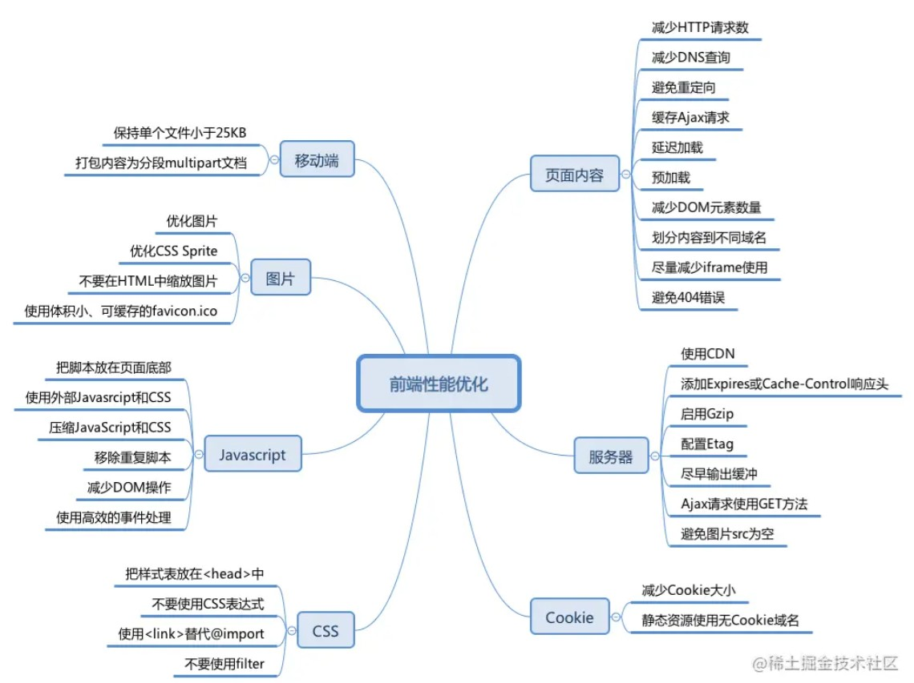
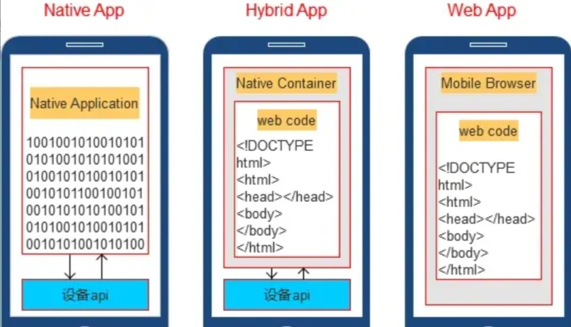

# 性能优化与工程化




## 一、webpack

从构建工具着手，进行项目的性能优化

### 1.1 按需加载

**路由懒加载**或者按需加载，是一种很好的优化网页或应用的方式。

特点（原理）：将路由页面或者某些功能单独打包为一个文件，使用时才加载。首屏渲染时只需要对应JS代码而无需其他js代码，做好按需加载，只有触发某些功能时才会加载当前功能的js代码

优势：减轻首屏渲染的负担。因为项目功能越多其打包体积越大，导致首屏渲染速度变慢。

```js
const Home = () => import('../view/Home/Home.vue')
```

注：若担心切割出来的模块无法分辨出属于哪个业务模块，可以在懒加载时使用注解

```js
const Home = () => import(/* webpackChunkName: 'home'*/'../view/Home/Home.vue')
```


### 1.2 缓存副本

优点：配置cache缓存`loader`对文件的编译副本，好处是再次编译时只编译修改过的文件。未修改过的文件不会再次重新编译

大部分的`loader/plugin`都会提供一个可使用编译缓存的选项，通常包含`cache`字眼

```js
//例如babel的编译缓存选项
export default {
        module: {
        rules: [{
            test: /\.js$/,
            use: [{
                loader: "babel-loader",
                options: { cacheDirectory: true }
            }]
        }]
    },
}
```


### 1.3 定向搜索

配置webpack的`resolve`对象可以提高文件的搜索速度。通常配置`alias`和`extensions`

```js
export default {
    resolve: {
        //起别名
        alias: {
            "@": path.resolve(__dirname, "./src/")
        }
        //忽略拓展名
        extensions: [".js", ".ts", ".json", ".vue"]
    }
}
```

### 1.4 限制图像大小

配置`url-webpack-loader`当图像文件超过一定大小时，打包将其转为base64编码

注：base64格式的图片是文本格式，占用内存小，转换后的大小比例大概为1/3，降低了资源服务器的消耗


## 二、vue项目优化

### 2.1 v-if和v-show

1、**v-if** 是真正的条件渲染，因为它会确保在切换过程中条件块内的事件监听器和子组件适当地被销毁和重建

2、**v-show** 就简单得多， 不管初始条件是什么，元素总是会被渲染，并且只是简单地基于 CSS 的 display 属性进行切换。

做法：

v-if 适用于在运行时很少改变条件，不需要频繁切换条件的场景；v-show 则适用于需要非常频繁切换条件的场景。


### 2.2 computed和watch

1、**computed：** 是计算属性，依赖其它属性值，并且 computed 的值有缓存，只有它依赖的属性值发生改变，下一次获取 computed 的值时才会重新计算 computed  的值；

2、**watch：** 更多的是「观察」的作用，类似于某些数据的监听回调 ，每当监听的数据变化时都会执行回调进行后续操作；

做法：

当我们需要进行数值计算，并且依赖于其它数据时，应该使用computed，因为可以利用computed的缓存特性，避免每次获取值时，都要重新计算；


### 2.3 v-for的key

在列表数据进行遍历渲染时，需要为每一项item设置唯一 key 值，方便Vue.js内部机制精准找到该条列表数据。

1、key属性主要用在Vue的虚拟DOM算法，在新旧nodes对比时辨识vNodes

2、不使用key，Vue会使用一种最大限度减少动态元素并且尽可能的尝试就地修改/复用相同类型元素的算法（没有key，那么就使用patchUnkeyedChildren方法）

3、使用key，它会基于key的变化重新排列元素顺序，并且会移除/销毁key不存在的元素（有key，那么就使用patchKeyedChildren方法）


### 2.4 懒加载

图片懒加载：使用 Vue 的 vue-lazyload 插件

路由懒加载：使用webpack的路由导入方式


### 2.5 按需引入

第三方插件引入时，尽量使用按需引入（比如UI框架）

## 三、图像优化

### 3.1 图片懒加载

只有当图片出现在可视区域时，才去加载真正的图片。而不是一次性加载所有的图片

```js
//以vue项目的懒加载为例
npm i vue-lazyload -s

//使用
Vue.use(VueLazyLoad, {})

//修改项目中的:src为v-lazy
```


### 3.2 使用字体图标

方式：使用字体图标代替图片图标

优点：

1、字体图标就是将图标制作成一个字体，使用时跟字体一样，可以设置属性，例如`font-size、color`

2、字体图标是矢量图，不会失真

推荐：阿里巴巴矢量图标库


### 3.2 适当使用雪碧图

将页面需要的少量图片，且图片最好是固定不变化的，存放在一张雪碧图上，通过`background-position`来定位并展示相关的图片。

优势：减少页面发送HTTP请求去下载图片的次数

## 四、回流和重绘

**回流（reflow）**

当render tree中的一部分（或全部）因为元素的尺寸、布局、隐藏等改变而需要重新构建，就称为回流。

注：每个页面至少需要一次回流，就是在页面第一次加载的时候

**重绘（repaint）**

当render tree中的一些元素需要更新属性，而这些属性只是影响元素的外观、风格、而不会影响布局的，比如color、background-color等，就称为重绘

**区别**

1、引起DOM树结构变化，页面布局变化的行为就是回流

2、只式样式的变化，不会引起DOM树变化、页面布局变化的行为叫重绘

3、回流必将引起重绘，而重绘不一定会引起回流

4、回流的代价要远远大于重绘

**如何减少回流**

1、减少对DOM的增删行为

比如删除某个节点、给某个父元素添加子元素

2、减少几何属性的变化

比如元素的宽高变化、border变化、字体大小变化

（可以将这些变化放在一个class中，直接添加class，这样就只引起一次回流）

3、减少元素位置的变化

比如修改一个元素的margin、padidng

（可以脱离文档流的改变位置会更好）

4、减少获取元素的偏移量属性

例如获取一个元素的scrollTop、scrollLeft等属性，浏览器为了保证值的正确也会回流取得最新的值


## 五、服务器

### 5.1 缓存策略

1、设置`Expire`时间戳的过期时间，

2、设置`Cache-Control: max-age`的时间长度

3、设置`if-modifield`资源的修改时间（无法监控内容是否真正变化了）

4、设置`Etag`标识来代表的内容是否修改


### 5.2 CDN内容分发网络

内容分发网络简称CDN，指一组分布在各地缓存数据副本并可根据就近原则满足数据请求的服务器。其核心特征是`缓存`和`回源`。缓存是把资源复制到CDN服务器里，回源是资源过期、不存在就向上层服务器请求并复制到CND服务器里

做法：将项目的静态资源存放于CDN服务器（样式文件、脚本文件、多媒体文件）

优势：使用`CDN`可降低网络拥塞，提高用户访问响应速度和命中率，使用户就近获取所需资源


### 5.3 减少cookie传输

cookie传输会造成带宽浪费，可以：

- 减少cookie中存储的东西
- 静态资源不需要cookie，可以采用其他的域名，不会主动带上cookie。

## 六、其他优化

### 1、使用事件委托

事件委托利用了事件冒泡，只指定一个事件处理程序，就可以管理某一类型的所有事件。


例子：使用事件委托，只要给所有元素共同的祖先节点添加一个事件处理程序，就可以解决问题

```js
        let myDiv = document.getElementById("myDiv")
        myDiv.addEventListener('click', (event) => {
            switch(event.target.id) {
                case 'box1':
                    console.log('box1 do something');
                    break;
                case 'box2':
                    console.log('box2 do something');
                    break;
                case 'box3':
                    console.log('box3 do something');
                    break;
            }
        })
```


### 2、优先css3动画

css动画是关键帧动画，只需要添加关键帧的位置，其他的未定义的帧会被**自动生成**。

JS动画是时间帧动画，实现需要频繁地修改DOM，不断地进行回流和重绘，开销十分大。并且js运行在浏览器的主线程中，可能会导致线程阻塞，从而掉帧。


### 3、css、js放置位置

结论：将CSS放在文件的头部，JavaScript文件放在底部

原因：

1、CSS执行会阻塞渲染，阻止JS执行。

2、JS加载和执行会阻塞HTML解析，阻止CSSOM构建


说明：

1、如果CSS/JS都放HEAD标签中，加载和解析太久会造成页面空白

2、将CSS放与HEAD中，是不想让页面呈现出DOM结构而没有样式，影响用户体验。所有优先加载CSS

3、JS也可以放在HEAD中，不过需要加上defer属性延迟加载

4、一般JS放在html代码后边，因为解析JS时会停止解析HTML，而JS能够操作DOM，频繁地去修改DOM影响性能

## 七、前端工程化


误区：前端工程化 不等于 `webpack`等构建工具，前端工程化是一个更加广泛的概念

前端工程化是使用软件工程的技术和方法来对前端开发进行规范化、标准化，其主要目的是为提高开发过程中的效率，减少不必要的重复工作时间。（提高效率、减少成本）

可以从**模块化、组件化、规范化、自动化**来分析前端工程化。

#### A、模块化

`模块化`是指将一个复杂的程序拆分成多个相互依赖的文件，最后进行统一的打包和加载

目前前端比较流行的模块化方案：`CommonJS、ES Module、AMD、CMD`

#### B、组件化

组件化是在设计层面上，对于UI的拆分

组件化将页面视为一个容器，页面上各部分例如：头部、导航、焦点图、侧边栏、底部等视为独立组件，不同的页面根据内容的需要，去盛放相关组件即可组成完整的页面，组件具有独立性，因此组件与组件之间可以自由组合。

#### C、规范化

+ 1、项目目录结构

基于脚手架搭建起来的项目结构，还不够清晰，往往还需要进行划分

比如vue项目下的src（源码），还可以划分

api(接口)、assets（静态资源）、components（公共组件）、styles（公共样式）、router（路由）、store（vuex）、utils（工具函数）、views（页面）、newwork（网络请求）等等

+ 2、代码规范

A、配置 eslint 来检查代码（通过.eslintrc.js进行相关配置）

B、使用格式化代码工具Prettier（不想要格式化的内容可以配置在`.prettierignore`文件中）

C、集成editorconfig配置（如：统一字符集、缩进风格、缩进大小、控制换行类型、文件末尾插入新行等等）

注：如果同时配置了eslint和prettier，那么需要解决一下冲突；在vscode中，可以设置保存时`ctrl s`时自动格式化

+ 3、文件命名规范

规则：驼峰命名法、见名知义

+ 4、样式规范

样式管理：原生css、Less、Sass（统一使用其中一种）

+ 5、git规范

分支管理规范、git commit 规范

+ 6、UI规范

统一页面UI标准（建议使用统一的UI组件库）

#### D、自动化

目前流行的 webpack、vite等前端构建工具在自动化合并、构建、打包都能为我们节省很多工作。而这些只是前端自动化其中的一部分，前端`自动化`还包含了持续集成、自动化测试等方方面面。

**利用webpack构建一个项目**

方式一：利用脚手架`如vue-cli`来简单构建一个项目

方式二：利用webpack从零开始构建一个项目


### webpack

#### A、基本

webpack是一个静态的模块化打包工具

注：静态，指最终打包的代码是静态资源；目前前端三大框架的脚手架都依赖于webpack ；webpack的运行依赖于Node

**1、初始化项目**

```js
//新建一个目录，生成package.json
npm init

//安装webpack
npm install webpack webpack-cli –D

//创建源码文件夹src，新建一个main.js
console.log('入口文件代码开始执行')

//在package.json中，配置打包脚本命令
{
    "script": {
        "build": "webpack src/main.js"
    }
}

//执行打包命令,生成dist/main.js
npm run build
```


**2、自定义webpack.config.js**

```js
//新建webpack.config.js
const path = require('path')
module.exports = {
    mode: 'development',
    entry: path.resolve(__dirname, './src/main.js'),
    output: {
        filename: 'bundle.js',
        path: path.resolve(__dirname, './build')
    }
}

//重新配置打包命令
{
    "scripts": {
        "build": "webpack"
    },
}
```

**3、自动配置html模板**

js打包好了，但是每次将打包好的静态资源`bundle.js`手动引入html中太麻烦了

```js
//新建一个Public文件夹，创建index.html

//配置plugin
const HtmlWebpackPlugin = require('html-webpack-plugin')

module.exports = {
  pluguns: [
    new HtmlWebpackPlugin({
      template: path.resolve(__dirname, './public/index.html')
    })
  ]
}
```

之后每次打包都会根据`public/index.html`这个模板生成一个可以自动引入`bundle.js`的`index.html`


**4、清除残留的打包文件**

功能：每次执行打包命令时，将原有的dist文件夹删除

安装：`npm install clean-webpack-plugin -d`

配置：

```javascript
    const {CleanWebpackPlugin } = require("clean-webpack-plugin");

    plugins:[
        new CleanWebpackPlugin()
        // CleanWebpackPlugin是一个类
    ]
```


**5、引用css资源**

webpack默认可以识别CommonJS、ES6，但是不能识别css。如果想要识别css，必须安装css-loader

1、安装

 `npm install css-loader -d`

`npm install style-loader -d`

2、配置

```javascript
module.exports = {
    module: {
        rules: [
            {
                test: /\.css$/,
                use: ['style-loader', 'css-loader'] //从右到左解析
            }
        ]
    }
}
```

也可打包less、sass等css预处理器


**6、打包图片、字体、媒体等文件资源**

`file-loader`就是将文件在进行一些处理后，将文件移动到打包目录中

`url-loader`与`file-loader`搭配使用，两者功能类似。如果文件大小超过限制，则返回base64编码，否则依然只是移动到打包目录中

安装：`npm install file-loader -d`

安装`npm install url-loader -d`

```js
  module: {
    rules: [
      {
        test: /\.(jpg|png|jpeg|gif)/,
        use: {
          loader: "file.loader",
          options: {
            name: 'img/[name]_[hash:6].[ext]'
          }
        }
      },
        //或者
      {
        test: /\.(jpg|png|jpeg|gif)/,
        use: {
          loader: "url-loader",
          options: {
            name: 'img/[name]_[hash:6].[ext]',
            limit: 100*1024
          }
        }
      },
    ]
  }
```

也可以打包字体、媒体文件等等


**7、babel转义js代码**

1、安装：

`npm install babel-loader -d`

`npm install @babel/core -d ` babel核心代码（必要）

`npm install @babel/preset-env -d` 预设插件

```js
module:{
    rules:[
        {
            test:/\.js$/, //js结尾的文件使用babel进行打包转换
            use:{
                loader:"babel-loader",
                options:{
                    presets:[
                        "@babel/preset-env"
                    ]
                }
            }
        }
    ]
}
```


#### B、Vue

​	安装vue2：`npm install vue`

安装vue3：`npm install vue@next`

当我们向main.js中使用vue时，出现了警告

```javascript
import {createApp} from 'vue' //导入vue的createApp方法
const app = createApp({
    template:`<div>这是vue渲染出来的<div>`,
    data(){
        return{
            info:"hahahah"
        }
    }
})
app.mount("#app")
```

由于webpack默认使用了 ‘ 仅运行时 ’ 版本的代码，不包含template的编译，所以无法渲染出来

修改`import {createApp} from 'vue/dist/vue.esm-bundler'`


安装`npm i vue-loader@next -d` 并配置

```javascript
            // 配置.vue文件打包
            {
                test:/.\vue$/,
                loader:"vue-loader"
            }
```

打包时报错，因为vue-loader同时依赖于另外一个包:安装`npm i @vue/compiler-sfc -d `

同时需要再配置一个插件，该插件存在于vue-loader的包里，可以直接配置使用

```javascript
const {VueLoaderPlugin} = require("vue-loader/dist/index")

        // 使用v-loader插件
        new VueLoaderPlugin()
```


#### C、本地服务

每次修改代码都需要使用`npm run build`打包编译代码，影响效率。

为了完成自动编译，webpack提供了几种可选的方式：

1、webpack watch mode

2、webpack-dev-server（常用）

3、webpack-dev-middleware


**1、webpack watch mode**

webpack提供了watch模式，在该模式下，webpack依赖于图中所有的文件，只要一个发生了更新，那么代码将重新编译

开启方式一：

在导出的配置中，添加watch：true

```javascript
module.exports = {
    mode:"development",
    devtool:"source-map",
    watch:true
    }
```


开启方式二：在启动webpack的命令中，添加--watch标识

```javascript
"scripts": {
    "build": "webpack --watch"
},
```


**2、webpack-dev-server**

通过配置watch的方式可以监听到文件的变化，但是事实上它本身没有自动刷新浏览器的功能，而是依赖了vscode的live-server插件

那么，如何在不适用live-serve的情况下，可以具备live reloading（实时重新加载）的功能

安装：

`npm install webpack-dev-server -d`

配置：

```javascript
  "scripts": {
    "build": "webpack --watch",
    "serve":"webpack serve"
  },
```

注意：webpack-dev-server在编译之后不会写入到任何输出文件（即不进行任何打包），而是将bundle文件保留在内存中。事实上，它使用了一个名为menfs的库

另外，如果修改了`webpack.confog.js`里边的代码，还是要重新执行`npm run serve`命令

**dev-server的配置**

1、`contentBase`

```javascript
module.exports = {
	//dev-server的配置
    devServer:{
        contentBase:"./public" 
    }
}
```

在不适用`CopyWebpackPlugin`插件的情况下，该配置意味着public文件夹下的资源也可以在浏览器中呈现。但是跟`CopyWebpackPlugin`相区别，`contentBase`只是不会将资源打包进bundle。

该配置，可以有利于开发阶段，不想将大型public下的资源进行打包，浪费时间性能时可以使用


2、模块热替换（HMR）

HMR全称是Hot Module Replacement，是指在应用程序运行的过程中，添加、替换、删除模块，而**无须重新刷新整个页面**

优点：

+ 不重新加载整个页面，这样可以保留某些应用程序的状态不丢失
+ 只更新变化的内容，节省开发时间
+ 修改了css、js源代码，会立即在浏览器更新，相当于直接在浏览器的devtools中直接修改样式

如何使用?

默认情况下，webpack-dev-server支持HMR，只需要开启即可

```javascript
    target:"web", //针对web浏览器
    devServer:{
        hot:true //开启
    },
```

为需要操作的模块进行配置

```javascript
import add from './js/add'

if(module.hot) {
    module.hot.accept("./js/add.js",()=>{
        console.log("add文件热加载成功");
    })
}
```

这样一来，在add.js文件中更改内容，就可以进行热更新了

事实上，如果在vue中进行修改、替换、删减操作，不需要以上的操作，因为vue-loader中默认已经有HMR，开箱即用

3、host配置

host设置主机地址：默认是localhost，如果希望其他地方也可以访问，可以设置为0.0.0.0

```javascript
    devServer:{
        host: "0.0.0.0"
    },
```


localhost与0.0.0.0的区别：

1、localhost本质上是一个域名，通常情况下会被解析成127.0.0.1；

2、127.0.0.1：回环地址，表达的意识是主机自己发出去的包，直接被自己接收；

​		a、正常的数据库包经历：应用层-传输层-网络层-数据链路层-物理层

​		b、回环地址：在网络层直接被获取到了，是不会经历数据链路层和物理层的

​		c、比如监听127.0.0.1时，在同一网段下的主机中，通过ip地址是不能访问的；

3、0.0.0.0 :监听IPV4上所有的地址，再根据端口找到不同的应用程序；

​		a、比如监听0.0.0.0时，在同一网段下的主机中，通过ip地址是可以访问的


4、其他配置

**port**

设置监听的端口，默认情况下是8080

**open**

more是false，设置为true会打开浏览器

**compress**

默认值为false，设置为true会开启静态文件打包为gzip


5、proxy

proxy是开发中非常常用的一个配置选项，它的目的是设置代理来解决跨域访问问题。

**跨域问题 **：比如发送一个api请求时http://localhost:8888，但是本地启动服务器的域名是 http://localhost:8000.这是候发送网络请求就会出现跨域的问题。

解决方案：将请求先发送到一个代理服务器，代理服务器和API服务器没有跨域问题，就可以解决我们的跨域问题

案例

假设我们现在开启一个本地服务器http://localhost:8888，并向里边content请求内容，已知我们当前的服务器域名为http://localhost:8000，于是出现了跨域访问问题，导致请求数据失败

```javascript
// 测试跨域问题
import axios from 'axios'

axios.get("http://localhost:8888/content").then(res=>{
    console.log(res);
})
```

所以我们需要通过live-server的代理来解决这个问题

```javascript
module.exports = {

    devServer:{
        proxy:{
            "/api": {
                target:"http://localhost:8888",
                pathRewrite:{
                    "^/api" : ""
                }
            }
        }
    }
}
```

同时,发送网络请求的代码也要相应的进行修改

```javascript
import axios from 'axios'

axios.get("/api/content").then(res=>{
    console.log(res);
})
```

这样子就可以正常访问到想要的数据了

#### D、resolve模块

（用于起别名，引用文件的时候省略扩展名）

**resolve用于设置模块如何被解析**

1、在开发中我们会有各种各样的模块依赖，这些模块可能自己编写的代码，也可能是来自第三方库

2、resolve可以帮助webpack从每个require/import语句中，找到需要引入的合适的模块代码


+ 应用一：省略文件扩展名配置

```javascript
module.exports = {
    resolve:{
        extensions:['.js','.vue','.ts']
    }
}
```

之后引用文件由`import App from './vue/App.vue'`可变为 `import App from './vue/App'`

原理：如果导入的是一个文件，文件具有扩展名,则可以直接打包；否则，将使用resolve.extensions选项作为扩展名解析。

extensions的默认值：【'.wasm' , '.mjs' , '.js' , '.json'】


+ 应用二：起别名alias

1、当我们项目的目录结构比较深的时候，或者一个文件的路径需要.././../这种路径片段；就可以给某些常见的路径起一个别名

```javascript
const path = require('path')
module.exports = {
        resolve:{
        alias: {
            "js":path.resolve(__dirname,"./src/js"),
            "@":path.resolve(__dirname,"./src/js")
        }
    }
}
```

之后就可以在导入文件的时候使用别名了

```javascript
import add from 'js/add'
const {mult} = require("js/mult")
```


## 八、设计模式


## 九、混合开发-Hybrid App

目前市场上主流的APP分为三种：

1、原生APP

2、Web APP（即HTML5）

3、混合APP（包括Flutter、React Native等）


**基本概念**

**Hybrid App(混合模式移动应用)**是介于Web APP与原生APP之间的app，兼具 " 原生APP良好用户交互体验 " 的优势和 "  Web APP跨平台开发 " 的优势


|                   | Web APP | Hybrid APP | Native APP |
| ----------------- | ------- | ---------- | ---------- |
| 开发成本          | 低      | 中         | 高         |
| 维护更新          | 简单    | 简单       | 复杂       |
| 体验              | 差      | 中         | 优         |
| Store或market认可 | 不认可  | 认可       | 认可       |
| 安装              | 不需要  | 需要       | 需要       |
| 跨平台            | 优      | 优         | 差         |


#### 1、原生开发

原生开发（Native App开发），是在Android、IOS等移动平台上利用官方提供的开发语言、开发类库、开发工具进行App开发。比如Android是利用Java、eclipse、Android Studio；而IOS是利用Objective-C和Xcode进行开发

优点：

1、可以访问手机所有功能（如GPS、摄像头）、可实现功能最齐全

2、运行速度快、性能高，绝佳的用户体验

3、支持大量图形和动画，不卡顿，反应快，还能防止病毒和漏洞的出现

4、比较快捷地使用设备端提供的接口，处理速度上有优势

缺点：

1、开发时间长，快则3个月左右，慢则5个月左右

2、制作费用高昂，成本较高

3、可移植性比较差，一款原生APP，Android和IOS都要各自开发，同样的逻辑、界面要写两套

4、内容限制（APP Store限制）

5、必须等下载完毕用户才可以打开，获取新版本时需要从新下载应用更新

6、新需求迭代，上线慢


#### 2、Web APP（H5开发）

HTML5应用开发，是利用Web技术进行的App开发，可以在手机端浏览器里面打开的网站就称为Web APP。

Web技术本身需要浏览器的支持才能进行展示和用户交互，因此主要用到的技术是HTML/CSS/JavaScript以及Vue、React等框架

优点：

1、支持设备范围广，可以跨平台。编写的代码可以同时在Android、IOS、Windows上运行

2、开发成本低、周期短

3、无内容限制

4、适合展示有大段文字、且合适比较丰富的页面

5、用户可以直接使用最新版本（自动更新，不需用户手动更新）

缺点：

1、由于Web技术本身的限制，H5移动应用不能直接访问设备硬件和离线存储，所以在体验和性能上有很大的局限性

2、对网络要求高，离线不能做任何操作

3、功能优先

4、APP反映速度慢，页面切换流畅性较差

5、图片和动画支持性不高

6、用户体验感较差

7、无法调用手机硬件（摄像头、麦克风等）


#### 3、Hybrid App开发

混合开发是指在开发一款App产品的时候，为了提高效率、节省成本而利用原生与H5的开发技术的混合应用。

混合开发是一种取长补短的开发模式，原生代码部分利用WebView插件或者其他框架为H5提供容器，程序主要的业务实现、界面展示都是利用与H5相关的Web技术进行实现的。比如京东、淘宝、今日头条等App都是利用混合开发模式而成的

优点：

1、开发效率高，节约时间。同一套代码android和IOS基本上都可使用

2、更新和部署比较方便，每次升级版本只需要在服务器端升级即可，不需要上传到App Store进行审核

3、代码维护方便、版本更新快，节省产品成本

4、比web版本实现功能多

5、可离线运行

缺点：

1、功能/界面无法自定：所有内容都是固定的，不能换界面或增加功能

2、加载缓慢、网络要求高：混合APP数据需要全部从服务器调取，每个页面都需要重新下载，因此打开速度慢，网络占用高，缓冲时间长，容易让用户反感

3、安全性比较低




#### 4、混合开发框架

**React Native**

React Native（简称RN）是Facebook于2015年4月开源的跨平台移动应用开发框架，是Facebook早先开源的JS框架，React在原生移动应用平台的衍生产物，支持IOS和安卓两大平台

RN和普通混合开发的区别就是React Native 采用不同的方法进行混合移动应用开发。它不会生成原生 UI 组件，而是基于 React，React Native 是一个用于构建基于 Web 的交互界面的 JavaScript 库，因此会有更丰富的 UI 体验效果，同时也能够很好地调用底层框架的UI使用，达到和原生一样的体验


**Fullter**

Fullter是谷歌开源的跨平台UI开发框架，支持Android和IOS，并且目前开始支持Web和MacOS，未来还会继续支持Win和Linux平台的一套UI框架


**Weex**

阿里巴巴退出的一套跨平台移动开发框架，与RN类似
