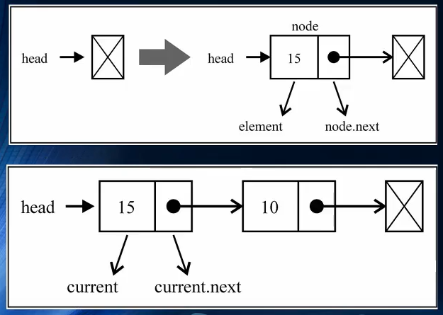
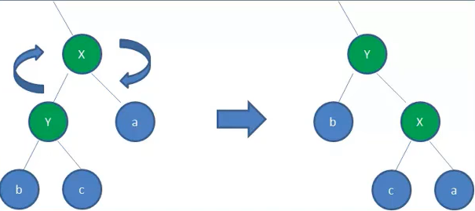

# 数据结构与算法

```js
@title '数据结构与算法' 
@description '数组、栈、队列、列表、树、图、哈希表、集合、排序...'
@image 'https://gw.alipayobjects.com/zos/rmsportal/JiqGstEfoWAOHiTxclqi.png'
```


程序=数据结构+算法

## 1、初步认知

**数据结构的定义**

数据结构时计算机中存储、组织数据的方式。通常情况下，精心选择的数据结构可以带来最优效率的算法——中文维基百科

**常见的数据结构**

+ 队列(Queue)
+ 树(Tree)
+ 堆(Heap)
+ 数组(Array)
+ 栈(Stack)
+ 链表(Linked List)
+ 图(Graph)
+ 散列表(Hash)

每一种都有其对应的应用场景，不同的数据结构的不同操作性能是不同的。有的查询性能很快，有的插入速度很快，有的是插入头和尾速度很快。有的做范围查找很快，有的允许元素重复，有的不允许重复等等......在开发中如何选择，要根据具体的需求来选择

**算法 Algorithm**

定义：一个有限指令集，每条指令的描述不依赖于语言，接受一些输入（有些情况不需要输入），产生输出，一定在有限步骤之后终止

## 2、数组

### 2.1 创建和初始化

1、 使用`new`关键字 

```javascript
// 创建和初始化数组
var daysOfWeek = new Array()
var daysOfWeek = new Array(7)
var daysOfWeek = new Array('Sunday', 'Monday', 'Tuesday', 'Wednesday',
    'Thursday', 'Friday', 'Saturday')
```

```javascript
        // 创建数组并赋值
        const arr = new Array()
        arr[0]=1;
        arr[2]=2;
        console.log(arr);
		//输出：[1,空，2]

        // 初始好长度
        const arr2 = new Array(7)
        arr2[0]=1;
        arr2[1]=2;
        console.log(arr2);
		//输出：[1,2,空x5]
```

2、 使用中括号（`[]`）创建数组 

```javascript
var daysOfWeek = ['Sunday', 'Monday', 'Tuesday', 'Wednesday',
    'Thursday', 'Friday', 'Saturday'];
```

### 2.2 数组的长度和遍历

```javascript
// 获取数组的长度
alert(daysOfWeek.length)
```

```javascript
//普通for循环遍历
const arr = ['beibei','jingjing','huanhuan','yingying','nini']
for(var i=0;i<=arr.length;i++){
    console.log(arr[i])
}
//输出
//beibei
//jingjing
//huanhuan
//yingying
//nini
//undefined
```

为什么会打印出undefined呢？

注意for循环的`i<=arr.length`=5，所以`i`会依次等于0,1,2,3,4,5,然而并不存在arr[5]

```javascript
// 通过foreach遍历数组
arr.forEach(function (value) {
    alert(value)
})
//es6写法
arr.forEach(value=>{
    console.log(value)
})
```

### 2.3 数组的常见操作

 添加元素、删除元素、修改元素、获取元素.

+ 添加

从上边的arr例子中可以看出，一般情况下，数组的length总会比数组的索引大“1”

```javascript
//初始化一个数组
let numbers = [0,1,2,3,4,5,6,7,8,9]
//这时numbers的length=10，而实际numbers的索引最大为9，利用这个特点，可以这样来向数组最后一位添加元素
numbers[numbers.length]=10	
```

```javascript
//向数组最后添加新元素方式二
numbers.push(11)
numbers.push(12, 13)
```

向数组首位插入数据

```javascript
// 通过unshift在首位插入数据
numbers.unshift(-2)
numbers.unshift(-4, -3)
alert(numbers) // -4,-3,-2,-1,0,1,2,3,4,5,6,7,8,9,10,11,12,13
```

+ 删除

 删除数组最后的元素, 可以使用pop()方法 

```javascript
// 删除最后的元素
numbers.pop()
alert(numbers) // -4,-3,-2,-1,0,1,2,3,4,5,6,7,8,9,10,11,12
```

 移除的首位元素, 自己实现代码 

```javascript
// 删除首位的元素
for (var i = 0; i < numbers.length; i++) {
    numbers[i] = numbers[i+1]
}
numbers.pop() //把最后一位删掉undefined
alert(numbers)
```

也可以通过`shift()`来删除

```javascript
numbers.shift()
```

+ 任意位置

 通过splice删除数据 

```javascript
let arr = [1,23,4,5,67,89,9,54,34]
arr.splice(3,2)
//解析：上面的代码会删除索引为3,4位置的元素
//第一个参数表示索引起始的位置为3(其实是第4个元素, 因为索引从0开始的), 删除2个元素
```

通过splice()增加数据

```javascript
let arr = [1,23,4,5,67,89,9,54,34]
arr.splice(3,0,'a','b','c')
//解析：上面的代码会从索引为3的位置开始插入数据. 其他数据依次向后位移.
//第二个参数为0时表示不是删除数据, 而是插入数据.
//后面紧跟的是在这个位置要插入的数据, 可以是其他类型, 比如"a", "b", "c".
```

通过splice()修改数据

```javascript
let arr = [1,23,4,5,67,89,9,54,34]
arr.splice(3,3,'a','b','c')
//解析：上面的代码会从值为5的位置开始修改数据, 修改多少个呢? 第二个参数来决定的.
//第二个参数是要将数组中多少个元素给替换掉, 我们这里是3个
//后面跟着的就是要替换的元素
```

### 2.4 数组常见的方法

| 方法名        | 方法描述                                                     |
| ------------- | ------------------------------------------------------------ |
| `concat`      | 连接2个或更多数组，并返回结果                                |
| `every`       | 对数组中的每一项运行给定函数，如果该函数对每一项都返回 `true`，则返回`true`, 否则返回`false` |
| `filter`      | 对数组中的每一项运行给定函数，返回该函数会返回 `true`的项组成的数组 |
| `forEach`     | 对数组中的每一项运行给定函数。这个方法没有返回值             |
| `join`        | 将所有的数组元素连接成一个字符串                             |
| `indexOf`     | 返回第一个与给定参数相等的数组元素的索引，没有找到则返回-1   |
| `lastIndexOf` | 返回在数组中搜索到的与给定参数相等的元素的索引里最大的值     |
| `map`         | 对数组中的每一项运行给定函数，返回每次函数调用的结果组成的数组 |
| `reverse`     | 颠倒数组中元素的顺序，原先第一个元素现在变成最后一个，同样原先的最后一个元素变成了现在的第一个 |
| `slice`       | 传入索引值，将数组里对应索引范围内的元素作为新数组返回       |
| `some`        | 对数组中的每一项运行给定函数，如果任一项返回 `true`，则结果为`true`, 并且迭代结束 |
| `sort`        | 按照字母顺序对数组排序，支持传入指定排序方法的函数作为参数   |
| `toString`    | 将数组作为字符串返回                                         |
| `valueOf`     | 和 `toString`类似，将数组作为字符串返回                      |
| `find`        | 找出数组中第一个符合条件的数组成员，返回该成员，否则返回undefined。参数是函数 |
| `findIndex`   | 找出数组中第一个符合条件的数组成员，返回该成员的索引，否则返回-1。参数是函数 |
| `includes`    | 数组中是否包含给定的值，结果返回布尔值                       |


**数组的合并**

 使用concat即可(也可以直接+进行合并) 

```javascript
//方法一
let arr = [1,2,3,4,5,'a','b','c']
let arr2 = [23,43,5,'da','ada','fsf']
let newArr = arr.concat(arr2)
console.log(newArr);
//[1, 2, 3, 4, 5, "a", "b", "c", 23, 43, 5, "da", "ada", "fsf"]

//方法二
let newArr =arr+arr2
//输出：1, 2, 3, 4, 5, "a", "b", "c", 23, 43, 5, "da", "ada", "fsf"
//非数组
```


**数组的迭代**

+ every()

1、every()方法是将数组中每一个元素传入到一个函数中, 该函数返回true/false 

2、如果函数中每一个元素都返回true, 那么结果为true, 有一个为false, 那么结果为false

```javascript
//判断数组的元素是否都大于11
let arr = [22,33,44,55]
let res = arr.every(value=>{
    return value>11
})
console.log(res); //true
```

+  some()方法 

1、some()方法是将数组中每一个元素传入到一个函数中, 该函数返回true/false

2、但是和every不同的是, 一旦有一次函数返回了true, 那么迭代就会结束. 并且结果为true

```javascript
// 定义数组
var names = ["abc", "cb", "mba", "dna"]

// 判断数组中是否包含有a字符的字符
//只要存在一个，即返回true
var flag = names.some(function (t) {
    alert(t)
    return t.indexOf("a") != -1
})
alert(flag)
```

+ forEach()

快速遍历数组

```javascript
// 定义数组
var names = ["abc", "cb", "mba", "dna"]

// forEach的使用
names.forEach(t=>{
    alert(t)
})
```

+ filter()

filter()方法是一种过滤的函数

首先会遍历数组中每一个元素传入到函数中

函数的结果返回true, 那么这个元素会被添加到最新的数组中, 返回false, 则忽略该元素.

最终会形成一个新的数组, 该数组就是filter()方法的返回值

```javascript
//数组中有哪些值大于11
let arr = [1,2,4,55,12,7,88,2]
let res = arr.filter(value=>{
    return value>11
})
console.log(res);
```

+ map()

map()方法提供的是一种映射函数.

首先会遍历数组中每一个元素传入到函数中.

元素会经过函数中的指令进行各种变换, 生成新的元素, 并且将新的元素返回.

最终会将返回的所有元素形成一个新的数组, 该数组就是map()方法的返回值

```javascript
//为数组中的每一个元素添加"your"前缀
let arr = ['day','mon','sister','brother']
let res = arr.map(value=>{
    return 'your'+value
})
console.log(res);
```


+ reduce()

`arr.reduce(callback[, initialValue])`

 callback（一个在数组中每一项上调用的函数，接受四个函数： 

​		1、previousValue（上一次调用回调函数时的返回值，或者初始值）

​		2、currentValue（当前正在处理的数组元素）

​		3、currentIndex（当前正在处理的数组元素下标）

​		4、array（调用reduce()方法的数组）

initialValue（可选的初始值。作为第一次调用回调函数时传给previousValue的值）

通过例题解析——求一个数组中数字的累加和

```javascript
//方法一
var numbers = [1, 2, 3, 4]
var total = 0
numbers.forEach(t=>{
    total += t
})
alert(total)
```

```javascript
//方法二——通过reduce
var total = numbers.reduce((pre, cur)=>{
    return pre + cur
})
alert(total)
```

代码解析:

- pre中每次传入的参数是不固定的, 而是上次执行函数时的结果保存在了pre中
- 第一次执行时, pre为0, cur为1
- 第二次执行时, pre为1 (0+1, 上次函数执行的结果), cur为2
- 第三次执行时, pre为3 (1+2, 上次函数执行的结果), cur为3
- 第四次执行时, pre为6 (3+3, 上次函数执行的结果), cur为4
- 当cur为4时, 数组中的元素遍历完了, 就直接将第四次的结果, 作为reduce函数的返回值进行返回.


+ splice()

1、删除（起始位置，删除个数）

```javascript
const arr = [22,33,44,556,77,888]）
arr.splice(1,1); //输出索引1处的1个值
alert(arr)
```

2、替换（起始位置，长度，替换的值）

```javascript
        arr.splice(3,1,55)
        alert(arr) //将索引值为3处的一个值，替换成55
```

3、添加（起始位置，0，添加的值）

```javascript
        arr.splice(4,0,66)
        console.log(arr); //在索引值为4处添加一个
```


## 3 、栈结构

### 3.1 概述

栈是一种非常常见的数据结构，并且在程序中的应用十分广泛

栈（stack），是一种==受限的线性表==，后进先出（LIFO Last In First Out）

+ 其限制是仅允许在表的一端进行插入和删除运算。这一端被称为栈顶，相对的，另一端称为栈底

 + LIFO（last in first out)表示就是后进入的元素，第一个弹出栈空间
 + 向一个栈插入新元素又被称作进栈，入栈或压栈，它是把新元素放到栈顶元素的上面，使之称为新的栈顶元素
 + 从一个栈删除元素又被称作出栈或退栈，它是把栈顶元素删掉，使其相邻的元素成为新的栈顶元素

**面试题**

有六个元素6，5，4，3，2，1的顺序进栈，问下列哪一个不是合法的出栈序列（）

+ A. 5,4,3,6,1,2
+ B. 4,5,3,2,1,6
+ C. 3,4,6,5,2,1
+ D. 2,3,4,1,5,6

答案：C

**栈结构的实现**

方式：1、基于数组实现 2、基于链表实现

**栈的常见操作**

+ push(element):添加一个新元素到栈顶位置
+ pop() :移除栈顶的元素，同时返回被移除的元素
+ peek():返回栈顶的元素，不对栈进行任何修改
+ isEmpty():如果栈里没有任何元素就返回true,反则返回false
+ size(): 返回栈里的元素个数。
+ toString():将栈结构的内容以字符串形式返回

### 3.2 栈的封装

基于数组实现

```javascript
<script>
        // 封装栈类
        function Stack(){
            //栈中的属性
            this.items = []

            // 栈的相关操作
            // 1.将元素压入栈
            Stack.prototype.push =function(element){
                this.items.push(element)
            }

            // 2.从栈中取出元素
            Stack.prototype.pop = function(){
                return this.items.pop()
            }

            // 3.查看一下栈顶的元素
            Stack.prototype.peek = function(){
                return this.items[this.items.length-1]
            }

            // 4. 判断栈是否为空
            Stack.prototype.isEmpty = function(){
                return this.items.length ==0
            }

            // 5.获取栈中元素的个数
            Stack.prototype.size = function(){
                return this.items.length
            }

            //  6.toString方法
            Stack.prototype.toString = function(){
                var resultString = '';
                for(var i =0;i<this.items.length;i++){
                    resultString +=this.items[i]+''
                }
                return resultString
            }
        }
```


基于类的改进写法

```javascript
    // 栈的封装
    class Stack2 {
        constructor(){
            this.items = [] //也可为对象
            this.count = 0 //记录栈的长度
        }
        push(element){
            this.items[this.count] = element
            this.count++
        }
        
        pop(){
            if(this.isEmpty()) {
                console.log('栈为空')
                return
            }
            const temp = this.items[this.count - 1]
            delete this.items[this.count - 1]
            this.count--
            return temp
        }
        isEmpty() {
            return this.count === 0
        }
        top() {
            if(this.isEmpty()) {
                 console.log('栈为空')
                return
            }
            return this.items[this.count - 1]
        }
        size() {
            return this.count
        }
        clear() {
            this.items = []
            this.count = 0
        }
    }
```


### 3.3 栈的应用

**栈的应用**

案例一：十进制转换为二进制

例题解析：将十进制100转换为二进制是多少，怎么算（取余倒排序法）

```javascript
十进制：100
计算：100/2 余数：0
计算：50/2  余数：0
计算：25/2  余数：1
计算：12/2  余数：0
计算：6/2   余数：0
计算：3/2   余数：1
计算：1/2   余数：1
结果：二进制：1100100
```

封装一个能将是十进制转换为二进制的函数

```javascript
       //利用栈结构将十进制转换为二进制
        // 封装栈类
        function Stack(){
            this.items = []

            // 入栈
            Stack.prototype.push = function(element){
                this.items.push(element)
            }

            //栈是否为空
            Stack.prototype.isEmpty = function(){
                return this.items.length == 0
            }
            
            //出栈
            Stack.prototype.pop = function(){
                return this.items.pop()
            }
        }

        //函数：将十进制转换为二进制
        function dec2bin(decNumber){
            // 1.定义栈对象
            var stack = new Stack()

            // 2.循环操作
            while(decNumber > 0){
                //获取余数，并放入栈中
                stack.push(decNumber % 2)

                // 获取整除后的结果，作为下一次运行的数字
                decNumber = Math.floor(decNumber/2)
            }

            // 3.从栈中取出0和1
            var binaryString = ''
            while(!stack.isEmpty()){
                binaryString += stack.pop()
            }
            return binaryString
        }

        // 使用十进制转换为二进制的函数
        console.log(dec2bin(100)); //1100100
        console.log(dec2bin(1000));//1111101000
```


##  4、队列

 ### 4.1 概述

队列（Queue），它是一种==受限的线性表==，先进先出（FIFO First In First Out）

	+ 受限之处表现在于它只允许在表的前端（front）进行删除操作
	+ 而在表的后端（rear）进行插入操作

生活中的案例：优先排队的人，优先处理（买票，结账）

**队列的应用**

+ 打印队列

  有5份文档需要打印，这些文档会按照次序放入到打印队列中

  打印机会依次从队列中取出文档，优先放入的文档，优先被取出，并且对该文档进行打印

  以此类推，直到队列中不再有新的文档

+ 线程队列

  在开发中，为了让任务可以并行处理，通常会开启多个线程

  但是，我们不能让大量的线程同时运行处理任务（占用过多的资源）

  这时，如果有需要开启线程处理任务的情况，我们就会使用线程队列

  线程队列会依照次序来启动线程，并且处理对应的任务

  

### 4.2 队列结构的封装

实现方案：1、基于数组实现 ；2、基于链表实现

**队列的常见操作**

+ enqueue（element）：向队列尾部添加一个（或多个）新的项。
+ dequeue() : 移除队列的第一项（即排在队列最前面的）并返回被移除的元素
+ front() : 返回队列中第一个元素——最先被添加，也将是最先被移除的元素。队列不做任何变动
+ isEmpty() : 如果队列中不包含任何元素，返回true，否则返回false
+ size() : 返回队列包含元素个数，与数组的length属性类似
+ toString() : 将列队中的内容，转成字符串形式

基于数组实现

```javascript
        // 封装队列类
        function Queue(){
            // 属性
            this.items = []

            // 1.将元素添加到队列中
            Queue.prototype.enqueue = function(element){
                this.items.push(element)
            }

            // 2.从队列删除前端元素
            Queue.prototype.dequeue = function(){
                return this.items.shift() //该方法用于把数组的第一个元素从其中删除，并返回该值
            }

            //3.查看队列的前端元素
            Queue.prototype.front = function(){
                return this.items[0]
            }

            //4.查看队列是否为空
            Queue.prototype.isEmpty = function(){
                return this.items.length == 0
            }

            //5.查看队列的元素个数
            Queue.prototype.size = function(){
                return this.items.length
            }

            // 6.toSting方法
            Queue.prototype.toString = function(){
                var resultString = '';
                for(var i =0;i<this.items.length;i++){
                    resultString +=this.items[i]+''
                }
                return resultString
            }
        }
```


利用类进行改进

```js
//数组
class Queue {
    constructor() {
        this.queue = []
        this.count = 0
    }
    // 入队
    enQueue(element) {
        this.queue[this.count++] = element 
    }
    // 出队
    deQueue() {
        if(this.isEmpty()) return
        this.count--
        return this.queue.shift()
    }
    isEmpty() {
        return this.count === 0
    }
    top() {
        return this.queue[0]
    }
    size() {
        return this.count
    }
    clear() {
        this.queue = []
        this.count = 0
    }
}

//对象
//对象在处理出队稍有不同，需特殊处理key值
class Queue {
    constructor() {
        this.queue = {}
        this.count = 0
        // 用于记录队首的键
        this.head = 0
    }
    enQueue(element) {
        this.queue[this.count++] = element
    }

    isEmpty() {
        return this.count === 0
    }
    deQueue() {
        if(this.isEmpty()) return '队列为空'
        let headData = this.queue[this.head]
        delete this.queue[this.head]
        this.head++
        this.count--
        return headData
    }
    clear() {
        this.queeu = {}
        this.head = 0
        this.count = 0
    }
}
```


### 4.3 优先级队列

特点：

普通的队列插入一个元素，数据会被放在后端，并且需要前面所有的元素都处理完成后才会处理前面的数据。

但是优先级队列，在插入一个元素的时候会考虑该数据的优先级。和其他数据优先级进行比较，比较完成后，可以得出这个元素在队列中正确的位置，其他处理方式，和基本队列的处理方式一样。

优先队列主要考虑的问题：	

1、每个元素不再只是一个数据，而是包含数据的优先级

2、在添加方式中，根据优先级放入正确的位置

优先级的应用：

+ 机场的登记顺序（头等舱优先于经济舱，老年人、孕妇优先于其他乘客）
+ 医院的候诊室（医生优先处理病情比较严重的患者）


**封装队列优先级**

```javascript
    <script>
        // 封装优先级队列
        function PriorityQueue(){
            //在PriorityQueue重新创建一个类：可以理解成内部类
            function QueueElement(element,priority){
                this.element = element
                this.priority = priority
            }

            // 封装属性
            this.items = []

            // 一、实现插入方法
            PriorityQueue.prototype.enqueue = function(element,priority){
                // 1.创建QueueElement对象
                var queueElement = new QueueElement(element,priority)

                // 2.判断对列是否为空
                if(this.items.length == 0){
                    this.items.push(queueElement)
                }else{
                    var added = false
                    for(var i = 0;i < this.items.length;i++){
                        if(queueElement.priority < this.items[i].priority){
                            this.items.splice(i,0,queueElement) 
                            //在索引为i的位置插入queueElement
                            added = true
                            break //找到则停止，提高性能
                        }
                    }
                    if(!added){ //如果在items中找不到比自己优先级低的，则直接添加在最后
                        this.items.push(queueElement)
                    }
                }
            }
             // 2.从队列删除前端元素
             PriorityQueue.prototype.dequeue = function(){
                return this.items.shift() //该方法用于把数组的第一个元素从其中删除，并返回该值
            }

            //3.查看队列的前端元素
            PriorityQueue.prototype.front = function(){
                return this.items[0]
            }

            //4.查看队列是否为空
            PriorityQueue.prototype.isEmpty = function(){
                return this.items.length == 0
            }

            //5.查看队列的元素个数
            PriorityQueue.prototype.size = function(){
                return this.items.length
            }

            // 6.toSting方法
            PriorityQueue.prototype.toString = function(){
                var resultString = '';
                for(var i =0;i<this.items.length;i++){
                    resultString +=this.items[i].element+'-'+this.items[i].priority+' '
                }
                return resultString
            }
        }

        // 测试代码
        var pq = new PriorityQueue()
        
        // enqueue方法
        pq.enqueue('abc',111)
        pq.enqueue('bcd',123)
        pq.enqueue('weq',231)
        pq.enqueue('lkj',454)
        pq.enqueue('lkj',999)
        alert(pq)
    </script>
```


### 4.4 双端队列

双端队列是指允许同时从队尾与队首两端进行存取操作的队列，操作更加灵活


与数组的区别

双端队列与JavaScript中的数组操作十分相似，但是不允许在除了两端以外的位置进行存取操作


功能：

+ addFront/ addBack
+ removeFront/removeBack
+ frontTop/backTop

利用对象的key可以为负数，负数代码队首，实现起来比较简单

示例： `{ -1 : 'a',  -2 : 'b', -3 : 'c', 0: 'x', 1: 'y', 2: 'z' }`

队首： `-1: 'a'`

队尾:    `2: 'z'`

```js
class Deque{
    constructor() {
        this.queue = {} 
        this.count = 0
        this.head = 0
    }

    // 队首添加
    addFront(element) {
        this.queue[--this.head] = element
    }
    // 队尾添加
    addBack(element) {
        this.queue[this.count++] = element
    }
    // 队首删除
    removeFront() {
        if(this.isEmpty()) return
        const headData = this.queue[this.head]
        delete this.queue[this.head]
        this.head++
        return headData
    }
    // 队尾删除
    removeBack() {
        if(this.isEmpty()) return 
        const backData = this.queue[this.count - 1]
        delete this.queue[this.count -1]
        this.count--
        return backData
    }

    isEmpty() {
        return this.size() === 0
    }
    size() {
        return this.count - this.head
    }
}
```


## 5、链表结构

### 5.1 概述


链表和数组一样，可以用于存储一系列的元素，但是链表和数组的实现机制完全不同。

不同于数组,链表中的元素在内存中不必是连续的空间，链表的每个元素由一个存储元素本身的节点和一个指向下一个元素的引用组成

**数组的缺点**

1、数组的创建通常需要申请一段连续的内存空间（一整块的内存），并且大小是固定的所以当当前的数组不能满足容量需求时，就需要扩容

2、而且在数组开头或中间位置插入数据的成本很高，需要进行大量元素的位移

**链表的优点**

1、内存空间不是必须连续的，可以充分利用计算机的内存，实现灵活的动态管理

2、链表不必再创建时就确定大小，并且大小可以无限延伸下去

3、链表在插入和删除数据时，时间复杂度可以达到O（1），相对数组效率高很多

**链表的缺点**

1、链表访问任一位置的元素时，都需要从头开始访问（无法跳过第一个元素访问任何一个元素）

2、无法通过下标直接访问元素，需要从头一个个访问，直到找到对应的元素


什么是链表呢？

类似于生活中的火车：有一个火车头，火车头会连接一个节点，节点上有乘客（相当于数据），并且这个节点会连接下一个节点，以此类推。


### 5.2 链表结构的封装

代码解析：
1、封装LinkedList的类，用于表示我们的链表结构

2、在LinkedList类中有一个Node类，用于封装每一个节点上的信息

3、链表中我们保存两个属性，一个是链表的长度，一个是链表中第一个节点

```javascript
    <script>
        function LinkedList(){
            // 内部类：节点类
            function Node(data){
                this.data = data
                this.next = null
            }

            // 属性
            this.head = null //链表的第一个节点
            this.length = 0
        }
    </script>
```

**链表常见的操作**

1、append（element）：向链表尾部添加一个新的项

2、insert（position，element）：向链表的特定位置插入一个新的项

3、get（position）：获取对应位置的元素

4、indexOf（element）：返回元素在链表中的索引。如果链表中不存在该元素则返回-1

5、update（position，element）：修改某个位置的元素

6、removeAt（position）：从链表的特定位置移除一项

7、remove（element）：从链表中移除一项

8、isEmpty（）：如果链表中不包含任何元素，返回true，如果链表长度大于0则返回false

9、size（）：返回链表包含的元素个数

10、toString（）：将链表中的元素以字符串形式输出

**封装append方法**

向链表尾部追加数据可能有两种情况：
1、链表本身为空，新添加的数据是唯一的节点

2、链表不为空，需要向其他节点后面追加节点



```javascript
<script>
        function LinkedList(){
            // 内部类：节点类
            function Node(data){
                this.data = data
                this.next = null
            }

            // 属性
            this.head = null
            this.length = 0

            LinkedList.prototype.append = function(data){
                //1. 创建新的节点
                var newNode = new Node(data)

                // 2.判断添加的是否是第一个节点
                if(this.length == 0){ //2.1 是第一个节点
                    this.head = newNode
                }else{ //2.2 不是第一个节点
                    //找到最后一个节点
                    var current = this.head //令current指向第一个节点
                    while(current.next){
                        //第一个节点的next有内容则current等于这个next，所以第二次循环是while(第二个节点的next是否有内容)，为false时说明第二个节点是最后一个节点，为true，令current = current.next，进入第三个节点的循环。以此类推，最终会找到最后一个节点
                        current = current.next 
                    }

                    //最后的节点next指向新的节点
                    current.next = newNode
                }
                // 3 length +1
                this.length+=1
            }
        }
    </script>
```

**封装toString方法**

先封装该方法， 这样会方便测试上面的添加代码 

ps： toString方法有一个特性是：在执行一些特殊方法的时候，比如alert或innerHTML等方法，它将由脚本解析器自动调用。 

```javascript
// 二、toString方法
            LinkedList.prototype.toString = function(){
                var current = this.head
                var linkString = ""

                while(current){
                    linkString += current.data + " "
                    current = current.next
                }
                return linkString
            }
```

测试

```javascript
       // 测试方法
        // 创建实例
        var list = new LinkedList()

        // 1.append追加方法
        list.append("第一项")
        list.append("第二项")
        list.append("第三项")
        alert(list)
		//输出 第一项 第二项 第三项
```

**封装insert方法**

在任意位置插入数据

情况1：添加到的是第一个位置，表示新添加的节点就是头，就需要将原来的头节点作为新节点的next，另外这时候的head应该指向新节点

情况2：如果添加到其他位置，就要找到这个节点位置，我们通过while循环，一点点向下找，并且在这个过程中保存上一个节点和下一个节点，找到正确的位置后，将新节点的next指向下一个节点，将上一个节点的next指向新的节点

```javascript
            // 三、insert方法
            LinkedList.prototype.insert = function(position,data){
                // 1.对position进行越界判断
                if(position < 0 || position > this.length) return false

                // 2.根据data创建newNode
                var newNode = new Node(data)

                // 3.判断插入的位置是否是第一个
                if(position == 0){
                    newNode.next = this.head
                    this.head = newNode
                }else{
                    var index = 0
                    var current = this.head
                    var previous = null	
                    while(index++ < position){
                        previous = current
                        current = current.next
                    }

                    newNode.next = current
                    previous.next = newNode
                }
                // 4. length+1
                this.length += 1

                return true
            }
```

测试

```javascript
        list.append("第一项")
        list.append("第二项")
        list.append("第三项")
        // alert(list)

        // 2.测试insert方法
        list.insert(1,"插入")
        list.insert(3,"插入")
        alert(list)
```


**封装get方法**

获取对应位置的元素

```javascript
            // get 方法获取对应位置的元素
            LinkedList.prototype.get = function (position) {
                // 1. 判断越界
                if(position < 0 || position >= this.length) return null  //这里position不能等于this.length

                // 2.获取对应的data
                var current = this.head //默认指向第一项
                var index = 0
                while(index < position){ //循环，直到找到position所在的节点
                    current = current.next
                    index++
                }
                return current.data
            }
```

测试代码

```javascript
        // 3.测试get方法
        let res = list.get(1)
        console.log(res);
```


**封装indexOf方法**

返回元素在链表中的索引。如果链表中不存在该元素则返回-1

```javascript
            // 五、inedxOf方法
            LinkedList.prototype.indexOf = function (data) {
                // 1.定义变量
                var current = this.head
                var index = 0

                // 2.开始查找
                while(current){ //当current存在时
                    if(current.data == data) {
                        return index
                    }
                    current = current.next //循环
                    index++
                }
                // 3.找到最后没有找到，返回-1
                return -1
            }
```

测试

```javascript
        // 4.测试indexOf方法
        let res2 = list.indexOf("插入")
        console.log(res2);
```

**封装update方法**

```javascript
            // 六、update方法
            LinkedList.prototype.update = function(position,newData){
                // 1. 越界判断
                if(position < 0 || position >=this.length) return false

                // 2.查找正确的节点
                var current = this.head
                var index = 0
                while(index < position){
                    current = current.next
                    index++
                }
                // 3.将position位置的node的data修改成newData
                current.data = newData
                return true
            }

        // 5.测试update方法
        list.update(0,"第1项")
        alert(list)
```

**封装removeAt方法**

```javascript
            // 七、removeAt方法
            LinkedList.prototype.removeAt = function(position){
                // 1.判断是否越界
                if(position < 0 || position >= this.length) return null

                // 2.判断删除的是否是第一个节点
                var current = this.head
                if(position == 0){
                    this.head = this.head.next
                }else{
                    var previous = null
                    var index = 0
                    while(index++ <position){
                        previous = current
                        current = current.next
                    }

                    // 3. 前一个节点的next指向current的next
                    previous.next = current.next    

                    //length -1
                    this.length -= 1
                    return current.data
                }
            }
```

测试

```javascript
        // 6.测试removeAt方法
        list.removeAt(1)
        alert(list)
```

**封装remove方法**

```javascript
            // 八、remove方法
            LinkedList.prototype.remove = function(element){
                // 1.调用indexOf获取element的索引
                var position = this.indexOf(element) 

                // 2.根据位置信息删除节点
                return this.removeAt(position)
            }
        // 测试remove方法
        list.remove("插入")
        list.remove("第1项")
        alert(list)
```

**封装isEmpty、size方法**

```javascript
            // 九、isEmpty方法
            LinkedList.prototype.isEmpty = function(){
                // if(this.length == 0){
                //     return true
                // }else{
                //     return false
                // }
                return this.length == 0
            }
            // 十、size方法
            LinkedList.prototype.size = function(){
                return this.length
            }
```

测试

```javascript
        var list2 = new LinkedList()
        list2.append("first")
        list2.append("second")
        console.log(list2);
        console.log(list2.isEmpty());
        console.log(list2.size());
```


### 5.3 改进链表封装

```js
class LinkedNode {
    constructor(value) {
        this.value = value
        this.next = null
    }
}

class LinkedList {
    constructor() {
        this.count = 0
        this.head = null
    }

    // 添加节点（尾部）
    addAtTail(value) {
        // 创建新节点
        const node = new LinkedNode(value)
        if(this.count === 0) {
            this.head = node
            this.count++
        }
        else {
            // 找到链表的尾部，最后一个节点的next设置为node
            let current = this.head
            while(current.next !== null) {
                current = current.next
            }
            current.next = node
            this.count++
        }
    }

    // 添加节点（首部）
    addAtHead(value) {
        const node = new LinkedNode(value)
        if(this.count === 0) {
            this.head = node
        }
        else {
            node.next = this.head
            this.head = node
        }
        this.count++
    }
    // 获取节点
    get(index) {
        if(this.count === 0 || index < 0 || index >= this.count) return 
        let current = this.head
        for(let i = 0; i < index; i++) {
            current = current.next
        }
        return current
    }

    // 添加节点（根据索引）
    addAtIndex(value, index) {
        if(this.count === 0 || index >= this.count) return 

        // 索引小于0，默认添加到头部
        if(index <= 0) {
           return this.addAtHead(value)
        }

        let prev = this.get(index - 1)
        let next = prev.next

        let node = new LinkedNode(value)
        prev.next = node
        node.next = next
        this.count++
    }
    // 删除（根据索引）
    removeAtIndex(index) {
        if(this.count === 0 || index < 0 || index >= this.count) return 
        if(index === 0) {
            this.head = this.head.next
        } 
        else {
            const prev = this.get(index - 1)
            prev.next = prev.next.next
        }
        this.count--
    }
}
```


### 5.4 双向链表

**区分**

1、单向链表

​	只能从头遍历到尾或者从尾遍历到头，也就是链表相连接的过程是单向的，实现原理是上一个链表中有一个指向下一个的引用

​	缺点：利用单向链表可以轻松到达下一个节点，但是回到前一个节点是很难的，实际开发中，经常需要回到前一个节点的情况


2、双向链表

​	 既可以从头遍历到尾，又可以从尾遍历到头，也就是链表相连的过程是双向的。原理：一个节点既有向前连接的引用，也有一个向后连接的引用

​	缺点：每次在插入或删除某个节点时，需要处理四个引用，而不是两个，也就是实现起来更困难一些。并且相较于单向链表，占用的内存空间大一些。


**双向链表的特点**

1、可以使用一个head和一个tail分别指向头部和尾部的节点

2、每个节点都由三部分组成：前一个节点的指针保存（prev）、保存的元素（data）、后一个节点的指针（next）

3、双向链表的第一个节点的prev是null

4、双向链表的最后的节点的next是null


**常见操作**

+ append(element): 向链表尾部添加一个项
+ insert(position,element):向链表的特定位置插入一个新的项
+ get(position): 获取对应位置的元素
+ indexOf(element):返回元素在链表中的索引，如果不存在该元素，则返回-1
+ update(position,element):修改某个位置的元素
+ removeAt(position):从链表中移除某特定位置的元素
+ remove(element) :从列表中移除一项
+ isEmpty():如果链表中不包含任何元素，返回true，如果链表长度大于0，则返回false
+ size():返回链表包含的元素个数
+ toString():输出链表中元素的值
+ forwardString():返回正在遍历的节点的字符创形式
+ backwordString():返回反向遍历的节点字符创形式


### 5.5 双向链表的封装

```javascript
        // 封装双向链表
        function DoublyLinkedList(){
            // 内部类
            function Node(data){
                this.data = data
                this.prev = null
                this.next = null
            }

            // 属性
            this.head = null
            this.tail = null
            this.length = 0
        }
```

**append方法**

```javascript
        // 封装双向链表
        function DoublyLinkedList(){
            // 内部类
            function Node(data){
                this.data = data
                this.prev = null
                this.next = null
            }

            // 属性
            this.head = null
            this.tail = null
            this.length = 0

            // 常见的操作：方法
            // 方法一 append
            DoublyLinkedList.prototype.append = function(data){

                // 1.创建节点
                var newNode = new Node(data)

                // 2.判断是否是第一个节点
                if(this.length ==0){
                    this.head = newNode
                    this.tail = newNode
                }else{
                    newNode.prev = this.tail
                    this.tail.next = newNode
                    this.tail = newNode
                }

                // length +1
                this.length +=1
            }
        }
```

**转为字符串方法**

包括toString、backworkString、forwardString

```javascript
            // 方法二 1. forwardString 从后往前遍历，并返回字符串形式
            DoublyLinkedList.prototype.forwardString = function(){
                // 定义变量
                var current = this.tail
                var resultString = ""

                while(current){
                    resultString +=current.data + " "
                    current = current.prev
                }
                return resultString
            }
            // 方法二 2. backwordString 从前往后遍历，并返回字符串形式
            DoublyLinkedList.prototype.backwordString = function(){
                // 定义变量
                var current = this.head
                var resultString = ""

                while(current){
                    resultString += current.data + " "
                    current = current.next
                }

                return resultString
            }
            // 方法二 3.toString 从前往后遍历，并返回字符串形式
            DoublyLinkedList.prototype.toString = function(){
                return this.backwordString()
            }
```

测试使用

```javascript
        // 测试代码
        // 创建实例
        var list = new DoublyLinkedList()
        // append 方法
        list.append("迪卢克")
        list.append("甘雨")
        list.append("温蒂")

        // 转换成字符串的方法
        alert(list)
        alert(list.forwardString())
        alert(list.backwordString())    

```


**insert方法**

```javascript
            // 方法三 insert方法
            DoublyLinkedList.prototype.insert = function(position,data){
                // 1. 越界判断
                if(position < 0 || position >= this.length) return false

                // 2.根据Node创建新的节点
                var newNode = new Node(data)

                // 3.判断原来的链表是否为空
                if(this.length == 0){
                    this.head = newNode
                    this.tail = newNode
                }else{
                    // 3.1 判断position是否为0
                    if(position == 0){
                        // 原来的第一个节点.prev = newNode
                        // newNode.next  = 原来的第一个节点
                        this.head.prev = newNode
                        newNode.next = this.head
                        this.head = newNode
                    }else if(position == this.length){ // 判断添加进了链表的最后
                        newNode.prev = this.tail
                        this.tail.next = newNode
                        this.tail = newNode
                    }else{
                        // 其他情况
                        var current = this.head
                        var index = 0

                        while(index++ < position){
                            current = current.next
                        }
                        // 修改指针
                        newNode.next = current
                        newNode.prev = current.prev
                        current.prev.next = newNode
                        current.prev = newNode
                    }

                }
            }
```

测试

```javascript
        // insert
        list.insert(0,"七七")
        list.insert(1,"芭芭拉")
        list.insert(0,"琴")
        alert(list)
```


**get 方法**

```javascript
// 方法四 get方法
DoublyLinkedList.prototype.get = function (position) {
    // 1.越界判断
    if(position < 0 || position >= this.length) return null

    // 2.获取元素
    var index = 0
    var current = this.head
    while(index++ < position){
        current = current.next 
    }
    return current.data
}
```


**index0f方法**

```javascript
// 方法五 indexOf
DoublyLinkedList.prototype.index0f = function (data){
    // 定义变量
    var current = this.head
    var index = 0

    while(current){
        if(current.data == data){
            return index
        }
        current = current.next
        index +=1
    }
    // 找不到data
    return -1
}
```

测试

```javascript
// indexOf
alert(list.index0f("芭芭拉"));
alert(list.index0f("魈"))
```


**update方法**

```javascript
// 方法六 update
DoublyLinkedList.prototype.update = function (position,newData){
    // 越界判断
    if(position < 0 || position >= this.length) return false

    var current = this.head
    var index = 0
    while(index++ < position){
        current = current.next
    }
    // 找到了
    current.data = newData

    return true
}
```

测试

```javascript
// updata
list.update(2,"重云")
alert(list)
```


**removeAt方法**

```javascript
            // 方法七 removeAt
            DoublyLinkedList.prototype.removeAt = function (position) {
                // 1.判断越界
                if(position < 0 || position >= this.length) return null

                //2. 链表有且仅有一个节点的情况
                var current = this.head
                if( this.length == 1){
                    this.head = null
                    this.tail = null
                }else{
                    if(position == 0){ // 3.1 删除的是链表的第一个节点
                        this.head.next.prev = null
                        this.head = this.head.next
                    }else if(position == this.length-1){   //3.2删除的是最后一个节点
                        this.tail.prev.next = null
                        this.tail = this.tail.prev
                    }else{ //3.3 其他情况
                        var index = 0
                        while(index++ <position){
                            current =current.next
                        }
                        // 找到position对应的节点
                        current.prev.next = current.next
                        current.next.prev = current.prev
                    }
                }
                this.length -=1 
                return current.data
            }
```

测试

```javascript
        // removeAt
        // 删掉七七
        list.removeAt(0)
        alert(list)
```


**remove方法**

```javascript
            // 方法八
            DoublyLinkedList.prototype.remove = function (data) {
                // 根据indexOf获取data的索引
                var index = this.index0f(data)

                // 根据索引调用removeAt删除元素，并返回
                return this.removeAt(index)
            }
```

测试

```javascript
        // remove
        var list3 = new DoublyLinkedList()
        list3.append("111")
        list3.append("222")
        list3.append("333")
        list3.append("444")
        alert(list3)
        list3.remove("333")
        alert(list3)
```


**双向链表其他方法**

```javas
            // 方法九 isEmpty
            DoublyLinkedList.prototype.isEmpty = function () {
                return this.length == 0
            }

            // 方法十 size
            DoublyLinkedList.prototype.size = function () {
                return this.length
            }

            // 链表常用方法：获取第一个元素
            DoublyLinkedList.prototype.getHead = function () {
                return this.head.data
            }

            // 链表常用方法：获取最后一个元素
            DoublyLinkedList.prototype.getTail = function () {
                return this.tail.data
            }
```

测试

```javascript
        var list3 = new DoublyLinkedList()
        list3.append("111")
        list3.append("222")
        list3.append("333")
        list3.append("444")
        alert(list3)
        // 测试
        alert(list3.isEmpty())
        alert(list3.size())
        alert(list3.getHead())
        alert(list3.getTail())
```


### 5.6 链表的其他形式

**循环链表**

+ 循环链表又称为环形链表，指的是链表最后一个节点的next指向第一个节点，形成首尾相连的循环结构，称为循环列表


## 6、集合结构

### 6.1 概述

几乎每种编程语言中，都有集合结构

集合比较常见的是实现方式是哈希表

集合通常是一组无序的，不能重复的元素构成的。可以说集合是一个特殊的数组，特殊之处在集合里边的元素没有顺序，	也不能重复，这意味着不能通过下标值进行访问，相同的对象在集合中只会存在一份


学习方式：封装一个集合类（哈希表的实现方式后续补充）

### 6.2 集合结构的封装

代码解析

下列代码封装了一个集合的构造函数，在集合中，添加了一个items属性，用于保存之后添加到集合中的元素，因为Object的keys本身就是一个集合，后续我们给集合添加对应的操作方法

```javascript
    <script>
        // 封装集合的构造函数
        function Set (){
            // 使用一个对象来保存集合的元素
            this.items = {}

            // 集合的操作方法
        }
    </script>
```

### 6.3 集合常见的结构

1、add（value）：向集合添加一个新的项

2、remove（value）：从集合中移除一个值

3、has（value）：如果值在集合中（即意味着有重复值），返回true，否则返回false

4、clear（）：移除集合中的所有项

5、size（）：返回集合所包含的元素数量。与数组的length类似

6、values（）：返回一个包含集合所有值的数组

```javascript
    <script>
        // 封装集合的构造函数
        function Set (){
            // 使用一个对象来保存集合的元素
            this.items = {}

            // 集合的操作方法
            // add 方法
            Set.prototype.add = function (value) {
                // 检查集合中是否已经存在将要插入的值，已存在则返回false
                if(this.has(value)){
                    return false
                }
                this.items[value] = value //向集合中添加key为value，值为value的一项
                return true
            }
            // has 方法
            Set.prototype.has = function (value) {
                // hasOwnProperty() 方法用来检测一个属性是否是对象的自有属性，而不是从原型链继承的。如果该属性是自有属性，那么返回 true，否则返回 false。
                // 换句话说，hasOwnProperty() 方法不会检测对象的原型链，只会检测当前对象本身，只有当前对象本身存在该属性时才返回 true
                return this.items.hasOwnProperty(value)
            }
            // remove方法
            Set.prototype.remove = function (value) {
                // 判断集合中是否已包含该元素
                if (!this.has(value)){
                    return false
                }
                delete this.items[value]
                return true
            }

            //clear方法
            Set.prototype.clear = function () {
                this.items = {}
            } 

            // size方法
            Set.prototype.size = function () {
                return Object.keys(this.items).length
            }

            // 获取集合中所有的值
            Set.prototype.values = function () {
                // Object.keys() 方法会返回一个由一个给定对象的自身可枚举属性组成的数组，数组中属性名的排列顺序和正常循环遍历该对象时返回的顺序一致 。
                return Object.keys(this.items)
            }
        }
    </script>
```

测试

```javas
        // 测试
        var game = new Set()

        game.add("英雄联盟")
        game.add("地下城与勇士")
        game.add("原神")
        game.add("QQ飞车")
        alert(game.values())
        alert(game.size())
        game.remove("QQ飞车")
        alert(game.values())
        game.clear()
        alert(game.values())
```

### 6.4 集合间操作

1、并集：对于给定的两个集合，返回一个包含两个集合中所有元素的新集合

2、交集：对于给定的两个集合，返回一个包含两个集合中共有元素的新集合

3、差集：对于给定的两个集合，返回一个包含所有存在于第一个集合且不存在于第二个集合的元素的新集合

4、子集：验证一个给定集合是否是另一个集合的子集


**并集**

代码解析

1、首先需要创建一个新的集合，代表两个集合的并集

2、遍历集合1中所有的值，并且添加到新集合中

3、遍历集合2中所有的值，添加到新集合中（这个过程中需要排除集合中出现重复的值）

4、将最终的新集合返回

```javascript
	            // 集合间操作
            // 并集
            Set.prototype.union = function (otherSet) {
                // this : 集合A
                // otherSet : 集合B
                // 1.创建新的集合
                var unionSet = new Set()

                // 2.将集合A中所有的元素添加进新集合中
                var values = this.values()
                for(var i = 0; i < values.length; i++){
                    unionSet.add(values[i])
                }

                //3.取出B集合中所有的元素添加进新集合中 
                values = otherSet.values()
                for(var i = 0; i < values.length; i++){
                    unionSet.add(values[i])  //由于add函数已经做出判断，当新集合中已存在重复的元素，将不会将重复值添加进去
                }

                return unionSet
            }
```

测试

```javascript
        // 测试集合间操作
        var setA = new Set()
        setA.add("数")
        setA.add("据")
        setA.add("结")
        setA.add("构")
        var setB = new Set()
        setB.add("与")
        setB.add("算法")
        setB.add("算法") //会被排除
        // 1.求两个集合的并集
        unionSet = setA.union(setB)
        alert(unionSet.values())
```


**交集**

```javascript
            // 交集
            Set.prototype.intersection = function (otherSet) {
                // 1.创建新的集合
                var intersectionSet = new Set()

                // 2.从A中取出一个个元素，判断是否同时存在于集合B中，存在放入新的集合中
                var values = this.values()
                for(var i = 0; i < values.length; i++){
                    var items = values[i]
                    if(otherSet.has(items)){
                        intersectionSet.add(items)
                    }
                }
                return intersectionSet
            }
```

测试

```javascript
        // 2.求两个集合的交集
        var aa = new Set()
        aa.add(11)
        aa.add(22)
        aa.add(33)
        var bb = new Set()
        bb.add(22)
        bb.add(33)
        bb.add(44)
        
        var res = aa.intersection(bb)
        console.log(res.values());
```

**差集**

```javascript
            // 差集
            Set.prototype.difference = function (otherSet) {
                // 1.创建新的集合
                var differenceSet = new Set()

                // 从A中取出一个个元素，判断是否同时存在于集合B中，不存在则加入新的集合中
                var values = this.values()
                for(var i =0; i < values.length; i++){
                    var item = values[i]
                    if(!otherSet.has(item)) {
                        differenceSet.add(item)
                    }
                }
                return differenceSet
            }
```

测试

```javascript
        var aa = new Set()
        aa.add(11)
        aa.add(22)
        aa.add(33)
        var bb = new Set()
        bb.add(22)
        bb.add(33)
        bb.add(44)

        // 3.求两个集合的差集
        var res2 = aa.difference(bb)
        console.log(res2.values()); //11
```

**子集**

判断集合A是否集合B的子集

```javascript
            // 判断A集合是否B集合的子集
            Set.prototype.subset = function (otherSet) {
                // 遍历集合A中所有的元素，如果发现，集合A中的元素，在集合B中不存在，那么false
                // 如果遍历了整个集合，依然没有返回false，则返回true
                var values = this.values()
                for(var i = 0; i < values.length; i++){
                    var item = values[i]
                    if(!otherSet.has(item)){
                        return false
                    }
                }
                return true
            }
```

## 7、哈希表

### 7.1 概述

哈希表通常是基于数组实现的，但是相对于数组，他有很多**优势**：

1、它可以提供非常快速的插入-删除-查找操作

2、无论多少数据，插入和删除值需要的时间非常接近常量的时间：即O(1)的时间级。实际上，只需要几个机器指令即可完成

3、哈希表的速度比树还要快，基本可以瞬间查找到想要的元素

4、哈希表相对于树来说编码要容易许多


哈希表相对于数组也有一些**不足**的地方

1、哈希表中的数据是没有顺序的，所以不能以一种固定的方式（比如从小到大）来遍历数组中的元素

2、通常情况下，哈希表的key是不允许重复的，不能放置相同的key，用于保存不同的元素。


**重要概念**

哈希化：将大数字转化为数组范围内下标的过程，称之为哈希化

哈希函数：通常我们会将单词转为大数字，大数字在进行哈希化的代码实现放在一个函数中，这个函数我们称为哈希函数

哈希表：最终将数据插入到的这个数组，对整个结构的封装，我们称之为是一个哈希表


**理解**

假如现在需要找一种数据结构来保存5000个单词及其相应的信息，找到某个单词后能查看该单词的翻译、读音、例句等，该采用什么数据结构呢？

很明显，如果使用==数组结构==：

1、如果想找某个单词，能够瞬间知道它的索引，数组的效率是非常高的。但是我们显然不能知道它的索引

2、如果，我们实现知道了该单词的中文翻译，想要通过其翻译找到这个单词，我们需要遍历整个数组进行查找，这样子效率特别低

使用==链表==：

1、链表也不能通过下标来访问数据

2、链表是规定需要从头部一次进行遍历或者从尾部进行遍历的


> 综上，如果我们能在想查找一个单词时，根据单词瞬间知道它对应的索引值，就可以很快找到其位置


### 7.2 单词转换为数字的方法

目标：我们需要设计一种方案，可以将单词转换为适当的<strong>下标</strong>（数字）

其实在计算机中有很多的编码方案就是用数字来代替单词的字符——字符编码。比如ASCII编码：a是97，b是98...以此类推

我们也可以设计一个自己的编码系统，如a是1，b是2,c是3...z是26，空格用0代替，一共27个字符


现在我们有了编码系统了，那么怎么转换成数字呢？

方案一：数字相加

如我们想要查找dog这个单词的，将其转换为数字：4+15+7=26，那么26这个数字就可以代替dog这个单词了。

**问题**：但是，似乎有很多的单词相加转化起来等于26。那么这种转换的方法就不太好了。


方案二：幂的连乘

上一种方案将dog单词转换为数字后，该数字也能代表其他单词，所以不能采用

通过幂的连乘将单词转为数字，基本就可以保证数字的唯一性了

什么是幂的连乘？比如：1314 = (1X10^3) + (3X10^2)+(1*10)+4

 那么dog就可以表示为：(4X27^2) + (15X27^1)+7 = 3328

**问题**：但是，当一个单词是zzzzzzzzzz,那么得到的数字将是700000000000，用这个数字作为下标将需要一个极大的数组，然后我们并不需要一个这么大的数组（占用了太多空间，且有很多位置都是空的）

**解决**：

我们需要一种压缩的方法，把幂的连乘方案系统中得到的巨大整数压缩到一个可接收的数组范围？

比如如果只有5W个单词，我们可以定义一个10W的空间来保存这些单词，就不会太过浪费内存

针对上边的0-700000000000这么大的一块内存空间，我们可以将其压缩在0-100000，就比较合理

方法：使用取余操作符

**实现**

假设把0-199的数字（largeNumber）,压缩为从0-9的数字（smallRange），

则可以：index = largeNumber % smallRange

但是这中间还是可能有重复，不过重复的概率变小的很多。因为之前我们定义了10W的空间来保存5W个单词

**冲突**

如果dog这个单词通过哈希函数得到它的下标值后，发现那个位置已经有其他单词占据着了，就说是发生了冲突

冲突是不可避免的，我们能做的是解决冲突 

方案：

1、链地址法 （拉链法）

2、开放地址法


**链地址法**


即发生冲突的位置，使其成为一个数组或者链表

如图中的索引 0 的位置，30,110取余后的位置都是0，这时候我们可以在位置 0 存放一个数组来保存30与110

图片解析：

+ 链地址法解决冲突的办法是每个数组单元中存储的不再是单个数据，而是一个链条
+ 这个链条一般是采用数组或者链表
+ 比如是链表，即每个数组单元中存储这一个链表，一旦发现重复，将重复的元素插入到链表的首端或者末端
+ 当查询时，先根据哈希化后的下标值找到对应的位置，再取出链表，依次查询找需要的数据

**开放地址法**


开放地址法其实就是寻找空白的位置来放置冲突的数据项，但是探索这个位置的方式不同，有三种方法：1、线性探测2、二次探测。3、再哈希法

+ 线性探测

线性的查找空白的单元。

1、插入32

假设插入32，经过哈希化的index=2，但是在插入的时候，发现该位置已经有82了，这时候index+1，开始一点点查找合适的位置来存放32

2、查找32

那么之后如何来找32这个数据呢，首先经过哈希化得到index=2，	对比2的位置结果和查询的数值是否相同，相同就这几返回。不相同就index+1一点点开始找。如果我们表里从来就没有插入过32这个数据，也不用担心会把整个数组查个遍，因为根据约定，查询到空位置，就会停止下来

3、删除32

删除一个数据项时，不可将该位置的下标内容设置为null，因为会影响我们之后查询其他的数据，应该将其设置为-1。这样子我们在查询过程中，就不会遇到这个null就停止下来了

存在的问题：

如果我们在插入/查询/删除32时，需要线性查找，但是index+1，index+2，index+3....index+n，这些位置都有值占据了，也就是遇到了一连串数据的聚集，会极大的影响性能

+ 二次探测

二次探测优化了探测时的步长，相比较于线性探测每次+1的探测方法，能解决一部分的问题

二次探测对步长做了优化，比如从下表x开始，x+1^2,x+2^2,x+3^3,这样子就可以一次性探测比较长的距离，避免聚集带来的影响

问题：

但是假如二次探测的每次步长增加又碰上了步调一致的数据串（虽然概率很小，但是存在），还是会影响效率

+ 再哈希法

为了消除线性探测和二次探测中存在的问题，还有一种最常见的解决方法：再哈希法

分析：二次探测的算法产生的探测步长是固定的：1,4,9,16，以此类推。所以需要一种办法：能够使每次探测的步调不一致，产生一种依赖关键字的探测序列，而不是每个关键字都一样。	

再哈希法的做法：把关键字用另一个哈希函数，再做一次哈希化，用这一次的哈希化结果作为步长。

第二次哈希化需要具备如下特点：和第一个哈希函数不同，不能输出为0

stepSize = constant - (key % constant)

constant 是质数，且小于数组的容量


### 7.3 哈希化效率对比

哈希表中执行插入和搜索操作的效率是非常高的，如果没有产生冲突，那么效率就会很高。如果发生冲突，存取事件就依赖后来的探测长度

平均探测长度以及平均存取时间，取决于==填装因子==，随着填装因子变大，探测长度也越来越大，效率越来越低。

**填装因子**

填装因子表示当前哈希表中已经包含的数据项和整个哈希表长度的比值。

填装因子 = 总数据项 / 哈希表长度

开放地址法的填装因子最大是1，而链地址法的填装因子可以大于1，因为拉链法可以无限延伸下去

在真实的开发中，使用链地址法的情况较多，后面对哈希结构的封装主要是采用链地址法


### 7.4 哈希函数

好的哈希函数应该尽可能让计算过程变得简单，提高计算的效率。哈希表的主要优点是它的速度，所以在速度上不能满足，那么就达不到设计的目的了。提高速度的一个办法就是让哈希函数尽量少的有乘法和除法，因为这些的效率是比较低的

**优秀的哈希函数**

1、快速的计算

哈希表的优势在于效率，所以快速获取到对应的hashCode非常重要

2、均匀的分布

哈希表中，无论是链地址法还是开放地址法，当多个元素映射到同一位置时，都会影响速度。所以，优秀的哈希函数应该尽可能地将元素映射到不同的位置，让元素在哈希表中均匀的分布	

**封装哈希函数**

```javascript
    <script>
        // 设计哈希函数
        // 1.将字符创转化为较大的数字：hashCode
        // 2.将较大的数字hashCode压缩到数组范围（大小）之内
        function hashFunc (str,size) { //size为数组的长度
            //1. 定义hashCode变量
            var hashCode = 0

            // 2.霍纳算法，来计算hashCode的值
            for(var i = 0; i < str.length; i++){
                hashCode = 37 * hashCode + str.charCodeAt(i)
            }
            // 3.取余操作
            var index = hashCode % size

            return index
        }

        // 测试哈希函数
        alert(hashFunc('asc',7)) //3
        alert(hashFunc('zsc',7)) //5
        alert(hashFunc('bfs',7)) //4
        alert(hashFunc('gdg',7)) //1
    </script>
```

### 7.4 哈希表的常见操作

**1、插入和修改**

​	哈希表的插入和修改数据时同一个函数，因为当使用者传入一个【key，value】时，如果原来不存在该key，那么就是插入操作，如果已经存在该key，那么就是修改操作

```javascript
    <script>
        // 封装哈希类
        function hashTable () {
            // 属性
            this.storage = [] 
            this.count = 0 //记录当前哈希表中存在的元素
            this.limit = 7 //当前数组的长度
            
            // 哈希函数
            hashTable.prototype.hashFunc = function (str,size) { //size为数组的长度
            //1. 定义hashCode变量
            var hashCode = 0

            // 2.霍纳算法，来计算hashCode的值
            for(var i = 0; i < str.length; i++){
                hashCode = 37 * hashCode + str.charCodeAt(i)
            }
            // 3.取余操作
            var index = hashCode % size

            return index
        }

        // 方法
        // 插入&修改
        hashTable.prototype.put = function (key,value) {

            //1.根据key获取对应的index
            var index = this.hashFunc(key,this.limit)

            // 2.根据index取出对应的bucket
            var bucket = this.storage[index]

            // 3.判断bucket是否为空
            if(bucket == null){
                bucket = []
                this.storage[index] = bucket
            }
            // 4.判断是否是修改数据
            for(var i = 0; i < bucket.length; i++){
                var tuple = bucket[i]
                if(tuple[0] == key){
                    tuple[1] = value
                    return
                }
            }
            // 5.进行添加操作
            bucket.push([key,value])
            this.count += 1
        }

        }
    </script>
```

代码分析：

1、根据key来获取对应的hashCode，也就是数组的index

2、从哈希表的index位置中取出桶（另外一个数组bucket）

3、查看上一步的bucket是否为null，为null表示之前该位置没有放置过任何内容，那么就创建一个新的数组【】

4、查看是否之前已经放置过key对应的value，如果放置符过，那么就是依次替换操作，而不是插入新的数据

5、如果不是修改操作，那么就插入新的数据。在bucket中push新的【key，value】即可，注意，这里需要将count+1

**2、获取操作**

```javascript
        // 获取操作
        hashTable.prototype.get = function (key) {
            // 1.根据key获取对应的index
            var index = this.hashFunc(key,this.limit)

            // 2.根据index取出对应的bucket
            var bucket = this.storage[index]

            // 3.判断bucket是否为空
            if(bucket == null){
                return null
            }
            // 4.bucket有值，那么就进行线性查找
            for(var i = 0; i < bucket.length; i++){
                var tuple = bucket[i]
                if(key == tuple[0]){
                    return tuple[1]
                }
            }
            // 5.依然没有找到，那么就返回null
            return null
        }
```

**删除操作**

```javascript
        // 删除操作
        hashTable.prototype.remove = function (key) {
            //1.根据key获取对应的index
            var index = this.hashFunc(key,this.limit)

            // 2.根据index取出对应的bucket
            var bucket = this.storage[index]

            // 3.判断bucket是否为空
            if(bucket == null){
                return null
            }

            //  4.有bucket,则进行线性查找，并删除
            for(var i = 0; i < bucket.length; i++){
                var tuple = bucket[i]
                if(tuple[0] == key){
                    bucket.splice(i,1)
                    this.count --

                    // 缩小容量
                    if(this.limit > 7 && this.count < this.limit * 0.25){
                        var newSize = Math.floor(this.limit / 2)
                        var newPrime = this.getPrime(newSize) 
                        this.resize(newPrime)

                    return tuple[1]
                    }
                }

            // 5.依然没有找到，那么返回null
            return null
            }
        }
```

**其他方法**

```javascript
       // 其他方法
        // isEmpty
        hashTable.prototype.isEmpty = function () {
            return this.count == 0
        }

        // size
        hashTable.prototype.size = function () {
            return this.count
        }
```


**代码测试**

```javascript
        // 测试代码
        var ht = new hashTable()

        // 添加
        ht.put('apple','苹果')
        ht.put('banana','香蕉')
        ht.put('cat','猫')
        ht.put('dog','狗')
        ht.put('egg','卵子')

        // 获取
        alert(ht.get('cat'))

        // 修改
        ht.put('egg','蛋蛋')
        alert(ht.get('egg'))
        alert(ht.size())

        // 删除
        ht.remove('dog')
        alert(ht.size())
        // 

```

### 7.5 哈希表扩容的思想

为什么需要扩容？

从上边的代码只知道，我们是将所有的数据项放在长度为7的数组中的，因为我们使用的是链地址法，loadFactor可以大于1，所以这个哈希表可以无限制的插入新数据。但是随着数据量的增多，每一个index对应的bucket会越来越长，也就造成效率低下，所以，在合适的情况对数组进行扩容


如何进行扩容？

扩容可以简单的将容量增大两倍（非质数问题，之后再解决）

但是在这种情况下，所有的数据项一定要进行修改（重新调用哈希函数，来获取不同的位置），这是一个耗时的过程，但是如果数组需要扩容，那么这个过程是必要的


什么情况下扩容？

比较常见的情况是loadFactor > 0.75的时候，需要对哈希表进行扩容


```javascript
        // 哈希表的扩容/缩容
        hashTable.prototype.resize = function (newLimit) {
            // 1.保存旧的数组内容
            var oldStorage = this.storage
            
            // 2.重置所有的属性
            this.storage = []
            this.count = 0
            this.limit = newLimit

            // 3.遍历oldStorage中所有的bucket
            for(var i = 0; i < oldStorage.length; i++){
                // 3.1取出对应的bucket
                var bucket = oldStorage[i]

                // 3.2 判断bucket是否为null
                if(bucket == null) {
                    continue
                }
            
                // 3.3 bucket 中有数据，那么取出数据，重新插入
                for(var j = 0; j < bucket.length; j++){
                    var tuple = bucket[j]
                    this.put(tuple[0],tuple[1])
                }
            }
        }
```

所以我们需要修改一下，put和remove函数，当增加元素删除元素时，判断一下是否需要扩容或者缩容

```javascript
// 方法
        // 插入&修改
        hashTable.prototype.put = function (key,value) {

            //1.根据key获取对应的index
            var index = this.hashFunc(key,this.limit)

            // 2.根据index取出对应的bucket
            var bucket = this.storage[index]

            // 3.判断bucket是否为空
            if(bucket == null){
                bucket = []
                this.storage[index] = bucket
            }
            // 4.判断是否是修改数据
            for(var i = 0; i < bucket.length; i++){
                var tuple = bucket[i]
                if(tuple[0] == key){
                    tuple[1] = value
                    return
                }
            }
            // 5.进行添加操作
            bucket.push([key,value])
            this.count += 1

            // 6.判断是否进行扩容
            if(this.count > this.limit * 0.75) {
                this.resize(this.limit * 2)
            }
        }
```

**问题**

哈希表的容量最好是质数，质数的话有利于元素更加均匀的分布在数组中。

那么，如何判断一个数是质数呢？

```javascript
    // 判断质数(效率低)
    function isPrime (num) {
        for(var i = 2; i < num  ; i++){
            if(num % i == 0){
                return false
            }
        }
        return true
    }
```

更高效的方法

```javascript
    function isPrime (num) {
        //1.获取num的平方根
        var temp = parseInt(Math.sqrt(num))

        // 2.循环判断
        for (var i = 2; i <= temp; i++) {
            if (num % i == 0) {
                return false
            }
        }
        return true
    }
```

### 7.6 哈希表容量改成质数

基于上方的判断一个数是否为质数，我们可以将之添加为哈希表的方法

```javascript
// 判断容量是否为质数
        hashTable.prototype.isPrime =function (num) {
        //1.获取num的平方根
        var temp = parseInt(Math.sqrt(num))

        // 2.循环判断
        for (var i = 2; i <= temp; i++) {
            if (num % i == 0) {
                return false
            }
        }
        return true
    }

        // 获取质数
        hashTable.prototype.getPrime = function (num) {
            // 加入传入的数是14——>17
            // 最后将17返回
            while(!this.isPrime(num)){
                num ++
            }
            return num
        }
```

所以我们需要为put和remove更新一下代码，让他们在增加或者减少容量到一定程度时，自动扩容或者缩容，并且最终的容量为质数

```javascript
            // 6.判断是否进行扩容
            if(this.count > this.limit * 0.75) {
                var betterProme = this.getPrime(this.limit*2)
                this.resize(betterProme)
            }
			
```

```javascript
			//remove缩容判断
            //  4.有bucket,则进行线性查找，并删除
            for(var i = 0; i < bucket.length; i++){
                var tuple = bucket[i]
                if(tuple[0] == key){
                    bucket.splice(i,1)
                    this.count --

                    // 缩小容量
                    if(this.limit > 7 && this.count < this.limit * 0.25){
                        var newSize = Math.floor(this.limit / 2)
                        var newPrime = this.getPrime(newSize) 
                        this.resize(newPrime)

                    return tuple[1]
                    }
                }

```


## 8、树结构

### 8.1 概述

树结构和数组、链表、哈希表对比的优点有哪些呢？

首先来回顾一下之前学过的数组的优缺点

+ 数组

优点：

1、数组的主要优点是根据下标值进行访问的效率非常高

缺点：

1、如果我们希望根据元素来查找对应位置，效率则很慢。需要先对数组进行排序，生成有序数组，才能提高查找效率

2、另外数组在插入和删除数据时，需要有大量的位移操作（插入到首位或者中间位置的时候），效率很低。

+ 链表

优点：链表的插入和删除操作效率很高

缺点：

1、查找效率很低，需要从头开始一次访问链表中的每个数据项，直到找到

2、而且即使插入和删除效率很高，但是如果要插入和删除中间位置的数据，还是需要从头先找到对应的数据

+ 哈希表

优点：哈希表的插入、查询、删除效率都是非常高的

缺点：

1、空间利用率不高，底层使用的是数组，并且某些单元是没有被利用的

2、哈希表中的元素是无无序的，不能按照固定的顺序来遍历哈希表中的元素

3、不能快速的找出哈希表中的最大值和最小值这些特殊的值

+ 树结构

1、不能说树结构比其他结构都要好，因为每种数据结构都有自己特定的应用场景。

2、树结构综合了上面的数据结构的优点，也弥补一些缺点，当然优点不足以盖过其他数据结构，比如效率一般没有哈希表高。

3、在某些场景下，使用树结构会更加方便。因为树结构是非线性的，可以表示一对多的关系，比如文件的目录结构


**树的术语**


1、树（Tree）: n (n>=0) 个节点构成的有限集合。当 n = 0 时，称为空树。

2、对于任一棵非空树 ( n > 0) ，它具备一下性质 ：

树中有一个称为 “ 根 ( Root )” 的特殊节点，用 r 表示；

其余节点可以分为 m ( m > 0) 个互不相交的有限集合 T1，T2，T3，...，Tm，其中每个集合又是一颗树，称为原来树的 ”子树“ (SubTree)


**树的表示方式**

1、普通的表示方式（不推荐）


该方式下，每一个节点node除了需要保存数据的data外，还需要保存指向子节点变量。

但是需要创建多少个子节点是不确定的，有可能0个，1个，2个...更多


2、儿子-兄弟表示法

注意：此时，下图的树结构还不是二叉树


表示b节点

```javascript
nodeB:{
    this.data = data //数据
    this.leftChild = E //左子节点
    this.sibling = C  //兄弟节点
}
```

表示C节点

```javascript
nodeC:{
    this.data = data //数据
    this.leftChild = G //左子节点
    this.sibling = D  //兄弟节点
}
```

表示D节点

```javascript
nodeB:{
    this.data = data //数据
    this.leftChild = H //左子节点
    this.sibling = null  //兄弟节点(没有该节点)
}
```

3、儿子兄弟表示法的旋转

通过旋转，之前的树结构变成了二叉树。

将K所在的节点看成是根节点，k指向E，另一个空格位置指向L

在这个二叉树中，k不再代表数据data了，而是表示指向E节点，而N成为了data

（注：原本K节点是E节点的子节点，但是经过选装，K节点成了E节点的父节点）


结论：任何一颗树，最终都可以通过二叉树模拟出来

### 8.2 二叉树的概念

如果树中每一个节点最多只能有两个子节点，这样的树称为二叉树。

二叉树可以为空，即可以没有节点。若不为空，则它是由根节点和称为其左子树TL和右子树TR的两个不相交的二叉树组成


**二叉树的特性**

1、一个二叉树第 i 层的最大节点数为：2^( i - 1 ) , i>1 (此图第4层结果为 2^(4-1) = 8)

2、深度为 k  的二叉树有最大节点总数为 ：2^k - 1 , k>=1  (此图为2^4-1 = 15)

3、对任何非空二叉树T，若n0表示叶节点的个数，n2是度为二的非叶子节点个数，那么两者满足关系n0 = n2 + 1


**完美二叉树**

完美二叉树（Perfect Binary Tree），也称为满二叉树（Full Binary Tree）

指的是在二叉树中，除了最下一层的叶节点外，每层节点都有2个子节点，就构成了满二叉树


**完全二叉树**

完全二叉树（Complete Binary Tree）

1、指除二叉树最后一层外，其他各层的节点数都达到了最大个数

2、且最后一层从左向右的叶节点连续存在，只缺右侧若干节点

3、完美二叉树是特殊的完全二叉树


**二叉树的存储**

二叉树的存储常见的方式是数组和链表

但是使用数组的话有一些问题：

如果二叉树是完全二叉树：则按从上至下，从左到右顺序存储，没有问题。但是对于非完全二叉树存储要转换成完全二叉树才可以，会造成空间浪费（如图）


所以，二叉树最常见的方式还是使用链表存储

每个节点封装成一个Node，Node中包含存储的数据，左节点的引用，右节点的引用


### 8.3 二叉搜索树

二叉搜索树（BST，Binary Search Tree），也称为二叉排序树，二叉查找树

1、二叉搜索树是一颗二叉树，可以为空。

2、如果不为空，需要满足一下性质：

​	a、非空左子树的所有键值小于其根节点的键值

​	b、非空右子树的所有键值大于其根节点的键值

​	c、左、右子树本身也都是二叉搜索树


**二叉搜索树的特点**

1、二叉树的特点就是相对较小的值总是保存在左节点上，相对较大的值总是保存在右节点上

2、查找==效率非常高==


为甚么说二叉搜索树的查找效率非常高？如图，查找10这个数字，需要几步完成？


在二叉搜索树中只要4步：9 > 13 > 11 > 10


但是在一个排好序的数组中查找10，是需要10步的


**二叉搜索树的封装**

```javascript
    <script>
        // 封装二叉搜索树
        function BinarySearchTree () {
            // 创建节点构造函数（内部类）
            function Node (key) {
                this.key = key
                this.left = null
                this.right =null
            }

            // 保存的属性
            this.root = null

            // 二叉搜索树的相关方法
            
        }
    </script>
```

代码解析：

1、封装BinarySearchTree的构造函数

2、还要封装一个用于保存每一个节点的类Node。该类包含三个属性：节点对应的key，指向的左子树，指向的右子树

3、对于BinarySearchTree来说，只需要保存根节点即可，因为其他节点都可以通过根节点找到


### 8.4 二叉搜索树的常见操作

1、insert（key）：向树中插入一个新的键

2、search（key）：在树中查找一个键，如果节点存在，则返回true；如果不存在，则返回false

3、remove（key）：从树中移除某个键

4、inOrderTraverse：通过中序遍历方式遍历所有的节点

5、preOrderTraverse：通过先序遍历的方式遍历所有的节点

6、postOrderTraverse：通过后序遍历方式遍历所有的节点

7、min：返回树中最小的值/键

8、max：返回树中最大的值/键


**1、insert方法**

```javascript
    <script>
        // 封装二叉搜索树
        function BinarySearchTree () {
            // 创建节点构造函数（内部类）
            function Node (key) {
                this.key = key
                this.left = null
                this.right =null
            }

            // 保存的属性
            this.root = null

            // 二叉搜索树的相关方法
            
            // 方法一 insert
            BinarySearchTree.prototype.insert = function (key) {
                //1. 根据key创建新的节点
                var newNode = new Node()

                // 2.判断根节点是否为空
                if (this.root == null){
                    this.root = newNode //为空时，直接插入
                }else{ //不为空，调用递归函数
                    this.insertNode(this.root,newNode)
                }
            }

            // 内部方法（递归函数）
            // 参数node是每次跟newNode进行比较的节点，node是变化的，newNode则是不变的
            BinarySearchTree.prototype.insertNode = function (node,newNode) {
                if(newNode.key < node.key){ //向左查找
                    if(node.left == null){ //左节点为空直接插入
                        mode.left = newNode
                    }else{
                        this.insertNode(node.left,newNode) //递归调用
                    }
                }else{ //向右查找
                    if(node.right == null){ //右节点为空直接插入
                        node.right = newNode
                    }else{
                        this.insertNode(node.right,newNode) //递归调用
                    }
                }
            }
        }
    </script>
```

代码解析：

假设我们要向下图的二叉搜索树插入key = 14 ，过程是怎样的呢？


1、调用insert（14），根据key = 14 创建了newNode 

2、插入前判断一下 9 这个位置是不是空的，空的就直接插入`this.root = newNode`

3、很明显，9 这个位置有值。这里我们将 9（this.root） 与 14 （newNode）交给内部的递归函数insertNode进行处理

4、在insertNode里，

第一次比较： `newNode.key 14 > 9 node.key`, 所以是向右查找，那么 node.left这个位置有值吗？很明显有值。那么我们需要将newNode与node.left进行比较，看看是向左还是向右查找。即再次调用insertNode

第二次比较：`newNode.key 14 >13 node.right`,所以是向右查找。找到了 15 这个位置，有值。再一次调用insertNode

第三次比较：`nodeNode.key 14 < 15 node.right`,这次是向左查找，发现15的左边位置没有值，则直接插入

测试代码

依照下图向树中依次插入值


```javascript
       // 测试
        var bst = new BinarySearchTree()

        // insert
        bst.insert(11)
        bst.insert(7)
        bst.insert(5)
        bst.insert(3)
        bst.insert(9)
        bst.insert(8)
        bst.insert(10)
        bst.insert(15)
        bst.insert(13)
        bst.insert(12)
        bst.insert(14)
        bst.insert(20)
        bst.insert(18)
        bst.insert(25)
```


**遍历二叉树**

二叉树的遍历方式通常有3种：1、先序遍历 2、中序遍历 3、后序遍历


**2、先序遍历**

遍历过程：a、访问根节点 b、先序遍历其左子树 c、先序遍历其右子树


```javascript
            // 方法二 preOrderTranversal 先序遍历
			//handler是一个函数
            BinarySearchTree.prototype.preOrderTranversal = function (handler) {
                this.preOrderTranversalNode(this.root,handler)
            }

            // 内部方法 （递归）
            BinarySearchTree.prototype.preOrderTranversalNode = function (node,handler) {
                if (node !== null){
                    // 1.打印当前经过的节点
                    handler(node.key)

                    // 2.遍历所有的左子树
                    this.preOrderTranversalNode(node.left,handler)

                    // 3.遍历所有的右子树
                    this.preOrderTranversalNode(node.right,handler)
                }
            }  
```

代码测试

```javascript
        var resultString = ""
        bst.preOrderTranversal(function(key){
            resultString += key + " "
        })
        alert(resultString)
```

结果输出：11 7 5 3 9 8 10 15 13 12 14 20 18 25 

**3、中序遍历**

遍历的过程：

1、中序遍历其左子树

2、访问根节点

3、中序遍历其右子树


```javascript
// 方法三 中序遍历
BinarySearchTree.prototype.midOrderTranversal = function (handler) {
    this.midOrderTranversalNode (this.root,handler)
}

// 内部方法
BinarySearchTree.prototype.midOrderTranversalNode = function (node,handler) {
    if(node !== null) {
        // 1.遍历所有左子树
        this.midOrderTranversalNode(node.left,handler)

        // 2.打印当前经过的节点
        handler(node.key)

        // 3.遍历所有的右子树
        this.midOrderTranversalNode(node.right,handler)
    }
}
```

测试代码

```javascript
        // 测试中序遍历
        resultString = "" //置空
        bst.midOrderTranversal(function(key){
            resultString += key + " "
        })
        alert(resultString)
```

输出：3 5 7 8 9 10 11 12 13 14 15 18 20 25


**4、后序遍历**

遍历过程：

1、后序遍历其左子树

2、后序遍历其右子树

3、访问根节点


```javascript
            // 方法四 后序遍历
            BinarySearchTree.prototype.postOrderTranversal = function (handler) {
                this.postOrderTranversalNode (this.root,handler)
            }

            // 内部方法：递归函数
            BinarySearchTree.prototype.postOrderTranversalNode = function (node,handler) {
                if (node !== null){
                // 1.遍历所有左子树
                this.postOrderTranversalNode(node.left,handler)

                // 2.遍历所有的右子树
                this.postOrderTranversalNode(node.right,handler)

                // 3.打印当前经过的节点
                handler(node.key)
                }
            }
```

测试代码

```javascript
        // 测试后序遍历
        resultString = "" //置空
        bst.postOrderTranversal(function(key){
            resultString += key + " "
        })
        alert(resultString)
```

输出：3 5 8 10 9 7 12 14 13 18 25 20 15 11


**5.最值**

```javascript
            // 方法五 最值
            // 最大值
            BinarySearchTree.prototype.max = function () {
                // 获取根节点
                var node = this.root

                var key = null
                while (node !== null){
                    key = node.key
                    node = node.right
                }
                return key
            }

            // 最小值
            BinarySearchTree.prototype.min = function () {
                // 获取根节点
                var node = this.root 

                var key = null
                while (node !== null) {
                    key = node.key
                    node = node.left
                }
                return key
            }
```

测试代码

```javascript
        // 测试最值
        console.log(bst.max()); //最大值
        console.log(bst.min()); //最小值
```


**6.search方法**

```javascript
            // 方法五 搜索某一个值
            BinarySearchTree.prototype.search = function (key) {
                // 获取根节点
                var node = this.root

                // 循环搜索key
                while(node != null){
                    if(key < node.key){ //向左查找
                        node = node.left
                    }else if(key > node.key){
                        node = node.right
                    }else{
                        return true
                    }
                }
                return false //找不到
            }
        }
```

```javascript
        // 测试search
        alert(bst.search(25))
        alert(bst.search(2))
```


### 8.5 二叉搜索树的删除

删除二叉搜索数要先查找到要删除的节点，找到后，需要考虑三种情况

1、该节点是叶节点（没有子节点，删除比较简单）

2、该节点有一个子节点（相对简单）

3、该节点有两个子节点（情况比较复杂）——不理解

```javascript
            // 方法六 删除一个节点
            BinarySearchTree.prototype.remove = function (key) {
                // 1.寻找要删除的节点
                //1.1 定义变量，保存一些信息
                var current = this.root //要删除的节点
                var parent = null //current的父节点
                var isLeftChild = true //记录current是在父节点的左侧还是右侧

                // 1.2开始寻找要删除的节点
                while(current.key != key) {
                    parent = current
                    if(key < current.key){ //向左查找
                        isLeftChild = true
                        current = current.left
                    }else{
                        // 向右查找
                        isLeftChild = false
                        current = current.right
                    }

                    // 某些可能，找到最后依然没有找到current== key
                    if (current == null) return false
                }   

                // 2.根据对应的情况删除节点
                // 到了这里表示current.key == key
                //2.1 删除的节点是叶子节点（没有子节点）
                if (current.left == null && current.right == null) { //说明是叶子结点
                    if (current == this.root){ //删除的是根节点
                        this.root = null
                    } else if(isLeftChild) { //删除的是左叶子节点
                        parent.left = null
                    }else{
                        parent.right = null //删除的是右叶子节点
                    }

                }
                //2.2删除的节点有一个子节点
                else if (current.right ==null){ //删除的节点的右子节点为空
                    if (current == this.root) { //如果删除的是有左子节点的根节点
                        this.root = current.left
                    }else if(isLeftChild) {
                        parent.left = current.left
                    }else{
                        parent.right = current.left
                    }
                } 
                
                else if (current.left == null) { //删除的节点的左子节点为空
                    if (current == this.root) { //删除的是有右子节点的根节点
                        this.root = current.right
                    }else if(isLeftChild) {
                        parent.left = current.right
                    }else{
                        parent.right = current.right
                    }
                }

                // 2.3删除的节点有两个子节点

            }
```

前两种比较容易实现，但是情况三，删除的节点后边有两个子节点的情况就十分复杂

**前驱后继**

而在二叉搜索树中，这两个特别的节点，有两个特别的名字，比current小一点点的节点，称为current节点的前驱，比current大一点点的节点，称为current节点的后继


完整的删除代码

```javascript
            // 方法六 删除一个节点
            BinarySearchTree.prototype.remove = function (key) {
                // 1.寻找要删除的节点
                //1.1 定义变量，保存一些信息
                var current = this.root //要删除的节点
                var parent = this.root //current的父节点
                var isLeftChild = true //记录current是在父节点的左侧还是右侧

                // 1.2开始寻找要删除的节点
                while(current.key !== key) {
                    parent = current
                    if(key < current.key){ //向左查找
                        isLeftChild = true
                        current = current.left
                    }else{
                        // 向右查找
                        isLeftChild = false
                        current = current.right
                    }

                    // 某些可能，找到最后依然没有找到current== key
                    if (current === null) return false
                }   

                // 2.根据对应的情况删除节点
                // 到了这里表示current.key == key
                //2.1 删除的节点是叶子节点（没有子节点）
                if (current.left === null && current.right === null) { //说明是叶子结点
                    if (current == this.root){ //删除的是根节点
                        this.root = null
                    } else if(isLeftChild) { //删除的是左叶子节点
                        parent.left = null
                    }else{
                        parent.right = null //删除的是右叶子节点
                    }

                }
                //2.2删除的节点有一个子节点
                else if (current.right === null){ //删除的节点的右子节点为空
                    if (current == this.root) { //如果删除的是有左子节点的根节点
                        this.root = current.left
                    }else if(isLeftChild) {
                        parent.left = current.left
                    }else{
                        parent.right = current.left
                    }
                } 
                
                else if (current.left === null) { //删除的节点的左子节点为空
                    if (current == this.root) { //删除的是有右子节点的根节点
                        this.root = current.right
                    }else if(isLeftChild) {
                        parent.left = current.right
                    }else{
                        parent.right = current.right
                    }
                }

                // 2.3删除的节点有两个子节点
                else {
                    // 1.获取后继节点
                    var successor = this.getSuccessor(current) 

                    // 2.判断是否是根节点
                    if (current == this.root) {
                        this.root = successor
                    }else if (isLeftChild) {
                        parent.left = successor
                    }else{
                        parent.right = successor
                    }

                    // 将删除的节点的左子树赋值给successor
                    successor.left = current.left
                }
                return true
            }

            // 找后继的方法
            BinarySearchTree.prototype.getSuccessor = function (delNode) {
                // 1.使用变量保存临时的节点
                var successorParent = delNode
                var successor = delNode
                var current = delNode.right //要从右子树开始找

                // 2.寻找节点
                while(current != null) {
                    successorParent = successor
                    successor = current
                    current = current.left
                }

                if(successor != delNode.right) {
                    successorParent.left = successor.right
                    successor.right = delNode.right
                }
            }
```


### 8.6 树的平衡性

二叉搜索树的优势与问题

优势：

可以快速地找到给定挂你建字的数据项，并且可以快速地进行插入与删除数据项。

这种速度取决于二叉搜索树的深度，深度越小，速度越快；深度越大，速度就很慢

问题：

所以，当插入的数据是有序的数据时，树的深度就会很大，严重影响效率


**非平衡树**

1、比较好的二叉搜索树数据应该是左右分布均匀的，但是插入连续数据后，分布的不均匀，这种树称为非平衡树

2、对于一颗平衡二叉树来说，插入/查找等操作的效率是O(logN),对于一颗非平衡二叉树，相当于编写了一个链表，查找效率变成了O(N)

**平衡树**

为了能以较快的时间O(logN)来操作一颗树，我们需要保证树总是平衡的：至少大部分是平衡的，那么时间复杂度也是接近O(logN)的，也就是说树中每个节点左边的子孙节点的个数，应该尽可能的等于右边的子孙节点的个数

常见的平衡树：

1、AVL树

+ AVL树是最早的一种平衡树，它有办法保持树的平衡（每个节点多存储了一个额外的数据）
+ 因为AVL树是平衡的，所以时间复杂度也是O(logN)
+ 但是，每次插入/删除操作相对于红黑树效率都不高，所以整体效率不如红黑树

2、红黑树

+ 红黑树也通过一些特性来保持树的平衡
+ 因为是平衡树，所以时间复杂度也是在O(logN)
+ 另外插入/删除等操作，红黑树的性能要由于AVL树，所以现在平衡树的应用基本都是红黑树

### 8.7 红黑树

**红黑树的规则**


1、节点是红色或黑色

2、根节点是黑色的

3、每个叶子节点都是黑色的空节点（NIL节点）

4、每个红色节点的两个节点都是黑色。（从每个叶子到根的所有路径不能有两个连续的红色节点）

5、从任一节点到其每个叶子的所有路径都包含相同数目的黑色节点


**红黑树的关键特性**

1、从根到叶子的最长可能路径，不会超过最短可能的路径的两倍长

2、结果就是这个树基本是平衡的。虽然没有做得到绝对的平衡，但是可以确保在最坏的情况下，依然是高效的


为甚么可以做到最长路径不超过最短路径的两倍呢？

1、性质4决定了路径不能有两个相连的红色节点。

2、最短的可能路径都是黑色节点

3、最长的可能路径是红色和黑色交替

4、性质5所有路径都有相同数目的黑色节点

5、这表明了所有路径能多余任何其他路径的两倍长


插入一个新节点时，有可能树不再平衡，可以通过三种方式的变换，让树保持平衡

1、换色

2、左旋转

3、右旋转


**变色**

为了重新符合红黑树的规则，尝试把红色节点变成黑色，或者把黑色节点变红色。

注：通常新插入的节点为红色的，因为插入红色节点时候，有可能插入一次是不违反红黑树任何规则的，而如果插入黑色节点，必然导致一条路径上多了黑色节点，这是很难调整的。红色节点可能导致出现红红相连的情况，但是这种情况可以通过颜色调整和旋转来调整。


**左旋转**

逆时针旋转红黑树的两个节点，使得父节点被自己的右子节点取代，而自身成为左子节点。如图


（注：图中旋转后，b节点将平移成为x节点的右子节点）


**右旋转**

顺时针旋转红黑树的两个节点，使得父节点被自己的左子节点取代，而自己成为自己的右子节点



（注：旋转后，c节点将向右平移成为x节点的右子节点）


**红黑树的插入操作**

简单规定：

1、新插入的节点命名为N

2、N的父节点命名为P

3、P的父节点命名为G（即N的祖父节点）

4、P的兄弟节点命名为U（即G的儿子节点，N的叔叔节点）


情况一:

新的节点N位于树的根上，没有父节点，我们直接将红色变成黑色即可。（满足性质2）


情况二：

1、新的节点N的父节点P是黑色

2、性质4没有失效（新节点是红色的），性质5也没有任何问题

3、尽管新节点N有两个黑色的叶子节点nill，但是新节点N是红色的，所以通过它的路径中黑色节点的个数依然相同（满足性质5）


情况三：


父节点P为红色，叔叔节点U也是红色（即父红叔红祖黑）

操作方案：

1、将P和U变换为黑色，并且将G变换为红色 （即父黑叔黑祖红）

2、新节点N有了有个黑色的父节点P，所以每条路径上黑色节点的数目没有变化

3、而从更高的路径上，必然都会经过G节点，所以那些路径的黑色节点数目也是不变的，符合性质5

问题：

N的祖父节点G的父节点可能是红色，这就违反了性质3（需要通过递归调整颜色）

如果递归调整颜色到了根节点，就需要进行旋转了


情况四：


新节点N的叔叔节点U是黑色的，而且N是左子节点 （即父红叔黑祖黑）

操作方案：

（父黑、祖红、右旋转）

1、对祖父节点G进行右旋转

2、将父节点P变成黑色，祖父节点G变成红色

3、B节点向右平移，成为G节点的左子节点


情况五：


新节点N的叔叔节点U是黑色节点，而且N是右子节点 （即父红叔黑组黑，N是又子节点）

操作方案：

1、对P节点进行左旋转，形成情况四的结果

2、对祖父节点G进行一次右旋转，并且改变颜色即可


## 9、字典结构

直接上代码

```javascript
//创建字典的构造函数
function Dictionary() {
    //字典的属性
    this.items = {}

    // 字典的操作方法
    // 在字典中添加键值对
    Dictionary.prototype.set = function (key,value) {
        this.items[key] = value
    }

    // 判断字典中是否有某个key
    Dictionary.prototype.has = function (key) {
        return this.items.hasOwnProperty(key)
    }

    // 从字典中移除元素
    Dictionary.prototype.remove = function (key) {
        // 1. 判断字典中是否有这个key
        if (!this.has(key)) return false

        // 2.从字典中移除key
        delete this.items[key]
        return true
    }

    // 根据key去获取value
    Dictionary.prototype.get = function (key) {
        return this.has(key) ? this.items[key] : undefined
    }

    // 获取所有的keys
    Dictionary.prototype.keys = function () {
        return Object.keys (this.items)
    }

    // 获取所有的value
    Dictionary.prototype.values = function () {
        return Object.values(this.items)
    }

    // size方法
    Dictionary.prototype.size = function () {
        return this.keys().length
    }

    // clear方法
    Dictionary.prototype.clear = function () {
        this.items = {}
    }
}
```


## 10、图结构

### 10.1 概述

在计算机程序设计中，图结构，也是一种非常常见的数据结构

什么是图？

1、图结构是一种与树结构有些相似的数据结构

2、图论是数学的一个分支，并且，在数学的概念上，树是图的一种

3、它以图为研究对象，研究顶点和边组成的图形的数学理论和方法

4、主要研究的目的是事物之间的关系，顶点代表事物，边代表两个事物间的关系


图结构的特点：

一组顶点：通常用V（Vertex）表示顶点的集合

一组边：通常用E（Edge）表示边的集合

注：边是顶点和顶点之间的连线、边可以是有向的，也可以是无向的。比如A---B，通常表示无向，A-->B通常表示有向


**历史故事**


18世纪著名古典数学问题的故事：

在哥尼斯堡的一个公园里，有七座桥将普雷格尔河中两个岛即岛与河岸连接起来。

有人提出问题：一个人怎样才能不重复、不遗漏地一次走完七座桥，最后回到出发点

著名数学家欧拉在解答问题的同时，开创了数学的一个新的分支——图论与几何拓扑


连接一点的边的数目如果是奇数条，就称为奇点，如果是偶数条就称为偶点。

要想一笔画成，必须中间点均是偶点，也就是有来路必有另一条去路，奇点只可能在两端

因此任何图能一笔画成，奇点要么没有，要么在两端


**图的相关术语**

1、顶点

顶点表示图中的一个节点

2、边

表示顶点与顶点之间的连线

3、相邻顶点

由一条边连接在一起的顶点称为相连顶点

4、度

一个顶点的度是相邻顶点的数量

5、路径

简单路径：要求不包含重复的顶点

回路：第一个顶点和最后一个顶点相同的路径称为回路

6、无向图

所有的边都没有方向 如：A——B

7、有向图

表示图中的边是有方向的 如：A ——> B

8、无权图

边没有携带权重（不能说0-1的边，比4-9的边更远或者用的时间更长）

9、带权图

带权图表示边有一定的权重（这里的权重可以是任意希望表示的数据，比如顶点与顶点的距离）


**图的表示方式**

+ 邻接矩阵

邻接矩阵让每一节点和一个整数相关联，该整数作为数组的下标

使用一个二维数组来表示顶点之间的连接

问题：如果图是一个稀疏图（顶点与顶点之间的关联很少），那么矩阵中存在大量的0，浪费了计算机的存储空间


+ 邻接表


邻接表图中每个顶点以及和顶点相邻的顶点列表组成。这个列表有很多的方式来存储：数组/链表/哈希表

例如：如果要表示和A顶点有关联的顶点，A和B/C/D有边，那么我们可以通过A找到对应的数组，再取出其中的内容就可以了

问题：邻接表计算“出度”是比较简单的（出度：指向别人的数量，入度：指向自己的数量）

如果需要计算“入度”是麻烦的，必须构造一个“逆邻接表”。


### 10.2 封装图结构

```javascript
    <script>
        function Graph () {
            //属性
            this.vertexes = [] //存储顶点
            this.adjList = new Dictionary() // 存储边

            // 方法
        }
    </script>
```

代码解析：

创建Graph的构造函数

vertexes ：用于存储所有的顶点

adjList : adj是adjoin的缩写，邻接的意思。adjList 用于存储所有的边，这里采用邻接表的形式


### 10.3 图结构常用方法


**1、添加顶点、边**

```javascript
        function Graph () {
            //属性
            this.vertexes = [] //存储顶点
            this.edges = new Dictionary() // 存储边（字典）

            // 方法
            // 1、添加顶点
            Graph.prototype.addVertex = function (v) {
                this.vertexes.push(v) //将顶点v添加到存储顶点的数组中
                this.edges.set(v, []) // 创建以顶点v为键，[]为值的数组，用于存储边 
            }

            // 2、添加边
            Graph.prototype.addEdge = function (v1,v2) {
                // 无向
                this.edges.get(v1).push(v2) //根据顶点V1取出存储边的数组，将V2添加进去
                this.edges.get(v2).push(v1) //同上
            }
        }
```

测试代码

```javascript
        // 测试代码
        // 1.创建图结构
        var graph = new Graph()

        // 2.添加顶点
        var myVertexes = ['A','B','C','D','E','F','G','H','I']
        for(var i = 0; i < myVertexes.length; i++){
            graph.addVertex(myVertexes[i])
        }

        // 3.添加边
        graph.addEdge('A','B')
        graph.addEdge('A','C')
        graph.addEdge('A','D')
        graph.addEdge('C','D')
        graph.addEdge('C','G')
        graph.addEdge('D','G')
        graph.addEdge('D','H')
        graph.addEdge('B','E')
        graph.addEdge('B','F')
        graph.addEdge('E','I')
```

添加完顶点与边，图结构如下：

​	


**2、toString方法**

```javascript
            // 3、toString方法
            Graph.prototype.toString = function () {
                // 1.保存结果的字符串
                var resultString = ""
                // 2.遍历取出所有顶点
                for(var i = 0; i < this.vertexes.length; i++){
                    resultString += this.vertexes[i] + "-->"

                    //3.取出对应顶点的边
                    var vEdges = this.edges.get(this.vertexes[i])
                    //4.遍历所有边
                    for(var j = 0; j < vEdges.length; j++){
                        resultString += vEdges[j] + " "
                    }
                    resultString += "\n"
                }
                // 将结果返回
                return resultString
            }
```

调用toString方法测试上边的图结构是否正确

```javascript
        // 调用toSTRING方法
        console.log(graph.toString());
		//输出：
		A-->B C D 
        B-->A E F 
        C-->A D G 
        D-->A C G H 
        E-->B I 
        F-->B 
        G-->C D 
        H-->D 
        I-->E
```


**图的遍历**

1、图的遍历思想和树的遍历思想是一样的。

2、图的遍历意味着需要将图中每个顶点访问一遍，并且不能有重复的访问


两种算法可以对图进行遍历

+ 广度优先搜索（Breadth-First Search，简称BFS）

  基于队列，入队列的顶点先被探索

+ 深度优先搜索（Depth-First Search，简称DFS）

  基于栈或使用递归，通过将顶点存入栈中，顶点是沿着路径被探索的，存在新的相邻顶点就去访问

这两种遍历算法，都需要明确指定第一个被访问的顶点


为了记录顶点是否被访问过，可以使用三种颜色来反映它们的状态

1、白色：表示该顶点还没有被访问

2、灰色：表示该顶点被访问过，但并未被探索过

3、黑色：表示该顶点被访问过且被完全探索过


**3、广度优先搜索**

广度优先算法会从指定的第一个顶点开始遍历图，先访问其所有的相邻点，就像一次访问图的一层。换句话说，就是先宽后深的访问顶点。（不解）

```javascript
            // 初始化状态颜色
            Graph.prototype.initializeColor = function () {
                var colors = []
                for (var i = 0; i < this.vertexes.length; i++){
                    colors[this.vertexes[i]] = 'white'
                }
                return colors
            }

            // 实现广度优先搜索
            Graph.prototype.bfs = function (initV,handler) {
                // 1.初始化颜色
                var colors = this.initializeColor()

                // 2.创建队列
                var queue = new Queue()

                // 3.将顶点加入到队列中
                queue.enqueue(initV)

                // 4.循环从队列中取出元素
                while (!queue.isEmpty()) {
                    // 4.1从对列中取出一个顶点
                    var v = queue.dequeue()

                    // 4.2获取和顶点相连的另外顶点
                    var vList = this.edges.get(v)

                    // 4.3将v的颜色设置成灰色
                    colors[v] = 'gray'

                    // 4.4遍历所有的顶点，并且加入到队列中
                    for (var i = 0; i < vList.length; i++) {
                        var e = vList[i]
                        if (colors[e] == 'white') {
                            colors[e] = 'gray'
                            queue.enqueue(e)
                        }
                    }
                    // 4.5访问顶点
                    handler(v)

                    // 4.6将顶点设置成黑色
                    colors[v] = 'black'
                }
            }
```

测试代码

```javascript
        // 测试bfs
        var result = ''
        graph.bfs(graph.vertexes[0],function(v){
            result += v + ' '
        })
        alert(result)
		//输出：A B C D E F G H I
```


**4、深度优先搜索**

思路：

深度优先搜索算法将会从第一个指定的顶点开始遍历图，沿着路径知道这条路径最后被访问了

接着原路回退并探索下一条路径

```javascript
            // 深度优先搜索（DFS）
            Graph.prototype.dfs = function (initV,handler) {
                // 1.初始化颜色
                var colors = this.initializeColor()

                // 2.从某个顶点开始一次递归访问
                this.dfsVisit(initV,colors,handler)
            }

            // dfs的递归函数
            Graph.prototype.dfsVisit = function (v,colors,handler) {
                // 1.将颜色设置为灰色
                colors[v] = 'gray'

                // 2.处理v顶点
                handler(v)

                // 3.访问v相连的顶点
                var vList = this.edges.get(v)
                for (var i = 0; i < vList.length; i++) {
                    var e = vList[i]
                    if (colors[e] == 'white') {
                        this.dfsVisit(e,colors,handler)
                    }
                }

                // 4.将v设置成为黑色
                colors[v] = 'black'
            }
```

测试代码

```javascript
        // 测试dfs
        result = ''
        graph.dfs(graph.vertexes[0],function(v){
            result += v + ' '
        })
        alert(result)
		//输出：A B E I F C D G H 
```


## 11、排序算法

### 11.1 大O表示法

**理解**

公司可以按照规模分为：小型企业、中型企业、大型企业。（在不说明具体员工人数和占地面积的情况下，通过这样子大概的概念来描述企业的规模）

在算法的描述中，我们也可以通过类似的快捷方式来描述计算机算法的效率，这种粗略的度量被称为“ 大O ”表示法

**大0表示法**

如何比较哪个算法更好？

有人会说：算法A比算法B快两倍，但是这样的比较有时候没有意义

因为在数据项个数发生变化时，算法的效率会跟着发生改变，所以我们通常使用一种：算法的速度如何跟随数据量的变化的


|     符号      |      名称      |
| :-----------: | :------------: |
|    O（1）     |     常数的     |
| O（log（n）） |     对数的     |
|    O（n）     |     线性的     |
| O（nlog(n)）  | 线性和对数乘积 |
|    O（n²）    |      平方      |
|    O（2ⁿ）    |     指数的     |

**推导大0表示法**

1、用常量1取代运行时间中所有的加法常量

2、在修改后的运行次数函数中，只保留最高阶项

3、如果最好存在且不为1，则去除与这个项目相乘的常数


### 11.2 认识排序算法

排序算法有很多：冒泡排序、选择排序、插入排序、归并排序、基数排序、计数排序、希尔排序、堆排序、桶排序

什么时候用到排序算法？

当我们将数据放置在某个数据结构中存储起来后（比如数组），就很可能根据需求对数据进行不同方式的排序


**排序算法的实现**

```javascript
        // 创建列表类
        function ArrayList () {
            // 属性
            this.array = []


            // 方法
            // 将数据插入数组
            ArrayList.prototype.insert = function (item) {
                this.array.push(item)
            }

            // toString
            ArrayList.prototype.toString = function () {
               return this.array.join('-')
            }

            // 实现排序的算法
            // 冒泡排序

            // 选择排序

            // 插入排序

            // 希尔排序

            // 快速排序
        }

        // 测试类
        var list = new ArrayList()

        // 插入元素
        list.insert(66)
        list.insert(88)
        list.insert(12)
        list.insert(87)
        list.insert(100)
        list.insert(5)
        list.insert(566)
        list.insert(23)
        alert(list)
```


**实现两个元素位置的交换**

由于在排序算法中经常用到该功能，所以可以进行统一封装

```javascript
            // 交换两个位置的数据
            ArrayList.prototype.swap = function (m,n) {
                var temp = this.array[m] //保存this.array(m)的状态
                this.array[m] = this.array[n]
                this.array[n] = temp
            }
```


### 11.3 冒泡排序


冒泡排序算法相对于其他排序运行效率较低，但是在概念上它是排序算法中最简单的

冒泡排序的思路：

1、对未排序的各元素从头到尾依次比较相邻的两个元素大小关系

2、如果左边的元素大于右边，则两者交换位置

3、大的元素向右再进行比较，依次类推，当走到最右端时，最高的元素一定就被放在了最右边

4、按照这个思路，从最左端重新开始，这次走到倒数第二个位置即可

5、依次类推，最终实现了升序排序


假设：有一个长度为10的数组里边，装满了各不相同的数值，要求从小到大排序

```javascript
            // 冒泡排序

            ArrayList.prototype.bubblesort = function () {
                // 1.获取数组的长度
                var length = this.array.length 

                // 第一次：j = length-1，比较到倒数第一个位置
                // 第二次：j = length-2，比较到倒数第二个位置
                // 。。。
                for (var i = length -1; i >= 0; i--) { //保证每次对比会跟前一次减少一位

                    // 第一次进来：i=0，比较0和1位置的两个数据
                    // 最后一次进来：i = length -2，比较length-2和length-1的两个数据
                    for(var j = 0; j < i; j++) {
                        if(this.array[j] > this.array[j+1]){
                            // 交换位置
                            this.swap(j,j+1)
                        }
                    }
                }
            }
```

理解

**冒泡排序的效率**


对于上图来说，一共有7个数字，每次循环进行了几次的比较呢？

第一次循环6次比较，第二次5次比较，第三次4次比较....直到最后一趟进行了一次比较。

所以，对于7个数据比较次数：6+5+4+3+2+1

对于N个数据项来说几次比较呢？（N-1) + (N-2) +  (N-3) +...+1 = N * (N-1) / 2

**推算大O表示法**

1、N * (N-1) / 2 = N² / 2 - N /2 ,根据规则2：只保留最高项，变成 N² / 2

2、N² / 2，根据规则3，去除最高项的常量，变成N² 

3、因此冒泡排序的比较次数的大O表示法为O（N² ）


**测试代码**

```javascript
        // 测试类
        var list = new ArrayList()

        // 插入元素
        list.insert(66)
        list.insert(88)
        list.insert(12)
        list.insert(87)
        list.insert(100)
        list.insert(5)
        list.insert(566)
        list.insert(23)
        alert(list)

        // 测试冒泡排序
        list.bubblesort()
        alert(list)
```


### 11.4 选择排序


选择排序改进了冒泡排序：
将交换的次数由O（N²）减少到了O（N），但是比较的次数依然是O（N²）

**思路**

1、选定第一个索引位置，然后和后面元素一次比较。

2、如果后面的元素小于第一个索引位置的元素，则交换位置

3、经过第一轮比较后，可以确定第一个位置是最小的

4、然后使用同样的方法把剩下的元素逐个比较即可

5、可以看出选择排序，第一轮会选出最小值，第二轮会选出第二小的值，直到最后。


```javascript
            // 选择排序
            ArrayList.prototype.selectionSort = function () {
                // 1.获取数组的长度
                var length =this.array.length

                // 2.外层循环：依次从数组中取出元素。
                // （最后一个值不用，因为最后的值，没人能跟它比较，它是最大值，所以j < length -1）
                for (j = 0; j < length - 1; j++) {
                    // 3.内层循环
                    var min = j 
                    for(var i = min + 1; i < length; i++) {
                        if (this.array[min] > this.array[i]) {
                            min = i //说明min不是最小值了，交换索引位置
                        }
                    }
                    // 遍历完成后，min记录了最小值的位置
                    this.swap(min,j)
                }
            }
```


测试代码

```javascript
        // 测试交换排序
        list.selectionSort()
        alert(list)

```


### 11.5 插入排序


插入排序是简单排序中效率最好的一种，插入排序也是学习其他高级排序的基础

**局部有序：**

1、插入排序思想的核心是局部有序。比如在一个队列中的人，我们选择其中一个作为标记，这个被标记的人的左右队员已经是局部有序的。这意味着有一部分人是按顺序排列好的，有一部分还没有顺序


**插入排序的思路**

1、从第一个元素开始，该元素可以认为已经被排序

2、取出下一个元素，在已经排序的元素序列中从后向前扫描

3、如果该元素（已排序）大于新元素，将该元素移到下一个位置

4、重复上一个步骤，直到找到已排序的元素小于或者等于新元素的位置

5、将新元素插入到该位置后，重复上边的步骤


```javascript
            // 插入排序
            ArrayList.prototype.insertionSort = function () {
                // 获取数组的长度
                var length =this.array.length

                // 外层循环
                for (var i = 1; i < length; i++) {
                    var temp = this.array[i] //记录现在循环到的值
                    var j = i //记录现在的索引
                    while (this.array[j - 1] > temp && j > 0) { //上一个值大于现在的值，说明要交换位置
                        this.array[j] = this.array[j - 1]
                        j--
                    }

                    // 不进入循环，说明不用交换位置了
                    this.array[j] = temp
                }

            }
```


### 11.6 希尔排序

希尔排序是插入排序的一种高效的改进版，并且效率比插入排序还要更快。

希尔排序的历史背景：

1、简单排序出现后的很长一段时间内，人们发明了各种各样的算法，但最终发现算法的时间复杂度都是O（N²），似乎没办法超越

2、计算机学术界充斥着“排序算法不可突破O（N²）”的声音

3、直到1959年，一位名为希尔的科学家发现了超越O（N²）的新排序算法。


希尔排序的思路

假如存在如下一组数据，我们可以先采用间隔为5进行分组，再对组内进行排序。采用间隔为3进行分组，排序。

最后是采用间隔为1进行分组排序，最终实现了较高效率的希尔排序


选择合适的增量（间隔gap）

1、在希尔排序的原稿中，建议测初始间距是N / 2 ,简单的把每趟排序分成两半

2、对于N = 100的数组来说，增量的序列为50、25、12、6、3、1


**封装实现**

```javascript
            // 希尔排序
            ArrayList.prototype.shellSort = function () {
                //1. 获取数组的长度
                var length = this.array.length

                //2. 初始化的增量(gap -> 间隔)
                var gap = Math.floor(length / 2)

                // 3.while循环（gap不断地减小）
                while (gap >= 1) {
                    // 4.以gap作为间隔，进行分组，对分组进行插入排序
                    for (var i = gap; i < length; i++) {
                        var temp =this.array[i]
                        var j = i
                        while (this.array[j - gap] > temp && j > gap - 1) {
                            this.array[j] =this.array[j - gap]
                            j -= gap
                        }

                        // 5.将j位置的元素赋值temp
                        this.array[j] = temp
                    }
                    gap = Math.floor(gap / 2)
                } 
            }
            
        // 测试希尔排序
        list.shellSort()
        alert(list)
```

**希尔排序的效率**

希尔排序的效率跟增量是有关系的，但是证明它的效率非常困难，甚至某些增量的效率到目前依然没有被证明出来。

但是经过统计，希尔排序使用原始增量，最坏的情况下时间复杂度为O（N²），通常情况下都要好于O（N²）


### 11.7 快速排序

快速排序是目前所有排序算法中，最快的一种算法，被列为20世纪十大算法之一

希尔排序相当于插入排序的升级版，快速排序则是冒泡排序的升级版。

快速排序最重要的思想是分而治之。


实现步骤

1、假设第一步从其中选出了65，通过算法将所有小于65的数字放在65的左边，大于65的数字放在65的右边。

2、分别将65左边、右边的数字看成整体，从中再分别取出一个数字，重复以上操作


**快速排序的枢纽**

1、在快速排序中有一个很重要的步骤就是选取枢纽（主元）

比较好的方式就是选取数据的头，中，尾。比较三者的大小，取处于中间的值


```js
//具体代码
function quickSort(arr) {
    if (arr.length <= 1) {
        return arr;
    }
    let left = [];
    let right = [];
    let midPoint = Math.floor(arr.length / 2)
    const middle  = arr.splice(midPoint,1)[0]
    for (let i = 0; i < arr.length; i++) {
        arr[i] < middle?left.push(arr[i]) : right.push(arr[i]);
    }
    
    return [...quickSort(left),middle,...quickSort(right)]
}
```


