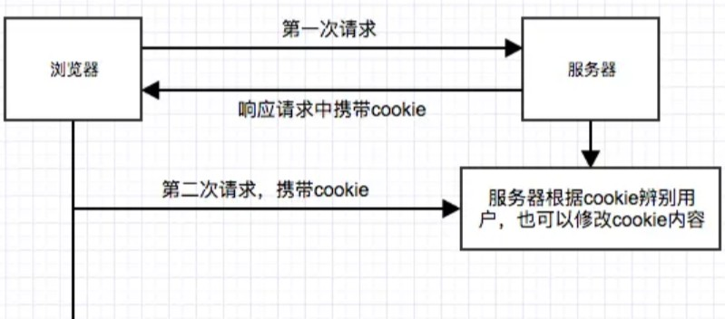

# 计算机网络

## 一、HTTP缓存

### 1.1 相关字段header

**1、Expires**

> 响应头，代表资源的过期时间

**2、Cache-Control**

> 请求/响应头，缓存控制字段，精准控制缓存策略

**3、If-Modified-Since**

> 请求头，资源最近的修改时间。由浏览器告诉服务器。等于上一次服务器返回的Last-Modified

**4、Last-Modified**

> 响应头，资源最近修改时间，由服务器告诉浏览器

**5、Etag**

> 响应头，资源标识，有服务器告诉浏览器。理解为资源内容是否被修改的唯一ID

**6、if-None-Match**

> 请求头，缓存资源标识，由浏览器告诉服务器。等于上一次服务器返回的Etag

总结：

响应头字段：Expire、Cache-Control、Last-Modified、Etag

请求头字段：Cache-Control、Last-Modified-Since、If-None-Match

搭配使用：

Last-Modified和If-Modified-Since

Etag和If-None-Match

### 1.2 解析缓存机制

假设浏览器向服务器请求index.html资源，其中请求头1KB、响应头1KB、资源文件10KB

**1、原型模型**

+ 浏览器请求静态资源（请求头1KB）
+ 服务器读取磁盘文件index.html，返回给浏览器（10KB+1KB响应头 = 11KB）
+ 浏览器重复请求，如此循环...

一个往返，总共花费12KB流量。假设访问10次，岂不是花费120KB流量

缺点：浪费用户流量、消耗服务器性能、每次都要重新下载文件影响用户体验

> js 执行时间相比下载时间要快的多，如果能优化下载时间，用户体验会提升很多。

**2、浏览器增加缓存机制**

+ 浏览器第一次请求index.html，缓存到本地磁盘（12KB）
+ 浏览器再次请求，直接从本地缓存中获取（200状态码），不用向服务器发起请求

优点：大大减少带宽、减少index.html资源下载次数，提高用户体验

缺点：服务器上index.html更新时，浏览器感知不到，拿不到最新的js资源

**3、约定资源过期时间**

服务器和浏览器约定文件过期时间，用Expire字段控制，时间是GMT格式的标准时间

+ 浏览器第一次请求资源(1KB)
+ 服务器把index.html和过期时间Expire发送给浏览器（10 + 1KB）
+ 浏览器记住了Expire

> 在Expire之前，浏览器再次发送请求使用缓存就行，不用去找服务器

优势：过期时间Expire内，为用户节省了流量，减轻了服务器压力。过期之后，能够得到最新的index.html

缺点：缓存过期后，服务器不管index.html有没有变化，都会再次读取并返回给浏览器

**4、服务器返回资源上次修改时间**

注：资源修改时间改变，并不意味着资源内容一定发生了改变

服务器每次返回index.html时，除了返回Expire过期时间，还要返回index.html最近在服务器上的修改时间Last-Modified

+ 浏览器访问index.html（1KB）
+ 服务器返回index.html，并返回Expire和Last-Modified（10 + 1 = 11KB）
+ 当index.html过期后，浏览器带上If-Modified-Since（等于上一次请求的Last-Modified）请求服务器（1KB）：
  + 两者一致，则说明资源无修改，浏览器继续使用本地缓存（304）
  + 不一致，返回index.html + 新的Expire + 新的Last-Modified （11KB）

优点：

检测资源是否修改，没有修直接使用本地缓存，直接省了10KB流量；浏览器总能得到最新的index.html

缺点：

Expire过期时间控制不稳定，因为浏览器端可以随意修改时间，导致缓存使用不精准；

Last-Modified只能进准到秒，如果资源1s内修改了多次，服务器不能准确识别

最重要的是，资源时间修改了，但是资源内容没有改变，浏览器完全可以继续使用缓存


**5、使用相对时间控制，Cache-Control**

服务器除了告诉浏览器Expires，同时告诉浏览器一个相对时间Cache-Control ：max-age = 10秒。意思是10s内，浏览器继续使用本地缓存。

区别：

1、Cache-Control与Expire是否是相同功能的，但是Cache-Control还有更多的拓展空间，可以实现精准控制

2、如果浏览器同时检测到Cache-Control与Expire，会以Cache-Control为准，忽略Expire


**6、增加文件内容对比，引入Etag**

前面提到，Last-Modified只是资源文件的修改时间，有时候资源修改时间变化了，但是内容却不一定变化

规则：

在服务器引入Etag，index.html内容变化，Etag变化；内容不变，Etag不变。可以理解成Etag是资源内容唯一的ID。

在浏览器引入If-None-Match，发送请求时带上该字段，值等于上次请求时服务器返回的Etag

+ 浏览器第一次请求index.html
+ 服务器返回index.html,同时返回绝对过期时间Expire、相对时间Cache-Control ：max-age=10，Last-Modified修改时间，Etag内容修改标识
+ 10秒钟内，浏览器再次请求，直接使用本地
+ 10秒钟后请求，浏览器携带上If-Modified-Since和上次的Etag值 = If-None-Match
+ 服务器直接判断If-None-Match和资源的最新Etag，忽略If-Modified-Since（如果没有 If-None-Match字段，则用它）
+ If-None-Match === 新的Etag，说明资源无修改，继续使用本地缓存（304）


**7、补充**

Cache-Control除了可以设置max-age相对过期时间外，还可以设置成如下几种值：

+ public，资源允许被中间服务器缓存
+ private，资源不允许被中间代理服务器缓存
+ no-cache，浏览器不做缓存检查
+ no-state，浏览器和中间代理服务器都不能缓存资源

## 二、HTTP

### 1、http报文结构

HTTP报文结构：`起始行 + 首部 + 空行 + 实体`

**起始行**

请求报文：方法 + 路径 + http版本，例如：`GET /home HTTP/1.1`

响应报文：http版本 + 状态码 + 原因，例如：`http/1.1 200 OK`

**实体**

指具体的数据，也就是body部分。请求报文对应`请求体`，响应报文对应`响应体`


### 2、请求方法

**请求方法**

| 方法    | 说明                                     |
| ------- | ---------------------------------------- |
| GET     | 获取资源                                 |
| POST    | 提交数据                                 |
| HEAD    | 获取资源的元信息                         |
| PUT     | 修改数据                                 |
| DELETE  | 删除资源                                 |
| TRACE   | 追踪请求/响应的传输路径                  |
| OPTIONS | 列出可对资源实行的请求方法，用来跨域请求 |
| CONNECT | 建立连接隧道，用于代理服务器             |


### 3、URL

URL，全称（Unform Resource Identifier）也就是统一资源标识符，用于区分互联网上的资源

```js
scheme :// host:port path ?query #fragment
```

1、`scheme`表示协议名，必须与`://`连在一起

2、`host:port`表示主机名和端口

3、`path`表示请求路径，标记资源所在位置

4、`query`表示查询的参数，格式`key=val`，多个键值对之间用&隔开

5、`fragment`表示URL所定位的资源内的一个锚点，浏览器可以根据这个锚点跳转到对应的位置

例子：`https://www.baidu.com/home?user=linming&password=123321`

这个例子中`https`是协议，`www.baidu.com`是主机和端口（端口默认443，省略），`/home`是请求路径，`user=linming&password=123321`是query部分

### 4、HTTP特点、缺点

**一、特点**

1、灵活可扩展

​	一个是语义上的自由，只规定了基本格式，比如空格分隔单词，换行分隔字段，其他的各个部分都没有严格的语法限制。另一个是传输形式的多样性，不仅仅可以传输文本，还能传输图片、视频等任意数据，非常方便。

2、可靠传输。

​	HTTP 基于 TCP/IP，因此把这一特性继承了下来。

3、请求-应答。也就是`一发一收`、`有来有回`

4、无状态。

​	这里的状态是指**通信过程的上下文信息**，而每次 http 请求都是独立、无关的，默认不需要保留状态信息。


**二、缺点**

A、无状态

在需要长连接的场景中，需要保存大量的上下文信息，以免传输大量重复的信息，那么这时候无状态就是 http 的缺点了。

但与此同时，另外一些应用仅仅只是为了获取一些数据，不需要保存连接上下文信息，无状态反而减少了网络开销，成为了 http 的优点。

B、明文传输

即协议里的报文(主要指的是头部)不使用二进制数据，而是文本形式。

这当然对于调试提供了便利，但同时也让 HTTP 的报文信息暴露给了外界，给攻击者也提供了便利。`WIFI陷阱`就是利用 HTTP 明文传输的缺点，诱导你连上热点，然后疯狂抓你所有的流量，从而拿到你的敏感信息。

C、队头阻塞问题

当 http 开启长连接时，共用一个 TCP 连接，同一时刻只能处理一个请求，那么当前请求耗时过长的情况下，其它的请求只能处于阻塞状态，也就是著名的**队头阻塞**问题。


## 三、Cookie


### 1、简介

Cookie本质上就是浏览器里存储的一个很小的文本文件，内部以建立键值对的方式来存储信息。



+ **HTTP是无状态的协议**，每次http请求都是独立、无关的，默认不需要保留状态。服务器无法确认当前访问者的身份信息。所以服务器与浏览器为了进行会话跟踪（知道谁在访问我），就必须主动去维护一个状态，这个状态用于告知服务端前后两个请求是否来自同一个浏览器
+ **cookie存储在客户端**：cookie是服务器发送到用户浏览器并保存在本地的一小块数据，它会在浏览器下次向同一服务器再发起请求时被携带发送到服务器上
+ **cookie是不可跨域的**：每个cookie都会绑定单一的域名，无法在别的域名下获取使用


### 2、cookie的属性


| 属性           | 说明                                                         |
| -------------- | ------------------------------------------------------------ |
| **name=value** | 键值对，设置 Cookie 的名称及相对应的值，都必须是**字符串类型** - 如果值为 Unicode 字符，需要为字符编码。 - 如果值为二进制数据，则需要使用 BASE64 编码。 |
| **domain**     | 指定 cookie 所属域名，默认是当前域名                         |
| **path**       | **指定 cookie 在哪个路径（路由）下生效，默认是 '/'**。 如果设置为 `/abc`，则只有 `/abc` 下的路由可以访问到该 cookie，如：`/abc/read`。 |
| **maxAge**     | cookie 失效的时间，单位秒。如果为整数，则该 cookie 在 maxAge 秒后失效。如果为负数，该 cookie 为临时 cookie ，关闭浏览器即失效，浏览器也不会以任何形式保存该 cookie 。如果为 0，表示删除该 cookie 。默认为 -1。 - **比 expires 好用**。 |
| **expires**    | 过期时间，在设置的某个时间点后该 cookie 就会失效。 一般浏览器的 cookie 都是默认储存的，当关闭浏览器结束这个会话的时候，这个 cookie 也就会被删除 |
| **secure**     | 该 cookie 是否仅被使用安全协议传输。安全协议有 HTTPS，SSL等，在网络上传输数据之前先将数据加密。默认为false。 当 secure 值为 true 时，cookie 在 HTTP 中是无效，在 HTTPS 中才有效。 |
| **httpOnly**   | **如果给某个 cookie 设置了 httpOnly 属性，则无法通过 JS 脚本 读取到该 cookie 的信息，但还是能通过 Application 中手动修改 cookie，所以只是在一定程度上可以防止 XSS 攻击，不是绝对的安全** |


### 3、cookie缺点

1、容量缺陷。cookie的体积上限只有4KB，只能用来存储少量信息

2、性能缺陷。每次请求都携带上完整的Cookie，随着请求数增多，会造成巨大的性能浪费

3、安全缺陷。由于Cookie以纯文本的形式在浏览器和服务器中传递，很容易被非法用户截获。在`HttpOnly`为false的情况下，Cookie信息能直接通过JS脚本读取

```js
//读取浏览器中的cookie
console.log(document.cookie)
//写入cookie
document.cookie = 'myname=linming;'
```


### 4、Cookie和Session的区别

**安全性**：Session比Cookie安全，Session是存储在服务器端的，Cookie是存储在客户端的

**存取值的类型不同**：Cookie只支持字符串数据，想要设置其他类型的数据，需要将其转换成字符串，Seesion可以存任意数据类型

**有效期不同**：Cookie可以设置为长时间保持，Session一般失效时间较短，客户端关闭或者Session超时都会失效

**存储大小不同：**单个Cookie保存的数据不能超过4K，Session可存储数据远高于Cookie，但是访问量过多时，会占用很多的服务器资源

### 5、简单demo

```js
const koa = require('koa')
const Router = require('koa-router')
const app = new koa()

const useRouter = new Router({ prefix: '/test' })

useRouter.get('/', (ctx, next) => {
  ctx.cookies.set("name", "linming", {
    maxAge: 60 * 1000
  })
  ctx.body = "hello world";
})

app.use(useRouter.routes())


app.listen('8080', () => {
  console.log("服务器启动成功~");
})
```

